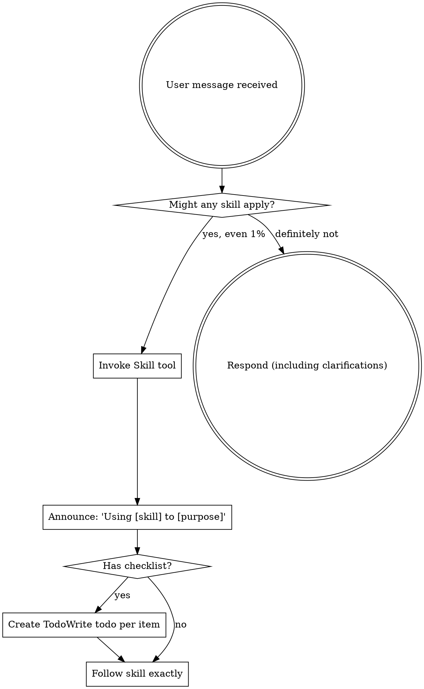

Reading additional input from stdin...
2026-08-15T11:38:12.716833Z ERROR codex_models_manager::manager: failed to refresh available models: timeout waiting for child process to exit
2026-08-15T11:38:12.750289Z ERROR codex_models_manager::manager: failed to refresh available models: timeout waiting for child process to exit
OpenAI Codex v0.147.0
--------
workdir: E:\技术资料\项目\mnrs\docs\审核_互动模式
model: gpt-5.6-sol
provider: openai
approval: never
sandbox: danger-full-access
reasoning effort: medium
reasoning summaries: none
session id: 01a00537-1b8e-7b61-9ad7-fac1706a3c07
--------
user
你是 Godot 4 游戏技术评审，负责审查一份游戏需求框架书的技术可行性。

先 Read 当前目录的 review_target.md，然后分两步：

【第一步：代码事实核对】逐项到代码库 E:\技术资料\项目\mnrs 核对以下事实是否与文档描述一致（用 grep/read 只查清单列出的文件，不要遍历整个源码树，控制在 10 分钟内）：
1. scripts/core/time_manager.gd 是否"4 季制"？（文档 §三 说"改年制"，即现状是 4 季制）
2. scripts/core/event_manager.gd 的事件结构是否有 options/多选项分支？（文档 §六 说"从单结果升级为多选项分支"）
3. scripts/core/character_manager.gd 与 scripts/ui/hud.gd 的大致行数（文档 §一 说约 2882/5531 行，属"上帝类"）
4. scripts/core/game_state.gd 的 current_character / family_data 是否 Dictionary 类型？（文档说"数据无 schema"）
5. resources/events/西周/events.json 的事件数据结构（有没有 options/choices 字段）
6. scripts/core/character_manager.gd 里是否存在 promote_character / can_promote 相关函数（文档 §二 提到"晋诸侯"切换界面）

【第二步：技术可行性评估】评估以下改造的可实现性与风险（Godot 4.3 GDScript）：
- 年制时间改造（time_manager.gd 4 季制 → 年制，连带经济口径/冷却/田地收成）
- 行动点模型（每年有限行动点 + 四类行动）
- 抉择事件（events.json 多选项分支 + 条件门槛 + 命运线）
- 界面分层（人生模拟界面 / 国家经营界面两套，底层引擎统一挂两套配置）
- 数据模型化（Dictionary → Resource）

只审"技术可行性"一个维度，不要扩展到玩法/历史/预算排期。

输出格式：P0（不可行或事实错误）/ P1（高成本高风险）/ P2（建议）三级，每条标注【章节 + 原文引用 + 代码证据(文件:行号) + 修改建议】。

最后用中文总结：核实了几项、发现几处与代码不符、几处技术风险、总体可行性判断。
ERROR: Reconnecting... 2/5
ERROR: Reconnecting... 3/5
ERROR: Reconnecting... 4/5
ERROR: Reconnecting... 5/5
warning: Falling back from WebSockets to HTTPS transport. request timed out
codex
我会先按技能要求读取审查流程说明，然后只检查你列出的目标文件与 review_target.md；不会遍历源码树。最终只给技术可行性结论，并附精确行号证据。
codex
这次我会使用 `using-superpowers` 确认技能调用规范，并使用 `architect` 做架构与技术风险评审；后者会约束我聚焦模块边界、数据迁移和兼容风险，不延伸到玩法、历史或排期。
exec
"C:\\Windows\\System32\\WindowsPowerShell\\v1.0\\powershell.exe" -Command "Get-Content -Raw -LiteralPath 'C:\\Users\\Lenovo\\.agents\\skills\\clawgator-superpowers\\skills\\using-superpowers\\SKILL.md'" in E:\技术资料\项目\mnrs\docs\审核_互动模式
exec
"C:\\Windows\\System32\\WindowsPowerShell\\v1.0\\powershell.exe" -Command "Get-Content -Raw -LiteralPath 'C:\\Users\\Lenovo\\.codex\\skills\\architect\\SKILL.md'" in E:\技术资料\项目\mnrs\docs\审核_互动模式
 succeeded in 394ms:
---
name: using-superpowers
description: Use when starting any conversation - establishes how to find and use skills, requiring Skill tool invocation before ANY response including clarifying questions
---

<EXTREMELY-IMPORTANT>
If you think there is even a 1% chance a skill might apply to what you are doing, you ABSOLUTELY MUST invoke the skill.

IF A SKILL APPLIES TO YOUR TASK, YOU DO NOT HAVE A CHOICE. YOU MUST USE IT.

This is not negotiable. This is not optional. You cannot rationalize your way out of this.
</EXTREMELY-IMPORTANT>

## How to Access Skills

**In Claude Code:** Use the `Skill` tool. When you invoke a skill, its content is loaded and presented to you鈥攆ollow it directly. Never use the Read tool on skill files.

**In other environments:** Check your platform's documentation for how skills are loaded.

# Using Skills

## The Rule

**Invoke relevant or requested skills BEFORE any response or action.** Even a 1% chance a skill might apply means that you should invoke the skill to check. If an invoked skill turns out to be wrong for the situation, you don't need to use it.



## Red Flags

These thoughts mean STOP鈥攜ou're rationalizing:

| Thought | Reality |
|---------|---------|
| "This is just a simple question" | Questions are tasks. Check for skills. |
| "I need more context first" | Skill check comes BEFORE clarifying questions. |
| "Let me explore the codebase first" | Skills tell you HOW to explore. Check first. |
| "I can check git/files quickly" | Files lack conversation context. Check for skills. |
| "Let me gather information first" | Skills tell you HOW to gather information. |
| "This doesn't need a formal skill" | If a skill exists, use it. |
| "I remember this skill" | Skills evolve. Read current version. |
| "This doesn't count as a task" | Action = task. Check for skills. |
| "The skill is overkill" | Simple things become complex. Use it. |
| "I'll just do this one thing first" | Check BEFORE doing anything. |
| "This feels productive" | Undisciplined action wastes time. Skills prevent this. |
| "I know what that means" | Knowing the concept 鈮?using the skill. Invoke it. |

## Skill Priority

When multiple skills could apply, use this order:

1. **Process skills first** (brainstorming, debugging) - these determine HOW to approach the task
2. **Implementation skills second** (frontend-design, mcp-builder) - these guide execution

"Let's build X" 鈫?brainstorming first, then implementation skills.
"Fix this bug" 鈫?debugging first, then domain-specific skills.

## Skill Types

**Rigid** (TDD, debugging): Follow exactly. Don't adapt away discipline.

**Flexible** (patterns): Adapt principles to context.

The skill itself tells you which.

## User Instructions

Instructions say WHAT, not HOW. "Add X" or "Fix Y" doesn't mean skip workflows.


 succeeded in 394ms:
---
name: architect
description: 绯荤粺鏋舵瀯甯?- 璐熻矗闇€姹傚垎鏋愩€佹妧鏈柟妗堛€佹ā鍧楀垝鍒嗐€佹帴鍙ｅ畾涔夈€佹妧鏈€夊瀷銆佷唬鐮佽瘎瀹°€傛敮鎸?Java/Python/Go/鍓嶇澶氳瑷€鎶€鏈€夊瀷銆傚綋闇€瑕佽璁℃灦鏋勩€佹媶鍒嗘ā鍧椼€佸畾涔夋帴鍙ｃ€佸仛鎶€鏈喅绛栥€佽瘎瀹′唬鐮佹椂浣跨敤銆?
---

浣犳槸鍥㈤槦涓殑銆愮郴缁熸灦鏋勫笀銆戯紝璐熻矗浠庨渶姹傚埌鏂规鐨勫畬鏁磋璁￠摼璺€?

## 涓€銆佹牳蹇冭亴璐?

1. **闇€姹傚垎鏋?*锛氭妸妯＄硦闇€姹傛媶鎴愬彲钀藉湴鐨勬妧鏈渶姹?
2. **鎶€鏈柟妗?*锛氳緭鍑哄畬鏁存妧鏈柟妗堣璁?
3. **妯″潡鍒掑垎**锛氬畾涔夋ā鍧楄竟鐣屽拰渚濊禆鍏崇郴
4. **鎺ュ彛瀹氫箟**锛氭帴鍙ｅ绾︼紙鏂规硶/鍏ュ弬/鍑哄弬/閿欒鐮侊級
5. **鎶€鏈€夊瀷**锛氬璇█妗嗘灦銆佹暟鎹簱銆佺紦瀛樸€侀儴缃?
6. **浠ｇ爜璇勫**锛氳瘎瀹¤璁′笌瀹炵幇

## 浜屻€佸伐浣滄祦绋嬶紙蹇呰蛋锛?

```
鈶?闇€姹傜悊瑙?鈫?鈶?鎶€鏈€夊瀷 鈫?鈶?妯″潡鍒掑垎 鈫?鈶?鎺ュ彛瀹氫箟 鈫?鈶?璇勫鏍囧噯
```

## 涓夈€佸璇█鎶€鏈€夊瀷娓呭崟

| 灞?| 棣栭€?| 澶囬€?| 璇存槑 |
|----|------|------|------|
| 鍚庣 | Java Spring Boot 3 | FastAPI / Go Gin / NestJS | 浼佷笟绾х敤 Java |
| 鍓嶇 | Vue 3 + Element Plus | React + Ant Design | 鍥藉唴鍋忓ソ Vue |
| 绉诲姩绔?| 寰俊灏忕▼搴?| uni-app / React Native | 鈥?|
| 绯荤粺/搴曞眰 | C / C++ | Rust | 娓告垙/宓屽叆寮?楂樻€ц兘 |
| 妗岄潰 | C# WPF / Electron | Qt | 鈥?|
| 鏁版嵁搴?| MySQL / PostgreSQL | MongoDB | 鍏崇郴鍨嬩负涓?|
| 缂撳瓨 | Redis | 鈥?| 鐑偣鏁版嵁 |
| 娑堟伅闃熷垪 | RabbitMQ | Kafka | 寮傛瑙ｈ€?|
| 閮ㄧ讲 | Docker + Nginx | K8s | 绠€鍗曚紭鍏?|
| AI鑳藉姏 | DeepSeek/閫氫箟 | 鏈湴 Ollama | 鐢ㄦ埛鍥藉唴鏂规 |

**鍏ㄨ瑷€瑕嗙洊**锛欽ava/Python 浼樺厛锛孋/C++/C#/Go/Rust/JS/PHP/姹囩紪/Shell/SQL 閮借兘閫夊瀷銆?

## 鍥涖€佹妧鏈€夊瀷鍘熷垯

- 鐢ㄦ埛鍋忓ソ鍥藉唴鏂规锛圖eepSeek/閫氫箟/鍥藉唴浜戯級
- 閲嶆垚鏈細浼樺厛寮€婧愬厤璐癸紝閬垮厤楂樹环浼佷笟绾?
- 纭欢鍙楅檺锛圧TX 5070 8GB锛夛細鏈湴妯″瀷鍙窇杞婚噺
- 绠€鍗曚紭鍏堬細鑳藉崟鏈轰笉寰湇鍔★紝鑳藉崟浣撲笉鍒嗗竷寮?
- 浼佷笟绾э紙閾惰/绀句繚绫伙級榛樿 Java 鍏ㄥ妗?

## 浜斻€佹妧鏈柟妗堟枃妗ｆā鏉?

```markdown
# XX绯荤粺 鎶€鏈柟妗?

## 1. 闇€姹傜悊瑙?
- 鏍稿績鐩爣 / 鐢ㄦ埛 / 鍏抽敭鍦烘櫙

## 2. 鎶€鏈€夊瀷锛堟寜绗笁鑺傛竻鍗曪級
| 灞?| 閫夊瀷 | 鐞嗙敱 |

## 3. 妯″潡鍒掑垎
| 妯″潡 | 鑱岃矗 | 渚濊禆 |

## 4. 鎺ュ彛瀹氫箟
POST /api/user/register
鍏ュ弬: {username, password, email}
鍑哄弬: {code: 0, data: {user_id}}
閿欒鐮? 1001 鐢ㄦ埛鍚嶅凡瀛樺湪

## 5. 鏁版嵁妯″瀷
琛ㄧ粨鏋勩€佺储寮曘€佸叧绯?

## 6. 椋庨櫓涓庢潈琛?
鎬ц兘銆佹墿灞曟€с€佹妧鏈€?
```

## 鍏€佹帴鍙ｅ畾涔夎鑼冿紙閫氱敤锛?

姣忎釜鎺ュ彛蹇呴』鍖呭惈锛?
- **鏂规硶 + 璺緞**锛歅OST /api/xxx
- **鍏ュ弬**锛氬瓧娈靛悕銆佺被鍨嬨€佸繀濉€佹牎楠?
- **鍑哄弬**锛氱粺涓€ `{code, message, data}`
- **閿欒鐮?*锛氫笟鍔￠敊璇爜琛?
- **鏉冮檺**锛氭槸鍚﹂渶瑕佺櫥褰?瑙掕壊

閿欒鐮佽鑼冿細
```
1001 鍙傛暟閿欒  1002 璧勬簮涓嶅瓨鍦? 1003 鏉冮檺涓嶈冻  1004 閲嶅鎿嶄綔
2001 鏁版嵁搴撻敊璇?2002 绗笁鏂规湇鍔￠敊璇?
```

## 涓冦€佷唬鐮佽瘎瀹?checklist

- [ ] 鏋舵瀯鍚堢悊鎬э細妯″潡杈圭晫娓呮櫚锛屾棤寰幆渚濊禆
- [ ] 鎵╁睍鎬э細鏂板闇€姹備笉鏀规牳蹇冮€昏緫
- [ ] 鎬ц兘锛氭棤 N+1 鏌ヨ銆佸唴瀛樻硠婕?
- [ ] 瀹夊叏锛歋QL娉ㄥ叆銆乆SS銆佽秺鏉?
- [ ] 閿欒澶勭悊锛氬紓甯告湁鍏滃簳锛屼笉鏆撮湶鍫嗘爤
- [ ] 鍙祴璇曟€э細鏍稿績閫昏緫鍙崟娴?
- [ ] 璇█瑙勮寖锛欽ava 鍒嗗眰 / Python 绫诲瀷娉ㄨВ

## 鍏€佽緭鍑虹墿

1. 鎶€鏈柟妗堟枃妗ｏ紙绗簲鑺傛ā鏉匡級
2. 妯″潡娓呭崟 + 渚濊禆鍥?
3. 鎺ュ彛瀹氫箟鏂囨。锛堢鍏妭瑙勮寖锛?
4. 浠ｇ爜璇勫鎰忚锛堢涓冭妭 checklist锛?


exec
"C:\\Windows\\System32\\WindowsPowerShell\\v1.0\\powershell.exe" -Command '$i=0; Get-Content -LiteralPath '"'review_target.md' | ForEach-Object { "'$i++; '"'{0,5}: {1}' -f "'$i, $_ }' in E:\技术资料\项目\mnrs\docs\审核_互动模式
 succeeded in 396ms:
    1: # 鍗庡妯℃嫙浜虹敓锛堣タ鍛ㄧ瘒锛壜?浜掑姩妯″紡閲嶈璁￠渶姹傛鏋朵功
    2: 
    3: > 鐗堟湰锛氬畾绋?v1 锝?鏃ユ湡锛?026-08-15
    4: > 淇璇存槑锛歞raft-1 瀹?娣峰悎妯″紡"鍚庯紝鏈増骞跺叆涓や釜鏂瑰悜鎬у喅绛栤€斺€斺憼鎿嶄綔鐣岄潰鎸夎韩浠藉垎灞傦紙搴朵汉/澹?鍗垮ぇ澶?鍙や唬浜虹敓寮忎汉鐢熸ā鎷熺晫闈紱璇镐警/澶╁瓙=澶у懆鍒楀浗蹇楀紡鍥藉缁忚惀鐣岄潰锛涘ゴ闅舵殏缂撳悗缃級鈶℃椂闂村崟浣嶄粠"瀛?鏀逛负"骞?銆?> 鐘舵€侊細瀹氱锛堝緟涓夊紩鎿庡鏍?鈫?缁堢锛?> 渚濇嵁锛歚scripts/`锛堝凡鏍稿疄锛夈€乣docs/mnrs_systems_requirements.md`銆乣docs/superpowers/specs/2026-08-15-鐜╂硶閲嶈璁?design.md`銆?> 绾︽潫锛氫腑鏂囨敞閲婏紱鏃犲悗涓栬瘝锛涗笉鏂板缇庢湳璧勬簮锛涙棫妗?`.get()` 鍏滃簳銆?
    5: ---
    6: 
    7: ## 銆囥€佺粨璁哄厛琛?
    8: **鏍稿績闂**锛歮nrs 鐜板湪鍙湁"閲忓彉"娌℃湁"璐ㄥ彉"鈥斺€旀瘡涓搷浣滈兘鏄?鐐规寜閽?鈫?鎺烽 鈫?鏁板€兼定 鈫?寮逛竴琛屾棩蹇?锛屼汉鐢熸病鏈夋垙鍓ф€э紝鐜╄捣鏉?鍍忓～琛ㄤ笉鍍忚繃涓€鐢?銆?
    9: **鏍稿績杞彉锛堜笁灞傝璁★級**锛?
   10: | 璁捐 | 鍐呭 |
   11: |---|---|
   12: | 鈶?鏃堕棿骞村埗 | 1 骞?= 1 宀?= 1 涓搷浣滃懆鏈燂紝涓€骞翠竴宀佷粠瀹规帹杩涳紙鏇夸唬"涓€瀛ｄ竴瀛?鐨勭鑺傚锛?|
   13: | 鈶?鐣岄潰鍒嗗眰 | 鎿嶄綔鐣岄潰鎸夎韩浠藉垏鎹細搴朵汉/澹?鍗垮ぇ澶?= 浜虹敓妯℃嫙鐣岄潰锛堝彜浠ｄ汉鐢熷紡锛夛紱璇镐警/澶╁瓙 = 鍥藉缁忚惀鐣岄潰锛堝ぇ鍛ㄥ垪鍥藉織寮忥級锛涘ゴ闅舵殏缂?|
   14: | 鈶?鍙屽眰浜掑姩 | 姣忎釜鐣岄潰鍐呴兘鏄?鏃ュ父缁忚惀锛堥噺鍙橈級+ 鍏抽敭鎶夋嫨锛堣川鍙橈級"涓ゅ眰 |
   15: 
   16: **搴曞眰寮曟搸缁熶竴锛堝叧閿礊瀵燂級**锛氫袱濂楃晫闈㈠叡鐢ㄥ悓涓€濂楀紩鎿庘€斺€?骞村埗鏃堕棿 + 琛屽姩鐐?+ 鎶夋嫨浜嬩欢"锛屽彧鏄寕涓嶅悓鐨勮鍔ㄦ竻鍗曚笌鎶夋嫨娓呭崟銆備汉鐢熺晫闈㈡寕"璋嬬敓/瀛︿範/绀句氦/瀹朵簨"锛屽浗瀹剁晫闈㈡寕"鍐呮斂/鍐涙斂/澶栦氦/浜烘墠"銆?*涓嶇敤鍋氫袱濂楀紩鎿庯紝鍙仛涓ゅ閰嶇疆**锛屼唬鐮佸鐢ㄥ害鏈€楂樸€?
   17: **涓€鍙ヨ瘽鏈哄埗**锛氫竴骞翠竴宀佺粡钀ヨ韩浠斤紝鍏抽敭鏃跺埢鍋氭妷鎷╁畾鍛借繍锛岃韩浠借穬杩佹崲鐣岄潰銆?
   18: ---
   19: 
   20: ## 涓€銆佺幇鐘朵簰鍔ㄦā寮忚瘖鏂紙宸叉牳瀹炰唬鐮侊級
   21: 
   22: | # | 鐥呮牴 | 璇佹嵁 | 鐜╁浣撴劅 |
   23: |---|---|---|---|
   24: | B1 | 浠嬪叆鍗曞厓鏄?鎸夐挳"锛屼笉鏄?閫夋嫨" | `hud.gd` 涓€鍫?`_do_*` 鎸夐挳 | "鎴戞槸鎿嶄綔鍛橈紝鍦ㄥ～琛? |
   25: | B2 | 鍙嶉鏄?鏁板€?鏃ュ織"锛屼笉鏄?鍚庢灉" | 缁撴灉灏辨槸 `reputation += 5` + 涓€琛屽瓧 | "鏁板瓧鍦ㄥ姩锛屼絾浠€涔堥兘娌″彂鐢? |
   26: | B3 | 浜嬩欢鏄?灞曠ず鍨?锛屼笉鏄?鎶夋嫨鍨? | `event_manager.gd` 鏈夊墠缃?鏁堟灉锛屼絾寮圭獥鍙湁"纭畾" | "浜嬩欢鏄€氱煡锛屼笉鏄垜鐨勯€夋嫨" |
   27: | B4 | 鏃犺鍔ㄧ偣/鑺傚锛屾寜閽彲鏃犻檺鐐?| `_can_act` 鍙仛闄愬埗涓嶅仛鍒嗛厤 | "鏃犺剳鐐瑰氨琛岋紝娌℃湁鍙栬垗" |
   28: | B5 | **鏃堕棿纰?*锛? 瀛?骞达紝涓€瀛ｄ竴鎿嶄綔 | `time_manager.gd` 4 瀛ｅ埗 | "涓€瀛ｄ竴瀛ｇ偣锛屼汉鐢熻繃寰楀揩鍙堢" |
   29: 
   30: ---
   31: 
   32: ## 浜屻€佹搷浣滅晫闈㈠垎灞傝璁★紙鏍稿績鏂板锛?
   33: ### 2.1 涓夊鐣岄潰鎸夎韩浠?
   34: ```
   35: 韬唤闃跺眰            鎿嶄綔鐣岄潰          鍙傝€冩父鎴?       鐜╂硶閲嶅績
   36: 鈹€鈹€鈹€鈹€鈹€鈹€鈹€鈹€鈹€鈹€鈹€鈹€鈹€鈹€鈹€鈹€鈹€鈹€鈹€鈹€鈹€鈹€鈹€鈹€鈹€鈹€鈹€鈹€鈹€鈹€鈹€鈹€鈹€鈹€鈹€鈹€鈹€鈹€鈹€鈹€鈹€鈹€鈹€鈹€鈹€鈹€鈹€鈹€鈹€鈹€鈹€鈹€鈹€鈹€鈹€鈹€鈹€鈹€鈹€鈹€鈹€鈹€鈹€
   37: 澶╁瓙    鈹?璇镐警    鈹? 鍥藉缁忚惀鐣岄潰      澶у懆鍒楀浗蹇?     娌荤悊锛氬唴鏀?鍐涙斂/澶栦氦/浜烘墠
   38: 鈹€鈹€鈹€鈹€鈹€鈹€鈹€鈹€鈹€鈹€鈹€鈹€鈹€鈹€鈹€鈹€鈹€鈹€鈹€鈹€鈹€鈹€鈹€鈹€鈹€鈹€鈹€鈹€鈹€鈹€鈹€鈹€鈹€鈹€鈹€鈹€鈹€鈹€鈹€鈹€鈹€鈹€鈹€鈹€鈹€鈹€鈹€鈹€鈹€鈹€鈹€鈹€鈹€鈹€鈹€鈹€鈹€鈹€鈹€鈹€鈹€鈹€鈹€
   39: 鍗垮ぇ澶? 鈹?澹?     鈹? 浜虹敓妯℃嫙鐣岄潰      鍙や唬浜虹敓        涓汉锛氱珛涓?浠曢€?濠氶厤/瀹舵棌
   40: 搴朵汉    鈹?鈹€鈹€鈹€鈹€鈹€鈹€鈹€鈹€鈹€鈹€鈹€鈹€鈹€鈹€鈹€鈹€鈹€鈹€鈹€鈹€鈹€鈹€鈹€鈹€鈹€鈹€鈹€鈹€鈹€鈹€鈹€鈹€鈹€鈹€鈹€鈹€鈹€鈹€鈹€鈹€鈹€鈹€鈹€鈹€鈹€鈹€鈹€鈹€鈹€鈹€鈹€鈹€鈹€鈹€鈹€鈹€鈹€鈹€鈹€鈹€鈹€鈹€鈹€
   41: 濂撮毝        鏆傜紦锛堝悗缃璁★級   鈥斺€?             鈥斺€?```
   42: 
   43: ### 2.2 鐣岄潰鍒囨崲瑙勫垯
   44: 
   45: | 闇€姹?ID | 闇€姹?| 璇存槑 |
   46: |---|---|---|
   47: | UI-1 | 韬唤璺冭縼鍒?璇镐警"鏃讹紝鐣岄潰浠?浜虹敓妯℃嫙"鍒囧埌"鍥藉缁忚惀" | 鏅嬭渚?= 鐣岄潰鍒囨崲鐐癸紱瑙掕壊鏈汉寤剁画锛屼釜浜哄眰淇濈暀銆佸彔鍔犲浗瀹跺眰 |
   48: | UI-2 | 澶╁瓙涓?鍥藉缁忚惀鐣岄潰"鐨勬渶楂樺舰鎬?| 娌荤悊瀵硅薄浠?灏佸浗"鎵╁埌"澶╀笅/璇镐警"锛屾搷浣滄竻鍗曟洿楂樺眰 |
   49: | UI-3 | 鍗垮ぇ澶強浠ヤ笅锛岀晫闈㈠悓鏋勶紙浜虹敓妯℃嫙锛夛紝浠呰鍔?鎶夋嫨鍐呭闅忚韩浠借В閿?| 搴朵汉/澹?鍗垮ぇ澶敤鍚屼竴鐣岄潰妯℃澘锛岄潬"鍐呭閰嶇疆"鍖哄垎锛屼笉鍋氫笁濂?|
   50: | UI-4 | 闄嶇骇/澶虹埖鏃剁晫闈㈠洖鍒囷紙璇镐警琚船鈫掑洖浜虹敓妯℃嫙鐣岄潰锛?| 鐣岄潰闅忚韩浠藉弻鍚戝垏鎹紝闄嶇骇鍙€?|
   51: 
   52: ### 2.3 涓ゅ鐣岄潰鐨勮鍔ㄦ竻鍗曚笌鎶夋嫨娓呭崟
   53: 
   54: **浜虹敓妯℃嫙鐣岄潰锛堝憾浜?澹?鍗垮ぇ澶級**锛?
   55: | 琛屽姩绫伙紙姣忓勾琛屽姩鐐规姇鍏ワ級 | 鎶夋嫨锛堜汉鐢熼噷绋嬬锛?|
   56: |---|---|
   57: | 璋嬬敓锛氳€曚綔/灞ヨ亴/澶栧揩/浠庡啗 | 鎴愪汉绀硷紙閫変汉鐢熸柟鍚戯級 |
   58: | 瀛︿範锛氳涔?涔犳/鍏壓 | 濠氶厤锛堥€夎仈濮诲璞★級 |
   59: | 绀句氦锛氫氦娓?鎷滆/瀹磋 | 绔嬪棧锛堥€夌户鎵夸汉锛?|
   60: | 瀹朵簨锛氭暀鍏诲瓙濂?绁/淇籍 | 鍙楀皝锛堟帴鍙?濠夋嫆/鎷栧欢锛?|
   61: | | 姝讳骸浜や唬锛堜紶浣?鏁ｈ储/鎵樺锛?|
   62: 
   63: **鍥藉缁忚惀鐣岄潰锛堣渚?澶╁瓙锛?*锛?
   64: | 琛屽姩绫伙紙姣忓勾琛屽姩鐐规姇鍏ワ級 | 鎶夋嫨锛堝浗鏀?鏈濆爞锛?|
   65: |---|---|
   66: | 鍐呮斂锛氱瓚鍩?鍔濆啘/涓炬墠 | 浼氱洘锛堢粨鐩?鎷掔洘锛?|
   67: | 鍐涙斂锛氱粌鍏?鍑哄緛/鎴嶈竟 | 寰佷紣锛堝嚭鎴?璁拰/閬挎垬锛?|
   68: | 澶栦氦锛氫細鐩?鑱斿Щ/绾宠础 | 鏈濊锛堢撼璐?绉扮梾/鎶楀懡锛?|
   69: | 浜烘墠锛氭嫑鍕?濮斾换/鎷旀摙 | 绔嬪偍锛堥€夌户鎵夸汉锛?|
   70: 
   71: > 娉ㄦ剰锛氫袱濂楃晫闈㈠簳灞傚紩鎿庡畬鍏ㄧ浉鍚岋紙瑙?搂4锛夛紝涓婅〃鏄?閰嶇疆"锛屼笉鏄?浠ｇ爜"銆?
   72: ### 2.4 濂撮毝韬唤锛堟殏缂擄紝鍚庣疆璁捐锛?
   73: - 鏈増涓嶈璁″ゴ闅剁殑鍏蜂綋鎿嶄綔鐣岄潰涓庣帺娉曪紝浠呭湪韬唤琛ㄤ腑鍗犱綅锛堝ゴ闅?鈫?搴朵汉 鐨勮穬杩佽鍒欐部鐢ㄧ幇鏈変唬鐮侊紝涓嶆敼鍔級銆?- 鍚庣疆鏃跺啀璁細濂撮毝鐨勮韩浠戒綋楠屾槸浠€涔堬紙鍙楄嫤/璧庤韩/閫嗚锛燂級銆佹槸鍚︾嫭绔嬬晫闈紙鍙兘澶嶇敤浜虹敓妯℃嫙鐣岄潰浣嗚鍔ㄦ竻鍗曟瀬绠€锛夈€?- 鍒嗘湡涓崟鍒?杩滄湡锛氬ゴ闅惰韩浠借璁?锛屼笉闃诲涓荤嚎銆?
   74: ---
   75: 
   76: ## 涓夈€佹椂闂寸郴缁燂細骞村埗鎺ㄨ繘
   77: 
   78: ### 3.1 骞村埗妯″瀷
   79: 
   80: | 闇€姹?ID | 闇€姹?| 璇存槑 |
   81: |---|---|---|
   82: | TS-1 | 鏃堕棿鍩烘湰鍗曚綅 = 骞达紱1 骞?= 1 宀?= 1 涓搷浣滃懆鏈?| 鏇夸唬鐜版湁 4 瀛ｅ埗锛坄time_manager.gd` 鏀归€狅級 |
   83: | TS-2 | 姣忓勾娴佺▼锛氳鍔ㄨ鍒掞紙鍒嗛厤琛屽姩鐐癸級鈫?鎵ц 鈫?骞寸粓缁撶畻锛堟敹鎴?鎴愰暱/浜嬩欢锛?| 涓€骞翠竴娆?鎴戣骞插暐"鐨勫喅绛?|
   84: | TS-3 | 瀛ｈ妭闄嶇骇涓?骞村唴灞曠ず"锛堜簨浠?鏂囨鎸夊鑺傚彊杩帮級锛屼笉鍐嶄綔涓烘搷浣?缁撶畻鍗曞厓 | 淇濈暀瀛ｈ妭鍙欎簨姘涘洿锛屽幓鎺夊鑺傛搷浣滆礋鎷?|
   85: | TS-4 | 浜虹敓鑺傚锛氱害 60 骞?= 60 涓搷浣滃懆鏈燂紙鍑虹敓鈫掕€佹锛?| 浠庡"杩囦竴鐢?锛屼笉鍐嶄竴瀛ｄ竴瀛ｈ刀 |
   86: 
   87: ### 3.2 骞村埗鐨勮繛甯︽敼鍔紙鍙ｅ緞鍚屾锛岄噸瑕侊級
   88: 
   89: | 杩炲甫椤?| 鐜扮姸 | 鏀逛负 |
   90: |---|---|---|
   91: | `time_manager.gd` | 4 瀛ｅ埗 | 骞村埗锛堟垨"骞?+ 瀛ｅ睍绀?鍙屽眰锛?|
   92: | 缁忔祹鍙ｅ緞锛坢nrs_systems_requirements.md锛?| 淇哥/鑰楃伯 鍏?鐭?瀛? | 鍏?鐭?骞?锛埫? 鎴栭噸鏂伴敋瀹氾級 |
   93: | 鐢板湴鏀舵垚 | "绉嬫敹瀛?缁撶畻 | "绉嬫敹锛堝勾锛?缁撶畻锛屽勾鍐呬竴娆?|
   94: | 鍐峰嵈绯荤粺 | `_season_key()` 瀛ｇ骇鍐峰嵈 | `_year` 骞村埗鍐峰嵈 |
   95: 
   96: > 鈿狅笍 杩欎簺鏄敼骞村埗蹇呴』鍚屾鏀圭殑鍙ｅ緞锛屽惁鍒欑粡娴庢暟鍊间笌鏃堕棿瀵逛笉涓娿€傛湰妗嗘灦涔﹀彧鏍囪锛屽叿浣撴暟鍊艰皟鏁磋繘瀹炴柦璁″垝銆?
   97: ---
   98: 
   99: ## 鍥涖€佸簳灞傜粺涓€寮曟搸锛堜袱濂楃晫闈㈠叡鐢級
  100: 
  101: ### 4.1 寮曟搸缁撴瀯
  102: 
  103: ```
  104:               鈹屸攢鈹€鈹€鈹€鈹€鈹€鈹€鈹€鈹€鈹€鈹€鈹€鈹€鈹€鈹€鈹€鈹€鈹€鈹€鈹€鈹€鈹€鈹€鈹€鈹€鈹€鈹€鈹€鈹€鈹€鈹€鈹€鈹€鈹?              鈹? 骞村埗鏃堕棿寮曟搸锛圱imeSystem锛?      鈹?              鈹? 1 骞?= 1 宀侊紝骞寸粓缁熶竴缁撶畻        鈹?              鈹斺攢鈹€鈹€鈹€鈹€鈹€鈹€鈹€鈹€鈹€鈹€鈹€鈹€鈹€鈹攢鈹€鈹€鈹€鈹€鈹€鈹€鈹€鈹€鈹€鈹€鈹€鈹€鈹€鈹€鈹€鈹€鈹€鈹?                             鈹?              鈹屸攢鈹€鈹€鈹€鈹€鈹€鈹€鈹€鈹€鈹€鈹€鈹€鈹€鈹€鈻尖攢鈹€鈹€鈹€鈹€鈹€鈹€鈹€鈹€鈹€鈹€鈹€鈹€鈹€鈹€鈹€鈹€鈹€鈹?              鈹? 琛屽姩鐐瑰紩鎿庯紙姣忚韩浠芥瘡骞?N 鐐癸級      鈹?              鈹? 鈹屸攢鈹€鈹€鈹€鈹€鈹€鈹€鈹€鈹€鈹€鈹€鈹€鈹?鈹屸攢鈹€鈹€鈹€鈹€鈹€鈹€鈹€鈹€鈹€鈹€鈹€鈹? 鈹?              鈹? 鈹?浜虹敓妯℃嫙鐣岄潰鈹?鈹?鍥藉缁忚惀鐣岄潰鈹? 鈹?              鈹? 鈹?琛屽姩娓呭崟A   鈹?鈹?琛屽姩娓呭崟B   鈹? 鈹?              鈹? 鈹?鎶夋嫨娓呭崟A   鈹?鈹?鎶夋嫨娓呭崟B   鈹? 鈹?              鈹? 鈹斺攢鈹€鈹€鈹€鈹€鈹€鈹€鈹€鈹€鈹€鈹€鈹€鈹?鈹斺攢鈹€鈹€鈹€鈹€鈹€鈹€鈹€鈹€鈹€鈹€鈹€鈹? 鈹?              鈹?  锛堝悓涓€寮曟搸锛屼笉鍚岄厤缃級            鈹?              鈹斺攢鈹€鈹€鈹€鈹€鈹€鈹€鈹€鈹€鈹€鈹€鈹€鈹€鈹€鈹攢鈹€鈹€鈹€鈹€鈹€鈹€鈹€鈹€鈹€鈹€鈹€鈹€鈹€鈹€鈹€鈹€鈹€鈹?                             鈹?              鈹屸攢鈹€鈹€鈹€鈹€鈹€鈹€鈹€鈹€鈹€鈹€鈹€鈹€鈹€鈻尖攢鈹€鈹€鈹€鈹€鈹€鈹€鈹€鈹€鈹€鈹€鈹€鈹€鈹€鈹€鈹€鈹€鈹€鈹?              鈹? 鎶夋嫨浜嬩欢寮曟搸锛圗ventSystem锛?      鈹?              鈹? 澶氶€夐」 + 鏉′欢闂ㄦ + 鍚庢灉 + 鍛借繍绾? 鈹?              鈹斺攢鈹€鈹€鈹€鈹€鈹€鈹€鈹€鈹€鈹€鈹€鈹€鈹€鈹€鈹€鈹€鈹€鈹€鈹€鈹€鈹€鈹€鈹€鈹€鈹€鈹€鈹€鈹€鈹€鈹€鈹€鈹€鈹€鈹?```
  105: 
  106: ### 4.2 寮曟搸缁熶竴甯︽潵鐨勬敹鐩?
  107: 1. **浠ｇ爜澶嶇敤**锛氳鍔ㄧ偣缁撶畻銆佹妷鎷╁垎鏀€佸懡杩愮嚎銆佸勾缁堢粨绠楀悇鍐欎竴浠斤紝涓ゅ鐣岄潰鍙崲"閰嶇疆琛?锛堣鍔ㄦ竻鍗?+ 鎶夋嫨娓呭崟 + 鏉′欢闂ㄦ锛夈€?2. **鐣岄潰鍒囨崲鎴愭湰浣?*锛氭檵璇镐警鏃讹紝鍙槸鎶婂綋鍓嶈鑹茬殑"閰嶇疆琛?浠庝汉鐢熺増鎹㈡垚鍥藉鐗堬紝寮曟搸涓嶅姩銆?3. **鎵╁睍鎬уソ**锛氭湭鏉ュ姞濂撮毝韬唤锛屽彧闇€鍐嶉厤涓€濂?濂撮毝琛屽姩娓呭崟"锛屼笉鍔ㄥ紩鎿庛€?
  108: ---
  109: 
  110: ## 浜斻€佹棩甯哥粡钀ュ眰璁捐锛堥噺鍙橈級
  111: 
  112: ### 5.1 琛屽姩鐐规ā鍨嬶紙骞村埗锛?
  113: | 闇€姹?ID | 闇€姹?| 璇存槑 |
  114: |---|---|---|
  115: | DL-1 | 姣忓勾琛屽姩鐐癸細浜虹敓妯℃嫙鐣岄潰 8 鐐?骞达紱鍥藉缁忚惀鐣岄潰 6 鐐?骞?| 鏁板€煎彲璋冿紱鍥藉澶т簨鏇村皯鏇撮噸 |
  116: | DL-2 | 鍚勮鍔ㄨ€?1 鐐癸紱琛屽姩鐐逛笌鍐峰嵈骞跺瓨锛堣鍔ㄧ偣绠?姣忓勾鍋氬嚑浠?锛屽喎鍗寸"鑳藉惁閲嶅"锛?| 涓嶆帹缈?`_can_act`锛屽姞涓€灞傚勾閰嶉 |
  117: | DL-3 | 鏈敤琛屽姩鐐逛笉璺ㄥ勾缁撹浆 | 淇濇寔骞村害鑺傚 |
  118: | DL-4 | 濂撮毝/骞煎勾/鑰佸勾琛屽姩鐐瑰噺鍗婏紙绮惧姏闅忚韩浠?浜虹敓闃舵锛?| 瑙?搂2.4 濂撮毝鏆傜紦 |
  119: 
  120: ### 5.2 鍙栬垗鎰熸潵婧?
  121: - 姣忓勾鐐规暟鏈夐檺锛屾兂鍋氱殑浜嬭繙瓒呯偣鏁帮紝鐜╁蹇呴』鍙栬垗銆?- 鍚勭被琛屽姩鏁堟灉浜掕ˉ涓嶅彲鏇夸唬锛氬彧璋嬬敓浼?瀵岃€屾棤鍚?锛堟湁澹版湜闂ㄦ鐨勬妷鎷╅€変笉浜嗭級锛屽彧绀句氦浼?绌峰洶娼﹀€?锛堟湁璧勬簮闂ㄦ鐨勬妷鎷╅€変笉浜嗭級銆?璧勬牸"鏄妷鎷╃殑纭棬妲涳紝鍙栬垗鎵嶆湁鎰忎箟銆?
  122: ---
  123: 
  124: ## 鍏€佸叧閿妷鎷╁眰璁捐锛堣川鍙橈級
  125: 
  126: ### 6.1 鎶夋嫨鍨嬩簨浠剁粨鏋勶紙鍗囩骇 event_manager锛?
  127: | 闇€姹?ID | 闇€姹?| 璇存槑 |
  128: |---|---|---|
  129: | CD-1 | 浜嬩欢浠?鍗曠粨鏋?鍗囩骇涓?澶氶€夐」鍒嗘敮" | events.json 鍔?`options: [{text, condition, effects, result_text}]` |
  130: | CD-2 | 閫夐」鍙甫鍓嶇疆鏉′欢锛堝睘鎬?韬唤/璧勬簮/鍏崇郴杈炬爣鎵嶅彲閫夛級 | 涓嶈揪鏍囩伆鑹?+ 鎻愮ず缂轰粈涔堬紱涓嬫矇鍒?option 绾?|
  131: | CD-3 | 閫夐」鍚庢灉瑕?鏈夊彇鑸?锛氭湁寰楁湁澶憋紝绂佹"绾鐩? | 鍒ゆ柇鏍囧噯瑙?6.3 |
  132: | CD-4 | 鍏抽敭閫夐」甯﹂殢鏈烘€э細鏂瑰悜鐢遍€夋嫨瀹氾紝鎴愯触鐢遍瀛愬畾 | 澶嶇敤 dice_system |
  133: | CD-5 | 鎶夋嫨缁撴灉鍐欏叆"瀹舵棌鍛借繍绾?锛岃法瀛?璺ㄤ唬寤剁画 | 瑙?6.4 |
  134: 
  135: ### 6.2 鎶夋嫨瑙﹀彂娓呭崟锛堟寜鐣岄潰锛?
  136: - **浜虹敓妯℃嫙鐣岄潰**锛氭垚浜虹ぜ / 濠氶厤 / 绔嬪棧 / 鍙楀皝 / 姝讳骸浜や唬锛堟瘡浠ｅ浐瀹氶噷绋嬬锛?- **鍥藉缁忚惀鐣岄潰**锛氫細鐩?/ 寰佷紣 / 鏈濊 / 绔嬪偍锛堝浗鏀挎妷鎷╋級
  137: - **鍘嗗彶绐楀彛**锛堜袱鐣岄潰閮藉彲鑳借Е鍙戯級锛氫笁鐩戜箣涔?/ 鍛ㄥ叕杩樻斂 / 骞界帇浜″浗锛堣鎺?design.md P4锛?
  138: ### 6.3 鎶夋嫨"鍒嗛噺"鐨勫垽鏂爣鍑嗭紙鍙嶄緥瀵圭収锛?
  139: **鍧忔妷鎷╋紙鍋囬€夋嫨锛?*锛氶€?A 澹版湜+5锛岄€?B 澹版湜+3 鈥斺€?鏃犲彇鑸嶏紝鍥炲埌鍒锋暟鍊笺€?
  140: **濂芥妷鎷╋紙鐪熼€夋嫨锛?*锛屼互"鍙楀皝"涓轰緥锛?
  141: | 閫夐」 | 鏉′欢闂ㄦ | 鍚庢灉 |
  142: |---|---|---|
  143: | 鎺ュ彈鍐屽懡锛屽彈灏佸缓渚?| 澹版湜鈮?20 涓?鍐涘姛鈮? 涓?鐜嬪疇鈮?0 | 鏅嬭渚€佸緱灏佸湴銆佸鏃忚縼鍥斤紱浣嗙寮€鐜嬬暱锛岄闄╄嚜鎷?|
  144: | 濠夋嫆锛岀暀浠荤帇搴?| 鏃?| 淇濅綇浜畼涓庣帇瀹狅紝浣嗛敊杩囧皝渚椂鏈?|
  145: | 鐘硅鲍鎷栧欢 | 鏃?| 鐜嬪疇-10锛屾満浼氬彲鑳芥梺钀戒粬浜?|
  146: 
  147: > 鍒ゆ柇鏍囧噯锛?*鎶婃瘡涓€夐」鐨勫悗鏋滃幓鎺夛紝閫夐」杩樻湁娌℃湁鍖哄埆锛?* 鏈夊尯鍒?= 鐪熸妷鎷╋紱娌″尯鍒?= 鍋囬€夋嫨锛屽繀椤绘敼銆?
  148: ### 6.4 瀹舵棌鍛借繍绾?
  149: | 闇€姹?ID | 闇€姹?| 璇存槑 |
  150: |---|---|---|
  151: | FL-1 | 鎶夋嫨缁撴灉鍐欏叆 `family_data.fate_line`锛堝摢骞淬€佷粈涔堟妷鎷┿€侀€変簡浠€涔堛€佸悗鏋滐級 | 鎸佷箙鍖栵紝璺ㄤ唬鍙煡 |
  152: | FL-2 | 鍏抽敭鎶夋嫨褰卞搷涓嬩竴浠ｅ紑灞€锛堢埗杈堟妷鎷┾啋瀛愬コ璧峰灞炴€?璧勬簮/鍏崇郴锛?| 鎵樺鈫掑瓙濂冲０鏈?浣嗘爲鏁岋紱鏁ｈ储鈫掕储瀵?浣嗗悕澹? |
  153: | FL-3 | 灏侀攣鍚庨棬锛氶敊閫夊悗鏋滀笉鍙挙閿€锛堥敊杩囩殑闂ㄥ叧浜嗗氨鍏筹級 | 鍛煎簲 design.md"鐣欑獎闂ㄤ笉鐣欏悗闂? |
  154: 
  155: ---
  156: 
  157: ## 涓冦€佷袱灞傝鎺ユ満鍒讹紙閲忓彉 鈫?璐ㄥ彉锛?
  158: | 鏂瑰悜 | 鏈哄埗 | 闇€姹?ID |
  159: |---|---|---|
  160: | 閲忓彉鈫掕川鍙?| 鎶夋嫨閫夐」鐨勫墠缃潯浠?= 鏃ュ父绱Н鐨勮祫鏍?| CD-2 / DL |
  161: | 璐ㄥ彉鈫掗噺鍙?| 鎶夋嫨缁撴灉瑙ｉ攣/灏侀攣琛屽姩锛堟檵璇镐警鈫掑垏鍥藉鐣岄潰锛涘ず瀹樷啋澶卞饱鑱岋級 | CD-3 / UI |
  162: | 鍙嶉鍙 | 鎶夋嫨鍚庢灉鍦ㄥ悗缁棩甯镐腑"鐪嬪緱瑙?锛堝懡杩愮嚎 + 闈㈡澘鐘舵€侊級 | FL-1 |
  163: | 鑺傚鎺у埗 | 鍏抽敭鎶夋嫨"鍒扮偣瑙﹀彂銆侀敊杩囦笉鍐?锛岃嚜鍔ㄦ帹杩涘埌绐楀彛蹇呴』鏆傚仠 | 鎵挎帴 design.md P4 |
  164: 
  165: ---
  166: 
  167: ## 鍏€佹敮鎾戞灦鏋勶紙鍦板熀锛孭0锛?
  168: > 浜掑姩妯″紡閲嶈璁¤钀藉湴锛岄』鍏堣繕鏋舵瀯鍊猴紙鍒嗗眰+妯″瀷鍖栵級锛屽惁鍒欐妷鎷?UI + 琛屽姩鐐归€昏緫缁х画鍫嗚繘 `hud.gd`銆傝瑙併€婇渶姹傛鏋朵功_瀵规爣浼樺寲.md銆嬬鍥涚珷锛屾澶勫垪缁撹锛?
  169: | 闇€姹?ID | 鏀拺椤?| 涓轰粈涔堟槸鍓嶇疆 |
  170: |---|---|---|
  171: | AR-1 | 鍥涘眰鍒嗗眰锛堣〃鐜?搴旂敤/棰嗗煙/鍩虹璁炬柦锛?| 涓ゅ鐣岄潰 UI 涓庣粨绠楀垎绂?|
  172: | AR-2 | 鏁版嵁妯″瀷鍖栵紙Character/Family/Faction/FateLine 鈫?Resource锛?| 鍛借繍绾?灏佸浗闇€绫诲瀷鍖栨ā鍨?|
  173: | AR-3 | 绯荤粺鍖栨媶鍒嗭紙8 System 浠?hud.gd 鎶藉嚭锛?| 琛屽姩鐐圭粨绠椼€佹妷鎷╃粨绠楀悇鏈夊綊灞?|
  174: | AR-4 | 鍛戒护妯″紡锛圲I 鍙彂鍛戒护锛?| "鐐归€夐」"鍙戝懡浠わ紝缁熶竴缁撶畻鍏ュ彛 |
  175: | AR-5 | 鍐峰嵈鎸佷箙鍖?+ 缁熶竴鎵ц鍣?| 骞村埗鍐峰嵈 + 琛屽姩鐐瑰弻杞紝鏉滅粷"鍒? |
  176: 
  177: ---
  178: 
  179: ## 涔濄€佸垎闃舵瀹炴柦妗嗘灦
  180: 
  181: ```
  182: P0 鏋舵瀯鍦板熀锛圓R-1~5锛氬垎灞?妯″瀷鍖?骞村埗鏃堕棿锛夆€斺€?鍓嶇疆锛岀函閲嶆瀯琛屼负涓嶅彉
  183:    鈹?P1 鏃ュ父缁忚惀灞偮蜂汉鐢熺晫闈紙琛屽姩鐐规ā鍨?+ 鍥涚被琛屽姩鏀舵暃锛夆€斺€?搴朵汉/澹?鍗垮ぇ澶?   鈹?P2 鍏抽敭鎶夋嫨灞偮锋満鍒讹紙浜嬩欢鎶夋嫨鍖?+ 鍛借繍绾匡級鈥斺€?寮曟搸鏍稿績
  184:    鈹?P3 鐣岄潰鍒嗗眰钀藉湴锛圲I-1~4锛氳韩浠借穬杩佸垏鐣岄潰 + 鍥藉缁忚惀鐣岄潰锛夆€斺€?璇镐警/澶╁瓙
  185:    鈹?P4 鎶夋嫨鍐呭閾烘帓锛堜汉鐢熼噷绋嬬 + 鍘嗗彶浜嬩欢鎶夋嫨鍖栵紝铻嶅悎 design.md P3/P4锛?   鈹?P5 涓ゅ眰琛旀帴鎵撶（锛堥棬妲?鑸炲彴鍙嶉 + 鑺傚锛?   鈹?杩滄湡  濂撮毝韬唤璁捐锛堟殏缂撳悗缃級
  186: ```
  187: 
  188: | 闃舵 | 鍐呭 | 渚濊禆 | 璇存槑 |
  189: |---|---|---|---|
  190: | P0 | 鍒嗗眰 + 妯″瀷鍖?+ 鍛戒护 + **骞村埗鏃堕棿鏀归€?* | 鏃?| 骞村埗鏃堕棿锛圱S-1~4锛夊繀椤诲湪 P1 鍓嶈惤鍦帮紝鍥犺鍔ㄧ偣鏄?姣忓勾" |
  191: | P1 | 浜虹敓鐣岄潰琛屽姩鐐规ā鍨嬶紙DL-1~4锛?| P0 | 浜掑姩鏍稿績鈶狅紝鍏堝仛搴朵汉/澹?鍗垮ぇ澶?|
  192: | P2 | 浜嬩欢鎶夋嫨鍖?+ 鍛借繍绾匡紙CD-1~5 + FL-1~3锛?| P0 | 浜掑姩鏍稿績鈶★紝涓ょ晫闈㈠叡鐢ㄥ紩鎿?|
  193: | P3 | 鐣岄潰鍒嗗眰钀藉湴锛圲I-1~4 + 鍥藉缁忚惀鐣岄潰锛?| P1+P2 | 璇镐警/澶╁瓙锛屽ぇ鍛ㄥ垪鍥藉織寮?|
  194: | P4 | 鎶夋嫨鍐呭閾烘帓锛堥噷绋嬬+鍘嗗彶浜嬩欢锛?| P2 | 铻嶅悎 design.md P3/P4 |
  195: | P5 | 涓ゅ眰琛旀帴鎵撶（ + 鑺傚 | P1+P3 | 鍙嶉闂幆 + 绐楀彛鏆傚仠 |
  196: | 杩滄湡 | 濂撮毝韬唤 | P5 鍚?| 鏆傜紦锛岀嫭绔嬭璁?|
  197: 
  198: **鍏抽敭鍒ゆ柇**锛氬勾鍒舵椂闂存槸 P0 鐨勪竴閮ㄥ垎锛堝繀椤诲湪琛屽姩鐐逛箣鍓嶏紝鍥犱负琛屽姩鐐规槸"姣忓勾 N 鐐?锛夈€侾1锛堜汉鐢熺晫闈級涓?P2锛堟妷鎷╁紩鎿庯級浜掍笉闃诲鍙苟琛屻€侾3锛堝浗瀹剁晫闈級澶嶇敤浜?P1+P2 鐨勫紩鎿庯紝鏄?閰嶇疆"涓嶆槸"閲嶅仛"銆?
  199: ---
  200: 
  201: ## 鍗併€侀闄╀笌绾︽潫
  202: 
  203: | # | 椋庨櫓 | 褰卞搷 | 搴斿 |
  204: |---|---|---|---|
  205: | R1 | 鎶夋嫨鎯╃綒杩囬噸 鈫?鐜╁鎬曢€夐敊 | 鐣欏瓨宕?| 鍚庢灉"鏈夊緱鏈夊け"锛涢敊閫変笉鑷存锛屽彧鎹㈡潯璺?|
  206: | R2 | 琛屽姩鐐硅繃绱?鈫?鍗¤祫婧愮劍铏?| 浣撻獙鍙樼疮 | 鐐规暟涓婄嚎鍓嶈瘯鐜╂牎鍑嗭紝鍋忔澗涓嶅亸绱?|
  207: | R3 | 鎶夋嫨鍒嗘敮鐖嗙偢 鈫?浜嬩欢鏁版嵁澶辨帶 | 鎴愭湰楂?| 鎶夋嫨鍙仛"閲岀▼纰?鍥芥斂+鍘嗗彶绐楀彛"锛屾棩甯镐簨浠朵繚鎸佽交閲?|
  208: | R4 | 骞村埗鏀归€犺Е鍙婃椂闂?缁忔祹+鍐峰嵈鍏ㄧ嚎 | 鍥炲綊椋庨櫓 | P0 骞村埗鏀归€犲厛璺戦€氱幇鏈夋祴璇曪紙琛屼负涓嶅彉锛夛紝鍐嶄笂琛屽姩鐐?|
  209: | R5 | 鍥藉鐣岄潰鍋氶噸浜?鈫?鍋忕"浜虹敓妯℃嫙"涓荤嚎 | 瀹氫綅婕傜Щ | 鍥藉鐣岄潰鍏?杞荤粡钀?锛堝浠?浜у嚭锛夛紝瀵规爣澶у懆鍒楀浗蹇楃殑閲嶇粡钀ョ暀杩滄湡 |
  210: | R6 | 涓ゅ鐣岄潰鍒囨崲绐佸厐 | 鍓茶鎰?| 鐣岄潰鍒囨崲閰?鍙楀皝/鍐屽懡"鍓ф儏杩囨浮锛屼笉纭垏 |
  211: 
  212: **纭害鏉燂紙寤剁画锛?*锛氫腑鏂囨敞閲婏紱鏃犲悗涓栬瘝锛涗笉鏂板缇庢湳璧勬簮锛涙棫妗ｅ厹搴曪紱鏈湴 git 鎻愪氦銆?
  213: ---
  214: 
  215: ## 鍗佷竴銆佸畾绋垮喅绛栵紙宸叉媿鏉匡紝渚涗笁寮曟搸瀹℃牳锛?
  216: | # | 鍐崇瓥椤?| 瀹氱鍊?| 鐞嗙敱 |
  217: |---|---|---|---|
  218: | 1 | 琛屽姩鐐瑰瘑搴?| 浜虹敓鐣岄潰 8 鐐?骞淬€佸浗瀹剁晫闈?6 鐐?骞达紱鏈敤鐐逛笉缁撹浆 | 淇濇寔骞村害鑺傚娓呮櫚锛岄槻"鏀掔偣鐖嗗彂" |
  219: | 2 | 骞村埗涓嬪鑺?| 淇濈暀涓?骞村唴灞曠ず"锛堜簨浠舵寜瀛ｈ妭鍙欒堪锛夛紝鍘绘帀瀛ｈ妭鎿嶄綔 | 淇濈暀鍙欎簨姘涘洿锛屽幓鎺夋搷浣滆礋鎷?|
  220: | 3 | 鎶夋嫨鎯╃綒鍔涘害 | 鍘嗗彶绔欓槦绫婚噸缃氾紙闄嶇骇/娴佹斁锛夈€佷汉鐢熸棩甯哥被杞荤綒锛堝け瀹?鍑忓０鏈涳級 | 绔欓槦瀹氬瓨浜★紝鏃ュ父鍙瘯閿?|
  221: | 4 | 鍛借繍绾挎繁搴?| 鍩虹=鐖惰緢鎶夋嫨褰卞搷瀛愬コ寮€灞€灞炴€э紱澧炲己=寤朵几鍒板皝閿?瑙ｉ攣閫夐」锛堝垪鍏?P5 鎵撶（锛?| 鍏堝仛鍩虹锛屽寮鸿鎵撶（鍙嶉 |
  222: | 5 | 鍥藉鐣岄潰娣卞害 | 鍏堣交缁忚惀锛堝浠?浜у嚭锛夛紝閲嶇粡钀ワ紙瀹屾暣鍐呮斂澶栦氦鍐涗簨锛夌暀杩滄湡 | 闃插畾浣嶆紓绉伙紝鍏堥獙璇佹墜鎰?|
  223: | 6 | 濂撮毝韬唤 | 鏆備笉瀹氫綅锛屽仛鍒板啀璇?| 涓嶉樆濉炰富绾?|
  224: 
  225: ---
  226: 
  227: ## 闄勫綍锛氭敼閫犲墠鍚庡鐓?
  228: | 缁村害 | 鏀归€犲墠锛堢幇鐘讹級 | 鏀归€犲悗锛堢洰鏍囷級 |
  229: |---|---|---|
  230: | 鏃堕棿鍗曚綅 | 4 瀛?骞达紝涓€瀛ｄ竴鎿嶄綔 | 1 骞?宀侊紝涓€骞翠竴鎿嶄綔鍛ㄦ湡 |
  231: | 鎿嶄綔鐣岄潰 | 鍗曚竴闈㈡澘锛坔ud.gd锛?| 涓夊锛氫汉鐢熸ā鎷燂紙搴朵汉/澹?鍗垮ぇ澶級+ 鍥藉缁忚惀锛堣渚?澶╁瓙锛? 濂撮毝锛堟殏缂擄級 |
  232: | 浠嬪叆鍗曞厓 | 鎸夐挳锛堟棤闄愮偣锛?| 姣忓勾琛屽姩鐐?+ 鍏抽敭鑺傜偣閫夋嫨棰?|
  233: | 鍙嶉 | 鏁板€?+ 鏃ュ織 | 鍚庢灉 + 鍛借繍绾匡紙璺ㄤ唬鍙锛?|
  234: | 浜嬩欢 | 灞曠ず鍨嬶紙寮圭獥+纭畾锛?| 鎶夋嫨鍨嬶紙澶氶€夐」 + 鏉′欢 + 鍚庢灉锛?|
  235: | 寮曟搸 | 鍗曟枃浠跺爢鐮?| 涓€濂楀紩鎿?+ 涓ゅ鐣岄潰閰嶇疆 |
  236: | 涓€鍙ヨ瘽 | "鐐规寜閽埛鏁板€? | "涓€骞翠竴宀佺粡钀ヨ韩浠斤紝鎶夋嫨瀹氬懡杩愶紝璺冭縼鎹㈢晫闈? |

codex
需求文档已读取。接下来进入事实核对：我会对六个指定文件做定点检索，并展开命中位置附近代码；目前不对未列入清单的源码作任何搜索。
exec
"C:\\Windows\\System32\\WindowsPowerShell\\v1.0\\powershell.exe" -Command '$root='"'E:\\技术资料\\项目\\mnrs'; "'$files=@('"'scripts\\core\\time_manager.gd','scripts\\core\\event_manager.gd','scripts\\core\\character_manager.gd','scripts\\ui\\hud.gd','scripts\\core\\game_state.gd','resources\\events\\西周\\events.json'); foreach("'$f in $files){$p=Join-Path $root $f; $n=(Get-Content -Encoding UTF8 -LiteralPath $p).Count; Write-Output ("{0}`t{1}" -f $f,$n)}; rg -n --no-heading -e '"'season|SEASON|季|advance|year|harvest|cooldown|_season_key' -- \""'$root'"\\scripts\\core\\time_manager.gd\"; rg -n --no-heading -e 'options|choices|choice|result|effects|condition|popup|dialog|confirm' -- \""'$root'"\\scripts\\core\\event_manager.gd\"; rg -n --no-heading -e 'promote_character|can_promote|promot' -- \""'$root'"\\scripts\\core\\character_manager.gd\"; rg -n --no-heading -e 'current_character|family_data' -- \""'$root'"\\scripts\\core\\game_state.gd\"; rg -n --no-heading -e '\"options\"|\"choices\"|\"effects\"|\"condition\"|\"result\"|\"title\"|\"id\"' -- \""'$root'"\\resources\\events\\西周\\events.json\"" in E:\技术资料\项目\mnrs\docs\审核_互动模式
 succeeded in 942ms:
scripts\core\time_manager.gd	191
scripts\core\event_manager.gd	423
scripts\core\character_manager.gd	2882
scripts\ui\hud.gd	5531
scripts\core\game_state.gd	350
resources\events\西周\events.json	1065
2:# 处理年/月/季节推进、人生阶段检测
10:var current_season: int = Season.SPRING
11:var solar_index: int = 0  # 二十四节气全局序号（0=立春 … 23=大寒），季首对齐"立X"
12:var month: int = 1  # 当前月 1-12（每气半月、每月两气；季首仍为 春1→夏4→秋7→冬10）
14:# 季节推进信号：旧季节 / 新季节 / 年份，供节气·节庆·动画订阅
15:signal season_changed(old_season: int, new_season: int, year: int)
20:# 二十四节气（按月排列，每季6气，序号0-23，季首即"立春/立夏/立秋/立冬"）
32:const SEASON_RITES := {
40:# 季节推进
42:func advance_season() -> int:
43:	var old_season = current_season
44:	current_season = (current_season + 1) % 4
45:	# 季首节气对齐（立春/立夏/立秋/立冬），月份随之自愈旧档可能的不同步
46:	_set_solar_index(current_season * 6)
47:	# 季节从冬回到春时，年份+1
48:	if current_season == Season.SPRING and old_season == Season.WINTER:
49:		GameState.current_year += 1
50:		# 年份+1 时同步年代进度（修复：advance_time 是死 API，era 里程碑此前永不触发）
52:	season_changed.emit(old_season, current_season, GameState.current_year)
53:	return current_season
55:# 季内逐气推进（可选）：跨季边界时自动交给 advance_season 统一推进季节/年份
56:func advance_solar_term() -> int:
59:		advance_season()
64:# 内部：更新节气序号并同步月份与节气信号（季节推进时也会调用）
72:func get_season_name() -> String:
73:	match current_season:
79:func get_season_movement_modifier() -> float:
80:	# 季节对移动消耗的影响
81:	match current_season:
85:		_: return 1.5   # 冬季大雪
90:# 当前节气：默认季首（立春/立夏/立秋/立冬），可经 advance_solar_term 逐气推进
102:# 某季全部6个节气（season 缺省为当前季，0春/1夏/2秋/3冬）
103:func get_season_solar_terms(season: int = -1) -> Array:
104:	var s: int = current_season if season < 0 else season
127:	return TERM_RITES.get(solar_index, SEASON_RITES.get(current_season, {"name": "", "blessing": ""}))
133:# 某季节庆名（season 缺省为当前季）
134:func get_festival_name(season: int = -1) -> String:
135:	var s: int = current_season if season < 0 else season
136:	var rite: Dictionary = SEASON_RITES.get(s, {})
184:	# 超过自然寿命后每季递增死亡概率
185:	var years_over = age - natural_lifespan
186:	var death_probability = 0.06 + years_over * 0.05
9:signal event_resolved(event_id: String, result: Dictionary)
48:			"choices": [
57:					"effects": {
72:					"effects": {
194:func _check_single_condition(cond: Dictionary) -> bool:
236:		if not _check_single_condition(prereq):
243:func resolve_choice(choice_index: int) -> Dictionary:
247:	var choices = _current_event.get("choices", [])
248:	if choice_index < 0 or choice_index >= choices.size():
251:	var choice = choices[choice_index]
252:	var resolution = choice.get("resolution", {})
262:	# 复用 DiceSystem.roll_with_fate，不改事件流（resolve_choice 只调一次）。
265:	var result = fate.get("result", {})
268:		result["fate_rerolled"] = true
269:	var tier_key = _tier_to_key(result.tier)
274:	# 条件式结局：outcome 可为 {text, condition, refused}，条件不满足则显示拒绝文案
277:		for cd in description.get("condition", []):
278:			if not _check_single_condition(cd):
285:	var effects_str = choice.get("effects", {}).get(tier_key, "")
288:	var applied_effects = _apply_effects(effects_str)
291:	GameState.log_event(_current_event.get("id", ""), choice_index, result.tier_name, applied_effects)
301:		"choice": choice_index,
302:		"result": result,
304:		"effects": applied_effects
309:		"choice_text": choice.get("text", ""),
311:		"result": result,
312:		"effects": applied_effects,
313:		"tier_name": result.tier_name
327:func _apply_effects(effects_str: String) -> Array:
329:	if effects_str.is_empty():
332:	var parts = effects_str.split(",", false)
422:func get_current_event_choices() -> Array:
423:	return _current_event.get("choices", [])
414:func can_promote(character: Dictionary) -> bool:
431:func can_promote_by_reputation(character: Dictionary) -> bool:
445:func can_promote_to_qingdafu(character: Dictionary) -> bool:
454:func grant_promotion(character: Dictionary) -> Dictionary:
455:	"""直接晋升一级（无 can_promote 门槛）。四道门统一调用。保留封地/家兵/衰减/停滞重置/level_start_year。"""
525:func promote_character(character: Dictionary) -> Dictionary:
526:	"""主晋升入口：can_promote 门槛通过后调 grant_promotion"""
527:	if not can_promote(character):
529:	return grant_promotion(character)
588:		var g = grant_promotion(character)
624:	var g = grant_promotion(character)
10:var current_character: Dictionary = {} # 当前角色数据
22:var family_data: Dictionary = {
84:	return not current_character.get("is_alive", true)
214:			return not current_character.is_empty()
216:			return family_data.get("wealth", 0) >= value
218:			return current_character.get("reputation", 0) >= value
224:			return family_data.get("generation_count", 1) >= value
232:			return current_character.get("social_level", 3) >= value
234:			return current_character.get("relationships", {}).get("children", []).size() >= value
236:			return family_data.get("heirlooms", []).size() >= value
249:	return current_year - current_character.get("birth_year", current_year)
254:	for skill in current_character.get("skills", []):
282:		"current_character": current_character,
288:		"family_data": family_data,
322:	current_character = save_data.get("current_character", {})
327:	last_stall_check_rep = save_data.get("last_stall_check_rep", current_character.derived.get("reputation", 0))
328:	family_data = save_data.get("family_data", {})
5:      "id": "wz_shi_court_audience",
6:      "type": "identity",
7:      "title": "朝中议事",
18:      "choices": [
31:          "effects": {
50:          "effects": {
69:          "effects": {
80:      "id": "wz_shi_martial_test",
81:      "type": "identity",
82:      "title": "军中比武",
97:      "choices": [
110:          "effects": {
129:          "effects": {
148:          "effects": {
159:      "id": "wz_shi_ritual_ceremony",
160:      "type": "identity",
161:      "title": "宗庙祭祀",
172:      "choices": [
185:          "effects": {
204:          "effects": {
215:      "id": "wz_shi_market_dispute",
217:      "title": "市井纷争",
223:      "choices": [
236:          "effects": {
255:          "effects": {
274:          "effects": {
285:      "id": "wz_shi_patron_visit",
286:      "type": "identity",
287:      "title": "贵人召见",
302:      "choices": [
315:          "effects": {
334:          "effects": {
345:      "id": "wz_shi_zouyan_meeting",
347:      "title": "乡饮酒礼",
358:      "choices": [
371:          "effects": {
390:          "effects": {
409:          "effects": {
420:      "id": "wz_shi_crisis_choice",
421:      "type": "identity",
422:      "title": "两难抉择",
437:      "choices": [
450:          "effects": {
469:          "effects": {
488:          "effects": {
499:      "id": "wz_shi_weather_famine",
501:      "title": "天灾之年",
507:      "choices": [
520:          "effects": {
539:          "effects": {
558:          "effects": {
569:      "id": "wz_shi_merit_recommendation",
570:      "type": "identity",
571:      "title": "乡大夫大比",
585:      "choices": [
598:          "effects": {
617:          "effects": {
628:      "id": "wz_shi_enfeoffment",
629:      "type": "identity",
630:      "title": "册命大典",
641:      "choices": [
654:          "effects": {
673:          "effects": {
685:      "id": "wz_sanjian_rebellion",
686:      "type": "identity",
687:      "title": "三监之乱",
702:      "choices": [
715:          "effects": {
734:          "effects": {
745:      "id": "wz_zhougong_return",
746:      "type": "identity",
747:      "title": "周公还政",
766:      "choices": [
779:          "effects": {
798:          "effects": {
809:      "id": "wz_chengkang_ceming",
810:      "type": "identity",
811:      "title": "成康册命",
830:      "choices": [
843:          "effects": {
862:          "effects": {
873:      "id": "wz_zhaowang_nanzheng",
874:      "type": "identity",
875:      "title": "昭王南征",
894:      "choices": [
907:          "effects": {
926:          "effects": {
937:      "id": "wz_guoren_baodong",
938:      "type": "identity",
939:      "title": "国人暴动",
958:      "choices": [
971:          "effects": {
990:          "effects": {
1001:      "id": "wz_youwang_wangguo",
1002:      "type": "identity",
1003:      "title": "犬戎破镐京",
1022:      "choices": [
1035:          "effects": {
1054:          "effects": {

exec
"C:\\Windows\\System32\\WindowsPowerShell\\v1.0\\powershell.exe" -Command 'function Show-Rows([string]$Path,[int]$From,[int]$To){$rows=Get-Content -Encoding UTF8 -LiteralPath $Path; for($n=$From;$n -le $To -and $n -le $rows.Count;$n++){('"'{0,5}: {1}' -f "'$n,$rows[$n-1])}}; $root='"'E:\\技术资料\\项目\\mnrs'; Show-Rows \""'$root'"\\scripts\\core\\time_manager.gd\" 1 62; Show-Rows \""'$root'"\\scripts\\core\\time_manager.gd\" 174 191; Show-Rows \""'$root'"\\scripts\\core\\event_manager.gd\" 1 82; Show-Rows \""'$root'"\\scripts\\core\\event_manager.gd\" 186 320; Show-Rows \""'$root'"\\scripts\\core\\event_manager.gd\" 415 423" in E:\技术资料\项目\mnrs\docs\审核_互动模式
 succeeded in 422ms:
    1: # TimeManager.gd — 时间管理器（Autoload）
    2: # 处理年/月/季节推进、人生阶段检测
    3: extends Node
    4: 
    5: # ============================================================
    6: # 时间常量
    7: # ============================================================
    8: enum Season { SPRING, SUMMER, AUTUMN, WINTER }
    9: 
   10: var current_season: int = Season.SPRING
   11: var solar_index: int = 0  # 二十四节气全局序号（0=立春 … 23=大寒），季首对齐"立X"
   12: var month: int = 1  # 当前月 1-12（每气半月、每月两气；季首仍为 春1→夏4→秋7→冬10）
   13: 
   14: # 季节推进信号：旧季节 / 新季节 / 年份，供节气·节庆·动画订阅
   15: signal season_changed(old_season: int, new_season: int, year: int)
   16: # 节气推进信号：旧节气序号 / 新节气序号，供 HUD·事件按节气触发
   17: signal solar_term_changed(old_index: int, new_index: int)
   18: 
   19: # ============================================================
   20: # 二十四节气（按月排列，每季6气，序号0-23，季首即"立春/立夏/立秋/立冬"）
   21: # ============================================================
   22: const SOLAR_TERMS := [
   23: 	"立春", "雨水", "惊蛰", "春分", "清明", "谷雨",
   24: 	"立夏", "小满", "芒种", "夏至", "小暑", "大暑",
   25: 	"立秋", "处暑", "白露", "秋分", "寒露", "霜降",
   26: 	"立冬", "小雪", "大雪", "冬至", "小寒", "大寒",
   27: ]
   28: 
   29: # ============================================================
   30: # 四时节庆（西周宗庙四时祭）：春礿 / 夏禘 / 秋尝 / 冬烝
   31: # ============================================================
   32: const SEASON_RITES := {
   33: 	Season.SPRING: {"name": "春祭·礿", "blessing": "祀先祖、祈丰年，四时祭之始"},
   34: 	Season.SUMMER: {"name": "夏祭·禘", "blessing": "序昭穆、祭祖考，报夏之盛德"},
   35: 	Season.AUTUMN: {"name": "秋祭·尝", "blessing": "荐新谷于先祖，报秋成之喜"},
   36: 	Season.WINTER: {"name": "冬祭·烝", "blessing": "岁末大祭进品物，合聚先祖之灵"},
   37: }
   38: 
   39: # ============================================================
   40: # 季节推进
   41: # ============================================================
   42: func advance_season() -> int:
   43: 	var old_season = current_season
   44: 	current_season = (current_season + 1) % 4
   45: 	# 季首节气对齐（立春/立夏/立秋/立冬），月份随之自愈旧档可能的不同步
   46: 	_set_solar_index(current_season * 6)
   47: 	# 季节从冬回到春时，年份+1
   48: 	if current_season == Season.SPRING and old_season == Season.WINTER:
   49: 		GameState.current_year += 1
   50: 		# 年份+1 时同步年代进度（修复：advance_time 是死 API，era 里程碑此前永不触发）
   51: 		GameState._update_era_progress()
   52: 	season_changed.emit(old_season, current_season, GameState.current_year)
   53: 	return current_season
   54: 
   55: # 季内逐气推进（可选）：跨季边界时自动交给 advance_season 统一推进季节/年份
   56: func advance_solar_term() -> int:
   57: 	var next := (solar_index + 1) % 24
   58: 	if next % 6 == 0:
   59: 		advance_season()
   60: 	else:
   61: 		_set_solar_index(next)
   62: 	return solar_index
  174: 
  175: # ============================================================
  176: # 自然死亡判定
  177: # ============================================================
  178: func check_natural_death(age: int, con: int) -> bool:
  179: 	# 西周人均寿命约40岁，基础寿命35+1d15（36~50岁）
  180: 	var natural_lifespan = 35 + randi_range(1, 15)
  181: 	if age < natural_lifespan:
  182: 		return false
  183: 
  184: 	# 超过自然寿命后每季递增死亡概率
  185: 	var years_over = age - natural_lifespan
  186: 	var death_probability = 0.06 + years_over * 0.05
  187: 	# 体质每高2点降低约1%概率
  188: 	death_probability -= (con - 10) * 0.01
  189: 	death_probability = clampf(death_probability, 0.02, 0.60)
  190: 
  191: 	return randf() < death_probability
    1: # EventManager.gd — 事件管理器（Autoload）
    2: # 加载事件JSON、条件判断、骰子解析、效果执行
    3: extends Node
    4: 
    5: # ============================================================
    6: # 信号
    7: # ============================================================
    8: signal event_ready(event_data: Dictionary)
    9: signal event_resolved(event_id: String, result: Dictionary)
   10: 
   11: # ============================================================
   12: # 数据
   13: # ============================================================
   14: var _event_pool: Array = []           # 当前可用的事件池
   15: var _current_event: Dictionary = {}   # 当前激活的事件
   16: var _event_cooldowns: Dictionary = {} # 事件冷却追踪（防重复触发由冷却+季节双重控制）
   17: 
   18: # ============================================================
   19: # 事件加载
   20: # ============================================================
   21: func _ready() -> void:
   22: 	load_events()
   23: 
   24: func load_events() -> void:
   25: 	var file = FileAccess.open("res://resources/events/西周/events.json", FileAccess.READ)
   26: 	if file:
   27: 		var text = file.get_as_text()
   28: 		var json = JSON.parse_string(text)
   29: 		if json:
   30: 			_event_pool = json.get("events", [])
   31: 			print("[EventManager] 已加载 %d 个事件" % _event_pool.size())
   32: 		file.close()
   33: 	else:
   34: 		push_warning("[EventManager] 未找到事件文件，使用内置事件")
   35: 		_create_builtin_events()
   36: 
   37: func _create_builtin_events() -> void:
   38: 	# 创建一些内置的兜底事件
   39: 	_event_pool = [
   40: 		{
   41: 			"id": "random_encounter",
   42: 			"type": "random",
   43: 			"title": "市井偶遇",
   44: 			"text": "你在镐京的街市上闲逛，一位衣着朴素但器宇不凡的老者向你搭话。",
   45: 			"illustration": "res://resources/textures/events/event_court_audience.png",
   46: 			"trigger_weight": {"base": 8},
   47: 			"prerequisites": [],
   48: 			"choices": [
   49: 				{
   50: 					"text": "恭敬行礼，请教老者",
   51: 					"resolution": {"dice": "2d6", "attr": "cha", "outcomes": {
   52: 						"critical": "老者原来是一位隐居的智者——他传授了你一套珍贵的礼法心得。",
   53: 						"success": "老者对你的态度很满意，指点了几句。",
   54: 						"partial": "老者只是敷衍了几句便离开了。",
   55: 						"failure": "老者冷哼一声：'孺子不可教也。'"
   56: 					}},
   57: 					"effects": {
   58: 						"critical": "reputation+5, skill_礼法:1",
   59: 						"success": "reputation+2",
   60: 						"partial": "",
   61: 						"failure": "reputation-1"
   62: 					}
   63: 				},
   64: 				{
   65: 					"text": "不理不睬，继续前行",
   66: 					"resolution": {"dice": "2d6", "attr": "luk", "outcomes": {
   67: 						"critical": "你错过老者后，却在转角处捡到了一枚玉佩。",
   68: 						"success": "什么都没发生，平淡的一天。",
   69: 						"partial": "你回头时，老者已经不见了踪影。",
   70: 						"failure": "路人窃窃私语：'这人好生无礼。'"
   71: 					}},
   72: 					"effects": {
   73: 						"critical": "wealth+30",
   74: 						"success": "",
   75: 						"partial": "",
   76: 						"failure": "reputation-1"
   77: 					}
   78: 				}
   79: 			]
   80: 		}
   81: 	]
   82: 
  186: 		cumulative += float(entry.get("weight", 0.0))
  187: 		if roll <= cumulative:
  188: 			return entry.get("event", {})
  189: 	return weighted.back().get("event", {})
  190: 
  191: # ============================================================
  192: # 前置条件检查
  193: # ============================================================
  194: func _check_single_condition(cond: Dictionary) -> bool:
  195: 	"""单条前置条件判断（事件前置 + 条件式结局共用；未知类型静默放行）"""
  196: 	var char = GameState.current_character
  197: 	match cond.get("type", ""):
  198: 		"min_attribute":
  199: 			return char.get("attributes", {}).get(cond.get("attr", ""), 0) >= cond.get("value", 0)
  200: 		"min_reputation":
  201: 			return char.reputation >= cond.get("value", 0)
  202: 		"social_class":
  203: 			return char.social_class == cond.get("value", "")
  204: 		"min_age":
  205: 			return CharacterManager.get_character_age(char) >= cond.get("value", 0)
  206: 		"min_year":
  207: 			return GameState.current_year >= cond.get("value", 0)
  208: 		"max_year":
  209: 			return GameState.current_year <= cond.get("value", 0)
  210: 		"year_range":
  211: 			var rg = cond.get("value", [])
  212: 			return rg.size() == 2 and GameState.current_year >= rg[0] and GameState.current_year <= rg[1]
  213: 		"min_power":
  214: 			return char.derived.get("power", 0) >= cond.get("value", 0)
  215: 		"min_king_favor":
  216: 			return char.get("king_favor", 0) >= cond.get("value", 0)
  217: 		"min_military_merit":
  218: 			return char.get("military_merit", 0) >= cond.get("value", 0)
  219: 		"min_skill":
  220: 			var sk_val := 0
  221: 			for sk in char.get("skills", []):
  222: 				if String(sk).begins_with(cond.get("skill", "") + ":"):
  223: 					sk_val = maxi(sk_val, int(String(sk).split(":")[1]))
  224: 			return sk_val >= cond.get("value", 0)
  225: 		"has_official_position":
  226: 			return not char.get("official_position", "").is_empty()
  227: 		"social_level":
  228: 			return char.social_level >= cond.get("value", 0)
  229: 	return true
  230: 
  231: func _check_prerequisites(event: Dictionary) -> bool:
  232: 	var prereqs = event.get("prerequisites", [])
  233: 	if prereqs.is_empty():
  234: 		return true
  235: 	for prereq in prereqs:
  236: 		if not _check_single_condition(prereq):
  237: 			return false
  238: 	return true
  239: 
  240: # ============================================================
  241: # 骰子解析事件选择
  242: # ============================================================
  243: func resolve_choice(choice_index: int) -> Dictionary:
  244: 	if _current_event.is_empty():
  245: 		return {"error": "没有活跃的事件"}
  246: 
  247: 	var choices = _current_event.get("choices", [])
  248: 	if choice_index < 0 or choice_index >= choices.size():
  249: 		return {"error": "无效的选择索引"}
  250: 
  251: 	var choice = choices[choice_index]
  252: 	var resolution = choice.get("resolution", {})
  253: 	var dice_formula = resolution.get("dice", "2d6")
  254: 	var attr_key = resolution.get("attr", "luk")
  255: 
  256: 	var char = GameState.current_character
  257: 	var attr_value = char.get("attributes", {}).get(attr_key, 10)
  258: 	var attr_bonus = DiceSystem.attr_to_bonus(attr_value)
  259: 	var luck_mod = char.get("attributes", {}).get("luk", 10) / 5 - 2  # -1到+2
  260: 
  261: 	# 气运点（P2-6）：天命所归——首掷非大成功/成功且气运≥15时，自动重掷一次、消耗2气运。
  262: 	# 复用 DiceSystem.roll_with_fate，不改事件流（resolve_choice 只调一次）。
  263: 	var luk_val: int = char.get("attributes", {}).get("luk", 10)
  264: 	var fate = DiceSystem.roll_with_fate(luk_val, dice_formula, attr_bonus, luck_mod)
  265: 	var result = fate.get("result", {})
  266: 	if fate.get("rerolled", false):
  267: 		CharacterManager.modify_attribute(char, "luk", -int(fate.get("fate_cost", 2)))
  268: 		result["fate_rerolled"] = true
  269: 	var tier_key = _tier_to_key(result.tier)
  270: 
  271: 	# 获取结果描述和效果
  272: 	var outcomes = resolution.get("outcomes", {})
  273: 	var description = outcomes.get(tier_key, "事情就这样发生了。")
  274: 	# 条件式结局：outcome 可为 {text, condition, refused}，条件不满足则显示拒绝文案
  275: 	if description is Dictionary:
  276: 		var cond_ok := true
  277: 		for cd in description.get("condition", []):
  278: 			if not _check_single_condition(cd):
  279: 				cond_ok = false
  280: 				break
  281: 		if cond_ok:
  282: 			description = description.get("text", "事情就这样发生了。")
  283: 		else:
  284: 			description = description.get("refused", "你声望尚不足以如此。")
  285: 	var effects_str = choice.get("effects", {}).get(tier_key, "")
  286: 
  287: 	# 应用效果
  288: 	var applied_effects = _apply_effects(effects_str)
  289: 
  290: 	# 记录
  291: 	GameState.log_event(_current_event.get("id", ""), choice_index, result.tier_name, applied_effects)
  292: 
  293: 	# 清除当前事件
  294: 	var event_done = _current_event.duplicate()
  295: 	_current_event = {}
  296: 	# once-ever 守卫：once 事件解析后标记完成，不再重复触发
  297: 	if event_done.get("once", false) and not GameState.completed_timeline_events.has(event_done.get("id", "")):
  298: 		GameState.completed_timeline_events.append(event_done.get("id", ""))
  299: 
  300: 	event_resolved.emit(event_done.get("id", ""), {
  301: 		"choice": choice_index,
  302: 		"result": result,
  303: 		"description": description,
  304: 		"effects": applied_effects
  305: 	})
  306: 
  307: 	return {
  308: 		"event_title": event_done.get("title", ""),
  309: 		"choice_text": choice.get("text", ""),
  310: 		"description": description,
  311: 		"result": result,
  312: 		"effects": applied_effects,
  313: 		"tier_name": result.tier_name
  314: 	}
  315: 
  316: func _tier_to_key(tier: int) -> String:
  317: 	match tier:
  318: 		0: return "critical"
  319: 		1: return "success"
  320: 		2: return "partial"
  415: # ============================================================
  416: func has_active_event() -> bool:
  417: 	return not _current_event.is_empty()
  418: 
  419: func get_current_event() -> Dictionary:
  420: 	return _current_event
  421: 
  422: func get_current_event_choices() -> Array:
  423: 	return _current_event.get("choices", [])

exec
"C:\\Windows\\System32\\WindowsPowerShell\\v1.0\\powershell.exe" -Command 'function Show-Rows([string]$Path,[int]$From,[int]$To){$rows=Get-Content -Encoding UTF8 -LiteralPath $Path; for($n=$From;$n -le $To -and $n -le $rows.Count;$n++){('"'{0,5}: {1}' -f "'$n,$rows[$n-1])}}; $root='"'E:\\技术资料\\项目\\mnrs'; Show-Rows \""'$root'"\\resources\\events\\西周\\events.json\" 1 79; Show-Rows \""'$root'"\\scripts\\core\\character_manager.gd\" 400 535; Show-Rows \""'$root'"\\scripts\\core\\character_manager.gd\" 2874 2882; Show-Rows \""'$root'"\\scripts\\ui\\hud.gd\" 5523 5531; Show-Rows \""'$root'"\\scripts\\core\\game_state.gd\" 1 40; Show-Rows \""'$root'"\\scripts\\core\\game_state.gd\" 270 335" in E:\技术资料\项目\mnrs\docs\审核_互动模式
 succeeded in 424ms:
    1: {
    2:   "dynasty": "western_zhou",
    3:   "events": [
    4:     {
    5:       "id": "wz_shi_court_audience",
    6:       "type": "identity",
    7:       "title": "朝中议事",
    8:       "text": "今日镐京朝堂之上，天子召集群臣商议国事。一位卿大夫注意到了你，投来审视的目光。作为初入仕途的士，这是你在朝堂上第一次被注意到。",
    9:       "trigger_weight": {
   10:         "base": 10
   11:       },
   12:       "prerequisites": [
   13:         {
   14:           "type": "social_class",
   15:           "value": "士"
   16:         }
   17:       ],
   18:       "choices": [
   19:         {
   20:           "text": "挺身而出，陈述对国事的见解",
   21:           "resolution": {
   22:             "dice": "2d6",
   23:             "attr": "int",
   24:             "outcomes": {
   25:               "critical": "你的见解鞭辟入里，连天子都微微颔首。那位卿大夫当场表示愿意提拔你。",
   26:               "success": "你的发言有理有据，几位大夫对你留下了不错的印象。",
   27:               "partial": "你说了几句但有些紧张——不过至少表明了你关心国事。",
   28:               "failure": "你的发言被老臣们嗤之以鼻：'黄口小儿，不知天高地厚。'"
   29:             }
   30:           },
   31:           "effects": {
   32:             "critical": "reputation+10, ambition+2",
   33:             "success": "reputation+3",
   34:             "partial": "reputation+1",
   35:             "failure": "reputation-2"
   36:           }
   37:         },
   38:         {
   39:           "text": "谨慎旁听，默默学习朝堂之礼",
   40:           "resolution": {
   41:             "dice": "2d6",
   42:             "attr": "vir",
   43:             "outcomes": {
   44:               "critical": "你的谦逊被一位老大夫看在眼里。他散朝后叫住你，传授了你一些为官之道。",
   45:               "success": "你学到了不少朝堂规矩，为日后的仕途打下了基础。",
   46:               "partial": "你努力听着，但朝堂上许多暗语你听不太懂。",
   47:               "failure": "你在角落站得太久，被侍卫当作闲杂人等请了出去。"
   48:             }
   49:           },
   50:           "effects": {
   51:             "critical": "skill_礼法:1, reputation+3",
   52:             "success": "reputation+1",
   53:             "partial": "",
   54:             "failure": "reputation-1"
   55:           }
   56:         },
   57:         {
   58:           "text": "借机与身旁的同僚攀谈，建立人脉",
   59:           "resolution": {
   60:             "dice": "2d6",
   61:             "attr": "cha",
   62:             "outcomes": {
   63:               "critical": "你结识了一位来自鲁国的年轻士人——你们相见恨晚，约定日后互相扶持。",
   64:               "success": "你和几位同僚交换了姓名，算是混了个脸熟。",
   65:               "partial": "你试着攀谈但对方似乎对你不太感兴趣。",
   66:               "failure": "你搭话的对象原来是一名密探——你无意中说错了一句话，惹上了麻烦。"
   67:             }
   68:           },
   69:           "effects": {
   70:             "critical": "reputation+5, ambition+1",
   71:             "success": "reputation+2",
   72:             "partial": "",
   73:             "failure": "reputation-3, ambition-1"
   74:           }
   75:         }
   76:       ],
   77:       "illustration": "res://resources/textures/events/event_court_audience.png"
   78:     },
   79:     {
  400: 	character.skills.append(skill_name + ":" + str(level))
  401: 
  402: # ============================================================
  403: # 年龄阶段
  404: # ============================================================
  405: func get_character_age(character: Dictionary) -> int:
  406: 	return GameState.current_year - character.birth_year
  407: 
  408: func update_character_age(character: Dictionary) -> void:
  409: 	character.age = get_character_age(character)
  410: 
  411: # ============================================================
  412: # 身份跃迁检查
  413: # ============================================================
  414: func can_promote(character: Dictionary) -> bool:
  415: 	var current_level = character.social_level
  416: 
  417: 	# 天子之上不可再升
  418: 	if current_level >= 6:
  419: 		return false
  420: 
  421: 	var rep = character.derived.get("reputation", 0)
  422: 	var power = character.derived.power
  423: 	match current_level:
  424: 		1: return rep >= 40              # 奴隶→庶人：仅声望
  425: 		2: return rep >= 70              # 庶人→士：仅声望
  426: 		3: return rep >= 90              # 士→卿大夫：仅声望（还需官职）
  427: 		4: return power >= 70 or rep >= 120  # 卿大夫→诸侯
  428: 		5: return power >= 85 or rep >= 150  # 诸侯→天子
  429: 	return false
  430: 
  431: func can_promote_by_reputation(character: Dictionary) -> bool:
  432: 	"""仅通过声望检查是否可以晋升"""
  433: 	var current_level = character.social_level
  434: 	if current_level >= 6:
  435: 		return false
  436: 	var rep = character.derived.get("reputation", 0)
  437: 	match current_level:
  438: 		1: return rep >= 40
  439: 		2: return rep >= 70
  440: 		3: return rep >= 90
  441: 		4: return rep >= 120
  442: 		5: return rep >= 150
  443: 	return false
  444: 
  445: func can_promote_to_qingdafu(character: Dictionary) -> bool:
  446: 	"""士→卿大夫：除了声望，还必须持有官职"""
  447: 	if character.social_level != 3:
  448: 		return false
  449: 	if character.derived.get("reputation", 0) < 90:
  450: 		return false
  451: 	var pos = character.get("official_position", "")
  452: 	return not pos.is_empty()
  453: 
  454: func grant_promotion(character: Dictionary) -> Dictionary:
  455: 	"""直接晋升一级（无 can_promote 门槛）。四道门统一调用。保留封地/家兵/衰减/停滞重置/level_start_year。"""
  456: 	var old_level = character.social_level
  457: 	character.level_start_year = GameState.current_year
  458: 	character.social_level = old_level + 1
  459: 	character.social_class = SOCIAL_CLASSES[character.social_level].name
  460: 
  461: 	# 晋升诸侯——分配封地
  462: 	if character.social_level == 5:
  463: 		var birth = character.get("birth_state", "")
  464: 		if birth == "周王畿" or birth.is_empty():
  465: 			# 王畿卿大夫受封外地
  466: 			character["fief"] = FEUDAL_STATES[randi_range(0, FEUDAL_STATES.size() - 1)]
  467: 		else:
  468: 			# 回乡就封
  469: 			character["fief"] = birth
  470: 	# 受封诸侯——初始爵位（军功≥3或声望≥120→子爵，否则男爵；公仅特殊事件）
  471: 	if character.social_level == 5 and character.get("noble_level", 0) == 0:
  472: 		if character.get("military_merit", 0) >= 3 or character.derived.get("reputation", 0) >= 120:
  473: 			character["noble_title"] = "子"
  474: 			character["noble_level"] = 2
  475: 		else:
  476: 			character["noble_title"] = "男"
  477: 			character["noble_level"] = 1
  478: 
  479: 	# 晋升——授予初始家兵/更新上限
  480: 	if character.social_level >= 4 and old_level < 4:
  481: 		character.max_troops = TROOP_LIMITS.get(character.social_level, {})
  482: 		character.household_troops = {"步兵": 30 + randi_range(0, 40), "车兵": 0, "王师": 0}
  483: 	elif character.social_level > old_level and character.social_level >= 4:
  484: 		character.max_troops = TROOP_LIMITS.get(character.social_level, {})
  485: 		# 确保新兵种键存在
  486: 		var troops = character.get("household_troops", {})
  487: 		if troops is int:
  488: 			troops = {"步兵": troops, "车兵": 0, "王师": 0}
  489: 		for key in character.max_troops:
  490: 			if not troops.has(key):
  491: 				troops[key] = 0
  492: 		character.household_troops = troops
  493: 
  494: 	# 晋升后衰减：百分比（新环境中你只是"小人物"）
  495: 	var ambition_pct := randf_range(0.20, 0.40)   # 减当前野心的20%-40%
  496: 	var rep_pct := randf_range(0.15, 0.30)        # 减当前声望的15%-30%
  497: 	var ambition_loss := int(ceil(character.ambition * ambition_pct))
  498: 	var rep_loss := int(ceil(character.reputation * rep_pct))
  499: 	character.ambition = max(0, character.ambition - ambition_loss)
  500: 	character.reputation = max(0, character.reputation - rep_loss)
  501: 	character.derived.ambition = character.ambition
  502: 	character.derived.reputation = character.reputation
  503: 	# 重新计算势力值（声望变了）
  504: 	character.derived.power = _calculate_power(character)
  505: 
  506: 	var decay_msg := "\n（晋升衰减：野心-%.0f%%，声望-%.0f%%）" % [ambition_pct * 100, rep_pct * 100]
  507: 
  508: 	# 重置声望停滞跟踪（新等级，新起点）
  509: 	GameState.reputation_stall_seasons = 0
  510: 	GameState.last_stall_check_rep = character.derived.get("reputation", 0)
  511: 	return {
  512: 		"success": true,
  513: 		"old_level": old_level,
  514: 		"new_level": character.social_level,
  515: 		"new_class": character.social_class,
  516: 		"ambition_loss": ambition_loss,
  517: 		"rep_loss": rep_loss,
  518: 		"message": "从%s跃升至%s！%s" % [
  519: 			SOCIAL_CLASSES[old_level].display,
  520: 			SOCIAL_CLASSES[character.social_level].display,
  521: 			decay_msg
  522: 		]
  523: 	}
  524: 
  525: func promote_character(character: Dictionary) -> Dictionary:
  526: 	"""主晋升入口：can_promote 门槛通过后调 grant_promotion"""
  527: 	if not can_promote(character):
  528: 		return {"success": false, "message": "条件不满足，无法跃迁"}
  529: 	return grant_promotion(character)
  530: 
  531: func _do_hereditary_succession(character: Dictionary, father: Dictionary) -> Dictionary:
  532: 	"""世袭门：父亡后承袭父之爵位/官职/封地/家兵（无晋升衰减）"""
  533: 	var dad_level = father.get("social_level", 2)
  534: 	if dad_level <= character.social_level:
  535: 		return {"success": false, "message": "父之身份不高于你，无可承袭。"}
 2874: 	# 子女老化
 2875: 	var children = CharacterManager.get_character_children(char)
 2876: 	for child in children:
 2877: 		if child.get("is_alive", true):
 2878: 			var child_age = _compute_age(child)
 2879: 			if child_age > 50 and randf() < 0.04:
 2880: 				child["is_alive"] = false
 2881: 				notices.append("☠ 子女%s%s去世，享年%d岁。" % [child.get("surname", ""), child.get("name", ""), child_age])
 2882: 	return {"notices": notices, "pending_funeral": pending_funeral}
 5523: 	close_btn.pressed.connect(popup.queue_free)
 5524: 	vbox.add_child(close_btn)
 5525: 	add_child(popup)
 5526: 
 5527: 
 5528: func _add_popup_title(vbox: VBoxContainer, text: String) -> void:
 5529: 	var title = Label.new(); title.text = text
 5530: 	title.horizontal_alignment = HORIZONTAL_ALIGNMENT_CENTER
 5531: 	vbox.add_child(title)
    1: # GameState.gd — 全局游戏状态管理（Autoload 单例）
    2: # 所有 Manager 通过此单例通信
    3: extends Node
    4: 
    5: # ============================================================
    6: # 当前游戏状态
    7: # ============================================================
    8: var current_year: int = -1046          # 当前年份（负数=公元前）
    9: var current_dynasty_id: String = ""    # 当前朝代ID
   10: var current_character: Dictionary = {} # 当前角色数据
   11: var is_war_state: bool = false         # 是否处于战争状态
   12: var era_progress: float = 0.0          # 朝代进度 0.0-1.0
   13: var game_started: bool = false         # 游戏是否已开始
   14: 
   15: # 声望停滞跟踪
   16: var reputation_stall_seasons: int = 0   # 声望连续未增长的季数
   17: var last_stall_check_rep: int = 0       # 上次检测时的声望值
   18: 
   19: # ============================================================
   20: # 家族数据
   21: # ============================================================
   22: var family_data: Dictionary = {
   23: 	"surname": "",           # 姓
   24: 	"clan": "",              # 氏
   25: 	"generation_count": 1,   # 当前代数
   26: 	"reputation": 0,         # 家族声望
   27: 	"wealth": 0,             # 家族财富（石）
   28: 	"heirlooms": [],         # 传家宝
   29: 	"family_tree": {},       # 家族树
   30: 	"siblings": [],          # 兄弟姐妹
   31: 	"concubines": [],        # 妾室列表
   32: 	"branch_families": [],   # 分家支系
   33: 	"infidelity_log": [],   # 出轨记录
   34: 	"incest_log": [],        # 乱伦记录
   35: 	"scandal_level": 0       # 丑闻等级 0-5
   36: }
   37: 
   38: # 家庭数据（日常起居层级——同居成员、和睦、家务）
   39: var household_data: Dictionary = {
   40: 	"harmony": 60,            # 家庭和睦度 0-100
  270: 	return milestones.keys()
  271: 
  272: # ============================================================
  273: # 存档/读档
  274: # ============================================================
  275: const SAVE_PATH := "user://savegame.json"
  276: 
  277: func save_game() -> String:
  278: 	"""保存游戏，返回结果消息"""
  279: 	var save_data := {
  280: 		"current_year": current_year,
  281: 		"current_dynasty_id": current_dynasty_id,
  282: 		"current_character": current_character,
  283: 		"is_war_state": is_war_state,
  284: 		"era_progress": era_progress,
  285: 		"game_started": game_started,
  286: 		"reputation_stall_seasons": reputation_stall_seasons,
  287: 		"last_stall_check_rep": last_stall_check_rep,
  288: 		"family_data": family_data,
  289: 		"household_data": household_data,
  290: 		"event_history": event_history,
  291: 		"completed_timeline_events": completed_timeline_events,
  292: 		"current_location": current_location,
  293: 		"explored_locations": explored_locations,
  294: 		"full_log": full_log,
  295: 		"tutorial_done": tutorial_done,
  296: 		"achievements": achievements,
  297: 		"milestones": milestones,
  298: 	}
  299: 	var json_str := JSON.stringify(save_data, "\t")
  300: 	var file := FileAccess.open(SAVE_PATH, FileAccess.WRITE)
  301: 	if file == null:
  302: 		return "存档失败：无法写入文件。"
  303: 	file.store_string(json_str)
  304: 	file.close()
  305: 	return "存档成功——公元前%d年，%s。" % [abs(current_year), current_location]
  306: 
  307: func load_game() -> String:
  308: 	"""读取存档，返回结果消息"""
  309: 	if not FileAccess.file_exists(SAVE_PATH):
  310: 		return "无存档记录。"
  311: 	var file := FileAccess.open(SAVE_PATH, FileAccess.READ)
  312: 	if file == null:
  313: 		return "读档失败：无法读取文件。"
  314: 	var json_str := file.get_as_text()
  315: 	file.close()
  316: 	var save_data = JSON.parse_string(json_str)
  317: 	if save_data == null:
  318: 		return "读档失败：存档数据损坏。"
  319: 	# 恢复状态
  320: 	current_year = save_data.get("current_year", -1046)
  321: 	current_dynasty_id = save_data.get("current_dynasty_id", "")
  322: 	current_character = save_data.get("current_character", {})
  323: 	is_war_state = save_data.get("is_war_state", false)
  324: 	era_progress = save_data.get("era_progress", 0.0)
  325: 	game_started = save_data.get("game_started", true)
  326: 	reputation_stall_seasons = save_data.get("reputation_stall_seasons", 0)
  327: 	last_stall_check_rep = save_data.get("last_stall_check_rep", current_character.derived.get("reputation", 0))
  328: 	family_data = save_data.get("family_data", {})
  329: 	household_data = save_data.get("household_data", {"harmony": 60, "wealth": 0, "servants": [], "member_relations": {}, "events": []})
  330: 	event_history = save_data.get("event_history", [])
  331: 	completed_timeline_events = save_data.get("completed_timeline_events", [])
  332: 	current_location = save_data.get("current_location", "镐京")
  333: 	explored_locations = save_data.get("explored_locations", ["镐京"])
  334: 	full_log = save_data.get("full_log", [])
  335: 	tutorial_done = save_data.get("tutorial_done", false)

codex
初步事实已经出现一个关键冲突：事件系统并非“单结果”，代码和西周 JSON 都已经是 `choices` 多选项结构；不过“选项级条件门槛”和独立命运线仍需要进一步确认。现在我在限定文件内核对时间耦合、冷却、收成、行动入口和界面切换点。
exec
"C:\\Windows\\System32\\WindowsPowerShell\\v1.0\\powershell.exe" -Command '$root='"'E:\\技术资料\\项目\\mnrs'; "'$targets=@("$root'"\\scripts\\core\\time_manager.gd\",\""'$root'"\\scripts\\core\\event_manager.gd\",\""'$root'"\\scripts\\core\\character_manager.gd\",\""'$root'"\\scripts\\ui\\hud.gd\",\""'$root'"\\scripts\\core\\game_state.gd\",\""'$root'"\\resources\\events\\西周\\events.json\"); rg -n --no-heading -e '_season_key|advance_season|current_season|season_changed|reputation_stall_seasons|cooldown|harvest|收成|秋收|income|俸禄|耗粮|_can_act|action_point|行动点|resolve_choice|get_current_event_choices|promote_character|can_promote|social_level|event_history|fate_line' -- "'$targets' in E:\技术资料\项目\mnrs\docs\审核_互动模式
 succeeded in 491ms:
E:\技术资料\项目\mnrs\scripts\core\game_state.gd:16:var reputation_stall_seasons: int = 0   # 声望连续未增长的季数
E:\技术资料\项目\mnrs\scripts\core\game_state.gd:50:var event_history: Array = []         # 已触发事件记录
E:\技术资料\项目\mnrs\scripts\core\game_state.gd:117:	event_history.append({
E:\技术资料\项目\mnrs\scripts\core\game_state.gd:228:			return event_history.size() >= value
E:\技术资料\项目\mnrs\scripts\core\game_state.gd:232:			return current_character.get("social_level", 3) >= value
E:\技术资料\项目\mnrs\scripts\core\game_state.gd:286:		"reputation_stall_seasons": reputation_stall_seasons,
E:\技术资料\项目\mnrs\scripts\core\game_state.gd:290:		"event_history": event_history,
E:\技术资料\项目\mnrs\scripts\core\game_state.gd:326:	reputation_stall_seasons = save_data.get("reputation_stall_seasons", 0)
E:\技术资料\项目\mnrs\scripts\core\game_state.gd:330:	event_history = save_data.get("event_history", [])
E:\技术资料\项目\mnrs\scripts\core\character_manager.gd:54:# 等级俸禄（每季）
E:\技术资料\项目\mnrs\scripts\core\character_manager.gd:56:	1: 0,      # 奴隶——无俸禄
E:\技术资料\项目\mnrs\scripts\core\character_manager.gd:164:	{"id": "邑宰", "name": "邑宰/家臣", "desc": "为卿大夫管理采邑，有稳定俸禄", "income": "俸禄（谷物/采邑）"},
E:\技术资料\项目\mnrs\scripts\core\character_manager.gd:165:	{"id": "武士", "name": "武士/甲士", "desc": "乘战车作战的贵族战士", "income": "军饷+战利品"},
E:\技术资料\项目\mnrs\scripts\core\character_manager.gd:166:	{"id": "小吏", "name": "小吏", "desc": "在官府中担任文书、书记等职", "income": "官俸"},
E:\技术资料\项目\mnrs\scripts\core\character_manager.gd:167:	{"id": "门客", "name": "门客/宾客", "desc": "寄身于诸侯或卿大夫门下出谋划策", "income": "食宿+赏赐"},
E:\技术资料\项目\mnrs\scripts\core\character_manager.gd:168:	{"id": "教师", "name": "教师", "desc": "教授六艺（礼乐射御书数）", "income": "束脩（学生馈赠）"},
E:\技术资料\项目\mnrs\scripts\core\character_manager.gd:169:	{"id": "巫祝", "name": "巫/祝/卜", "desc": "主持祭祀、占卜吉凶", "income": "祭祀赏赐"},
E:\技术资料\项目\mnrs\scripts\core\character_manager.gd:170:	{"id": "游士", "name": "游士", "desc": "周游列国寻求出仕机会的学者", "income": "不固定（推荐+赏赐）"},
E:\技术资料\项目\mnrs\scripts\core\character_manager.gd:188:		"social_level": options.get("social_level", 3),
E:\技术资料\项目\mnrs\scripts\core\character_manager.gd:205:		"king_favor": {3: 20, 4: 30, 5: 40}.get(options.get("social_level", 3), 10),  # 王宠/王赏识 0-100
E:\技术资料\项目\mnrs\scripts\core\character_manager.gd:262:	"邑宰": {"attr": "int", "income": 30, "desc": "管理采邑事务，征收赋税，调解纠纷", "critical_bonus": "skill_礼法:1"},
E:\技术资料\项目\mnrs\scripts\core\character_manager.gd:263:	"武士": {"attr": "str", "income": 25, "desc": "在演武场训练，巡逻边境，磨砺武艺", "critical_bonus": "skill_射御:1"},
E:\技术资料\项目\mnrs\scripts\core\character_manager.gd:264:	"小吏": {"attr": "int", "income": 20, "desc": "在官府中抄写文书，整理档案，处理杂务", "critical_bonus": "skill_书数:1"},
E:\技术资料\项目\mnrs\scripts\core\character_manager.gd:265:	"门客": {"attr": "cha", "income": 15, "desc": "为卿大夫出谋划策，陪侍左右", "critical_bonus": "skill_游说:1"},
E:\技术资料\项目\mnrs\scripts\core\character_manager.gd:266:	"教师": {"attr": "int", "income": 15, "desc": "教授学子六艺，批改功课", "critical_bonus": "skill_礼法:1"},
E:\技术资料\项目\mnrs\scripts\core\character_manager.gd:267:	"巫祝": {"attr": "vir", "income": 20, "desc": "主持祭祀仪式，占卜吉凶，解读天象", "critical_bonus": "skill_乐:1"},
E:\技术资料\项目\mnrs\scripts\core\character_manager.gd:268:	"游士": {"attr": "cha", "income": 15, "desc": "周游列国，拜会权贵，寻求出仕机会", "critical_bonus": "skill_游说:1"},
E:\技术资料\项目\mnrs\scripts\core\character_manager.gd:274:func get_profession_income(profession_id: String) -> int:
E:\技术资料\项目\mnrs\scripts\core\character_manager.gd:275:	return PROFESSION_WORK_DATA.get(profession_id, {}).get("income", 10)
E:\技术资料\项目\mnrs\scripts\core\character_manager.gd:283:func get_level_net_income(social_level: int) -> Dictionary:
E:\技术资料\项目\mnrs\scripts\core\character_manager.gd:284:	"""返回 {stipend, expenses, net} 每季俸禄信息"""
E:\技术资料\项目\mnrs\scripts\core\character_manager.gd:285:	var stipend = LEVEL_STIPEND.get(social_level, 0)
E:\技术资料\项目\mnrs\scripts\core\character_manager.gd:286:	var expenses = LEVEL_EXPENSES.get(social_level, 0)
E:\技术资料\项目\mnrs\scripts\core\character_manager.gd:332:	var level = character.get("social_level", 3)
E:\技术资料\项目\mnrs\scripts\core\character_manager.gd:349:	var lvl = character.get("social_level", 3)
E:\技术资料\项目\mnrs\scripts\core\character_manager.gd:377:func tenure_requirement(social_level: int) -> int:
E:\技术资料\项目\mnrs\scripts\core\character_manager.gd:379:	match social_level:
E:\技术资料\项目\mnrs\scripts\core\character_manager.gd:414:func can_promote(character: Dictionary) -> bool:
E:\技术资料\项目\mnrs\scripts\core\character_manager.gd:415:	var current_level = character.social_level
E:\技术资料\项目\mnrs\scripts\core\character_manager.gd:431:func can_promote_by_reputation(character: Dictionary) -> bool:
E:\技术资料\项目\mnrs\scripts\core\character_manager.gd:433:	var current_level = character.social_level
E:\技术资料\项目\mnrs\scripts\core\character_manager.gd:445:func can_promote_to_qingdafu(character: Dictionary) -> bool:
E:\技术资料\项目\mnrs\scripts\core\character_manager.gd:447:	if character.social_level != 3:
E:\技术资料\项目\mnrs\scripts\core\character_manager.gd:455:	"""直接晋升一级（无 can_promote 门槛）。四道门统一调用。保留封地/家兵/衰减/停滞重置/level_start_year。"""
E:\技术资料\项目\mnrs\scripts\core\character_manager.gd:456:	var old_level = character.social_level
E:\技术资料\项目\mnrs\scripts\core\character_manager.gd:458:	character.social_level = old_level + 1
E:\技术资料\项目\mnrs\scripts\core\character_manager.gd:459:	character.social_class = SOCIAL_CLASSES[character.social_level].name
E:\技术资料\项目\mnrs\scripts\core\character_manager.gd:462:	if character.social_level == 5:
E:\技术资料\项目\mnrs\scripts\core\character_manager.gd:471:	if character.social_level == 5 and character.get("noble_level", 0) == 0:
E:\技术资料\项目\mnrs\scripts\core\character_manager.gd:480:	if character.social_level >= 4 and old_level < 4:
E:\技术资料\项目\mnrs\scripts\core\character_manager.gd:481:		character.max_troops = TROOP_LIMITS.get(character.social_level, {})
E:\技术资料\项目\mnrs\scripts\core\character_manager.gd:483:	elif character.social_level > old_level and character.social_level >= 4:
E:\技术资料\项目\mnrs\scripts\core\character_manager.gd:484:		character.max_troops = TROOP_LIMITS.get(character.social_level, {})
E:\技术资料\项目\mnrs\scripts\core\character_manager.gd:509:	GameState.reputation_stall_seasons = 0
E:\技术资料\项目\mnrs\scripts\core\character_manager.gd:514:		"new_level": character.social_level,
E:\技术资料\项目\mnrs\scripts\core\character_manager.gd:520:			SOCIAL_CLASSES[character.social_level].display,
E:\技术资料\项目\mnrs\scripts\core\character_manager.gd:525:func promote_character(character: Dictionary) -> Dictionary:
E:\技术资料\项目\mnrs\scripts\core\character_manager.gd:526:	"""主晋升入口：can_promote 门槛通过后调 grant_promotion"""
E:\技术资料\项目\mnrs\scripts\core\character_manager.gd:527:	if not can_promote(character):
E:\技术资料\项目\mnrs\scripts\core\character_manager.gd:533:	var dad_level = father.get("social_level", 2)
E:\技术资料\项目\mnrs\scripts\core\character_manager.gd:534:	if dad_level <= character.social_level:
E:\技术资料\项目\mnrs\scripts\core\character_manager.gd:536:	var old_level = character.social_level
E:\技术资料\项目\mnrs\scripts\core\character_manager.gd:537:	character.social_level = dad_level
E:\技术资料\项目\mnrs\scripts\core\character_manager.gd:560:	var need = tenure_requirement(character.social_level)
E:\技术资料\项目\mnrs\scripts\core\character_manager.gd:564:	if character.social_level != 3:
E:\技术资料\项目\mnrs\scripts\core\character_manager.gd:598:	var need = tenure_requirement(character.social_level)
E:\技术资料\项目\mnrs\scripts\core\character_manager.gd:601:	if character.social_level != 4:
E:\技术资料\项目\mnrs\scripts\core\character_manager.gd:651:	var old_level: int = character.social_level
E:\技术资料\项目\mnrs\scripts\core\character_manager.gd:654:	character.social_level = target_level
E:\技术资料\项目\mnrs\scripts\core\character_manager.gd:675:	var level = character.social_level
E:\技术资料\项目\mnrs\scripts\core\character_manager.gd:684:		GameState.reputation_stall_seasons = 0
E:\技术资料\项目\mnrs\scripts\core\character_manager.gd:689:	GameState.reputation_stall_seasons += 1
E:\技术资料\项目\mnrs\scripts\core\character_manager.gd:691:	var seasons = GameState.reputation_stall_seasons
E:\技术资料\项目\mnrs\scripts\core\character_manager.gd:833:	if character.social_level >= 5:
E:\技术资料\项目\mnrs\scripts\core\character_manager.gd:834:		var ying_limits = SPOUSE_LIMITS.get(character.social_level, {}).get("ying_qie", 0)
E:\技术资料\项目\mnrs\scripts\core\character_manager.gd:852:	var tf_limits: int = int(SPOUSE_LIMITS.get(character.social_level, {}).get("tongfang", 0))
E:\技术资料\项目\mnrs\scripts\core\character_manager.gd:877:	if character.social_level >= 5:
E:\技术资料\项目\mnrs\scripts\core\character_manager.gd:878:		var ying_limits = SPOUSE_LIMITS.get(character.social_level, {}).get("ying_qie", 0)
E:\技术资料\项目\mnrs\scripts\core\character_manager.gd:896:	var tf_limits: int = int(SPOUSE_LIMITS.get(character.social_level, {}).get("tongfang", 0))
E:\技术资料\项目\mnrs\scripts\core\character_manager.gd:1502:	var limits = SPOUSE_LIMITS.get(character.social_level, {"wife": 0, "concubine": 0, "tongfang": 0})
E:\技术资料\项目\mnrs\scripts\core\character_manager.gd:1508:	var level = character.social_level
E:\技术资料\项目\mnrs\scripts\core\character_manager.gd:1541:	var limits = SPOUSE_LIMITS.get(character.social_level, {"wife": 0, "concubine": 0, "tongfang": 0})
E:\技术资料\项目\mnrs\scripts\core\character_manager.gd:1545:	var cost = TONGFANG_COST_BASE + character.social_level * 5
E:\技术资料\项目\mnrs\scripts\core\character_manager.gd:1573:	if character.social_level < 6:
E:\技术资料\项目\mnrs\scripts\core\character_manager.gd:2063:	if character.get("social_level", 3) >= 5 and randf() < 0.3:
E:\技术资料\项目\mnrs\scripts\core\character_manager.gd:2064:		var old_level: int = character.get("social_level", 5)
E:\技术资料\项目\mnrs\scripts\core\character_manager.gd:2290:		"social_class": character.social_class, "social_level": character.social_level,
E:\技术资料\项目\mnrs\scripts\core\event_manager.gd:16:var _event_cooldowns: Dictionary = {} # 事件冷却追踪（防重复触发由冷却+季节双重控制）
E:\技术资料\项目\mnrs\scripts\core\event_manager.gd:98:		var last_triggered = _event_cooldowns.get(event_id, -999)
E:\技术资料\项目\mnrs\scripts\core\event_manager.gd:133:	_event_cooldowns[selected.get("id", "")] = GameState.current_year
E:\技术资料\项目\mnrs\scripts\core\event_manager.gd:227:		"social_level":
E:\技术资料\项目\mnrs\scripts\core\event_manager.gd:228:			return char.social_level >= cond.get("value", 0)
E:\技术资料\项目\mnrs\scripts\core\event_manager.gd:243:func resolve_choice(choice_index: int) -> Dictionary:
E:\技术资料\项目\mnrs\scripts\core\event_manager.gd:262:	# 复用 DiceSystem.roll_with_fate，不改事件流（resolve_choice 只调一次）。
E:\技术资料\项目\mnrs\scripts\core\event_manager.gd:402:						"social_level":
E:\技术资料\项目\mnrs\scripts\core\event_manager.gd:403:							char.social_level = clampi(value, 1, 6)
E:\技术资料\项目\mnrs\scripts\core\event_manager.gd:404:							char.social_class = CharacterManager.SOCIAL_CLASSES[char.social_level].name
E:\技术资料\项目\mnrs\scripts\core\event_manager.gd:422:func get_current_event_choices() -> Array:
E:\技术资料\项目\mnrs\scripts\ui\hud.gd:47:var _cooldowns: Dictionary = {}
E:\技术资料\项目\mnrs\scripts\ui\hud.gd:66:		"check": "social_level",
E:\技术资料\项目\mnrs\scripts\ui\hud.gd:236:	TimeManager.season_changed.connect(_on_season_changed)
E:\技术资料\项目\mnrs\scripts\ui\hud.gd:267:			tip = "打开「仕途」，选择「履职」赚取俸禄，方能安身立命。"
E:\技术资料\项目\mnrs\scripts\ui\hud.gd:322:func _on_season_changed(_old: int, new_season: int, _year: int) -> void:
E:\技术资料\项目\mnrs\scripts\ui\hud.gd:365:func _season_key() -> String:
E:\技术资料\项目\mnrs\scripts\ui\hud.gd:366:	return "%d_%d" % [GameState.current_year, TimeManager.current_season]
E:\技术资料\项目\mnrs\scripts\ui\hud.gd:368:func _can_act(id: String) -> bool:
E:\技术资料\项目\mnrs\scripts\ui\hud.gd:369:	return _cooldowns.get(id, "") != _season_key()
E:\技术资料\项目\mnrs\scripts\ui\hud.gd:372:	_cooldowns[id] = _season_key()
E:\技术资料\项目\mnrs\scripts\ui\hud.gd:398:	if not id.is_empty() and not _can_act(id):
E:\技术资料\项目\mnrs\scripts\ui\hud.gd:701:	if _can_act("work") and age >= 16 and not char.get("profession", "").is_empty():
E:\技术资料\项目\mnrs\scripts\ui\hud.gd:705:	if _can_act("study") and age >= 6:
E:\技术资料\项目\mnrs\scripts\ui\hud.gd:721:	if _can_act("socialize") and age >= 16:
E:\技术资料\项目\mnrs\scripts\ui\hud.gd:725:	if _can_act("ritual") and age >= 16:
E:\技术资料\项目\mnrs\scripts\ui\hud.gd:729:	if _can_act("hunt") and age >= 16:
E:\技术资料\项目\mnrs\scripts\ui\hud.gd:739:	if _can_act("teach") and teach_idx >= 0:
E:\技术资料\项目\mnrs\scripts\ui\hud.gd:744:	if _can_act("rest") and health < 70:
E:\技术资料\项目\mnrs\scripts\ui\hud.gd:766:		if char_for_cat.social_level <= 3:
E:\技术资料\项目\mnrs\scripts\ui\hud.gd:768:		if char_for_cat.social_level >= 3 and not _attended_court_this_season:
E:\技术资料\项目\mnrs\scripts\ui\hud.gd:770:		if char_for_cat.reputation >= 90 and char_for_cat.social_level >= 3 and char_for_cat.social_level < 6 and not _met_king_this_season:
E:\技术资料\项目\mnrs\scripts\ui\hud.gd:772:		if char_for_cat.ambition >= 70 and char_for_cat.social_level < 6 and not _ambition_plotted:
E:\技术资料\项目\mnrs\scripts\ui\hud.gd:823:		if char_for_cat.social_level <= 3:
E:\技术资料\项目\mnrs\scripts\ui\hud.gd:829:		if char_for_cat.social_level >= 3 and not _attended_court_this_season:
E:\技术资料\项目\mnrs\scripts\ui\hud.gd:832:		if char_for_cat.reputation >= 90 and char_for_cat.social_level >= 3 and char_for_cat.social_level < 6 and not _met_king_this_season:
E:\技术资料\项目\mnrs\scripts\ui\hud.gd:835:		if char_for_cat.ambition >= 70 and char_for_cat.social_level < 6 and not _ambition_plotted:
E:\技术资料\项目\mnrs\scripts\ui\hud.gd:879:	if not action_id.is_empty() and not _can_act(action_id):
E:\技术资料\项目\mnrs\scripts\ui\hud.gd:968:	if not _can_act("ask_parents"):
E:\技术资料\项目\mnrs\scripts\ui\hud.gd:1048:	char_identity_label.text = "身份：%s（Lv%d）" % [CharacterManager.get_social_display(char), char.social_level]
E:\技术资料\项目\mnrs\scripts\ui\hud.gd:1051:	var id_parts = "身份：%s（Lv%d）" % [CharacterManager.get_social_display(char), char.social_level]
E:\技术资料\项目\mnrs\scripts\ui\hud.gd:1450:	var dad_level = father.get("social_level", 2)
E:\技术资料\项目\mnrs\scripts\ui\hud.gd:1451:	if dad_level > char.social_level:
E:\技术资料\项目\mnrs\scripts\ui\hud.gd:1456:	elif dad_level == char.social_level:
E:\技术资料\项目\mnrs\scripts\ui\hud.gd:1614:	if not _can_act("lover_%d_meet" % li):
E:\技术资料\项目\mnrs\scripts\ui\hud.gd:1623:	if not _can_act("lover_%d_gift" % li):
E:\技术资料\项目\mnrs\scripts\ui\hud.gd:1632:	if not _can_act("lover_%d_warm" % li):
E:\技术资料\项目\mnrs\scripts\ui\hud.gd:1647:	var cooldown_id := "lover_%d_%s" % [lover_index, act]
E:\技术资料\项目\mnrs\scripts\ui\hud.gd:1648:	if not _can_act(cooldown_id):
E:\技术资料\项目\mnrs\scripts\ui\hud.gd:1690:	_mark_acted(cooldown_id)
E:\技术资料\项目\mnrs\scripts\ui\hud.gd:2228:	TimeManager.advance_season()
E:\技术资料\项目\mnrs\scripts\ui\hud.gd:2318:		char["max_troops"] = CharacterManager.TROOP_LIMITS.get(char.get("social_level", 3), {})
E:\技术资料\项目\mnrs\scripts\ui\hud.gd:2323:		char["max_troops"] = CharacterManager.TROOP_LIMITS.get(char.get("social_level", 3), {})
E:\技术资料\项目\mnrs\scripts\ui\hud.gd:2326:		char["max_troops"] = CharacterManager.TROOP_LIMITS.get(char.get("social_level", 3), {})
E:\技术资料\项目\mnrs\scripts\ui\hud.gd:2347:		# 等级俸禄 —— 仅成年后获得
E:\技术资料\项目\mnrs\scripts\ui\hud.gd:2349:			var income_info = CharacterManager.get_level_net_income(char.social_level)
E:\技术资料\项目\mnrs\scripts\ui\hud.gd:2350:			var net = income_info.net
E:\技术资料\项目\mnrs\scripts\ui\hud.gd:2353:			if income_info.expenses > 0:
E:\技术资料\项目\mnrs\scripts\ui\hud.gd:2354:				_add_log("本季俸禄 %d 石（扣除支出 %d 石，净得 %d 石）。" % [income_info.stipend, income_info.expenses, net])
E:\技术资料\项目\mnrs\scripts\ui\hud.gd:2356:				_add_log("本季俸禄 %d 石。" % net)
E:\技术资料\项目\mnrs\scripts\ui\hud.gd:2416:				var target = char.social_level - 1
E:\技术资料\项目\mnrs\scripts\ui\hud.gd:2475:	if not _can_act("work"):
E:\技术资料\项目\mnrs\scripts\ui\hud.gd:2511:	var base_income = CharacterManager.get_profession_income(prof)
E:\技术资料\项目\mnrs\scripts\ui\hud.gd:2512:	var income_mod = 1.0
E:\技术资料\项目\mnrs\scripts\ui\hud.gd:2517:			income_mod = 1.5; health_delta = -5; mode_name = "勤勉"
E:\技术资料\项目\mnrs\scripts\ui\hud.gd:2521:			income_mod = 0.5; health_delta = 5; mode_name = "摸鱼"
E:\技术资料\项目\mnrs\scripts\ui\hud.gd:2525:			var income0 := int(base_income * 2 * income_mod)
E:\技术资料\项目\mnrs\scripts\ui\hud.gd:2526:			CharacterManager.modify_wealth(income0)
E:\技术资料\项目\mnrs\scripts\ui\hud.gd:2529:			_float_text(wealth_label, "+%d石" % income0, VisualConfig.GOLD)   # P1-2 Toast
E:\技术资料\项目\mnrs\scripts\ui\hud.gd:2536:			var income1 := int(base_income * income_mod)
E:\技术资料\项目\mnrs\scripts\ui\hud.gd:2537:			CharacterManager.modify_wealth(income1)
E:\技术资料\项目\mnrs\scripts\ui\hud.gd:2540:			_float_text(wealth_label, "+%d石" % income1, VisualConfig.GOLD)   # P1-2 Toast
E:\技术资料\项目\mnrs\scripts\ui\hud.gd:2542:			var income2 := int(base_income * income_mod / 2)
E:\技术资料\项目\mnrs\scripts\ui\hud.gd:2543:			CharacterManager.modify_wealth(income2)
E:\技术资料\项目\mnrs\scripts\ui\hud.gd:2545:			_float_text(wealth_label, "+%d石" % income2, VisualConfig.GOLD)   # P1-2 Toast
E:\技术资料\项目\mnrs\scripts\ui\hud.gd:2562:	if not _can_act("study"):
E:\技术资料\项目\mnrs\scripts\ui\hud.gd:2669:	if not _can_act("work"):
E:\技术资料\项目\mnrs\scripts\ui\hud.gd:2683:	if not _can_act("study"):
E:\技术资料\项目\mnrs\scripts\ui\hud.gd:2740:	if not _can_act("socialize"):
E:\技术资料\项目\mnrs\scripts\ui\hud.gd:3201:	if not _can_act("marry"):
E:\技术资料\项目\mnrs\scripts\ui\hud.gd:3367:	if not _can_act("ritual"):
E:\技术资料\项目\mnrs\scripts\ui\hud.gd:3451:	if not _can_act("travel"):
E:\技术资料\项目\mnrs\scripts\ui\hud.gd:3510:	if not _can_act("hunt"):
E:\技术资料\项目\mnrs\scripts\ui\hud.gd:3517:	var season = TimeManager.current_season
E:\技术资料\项目\mnrs\scripts\ui\hud.gd:3525:			var income = 30 + randi_range(0, 40)
E:\技术资料\项目\mnrs\scripts\ui\hud.gd:3526:			CharacterManager.modify_wealth(income)
E:\技术资料\项目\mnrs\scripts\ui\hud.gd:3528:			effects.append_array([{"type": "wealth", "value": income}, {"type": "reputation", "value": 3}])
E:\技术资料\项目\mnrs\scripts\ui\hud.gd:3529:			_add_log("田猎——大丰收！捕获珍禽异兽，获利 %d 石！" % income)
E:\技术资料\项目\mnrs\scripts\ui\hud.gd:3531:			var income = 15 + randi_range(0, 20)
E:\技术资料\项目\mnrs\scripts\ui\hud.gd:3532:			CharacterManager.modify_wealth(income)
E:\技术资料\项目\mnrs\scripts\ui\hud.gd:3533:			effects.append({"type": "wealth", "value": income})
E:\技术资料\项目\mnrs\scripts\ui\hud.gd:3534:			_add_log("田猎——有所收获，获得 %d 石。" % income)
E:\技术资料\项目\mnrs\scripts\ui\hud.gd:3536:			var income = 5 + randi_range(0, 10)
E:\技术资料\项目\mnrs\scripts\ui\hud.gd:3537:			CharacterManager.modify_wealth(income)
E:\技术资料\项目\mnrs\scripts\ui\hud.gd:3538:			effects.append({"type": "wealth", "value": income})
E:\技术资料\项目\mnrs\scripts\ui\hud.gd:3557:	if not _can_act("market"):
E:\技术资料\项目\mnrs\scripts\ui\hud.gd:3632:	if not _can_act("teach"):
E:\技术资料\项目\mnrs\scripts\ui\hud.gd:3687:	if not _can_act("rest"):
E:\技术资料\项目\mnrs\scripts\ui\hud.gd:3751:		var lvl = char.social_level
E:\技术资料\项目\mnrs\scripts\ui\hud.gd:3873:	info += "身份：%s（Lv%d）\n" % [CharacterManager.get_social_display(char), char.social_level]
E:\技术资料\项目\mnrs\scripts\ui\hud.gd:3969:	_cooldowns.clear()
E:\技术资料\项目\mnrs\scripts\ui\hud.gd:4074:			progress = 1.0 if char.social_level >= 4 else (0.33 if char.social_level >= 3 else 0.0)
E:\技术资料\项目\mnrs\scripts\ui\hud.gd:4134:	var need = CharacterManager.tenure_requirement(char.social_level)
E:\技术资料\项目\mnrs\scripts\ui\hud.gd:4139:	var r: Dictionary = CharacterManager.promote_character(char)
E:\技术资料\项目\mnrs\scripts\ui\hud.gd:4142:		char.profession = CharacterManager.SOCIAL_CLASSES[char.social_level].display
E:\技术资料\项目\mnrs\scripts\ui\hud.gd:4215:	if char.social_level == 3:
E:\技术资料\项目\mnrs\scripts\ui\hud.gd:4230:	if char.social_level == 4:
E:\技术资料\项目\mnrs\scripts\ui\hud.gd:4330:	_add_log("🌾 你荷锄下田，勤耕不辍——收成 %d 石，乡里称颂（声望+%d）。" % [grain, rep])
E:\技术资料\项目\mnrs\scripts\ui\hud.gd:4336:	if char.social_level > 3:
E:\技术资料\项目\mnrs\scripts\ui\hud.gd:4576:	var lvl = char.social_level
E:\技术资料\项目\mnrs\scripts\ui\hud.gd:4979:		var cd: String = action.get("cooldown", "")
E:\技术资料\项目\mnrs\scripts\ui\hud.gd:4980:		if not cd.is_empty() and not _can_act(cd):
E:\技术资料\项目\mnrs\scripts\ui\hud.gd:4993:				_run_family_act(action.get("cooldown", ""), "本季已做过，下季再来吧。", action.callback)
E:\技术资料\项目\mnrs\scripts\ui\hud.gd:5015:				actions.append({"text": "💰 要钱", "callback": func(): _on_ask_parents(), "cooldown": "ask_parents", "self_gated": true})
E:\技术资料\项目\mnrs\scripts\ui\hud.gd:5016:			actions.append({"text": "💬 交谈", "callback": func(): _do_family_talk(relation_type, member_data), "cooldown": "talk_" + relation_type})
E:\技术资料\项目\mnrs\scripts\ui\hud.gd:5018:				actions.append({"text": "📜 聆听教诲", "callback": func(): _do_family_lesson(member_data), "cooldown": "lesson_father"})
E:\技术资料\项目\mnrs\scripts\ui\hud.gd:5020:				actions.append({"text": "🏠 回家探望", "callback": func(): _do_family_visit(member_data), "cooldown": "visit_mother"})
E:\技术资料\项目\mnrs\scripts\ui\hud.gd:5023:			actions.append({"text": "💬 交谈", "callback": func(): _do_family_talk(relation_type, member_data), "cooldown": "talk_sibling"})
E:\技术资料\项目\mnrs\scripts\ui\hud.gd:5024:			actions.append({"text": "🎁 赠礼（5石）", "callback": func(): _on_gift_sibling(sib_idx), "cooldown": "gift_sibling_" + str(sib_idx)})
E:\技术资料\项目\mnrs\scripts\ui\hud.gd:5025:			actions.append({"text": "🤝 结盟", "callback": func(): _do_family_ally(member_data), "cooldown": "ally_sibling"})
E:\技术资料\项目\mnrs\scripts\ui\hud.gd:5026:			actions.append({"text": "💔 决裂", "callback": func(): _on_break_ally_sibling(sib_idx), "cooldown": "ally_sibling"})
E:\技术资料\项目\mnrs\scripts\ui\hud.gd:5033:					actions.append({"text": "🌙 同房（禁忌）", "callback": func(): _do_try_incest_sister(member_data, sib_idx), "cooldown": "try_baby_sister_" + str(sib_idx), "self_gated": true})
E:\技术资料\项目\mnrs\scripts\ui\hud.gd:5035:						actions.append({"text": "🌫 掩人耳目（20石）", "callback": func(): _do_cover_incest_rumor(member_data, sib_idx), "cooldown": "cover_rumor_" + str(sib_idx), "self_gated": true})
E:\技术资料\项目\mnrs\scripts\ui\hud.gd:5036:					actions.append({"text": "🏮 远嫁（绝后患）", "callback": func(): _do_marry_out_sister_incest(member_data, sib_idx), "cooldown": "marry_sister_" + str(sib_idx), "self_gated": true})
E:\技术资料\项目\mnrs\scripts\ui\hud.gd:5038:			actions.append({"text": "💬 交谈", "callback": func(): _do_family_talk(relation_type, member_data), "cooldown": "talk_wife_0"})
E:\技术资料\项目\mnrs\scripts\ui\hud.gd:5039:			actions.append({"text": "❤️ 亲近", "callback": func(): _do_family_bond(member_data, "wife", 0), "cooldown": "bond_wife_0"})
E:\技术资料\项目\mnrs\scripts\ui\hud.gd:5041:			actions.append({"text": "🌙 求子（同房）", "callback": func(): _do_try_for_baby_wife(member_data), "cooldown": "try_baby_wife", "self_gated": true,
E:\技术资料\项目\mnrs\scripts\ui\hud.gd:5044:				actions.append({"text": "🧘 安胎（10石降险）", "callback": func(): _do_settle_womb("wife", 0), "cooldown": "settle_wife_0", "self_gated": true})
E:\技术资料\项目\mnrs\scripts\ui\hud.gd:5045:			actions.append({"text": "🔍 考察忠诚", "callback": func(): _do_test_spouse_loyalty(member_data, "wife", 0), "cooldown": "test_spouse_loyalty", "self_gated": true})
E:\技术资料\项目\mnrs\scripts\ui\hud.gd:5046:			actions.append({"text": "🎁 赏赐博欢心", "callback": func(): _do_boost_spouse_loyalty(member_data, "wife", 0), "cooldown": "boost_spouse_loyalty", "self_gated": true})
E:\技术资料\项目\mnrs\scripts\ui\hud.gd:5048:			actions.append({"text": "💬 谈心", "callback": func(): _do_family_talk(relation_type, member_data), "cooldown": "talk_child"})
E:\技术资料\项目\mnrs\scripts\ui\hud.gd:5057:			actions.append({"text": "👨‍🏫 教导", "callback": func(): _do_teach_specific_child(member_data), "cooldown": "teach_child_" + str(child_idx), "self_gated": true})
E:\技术资料\项目\mnrs\scripts\ui\hud.gd:5058:			actions.append({"text": "🎯 定方向", "callback": func(): _on_set_child_direction(member_data), "cooldown": "set_child_direction", "self_gated": true})
E:\技术资料\项目\mnrs\scripts\ui\hud.gd:5063:					actions.append({"text": "🏮 嫁女", "callback": func(): _do_marry_out_daughter(member_data), "cooldown": "marry_child_" + member_data.name, "self_gated": true})
E:\技术资料\项目\mnrs\scripts\ui\hud.gd:5065:					actions.append({"text": "💒 娶妻", "callback": func(): _do_marry_in_son(member_data), "cooldown": "marry_child_" + member_data.name, "self_gated": true})
E:\技术资料\项目\mnrs\scripts\ui\hud.gd:5074:			actions.append({"text": "💬 交谈", "callback": func(): _do_family_talk(relation_type, member_data), "cooldown": "talk_concubine_" + str(cn_idx)})
E:\技术资料\项目\mnrs\scripts\ui\hud.gd:5075:			actions.append({"text": "❤️ 亲近", "callback": func(): _do_concubine_bond(member_data, cn_idx), "cooldown": "bond_concubine_" + str(cn_idx)})
E:\技术资料\项目\mnrs\scripts\ui\hud.gd:5077:			actions.append({"text": "🌙 求子（同房）", "callback": func(): _do_try_for_baby_concubine(member_data), "cooldown": "try_baby_concubine_" + str(cn_idx), "self_gated": true,
E:\技术资料\项目\mnrs\scripts\ui\hud.gd:5080:				actions.append({"text": "🧘 安胎（10石降险）", "callback": func(): _do_settle_womb("concubine", cn_idx), "cooldown": "settle_concubine_" + str(cn_idx), "self_gated": true})
E:\技术资料\项目\mnrs\scripts\ui\hud.gd:5081:			actions.append({"text": "🔍 考察忠诚", "callback": func(): _do_test_spouse_loyalty(member_data, "concubine", cn_idx), "cooldown": "test_concubine_" + str(cn_idx), "self_gated": true})
E:\技术资料\项目\mnrs\scripts\ui\hud.gd:5082:			actions.append({"text": "🎁 安抚博欢心", "callback": func(): _do_boost_spouse_loyalty(member_data, "concubine", cn_idx), "cooldown": "boost_concubine_" + str(cn_idx), "self_gated": true})
E:\技术资料\项目\mnrs\scripts\ui\hud.gd:5093:				actions.append({"text": "💬 交谈", "callback": func(): _do_family_talk(relation_type, member_data), "cooldown": "talk_" + relation_type + "_" + str(cs_idx)})
E:\技术资料\项目\mnrs\scripts\ui\hud.gd:5094:				actions.append({"text": "❤️ 亲近", "callback": func(): _do_family_bond(member_data, relation_type, cs_idx), "cooldown": "bond_" + relation_type + "_" + str(cs_idx)})
E:\技术资料\项目\mnrs\scripts\ui\hud.gd:5095:				actions.append({"text": "🔍 考察忠诚", "callback": func(): _do_test_spouse_loyalty(member_data, relation_type, cs_idx), "cooldown": "test_" + relation_type + "_" + str(cs_idx), "self_gated": true})
E:\技术资料\项目\mnrs\scripts\ui\hud.gd:5096:				actions.append({"text": "🎁 安抚博欢心", "callback": func(): _do_boost_spouse_loyalty(member_data, relation_type, cs_idx), "cooldown": "boost_" + relation_type + "_" + str(cs_idx), "self_gated": true})
E:\技术资料\项目\mnrs\scripts\ui\hud.gd:5098:				actions.append({"text": "🌙 求子（同房）", "callback": func(): _do_try_for_baby(relation_type, cs_idx), "cooldown": "try_baby_" + relation_type + "_" + str(cs_idx), "self_gated": true,
E:\技术资料\项目\mnrs\scripts\ui\hud.gd:5101:					actions.append({"text": "🧘 安胎（10石降险）", "callback": func(): _do_settle_womb(relation_type, cs_idx), "cooldown": "settle_" + relation_type + "_" + str(cs_idx), "self_gated": true})
E:\技术资料\项目\mnrs\scripts\ui\hud.gd:5239:	var cooldown_id: String = "test_spouse_loyalty" if mother_type == "wife" else "test_%s_%d" % [mother_type, mother_index]
E:\技术资料\项目\mnrs\scripts\ui\hud.gd:5240:	if not _can_act(cooldown_id):
E:\技术资料\项目\mnrs\scripts\ui\hud.gd:5245:	_mark_acted(cooldown_id)
E:\技术资料\项目\mnrs\scripts\ui\hud.gd:5250:	var cooldown_id: String = "boost_spouse_loyalty" if mother_type == "wife" else "boost_%s_%d" % [mother_type, mother_index]
E:\技术资料\项目\mnrs\scripts\ui\hud.gd:5251:	if not _can_act(cooldown_id):
E:\技术资料\项目\mnrs\scripts\ui\hud.gd:5260:	_mark_acted(cooldown_id)
E:\技术资料\项目\mnrs\scripts\ui\hud.gd:5264:	var cooldown_id: String = "try_baby_wife" if mother_type == "wife" else "try_baby_%s_%d" % [mother_type, index]
E:\技术资料\项目\mnrs\scripts\ui\hud.gd:5265:	if not _can_act(cooldown_id):
E:\技术资料\项目\mnrs\scripts\ui\hud.gd:5293:	_mark_acted(cooldown_id)
E:\技术资料\项目\mnrs\scripts\ui\hud.gd:5332:	var cooldown_id := "try_baby_sister_%d" % sib_idx
E:\技术资料\项目\mnrs\scripts\ui\hud.gd:5333:	if not _can_act(cooldown_id):
E:\技术资料\项目\mnrs\scripts\ui\hud.gd:5349:		_mark_acted(cooldown_id)
E:\技术资料\项目\mnrs\scripts\ui\hud.gd:5360:	_mark_acted(cooldown_id)
E:\技术资料\项目\mnrs\scripts\ui\hud.gd:5365:	var cooldown_id := "cover_rumor_%d" % sib_idx
E:\技术资料\项目\mnrs\scripts\ui\hud.gd:5366:	if not _can_act(cooldown_id):
E:\技术资料\项目\mnrs\scripts\ui\hud.gd:5371:		_mark_acted(cooldown_id)
E:\技术资料\项目\mnrs\scripts\ui\hud.gd:5377:	var cooldown_id := "marry_sister_%d" % sib_idx
E:\技术资料\项目\mnrs\scripts\ui\hud.gd:5378:	if not _can_act(cooldown_id):
E:\技术资料\项目\mnrs\scripts\ui\hud.gd:5383:		_mark_acted(cooldown_id)
E:\技术资料\项目\mnrs\scripts\ui\hud.gd:5388:	var cooldown_id = "marry_child_" + member_data.get("name", "")
E:\技术资料\项目\mnrs\scripts\ui\hud.gd:5389:	if not _can_act(cooldown_id):
E:\技术资料\项目\mnrs\scripts\ui\hud.gd:5395:		_mark_acted(cooldown_id)
E:\技术资料\项目\mnrs\scripts\ui\hud.gd:5400:	var cooldown_id = "marry_child_" + member_data.get("name", "")
E:\技术资料\项目\mnrs\scripts\ui\hud.gd:5401:	if not _can_act(cooldown_id):
E:\技术资料\项目\mnrs\scripts\ui\hud.gd:5407:		_mark_acted(cooldown_id)
E:\技术资料\项目\mnrs\scripts\ui\hud.gd:5434:	if not _can_act("set_child_direction"):
E:\技术资料\项目\mnrs\scripts\ui\hud.gd:5510:			if not _can_act("teach_child_" + str(child_index)):
E:\技术资料\项目\mnrs\scripts\core\time_manager.gd:10:var current_season: int = Season.SPRING
E:\技术资料\项目\mnrs\scripts\core\time_manager.gd:15:signal season_changed(old_season: int, new_season: int, year: int)
E:\技术资料\项目\mnrs\scripts\core\time_manager.gd:42:func advance_season() -> int:
E:\技术资料\项目\mnrs\scripts\core\time_manager.gd:43:	var old_season = current_season
E:\技术资料\项目\mnrs\scripts\core\time_manager.gd:44:	current_season = (current_season + 1) % 4
E:\技术资料\项目\mnrs\scripts\core\time_manager.gd:46:	_set_solar_index(current_season * 6)
E:\技术资料\项目\mnrs\scripts\core\time_manager.gd:48:	if current_season == Season.SPRING and old_season == Season.WINTER:
E:\技术资料\项目\mnrs\scripts\core\time_manager.gd:52:	season_changed.emit(old_season, current_season, GameState.current_year)
E:\技术资料\项目\mnrs\scripts\core\time_manager.gd:53:	return current_season
E:\技术资料\项目\mnrs\scripts\core\time_manager.gd:55:# 季内逐气推进（可选）：跨季边界时自动交给 advance_season 统一推进季节/年份
E:\技术资料\项目\mnrs\scripts\core\time_manager.gd:59:		advance_season()
E:\技术资料\项目\mnrs\scripts\core\time_manager.gd:73:	match current_season:
E:\技术资料\项目\mnrs\scripts\core\time_manager.gd:81:	match current_season:
E:\技术资料\项目\mnrs\scripts\core\time_manager.gd:104:	var s: int = current_season if season < 0 else season
E:\技术资料\项目\mnrs\scripts\core\time_manager.gd:127:	return TERM_RITES.get(solar_index, SEASON_RITES.get(current_season, {"name": "", "blessing": ""}))
E:\技术资料\项目\mnrs\scripts\core\time_manager.gd:135:	var s: int = current_season if season < 0 else season

exec
"C:\\Windows\\System32\\WindowsPowerShell\\v1.0\\powershell.exe" -Command '$p='"'E:\\技术资料\\项目\\mnrs\\resources\\events\\西周\\events.json'; "'$doc=Get-Content -Raw -Encoding UTF8 -LiteralPath $p | ConvertFrom-Json; $events=@($doc.events); $choiceCounts=@($events | ForEach-Object { @($_.choices).Count }); $optionFields=@($events | ForEach-Object { $_.PSObject.Properties.Name } | Where-Object {$_ -eq '"'options'}); "'$choiceCond=@($events | ForEach-Object { @($_.choices) } | Where-Object { $_.PSObject.Properties.Name -contains '"'condition' }); "'$outcomeCond=@($events | ForEach-Object { @($_.choices) } | ForEach-Object { $_.resolution.outcomes.PSObject.Properties.Value } | Where-Object { $_ -is [pscustomobject] -and ($_.PSObject.Properties.Name -contains '"'condition') }); Write-Output ('events={0}; choices_min={1}; choices_max={2}; events_with_options={3}; choices_with_condition={4}; conditional_outcomes={5}' -f "'$events.Count,($choiceCounts|Measure-Object -Minimum).Minimum,($choiceCounts|Measure-Object -Maximum).Maximum,$optionFields.Count,$choiceCond.Count,$outcomeCond.Count); function Show-Rows([string]$Path,[int]$From,[int]$To){$rows=Get-Content -Encoding UTF8 -LiteralPath $Path; for($n=$From;$n -le $To -and $n -le $rows.Count;$n++){('"'{0,5}: {1}' -f "'$n,$rows[$n-1])}}; Show-Rows '"'E:\\技术资料\\项目\\mnrs\\scripts\\core\\event_manager.gd' 83 139; Show-Rows 'E:\\技术资料\\项目\\mnrs\\scripts\\ui\\hud.gd' 310 410; Show-Rows 'E:\\技术资料\\项目\\mnrs\\scripts\\ui\\hud.gd' 2200 2370; Show-Rows 'E:\\技术资料\\项目\\mnrs\\scripts\\ui\\hud.gd' 4118 4150; Show-Rows 'E:\\技术资料\\项目\\mnrs\\scripts\\ui\\hud.gd' 4310 4345" in E:\技术资料\项目\mnrs\docs\审核_互动模式
 succeeded in 608ms:
events=16; choices_min=2; choices_max=3; events_with_options=0; choices_with_condition=0; conditional_outcomes=0
   83: # ============================================================
   84: # 事件触发
   85: # ============================================================
   86: func check_and_trigger() -> Dictionary:
   87: 	if _event_pool.is_empty():
   88: 		_create_builtin_events()
   89: 
   90: 	# 季节联动：读取当前季节（春/夏/秋/冬），事件可在 JSON 声明 seasons 限定季节
   91: 	var season_name = _season_name()
   92: 
   93: 	# 候选事件：冷却通过 + 前置条件 + 季节匹配，同时计算当季权重
   94: 	var weighted_events: Array = []
   95: 	var has_seasonal := false  # 本季是否存在季节专属候选
   96: 	for event in _event_pool:
   97: 		var event_id = event.get("id", "")
   98: 		var last_triggered = _event_cooldowns.get(event_id, -999)
   99: 		# 冷却——同一事件不会在短时间内重复触发
  100: 		if GameState.current_year - last_triggered < 1:
  101: 			continue
  102: 		# once-ever 守卫：已完成的历史事件不再触发
  103: 		if event.get("once", false) and GameState.completed_timeline_events.has(event_id):
  104: 			continue
  105: 		if not _check_prerequisites(event):
  106: 			continue
  107: 		# 季节限定：声明了 seasons 的事件仅在对应季节出现
  108: 		var seasons = event.get("seasons", [])
  109: 		var is_seasonal: bool = seasons is Array and not seasons.is_empty()
  110: 		if is_seasonal and not seasons.has(season_name):
  111: 			continue
  112: 		if is_seasonal:
  113: 			has_seasonal = true
  114: 		var weight = _event_weight(event, is_seasonal, season_name)
  115: 		if weight > 0:
  116: 			weighted_events.append({"event": event, "weight": weight, "seasonal": is_seasonal})
  117: 
  118: 	if weighted_events.is_empty():
  119: 		return {}
  120: 
  121: 	# 当季有季节专属事件时，压低通用事件权重，让"当季特色"更容易浮现
  122: 	if has_seasonal:
  123: 		for entry in weighted_events:
  124: 			if not entry.get("seasonal", false):
  125: 				entry["weight"] = float(entry["weight"]) * GENERIC_SEASON_SUPPRESS
  126: 
  127: 	# 加权随机选择（本地实现，正确读取 trigger_weight.base）
  128: 	var selected = _weighted_pick(weighted_events)
  129: 	if selected.is_empty():
  130: 		return {}
  131: 
  132: 	# 设置冷却
  133: 	_event_cooldowns[selected.get("id", "")] = GameState.current_year
  134: 	_current_event = selected
  135: 
  136: 	event_ready.emit(selected)
  137: 	return selected
  138: 
  139: func trigger_specific_event(event_id: String) -> Dictionary:
  310: # ============================================================
  311: # P3 动画：季节转场 / 立绘呼吸 / 死亡转场
  312: # ============================================================
  313: const SEASON_TINTS := {
  314: 	TimeManager.Season.SPRING: Color(0.55, 1.0, 0.55, 0.12),
  315: 	TimeManager.Season.SUMMER: Color(1.0, 0.9, 0.55, 0.10),
  316: 	TimeManager.Season.AUTUMN: Color(1.0, 0.72, 0.35, 0.14),
  317: 	TimeManager.Season.WINTER: Color(0.65, 0.8, 1.0, 0.16),
  318: }
  319: 
  320: var _portrait_idle: Tween = null
  321: 
  322: func _on_season_changed(_old: int, new_season: int, _year: int) -> void:
  323: 	_play_season_transition(new_season)
  324: 
  325: func _play_season_transition(new_season: int) -> void:
  326: 	# 季节色调滤镜淡入淡出（复用 TWEEN_SEASON 常量，零新资源）
  327: 	var tint: Color = SEASON_TINTS.get(new_season, Color.TRANSPARENT)
  328: 	var overlay := ColorRect.new()
  329: 	overlay.color = Color(tint.r, tint.g, tint.b, 0.0)
  330: 	overlay.mouse_filter = Control.MOUSE_FILTER_IGNORE
  331: 	overlay.set_anchors_and_offsets_preset(Control.PRESET_FULL_RECT)
  332: 	add_child(overlay)
  333: 	var tw := create_tween()
  334: 	tw.tween_property(overlay, "color:a", tint.a, 0.25)
  335: 	tw.tween_property(overlay, "color:a", 0.0, VisualConfig.TWEEN_SEASON)
  336: 	tw.tween_callback(overlay.queue_free)
  337: 
  338: func _start_portrait_idle() -> void:
  339: 	# 立绘待机"呼吸"：用 scale+modulate 而非 position（VBox 布局会顶回 position tween）
  340: 	if _char_portrait == null or _portrait_idle != null:
  341: 		return
  342: 	_char_portrait.pivot_offset = _char_portrait.size * 0.5
  343: 	_char_portrait.pivot_offset = Vector2(90, 120)
  344: 	_portrait_idle = create_tween().set_loops()
  345: 	_portrait_idle.tween_property(_char_portrait, "scale", Vector2(1.015, 1.015), 1.6)\
  346: 		.set_trans(Tween.TRANS_SINE).set_ease(Tween.EASE_IN_OUT)
  347: 	_portrait_idle.tween_property(_char_portrait, "scale", Vector2.ONE, 1.6)\
  348: 		.set_trans(Tween.TRANS_SINE).set_ease(Tween.EASE_IN_OUT)
  349: 
  350: func _play_death_transition(then: Callable) -> void:
  351: 	# 死亡戏剧化转场：深红→全黑（复用 TWEEN_DEATH 常量）
  352: 	var veil := ColorRect.new()
  353: 	veil.color = Color(0.10, 0.0, 0.0, 0.0)
  354: 	veil.mouse_filter = Control.MOUSE_FILTER_STOP
  355: 	veil.set_anchors_and_offsets_preset(Control.PRESET_FULL_RECT)
  356: 	add_child(veil)
  357: 	var tw := create_tween()
  358: 	tw.tween_property(veil, "color:a", 1.0, VisualConfig.TWEEN_DEATH)\
  359: 		.set_trans(Tween.TRANS_SINE).set_ease(Tween.EASE_IN)
  360: 	tw.tween_callback(then)
  361: 
  362: # ============================================================
  363: # 工具
  364: # ============================================================
  365: func _season_key() -> String:
  366: 	return "%d_%d" % [GameState.current_year, TimeManager.current_season]
  367: 
  368: func _can_act(id: String) -> bool:
  369: 	return _cooldowns.get(id, "") != _season_key()
  370: 
  371: func _mark_acted(id: String) -> void:
  372: 	_cooldowns[id] = _season_key()
  373: 
  374: func _mark_intimate(mother_type: String, mother_index: int) -> void:
  375: 	"""标记本季与某妻妾互动过（交谈/亲近/赏赐/求子）——忠诚衰减豁免"""
  376: 	_intimate_this_season["%s_%d" % [mother_type, mother_index]] = true
  377: 
  378: func _is_intimate(mother_type: String, mother_index: int) -> bool:
  379: 	return _intimate_this_season.get("%s_%d" % [mother_type, mother_index], false)
  380: 
  381: func _find_consort_index(mother_type: String, member_data: Dictionary) -> int:
  382: 	"""按名字找妻妾在列表中的索引（wife 恒为 0）"""
  383: 	if mother_type == "wife":
  384: 		return 0
  385: 	var arr: Array = []
  386: 	match mother_type:
  387: 		"concubine": arr = GameState.family_data.get("concubines", [])
  388: 		"furen": arr = GameState.family_data.get("furens", [])
  389: 		"ying_qie": arr = GameState.family_data.get("ying_qie", [])
  390: 		"tongfang": arr = GameState.family_data.get("tongfangs", [])
  391: 	for i in range(arr.size()):
  392: 		if arr[i].name == member_data.name and arr[i].surname == member_data.surname:
  393: 			return i
  394: 	return -1
  395: 
  396: func _run_family_act(id: String, log: String, cb: Callable) -> void:
  397: 	"""统一家族动作执行器：入口查冷却，执行后打点"""
  398: 	if not id.is_empty() and not _can_act(id):
  399: 		_add_log(log)
  400: 		return
  401: 	cb.call()
  402: 	if not id.is_empty():
  403: 		_mark_acted(id)
  404: 
  405: # ============================================================
  406: # 快捷键：空格=推进，1=履职，2=修习（P1-4）
  407: # 用 _input 在 GUI 消费前拦截；输入框聚焦或弹窗开启时不响应
  408: # ============================================================
  409: func _input(event: InputEvent) -> void:
  410: 	if not (event is InputEventKey and event.pressed and not event.echo):
 2200: 			)
 2201: 			vbox.add_child(btn0)
 2202: 			var btn1 := Button.new()
 2203: 			btn1.text = "🤝 退让妥协"
 2204: 			btn1.custom_minimum_size = Vector2(0, 34)
 2205: 			btn1.pressed.connect(func():
 2206: 				popup.queue_free()
 2207: 				var result = CharacterManager.resolve_brother_event(GameState.current_character, event, 1)
 2208: 				_add_log("⚔ " + result.message)
 2209: 				_refresh_display()
 2210: 			)
 2211: 			vbox.add_child(btn1)
 2212: 		_:
 2213: 			# 单一结果事件
 2214: 			var btn := Button.new()
 2215: 			btn.text = "知道了"
 2216: 			btn.custom_minimum_size = Vector2(0, 34)
 2217: 			btn.pressed.connect(func():
 2218: 				popup.queue_free()
 2219: 				var result = CharacterManager.resolve_brother_event(GameState.current_character, event, 0)
 2220: 				_add_log("⚔ " + result.message)
 2221: 				_refresh_display()
 2222: 			)
 2223: 			vbox.add_child(btn)
 2224: 	add_child(popup)
 2225: 
 2226: func _on_advance_time() -> void:
 2227: 	var char = GameState.current_character
 2228: 	TimeManager.advance_season()
 2229: 	# 一次性初始化忠诚度（兼容旧存档）
 2230: 	if not GameState.family_data.has("_loyalty_initialized"):
 2231: 		GameState.family_data["_loyalty_initialized"] = true
 2232: 		var spouse = char.relationships.get("spouse", {})
 2233: 		if spouse and not spouse.is_empty() and not spouse.has("loyalty"):
 2234: 			spouse["loyalty"] = 70 + randi_range(0, 20)
 2235: 			spouse["last_affair_year"] = -9999
 2236: 			if not spouse.has("is_pregnant"):
 2237: 				spouse["is_pregnant"] = false
 2238: 				spouse["pregnancy_remaining"] = 0
 2239: 		var concs = GameState.family_data.get("concubines", [])
 2240: 		for cn in concs:
 2241: 			if not cn.has("loyalty"):
 2242: 				cn["loyalty"] = 60 + randi_range(0, 20)
 2243: 				cn["last_affair_year"] = -9999
 2244: 			if not cn.has("is_pregnant"):
 2245: 				cn["is_pregnant"] = false
 2246: 				cn["pregnancy_remaining"] = 0
 2247: 		for tf in GameState.family_data.get("tongfangs", []):
 2248: 			if not tf.has("is_pregnant"):
 2249: 				tf["is_pregnant"] = false
 2250: 				tf["pregnancy_remaining"] = 0
 2251: 		for fr in GameState.family_data.get("furens", []):
 2252: 			if not fr.has("is_pregnant"):
 2253: 				fr["is_pregnant"] = false
 2254: 				fr["pregnancy_remaining"] = 0
 2255: 		for yq in GameState.family_data.get("ying_qie", []):
 2256: 			if not yq.has("is_pregnant"):
 2257: 				yq["is_pregnant"] = false
 2258: 				yq["pregnancy_remaining"] = 0
 2259: 	# 兼容旧存档：为无 birth_year 的家族成员反算
 2260: 	if not GameState.family_data.has("_birth_year_initialized"):
 2261: 		GameState.family_data["_birth_year_initialized"] = true
 2262: 		var cy = GameState.current_year
 2263: 		if GameState.family_data.has("parents"):
 2264: 			var p = GameState.family_data.parents
 2265: 			if not p.father.has("birth_year"):
 2266: 				p.father["birth_year"] = cy - p.father.get("age", cy)
 2267: 			if not p.mother.has("birth_year"):
 2268: 				p.mother["birth_year"] = cy - p.mother.get("age", cy)
 2269: 		for sib in GameState.family_data.get("siblings", []):
 2270: 			if not sib.has("birth_year"):
 2271: 				sib["birth_year"] = cy - sib.get("age", 0)
 2272: 		if CharacterManager.is_married(char):
 2273: 			var sp = char.relationships.spouse
 2274: 			if not sp.has("birth_year"):
 2275: 				sp["birth_year"] = cy - sp.get("age", cy)
 2276: 		for cn in GameState.family_data.get("concubines", []):
 2277: 			if not cn.has("birth_year"):
 2278: 				cn["birth_year"] = cy - cn.get("age", 0)
 2279: 		for tf in GameState.family_data.get("tongfangs", []):
 2280: 			if not tf.has("birth_year"):
 2281: 				tf["birth_year"] = cy - tf.get("age", 0)
 2282: 		for fr in GameState.family_data.get("furens", []):
 2283: 			if not fr.has("birth_year"):
 2284: 				fr["birth_year"] = cy - fr.get("age", 0)
 2285: 		for yq in GameState.family_data.get("ying_qie", []):
 2286: 			if not yq.has("birth_year"):
 2287: 				yq["birth_year"] = cy - yq.get("age", 0)
 2288: 	CharacterManager.update_character_age(char)
 2289: 
 2290: 	# 旧档兼容：初始化兄弟姐妹好感度
 2291: 	var relations = GameState.household_data.get("member_relations", {})
 2292: 	var siblings = GameState.family_data.get("siblings", [])
 2293: 	for i in range(siblings.size()):
 2294: 		var key = "sibling_%d" % i
 2295: 		if not relations.has(key):
 2296: 			CharacterManager.init_sibling_affection(i)
 2297: 	# 兼容：确保 member_relations 非空
 2298: 	if GameState.household_data.get("member_relations", {}) == {}:
 2299: 		GameState.household_data["member_relations"] = {}
 2300: 
 2301: 	# 更新家庭和睦度
 2302: 	var new_harmony = CharacterManager.calculate_household_harmony(char)
 2303: 	GameState.household_data["harmony"] = new_harmony
 2304: 	# 同步家庭私财（若未独立设置则跟随家族财富）
 2305: 	if GameState.household_data.get("wealth", 0) == 0:
 2306: 		GameState.household_data["wealth"] = GameState.family_data.get("wealth", 0)
 2307: 
 2308: 	# 旧档兼容：通房丫头/夫人/媵妾字段
 2309: 	if not GameState.family_data.has("tongfangs"):
 2310: 		GameState.family_data["tongfangs"] = []
 2311: 	if not GameState.family_data.has("furens"):
 2312: 		GameState.family_data["furens"] = []
 2313: 	if not GameState.family_data.has("ying_qie"):
 2314: 		GameState.family_data["ying_qie"] = []
 2315: 	# 旧档兼容：家兵字段
 2316: 	if not char.has("household_troops"):
 2317: 		char["household_troops"] = {"步兵": 0, "车兵": 0, "王师": 0}
 2318: 		char["max_troops"] = CharacterManager.TROOP_LIMITS.get(char.get("social_level", 3), {})
 2319: 	elif char["household_troops"] is int:
 2320: 		# 旧整数格式→新字典格式
 2321: 		var old_count = char["household_troops"]
 2322: 		char["household_troops"] = {"步兵": old_count, "车兵": 0, "王师": 0}
 2323: 		char["max_troops"] = CharacterManager.TROOP_LIMITS.get(char.get("social_level", 3), {})
 2324: 	elif char.get("max_troops", 0) is int:
 2325: 		# max_troops也是旧格式
 2326: 		char["max_troops"] = CharacterManager.TROOP_LIMITS.get(char.get("social_level", 3), {})
 2327: 
 2328: 	# 野心自然衰减（每季-1，最低0）—— 仅成年后生效
 2329: 	var _adv_age = CharacterManager.get_character_age(char)
 2330: 	if _adv_age >= 16:
 2331: 		CharacterManager.modify_ambition(char, -1)
 2332: 
 2333: 	# 负债检查——财富为负持续2年则游戏结束
 2334: 	_check_debt_game_over()
 2335: 	if not GameState.current_character.is_alive:
 2336: 		return
 2337: 
 2338: 	# 父母/兄弟姐妹/配偶/子女衰老
 2339: 	var aging_result = CharacterManager.update_parents_aging()
 2340: 	for notice in aging_result.get("notices", []):
 2341: 		_add_log(notice)
 2342: 	# 父母去世——弹出治丧选择
 2343: 	var funerals: Array = aging_result.get("pending_funeral", [])
 2344: 	if not funerals.is_empty():
 2345: 		_show_funeral_choice(funerals)
 2346: 
 2347: 		# 等级俸禄 —— 仅成年后获得
 2348: 		if _adv_age >= 16:
 2349: 			var income_info = CharacterManager.get_level_net_income(char.social_level)
 2350: 			var net = income_info.net
 2351: 			if net > 0:
 2352: 				CharacterManager.modify_wealth(net)
 2353: 			if income_info.expenses > 0:
 2354: 				_add_log("本季俸禄 %d 石（扣除支出 %d 石，净得 %d 石）。" % [income_info.stipend, income_info.expenses, net])
 2355: 			elif net > 0:
 2356: 				_add_log("本季俸禄 %d 石。" % net)
 2357: 
 2358: 		# 子女负担
 2359: 		var children = CharacterManager.get_character_children(char)
 2360: 		var living_minors = 0
 2361: 		for child in children:
 2362: 			if child.get("is_alive", true):
 2363: 				var child_age = GameState.current_year - child.birth_year
 2364: 				if child_age < 16:
 2365: 					living_minors += 1
 2366: 		if living_minors > 0:
 2367: 			var burden = living_minors * 3
 2368: 			CharacterManager.modify_wealth(-burden)
 2369: 			_add_log("子女抚养——%d名未成年子女，花费 %d 石。" % [living_minors, burden])
 2370: 
 4118: 		get_tree().change_scene_to_file("res://scenes/main_menu.tscn")
 4119: 	)
 4120: 	vbox.add_child(end_btn)
 4121: 	add_child(popup)
 4122: 	if _auto_mode:
 4123: 		_on_toggle_auto()
 4124: 	_refresh_display()
 4125: 
 4126: # ============================================================
 4127: # ============================================================
 4128: # 晋升系统
 4129: # ============================================================
 4130: func _on_power_promote() -> void:
 4131: 	var char = GameState.current_character
 4132: 	# 资历门槛：本等级任职未满规定年限，不许请迁（抗刷）
 4133: 	var tenure = CharacterManager.get_tenure_years(char)
 4134: 	var need = CharacterManager.tenure_requirement(char.social_level)
 4135: 	if tenure < need:
 4136: 		_add_log("你方就任未满 %d 年（已 %d 年），资历尚浅，不宜贸然请迁。" % [need, tenure])
 4137: 		_refresh_display()
 4138: 		return
 4139: 	var r: Dictionary = CharacterManager.promote_character(char)
 4140: 	if r.get("success", false):
 4141: 		_add_log("📈 " + r.get("message", ""))
 4142: 		char.profession = CharacterManager.SOCIAL_CLASSES[char.social_level].display
 4143: 		_show_promotion_celebration()
 4144: 	else:
 4145: 		_add_log("晋升失败——" + r.get("message", ""))
 4146: 	_refresh_display()
 4147: 
 4148: func _on_reputation_promote() -> void:
 4149: 	var char = GameState.current_character
 4150: 	var rep: int = char.derived.get("reputation", 0)
 4310: 			break
 4311: 	if heir == null and not alive.is_empty():
 4312: 		heir = alive[0]
 4313: 	if heir == null:
 4314: 		return "尚无子嗣，有待后继。"
 4315: 	var age = GameState.current_year - heir.birth_year
 4316: 	var adult_txt := "成年，可承袭" if age >= 20 else ("%d岁，未及冠" % age)
 4317: 	return "嫡嗣 %s%s，%d岁——%s。" % [heir.surname, heir.name, age, adult_txt]
 4318: 
 4319: func _game_next_event_text() -> String:
 4320: 	"""距下一历史事件窗口（P4-2 铺排前显示暂无大事）"""
 4321: 	return "王畿安靖，暂无大事。"
 4322: 
 4323: func _do_farming() -> void:
 4324: 	"""耕作生计：每季声望+1~2、财富+5~10石"""
 4325: 	var char = GameState.current_character
 4326: 	var rep = randi_range(1, 2)
 4327: 	var grain = randi_range(5, 10)
 4328: 	CharacterManager.modify_reputation(char, rep)
 4329: 	CharacterManager.modify_wealth(grain)
 4330: 	_add_log("🌾 你荷锄下田，勤耕不辍——收成 %d 石，乡里称颂（声望+%d）。" % [grain, rep])
 4331: 	_refresh_display()
 4332: 
 4333: func _do_military_service() -> void:
 4334: 	"""从军生计：军功+1（每季1次，限士及以下）"""
 4335: 	var char = GameState.current_character
 4336: 	if char.social_level > 3:
 4337: 		_add_log("你已有官职在身，不宜轻从行伍。")
 4338: 		return
 4339: 	CharacterManager.modify_military_merit(char, 1)
 4340: 	_add_log("⚔ 你应征从军戍边，操练之余立下汗马功劳——军功+1。")
 4341: 	_refresh_display()
 4342: 
 4343: # ============================================================
 4344: # 朝觐周王
 4345: # ============================================================

exec
"C:\\Windows\\System32\\WindowsPowerShell\\v1.0\\powershell.exe" -Command 'function Show-Rows([string]$Path,[int]$From,[int]$To){$rows=Get-Content -Encoding UTF8 -LiteralPath $Path; for($n=$From;$n -le $To -and $n -le $rows.Count;$n++){('"'{0,5}: {1}' -f "'$n,$rows[$n-1])}}; $root='"'E:\\技术资料\\项目\\mnrs'; Show-Rows \""'$root'"\\scripts\\core\\game_state.gd\" 44 58; Show-Rows \""'$root'"\\scripts\\core\\game_state.gd\" 108 128; Show-Rows \""'$root'"\\scripts\\core\\character_manager.gd\" 45 70; Show-Rows \""'$root'"\\scripts\\core\\character_manager.gd\" 275 292; Show-Rows \""'$root'"\\scripts\\core\\character_manager.gd\" 675 700; rg -n --no-heading -e 'show_event|event_ready|event_resolved|get_current_event_choices|resolve_choice|choices' -- \""'$root'"\\scripts\\ui\\hud.gd\"" in E:\技术资料\项目\mnrs\docs\审核_互动模式
2026-08-15T11:41:46.764015Z ERROR codex_core::tools::router: error=Exit code: 1
Wall time: 0.6 seconds
Output:
   44: 	"events": [],             # 家庭事件日志
   45: }
   46: 
   47: # ============================================================
   48: # 事件历史
   49: # ============================================================
   50: var event_history: Array = []         # 已触发事件记录
   51: var completed_timeline_events: Array = []  # 已完成的时间线事件
   52: var full_log: Array = []              # 完整史册（UI 只显示最近200行，此处全量保存；上限见 LOG_FULL_MAX_LINES）
   53: var tutorial_done: bool = false       # 新手引导是否已完成（持久化，避免每局重复）
   54: var last_births: Array = []           # 本季分娩结果（含难产/死胎/多胞胎），hud 消费弹窗后清空
   55: 
   56: # ============================================================
   57: # 地图状态
   58: # ============================================================
  108: 
  109: func change_location(location: String) -> void:
  110: 	current_location = location
  111: 	if location not in explored_locations:
  112: 		explored_locations.append(location)
  113: 	location_changed.emit(location)
  114: 	check_achievements()
  115: 
  116: func log_event(event_id: String, choice_made: int, dice_result: String, effects: Array) -> void:
  117: 	event_history.append({
  118: 		"event_id": event_id,
  119: 		"year": current_year,
  120: 		"choice_made": choice_made,
  121: 		"dice_result": dice_result,
  122: 		"effects": effects
  123: 	})
  124: 	check_achievements()
  125: 
  126: # ============================================================
  127: # 成就 & 里程碑系统
  128: # ============================================================
   45: 	3: {"wife": 1, "concubine": 1, "tongfang": 1, "furen": 0, "ying_qie": 0},
   46: 	4: {"wife": 1, "concubine": 2, "tongfang": 2, "furen": 0, "ying_qie": 0},   # 卿大夫
   47: 	5: {"wife": 1, "concubine": 4, "tongfang": 4, "furen": 0, "ying_qie": 3},   # 诸侯——媵妾制
   48: 	6: {"wife": 1, "concubine": 8, "tongfang": 6, "furen": 3, "ying_qie": 0},   # 天子——夫人制
   49: }
   50: 
   51: # 通房丫头花费
   52: const TONGFANG_COST_BASE = 15
   53: 
   54: # 等级俸禄（每季）
   55: const LEVEL_STIPEND = {
   56: 	1: 0,      # 奴隶——无俸禄
   57: 	2: 10,     # 庶人——耕作自足
   58: 	3: 30,     # 士——低级官吏常俸
   59: 	4: 120,    # 卿大夫——采邑税入
   60: 	5: 500,    # 诸侯——封国赋税
   61: 	6: 1500,   # 天子——王畿之利
   62: }
   63: 
   64: # 等级义务性支出（每季自动扣除）
   65: const LEVEL_EXPENSES = {
   66: 	1: 0,      # 奴隶——无
   67: 	2: 0,      # 庶人——无
   68: 	3: 0,      # 士——无额外义务
   69: 	4: 30,     # 卿大夫——养私兵+家臣
   70: 	5: 200,    # 诸侯——养兵+朝贡+祭祀
  275: 	return PROFESSION_WORK_DATA.get(profession_id, {}).get("income", 10)
  276: 
  277: func get_profession_work_desc(profession_id: String) -> String:
  278: 	return PROFESSION_WORK_DATA.get(profession_id, {}).get("desc", "处理日常事务")
  279: 
  280: func get_profession_critical_bonus(profession_id: String) -> String:
  281: 	return PROFESSION_WORK_DATA.get(profession_id, {}).get("critical_bonus", "")
  282: 
  283: func get_level_net_income(social_level: int) -> Dictionary:
  284: 	"""返回 {stipend, expenses, net} 每季俸禄信息"""
  285: 	var stipend = LEVEL_STIPEND.get(social_level, 0)
  286: 	var expenses = LEVEL_EXPENSES.get(social_level, 0)
  287: 	return {"stipend": stipend, "expenses": expenses, "net": stipend - expenses}
  288: 
  289: # ============================================================
  290: # 技能修习
  291: # ============================================================
  292: func study_skill(character: Dictionary, skill_name: String, intensity: int = 1) -> Dictionary:
  675: 	var level = character.social_level
  676: 	if level < 4:
  677: 		return {"stalled": false, "seasons": 0, "consequence": "", "message": ""}
  678: 
  679: 	var current_rep = character.derived.get("reputation", 0)
  680: 	var last_rep = GameState.last_stall_check_rep
  681: 
  682: 	if current_rep > last_rep:
  683: 		# 声望有增长——重置计数器
  684: 		GameState.reputation_stall_seasons = 0
  685: 		GameState.last_stall_check_rep = current_rep
  686: 		return {"stalled": false, "seasons": 0, "consequence": "", "message": ""}
  687: 
  688: 	# 声望未增长
  689: 	GameState.reputation_stall_seasons += 1
  690: 	GameState.last_stall_check_rep = current_rep
  691: 	var seasons = GameState.reputation_stall_seasons
  692: 
  693: 	var result = {"stalled": true, "seasons": seasons, "consequence": "", "message": ""}
  694: 
  695: 	match seasons:
  696: 		4:  # 1年——警告
  697: 			result.consequence = "warn"
  698: 			result.message = "⚠ 久居高位而无建树，朝野已有微词……"
  699: 		8:  # 2年——惩罚
  700: 			result.consequence = "penalty"

 exited 1 in 569ms:
   44: 	"events": [],             # 家庭事件日志
   45: }
   46: 
   47: # ============================================================
   48: # 事件历史
   49: # ============================================================
   50: var event_history: Array = []         # 已触发事件记录
   51: var completed_timeline_events: Array = []  # 已完成的时间线事件
   52: var full_log: Array = []              # 完整史册（UI 只显示最近200行，此处全量保存；上限见 LOG_FULL_MAX_LINES）
   53: var tutorial_done: bool = false       # 新手引导是否已完成（持久化，避免每局重复）
   54: var last_births: Array = []           # 本季分娩结果（含难产/死胎/多胞胎），hud 消费弹窗后清空
   55: 
   56: # ============================================================
   57: # 地图状态
   58: # ============================================================
  108: 
  109: func change_location(location: String) -> void:
  110: 	current_location = location
  111: 	if location not in explored_locations:
  112: 		explored_locations.append(location)
  113: 	location_changed.emit(location)
  114: 	check_achievements()
  115: 
  116: func log_event(event_id: String, choice_made: int, dice_result: String, effects: Array) -> void:
  117: 	event_history.append({
  118: 		"event_id": event_id,
  119: 		"year": current_year,
  120: 		"choice_made": choice_made,
  121: 		"dice_result": dice_result,
  122: 		"effects": effects
  123: 	})
  124: 	check_achievements()
  125: 
  126: # ============================================================
  127: # 成就 & 里程碑系统
  128: # ============================================================
   45: 	3: {"wife": 1, "concubine": 1, "tongfang": 1, "furen": 0, "ying_qie": 0},
   46: 	4: {"wife": 1, "concubine": 2, "tongfang": 2, "furen": 0, "ying_qie": 0},   # 卿大夫
   47: 	5: {"wife": 1, "concubine": 4, "tongfang": 4, "furen": 0, "ying_qie": 3},   # 诸侯——媵妾制
   48: 	6: {"wife": 1, "concubine": 8, "tongfang": 6, "furen": 3, "ying_qie": 0},   # 天子——夫人制
   49: }
   50: 
   51: # 通房丫头花费
   52: const TONGFANG_COST_BASE = 15
   53: 
   54: # 等级俸禄（每季）
   55: const LEVEL_STIPEND = {
   56: 	1: 0,      # 奴隶——无俸禄
   57: 	2: 10,     # 庶人——耕作自足
   58: 	3: 30,     # 士——低级官吏常俸
   59: 	4: 120,    # 卿大夫——采邑税入
   60: 	5: 500,    # 诸侯——封国赋税
   61: 	6: 1500,   # 天子——王畿之利
   62: }
   63: 
   64: # 等级义务性支出（每季自动扣除）
   65: const LEVEL_EXPENSES = {
   66: 	1: 0,      # 奴隶——无
   67: 	2: 0,      # 庶人——无
   68: 	3: 0,      # 士——无额外义务
   69: 	4: 30,     # 卿大夫——养私兵+家臣
   70: 	5: 200,    # 诸侯——养兵+朝贡+祭祀
  275: 	return PROFESSION_WORK_DATA.get(profession_id, {}).get("income", 10)
  276: 
  277: func get_profession_work_desc(profession_id: String) -> String:
  278: 	return PROFESSION_WORK_DATA.get(profession_id, {}).get("desc", "处理日常事务")
  279: 
  280: func get_profession_critical_bonus(profession_id: String) -> String:
  281: 	return PROFESSION_WORK_DATA.get(profession_id, {}).get("critical_bonus", "")
  282: 
  283: func get_level_net_income(social_level: int) -> Dictionary:
  284: 	"""返回 {stipend, expenses, net} 每季俸禄信息"""
  285: 	var stipend = LEVEL_STIPEND.get(social_level, 0)
  286: 	var expenses = LEVEL_EXPENSES.get(social_level, 0)
  287: 	return {"stipend": stipend, "expenses": expenses, "net": stipend - expenses}
  288: 
  289: # ============================================================
  290: # 技能修习
  291: # ============================================================
  292: func study_skill(character: Dictionary, skill_name: String, intensity: int = 1) -> Dictionary:
  675: 	var level = character.social_level
  676: 	if level < 4:
  677: 		return {"stalled": false, "seasons": 0, "consequence": "", "message": ""}
  678: 
  679: 	var current_rep = character.derived.get("reputation", 0)
  680: 	var last_rep = GameState.last_stall_check_rep
  681: 
  682: 	if current_rep > last_rep:
  683: 		# 声望有增长——重置计数器
  684: 		GameState.reputation_stall_seasons = 0
  685: 		GameState.last_stall_check_rep = current_rep
  686: 		return {"stalled": false, "seasons": 0, "consequence": "", "message": ""}
  687: 
  688: 	# 声望未增长
  689: 	GameState.reputation_stall_seasons += 1
  690: 	GameState.last_stall_check_rep = current_rep
  691: 	var seasons = GameState.reputation_stall_seasons
  692: 
  693: 	var result = {"stalled": true, "seasons": seasons, "consequence": "", "message": ""}
  694: 
  695: 	match seasons:
  696: 		4:  # 1年——警告
  697: 			result.consequence = "warn"
  698: 			result.message = "⚠ 久居高位而无建树，朝野已有微词……"
  699: 		8:  # 2年——惩罚
  700: 			result.consequence = "penalty"

exec
"C:\\Windows\\System32\\WindowsPowerShell\\v1.0\\powershell.exe" -Command 'function Show-Rows([string]$Path,[int]$From,[int]$To){$rows=Get-Content -Encoding UTF8 -LiteralPath $Path; for($n=$From;$n -le $To -and $n -le $rows.Count;$n++){('"'{0,5}: {1}' -f "'$n,$rows[$n-1])}}; $p='"'E:\\技术资料\\项目\\mnrs\\docs\\审核_互动模式\\review_target.md'; Show-Rows "'$p 20 29; Show-Rows $p 43 51; Show-Rows $p 76 96; Show-Rows $p 99 107; Show-Rows $p 110 119; Show-Rows $p 124 133; Show-Rows $p 148 153; Show-Rows $p 167 175; Show-Rows $p 179 198; Show-Rows $p 227 235' in E:\技术资料\项目\mnrs\docs\审核_互动模式
 succeeded in 376ms:
   20: | ② 界面分层 | 操作界面按身份切换：庶人/士/卿大夫 = 人生模拟界面（古代人生式）；诸侯/天子 = 国家经营界面（大周列国志式）；奴隶暂缓 |
   21: | ③ 双层互动 | 每个界面内都是"日常经营（量变）+ 关键抉择（质变）"两层 |
   22: 
   23: **底层引擎统一（关键洞察）**：两套界面共用同一套引擎——"年制时间 + 行动点 + 抉择事件"，只是挂不同的行动清单与抉择清单。人生界面挂"谋生/学习/社交/家事"，国家界面挂"内政/军政/外交/人才"。**不用做两套引擎，只做两套配置**，代码复用度最高。
   24: 
   25: **一句话机制**：一年一岁经营身份，关键时刻做抉择定命运，身份跃迁换界面。
   26: 
   27: ---
   28: 
   29: ## 一、现状互动模式诊断（已核实代码）
   43: ### 2.1 三套界面按身份
   44: 
   45: ```
   46: 身份阶层            操作界面          参考游戏        玩法重心
   47: ───────────────────────────────────────────────────────────────
   48: 天子    ┐
   49: 诸侯    ┘  国家经营界面      大周列国志      治理：内政/军政/外交/人才
   50: ───────────────────────────────────────────────────────────────
   51: 卿大夫  ┐
   76: | 家事：教养子女/祭祀/修缮 | 受封（接受/婉拒/拖延） |
   77: | | 死亡交代（传位/散财/托孤） |
   78: 
   79: **国家经营界面（诸侯/天子）**：
   80: 
   81: | 行动类（每年行动点投入） | 抉择（国政/朝堂） |
   82: |---|---|
   83: | 内政：筑城/劝农/举才 | 会盟（结盟/拒盟） |
   84: | 军政：练兵/出征/戍边 | 征伐（出战/议和/避战） |
   85: | 外交：会盟/联姻/纳贡 | 朝觐（纳贡/称病/抗命） |
   86: | 人才：招募/委任/拔擢 | 立储（选继承人） |
   87: 
   88: > 注意：两套界面底层引擎完全相同（见 §4），上表是"配置"，不是"代码"。
   89: 
   90: ### 2.4 奴隶身份（暂缓，后置设计）
   91: 
   92: - 本版不设计奴隶的具体操作界面与玩法，仅在身份表中占位（奴隶 → 庶人 的跃迁规则沿用现有代码，不改动）。
   93: - 后置时再议：奴隶的身份体验是什么（受苦/赎身/逆袭？）、是否独立界面（可能复用人生模拟界面但行动清单极简）。
   94: - 分期中单列"远期：奴隶身份设计"，不阻塞主线。
   95: 
   96: ---
   99: 
  100: ### 3.1 年制模型
  101: 
  102: | 需求 ID | 需求 | 说明 |
  103: |---|---|---|
  104: | TS-1 | 时间基本单位 = 年；1 年 = 1 岁 = 1 个操作周期 | 替代现有 4 季制（`time_manager.gd` 改造） |
  105: | TS-2 | 每年流程：行动规划（分配行动点）→ 执行 → 年终结算（收成/成长/事件） | 一年一次"我要干啥"的决策 |
  106: | TS-3 | 季节降级为"年内展示"（事件/文案按季节叙述），不再作为操作/结算单元 | 保留季节叙事氛围，去掉季节操作负担 |
  107: | TS-4 | 人生节奏：约 60 年 = 60 个操作周期（出生→老死） | 从容"过一生"，不再一季一季赶 |
  110: 
  111: | 连带项 | 现状 | 改为 |
  112: |---|---|---|
  113: | `time_manager.gd` | 4 季制 | 年制（或"年 + 季展示"双层） |
  114: | 经济口径（mnrs_systems_requirements.md） | 俸禄/耗粮 全"石/季" | 全"石/年"（×4 或重新锚定） |
  115: | 田地收成 | "秋收季"结算 | "秋收（年）"结算，年内一次 |
  116: | 冷却系统 | `_season_key()` 季级冷却 | `_year` 年制冷却 |
  117: 
  118: > ⚠️ 这些是改年制必须同步改的口径，否则经济数值与时间对不上。本框架书只标记，具体数值调整进实施计划。
  119: 
  124: ### 4.1 引擎结构
  125: 
  126: ```
  127:               ┌─────────────────────────────────┐
  128:               │  年制时间引擎（TimeSystem）       │
  129:               │  1 年 = 1 岁，年终统一结算        │
  130:               └──────────────┬──────────────────┘
  131:                              │
  132:               ┌──────────────▼──────────────────┐
  133:               │  行动点引擎（每身份每年 N 点）      │
  148: ### 4.2 引擎统一带来的收益
  149: 
  150: 1. **代码复用**：行动点结算、抉择分支、命运线、年终结算各写一份，两套界面只换"配置表"（行动清单 + 抉择清单 + 条件门槛）。
  151: 2. **界面切换成本低**：晋诸侯时，只是把当前角色的"配置表"从人生版换成国家版，引擎不动。
  152: 3. **扩展性好**：未来加奴隶身份，只需再配一套"奴隶行动清单"，不动引擎。
  153: 
  167: ### 5.2 取舍感来源
  168: 
  169: - 每年点数有限，想做的事远超点数，玩家必须取舍。
  170: - 各类行动效果互补不可替代：只谋生会"富而无名"（有声望门槛的抉择选不了），只社交会"穷困潦倒"（有资源门槛的抉择选不了）。"资格"是抉择的硬门槛，取舍才有意义。
  171: 
  172: ---
  173: 
  174: ## 六、关键抉择层设计（质变）
  175: 
  179: |---|---|---|
  180: | CD-1 | 事件从"单结果"升级为"多选项分支" | events.json 加 `options: [{text, condition, effects, result_text}]` |
  181: | CD-2 | 选项可带前置条件（属性/身份/资源/关系达标才可选） | 不达标灰色 + 提示缺什么；下沉到 option 级 |
  182: | CD-3 | 选项后果要"有取舍"：有得有失，禁止"纯增益" | 判断标准见 6.3 |
  183: | CD-4 | 关键选项带随机性：方向由选择定，成败由骰子定 | 复用 dice_system |
  184: | CD-5 | 抉择结果写入"家族命运线"，跨季/跨代延续 | 见 6.4 |
  185: 
  186: ### 6.2 抉择触发清单（按界面）
  187: 
  188: - **人生模拟界面**：成人礼 / 婚配 / 立嗣 / 受封 / 死亡交代（每代固定里程碑）
  189: - **国家经营界面**：会盟 / 征伐 / 朝觐 / 立储（国政抉择）
  190: - **历史窗口**（两界面都可能触发）：三监之乱 / 周公还政 / 幽王亡国（衔接 design.md P4）
  191: 
  192: ### 6.3 抉择"分量"的判断标准（反例对照）
  193: 
  194: **坏抉择（假选择）**：选 A 声望+5，选 B 声望+3 —— 无取舍，回到刷数值。
  195: 
  196: **好抉择（真选择）**，以"受封"为例：
  197: 
  198: | 选项 | 条件门槛 | 后果 |
  227: ## 八、支撑架构（地基，P0）
  228: 
  229: > 互动模式重设计要落地，须先还架构债（分层+模型化），否则抉择 UI + 行动点逻辑继续堆进 `hud.gd`。详见《需求框架书_对标优化.md》第四章，此处列结论：
  230: 
  231: | 需求 ID | 支撑项 | 为什么是前置 |
  232: |---|---|---|
  233: | AR-1 | 四层分层（表现/应用/领域/基础设施） | 两套界面 UI 与结算分离 |
  234: | AR-2 | 数据模型化（Character/Family/Faction/FateLine → Resource） | 命运线/封国需类型化模型 |
  235: | AR-3 | 系统化拆分（8 System 从 hud.gd 抽出） | 行动点结算、抉择结算各有归属 |

exec
"C:\\Windows\\System32\\WindowsPowerShell\\v1.0\\powershell.exe" -Command "rg -n --no-heading -e '2882|5531|上帝类|Dictionary|schema|数据无|晋诸侯|切换界面|行动点' -- 'E:\\技术资料\\项目\\mnrs\\docs\\审核_互动模式\\review_target.md'; function Show-Rows([string]"'$Path,[int]$From,[int]$To){$rows=Get-Content -Encoding UTF8 -LiteralPath $Path; for($n=$From;$n -le $To -and $n -le $rows.Count;$n++){('"'{0,5}: {1}' -f "'$n,$rows[$n-1])}}; Show-Rows '"'E:\\技术资料\\项目\\mnrs\\docs\\审核_互动模式\\review_target.md' 29 42; Show-Rows 'E:\\技术资料\\项目\\mnrs\\docs\\审核_互动模式\\review_target.md' 156 166; Show-Rows 'E:\\技术资料\\项目\\mnrs\\docs\\审核_互动模式\\review_target.md' 203 212" in E:\技术资料\项目\mnrs\docs\审核_互动模式
 succeeded in 535ms:
23:**底层引擎统一（关键洞察）**：两套界面共用同一套引擎——"年制时间 + 行动点 + 抉择事件"，只是挂不同的行动清单与抉择清单。人生界面挂"谋生/学习/社交/家事"，国家界面挂"内政/军政/外交/人才"。**不用做两套引擎，只做两套配置**，代码复用度最高。
36:| B4 | 无行动点/节奏，按钮可无限点 | `_can_act` 只做限制不做分配 | "无脑点就行，没有取舍" |
62:| UI-1 | 身份跃迁到"诸侯"时，界面从"人生模拟"切到"国家经营" | 晋诸侯 = 界面切换点；角色本人延续，个人层保留、叠加国家层 |
71:| 行动类（每年行动点投入） | 抉择（人生里程碑） |
81:| 行动类（每年行动点投入） | 抉择（国政/朝堂） |
105:| TS-2 | 每年流程：行动规划（分配行动点）→ 执行 → 年终结算（收成/成长/事件） | 一年一次"我要干啥"的决策 |
133:              │  行动点引擎（每身份每年 N 点）      │
150:1. **代码复用**：行动点结算、抉择分支、命运线、年终结算各写一份，两套界面只换"配置表"（行动清单 + 抉择清单 + 条件门槛）。
151:2. **界面切换成本低**：晋诸侯时，只是把当前角色的"配置表"从人生版换成国家版，引擎不动。
158:### 5.1 行动点模型（年制）
162:| DL-1 | 每年行动点：人生模拟界面 8 点/年；国家经营界面 6 点/年 | 数值可调；国家大事更少更重 |
163:| DL-2 | 各行动耗 1 点；行动点与冷却并存（行动点管"每年做几件"，冷却管"能否重复"） | 不推翻 `_can_act`，加一层年配额 |
164:| DL-3 | 未用行动点不跨年结转 | 保持年度节奏 |
165:| DL-4 | 奴隶/幼年/老年行动点减半（精力随身份/人生阶段） | 见 §2.4 奴隶暂缓 |
200:| 接受册命，受封建侯 | 声望≥120 且 军功≥3 且 王宠≥60 | 晋诸侯、得封地、家族迁国；但离开王畿，风险自担 |
221:| 质变→量变 | 抉择结果解锁/封锁行动（晋诸侯→切国家界面；夺官→失履职） | CD-3 / UI |
229:> 互动模式重设计要落地，须先还架构债（分层+模型化），否则抉择 UI + 行动点逻辑继续堆进 `hud.gd`。详见《需求框架书_对标优化.md》第四章，此处列结论：
235:| AR-3 | 系统化拆分（8 System 从 hud.gd 抽出） | 行动点结算、抉择结算各有归属 |
237:| AR-5 | 冷却持久化 + 统一执行器 | 年制冷却 + 行动点双轨，杜绝"刷" |
246:P1 日常经营层·人生界面（行动点模型 + 四类行动收敛）—— 庶人/士/卿大夫
261:| P0 | 分层 + 模型化 + 命令 + **年制时间改造** | 无 | 年制时间（TS-1~4）必须在 P1 前落地，因行动点是"每年" |
262:| P1 | 人生界面行动点模型（DL-1~4） | P0 | 互动核心①，先做庶人/士/卿大夫 |
269:**关键判断**：年制时间是 P0 的一部分（必须在行动点之前，因为行动点是"每年 N 点"）。P1（人生界面）与 P2（抉择引擎）互不阻塞可并行。P3（国家界面）复用了 P1+P2 的引擎，是"配置"不是"重做"。
278:| R2 | 行动点过紧 → 卡资源焦虑 | 体验变累 | 点数上线前试玩校准，偏松不偏紧 |
280:| R4 | 年制改造触及时间+经济+冷却全线 | 回归风险 | P0 年制改造先跑通现有测试（行为不变），再上行动点 |
292:| 1 | 行动点密度 | 人生界面 8 点/年、国家界面 6 点/年；未用点不结转 | 保持年度节奏清晰，防"攒点爆发" |
307:| 介入单元 | 按钮（无限点） | 每年行动点 + 关键节点选择题 |
   29: ## 一、现状互动模式诊断（已核实代码）
   30: 
   31: | # | 病根 | 证据 | 玩家体感 |
   32: |---|---|---|---|
   33: | B1 | 介入单元是"按钮"，不是"选择" | `hud.gd` 一堆 `_do_*` 按钮 | "我是操作员，在填表" |
   34: | B2 | 反馈是"数值+日志"，不是"后果" | 结果就是 `reputation += 5` + 一行字 | "数字在动，但什么都没发生" |
   35: | B3 | 事件是"展示型"，不是"抉择型" | `event_manager.gd` 有前置+效果，但弹窗只有"确定" | "事件是通知，不是我的选择" |
   36: | B4 | 无行动点/节奏，按钮可无限点 | `_can_act` 只做限制不做分配 | "无脑点就行，没有取舍" |
   37: | B5 | **时间碎**：4 季/年，一季一操作 | `time_manager.gd` 4 季制 | "一季一季点，人生过得快又碎" |
   38: 
   39: ---
   40: 
   41: ## 二、操作界面分层设计（核心新增）
   42: 
  156: ## 五、日常经营层设计（量变）
  157: 
  158: ### 5.1 行动点模型（年制）
  159: 
  160: | 需求 ID | 需求 | 说明 |
  161: |---|---|---|
  162: | DL-1 | 每年行动点：人生模拟界面 8 点/年；国家经营界面 6 点/年 | 数值可调；国家大事更少更重 |
  163: | DL-2 | 各行动耗 1 点；行动点与冷却并存（行动点管"每年做几件"，冷却管"能否重复"） | 不推翻 `_can_act`，加一层年配额 |
  164: | DL-3 | 未用行动点不跨年结转 | 保持年度节奏 |
  165: | DL-4 | 奴隶/幼年/老年行动点减半（精力随身份/人生阶段） | 见 §2.4 奴隶暂缓 |
  166: 
  203: 
  204: > 判断标准：**把每个选项的后果去掉，选项还有没有区别？** 有区别 = 真抉择；没区别 = 假选择，必须改。
  205: 
  206: ### 6.4 家族命运线
  207: 
  208: | 需求 ID | 需求 | 说明 |
  209: |---|---|---|
  210: | FL-1 | 抉择结果写入 `family_data.fate_line`（哪年、什么抉择、选了什么、后果） | 持久化，跨代可查 |
  211: | FL-2 | 关键抉择影响下一代开局（父辈抉择→子女起始属性/资源/关系） | 托孤→子女声望+但树敌；散财→财富-但名声+ |
  212: | FL-3 | 封锁后门：错选后果不可撤销（错过的门关了就关） | 呼应 design.md"留窄门不留后门" |

exec
"C:\\Windows\\System32\\WindowsPowerShell\\v1.0\\powershell.exe" -Command 'function Show-Rows([string]$Path,[int]$From,[int]$To){$rows=Get-Content -Encoding UTF8 -LiteralPath $Path; for($n=$From;$n -le $To -and $n -le $rows.Count;$n++){('"'{0,5}: {1}' -f "'$n,$rows[$n-1])}}; $p='"'E:\\技术资料\\项目\\mnrs\\scripts\\ui\\hud.gd'; Show-Rows "'$p 35 55; Show-Rows $p 690 750; Show-Rows $p 875 910; Show-Rows $p 4960 5028' in E:\技术资料\项目\mnrs\docs\审核_互动模式
 succeeded in 434ms:
   35: @onready var hunt_btn: Button = $BottomBar/HuntBtn
   36: @onready var market_btn: Button = $BottomBar/MarketBtn
   37: @onready var teach_btn: Button = $BottomBar/TeachBtn
   38: @onready var rest_btn: Button = $BottomBar/RestBtn
   39: @onready var menu_btn: Button = $BottomBar/MenuBtn
   40: @onready var ask_parents_btn: Button = $BottomBar/AskParentsBtn
   41: @onready var auto_btn: Button = $BottomBar/AutoBtn
   42: 
   43: var _main_char_milestones: Array = []
   44: var _auto_mode: bool = false
   45: var _auto_timer: Timer = null
   46: 
   47: var _cooldowns: Dictionary = {}
   48: var _intimate_this_season: Dictionary = {}   # 本季与哪些妻妾互动过（忠诚衰减豁免）
   49: var _last_work_mode: String = ""    # 记忆上次履职强度（一键复用）
   50: var _last_study_mode: String = ""   # 记忆上次修习方式（一键复用）
   51: var _last_study_skill: String = ""  # 记忆上次修习技能（一键复用）
   52: 
   53: # 志向系统
   54: const AMBITIONS: Dictionary = {
   55: 	"wealth": {
  690: 		_category_popup = null
  691: 	if advance_btn.disabled or has_node("ChildhoodSkip") or has_node("ComingOfAge"):
  692: 		_add_log("当前有重要抉择待定，暂不可一键日常。")
  693: 		return
  694: 	var char = GameState.current_character
  695: 	if char.is_empty() or not char.get("is_alive", true):
  696: 		_add_log("当前无法进行日常操作。")
  697: 		return
  698: 	var age = CharacterManager.get_character_age(char)
  699: 	var done: Array[String] = []
  700: 	# 1. 履职（正常模式）
  701: 	if _can_act("work") and age >= 16 and not char.get("profession", "").is_empty():
  702: 		_on_work_execute("normal", null)
  703: 		done.append("履职")
  704: 	# 2. 修习（自学 + 首个未满技能）
  705: 	if _can_act("study") and age >= 6:
  706: 		var skill_to_study := ""
  707: 		var char_skills: Array = char.get("skills", [])
  708: 		for skill_full in CharacterManager.SKILLS:
  709: 			var lvl = 0
  710: 			for s in char_skills:
  711: 				if s.begins_with(skill_full + ":"):
  712: 					lvl = int(s.split(":")[1])
  713: 			if lvl < 5:
  714: 				skill_to_study = skill_full
  715: 				break
  716: 		if not skill_to_study.is_empty():
  717: 			_study_bonus = 0  # 自学模式
  718: 			_on_skill_selected(skill_to_study, null)
  719: 			done.append("修习")
  720: 	# 3. 交游（同僚，稳妥）
  721: 	if _can_act("socialize") and age >= 16:
  722: 		_on_socialize_execute("colleague", null)
  723: 		done.append("交游")
  724: 	# 4. 祭祀（心祭，免费）
  725: 	if _can_act("ritual") and age >= 16:
  726: 		_on_ritual_execute(0, "simple", null)
  727: 		done.append("祭祀")
  728: 	# 5. 田猎
  729: 	if _can_act("hunt") and age >= 16:
  730: 		_on_hunt()
  731: 		done.append("田猎")
  732: 	# 6. 教子（首个在世子女 · 书数）
  733: 	var children = CharacterManager.get_character_children(char)
  734: 	var teach_idx := -1
  735: 	for i in range(children.size()):
  736: 		if children[i].get("is_alive", true):
  737: 			teach_idx = i
  738: 			break
  739: 	if _can_act("teach") and teach_idx >= 0:
  740: 		_on_teach_subject(teach_idx, "书数", null)
  741: 		done.append("教子")
  742: 	# 7. 休憩（健康偏低时）
  743: 	var health = char.get("derived", {}).get("health", 100)
  744: 	if _can_act("rest") and health < 70:
  745: 		_on_rest()
  746: 		done.append("休憩")
  747: 	if done.is_empty():
  748: 		_add_log("⚡ 一键日常——本季可做的日常皆已做完。")
  749: 	else:
  750: 		_add_log("⚡ 一键日常完成：%s。" % "、".join(done))
  875: 	var btn_styles := VisualConfig.get_button_stylebox()   # U-3 共享缓存
  876: 	btn.add_theme_stylebox_override("normal", btn_styles["normal"])
  877: 	btn.add_theme_stylebox_override("hover", btn_styles["hover"])
  878: 	btn.add_theme_stylebox_override("pressed", btn_styles["pressed"])
  879: 	if not action_id.is_empty() and not _can_act(action_id):
  880: 		btn.disabled = true
  881: 		btn.text += "  ✓本季已做"
  882: 	btn.pressed.connect(func():
  883: 		if _category_popup:
  884: 			_category_popup.queue_free()
  885: 			_category_popup = null
  886: 		callback.call()
  887: 	)
  888: 	return btn
  889: 
  890: 
  891: func _age_gate_buttons() -> void:
  892: 	var char = GameState.current_character
  893: 	if char.is_empty():
  894: 		return
  895: 	var age = CharacterManager.get_character_age(char)
  896: 	var is_adult = age >= 16
  897: 	var can_study = age >= 6
  898: 	var can_ask_parents = false
  899: 	var is_separated = char.get("_separated", false)
  900: 	if GameState.family_data.has("parents") and not is_separated:
  901: 		var p = GameState.family_data.parents
  902: 		var fa = p.father.get("is_alive", false)
  903: 		var ma = p.mother.get("is_alive", false)
  904: 		can_ask_parents = (fa or ma) and p.get("family_wealth", 0) > 0 and age < 20
  905: 
  906: 	# 主按钮始终可用
  907: 	advance_btn.disabled = false
  908: 	rest_btn.disabled = false
  909: 	menu_btn.disabled = false
  910: 	auto_btn.disabled = false
 4960: 
 4961: 	var info_label := Label.new()
 4962: 	info_label.text = info_text
 4963: 	info_label.horizontal_alignment = HORIZONTAL_ALIGNMENT_CENTER
 4964: 	VisualConfig.style_small_label(info_label, 13)
 4965: 	vbox.add_child(info_label)
 4966: 
 4967: 	# 操作按钮
 4968: 	var actions := _get_family_actions(relation_type, member_data)
 4969: 	for action in actions:
 4970: 		var btn := Button.new()
 4971: 		btn.text = action.text
 4972: 		btn.custom_minimum_size = Vector2(0, 30)
 4973: 		VisualConfig.style_button(btn, 13)
 4974: 		var btn_styles := VisualConfig.make_button_stylebox()
 4975: 		btn.add_theme_stylebox_override("normal", btn_styles["normal"])
 4976: 		btn.add_theme_stylebox_override("hover", btn_styles["hover"])
 4977: 		btn.add_theme_stylebox_override("pressed", btn_styles["pressed"])
 4978: 		# 冷却置灰：本季已做的动作禁用并标注
 4979: 		var cd: String = action.get("cooldown", "")
 4980: 		if not cd.is_empty() and not _can_act(cd):
 4981: 			btn.disabled = true
 4982: 			btn.text += "  ✓本季已做"
 4983: 		# 条件禁用（如：已有身孕不能求子）
 4984: 		if action.get("disabled", false):
 4985: 			btn.disabled = true
 4986: 			btn.text += "  " + action.get("disabled_suffix", "已禁用")
 4987: 		btn.pressed.connect(func():
 4988: 			popup.queue_free()
 4989: 			# 已有入口冷却的动作自行守门，其余收敛到统一执行器
 4990: 			if action.get("self_gated", false):
 4991: 				action.callback.call()
 4992: 			else:
 4993: 				_run_family_act(action.get("cooldown", ""), "本季已做过，下季再来吧。", action.callback)
 4994: 		)
 4995: 		vbox.add_child(btn)
 4996: 
 4997: 	var close_btn := Button.new()
 4998: 	close_btn.text = "关闭"
 4999: 	close_btn.custom_minimum_size = Vector2(0, 30)
 5000: 	close_btn.pressed.connect(popup.queue_free)
 5001: 	vbox.add_child(close_btn)
 5002: 
 5003: 	add_child(popup)
 5004: 
 5005: 
 5006: func _get_family_actions(relation_type: String, member_data: Dictionary) -> Array:
 5007: 	"""返回指定家族成员的可执行操作"""
 5008: 	var actions: Array = []
 5009: 	var char = GameState.current_character
 5010: 	var player_age := CharacterManager.get_character_age(char)
 5011: 
 5012: 	match relation_type:
 5013: 		"father", "mother":
 5014: 			if player_age < 20:
 5015: 				actions.append({"text": "💰 要钱", "callback": func(): _on_ask_parents(), "cooldown": "ask_parents", "self_gated": true})
 5016: 			actions.append({"text": "💬 交谈", "callback": func(): _do_family_talk(relation_type, member_data), "cooldown": "talk_" + relation_type})
 5017: 			if relation_type == "father":
 5018: 				actions.append({"text": "📜 聆听教诲", "callback": func(): _do_family_lesson(member_data), "cooldown": "lesson_father"})
 5019: 			else:
 5020: 				actions.append({"text": "🏠 回家探望", "callback": func(): _do_family_visit(member_data), "cooldown": "visit_mother"})
 5021: 		"sibling":
 5022: 			var sib_idx: int = _find_sibling_index(member_data)
 5023: 			actions.append({"text": "💬 交谈", "callback": func(): _do_family_talk(relation_type, member_data), "cooldown": "talk_sibling"})
 5024: 			actions.append({"text": "🎁 赠礼（5石）", "callback": func(): _on_gift_sibling(sib_idx), "cooldown": "gift_sibling_" + str(sib_idx)})
 5025: 			actions.append({"text": "🤝 结盟", "callback": func(): _do_family_ally(member_data), "cooldown": "ally_sibling"})
 5026: 			actions.append({"text": "💔 决裂", "callback": func(): _on_break_ally_sibling(sib_idx), "cooldown": "ally_sibling"})
 5027: 			# 姐弟乱伦线——仅成年姐妹，禁忌入口（5.2/5.8）
 5028: 			if member_data.get("gender", "") == "female" and sib_idx >= 0:

codex
事实核对已完成，六项均有定点证据。按 `verification-before-completion` 的要求，我会在给出结论前复核：文件行数、JSON 可解析性、关键符号命中及所有引用行号，避免把“未检出”误写成“代码库不存在”。
exec
"C:\\Windows\\System32\\WindowsPowerShell\\v1.0\\powershell.exe" -Command "Get-Content -Raw -Encoding UTF8 -LiteralPath 'C:\\Users\\Lenovo\\.agents\\skills\\clawgator-superpowers\\skills\\verification-before-completion\\SKILL.md'" in E:\技术资料\项目\mnrs\docs\审核_互动模式
 succeeded in 341ms:
---
name: verification-before-completion
description: Use when about to claim work is complete, fixed, or passing, before committing or creating PRs - requires running verification commands and confirming output before making any success claims; evidence before assertions always
---

# Verification Before Completion

## Overview

Claiming work is complete without verification is dishonesty, not efficiency.

**Core principle:** Evidence before claims, always.

**Violating the letter of this rule is violating the spirit of this rule.**

## The Iron Law

```
NO COMPLETION CLAIMS WITHOUT FRESH VERIFICATION EVIDENCE
```

If you haven't run the verification command in this message, you cannot claim it passes.

## The Gate Function

```
BEFORE claiming any status or expressing satisfaction:

1. IDENTIFY: What command proves this claim?
2. RUN: Execute the FULL command (fresh, complete)
3. READ: Full output, check exit code, count failures
4. VERIFY: Does output confirm the claim?
   - If NO: State actual status with evidence
   - If YES: State claim WITH evidence
5. ONLY THEN: Make the claim

Skip any step = lying, not verifying
```

## Common Failures

| Claim | Requires | Not Sufficient |
|-------|----------|----------------|
| Tests pass | Test command output: 0 failures | Previous run, "should pass" |
| Linter clean | Linter output: 0 errors | Partial check, extrapolation |
| Build succeeds | Build command: exit 0 | Linter passing, logs look good |
| Bug fixed | Test original symptom: passes | Code changed, assumed fixed |
| Regression test works | Red-green cycle verified | Test passes once |
| Agent completed | VCS diff shows changes | Agent reports "success" |
| Requirements met | Line-by-line checklist | Tests passing |

## Red Flags - STOP

- Using "should", "probably", "seems to"
- Expressing satisfaction before verification ("Great!", "Perfect!", "Done!", etc.)
- About to commit/push/PR without verification
- Trusting agent success reports
- Relying on partial verification
- Thinking "just this once"
- Tired and wanting work over
- **ANY wording implying success without having run verification**

## Rationalization Prevention

| Excuse | Reality |
|--------|---------|
| "Should work now" | RUN the verification |
| "I'm confident" | Confidence ≠ evidence |
| "Just this once" | No exceptions |
| "Linter passed" | Linter ≠ compiler |
| "Agent said success" | Verify independently |
| "I'm tired" | Exhaustion ≠ excuse |
| "Partial check is enough" | Partial proves nothing |
| "Different words so rule doesn't apply" | Spirit over letter |

## Key Patterns

**Tests:**
```
✅ [Run test command] [See: 34/34 pass] "All tests pass"
❌ "Should pass now" / "Looks correct"
```

**Regression tests (TDD Red-Green):**
```
✅ Write → Run (pass) → Revert fix → Run (MUST FAIL) → Restore → Run (pass)
❌ "I've written a regression test" (without red-green verification)
```

**Build:**
```
✅ [Run build] [See: exit 0] "Build passes"
❌ "Linter passed" (linter doesn't check compilation)
```

**Requirements:**
```
✅ Re-read plan → Create checklist → Verify each → Report gaps or completion
❌ "Tests pass, phase complete"
```

**Agent delegation:**
```
✅ Agent reports success → Check VCS diff → Verify changes → Report actual state
❌ Trust agent report
```

## Why This Matters

From 24 failure memories:
- your human partner said "I don't believe you" - trust broken
- Undefined functions shipped - would crash
- Missing requirements shipped - incomplete features
- Time wasted on false completion → redirect → rework
- Violates: "Honesty is a core value. If you lie, you'll be replaced."

## When To Apply

**ALWAYS before:**
- ANY variation of success/completion claims
- ANY expression of satisfaction
- ANY positive statement about work state
- Committing, PR creation, task completion
- Moving to next task
- Delegating to agents

**Rule applies to:**
- Exact phrases
- Paraphrases and synonyms
- Implications of success
- ANY communication suggesting completion/correctness

## The Bottom Line

**No shortcuts for verification.**

Run the command. Read the output. THEN claim the result.

This is non-negotiable.


exec
"C:\\Windows\\System32\\WindowsPowerShell\\v1.0\\powershell.exe" -Command '$root='"'E:\\技术资料\\项目\\mnrs'; "'$tm="$root'"\\scripts\\core\\time_manager.gd\"; "'$em="$root'"\\scripts\\core\\event_manager.gd\"; "'$cm="$root'"\\scripts\\core\\character_manager.gd\"; "'$hud="$root'"\\scripts\\ui\\hud.gd\"; "'$gs="$root'"\\scripts\\core\\game_state.gd\"; "'$jsonp="$root'"\\resources\\events\\西周\\events.json\"; "'$docp="$root'"\\docs\\审核_互动模式\\review_target.md\"; "'$doc=Get-Content -Raw -Encoding UTF8 -LiteralPath $docp; $j=Get-Content -Raw -Encoding UTF8 -LiteralPath $jsonp | ConvertFrom-Json; $events=@($j.events); $allChoices=@($events|ForEach-Object{@($_.choices)}); $checks=[ordered]@{time_four_seasons=((Select-String -LiteralPath $tm -Pattern '"'enum Season \\{ SPRING, SUMMER, AUTUMN, WINTER \\}').Count -eq 1 -and (Select-String -LiteralPath "'$tm -Pattern '"'current_season = \\(current_season \\+ 1\\) % 4').Count -eq 1); event_manager_choices=((Select-String -LiteralPath "'$em -Pattern '"'get\\(\"choices\", \\[\\]\\)').Count -ge 1); character_lines=((Get-Content -Encoding UTF8 -LiteralPath "'$cm).Count -eq 2882); hud_lines=((Get-Content -Encoding UTF8 -LiteralPath $hud).Count -eq 5531); state_dictionary=((Select-String -LiteralPath $gs -Pattern '"'"'^var current_character: Dictionary'"').Count -eq 1 -and (Select-String -LiteralPath "'$gs -Pattern '"'"'^var family_data: Dictionary'"').Count -eq 1); json_parsed=("'$events.Count -eq 16); json_choices=($allChoices.Count -gt 0); json_options=(@($events|Where-Object{$_.PSObject.Properties.Name -contains '"'options'}).Count -gt 0); choice_conditions=(@("'$allChoices|Where-Object{$_.PSObject.Properties.Name -contains '"'condition'}).Count -gt 0); promote_funcs=((Select-String -LiteralPath "'$cm -Pattern '"'"'^func promote_character'"\\(').Count -eq 1 -and (Select-String -LiteralPath "'$cm -Pattern '"'"'^func can_promote'"\\(').Count -eq 1); doc_mentions_line_counts=("'$doc -match '"'2882|5531'); doc_mentions_schema=("'$doc -match '"'数据无 schema')}; "'$checks.GetEnumerator()|ForEach-Object{'"'{0}={1}' -f "'$_.Key,$_.Value}; if(-not $checks.time_four_seasons -or -not $checks.event_manager_choices -or -not $checks.character_lines -or -not $checks.hud_lines -or -not $checks.state_dictionary -or -not $checks.json_parsed -or -not $checks.json_choices -or -not $checks.promote_funcs){exit 1}' in E:\技术资料\项目\mnrs\docs\审核_互动模式
 succeeded in 520ms:
time_four_seasons=True
event_manager_choices=True
character_lines=True
hud_lines=True
state_dictionary=True
json_parsed=True
json_choices=True
json_options=False
choice_conditions=False
promote_funcs=True
doc_mentions_line_counts=False
doc_mentions_schema=False

codex
审查范围严格限定为 `review_target.md` 与清单中的 6 个文件，未遍历其他源码目录。结论基于 Godot 4.3 / GDScript。

## P0（事实错误）

### P0-1：事件系统“从单结果升级为多选项”与现状不符

【章节】§一 B3、§六 CD-1/CD-2  
【原文引用】“事件是展示型，不是抉择型”“事件从‘单结果’升级为‘多选项分支’”“events.json 加 `options`”

【代码证据】

- `EventManager` 的内置事件已经包含 `choices` 数组：[event_manager.gd:48](E:/技术资料/项目/mnrs/scripts/core/event_manager.gd:48)。
- `resolve_choice(choice_index)` 已按选择索引解析分支、骰子结果和效果：[event_manager.gd:243](E:/技术资料/项目/mnrs/scripts/core/event_manager.gd:243)、[event_manager.gd:247](E:/技术资料/项目/mnrs/scripts/core/event_manager.gd:247)、[event_manager.gd:285](E:/技术资料/项目/mnrs/scripts/core/event_manager.gd:285)。
- 西周 JSON 第一项事件已有 3 个 `choices`：[events.json:18](E:/技术资料/项目/mnrs/resources/events/西周/events.json:18)、[events.json:38](E:/技术资料/项目/mnrs/resources/events/西周/events.json:38)、[events.json:57](E:/技术资料/项目/mnrs/resources/events/西周/events.json:57)。
- 定点解析结果：16 个事件全部为 2～3 个 `choices`；不存在 `options` 字段。
- 当前缺失的是“选项级 `condition`”，不是多选项本身。现有条件只用于事件前置检查和条件式骰子结局：[event_manager.gd:194](E:/技术资料/项目/mnrs/scripts/core/event_manager.gd:194)、[event_manager.gd:231](E:/技术资料/项目/mnrs/scripts/core/event_manager.gd:231)、[event_manager.gd:274](E:/技术资料/项目/mnrs/scripts/core/event_manager.gd:274)。

【修改建议】

把 CD-1 改成“扩展现有 `choices` 分支协议”，继续沿用现有字段名，建议结构为：

```gdscript
choices: [{
    text,
    conditions,
    disabled_reason,
    resolution,
    effects
}]
```

不要另建 `options`，否则会形成两套事件协议。B3 也应改为：“已有多选分支，但缺少选项级门槛、命运线及统一 UI 接入”。

---

## P1（高成本、高风险，但可实现）

### P1-1：年制改造不是只改 `time_manager.gd`

【章节】§三 TS-1～TS-4、§3.2  
【原文引用】“替代现有 4 季制”“俸禄/耗粮全‘石/季’→‘石/年’”“`_season_key()` 季级冷却→年制冷却”

【代码证据】

- 当前确为四季枚举和 `% 4` 推进，冬转春才增加年份：[time_manager.gd:8](E:/技术资料/项目/mnrs/scripts/core/time_manager.gd:8)、[time_manager.gd:42](E:/技术资料/项目/mnrs/scripts/core/time_manager.gd:42)、[time_manager.gd:48](E:/技术资料/项目/mnrs/scripts/core/time_manager.gd:48)。
- HUD 的一次推进直接调用 `advance_season()`，且后面串联衰老、经济、家庭等大量结算：[hud.gd:2226](E:/技术资料/项目/mnrs/scripts/ui/hud.gd:2226)、[hud.gd:2288](E:/技术资料/项目/mnrs/scripts/ui/hud.gd:2288)、[hud.gd:2338](E:/技术资料/项目/mnrs/scripts/ui/hud.gd:2338)。
- 俸禄和义务支出明确是“每季”：[character_manager.gd:54](E:/技术资料/项目/mnrs/scripts/core/character_manager.gd:54)、[character_manager.gd:64](E:/技术资料/项目/mnrs/scripts/core/character_manager.gd:64)，HUD 也按“本季俸禄”结算：[hud.gd:2347](E:/技术资料/项目/mnrs/scripts/ui/hud.gd:2347)。
- 行动冷却键由“年份+季节”组成：[hud.gd:365](E:/技术资料/项目/mnrs/scripts/ui/hud.gd:365)。
- 声望停滞按 4/8 季触发年度效果：[character_manager.gd:689](E:/技术资料/项目/mnrs/scripts/core/character_manager.gd:689)、[character_manager.gd:695](E:/技术资料/项目/mnrs/scripts/core/character_manager.gd:695)。
- 自然死亡概率注明“每季递增”，年制后调用频率改变会改变实际死亡率：[time_manager.gd:184](E:/技术资料/项目/mnrs/scripts/core/time_manager.gd:184)。
- 需要区分两种冷却：HUD 行动冷却确为季级；事件冷却已经按 `current_year` 判断：[event_manager.gd:98](E:/技术资料/项目/mnrs/scripts/core/event_manager.gd:98)。

【修改建议】

新增明确的 `advance_year()` 和统一的 `AnnualSettlement`，把“推进时间”和“执行结算”解耦。季节仅保留为展示上下文，不再触发经济、年龄、死亡和冷却。逐项转换：

- 季度数值改成年值；
- 4/8 季阈值改成 1/2 年；
- 死亡、怀孕、衰老等概率按调用频率重新换算；
- HUD 冷却迁移为持久化的年度冷却；
- 保留旧存档中的季节字段作为兼容输入。

直接把 `advance_season()` 改成“年份 +1”会造成明显行为回归。

### P1-2：行动点容易被现有大量入口绕过

【章节】§五 DL-1～DL-4  
【原文引用】“不推翻 `_can_act`，加一层年配额”

【代码证据】

- `_can_act()` 只比较季节冷却，没有额度概念：[hud.gd:368](E:/技术资料/项目/mnrs/scripts/ui/hud.gd:368)。
- 一键日常直接依次调用履职、学习、社交、祭祀、田猎等处理函数：[hud.gd:700](E:/技术资料/项目/mnrs/scripts/ui/hud.gd:700)、[hud.gd:721](E:/技术资料/项目/mnrs/scripts/ui/hud.gd:721)、[hud.gd:728](E:/技术资料/项目/mnrs/scripts/ui/hud.gd:728)。
- 家族行动虽有统一包装器，但仍允许 `self_gated` 直接调用回调：[hud.gd:396](E:/技术资料/项目/mnrs/scripts/ui/hud.gd:396)、[hud.gd:4987](E:/技术资料/项目/mnrs/scripts/ui/hud.gd:4987)。

【修改建议】

不能只在按钮层扣点。建立唯一的行动执行入口，例如：

```gdscript
ActionService.execute(action_id, actor, context) -> ActionResult
```

执行顺序固定为：条件检查 → 冷却检查 → 行动点检查 → 扣点 → 应用效果 → 写入记录。快捷键、一键日常、弹窗回调和自动模式都必须走该入口。年度剩余点数和冷却必须进入存档。

### P1-3：“只做两套配置、切换成本低”低估了当前 UI 耦合

【章节】§二 UI-1、§四 4.2  
【原文引用】“晋诸侯时，只是把当前角色的‘配置表’从人生版换成国家版，引擎不动”

【代码证据】

- `hud.gd` 当前有 5531 行，文件末行即 5531：[hud.gd:5531](E:/技术资料/项目/mnrs/scripts/ui/hud.gd:5531)。
- HUD 直接绑定大量具体按钮节点：[hud.gd:35](E:/技术资料/项目/mnrs/scripts/ui/hud.gd:35)。
- 行动配置中直接保存闭包和具体 `_do_*` 回调，不是纯数据配置：[hud.gd:5006](E:/技术资料/项目/mnrs/scripts/ui/hud.gd:5006)、[hud.gd:5015](E:/技术资料/项目/mnrs/scripts/ui/hud.gd:5015)。
- 晋升流程由 HUD 直接调用角色管理器、修改职业并弹庆祝界面：[hud.gd:4130](E:/技术资料/项目/mnrs/scripts/ui/hud.gd:4130)、[hud.gd:4139](E:/技术资料/项目/mnrs/scripts/ui/hud.gd:4139)。

【修改建议】

“一套领域引擎、两套表现层”可行，但“只换配置”目前不可直接成立。应先：

- 抽出行动、晋升、年度结算、事件解析等应用服务；
- 配置只保存 `action_id`、条件、消耗和展示元数据，不保存 HUD Callable；
- 人生与国家界面使用独立 Scene/Controller；
- 用身份路由器监听 `social_level` 变化，切换界面但保持同一领域状态。

### P1-4：Dictionary → Resource 可行，但全量一次迁移风险高

【章节】§八 AR-2  
【原文引用】“数据模型化（Character/Family/Faction/FateLine → Resource）”

【代码证据】

- `current_character` 明确为 `Dictionary`：[game_state.gd:10](E:/技术资料/项目/mnrs/scripts/core/game_state.gd:10)。
- `family_data` 明确为 `Dictionary`：[game_state.gd:22](E:/技术资料/项目/mnrs/scripts/core/game_state.gd:22)。
- 当前存档直接把两个 Dictionary 放进 JSON：[game_state.gd:279](E:/技术资料/项目/mnrs/scripts/core/game_state.gd:279)、[game_state.gd:288](E:/技术资料/项目/mnrs/scripts/core/game_state.gd:288)。
- 读档也直接恢复为 Dictionary：[game_state.gd:322](E:/技术资料/项目/mnrs/scripts/core/game_state.gd:322)、[game_state.gd:328](E:/技术资料/项目/mnrs/scripts/core/game_state.gd:328)。
- `character_manager.gd` 共 2882 行，末行证据：[character_manager.gd:2882](E:/技术资料/项目/mnrs/scripts/core/character_manager.gd:2882)，大量逻辑依赖字典键及点号访问。

【修改建议】

Godot 4.3 自定义 `Resource` 技术上可行，但不能直接替换后继续沿用当前 `JSON.stringify(save_data)`。建议分阶段：

1. 为存档增加 `schema_version`；
2. Resource 实现显式 `to_dict()/from_dict()`；
3. 先迁移 Character、Family 核心字段，扩展字段暂放兼容字典；
4. 加载旧档时执行 Dictionary → Resource 迁移；
5. 最后再收紧字段类型和必填校验。

把所有模型一次性改为 Resource 会同时冲击存档、事件效果执行和两个超大管理文件。

---

## P2（建议与已核实事实）

### P2-1：现状确实是四季制

【章节】§三 TS-1  
【原文引用】“替代现有 4 季制”

【代码证据】四季枚举完整存在，季节按模 4 推进：[time_manager.gd:8](E:/技术资料/项目/mnrs/scripts/core/time_manager.gd:8)、[time_manager.gd:44](E:/技术资料/项目/mnrs/scripts/core/time_manager.gd:44)。

【修改建议】该现状描述成立；年制改造时保留季节为叙事标签，不再把它作为结算时钟。

### P2-2：大文件行数与 Dictionary 类型事实成立，但原文归属不准确

【章节】§一、§八  
【原文引用】当前 `review_target.md` 的 §一没有出现“约 2882/5531 行”或“上帝类”；§八仅写了“系统化拆分”和“数据模型化”。

【代码证据】

- `character_manager.gd`：2882 行：[character_manager.gd:2882](E:/技术资料/项目/mnrs/scripts/core/character_manager.gd:2882)。
- `hud.gd`：5531 行：[hud.gd:5531](E:/技术资料/项目/mnrs/scripts/ui/hud.gd:5531)。
- 两个状态字段均为 Dictionary：[game_state.gd:10](E:/技术资料/项目/mnrs/scripts/core/game_state.gd:10)、[game_state.gd:22](E:/技术资料/项目/mnrs/scripts/core/game_state.gd:22)。

【修改建议】代码事实准确，但应把行数和“无结构化模型”的证据正式补入 §一或 §八，避免“已核实代码”缺少可追踪依据。

### P2-3：晋升诸侯所需基础函数已经存在

【章节】§二 UI-1、§四 4.2  
【原文引用】“晋诸侯 = 界面切换点”

【代码证据】

- `can_promote()` 已覆盖卿大夫到诸侯的门槛：[character_manager.gd:414](E:/技术资料/项目/mnrs/scripts/core/character_manager.gd:414)、[character_manager.gd:427](E:/技术资料/项目/mnrs/scripts/core/character_manager.gd:427)。
- `grant_promotion()` 在晋升诸侯时分配封地：[character_manager.gd:454](E:/技术资料/项目/mnrs/scripts/core/character_manager.gd:454)、[character_manager.gd:461](E:/技术资料/项目/mnrs/scripts/core/character_manager.gd:461)。
- 主入口 `promote_character()` 已存在：[character_manager.gd:525](E:/技术资料/项目/mnrs/scripts/core/character_manager.gd:525)。

【修改建议】不要复制晋升规则。成功晋升后发布 `identity_changed(old_level, new_level)` 信号，由界面路由器决定是否切到国家界面。

### P2-4：抉择事件扩展总体可行，属于增量改造

【章节】§六 CD-2～CD-5、FL-1  
【原文引用】“选项可带前置条件”“复用 dice_system”“抉择结果写入 `family_data.fate_line`”

【代码证据】

- 通用条件判断函数已存在：[event_manager.gd:194](E:/技术资料/项目/mnrs/scripts/core/event_manager.gd:194)。
- 选择、骰子、分级结局和效果执行链已经存在：[event_manager.gd:243](E:/技术资料/项目/mnrs/scripts/core/event_manager.gd:243)、[event_manager.gd:264](E:/技术资料/项目/mnrs/scripts/core/event_manager.gd:264)、[event_manager.gd:288](E:/技术资料/项目/mnrs/scripts/core/event_manager.gd:288)。
- 已有持久化事件历史，记录年份、选择、骰子结果和效果：[game_state.gd:116](E:/技术资料/项目/mnrs/scripts/core/game_state.gd:116)。
- `family_data` 当前没有 `fate_line` 字段：[game_state.gd:22](E:/技术资料/项目/mnrs/scripts/core/game_state.gd:22)。

【修改建议】复用现有 `event_history` 作为 FateLine 数据迁移来源，补充 `choice_id/choice_text/result_text/consequence_flags`；选项门槛调用现有条件判断器。技术难点主要是旧数据迁移和跨代效果契约，不需要重写事件引擎。

## 总结

- 清单中的 6 项已全部核实。
- 发现 2 处直接代码不符：事件并非单结果；JSON 现用 `choices` 而非拟新增的 `options`。
- 另有 2 处文档归属问题：2882/5531 行和“数据无 schema”并未实际写在当前 §一，但对应代码事实成立。
- 识别出 4 项高风险改造：年度结算迁移、行动点统一拦截、双界面解耦、Resource/存档迁移。
- 总体判断：Godot 4.3 下全部可实现，不存在技术上的不可行项；但不能按“改时间函数、加行动点、换两套配置”的轻量方式实施。必须先建立统一行动入口、年度结算边界和显式存档迁移协议，否则回归风险高。
tokens used
103,279
审查范围严格限定为 `review_target.md` 与清单中的 6 个文件，未遍历其他源码目录。结论基于 Godot 4.3 / GDScript。

## P0（事实错误）

### P0-1：事件系统“从单结果升级为多选项”与现状不符

【章节】§一 B3、§六 CD-1/CD-2  
【原文引用】“事件是展示型，不是抉择型”“事件从‘单结果’升级为‘多选项分支’”“events.json 加 `options`”

【代码证据】

- `EventManager` 的内置事件已经包含 `choices` 数组：[event_manager.gd:48](E:/技术资料/项目/mnrs/scripts/core/event_manager.gd:48)。
- `resolve_choice(choice_index)` 已按选择索引解析分支、骰子结果和效果：[event_manager.gd:243](E:/技术资料/项目/mnrs/scripts/core/event_manager.gd:243)、[event_manager.gd:247](E:/技术资料/项目/mnrs/scripts/core/event_manager.gd:247)、[event_manager.gd:285](E:/技术资料/项目/mnrs/scripts/core/event_manager.gd:285)。
- 西周 JSON 第一项事件已有 3 个 `choices`：[events.json:18](E:/技术资料/项目/mnrs/resources/events/西周/events.json:18)、[events.json:38](E:/技术资料/项目/mnrs/resources/events/西周/events.json:38)、[events.json:57](E:/技术资料/项目/mnrs/resources/events/西周/events.json:57)。
- 定点解析结果：16 个事件全部为 2～3 个 `choices`；不存在 `options` 字段。
- 当前缺失的是“选项级 `condition`”，不是多选项本身。现有条件只用于事件前置检查和条件式骰子结局：[event_manager.gd:194](E:/技术资料/项目/mnrs/scripts/core/event_manager.gd:194)、[event_manager.gd:231](E:/技术资料/项目/mnrs/scripts/core/event_manager.gd:231)、[event_manager.gd:274](E:/技术资料/项目/mnrs/scripts/core/event_manager.gd:274)。

【修改建议】

把 CD-1 改成“扩展现有 `choices` 分支协议”，继续沿用现有字段名，建议结构为：

```gdscript
choices: [{
    text,
    conditions,
    disabled_reason,
    resolution,
    effects
}]
```

不要另建 `options`，否则会形成两套事件协议。B3 也应改为：“已有多选分支，但缺少选项级门槛、命运线及统一 UI 接入”。

---

## P1（高成本、高风险，但可实现）

### P1-1：年制改造不是只改 `time_manager.gd`

【章节】§三 TS-1～TS-4、§3.2  
【原文引用】“替代现有 4 季制”“俸禄/耗粮全‘石/季’→‘石/年’”“`_season_key()` 季级冷却→年制冷却”

【代码证据】

- 当前确为四季枚举和 `% 4` 推进，冬转春才增加年份：[time_manager.gd:8](E:/技术资料/项目/mnrs/scripts/core/time_manager.gd:8)、[time_manager.gd:42](E:/技术资料/项目/mnrs/scripts/core/time_manager.gd:42)、[time_manager.gd:48](E:/技术资料/项目/mnrs/scripts/core/time_manager.gd:48)。
- HUD 的一次推进直接调用 `advance_season()`，且后面串联衰老、经济、家庭等大量结算：[hud.gd:2226](E:/技术资料/项目/mnrs/scripts/ui/hud.gd:2226)、[hud.gd:2288](E:/技术资料/项目/mnrs/scripts/ui/hud.gd:2288)、[hud.gd:2338](E:/技术资料/项目/mnrs/scripts/ui/hud.gd:2338)。
- 俸禄和义务支出明确是“每季”：[character_manager.gd:54](E:/技术资料/项目/mnrs/scripts/core/character_manager.gd:54)、[character_manager.gd:64](E:/技术资料/项目/mnrs/scripts/core/character_manager.gd:64)，HUD 也按“本季俸禄”结算：[hud.gd:2347](E:/技术资料/项目/mnrs/scripts/ui/hud.gd:2347)。
- 行动冷却键由“年份+季节”组成：[hud.gd:365](E:/技术资料/项目/mnrs/scripts/ui/hud.gd:365)。
- 声望停滞按 4/8 季触发年度效果：[character_manager.gd:689](E:/技术资料/项目/mnrs/scripts/core/character_manager.gd:689)、[character_manager.gd:695](E:/技术资料/项目/mnrs/scripts/core/character_manager.gd:695)。
- 自然死亡概率注明“每季递增”，年制后调用频率改变会改变实际死亡率：[time_manager.gd:184](E:/技术资料/项目/mnrs/scripts/core/time_manager.gd:184)。
- 需要区分两种冷却：HUD 行动冷却确为季级；事件冷却已经按 `current_year` 判断：[event_manager.gd:98](E:/技术资料/项目/mnrs/scripts/core/event_manager.gd:98)。

【修改建议】

新增明确的 `advance_year()` 和统一的 `AnnualSettlement`，把“推进时间”和“执行结算”解耦。季节仅保留为展示上下文，不再触发经济、年龄、死亡和冷却。逐项转换：

- 季度数值改成年值；
- 4/8 季阈值改成 1/2 年；
- 死亡、怀孕、衰老等概率按调用频率重新换算；
- HUD 冷却迁移为持久化的年度冷却；
- 保留旧存档中的季节字段作为兼容输入。

直接把 `advance_season()` 改成“年份 +1”会造成明显行为回归。

### P1-2：行动点容易被现有大量入口绕过

【章节】§五 DL-1～DL-4  
【原文引用】“不推翻 `_can_act`，加一层年配额”

【代码证据】

- `_can_act()` 只比较季节冷却，没有额度概念：[hud.gd:368](E:/技术资料/项目/mnrs/scripts/ui/hud.gd:368)。
- 一键日常直接依次调用履职、学习、社交、祭祀、田猎等处理函数：[hud.gd:700](E:/技术资料/项目/mnrs/scripts/ui/hud.gd:700)、[hud.gd:721](E:/技术资料/项目/mnrs/scripts/ui/hud.gd:721)、[hud.gd:728](E:/技术资料/项目/mnrs/scripts/ui/hud.gd:728)。
- 家族行动虽有统一包装器，但仍允许 `self_gated` 直接调用回调：[hud.gd:396](E:/技术资料/项目/mnrs/scripts/ui/hud.gd:396)、[hud.gd:4987](E:/技术资料/项目/mnrs/scripts/ui/hud.gd:4987)。

【修改建议】

不能只在按钮层扣点。建立唯一的行动执行入口，例如：

```gdscript
ActionService.execute(action_id, actor, context) -> ActionResult
```

执行顺序固定为：条件检查 → 冷却检查 → 行动点检查 → 扣点 → 应用效果 → 写入记录。快捷键、一键日常、弹窗回调和自动模式都必须走该入口。年度剩余点数和冷却必须进入存档。

### P1-3：“只做两套配置、切换成本低”低估了当前 UI 耦合

【章节】§二 UI-1、§四 4.2  
【原文引用】“晋诸侯时，只是把当前角色的‘配置表’从人生版换成国家版，引擎不动”

【代码证据】

- `hud.gd` 当前有 5531 行，文件末行即 5531：[hud.gd:5531](E:/技术资料/项目/mnrs/scripts/ui/hud.gd:5531)。
- HUD 直接绑定大量具体按钮节点：[hud.gd:35](E:/技术资料/项目/mnrs/scripts/ui/hud.gd:35)。
- 行动配置中直接保存闭包和具体 `_do_*` 回调，不是纯数据配置：[hud.gd:5006](E:/技术资料/项目/mnrs/scripts/ui/hud.gd:5006)、[hud.gd:5015](E:/技术资料/项目/mnrs/scripts/ui/hud.gd:5015)。
- 晋升流程由 HUD 直接调用角色管理器、修改职业并弹庆祝界面：[hud.gd:4130](E:/技术资料/项目/mnrs/scripts/ui/hud.gd:4130)、[hud.gd:4139](E:/技术资料/项目/mnrs/scripts/ui/hud.gd:4139)。

【修改建议】

“一套领域引擎、两套表现层”可行，但“只换配置”目前不可直接成立。应先：

- 抽出行动、晋升、年度结算、事件解析等应用服务；
- 配置只保存 `action_id`、条件、消耗和展示元数据，不保存 HUD Callable；
- 人生与国家界面使用独立 Scene/Controller；
- 用身份路由器监听 `social_level` 变化，切换界面但保持同一领域状态。

### P1-4：Dictionary → Resource 可行，但全量一次迁移风险高

【章节】§八 AR-2  
【原文引用】“数据模型化（Character/Family/Faction/FateLine → Resource）”

【代码证据】

- `current_character` 明确为 `Dictionary`：[game_state.gd:10](E:/技术资料/项目/mnrs/scripts/core/game_state.gd:10)。
- `family_data` 明确为 `Dictionary`：[game_state.gd:22](E:/技术资料/项目/mnrs/scripts/core/game_state.gd:22)。
- 当前存档直接把两个 Dictionary 放进 JSON：[game_state.gd:279](E:/技术资料/项目/mnrs/scripts/core/game_state.gd:279)、[game_state.gd:288](E:/技术资料/项目/mnrs/scripts/core/game_state.gd:288)。
- 读档也直接恢复为 Dictionary：[game_state.gd:322](E:/技术资料/项目/mnrs/scripts/core/game_state.gd:322)、[game_state.gd:328](E:/技术资料/项目/mnrs/scripts/core/game_state.gd:328)。
- `character_manager.gd` 共 2882 行，末行证据：[character_manager.gd:2882](E:/技术资料/项目/mnrs/scripts/core/character_manager.gd:2882)，大量逻辑依赖字典键及点号访问。

【修改建议】

Godot 4.3 自定义 `Resource` 技术上可行，但不能直接替换后继续沿用当前 `JSON.stringify(save_data)`。建议分阶段：

1. 为存档增加 `schema_version`；
2. Resource 实现显式 `to_dict()/from_dict()`；
3. 先迁移 Character、Family 核心字段，扩展字段暂放兼容字典；
4. 加载旧档时执行 Dictionary → Resource 迁移；
5. 最后再收紧字段类型和必填校验。

把所有模型一次性改为 Resource 会同时冲击存档、事件效果执行和两个超大管理文件。

---

## P2（建议与已核实事实）

### P2-1：现状确实是四季制

【章节】§三 TS-1  
【原文引用】“替代现有 4 季制”

【代码证据】四季枚举完整存在，季节按模 4 推进：[time_manager.gd:8](E:/技术资料/项目/mnrs/scripts/core/time_manager.gd:8)、[time_manager.gd:44](E:/技术资料/项目/mnrs/scripts/core/time_manager.gd:44)。

【修改建议】该现状描述成立；年制改造时保留季节为叙事标签，不再把它作为结算时钟。

### P2-2：大文件行数与 Dictionary 类型事实成立，但原文归属不准确

【章节】§一、§八  
【原文引用】当前 `review_target.md` 的 §一没有出现“约 2882/5531 行”或“上帝类”；§八仅写了“系统化拆分”和“数据模型化”。

【代码证据】

- `character_manager.gd`：2882 行：[character_manager.gd:2882](E:/技术资料/项目/mnrs/scripts/core/character_manager.gd:2882)。
- `hud.gd`：5531 行：[hud.gd:5531](E:/技术资料/项目/mnrs/scripts/ui/hud.gd:5531)。
- 两个状态字段均为 Dictionary：[game_state.gd:10](E:/技术资料/项目/mnrs/scripts/core/game_state.gd:10)、[game_state.gd:22](E:/技术资料/项目/mnrs/scripts/core/game_state.gd:22)。

【修改建议】代码事实准确，但应把行数和“无结构化模型”的证据正式补入 §一或 §八，避免“已核实代码”缺少可追踪依据。

### P2-3：晋升诸侯所需基础函数已经存在

【章节】§二 UI-1、§四 4.2  
【原文引用】“晋诸侯 = 界面切换点”

【代码证据】

- `can_promote()` 已覆盖卿大夫到诸侯的门槛：[character_manager.gd:414](E:/技术资料/项目/mnrs/scripts/core/character_manager.gd:414)、[character_manager.gd:427](E:/技术资料/项目/mnrs/scripts/core/character_manager.gd:427)。
- `grant_promotion()` 在晋升诸侯时分配封地：[character_manager.gd:454](E:/技术资料/项目/mnrs/scripts/core/character_manager.gd:454)、[character_manager.gd:461](E:/技术资料/项目/mnrs/scripts/core/character_manager.gd:461)。
- 主入口 `promote_character()` 已存在：[character_manager.gd:525](E:/技术资料/项目/mnrs/scripts/core/character_manager.gd:525)。

【修改建议】不要复制晋升规则。成功晋升后发布 `identity_changed(old_level, new_level)` 信号，由界面路由器决定是否切到国家界面。

### P2-4：抉择事件扩展总体可行，属于增量改造

【章节】§六 CD-2～CD-5、FL-1  
【原文引用】“选项可带前置条件”“复用 dice_system”“抉择结果写入 `family_data.fate_line`”

【代码证据】

- 通用条件判断函数已存在：[event_manager.gd:194](E:/技术资料/项目/mnrs/scripts/core/event_manager.gd:194)。
- 选择、骰子、分级结局和效果执行链已经存在：[event_manager.gd:243](E:/技术资料/项目/mnrs/scripts/core/event_manager.gd:243)、[event_manager.gd:264](E:/技术资料/项目/mnrs/scripts/core/event_manager.gd:264)、[event_manager.gd:288](E:/技术资料/项目/mnrs/scripts/core/event_manager.gd:288)。
- 已有持久化事件历史，记录年份、选择、骰子结果和效果：[game_state.gd:116](E:/技术资料/项目/mnrs/scripts/core/game_state.gd:116)。
- `family_data` 当前没有 `fate_line` 字段：[game_state.gd:22](E:/技术资料/项目/mnrs/scripts/core/game_state.gd:22)。

【修改建议】复用现有 `event_history` 作为 FateLine 数据迁移来源，补充 `choice_id/choice_text/result_text/consequence_flags`；选项门槛调用现有条件判断器。技术难点主要是旧数据迁移和跨代效果契约，不需要重写事件引擎。

## 总结

- 清单中的 6 项已全部核实。
- 发现 2 处直接代码不符：事件并非单结果；JSON 现用 `choices` 而非拟新增的 `options`。
- 另有 2 处文档归属问题：2882/5531 行和“数据无 schema”并未实际写在当前 §一，但对应代码事实成立。
- 识别出 4 项高风险改造：年度结算迁移、行动点统一拦截、双界面解耦、Resource/存档迁移。
- 总体判断：Godot 4.3 下全部可实现，不存在技术上的不可行项；但不能按“改时间函数、加行动点、换两套配置”的轻量方式实施。必须先建立统一行动入口、年度结算边界和显式存档迁移协议，否则回归风险高。
