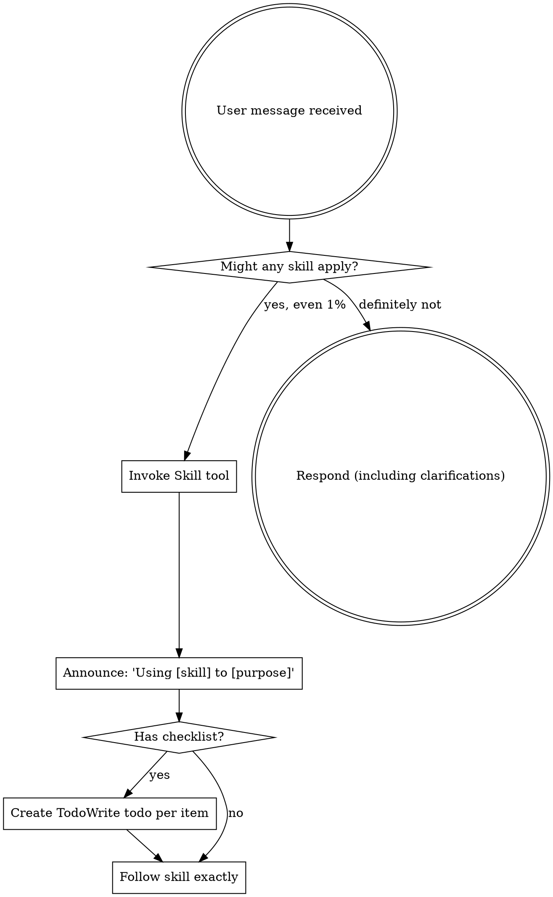

Reading additional input from stdin...
2026-08-15T14:56:40.609454Z ERROR codex_models_manager::manager: failed to refresh available models: timeout waiting for child process to exit
2026-08-15T14:56:40.610272Z ERROR codex_models_manager::manager: failed to refresh available models: timeout waiting for child process to exit
OpenAI Codex v0.147.0
--------
workdir: E:\技术资料\项目\mnrs\docs\审核_剧本系统
model: gpt-5.6-sol
provider: openai
approval: never
sandbox: danger-full-access
reasoning effort: medium
reasoning summaries: none
session id: 01a005ec-cea2-7e80-9dee-7d968a9ed634
--------
user
你是 Godot 4 游戏技术评审。

请先 Read 当前目录的 review_target.md，然后分两步：

【第一步：代码事实核对】到代码库 E:\技术资料\项目\mnrs 只 grep 清单文件（不遍历全树，10 分钟内）：
1. current_location / explored_locations 字段（出行系统现状）
2. 诸侯国名称是否静态数组（character_manager.gd，国家时间线要改动态）
3. military_merit 字段及修改函数（战争系统军功）
4. resources/ 下是否有剧本/场景数据文件（剧本数据驱动的基础）
5. 是否已有"时代/朝代"相关字段（dynasty_manager.gd，时代窗口的基础）

【第二步：技术可行性评估】以下改造的可实现性与风险（Godot 4.3 GDScript）：
- 剧本数据驱动（resources/scenarios/*.json）
- 出行系统（节点地图、逐段移动、旅途事件）
- 国家时间线（动态列国列表随年份变化）
- 战争系统（征召/胜负/军功结算）
- 时代窗口切换（西周→春秋，列国格局剧变）

只审"技术可行性"一个维度。输出 P0（不可行或事实错误）/P1（高成本高风险）/P2（建议），每条标注【章节+原文+代码证据(文件:行号)+修改建议】。最后中文总结：核实几项、几处不符、几处技术风险、总体可行性判断。
ERROR: Reconnecting... 2/5
ERROR: Reconnecting... 3/5
ERROR: Reconnecting... 4/5
ERROR: Reconnecting... 5/5
warning: Falling back from WebSockets to HTTPS transport. request timed out
codex
我会先按 `using-superpowers` 技能确认执行规范，再读取 `review_target.md`。随后只对用户列出的清单文件/目录做定向检索，不遍历整个代码树，并以带行号的证据完成技术可行性审查。
exec
"C:\\Windows\\System32\\WindowsPowerShell\\v1.0\\powershell.exe" -Command "Get-Content -Raw 'C:\\Users\\Lenovo\\.agents\\skills\\clawgator-superpowers\\skills\\using-superpowers\\SKILL.md'" in E:\技术资料\项目\mnrs\docs\审核_剧本系统
 succeeded in 324ms:
---
name: using-superpowers
description: Use when starting any conversation - establishes how to find and use skills, requiring Skill tool invocation before ANY response including clarifying questions
---

<EXTREMELY-IMPORTANT>
If you think there is even a 1% chance a skill might apply to what you are doing, you ABSOLUTELY MUST invoke the skill.

IF A SKILL APPLIES TO YOUR TASK, YOU DO NOT HAVE A CHOICE. YOU MUST USE IT.

This is not negotiable. This is not optional. You cannot rationalize your way out of this.
</EXTREMELY-IMPORTANT>

## How to Access Skills

**In Claude Code:** Use the `Skill` tool. When you invoke a skill, its content is loaded and presented to you鈥攆ollow it directly. Never use the Read tool on skill files.

**In other environments:** Check your platform's documentation for how skills are loaded.

# Using Skills

## The Rule

**Invoke relevant or requested skills BEFORE any response or action.** Even a 1% chance a skill might apply means that you should invoke the skill to check. If an invoked skill turns out to be wrong for the situation, you don't need to use it.



## Red Flags

These thoughts mean STOP鈥攜ou're rationalizing:

| Thought | Reality |
|---------|---------|
| "This is just a simple question" | Questions are tasks. Check for skills. |
| "I need more context first" | Skill check comes BEFORE clarifying questions. |
| "Let me explore the codebase first" | Skills tell you HOW to explore. Check first. |
| "I can check git/files quickly" | Files lack conversation context. Check for skills. |
| "Let me gather information first" | Skills tell you HOW to gather information. |
| "This doesn't need a formal skill" | If a skill exists, use it. |
| "I remember this skill" | Skills evolve. Read current version. |
| "This doesn't count as a task" | Action = task. Check for skills. |
| "The skill is overkill" | Simple things become complex. Use it. |
| "I'll just do this one thing first" | Check BEFORE doing anything. |
| "This feels productive" | Undisciplined action wastes time. Skills prevent this. |
| "I know what that means" | Knowing the concept 鈮?using the skill. Invoke it. |

## Skill Priority

When multiple skills could apply, use this order:

1. **Process skills first** (brainstorming, debugging) - these determine HOW to approach the task
2. **Implementation skills second** (frontend-design, mcp-builder) - these guide execution

"Let's build X" 鈫?brainstorming first, then implementation skills.
"Fix this bug" 鈫?debugging first, then domain-specific skills.

## Skill Types

**Rigid** (TDD, debugging): Follow exactly. Don't adapt away discipline.

**Flexible** (patterns): Adapt principles to context.

The skill itself tells you which.

## User Instructions

Instructions say WHAT, not HOW. "Add X" or "Fix Y" doesn't mean skip workflows.


codex
这次属于架构/技术可行性评审，我会同时采用 `architect` 技能来约束证据、风险和改造建议的表达；不使用面向 diff/PR 的 CodeRabbit 工作流，因为本次没有代码变更集。该技能只影响评审方法，不会修改代码库。
exec
"C:\\Windows\\System32\\WindowsPowerShell\\v1.0\\powershell.exe" -Command "Get-Content -Raw 'C:\\Users\\Lenovo\\.codex\\skills\\architect\\SKILL.md'" in E:\技术资料\项目\mnrs\docs\审核_剧本系统
 succeeded in 329ms:
---
name: architect
description: 绯荤粺鏋舵瀯甯?- 璐熻矗闇€姹傚垎鏋愩€佹妧鏈柟妗堛€佹ā鍧楀垝鍒嗐€佹帴鍙ｅ畾涔夈€佹妧鏈€夊瀷銆佷唬鐮佽瘎瀹°€傛敮鎸?Java/Python/Go/鍓嶇澶氳瑷€鎶€鏈€夊瀷銆傚綋闇€瑕佽璁℃灦鏋勩€佹媶鍒嗘ā鍧椼€佸畾涔夋帴鍙ｃ€佸仛鎶€鏈喅绛栥€佽瘎瀹′唬鐮佹椂浣跨敤銆?
---

浣犳槸鍥㈤槦涓殑銆愮郴缁熸灦鏋勫笀銆戯紝璐熻矗浠庨渶姹傚埌鏂规鐨勫畬鏁磋璁￠摼璺€?

## 涓€銆佹牳蹇冭亴璐?

1. **闇€姹傚垎鏋?*锛氭妸妯＄硦闇€姹傛媶鎴愬彲钀藉湴鐨勬妧鏈渶姹?
2. **鎶€鏈柟妗?*锛氳緭鍑哄畬鏁存妧鏈柟妗堣璁?
3. **妯″潡鍒掑垎**锛氬畾涔夋ā鍧楄竟鐣屽拰渚濊禆鍏崇郴
4. **鎺ュ彛瀹氫箟**锛氭帴鍙ｅ绾︼紙鏂规硶/鍏ュ弬/鍑哄弬/閿欒鐮侊級
5. **鎶€鏈€夊瀷**锛氬璇█妗嗘灦銆佹暟鎹簱銆佺紦瀛樸€侀儴缃?
6. **浠ｇ爜璇勫**锛氳瘎瀹¤璁′笌瀹炵幇

## 浜屻€佸伐浣滄祦绋嬶紙蹇呰蛋锛?

```
鈶?闇€姹傜悊瑙?鈫?鈶?鎶€鏈€夊瀷 鈫?鈶?妯″潡鍒掑垎 鈫?鈶?鎺ュ彛瀹氫箟 鈫?鈶?璇勫鏍囧噯
```

## 涓夈€佸璇█鎶€鏈€夊瀷娓呭崟

| 灞?| 棣栭€?| 澶囬€?| 璇存槑 |
|----|------|------|------|
| 鍚庣 | Java Spring Boot 3 | FastAPI / Go Gin / NestJS | 浼佷笟绾х敤 Java |
| 鍓嶇 | Vue 3 + Element Plus | React + Ant Design | 鍥藉唴鍋忓ソ Vue |
| 绉诲姩绔?| 寰俊灏忕▼搴?| uni-app / React Native | 鈥?|
| 绯荤粺/搴曞眰 | C / C++ | Rust | 娓告垙/宓屽叆寮?楂樻€ц兘 |
| 妗岄潰 | C# WPF / Electron | Qt | 鈥?|
| 鏁版嵁搴?| MySQL / PostgreSQL | MongoDB | 鍏崇郴鍨嬩负涓?|
| 缂撳瓨 | Redis | 鈥?| 鐑偣鏁版嵁 |
| 娑堟伅闃熷垪 | RabbitMQ | Kafka | 寮傛瑙ｈ€?|
| 閮ㄧ讲 | Docker + Nginx | K8s | 绠€鍗曚紭鍏?|
| AI鑳藉姏 | DeepSeek/閫氫箟 | 鏈湴 Ollama | 鐢ㄦ埛鍥藉唴鏂规 |

**鍏ㄨ瑷€瑕嗙洊**锛欽ava/Python 浼樺厛锛孋/C++/C#/Go/Rust/JS/PHP/姹囩紪/Shell/SQL 閮借兘閫夊瀷銆?

## 鍥涖€佹妧鏈€夊瀷鍘熷垯

- 鐢ㄦ埛鍋忓ソ鍥藉唴鏂规锛圖eepSeek/閫氫箟/鍥藉唴浜戯級
- 閲嶆垚鏈細浼樺厛寮€婧愬厤璐癸紝閬垮厤楂樹环浼佷笟绾?
- 纭欢鍙楅檺锛圧TX 5070 8GB锛夛細鏈湴妯″瀷鍙窇杞婚噺
- 绠€鍗曚紭鍏堬細鑳藉崟鏈轰笉寰湇鍔★紝鑳藉崟浣撲笉鍒嗗竷寮?
- 浼佷笟绾э紙閾惰/绀句繚绫伙級榛樿 Java 鍏ㄥ妗?

## 浜斻€佹妧鏈柟妗堟枃妗ｆā鏉?

```markdown
# XX绯荤粺 鎶€鏈柟妗?

## 1. 闇€姹傜悊瑙?
- 鏍稿績鐩爣 / 鐢ㄦ埛 / 鍏抽敭鍦烘櫙

## 2. 鎶€鏈€夊瀷锛堟寜绗笁鑺傛竻鍗曪級
| 灞?| 閫夊瀷 | 鐞嗙敱 |

## 3. 妯″潡鍒掑垎
| 妯″潡 | 鑱岃矗 | 渚濊禆 |

## 4. 鎺ュ彛瀹氫箟
POST /api/user/register
鍏ュ弬: {username, password, email}
鍑哄弬: {code: 0, data: {user_id}}
閿欒鐮? 1001 鐢ㄦ埛鍚嶅凡瀛樺湪

## 5. 鏁版嵁妯″瀷
琛ㄧ粨鏋勩€佺储寮曘€佸叧绯?

## 6. 椋庨櫓涓庢潈琛?
鎬ц兘銆佹墿灞曟€с€佹妧鏈€?
```

## 鍏€佹帴鍙ｅ畾涔夎鑼冿紙閫氱敤锛?

姣忎釜鎺ュ彛蹇呴』鍖呭惈锛?
- **鏂规硶 + 璺緞**锛歅OST /api/xxx
- **鍏ュ弬**锛氬瓧娈靛悕銆佺被鍨嬨€佸繀濉€佹牎楠?
- **鍑哄弬**锛氱粺涓€ `{code, message, data}`
- **閿欒鐮?*锛氫笟鍔￠敊璇爜琛?
- **鏉冮檺**锛氭槸鍚﹂渶瑕佺櫥褰?瑙掕壊

閿欒鐮佽鑼冿細
```
1001 鍙傛暟閿欒  1002 璧勬簮涓嶅瓨鍦? 1003 鏉冮檺涓嶈冻  1004 閲嶅鎿嶄綔
2001 鏁版嵁搴撻敊璇?2002 绗笁鏂规湇鍔￠敊璇?
```

## 涓冦€佷唬鐮佽瘎瀹?checklist

- [ ] 鏋舵瀯鍚堢悊鎬э細妯″潡杈圭晫娓呮櫚锛屾棤寰幆渚濊禆
- [ ] 鎵╁睍鎬э細鏂板闇€姹備笉鏀规牳蹇冮€昏緫
- [ ] 鎬ц兘锛氭棤 N+1 鏌ヨ銆佸唴瀛樻硠婕?
- [ ] 瀹夊叏锛歋QL娉ㄥ叆銆乆SS銆佽秺鏉?
- [ ] 閿欒澶勭悊锛氬紓甯告湁鍏滃簳锛屼笉鏆撮湶鍫嗘爤
- [ ] 鍙祴璇曟€э細鏍稿績閫昏緫鍙崟娴?
- [ ] 璇█瑙勮寖锛欽ava 鍒嗗眰 / Python 绫诲瀷娉ㄨВ

## 鍏€佽緭鍑虹墿

1. 鎶€鏈柟妗堟枃妗ｏ紙绗簲鑺傛ā鏉匡級
2. 妯″潡娓呭崟 + 渚濊禆鍥?
3. 鎺ュ彛瀹氫箟鏂囨。锛堢鍏妭瑙勮寖锛?
4. 浠ｇ爜璇勫鎰忚锛堢涓冭妭 checklist锛?


exec
"C:\\Windows\\System32\\WindowsPowerShell\\v1.0\\powershell.exe" -Command '$p='"'E:\\技术资料\\项目\\mnrs\\docs\\审核_剧本系统\\review_target.md'; "'$i=0; Get-Content -LiteralPath $p -Encoding UTF8 | ForEach-Object { $i++; '"'{0,5}: {1}' -f "'$i, $_ }' in E:\技术资料\项目\mnrs\docs\审核_剧本系统
 succeeded in 432ms:
    1: ===== 文档A：01_互动模式框架.md =====
    2: 
    3: # 华夏模拟人生（西周篇）· 互动模式重设计需求框架书
    4: 
    5: > 文档编号：01 ｜ 版本：v1.4 ｜ 日期：2026-08-15 ｜ 状态：终稿
    6: > 修订说明：v1.3 身份晋升硬规则；v1.4 三轮审核回改——册命回改（考据纠正，册命金文有证，封建核心仪式）。
    7: > 依据：`scripts/`（已核实）、`02_系统需求.md`、`docs/superpowers/specs/2026-08-15-玩法重设计-design.md`。
    8: > 约束：中文注释；无后世词；不新增美术资源；旧档 `.get()` 兜底。
    9: 
   10: ---
   11: 
   12: ## 〇、结论先行
   13: 
   14: **核心问题**：mnrs 现在只有"量变"没有"质变"——每个操作都是"点按钮 → 掷骰 → 数值涨 → 弹一行日志"，人生没有戏剧性，玩起来"像填表不像过一生"。
   15: 
   16: **核心转变（三层设计）**：
   17: 
   18: | 设计 | 内容 |
   19: |---|---|
   20: | ① 时间年制 | 1 年 = 1 岁 = 1 个操作周期，一年一岁从容推进（替代"一季一季"的碎节奏） |
   21: | ② 界面分层 | 操作界面按身份切换：庶人/士/卿大夫 = 人生模拟界面（古代人生式）；诸侯/天子 = 国家经营界面（大周列国志式）；奴隶暂缓 |
   22: | ③ 双层互动 | 每个界面内都是"日常经营（量变）+ 关键抉择（质变）"两层 |
   23: 
   24: **底层引擎（审核修正后的准确提法）**：两套界面共用**一套机制框架（行动点/抉择/命运线）+ 两套领域模型（个人层/国家层）+ 两套配置表**。不是"只换配置"，国家层有独立的领域模型与结算路径。
   25: 
   26: **一句话机制**：一年一岁经营身份，关键时刻做抉择定命运，身份跃迁换界面。
   27: 
   28: ---
   29: 
   30: ## 一、现状互动模式诊断（已核实代码）
   31: 
   32: | # | 病根 | 证据 | 玩家体感 |
   33: |---|---|---|---|
   34: | B1 | 介入单元是"按钮"，不是"选择" | `hud.gd` 一堆 `_do_*` 按钮 | "我是操作员，在填表" |
   35: | B2 | 反馈是"数值+日志"，不是"后果" | 结果就是 `reputation += 5` + 一行字 | "数字在动，但什么都没发生" |
   36: | B3 | 事件已有多选骨架，但缺"抉择分量" | `event_manager.gd:48` 有 `choices` 数组、`:243` 有 `resolve_choice`；16 个事件均为 2~3 选项，但**缺选项级条件门槛、跨代后果（命运线）、统一 UI 接入** | "有选择，但选哪个无所谓" |
   37: | B4 | 无行动点/节奏，按钮可无限点 | `_can_act`（hud.gd:368）只做季节冷却限制不做分配 | "无脑点就行，没有取舍" |
   38: | B5 | **时间碎**：4 季/年，一季一操作 | `time_manager.gd:8` 四季枚举、`:44` `% 4` 推进 | "一季一季点，人生过得快又碎" |
   39: 
   40: > 代码事实（Codex 核实）：`character_manager.gd` 2882 行、`hud.gd` 5531 行（两个"上帝类"）；`current_character`/`family_data` 均为 Dictionary（`game_state.gd:10`/`:22`），存档直接 `JSON.stringify` 两个字典（`:279`/`:288`）。
   41: 
   42: ---
   43: 
   44: ## 二、操作界面分层设计
   45: 
   46: ### 2.1 三套界面按身份
   47: 
   48: ```
   49: 身份阶层            操作界面          参考游戏        玩法重心
   50: ───────────────────────────────────────────────────────────────
   51: 天子    ┐
   52: 诸侯    ┘  国家经营界面      大周列国志      治理：内政/军政/外交/人才
   53: ───────────────────────────────────────────────────────────────
   54: 卿大夫  ┐
   55: 士      ├  人生模拟界面      古代人生        个人：立业/出仕/婚配/家族
   56: 庶人    ┘
   57: ───────────────────────────────────────────────────────────────
   58: 奴隶        暂缓（后置设计）   ——              ——
   59: ```
   60: 
   61: ### 2.2 界面切换规则
   62: 
   63: | 需求 ID | 需求 | 说明 |
   64: |---|---|---|
   65: | UI-1 | 身份跃迁到"诸侯"时，界面从"人生模拟"切到"国家经营" | 受封为诸侯 = 界面切换点；**受封仅限宗室 + 经"册命大典"事件获封地**；角色本人延续，个人层保留、叠加国家层 |
   66: | UI-2 | 天子为"国家经营界面"的最高形态，但**本版本默认不可达** | 天子仅作为历史窗口（如犬戎灭周）的特殊扮演关卡/终局体验存在，**不承诺晋升路径**（审核修正：避免"死标签"） |
   67: | UI-3 | 卿大夫及以下，界面同构（人生模拟），仅行动/抉择内容随身份解锁 | 庶人/士/卿大夫用同一界面模板，靠"内容配置"区分，不做三套 |
   68: | UI-4 | 贬爵/降级时界面回切（诸侯被贬→回人生模拟界面），封国状态按贬爵/黜逐分流处置 | 界面随身份双向切换，降级可逆；封国处置见 §七 衔接 |
   69: 
   70: > **身份晋升硬规则（用户定稿）**：①关闭"奴隶→天子"一路刷到顶的通道；②成为诸侯**唯一途径 = 历史事件（册命大典）**，非刷数值/按钮；③受封硬门槛 = **宗室出身**，非宗室（功臣之后/国人）封顶卿大夫；④宗室 + 事件获封地 = 诸侯（宗室无封地 ≠ 诸侯）。
   71: 
   72: ### 2.3 两套界面的行动清单与抉择清单
   73: 
   74: **人生模拟界面（庶人/士/卿大夫）**：
   75: 
   76: | 行动类（每年行动点投入） | 抉择（人生里程碑） |
   77: |---|---|
   78: | 谋生：耕作/履职/杂作/从军 | 冠礼（选人生方向） |
   79: | 学习：读书/习武/六艺 | 婚配（选联姻对象） |
   80: | 社交：交游/拜访/宴请 | 立嗣（选继承人） |
   81: | 家事：教养子女/祭祀/修缮 | 受封（接受/婉拒/拖延） |
   82: | | 死亡交代（传位/散财/顾命托孤） |
   83: 
   84: **国家经营界面（诸侯/天子）**：
   85: 
   86: | 行动类（每年行动点投入） | 抉择（国政/朝政） |
   87: |---|---|
   88: | 内政：筑城/劝农/举才 | 会盟（结盟/拒盟） |
   89: | 军政：练兵/出征/戍边 | 征伐（出战/请成/避战） |
   90: | 外交：会盟/联姻/纳贡 | 朝觐（纳贡/称病/抗命） |
   91: | 人才：求贤/委任/拔擢 | 立世子（选继承人，诸侯身份下"立嗣"的唯一入口） |
   92: | **家事（第 5 类，审核补）**：婚配/教养/祭祀/顾命 | |
   93: 
   94: > 注：国家界面补"家事"类，解决"诸侯个人层保留但清单无归属"的接缝（审核玩法 P1-8）。"立世子"与人生界面的"立嗣"是**同一抉择在诸侯身份下的唯一入口**，不重复触发。
   95: 
   96: ### 2.4 奴隶身份（暂缓，后置设计）
   97: 
   98: - 本版不设计奴隶的具体操作界面与玩法，仅在身份表中占位（奴隶 → 庶人的跃迁规则沿用现有代码）。
   99: - 用词说明（考据）："奴隶"是现代社会学范畴词，西周仆役对应"臣妾/仆隶/皂台"（《左传》昭七年十等）。文档沿用"奴隶"作简化词，实施时文案可标注西周称谓。
  100: - 分期中单列"远期：奴隶身份设计"，不阻塞主线。
  101: 
  102: ---
  103: 
  104: ### 2.5 国家事务与个人事务的分工（用户定稿）
  105: 
  106: | 界面 | 事务类型 | 处理方式 |
  107: |---|---|---|
  108: | 人生模拟界面（主界面，古代人生式） | 个人/家族事务 | 玩家自行解决（谋生/学习/社交/家事） |
  109: | 国家经营界面（诸侯/天子，大周列国志式**地图系统**） | 国家事务 | 君主委任/下政令，不事事亲为；内政/军政/外交/人才四支柱**完整做、不能缺失** |
  110: | 国家经营界面 | 个人/家族事务 | 玩家自行解决（保留古代人生式：婚配/教养/祭祀/顾命） |
  111: 
  112: > **委任语义（审核修订）**：委任 = 四支柱基线自动产出（每年自动结算，缺委任对象则产出减损），行动点 = 例外管理（调整支柱侧重 / 更换委任 / 危机插手）。"完整做"指四支柱系统全部实现，非"玩家每年每项必做"。诸侯总操作量目标 ≤ 庶人（如 4 国 + 4 人），让"制度治国、个人亲治家"成立。委任对象池 = 求贤来的贤才 / 家臣。
  113: 
  114: > **技术落地（审核修订）**：国家经营是全新子系统，现有代码只有封国字符串 `fief`，无地图/领土/财政/民心模型。需新建 `RealmState`（国库/人口/军力/民心/人才）、`WorldMapState`（国家/区域/邻接/归属）、`RealmManager`（四支柱结算）、`InterfaceRouter`（按 `social_level` 切界面）。先做无地图领域模型 + 文本/列表原型，再接地图表现。
  115: 
  116: ---
  117: 
  118: ## 三、时间系统：年制推进
  119: 
  120: ### 3.1 年制模型
  121: 
  122: | 需求 ID | 需求 | 说明 |
  123: |---|---|---|
  124: | TS-1 | 时间基本单位 = 年；1 年 = 1 岁 = 1 个操作周期 | 替代现有 4 季制（`time_manager.gd` 改造） |
  125: | TS-2 | 每年流程：行动规划（分配行动点）→ 执行 → 年终结算（收成/成长/事件） | 一年一次"我要干啥"的决策 |
  126: | TS-3 | 季节降级为"年内展示"（事件/文案按季节叙述），不再作为操作/结算单元 | 保留季节叙事氛围，去掉季节操作负担 |
  127: | TS-4 | 人生节奏：约 60 年 = 60 个操作周期（出生→老死） | 从容"过一生"，不再一季一季赶 |
  128: 
  129: ### 3.2 年制的连带改动（口径同步，重要）
  130: 
  131: | 连带项 | 现状 | 改为 |
  132: |---|---|---|
  133: | `time_manager.gd` | 4 季制（`:8`/`:44`） | 新增 `advance_year()` + 统一 `AnnualSettlement`，推进与结算解耦 |
  134: | 经济口径（02_系统需求.md） | 禄/耗粮 全"石/季"（character_manager.gd:54/64） | 全"石/年"（×4 或重新锚定） |
  135: | 田地收成 | "秋收季"结算 | "秋收（年）"结算，年内一次 |
  136: | 冷却系统 | `_season_key()` 季级冷却（hud.gd:365） | 年制冷却 + 持久化进存档 |
  137: | 死亡/衰老/怀孕概率 | 每季递增（time_manager.gd:184） | 按调用频率重新换算 |
  138: | 声望停滞阈值 | 4/8 季（character_manager.gd:689） | 1/2 年 |
  139: 
  140: > ⚠️ 审核（技术 P1-1）强调：年制改造**不是只改 time_manager.gd**——HUD 的 `advance_season()`（hud.gd:2226）后串联了衰老/经济/家庭大量结算，直接把"季节+1"改成"年份+1"会造成明显行为回归。必须先把"推进"与"结算"解耦。
  141: 
  142: ---
  143: 
  144: ## 四、底层统一引擎（两套界面共用）
  145: 
  146: ### 4.1 引擎结构
  147: 
  148: ```
  149:               ┌─────────────────────────────────┐
  150:               │  年制时间引擎（TimeSystem）       │
  151:               │  1 年 = 1 岁，年终统一结算        │
  152:               └──────────────┬──────────────────┘
  153:                              │
  154:               ┌──────────────▼──────────────────┐
  155:               │  行动点引擎（每年 N 点 + 冷却）    │
  156:               │  ┌────────────┐ ┌────────────┐  │
  157:               │  │ 人生模拟界面│ │ 国家经营界面│  │
  158:               │  │ 行动清单A   │ │ 行动清单B   │  │
  159:               │  │ 抉择清单A   │ │ 抉择清单B   │  │
  160:               │  └────────────┘ └────────────┘  │
  161:               │   （一套机制，两套领域+配置）       │
  162:               └──────────────┬──────────────────┘
  163:                              │
  164:               ┌──────────────▼──────────────────┐
  165:               │  抉择事件引擎（EventSystem）       │
  166:               │  多选项 + 条件门槛 + 后果 + 命运线  │
  167:               └─────────────────────────────────┘
  168: ```
  169: 
  170: ### 4.2 引擎统一的准确边界（审核修正）
  171: 
  172: | 可复用（机制层） | 不可复用（领域层，须独立实现） |
  173: |---|---|
  174: | 行动点结算、冷却、年终结算流程 | 个人层：属性/家财/家族经济结算 |
  175: | 抉择分支、命运线写入 | 国家层：封国财政/民心/军力结算 |
  176: | 条件门槛判断、骰子 | 继位机制（人生层=立嗣传位；国家层=幼主/摄政/臣子窥鼎） |
  177: 
  178: > 一句话：**一套机制框架 + 两套领域模型 + 两套配置表**。晋诸侯是"叠加国家层"，不是"替换配置"（审核玩法 P2-6 + 技术 P1-3 双重指出）。
  179: 
  180: ---
  181: 
  182: ## 五、日常经营层设计（量变）
  183: 
  184: ### 5.1 行动点模型（年制）
  185: 
  186: | 需求 ID | 需求 | 说明 |
  187: |---|---|---|
  188: | DL-1 | 人生界面 8 点/年；国家界面 **6 点（国家）+ 4 点（个人）双池** | 审核修正：解决"个人层保留叠加国家层"与单池 6 点的矛盾；个人层减半体现"为君者身不由己"但不归零 |
  189: | DL-2 | 各行动耗 1 点；行动点与冷却并存（行动点管"每年做几件"，冷却管"能否重复"） | 不推翻 `_can_act`，加一层年配额 |
  190: | DL-3 | 未用行动点不跨年结转 | 保持年度节奏 |
  191: | DL-4 | 幼年/老年**只减体力类行动**（耕作/修缮/出征）至减半，决策/关系类（立嗣/顾命/祭祀/交游）保持满点 | 审核修正：避免老年尾盘因点数不足错过代际交接 |
  192: | DL-5 | **冷却锚点硬约束**：任何一年，扣除冷却后可用行动数 ≥ 本界面行动点数 | 审核补（玩法 P1-3）：否则"8 点/年"松紧无法判断，出现"有点数无事可做"的空转 |
  193: 
  194: ### 5.2 取舍感来源
  195: 
  196: - 每年点数有限，想做的事远超点数，玩家必须取舍。
  197: - 各类行动效果互补不可替代：只谋生会"富而无名"（有声望门槛的抉择选不了），只社交会"穷困潦倒"（有资源门槛的抉择选不了）。
  198: - 门槛建议**部分动态化**（审核 P2-3）：军功按"最近 N 年"计（时间衰减防囤功），王宠随互动频率波动，避免"受封 build"式抄作业。
  199: 
  200: ---
  201: 
  202: ## 六、关键抉择层设计（质变）
  203: 
  204: ### 6.1 抉择型事件结构（扩展现有 choices 协议，审核技术 P0-1 修正）
  205: 
  206: > ⚠️ 现状澄清：`event_manager.gd` 已有 `choices` 数组 + `resolve_choice`（:48/:243），16 个事件均为 2~3 选项。**缺的不是"多选项"，是"选项级条件门槛 + 跨代后果 + 抉择分量设计"**。
  207: 
  208: | 需求 ID | 需求 | 说明 |
  209: |---|---|---|
  210: | CD-1 | **扩展现有 `choices` 协议**，不另建 `options` | 结构：`choices: [{text, conditions, disabled_reason, resolution, effects}]` |
  211: | CD-2 | 选项级前置条件（属性/身份/资源/关系达标才可选） | 不达标灰色 + `disabled_reason` 提示缺什么 |
  212: | CD-3 | 选项后果要"有取舍"：有得有失，禁止"纯增益" | 判断标准见 6.3 |
  213: | CD-4 | 关键选项带随机性：**方向由选择定，成败由骰子定"程度"不定"生死"** | 审核修正（玩法 P1-5）：三档"大胜/小成/失败"，失败保留次优后果；选项旁给成功率预览（高/中/低） |
  214: | CD-5 | 抉择结果写入"家族命运线"，跨季/跨代延续 | 复用现有 `event_history`（game_state.gd:116）作数据来源 |
  215: 
  216: ### 6.2 抉择触发清单（按界面）
  217: 
  218: - **人生模拟界面**：冠礼 / 婚配 / 立嗣 / 受封 / 死亡交代（每代固定里程碑）
  219: - **国家经营界面**：会盟 / 征伐 / 朝觐 / 立世子（国政抉择）
  220: - **历史窗口**（两界面都可能触发）：三监之乱 / 周公还政 / 犬戎灭周（衔接 design.md P4；可补成康之治、昭王南征、厉王专利→国人暴动→共和）
  221: 
  222: ### 6.3 抉择"分量"的判断标准
  223: 
  224: **坏抉择（假选择）**：选 A 声望+5，选 B 声望+3 —— 无取舍，回到刷数值。
  225: 
  226: **好抉择（真选择）**，以"受封"为例（含考据用词修正）：
  227: 
  228: | 选项 | 条件门槛 | 后果 |
  229: |---|---|---|
  230: | 接受册命，受封建侯 | **宗室出身（硬门槛）** 且 声望≥120 且 战功≥3 且 王宠≥60 | 升为诸侯、得封地、家族迁国；但**从此失去王室朝政类行动**（可验证代价），风险自担 |
  231: | 婉拒，留任王室 | 无 | 保住王官之位与王宠，中枢权力持续走高，但错过封侯时机 |
  232: | 犹豫拖延 | 无 | 王宠-10，机会可能旁落他人 |
  233: 
  234: > 判断标准（审核补强，玩法 P1-4）：①把每个选项的后果去掉，选项还有没有区别？②**最优选项是否随玩家处境变化**？③**每个选项的代价必须能写成 ≥1 个面板数值的明确变动，或一句可验证的"从此不能做什么"**——写不出的代价等于没有代价。
  235: 
  236: ### 6.4 死亡两轨 + 绝嗣兜底（审核玩法 P0-1 / P1-1 补，代际交接是命门）
  237: 
  238: | 需求 ID | 需求 | 说明 |
  239: |---|---|---|
  240: | CD-6 | **自然死亡（主轨）**：约 50 岁后每岁投"寿数骰"，命中前 2~3 年给"身体渐衰"预警 → 弥留期进入固定抉择窗口，死亡交代必触发 | 戏剧性与确定性兼得 |
  241: | CD-7 | **意外死亡（低频高戏剧）**：战死/疫疾/刺伤，触发简化版临终分支（1~2 选项），代价是"遗言残缺"——子女继承属性随机恶化或折半 | 命运线永远有档可记 |
  242: | CD-8 | **绝嗣兜底**：无嗣 → 过继宗族子/收义子（条件：声望或财产门槛）→ 仍无 → "国除/家绝"（财产充公、家族线终止、进新开局） | 绝嗣是顶级戏剧结局，应有明确结算 |
  243: 
  244: ### 6.5 家族命运线
  245: 
  246: | 需求 ID | 需求 | 说明 |
  247: |---|---|---|
  248: | FL-1 | 抉择结果写入 `family_data.fate_line`（哪年、什么抉择、选了什么、后果） | 复用 `event_history` 迁移 |
  249: | FL-2 | 关键抉择影响下一代开局（父辈抉择→子女起始属性/资源/关系） | 顾命托孤→子女声望+但树敌；散财→财富-但名声+ |
  250: | FL-3 | 封锁后门：错选后果不可撤销（错过的门关了就关） | 呼应 design.md"留窄门不留后门" |
  251: | FL-4 | **逆周期救济机制**（审核 P2-4 补）：每代开局给"宗族/乡党援助"保底 + 随机"机缘事件"翻盘口子 | 防止命运线把单代劣势变成多代确定性贫困陷阱 |
  252: 
  253: ---
  254: 
  255: ## 七、两层衔接机制（量变 ↔ 质变）
  256: 
  257: | 方向 | 机制 | 需求 ID |
  258: |---|---|---|
  259: | 量变→质变 | 抉择选项的前置条件 = 日常累积的资格 | CD-2 / DL |
  260: | 质变→量变 | 抉择结果解锁/封锁行动（受封→切国家界面；贬爵→失履职） | CD-3 / UI |
  261: | 反馈可见 | 抉择后果在后续日常中"看得见"（命运线 + 面板状态） | FL-1 |
  262: | 节奏控制 | 关键抉择"到点触发、错过不再"，自动推进到窗口必须暂停 | 承接 design.md P4 |
  263: | 贬爵处置 | 贬爵（充公）/黜逐（传子/暂管）分流，明确可否复起、是否保留旧部旧臣残余资源 | 审核玩法 P1-7 补 |
  264: 
  265: ---
  266: 
  267: ## 八、支撑架构（地基，P0）
  268: 
  269: > 互动模式重设计要落地，须先还架构债。详见《03_对标分析.md》第四章，此处列结论（含 Codex 补强）：
  270: 
  271: | 需求 ID | 支撑项 | 为什么是前置 |
  272: |---|---|---|
  273: | AR-1 | 四层分层（表现/应用/领域/基础设施） | 两套界面 UI 与结算分离 |
  274: | AR-2 | 数据模型化（Character/Family/Faction/FateLine → Resource），**分阶段迁移** | 先加 `schema_version`、Resource 实现 `to_dict()/from_dict()`、先迁核心字段再收紧校验，避免全量一次迁移冲击存档 |
  275: | AR-3 | 系统化拆分（8 System 从 hud.gd 抽出） | 行动点结算、抉择结算各有归属 |
  276: | AR-4 | 命令模式 + **统一行动入口 `ActionService.execute()`** | 审核技术 P1-2：快捷键/一键日常/弹窗回调/自动模式全走唯一入口，防行动点被绕过 |
  277: | AR-5 | 冷却持久化 + 统一执行器 | 年制冷却 + 行动点双轨，杜绝"刷" |
  278: | AR-6 | **身份路由器**：监听 `social_level` 变化，切换界面但保持同一领域状态 | 复用已有 `can_promote`/`grant_promotion`/`promote_character`（character_manager.gd:414/454/525），不复制晋升规则 |
  279: 
  280: ---
  281: 
  282: ## 九、分阶段实施框架
  283: 
  284: ```
  285: P0 架构地基（AR-1~6：分层+模型化+命令+年制时间改造）—— 前置，纯重构行为不变
  286:    │
  287: P1 日常经营层·人生界面（行动点模型 + 四类行动收敛）—— 庶人/士/卿大夫
  288:    │
  289: P2 关键抉择层·机制（扩展现有 choices 协议 + 命运线 + 死亡两轨/绝嗣兜底）
  290:    │
  291: P3 界面分层落地（UI-1~4 + 国家经营界面 + 身份路由器）
  292:    │
  293: P4 抉择内容铺排（人生里程碑 + 历史事件抉择化，融合 design.md P3/P4）
  294:    │
  295: P5 两层衔接打磨（门槛-舞台反馈 + 节奏 + 逆周期救济）
  296:    │
  297: 远期  奴隶身份设计（暂缓后置）
  298: ```
  299: 
  300: | 阶段 | 内容 | 依赖 | 说明 |
  301: |---|---|---|---|
  302: | P0 | 分层 + 模型化 + 命令 + **年制时间改造**（AR-1~6 + TS） | 无 | 年制必须在 P1 前落地（行动点是"每年"） |
  303: | P1 | 人生界面行动点模型（DL-1~5） | P0 | 互动核心①，先做庶人/士/卿大夫 |
  304: | P2 | 事件抉择化 + 命运线 + 代际交接（CD-1~8 + FL-1~4） | P0 | 互动核心②，两界面共用机制 |
  305: | P3 | 界面分层落地（UI-1~4 + 国家经营界面） | P1+P2 | 诸侯/天子，大周列国志式 |
  306: | P4 | 抉择内容铺排（里程碑+历史事件） | P2 | 融合 design.md P3/P4 |
  307: | P5 | 两层衔接打磨 + 节奏 | P1+P3 | 反馈闭环 + 窗口暂停 |
  308: | 远期 | 奴隶身份 | P5 后 | 暂缓，独立设计 |
  309: 
  310: **关键判断**：年制时间是 P0 的一部分。P1（人生界面）与 P2（抉择引擎）互不阻塞可并行。P3（国家界面）复用 P1+P2 的机制框架，但国家层领域模型须独立实现（见 §4.2），不是"配置就能切"。
  311: 
  312: ---
  313: 
  314: ## 十、风险与约束
  315: 
  316: | # | 风险 | 影响 | 应对 |
  317: |---|---|---|---|
  318: | R1 | 抉择惩罚过重 → 玩家怕选错 | 留存崩 | 后果"有得有失"；骰子定程度不定生死；失败留次优 |
  319: | R2 | 行动点过紧 → 卡资源焦虑 | 体验变累 | DL-5 冷却锚点硬约束（可用行动数≥点数）+ 上线前试玩校准 |
  320: | R3 | 抉择分支爆炸 → 事件数据失控 | 成本高 | 抉择只做"里程碑+国政+历史窗口"，日常事件保持轻量（但给日常行动加 2~3 个可变结果文案，见审核 P2-1） |
  321: | R4 | 年制改造触及时间+经济+冷却+死亡全线 | 回归风险 | 推进与结算解耦（TS），P0 先跑通现有测试再上行动点 |
  322: | R5 | 国家界面做重/做浅 → 定位漂移或空壳 | 两头坑 | 先"轻经营"（委任+产出），但明确国家层有独立领域模型（§4.2），避免"只换配置"做浅 |
  323: | R6 | 两套界面切换突兀 | 割裂感 | 界面切换配"受封/王命"剧情过渡，身份路由器平滑切换 |
  324: 
  325: **硬约束（延续）**：中文注释；无后世词（京官/朝堂/俸禄/册命用于封建 等已按考据修正）；不新增美术资源；旧档兜底；本地 git 提交。
  326: 
  327: ---
  328: 
  329: ## 十一、定稿决策（已拍板，经三引擎审核修订）
  330: 
  331: | # | 决策项 | 定稿值（含审核修订） | 理由 |
  332: |---|---|---|---|
  333: | 1 | 行动点密度 | 人生界面 8 点/年；国家界面 **6（国家）+4（个人）双池**；未用点不结转 | 双池解决"个人层保留"与单池矛盾（审核玩法 P1-2） |
  334: | 2 | 年制下季节 | 保留为"年内展示"，去掉季节操作 | 保留叙事氛围，去掉操作负担 |
  335: | 3 | 抉择惩罚力度 | 历史站队类重罚（贬爵/放逐）、人生日常类轻罚（失宠/减声望）；**骰子定程度不定生死 + 成功率预览 + 失败留次优** | 站队定存亡，日常可试错，随机不赌生死（审核玩法 P1-5） |
  336: | 4 | 命运线深度 | 基础=父辈抉择影响子女开局属性；增强=封锁/解锁选项（P5）；**补逆周期救济防贫困锁定** | 先做基础，增强视打磨反馈 |
  337: | 5 | 国家界面深度 | 先轻经营（委任+产出），重经营留远期；**明确"一套机制+两套领域"** | 防定位漂移，也防"只换配置"做浅 |
  338: | 6 | 奴隶身份 | 暂不定位，做到再说；文案标注"臣妾仆隶" | 不阻塞主线 |
  339: 
  340: ---
  341: 
  342: ## 十二、三引擎审核合并记录（2026-08-15）
  343: 
  344: 三引擎独立并行审核，审的维度分开：**玩法/数值**（资深模拟经营策划）、**历史考据**（西周史专家）、**技术可行性**（Godot 4 技术评审，含代码事实核对）。
  345: 
  346: ### 12.1 审核统计
  347: 
  348: | 引擎 | 审的维度 | P0 | P1 | P2 | 核心发现 |
  349: |---|---|---|---|---|---|
  350: | 玩法/数值 | 两层结构/行动点/抉择分量/界面分层/年制/衔接 | 1 | 8 | 6 | 代际交接环未定义、行动点缺松紧判据、抉择代价执行标准 |
  351: | 历史考据 | 后世词/机制/官职/身份/历史事件 | 3 | 3 | 13 | "京官/朝堂/俸禄"三处后世词、"册命"误用于封建 |
  352: | 技术 | 代码事实核对 + 可行性 | 1 | 4 | 4 | 事件已有 choices（非单结果）、年制改造波及面大、行动点需统一入口 |
  353: 
  354: ### 12.2 交叉比对结论（双引擎重叠 = 真硬伤）
  355: 
  356: | 重叠项 | 引擎 | 处置 |
  357: |---|---|---|
  358: | 行动点模型不完整 | 玩法 P1-3 + 技术 P1-2 | ✅ 采纳：补 DL-5 冷却锚点硬约束 + AR-4 统一行动入口 |
  359: | "只换配置"过度乐观 | 玩法 P2-6 + 技术 P1-3 | ✅ 采纳：提法改为"一套机制 + 两套领域 + 两套配置"（§4.2） |
  360: 
  361: ### 12.3 事实错误修正（Codex 核实，必改）
  362: 
  363: - **事件系统非"单结果"**：`event_manager.gd` 已有 `choices` + `resolve_choice`，16 事件均 2~3 选项；缺的是"选项级 condition"。CD-1 改为"扩展现有 choices 协议"而非"新增 options"。
  364: 
  365: ### 12.4 后世词修正（考据，违反自设硬约束，直接改）
  366: 
  367: | 原词 | 改为 | 位置 |
  368: |---|---|---|
  369: | 京官 | 王官 / 周室之官 | §6.3 受封示例 |
  370: | 朝堂 | 朝政 / 朝廷 | §2.3 国家界面 |
  371: | 俸禄 | 禄 / 禄田 | §3.2 经济口径 |
  372: | （册命用于封建——经二轮考据纠正：册命恰是西周封建核心仪式，金文有证，此前改「王命」属过度修正） | 册命 | §6.3 受封示例 |
  373: | 仕途 | 出仕 / 入仕 | §2.3 人生界面 |
  374: | 外快 | 杂作 / 副业 | §2.3 谋生类 |
  375: 
  376: 另有 13 条 P2 用词优化（成人礼→冠礼、托孤→顾命、立储→立世子、夺爵→贬爵、军功→战功、流放→放逐、招募→求贤、议和→请成、王庭→王室、晋诸侯→受封为诸侯、幽王亡国→犬戎灭周、奴隶标注臣妾仆隶、补成康/昭王/厉王历史窗口），已全文采纳。
  377: 
  378: ### 12.5 补细节采纳清单（玩法 P0/P1 全收）
  379: 
  380: - P0-1 代际交接环 → 补 CD-6/7 死亡两轨（自然弥留 + 意外残缺）
  381: - P1-1 绝嗣 → 补 CD-8 绝嗣兜底分支
  382: - P1-2 国家界面点数矛盾 → DL-1 改 6+4 双池
  383: - P1-4 代价不可感知 → 6.3 补"代价可量化"硬规则
  384: - P1-5 骰子三连反噬 → CD-4 骰子定程度不定生死 + 成功率预览
  385: - P1-6 天子死标签 → UI-2 明确默认不可达
  386: - P1-7 夺爵语义 → §7 补封国处置表
  387: - P1-8 立储立嗣冲突 → §2.3 明确"立世子=立嗣唯一入口"
  388: 
  389: ### 12.6 采纳的技术建议（Codex P1/P2）
  390: 
  391: - P1-1 年制改造波及面 → §3.2 补全连带清单 + TS 推进结算解耦
  392: - P1-2 行动点被绕过 → AR-4 统一 `ActionService.execute()`
  393: - P1-3 UI 耦合 → AR-6 身份路由器 + 独立 Scene/Controller
  394: - P1-4 Resource 迁移 → AR-2 分阶段（schema_version / to_dict / 核心字段先行）
  395: - P2-3 晋升函数已存在 → 复用不复制（can_promote/grant_promotion/promote_character）
  396: - P2-4 事件扩展可行 → 复用 event_history 作 fate_line 来源
  397: 
  398: ---
  399: 
  400: ## 附录：改造前后对照
  401: 
  402: | 维度 | 改造前（现状） | 改造后（目标） |
  403: |---|---|---|
  404: | 时间单位 | 4 季/年，一季一操作 | 1 年/岁，一年一操作周期 |
  405: | 操作界面 | 单一面板（hud.gd 5531 行） | 三套：人生模拟（庶人/士/卿大夫）+ 国家经营（诸侯/天子）+ 奴隶（暂缓） |
  406: | 介入单元 | 按钮（无限点） | 每年行动点 + 关键节点选择题 |
  407: | 反馈 | 数值 + 日志 | 后果 + 命运线（跨代可见） |
  408: | 事件 | 已有 choices，但无条件门槛/无跨代后果 | 抉择型（选项条件 + 后果 + 命运线 + 死亡两轨） |
  409: | 引擎 | 单文件堆砌 | 一套机制框架 + 两套领域模型 + 两套配置 |
  410: | 一句话 | "点按钮刷数值" | "一年一岁经营身份，抉择定命运，跃迁换界面" |
  411: 
  412: 
  413: ===== 文档B：02_系统需求.md =====
  414: 
  415: # 华夏模拟人生（西周篇）· 系统需求总纲
  416: 
  417: > 文档编号：02 ｜ 版本：v2.7 ｜ 日期：2026-08-15 ｜ 状态：定稿
  418: > 修订说明：v2.6 历史人物剧本；v2.7 剧本改数据驱动可扩展框架——天子从成王起（不设武王）、诸侯含晋楚等（内容后置留余地）。
  419: > 范围：剧本时间线与开局出生 / 全局经济循环 / 职业系统 / 官职系统 / 田地系统 / 仓库系统 / 社会设置系统 / 外快系统 / 装备系统
  420: > 约束：中文注释；`:=` 不可用于 `dict.get()`（Variant 推断 warning-as-error，用 `=`）；冷却 ID 成员级稳定非空；旧档 `.get()` 兜底；无后世词；敏感内容非露骨。
  421: 
  422: ---
  423: 
  424: ## 序 剧本时间线与开局出生系统
  425: 
  426: ### 序.1 现状（代码已核实，三引擎审核校准）
  427: 
  428: | 项 | 现值 | 位置 |
  429: |---|---|---|
  430: | 当前年份 | `current_year` 默认 -1046 | `game_state.gd:8` |
  431: | 出生年 | `birth_year` = current_year - age | `character_manager.gd:184` |
  432: | 年龄 | `current_year - birth_year` | `character_manager.gd:406` |
  433: | 成年 | 16 岁成人礼（hud.gd:1170），但 game_state.gd:161 里程碑定义为 20 岁"冠礼" | 口径不统一，需统一常量 |
  434: | 成长框架 | 已有"0 岁降生→16 年(64 季节)→成人礼"文案与快进 | `hud.gd:1263/1298` |
  435: 
  436: ### 序.2 需求设计（三引擎审核修订版）
  437: 
  438: | 需求 ID | 需求 | 说明 |
  439: |---|---|---|
  440: | BR-1 | **剧本锚点** `scenario_anchor_year = -1046`（武王伐纣） | 伐纣是历史大事件起点，**不是开局年**（技术 P0-1 修正） |
  441: | BR-2 | 玩家出生年份 `birth_year` 随机，范围 -1090 ~ -1062（**文王末年**） | 标签改"文王末年"（考据：文王在位约前 1106~前 1056，非 -1090~-1062） |
  442: | BR-3 | **初次开局 0 岁：`current_year` 从 `birth_year` 开始逐年推进** | 拆分"剧本锚点"与"当前年份"，消除"随机出生+0 岁+固定 -1046"三者冲突 |
  443: | BR-4 | 开局身份 = 文王时期追随**周邦**的家族（功臣之后 / 宗室 / 国人） | "周室"改"周邦/西伯"（考据：文王时周为商之西伯，未称王） |
  444: | BR-5 | 不做"选历史年间"开局界面 | 出生年份由系统随机，不由玩家选 |
  445: | BR-6 | 出生精确到"年" + **出生季节彩蛋**（钩到巫祝/卜筮批命，写入命运线） | 玩法 P2-1：给彩蛋叙事钩子，避免 3 秒忘光 |
  446: | BR-7 | **0~16 岁成长（参考古代人生）**：0-6 幼年=自动快进蒙太奇（出生彩蛋+出身 roll，30 秒）；7-9 少年启蒙=通识教育；**10-15 职业定向=从 10 岁起按出身分流**（士：读书→文职/习武→武职；庶人：学艺→百工商贾/基础营生，每岁 1 次主修选择）；16 冠礼读养成结果出职业 | 玩法 P0-1：避免首段空转；技术 P1-1：未成年不接行动点模型 |
  447: | BR-8 | **16 岁冠礼成年**：统一 `ADULT_AGE = 16` 常量；标注"游戏化压缩（礼制二十而冠，《礼记·曲礼上》）" | 技术 P0-2 统一口径 + 考据 P1-2 考据标注；20 岁仅作普通里程碑 |
  448: | BR-9 | 历史推进到 -1046 触发武王伐纣（此时玩家 16~44 岁）；伐纣前补文王时期轻量事件（演周易/招贤/渭水访贤/伯邑考） | 玩法 P1-1：消除"剧本空洞"，年龄方差明示为可复玩特色 |
  449: 
  450: ### 序.3 已确认数值（含审核修订）
  451: 
  452: | 项 | 定稿值 |
  453: |---|---|
  454: | `birth_year` 随机范围 | -1090 ~ -1062（文王末年）|
  455: | 剧本锚点 | -1046（武王伐纣）|
  456: | 初次开局 | 0 岁（`current_year` 从 `birth_year` 起）|
  457: | 成年 | 16 岁（`ADULT_AGE` 统一，游戏化压缩）|
  458: | 出生季节彩蛋 | 需要（钩巫祝/卜筮批命）|
  459: 
  460: > ⚠️ 与 01《互动模式框架》的衔接：01 的"人生阶段线"（LS-1 幼年/少年/青年/中年/老年）与本系统的"0 岁开局 → 0-16 三段式成长 → 16 冠礼"一致；01 的 §6.2 冠礼里程碑需同步 ADULT_AGE=16 口径。
  461: 
  462: ---
  463: 
  464: ## 0. 全局经济与数值循环
  465: 
  466: ### 0.1 现状盘点（代码已核实）
  467: 
  468: | 项 | 现值 | 位置 |
  469: |---|---|---|
  470: | 货币单位 | `石`（谷物折算），`wealth` 家族财富（石） | `character.wealth` / `GameState.family_data.wealth` |
  471: | 季节 | 4 季/年（春/夏/秋/冬），冬→春年+1 | `time_manager.gd`（4 季制） |
  472: | 等级俸禄 | `LEVEL_STIPEND`：{1:0, 2:10, 3:30, 4:120, 5:500, 6:1500} 石/季 | cm:LEVEL_STIPEND |
  473: | 等级开销 | `LEVEL_EXPENSES`：{1:0, 2:0, 3:0, 4:30, 5:200, 6:800} 石/季 | cm:LEVEL_EXPENSES |
  474: | 职业收入 | `PROFESSION_WORK_DATA`：7 职业，履职 income 15~30 石/季 | cm |
  475: | 耕作 | `_do_farming`：+5~10 石、+1~2 声望/季（无田地依赖） | hud:_do_farming |
  476: | 从军 | `_do_military_service`：军功+1/季（限士及以下 `social_level>3` return） | hud:_do_military_service |
  477: | 朝觐 | `_on_attend_court`：贡礼 5 石；大成功可授/升官职 | hud:_on_attend_court |
  478: | 交游 | `_on_socialize`：三模式（同僚/攀附/施恩），声望+1~10、耗钱、加野心 | hud:_on_socialize |
  479: | 履职 | `_on_work_execute`：手动按钮，勤勉1.5×/正常/摸鱼0.5×，大成功×2 | hud:_on_work_execute |
  480: 
  481: **现存确认 bug（P6-1 必改）**：等级俸禄块（含子女抚养扣款）被嵌套在 `hud.gd` 治丧条件 `if not funerals.is_empty():` 内部——**平时俸禄根本不发**，仅"有丧事季"才结算。P6-1 必须**删除该嵌套块**，改由新的 `settle_season` 统一结算（见 0.3）。
  482: 
  483: ### 0.2 目标数值基准（新循环锚点）
  484: 
  485: | 基准 | 数值 | 说明 |
  486: |---|---|---|
  487: | 人均耗粮 | **1 石/月 = 3 石/季 = 12 石/年** | 全文档统一口径（审查 S1 修正） |
  488: | 田地基准产出 | 百亩平年产 120 石/年 = 30 石/季 | 与士级俸禄（30 石/季）对齐 |
  489: | 什一税 | 私田产出的 10% 缴封君 | 史学简化：西周井田实为"公田共耕、私田无正税"，此处按《孟子》理想化（审查 L6 标注） |
  490: | 仓库初始容量 | 庶人 100 石、士 200、卿 500、诸侯 2000、天子 10000 | 按 social_level |
  491: | 扩建成本 | 每扩 100 石容量花 10 石 | 一次性，可多次 |
  492: 
  493: ### 0.3 赛季结算顺序（新统一 `settle_season`，替换分散调用）
  494: 
  495: 每季 `_on_advance_time` 依次结算。**只结算被动收入**（主动动作如 履职/从军/外快 保持玩家点击，见 S5）：
  496: 
  497: 1. **田地**：秋收季掷一次年成（丰/平/灾）并结算收成入仓（其余三季不掷）
  498: 2. **仓库**：人口耗粮（每人 3 石/季，即 1 石/月）；灾年粮不足时开仓或闹饥荒
  499: 3. **俸禄**：官职俸禄（若任官）+ 等级俸禄 `LEVEL_STIPEND`；**官职俸禄取代职业履职收入**（任官者不再领职业 income，见 M2）
  500: 4. **装备**：装备磨损小概率触发"需修缮"（花石）
  501: 5. **开销**：`LEVEL_EXPENSES` + 养兵费 + 田赋 + 家规修正
  502: 6. **社会**：声望/乡望/王宠自然变动 + 关系冷却刷新
  503: 
  504: > **统一入口**（审查 M8 修正）：新增 `granary_transfer()` 作为 田收成/粮耗/开仓 的唯一通道；`modify_wealth` 仍只管"现钱"（wealth 单值），不再承载仓储语义。目标：**钱粮进出全部走这两个入口，杜绝"只进不出"**。
  505: 
  506: ### 0.4 验证/测试
  507: 
  508: - 无头 0 报错 + 冒烟
  509: - 新增 `test_eco_loop.gd`：构造庶人+百亩田+仓库，跑 4 季，断言 收成→入仓→耗粮（3 石/季/人）→赋税 全链路数值正确，**并断言绝对值**（如 5 口之家季耗 15 石，防 3 倍口径漂移，审查 S1）
  510: - 平衡断言（审查 M4）：单块百亩平年净收（扣什一税后 ≈108 石/年）≈ 士俸禄（120 石/年）±10%；3 块田+履职+外快不超过卿大夫俸禄
  511: - 饥荒边界：0 粮 + 5 口人 → 出"闹饥荒"事件，人口健康下降，不崩溃
  512: 
  513: ---
  514: 
  515: ## 1. 职业系统（深化）
  516: 
  517: ### 1.1 现状盘点
  518: 
  519: - 7 种士职业：邑宰/武士/小吏/门客/教师/巫祝/游士（`SHI_PROFESSIONS` + `PROFESSION_WORK_DATA`）
  520: - 成人礼选职业（`_on_profession_chosen`，hud:1197）
  521: - 履职：`attr` 掷骰，income 15~30，critical_bonus 给技能；**主动按钮**（勤勉/正常/摸鱼三档）
  522: - 技能 7 种：礼法/射御/书数/乐/兵法/医术/游说，等级 1~5（`study_skill`）
  523: - 世袭职业（父亡承袭）、子女成年按教育分配职业
  524: 
  525: ### 1.2 需求设计
  526: 
  527: **1.2.1 职业扩充（7 → 21 种：7 士 + 8 卿大夫 + 6 庶人）**
  528: 
  529: | 职业 | attr | income | desc | critical_bonus | 技能亲和 | 解锁等级 |
  530: |---|---|---|---|---|---|---|
  531: | 邑宰 | int | 30 | 管理采邑 | 礼法:1 | 礼法/书数 | 士(3) |
  532: | 武士 | str | 25 | 演武巡逻 | 射御:1 | 射御/兵法 | 士(3) |
  533: | 小吏 | int | 20 | 抄写文书 | 书数:1 | 书数/游说 | 士(3) |
  534: | 门客 | cha | 15 | 出谋划策 | 游说:1 | 游说/兵法 | 士(3) |
  535: | 教师 | int | 15 | 教授六艺 | 礼法:1 | 礼法/乐 | 士(3) |
  536: | 巫祝 | vir | 20 | 祭祀占卜 | 乐:1 | 乐/医术 | 士(3) |
  537: | 游士 | cha | 15 | 周游求仕 | 游说:1 | 游说/书数 | 士(3) |
  538: | **冢宰** | int | 90 | 掌国政 | 礼法:1 | 礼法/书数 | 卿大夫(4) |
  539: | **司徒** | int | 90 | 掌田赋 | 书数:1 | 书数 | 卿大夫(4) |
  540: | **司马** | str | 90 | 掌兵 | 兵法:1 | 兵法/射御 | 卿大夫(4) |
  541: | **司寇** | int | 90 | 掌刑狱 | 书数:1 | 书数/礼法 | 卿大夫(4) |
  542: | **司空** | int | 90 | 掌营造 | 书数:1 | 书数 | 卿大夫(4) |
  543: | **大宗伯** | vir | 45 | 掌祭祀礼乐 | 礼法:1 | 礼法/乐 | 卿大夫(4) |
  544: | **小宗伯** | vir | 45 | 掌宗庙 | 礼法:1 | 礼法/乐 | 卿大夫(4) |
  545: | **大夫** | int | 45 | 辅政 | 书数:1 | 书数/游说 | 卿大夫(4) |
  546: | **医者** | int | 25 | 悬壶济世 | 医术:1 | 医术 | 平民(2)·国人 |
  547: | **匠人** | str | 20 | 冶铸木作 | 书数:1 | 书数 | 平民(2)·国人 |
  548: | **商人** | cha | 20 | 贩运货殖 | 书数:1 | 书数/游说 | 平民(2)·国人 |
  549: | **猎户** | str | 18 | 山野狩猎 | 射御:1 | 射御 | 平民(2)·国人 |
  550: | **牧人** | vir | 15 | 畜牧牛羊 | 礼法:1 | 乐 | 平民(2)·国人 |
  551: | **农民** | str | 12 | 耕作务农（野人唯一营生） | 无 | 书数 | 平民(2)·野人 |
  552: 
  553: > **职业分组（用户定稿，士/卿大夫分开设计）**：①**士职业**（7 种，士(3)）= 基层职事，10 岁定向、16 冠礼选；②**卿大夫职业**（8 种，卿大夫(4)）= 卿/大夫官职，**非冠礼选，而是士经举贤晋升后任**；③**庶人营生**（6 种，庶人(2)）= 谋生手段。士与卿大夫职业**互不相同**。卿大夫职业即官职（详见 §2 官职系统），收入 = 官职俸禄（卿 90 / 大夫 45 石/季），不再另计职业 income（M2）。
  554: 
  555: **1.2.2 职业经验与职业等级（新）**
  556: 
  557: - 角色新增 `profession_xp`（int，默认 0）、`profession_level`（1~5，默认 1）
  558: - **履职仍是主动按钮**（勤勉/正常/摸鱼保留，审查 S5）；履职成功时：xp += 1 + attr_bonus（>0 时 +1）
  559: - `profession_level` 升级阈值 3/7/12/18（累计 xp）
  560: - 每级职业等级：income +2 石/季、履职大成功概率 +2%
  561: - 达到职业等级 3 → "职业成名"：声望 +10、乡望 +5
  562: 
  563: **1.2.3 转职（新，30 石 + 门槛）**
  564: 
  565: - 入口：社交/家庭面板"转行"，年制冷却（见 M6 持久化落点）
  566: - 规则：花 30 石，`profession_xp` 清零、`profession_level` 重置 1、保留技能
  567: - 门槛：目标职业 解锁等级 ≤ 当前 social_level；声望 ≥ 20
  568: - 文案：`"你辞去%s之职，改行%s——旧业清零，从头再来。"`
  569: 
  570: **1.2.4 技能成长联动**
  571: 
  572: - 履职大成功（critical）：`critical_bonus` 技能 +1
  573: - 每季履职成功后，`技能亲和` 列表随机一项小概率 +1（15%）
  574: - 技能上限维持 5 级
  575: 
  576: **1.2.5 无业状态与基础营生（新增）**
  577: 
  578: - **无业** = 未持有正式职业（士七职 + 医者/匠人/商人）时的状态，是**合法状态而非惩罚**
  579: - **基础营生** = 农民 / 猎户 / 牧人 三类，是无业时的兜底谋生（西周庶人本业）
  580: - 无业时：角色按出身/属性默认从事一项基础营生（可切换），income 12~18 石/季（低收入），**无 `profession_xp` 积累、无职业等级成长**
  581: - 定位差异：基础营生 = 无业兜底（低收、无成长）；正式职业 = 有门槛、有收入、有成长（xp / 等级 / 大成功）
  582: - 转正：无业者可随时经转职系统（1.2.3）转正式职业；正式职业被罢免/辞去后回到无业 → 自动从事基础营生
  583: - **阶层绑定（士不可务农/无业）**：士（social_level=3）必须持正式职业，**不能从事基础营生、不能无业**；士若无业或务农 → **自动降级出士阶层**（降至庶人）。基础营生与无业状态仅限庶人及以下。文案："士失其业，降为庶人。"
  584: 
  585: **1.2.6 职业规划（10 岁定向，新增）**
  586: 
  587: - **10 岁起职业定向**（按出身分流，7-9 岁通识启蒙后进入）：
  588:   - **士出身**（两路）：读书（书数/礼法）→ 文职（邑宰/小吏/教师/巫祝/游士）；习武（射御/兵法）→ 武职（武士）
  589:   - **庶人出身**（两路）：学艺（书数）→ 百工/商贾（匠人/商人/医者）；或从事基础营生（农民/猎户/牧人）
  590: - **10-15 岁主修决定 16 岁冠礼可选职业范围**：冠礼不再是无条件全职业选择，而是"读 10-15 岁养成的结果出职业"（少年养成反哺冠礼，衔接二轮审核 P2-2）
  591: - 职业与技能门槛绑定：文职需书数/礼法达标，武职需射御/兵法达标，百工/商贾需书数达标（具体阈值进实施计划）
  592: - **阶层-职业边界（士不得营生）**：匠人/商人/医者/农民/猎户/牧人 均为庶人营生，士出身不得从事（职业表"解锁等级"仅为最低门槛，士虽等级够但阶层不允许）；士只走文/武职两路，若从事庶人营生或务农 → 降级出士阶层（见 1.2.5）
  593: - **卿大夫职业非定向所得**：卿大夫职业（冢宰/司徒/司马等 8 种）不是 10 岁定向、也不是冠礼选的，而是士经举贤晋升为卿大夫后所任官职（衔接 §2 官职系统）；10 岁定向只覆盖士职业与庶人营生
  594: 
  595: ### 1.3 旧档兼容
  596: 
  597: - `profession_xp`/`profession_level` 读取处一律 `.get("profession_xp", 0)` / `.get("profession_level", 1)`
  598: - 旧档职业名不在新表中 → `get_profession_work_attr` 已有 `"luk"` 兜底，income 兜底 10
  599: 
  600: ### 1.4 验证/测试
  601: 
  602: - `test_p6_career.gd`：成人礼 13 职业可选；履职 4 季 xp 增长；xp 阈值升级；转职花 30 石+清 xp+年冷却；旧档无 xp 字段不崩
  603: 
  604: ---
  605: 
  606: ## 2. 官职系统（完整化）
  607: 
  608: ### 2.1 现状盘点
  609: 
  610: - `official_position` 单字符串字段（空=无官职），承袭官职
  611: - 士→卿大夫 必须持官（`can_promote_to_qingdafu`：声望≥90 且持官）
  612: - `COURT_POSITIONS`：周王畿 8 职（冢宰/司徒/司马/司寇/司空/大宗伯/小宗伯/大夫）、诸侯 default 5 职（大夫/司马/司徒/司寇/邑宰）
  613: - 朝觐（`_on_attend_court`，贡礼 5 石）：大成功可**随机授任/擢升** `COURT_POSITIONS` 中官职
  614: - 受封门需 王宠/军功/势力（`_do_enfeoffment`：声望≥120/势力≥60/军功≥3/王宠≥60，耗王宠 30）
  615: 
  616: **当前问题**：官职无体系——无官阶层级、无任命/罢免、无俸禄与职权、无任职时长/政绩、朝会单薄；朝觐授官与任何门槛脱钩。
  617: 
  618: ### 2.2 官职体系设计
  619: 
  620: **2.2.1 官职表（三阶，按 `COURT_POSITIONS` 派生）**
  621: 
  622: | 官阶 tier | 周王畿 | 诸侯国 | 俸禄(石/季) | 职权 |
  623: |---|---|---|---|---|
  624: | 3 卿 | 冢宰/司徒/司马/司寇/司空 | 卿（西周诸侯卿职，俗写"上卿"为简化） | 90 | 冢宰掌国政、司徒掌田赋、司马掌兵、司寇掌刑狱、司空掌营造 |
  625: | 2 大夫 | 大宗伯/小宗伯/大夫 | 大夫 | 45 | 大宗伯掌祭祀礼乐、小宗伯掌宗庙 |
  626: | 1 士官 | 士史/士书（简化虚构职名，西周无此实职） | 邑宰 | 25 | 文书/理讼/治邑 |
  627: 
  628: > 注（审查 L4）：诸侯卿职正式西周称"卿/卿士"，"士史/士书"为文档简化虚构名，非考据错误；禁止使用 宰相/尚书/知府 等后世职名。
  629: 
  630: **2.2.2 数据结构**
  631: 
  632: ```gdscript
  633: # character 扩展
  634: "official_position": "",          # 已有，如 "司徒"
  635: "official_tier": 0,               # 官阶 0=无 1=士官 2=大夫 3=卿
  636: "official_since": -9999,          # 任职起始年（资历）
  637: "official_merit": 0,              # 政绩（升迁依据）
  638: "position_authority": "",         # 特殊职权标志（"田赋"/"兵权"/"刑狱"/"祭祀"）
  639: ```
  640: 
  641: **2.2.3 任命 / 罢免 / 升迁**
  642: 
  643: - **任命**（无官时）：朝会/求官动作"谋取官职"
  644:   - 士官：声望 ≥ 50 + 书数或游说 ≥ 2 → 诸侯/周王任命
  645:   - 大夫：声望 ≥ 80 + 王宠 ≥ 40 + 曾任士官 3 年
  646:   - 卿：声望 ≥ 100 + 王宠 ≥ 60 + 大夫资历 3 年
  647: - **朝觐授官合并**（审查 S3）：现 `_on_attend_court` 大成功不再随机授任意官，改为**晋升一级**：无官→士官、士官→大夫、大夫→仅王宠+5（不再升卿）。一律写入 `official_tier`。
  648: - **罢免/夺职**：
  649:   - 丑闻败露（`scandal_level` ≥ 20）→ 概率夺官（士官 50%、大夫 30%、卿 10%）
  650:   - 王宠跌破 20 → 罢官
  651:   - 文案："上夺其职，贬为庶人——宦海浮沉。"
  652: - **升迁**：每任职 1 年 `official_merit` +1（+大成功时 +2）；资历达标 + 声望达标 → "请迁"，年制冷却
  653: 
  654: **2.2.4 官职俸禄与职权落地**
  655: 
  656: - 俸禄：**官职俸禄取代职业履职收入**，与等级俸禄叠加（审查 M2）：任官者俸禄 = 官职俸禄 + `LEVEL_STIPEND`，不再领职业 income；履职按钮在任官时变"理政"（见 S5）
  657: - 职权挂钩（修正 S4，避免死特性）：
  658:   - 司徒→田赋加成（"田赋"职权）：收成时私田税 +2% 入己
  659:   - **司马→"治军"独立动作**（不挂现有 `_do_military_service` 从军按钮，因该按钮限士及以下）：每季 1 次，练兵得军功+1、势力+2
  660:   - 司寇→"刑狱"职权：声望负面事件减少 30%
  661:   - 冢宰→"国政"职权：朝会议政成功概率 +15%
  662: 
  663: **2.2.5 朝会机制（深化朝觐）**
  664: 
  665: - 每季 1 次"朝会"（限 大夫及以上），议题随机（边患/赋税/祭祀/荐贤）
  666: - 依 智力/游说 掷骰：成功 → 王宠 +5、政绩 +1；失败 → 王宠 -3
  667: - 朝贡仍走 5 石基础（诸侯 20 石、卿大夫 10 石按等级）
  668: 
  669: ### 2.3 旧档兼容
  670: 
  671: - `official_tier`/`official_since`/`official_merit`/`position_authority` 全 `.get()` 兜底
  672: - 旧档有 `official_position` 无 tier → **显式名单反查**（审查 S2 修正）：
  673:   - 卿阶→tier 3：`["冢宰","司徒","司马","司寇","司空"]`
  674:   - 大夫阶→tier 2：`["大宗伯","小宗伯","大夫"]`
  675:   - 其余（如 邑宰）→tier 1
  676: 
  677: ### 2.4 验证/测试
  678: 
  679: - `test_p6_official.gd`：无官→谋取士官（声望/技能门槛）；任职 3 年 merit+3 升大夫；丑闻夺官；朝会议政王宠变动；**朝觐大成功仅晋一级**（S3）；**旧档 大夫→tier2 反查**（S2）；司马"治军"在 level 4 可触发（S4）
  680: 
  681: ---
  682: 
  683: ## 3. 田地系统
  684: 
  685: ### 3.1 现状盘点
  686: 
  687: - `fief`（封地字符串，仅诸侯）——无田地管理
  688: - `_do_farming`：无条件 +5~10 石/季，与有无田无关
  689: 
  690: ### 3.2 井田制模型（需求）
  691: 
  692: **3.2.1 数据结构**
  693: 
  694: ```gdscript
  695: # GameState.family_data 扩展
  696: "lands": [
  697:     {
  698:         "id": "land_1",
  699:         "name": "南畈",           # 田名
  700:         "kind": "private",        # private私田 / gong公田 / fief封田
  701:         "mu": 100,                # 亩数
  702:         "fertility": 1.0,         # 肥力倍率 0.7~1.3
  703:         "year_planted": -1046,    # 起耕年
  704:         "labor": 1,               # 需劳力
  705:         "weather_bonus": 0.0,     # 当季年成（秋收季写入）
  706:     },
  707: ]
  708: ```
  709: 
  710: **3.2.2 田地获取**
  711: 
  712: | 途径 | 条件 | 说明 |
  713: |---|---|---|
  714: | 赐田 | 声望 ≥ 60 且 任士官 | 王赐私田 100 亩（一次性，限 1 次） |
  715: | 战功封田 | 军功 ≥ 5 | 封田 200 亩（诸侯封君赐） |
  716: | 自购 | **花 100 石**（审查 M4 调价） | 购私田 100 亩（限 3 块）——平年净 108 石/年 ≈ 士俸 120 石/年，首年回本 |
  717: | 封地 | 晋诸侯 | `fief` 自动带 3 块封田（各 500 亩，产出 1.5×） |
  718: 
  719: **3.2.3 收成（秋收结算，0.3 第 1 步）**
  720: 
  721: ```
  722: 秋收季掷一次定当年年成（审查 L1 修正，其余三季不掷）：
  723:   丰年 25%：weather_bonus = 1.5
  724:   平年 50%：weather_bonus = 1.0
  725:   灾年 25%：weather_bonus = 0.3（旱/涝/蝗，弹出事件）
  726: 
  727: 单田年收 = mu ÷ 100 × 120石 × fertility × weather_bonus
  728:   百亩平年 = 120 石/年（对齐基准）
  729: 需劳力：labor 不足 → 收成 × 0.5（"田多人少，荒芜过半"）
  730: ```
  731: 
  732: **3.2.4 赋税（0.3 第 5 步）**
  733: 
  734: - 私田：什一税（收成 10%）缴封君/周王 → 直接扣收成 10%
  735: - 公田：收成全缴（无个人所得）
  736: - 封田：诸侯缴 5% 贡赋（王畿），余全自留
  737: - 司徒职权（"田赋"）：私田税 10%→8%（2% 入己）
  738: - 数据：`tax = round(收成 × tax_rate)`，入仓前扣除
  739: 
  740: **3.2.5 劳力来源**
  741: 
  742: - 劳力 = 家中成年男子（含子嗣）+ 仆役（`household_data.servants`）+ 家兵（步兵）
  743: - 1 劳力可耕 1 块田（每块需 labor 1）；缺劳力收成减半
  744: - 显示：家庭面板"田产"区块列出 各田/劳力/预估收成
  745: 
  746: ### 3.3 旧档兼容
  747: 
  748: - 旧档无 `lands` → `.get("lands", [])`，`_do_farming` 在无田时降级为"佃耕"（+3~5 石，文案注明无田）
  749: 
  750: ### 3.4 验证/测试
  751: 
  752: - `test_p6_land.gd`：赐田/购田入 lands；秋收数值（丰/平/灾）；什一税；缺劳力减半；封地 3 田；旧档无田不崩且耕作降级
  753: 
  754: ---
  755: 
  756: ## 4. 仓库系统
  757: 
  758: ### 4.1 现状盘点
  759: 
  760: - `inventory: []`（空数组，无任何仓储逻辑）
  761: 
  762: ### 4.2 需求设计
  763: 
  764: **4.2.1 数据结构**
  765: 
  766: ```gdscript
  767: # GameState.family_data 扩展
  768: "granary": {
  769:     "capacity": 200,            # 容量（石，按 social_level 初始）
  770:     "content": {                 # 存量（石/件）
  771:         "grain": 0,             # 粮（石）
  772:         "cloth": 0,             # 布（匹，2 石/匹）
  773:         "money": 0,             # 钱（青铜 10 枚=1 石）
  774:         "armor": 0,             # 兵甲（具，1 具=10 石）
  775:     },
  776:     "built_year": -1046,        # 建仓年
  777: }
  778: ```
  779: 
  780: > **schema 收口**（审查 M5 修正）：仓内只有 grain/cloth/money/armor 四类。外快手艺的产出与原料**必须映射到这四类**（见 6.2.2），不得新增"浆/铁"存储位。
  781: 
  782: **4.2.2 存取规则**
  783: 
  784: - 入仓：秋收、俸禄、赏赐、外快、装备修缮余料 → 经 `granary_transfer()` 入仓
  785: - 出仓：耗粮（0.3 第 2 步，**每人 3 石/季**=1 石/月，审查 S1）、赈灾（灾年可选开仓救荒 +乡望+10）、送礼/婚嫁、装备取用（出甲）
  786: - 容量：`capacity` 满则溢出（"仓廪盈溢，粟散于野"——浪费 10%）
  787: - 显示：主界面新增"仓廪"区块：粮/布/钱/兵甲 与 容量条
  788: 
  789: **4.2.3 容量与扩建**
  790: 
  791: - 初始容量：{1:50, 2:100, 3:200, 4:500, 5:2000, 6:10000}
  792: - 扩建：花 10 石/100 容量（面板按钮，无冷却，可多次）
  793: - 灾年粮不足：开仓（若 grain>0）否则"饥荒"事件（全家人健康-5、声望-10、人口可能病亡）
  794: 
  795: **4.2.4 与田地/经济联动**
  796: 
  797: - 秋收 → `granary_transfer` 入 grain；赋税从入仓前扣
  798: - 家族婚嫁/生育支出从 现钱（wealth）扣，粮耗从 仓 扣
  799: - 兵甲可"出甲"给家兵（1 具=步兵 10）；装备穿戴从 armor 取出（见 §8 装备系统）
  800: 
  801: ### 4.3 旧档兼容
  802: 
  803: - 旧档无 `granary` → `.get("granary", {})`，内容全 0、容量按当前 social_level
  804: - `inventory` 数组保留不删（未来物品系统）
  805: 
  806: ### 4.4 验证/测试
  807: 
  808: - `test_p6_warehouse.gd`：容量初始按等级；入仓溢出浪费 10%；耗粮（3 石/季/人）扣减；开仓救荒乡望+10；饥荒事件；扩建容量+100/花 10 石
  809: 
  810: ---
  811: 
  812: ## 5. 社会设置系统
  813: 
  814: ### 5.1 现状盘点
  815: 
  816: - 家族：婚嫁/妻妾/子女/和睦/成员关系（P5 已深化）
  817: - 人际：`relationships.{rivals, allies}` 数组、交游（`_on_socialize` 三模式，声望+1~10、耗钱、加野心）、私会
  818: - 声望体系：`reputation`/`xiangwang`（乡望，3 年一大比）/`king_favor`（王宠）
  819: - 门客/宾客：职业之一（门客），非独立关系
  820: 
  821: ### 5.2 需求设计
  822: 
  823: **5.2.1 社会关系网络（扩展 `relationships`）**
  824: 
  825: ```gdscript
  826: "relationships": {
  827:     "spouse": {...}, "children": [],
  828:     "rivals": [], "allies": [],
  829:     "guests": [],         # 门客/宾客 [{"name","year_in","skill","loyalty"}]
  830:     "marriage_links": [], # 联姻外部势力 [{"state","surname","relation","since"}]
  831: }
  832: ```
  833: 
  834: **5.2.2 社交行为（面板统一入口）**
  835: 
  836: > **交游沿用现有 `_on_socialize` 三模式，不重写**（审查 M7 修正）；本表仅补充 allies/rivals 的写入。
  837: 
  838: | 行为 | 冷却 | 效果 |
  839: |---|---|---|
  840: | 交游 | 沿用现有（`socialize`，季） | 沿用 `_on_socialize` 效果 + 按结果写入 `allies`/`rivals` |
  841: | 宴请宾客 | `feast`（年制冷却） | 花 20 石，乡望+5、声望+3、门客忠诚+10 |
  842: | 礼尚往来 | 每季 1 次（对盟友） | 盟友忠诚+5，花 2 石 |
  843: | 修好/断交 | `ally_<name>`（每季 1 次） | 敌→友 / 友→敌 |
  844: | 接纳门客 | `recruit_guest`（每季） | 门客+1（限 3 人），花食宿 2 石/季 |
  845: | 驱客/遣散 | `dismiss_guest_<idx>` | 门客移除，声望 -2 |
  846: 
  847: **5.2.3 门客体系**
  848: 
  849: - 门客有 技能（对应 7 技能）、忠诚（0-100）
  850: - 门客贡献：每季有技能大成功概率 帮理政（政绩+1）/ 荐贤（声望+2）/ 献策（王宠+2）
  851: - 忠诚 < 20 → 离职（"士不遇则去"）
  852: 
  853: **5.2.4 家规/门风设置**
  854: 
  855: - `family_policy` 字段：`严谨`（和睦-，声望升速+）/ `宽厚`（和睦+，声望升速-）/ `淡泊`（中）
  856: - 切换年制冷却 `set_policy`，影响 声望自然增长 与 和睦 的赛季修正
  857: 
  858: **5.2.5 声望分层管理**
  859: 
  860: - 声望（`reputation`）：全局
  861: - 乡望（`xiangwang`）：乡里口碑，3 年大比 → 达标后经举贤考核（现有代码 `xiangwang>=50` 使本次骰子必成，非自动触发；统一口径为"考核门槛=触发门槛"，见 5.2.6）
  862: - 王宠（`king_favor`）：朝堂，供 受封/谋官
  863: - 面板"声望"区块展示三层进度条
  864: 
  865: **5.2.6 晋升考核制度（民望倒置 + 特殊技能 + 考核，新增）**
  866: 
  867: | 晋升 | 民望门槛（倒置）| 特殊技能 | 考核环节 |
  868: |---|---|---|---|
  869: | 庶人→士 | 民望≥100（最高）| 书数/礼法/射御/兵法 任一 ≥2 | 大比兴贤（三年大比，乡大夫举荐，考德行道艺）|
  870: | 士→卿大夫 | 民望≥60（中）| **主职技能任一 ≥3（书数/礼法/射御/兵法 四选一，按目标卿位匹配）** | 举贤（诸侯/周王考察政绩）|
  871: | 卿大夫→诸侯 | 不设民望门槛 | 战功≥3 + 势力≥60 | 册命大典（事件，宗室硬门槛）|
  872: 
  873: - **民望倒置**：越低等级晋升越看重民望——庶人无名分，全靠民望翻身（门槛最高 100）；士以上已有贵族身份，民望不再是关键（士→卿大夫 60）；受封诸侯甚至不看民望、看宗室+事件。
  874: - **考核制度**：晋升不是"民望+技能达标就自动升"，必须经考核环节掷骰+抉择；考核失败保留民望/技能积累但错过本次窗口（大比兴贤三年一次、举贤一年一次）。
  875: - **民望口径**：民望 = 乡里民间口碑（复用 `xiangwang`），是庶人晋升的关键指标；与声望（`reputation` 全局）/王宠（`king_favor` 朝堂）三层并存。
  876: - **考据总注（晋升体系整体）**：本套「民望+功绩换身份」的流动性晋升，采《周礼》/战国「选贤任能」理想制，**非西周实证**（西周底色是世卿世禄、身份世袭，庶人制度化升士在西周几乎不存在）；与文档既有的「井田什一税采《孟子》理想化」标注同例。冢宰掌国政采《周礼》天官（金文无证，西周执政称卿士/太保），其余司徒/司马/司空/司寇有金文与《尚书·立政》证。
  877: 
  878: **5.2.7 机缘跳级（特殊例外，不可刷，新增）**
  879: 
  880: | 跳级 | 结果 | 特殊条件 |
  881: |---|---|---|
  882: | 奴隶/庶人 → 大夫（卿大夫）| 破格提拔，不涉及封地 | 民望极高（≥150，即乡望 xiangwang）+ 被周王知晓（王宠≥80）+ 机缘 |
  883: | 奴隶/庶人 → 诸侯 | 破格受封（周王赐姓列入宗室 + 赐封地）| 同上 + 周王破格赐姓纳入宗室 |
  884: 
  885: - **不可刷（核心）**：机缘是**随机事件**（低概率、有封顶，如最高 1%/年），不是"名望达标即触发"；名望高只解锁触发可能性，刷名望**无法保证触发**；触发后仍经考核掷骰，非必成。
  886: - **与常规晋升并行**：常规走大比兴贤/举贤/册命（可经营、可预期）；机缘跳级是独立低概率彩蛋（只可遇、不可求），两者互不替代。
  887: - **兼容性**：奴隶→诸侯需"周王赐姓列入宗室"，故不违背"受封仅限宗室"；跳级上限为诸侯，仍守"关闭奴隶→天子通道"。
  888: 
  889: **5.2.8 低阶层晋升（奴隶/野人/国人，详细设计，新增）**
  890: 
  891: > **国野之分（平民平级拆国野）**：social_level 仍 6 级 = 奴隶(1) / 平民(2) / 士(3) / 卿大夫(4) / 诸侯(5) / 天子(6)；平民(2) 内分「国人」（住国中，可充军/参政/多营生，**有服兵役义务**）与「野人」（住郊野，只能种地，**无兵役义务**）两种**平级**身份，野人→国人 是平民内部身份转换、非升级，social_level 数值表无需重排。
  892: > **国人兵役义务**：国人（平民中的国人身份）须服兵役——战时征召从军、平时轮番戍守；避役者受罚（罚款/降身份）。野人无兵役义务，专心务农。
  893: 
  894: **① 奴隶 → 野人（赎身，需证明）**
  895: 
  896: | 途径 | 条件 | 说明 |
  897: |---|---|---|
  898: | 赎身 | 财富 ≥ 50 石，一次性付给主人 | 攒钱赎身，最常规 |
  899: | 立功赎身 | 军功/事功达标 + 主人认可 | 战争立功、救主等 |
  900: | 主人放免 | 主人病故前放免 / 仁慈事件 | 特殊事件，不可控 |
  901: 
  902: - 赎身后获"**赎身券契（质剂）**"（一张证明，采《周礼》质剂/西周书契形态，不用后世"放良"一词），入档为凭；**无券契，奴隶不能成野人**（即使有钱/有功）。
  903: - 考据注：西周无制度性赎身证据（奴隶买卖金文有证，自赎最早见于春秋），此处为游戏化处理。
  904: 
  905: **② 奴隶殉葬（意外死，非随机 game over）**
  906: 
  907: - 触发：主人（贵族）去世时，奴隶概率被要求殉葬（概率随主人身份/奴隶地位）。
  908: - 结果：殉葬 = **意外死（CD-7 式）**——若有自由身子女/家人则接棒继续（代价：财产充公 + 声望大降）；**仅当家族彻底无自由身后代时，才走 CD-8 绝嗣家绝（game over）**。判定权从"主人死了没"移交"家绝了没"。
  909: - 规避：尽快赎身脱离奴隶身份（**赎身连带赎回配偶子女**，否则"自由身后代"永不存在）；或主人生前立功/得宠降低殉葬概率。
  910: - 设计意图：奴隶身份是"高风险"，形成"尽快赎身"的紧迫感，但不违反"骰子定程度不定生死、失败留次优"铁律。
  911: 
  912: **③ 野人 → 国人（入国，需资格，平民内部身份转换、非升级）**
  913: 
  914: | 途径 | 条件 |
  915: |---|---|
  916: | 入国 | 军功 ≥1 或 被举荐（乡大夫/国人担保）|
  917: | 破格 | 被周王/诸侯知晓赏识 → 直接入国（不可刷）|
  918: 
  919: - **野人只能种地**：野人身份下只能从事农民营生（种地），不能从事猎户/牧人/匠人/商人/医者等其他营生，不能充军、不能参政，**无服兵役义务**。
  920: - 野人 → 国人 = 平民内部的**身份转换**（social_level 不变，仍为 2），获得充军/参政/多营生资格，**并承担服兵役义务**（权利与义务并存）。
  921: 
  922: **④ 国人 → 士（功绩 + 破格）**
  923: 
  924: | 路径 | 条件 |
  925: |---|---|
  926: | 常规（大比兴贤）| 功绩（军功/事功 ≥1）+ 民望 ≥100 + 技能 ≥2 + 大比兴贤考核 |
  927: | 破格（被赏识）| 被周王/诸侯知晓赏识 → 破格升士，跳过部分条件（不可刷）|
  928: 
  929: - **功绩** = 军功（从军立功）+ 事功（参与公共事务的功劳），体现"有功于国/乡才能升士"；仅民望高、无功劳者，不得经常规升士。
  930: - 破格路径：名望高 + 被周王/诸侯知晓 → 机缘触发破格升士（机制同 5.2.7 机缘跳级，不可刷）。
  931: 
  932: **5.2.9 中高阶层晋升（士→卿大夫→诸侯，详细设计，新增）**
  933: 
  934: **① 士 → 卿大夫（举贤，需举荐人 + 政绩）**
  935: 
  936: | 环节 | 设计 |
  937: |---|---|
  938: | 举荐人 | 乡大夫（地方）/ 诸侯（本国）/ 周王（王畿），须有举荐人提名 |
  939: | 政绩 | 士任职期间政绩（`official_merit`）达标，无政绩不得举贤 |
  940: | 门槛 | 民望 ≥60 + **主职技能任一 ≥3（书数/礼法/射御/兵法，按目标卿位匹配）** + 政绩达标 + 举荐人提名（对齐 5.2.6）|
  941: | 考核 | 大比兴贤（三年大比）或诸侯/周王举荐考察 |
  942: | 失败 | 错过窗口（三年/一年一次），政绩保留可再考 |
  943: 
  944: **② 卿大夫 → 诸侯（受封，宗室 + 封地 + 义务）**
  945: 
  946: | 环节 | 设计 |
  947: |---|---|
  948: | 硬门槛 | 宗室出身（对齐 §2.2 UI 规则）|
  949: | 条件 | 战功 ≥3 + 势力 ≥60 + 周王赏识（王宠达标，对齐 5.2.6）|
  950: | 封地 | 受封获封地（按功绩/出身定封地大小与位置）|
  951: | 诸侯义务 | 朝觐（定期朝见天子）、纳贡（缴纳贡赋）、征伐从征（王命出征）|
  952: | 考核 | 册命大典（事件抉择，唯一途径，非刷数值）|
  953: 
  954: ### 5.3 旧档兼容
  955: 
  956: - `guests`/`marriage_links`/`family_policy` 全 `.get()` 兜底
  957: 
  958: ### 5.4 验证/测试
  959: 
  960: - `test_p6_social.gd`：交游沿用三模式+写 allies/rivals；宴请门客忠诚+10；门客献策王宠+2；家规切换影响声望速度；旧档无 guests 不崩
  961: 
  962: ---
  963: 
  964: ## 6. 外快系统
  965: 
  966: ### 6.1 现状盘点
  967: 
  968: - 无任何副业/零工/外快机制（耕作算主业）
  969: 
  970: ### 6.2 需求设计
  971: 
  972: **6.2.1 三类外快**
  973: 
  974: | 类型 | 入口 | 收益 | 风险/代价 |
  975: |---|---|---|---|
  976: | 零工 | `odd_job`（每季 1 次，无门槛） | 帮佣/跑腿/搬运，+4~8 石 | 健康 -1（"劳形伤身"） |
  977: | 手艺副业 | `craft`（需对应技能≥1，每季 1 次） | 见 6.2.2 手艺表 | 需 原料（从仓取） |
  978: | 经商 | `trade`（年制冷却，限庶人~士） | 本金（≤50 石）回报：利 20% / 平 / 亏 30% | 可能亏本、被劫（声望低时） |
  979: 
  980: **6.2.2 手艺表（产出/原料全部映射 granary 四类，审查 M5 修正，织布单一出处）**
  981: 
  982: | 手艺 | 技能门槛 | 原料（仓取） | 产出（入仓/现钱） |
  983: |---|---|---|---|
  984: | 织布 | 书数 ≥1 | — | 布 2 匹（→ cloth） |
  985: | 酿浆 | 书数 ≥2 | 粮 5 石（→ grain 扣） | 售出得 12 石（→ 现钱 wealth） |
  986: | 冶铁 | 书数 ≥2 | — | 兵甲 1 具（→ armor） |
  987: 
  988: **6.2.3 规则细节**
  989: 
  990: - **零工**：文案 `"你为人帮佣跑腿，得%d石——然筋骨劳顿，健康-1。"`；健康 ≤ 30 时不可做
  991: - **经商**：掷骰 `2d6 + cha_bonus`：≥10 利 20%、7~9 平、≤6 亏 30%；声望 < 40 额外 20% 被劫（本全失+声望-3）
  992: - **冲突**：有官职者在职不可兼营经商（"官员不可与民争利"）；转职后恢复
  993: - **季外快硬上限 15 石**（审查 M3 修正：删除 30% 软目标，仅保留硬上限，避免与职业收入数学互斥）；零工/手艺/经商共享此额度
  994: 
  995: ### 6.3 旧档兼容
  996: 
  997: - 无新持久字段（全部即时结算；年制冷却落点见 M6），无需兼容
  998: 
  999: ### 6.4 验证/测试
 1000: 
 1001: - `test_p6_side_income.gd`：零工耗健康；手艺技能门槛与产出入仓（织布→cloth、酿浆→grain 扣+现钱、冶铁→armor）；经商三档结果+亏本概率+被劫；有官禁经商；季外快额度 ≤15 石
 1002: 
 1003: ---
 1004: 
 1005: ## 7. 冷却与持久化（M6 专项——所有"年制"冷却的落点）
 1006: 
 1007: ### 7.1 现状
 1008: 
 1009: - 现 `_can_act`/`_mark_acted` 用 `_season_key()="%d_%d"`（年_季）季级冷却；`_cooldowns` 是**内存变量不进存档**（读档全部清零）
 1010: 
 1011: ### 7.2 需求
 1012: 
 1013: - **年制冷却**（转职/宴请/家规/经商 4 处）：新增 `family_data.last_<action>_year` 持久化字段，判断 `GameState.current_year - last_<action>_year >= 2` 才可再次触发；完成后写入当年
 1014: - 读档不刷新（防"读档刷冷却"）；纳入 4.3/5.3/6.3 旧档兜底（`.get("last_<action>_year", -9999)`）
 1015: - **季级冷却**沿用现机制不动
 1016: 
 1017: ---
 1018: 
 1019: ## 8. 装备系统（新增）
 1020: 
 1021: ### 8.1 现状
 1022: 
 1023: - 无装备系统。`household_troops`（步兵/车兵/王师）按兵种存数；仓库 schema 有 armor 类（兵甲 1 具=10 石）；`_calculate_power` 已含 家兵势力贡献
 1024: 
 1025: ### 8.2 装备槽位与物品表
 1026: 
 1027: **8.2.1 槽位**
 1028: 
 1029: ```gdscript
 1030: # character 扩展
 1031: "equipped": {
 1032:     "armor": "",     # 甲
 1033:     "weapon": "",    # 兵
 1034:     "chariot": "",   # 车
 1035:     "ritual": "",    # 礼器
 1036:     "pendant": "",   # 佩
 1037: }
 1038: ```
 1039: 
 1040: **8.2.2 物品表**
 1041: 
 1042: | 装备 | 槽 | 效果 | 来源 | 价值(石) |
 1043: |---|---|---|---|---|
 1044: | 皮甲 | armor | 武力+1、征战健康损失-30% | 购/冶铁 | 15 |
 1045: | 铜甲 | armor | 武力+2 | 军功≥3 赏赐 | 40 |
 1046: | 青铜戈 | weapon | 武力+2 | 购/战利 | 20 |
 1047: | 青铜剑 | weapon | 武力+3、魅力+1 | 军功≥5 赏赐 | 50 |
 1048: | 战车 | chariot | 势力+5、车兵战力+10% | 购/封赏 | 60 |
 1049: | 玉璧 | ritual | 声望+3 | 赐/购 | 50 |
 1050: | 玉佩 | pendant | 魅力+1 | 购 | 10 |
 1051: 
 1052: **8.2.3 获取途径**
 1053: 
 1054: - **市集购买**：花石购（皮甲/青铜戈/战车/玉佩等）
 1055: - **军功赏赐**：军功≥3 得 铜甲/青铜剑，军功≥8 得 战车（封君赐，一次性）
 1056: - **冶铁手艺**：产出 兵甲 1 具 → 可选为 皮甲/青铜戈（关联 §6 外快）
 1057: - **战利品**：征战/从军大成功概率得 战利（青铜戈）
 1058: 
 1059: ### 8.3 装备效果落地
 1060: 
 1061: - 装备加成 → **临时属性修正**（穿戴时 `_calculate_power`/属性掷骰计入，卸下即回）
 1062: - 战车 → `household_troops["车兵"]` 战力系数 +10%（受封/征战结算）
 1063: - 礼器/佩 → 社交/声望相关掷骰加成
 1064: - **穿戴限制**：铜甲/青铜剑/战车 需 士级以上；玉璧 需 声望≥50（尊卑有度）
 1065: - 维护：每季小概率（10%）"装备磨损"需花 10 石修缮（0.3 第 4 步）；不修则装备失效（加成归零）
 1066: 
 1067: ### 8.4 与仓库/经济联动
 1068: 
 1069: - 装备取用：从 `granary.content.armor` 取出（1 具=1 件）；兵甲也可"出甲"给家兵
 1070: - 购/赏 入仓再穿戴，走 `granary_transfer`
 1071: - 装备价值计入 家族总资产（面板显示）
 1072: 
 1073: ### 8.5 旧档兼容
 1074: 
 1075: - `equipped` → `.get("equipped", {})`，空槽照常
 1076: 
 1077: ### 8.6 验证/测试
 1078: 
 1079: - `test_p6_equip.gd`：购买/赏赐入仓并穿戴；临时属性加成生效（力量/势力）；穿戴限制（庶人不可着铜甲）；磨损修缮扣 10 石；卸下加成回退；旧档无 equipped 不崩
 1080: 
 1081: ---
 1082: 
 1083: ## 9. 跨系统依赖 / 优先级 / 耗时估算
 1084: 
 1085: ### 9.1 依赖图
 1086: 
 1087: ```
 1088: 田地系统 ──秋收──▶ 仓库系统 ──耗粮/备荒──▶ 全局经济循环
 1089: 官职系统 ──俸禄/职权──▶ 经济循环 + 司马治军→军功
 1090: 装备系统 ──兵甲/战车──▶ 仓库 + 势力/军功 + 冶铁手艺
 1091: 外快系统 ──副业──▶ 仓库入仓 + 装备(冶铁)
 1092: 职业系统 ──履职──▶ 经济 + 官职(举贤前置)
 1093: 社会设置 ──乡望/王宠──▶ 官职(谋官/受封前置) + 田(赐田前置)
 1094: ```
 1095: 
 1096: ### 9.2 推荐实施顺序（P6 分批）
 1097: 
 1098: | 批次 | 内容 | 依赖前置 | 预估耗时 |
 1099: |---|---|---|---|
 1100: | P6-0 | 需求文档定稿（本文） | 无 | 1 天 |
 1101: | P6-1 | 全局经济循环（含**删除治丧块嵌套俸禄 bug**）+ 仓库系统 | 无 | 1.5 天 |
 1102: | P6-2 | 田地系统（井田/收成/赋税/劳力） | P6-1 | 1.5 天 |
 1103: | P6-3 | 职业深化（12 职业/经验/转职） | 无 | 1 天 |
 1104: | P6-4 | 官职系统（任命/俸禄/职权/朝会+朝觐授官合并） | P6-3 | 1.5 天 |
 1105: | P6-5 | 社会设置（网络/门客/家规/声望分层） | P6-4 | 1 天 |
 1106: | P6-6 | 外快系统（零工/手艺/经商） | P6-1 | 0.5 天 |
 1107: | P6-7 | 装备系统（槽位/物品表/效果/磨损） | P6-1+P6-6 | 1 天 |
 1108: | P6-8 | 汇总验证 + 对抗性审查 + 提交 | 全部 | 1 天 |
 1109: 
 1110: **合计约 10 天**（含审查），每批独立 commit（同 P 系列节奏）。
 1111: 
 1112: ### 9.3 风险与注意
 1113: 
 1114: - **经济膨胀**：三通道（田/官/外快）叠加须用 6.2.3 外快硬上限 + 等级开销封顶控制；0.4 加平衡断言（见 §0.4）
 1115: - **旧档**：所有新字段 `.get()` 兜底，重点保 `social_level`/`profession`/`official_position`/`fief` 四字段旧档不崩
 1116: - **UI 拥挤**：主界面新增"仓廪/田产/声望/装备"四区块，需重构左侧面板布局（视觉调整单列一项）
 1117: - **无后世词**：职业/官职/装备命名须 西周语境，禁 宰相/尚书/知府 等后世职名（审查 L4）
 1118: - **史学简化标注**：井田什一税/上卿 等为游戏抽象，文档已标注，不做考据承诺
 1119: 
 1120: ---
 1121: 
 1122: ## 10. 出行系统（重新设计，新增）
 1123: 
 1124: ### 10.1 现状
 1125: 
 1126: - 现有 `current_location` / `explored_locations`（game_state.gd:59-60），位置是字符串，**无地图、无出行过程、可瞬移**。
 1127: 
 1128: ### 10.2 需求设计
 1129: 
 1130: | 需求 ID | 需求 | 说明 |
 1131: |---|---|---|
 1132: | TR-1 | 地图 = 节点式州郡地图（节点=城邑/封国，边=道路，见 04） | 与跨平台选型一致 |
 1133: | TR-2 | 出行 = 沿道路从节点移到**相邻节点**，逐段走，**不能跨节点瞬移** | 到远方需多段连续出行 |
 1134: | TR-3 | 出行时间：相邻节点 1 季（按距离/地形可调），跨多节点逐段累计 | 长途出行耗时数月数年 |
 1135: | TR-4 | 出行成本：干粮（从仓库 grain 取）+ 可选路费/盘缠 | 长途需备粮 |
 1136: | TR-5 | 旅途事件：途中随机事件（盗匪劫掠 / 天灾 / 结交 / 病倒 / 迷路） | 出行有风险与机遇 |
 1137: 
 1138: ### 10.3 出行目的与时间衔接
 1139: 
 1140: - 出行目的：朝觐（赴王畿）、赴任（任官赴职）、征战（随军出征）、逃亡（避祸）、贸易（经商）、游学（求仕）。
 1141: - 出行期间时间正常推进（年制），**出行中可能错过历史事件窗口**；到达时目标国可能已灭亡（见 §11 国家时间线）。
 1142: 
 1143: ---
 1144: 
 1145: ## 11. 国家时间线（动态列国，新增）
 1146: 
 1147: ### 11.1 现状
 1148: 
 1149: - 现有诸侯国名称是**静态数组**（character_manager.gd:110），固定死，不随历史变化。
 1150: 
 1151: ### 11.2 需求设计
 1152: 
 1153: | 需求 ID | 需求 | 说明 |
 1154: |---|---|---|
 1155: | NT-1 | 国家数据：`{name, 建立年, 灭亡年, 首都节点, 势力}` | 每国有存续区间，非永久存在 |
 1156: | NT-2 | 时间推进：随 `current_year` 动态显示存续国家（灭亡国移除、新封国加入） | 列国列表随历史时间线变化 |
 1157: | NT-3 | 历史事件驱动兴衰：三监之乱（管蔡霍废、改封卫宋）、成康之治（稳定分封）、犬戎灭周（西周亡、平王东迁洛邑） | 衔接 design.md 历史事件之门 |
 1158: | NT-4 | 出行到已灭亡国 → 不可达，显示"国已亡" | 与 §10 出行系统联动 |
 1159: 
 1160: ### 11.3 列国时间线示例（游戏化简化，考据标注）
 1161: 
 1162: - 武王伐纣（-1046）后分封：齐（姜尚）、鲁（伯禽）、燕（召公）、卫（康叔）、晋（唐叔虞，初封于唐）、宋（微子）等。
 1163: - 三监之乱（约 -1042）：管、蔡、霍 三监被废，商地改封卫、宋。
 1164: - 成康之治（约 -1040~-1000）：分封稳定，无大变。
 1165: - 犬戎灭周（-771）：西周亡，平王东迁洛邑（东周始），列国格局剧变。
 1166: 
 1167: ### 11.4 时代窗口（西周→春秋）
 1168: 
 1169: | 时代 | 时间窗口 | 进入事件 | 特征 |
 1170: |---|---|---|---|
 1171: | 西周 | -1046 ~ -771 | 开局（武王伐纣）| 分封立国、周室强盛 |
 1172: | 春秋 | -770 ~ -476 | 犬戎灭周·平王东迁 | 王室衰微、诸侯争霸 |
 1173: 
 1174: - 时代切换：幽王亡国（-771）历史事件抉择（殉国/东迁/投戎）→ 东迁入春秋时代。
 1175: - 切换影响：列国格局剧变、历史事件池切换、玩法重心转向诸侯争霸。
 1176: - 战国时代作远期预留，本期只到春秋。
 1177: 
 1178: > 考据注：上述时间点取夏商周断代工程通行说，列国封君世系为游戏化简化，非严格考据。
 1179: 
 1180: ---
 1181: 
 1182: ## 12. 战争与征战系统（新增）
 1183: 
 1184: ### 12.1 现状
 1185: 
 1186: - 现有 `_do_military_service`（从军，军功+1/季）、`household_troops`（家兵：步兵/车兵/王师）、`_calculate_power`（势力）——有碎片，无完整战争闭环。
 1187: 
 1188: ### 12.2 需求设计
 1189: 
 1190: | 需求 ID | 需求 | 说明 |
 1191: |---|---|---|
 1192: | WR-1 | 征召：国人须应兵役（战时征召/平时戍守），野人免役 | 衔接国野之分；避役者受罚（罚款/降身份）|
 1193: | WR-2 | 出征：王命征伐 / 诸侯征召 / 家兵随征，消耗干粮+时间 | 出行系统联动（§10，赴战场需出行）|
 1194: | WR-3 | 战争胜负 = 势力对比（`_calculate_power`）+ 掷骰（天时地利），三档结果（大胜/小胜/败） | 复用已有势力与骰子系统 |
 1195: | WR-4 | 军功结算 = 战胜斩获/破城 → `military_merit`（大胜+3/小胜+1/败-1） | 军功是平民→士、受封诸侯的核心指标 |
 1196: | WR-5 | 战争风险 = 伤亡（健康下降/残疾）、被俘（赎金/降身份）、战死（走 CD-7 意外死） | 战争有真实代价 |
 1197: 
 1198: ### 12.3 与晋升链联动
 1199: 
 1200: - 军功（`military_merit`）→ 平民→士（功绩≥1）、受封诸侯（战功≥3）、机缘跳级（名望+王宠）。
 1201: - 国人兵役义务 → 战争征召来源；野人免役但无军功晋升的常规途径。
 1202: 
 1203: ### 12.4 验证/测试
 1204: 
 1205: - `test_war.gd`：征召国人/野人免役；出征耗干粮+时间；胜负三档按势力+骰子；军功结算三档；战死走意外死；避役受罚。
 1206: 
 1207: ---
 1208: 
 1209: ## 13. 经济口径年制同步（季→年）
 1210: 
 1211: > 年制改革后，经济数值全部改为"年"口径（原"石/季"×4）。§0 及正文中的季口径数值按此表同步：
 1212: 
 1213: | 项 | 原（石/季）| 改为（石/年）|
 1214: |---|---|---|
 1215: | 人均耗粮 | 3 石/季（1 石/月）| 12 石/年 |
 1216: | 等级俸禄 `LEVEL_STIPEND` | {1:0, 2:10, 3:30, 4:120, 5:500, 6:1500} | {1:0, 2:40, 3:120, 4:480, 5:2000, 6:6000} |
 1217: | 等级开销 `LEVEL_EXPENSES` | {1:0, 2:0, 3:0, 4:30, 5:200, 6:800} | {1:0, 2:0, 3:0, 4:120, 5:800, 6:3200} |
 1218: | 职业收入 income | 15~30 石/季 | 60~120 石/年 |
 1219: | 田地收成 | 120 石/年 | 120 石/年（本就是年，不变）|
 1220: | 外快额度 | 15 石/季 | 60 石/年 |
 1221: 
 1222: ---
 1223: 
 1224: ## 14. 外交系统（新增）
 1225: 
 1226: | 需求 ID | 需求 | 说明 |
 1227: |---|---|---|
 1228: | DP-1 | 朝觐：赴王畿朝见天子，贡礼换王宠/受赏识 | 出行联动（§10）；卿大夫/诸侯 |
 1229: | DP-2 | 会盟：与诸侯结盟 / 修好 / 断交 | 外交关系网络（allies/rivals）|
 1230: | DP-3 | 纳贡：定期缴贡赋（诸侯义务），不足受罚 | 纳贡额按封地大小 |
 1231: | DP-4 | 联姻：与诸侯 / 公族联姻 | 结盟纽带，婚姻系统（§5）联动 |
 1232: 
 1233: ### 14.1 朝觐与纳贡（诸侯义务落地）
 1234: 
 1235: - 朝觐：诸侯定期朝见天子（出行赴王畿），贡礼；换取王宠、受赏识（受封/晋爵前置）。
 1236: - 纳贡：按封地缴贡赋，纳贡不足 → 王宠下降、可能被削地/贬爵。
 1237: 
 1238: ---
 1239: 
 1240: ## 15. 门客委任与传承（新增）
 1241: 
 1242: | 需求 ID | 需求 | 说明 |
 1243: |---|---|---|
 1244: | SR-1 | 门客委任：门客 → 委任为封国官职（邑宰/司马/司寇等）| 国家界面"人才"支柱落地 |
 1245: | SR-2 | 委任加成：门客技能影响封国对应产出（如委任司马→军力+、委任司徒→田赋+）| 门客不再是"养着"而是"用" |
 1246: | SR-3 | 联姻：家族联姻 + 国与国联姻 | 关系网络（婚姻系统联动）|
 1247: | SR-4 | 传承：继承人世袭身份/封地/官职 | 世代传承，命运线跨代 |
 1248: 
 1249: ### 15.1 门客委任机制
 1250: 
 1251: - 门客（§5.2.3）有技能/忠诚；受封为诸侯后，可委任门客任封国官职。
 1252: - 委任后：门客技能影响对应支柱产出；忠诚低则可能"怠政/弃职"（士不遇则去）。
 1253: - 委任对象池 = 求贤来的贤才 / 家臣（衔接 §2.5 委任语义）。
 1254: 
 1255: ---
 1256: 
 1257: ## 16. 历史人物剧本（新增，参考大周列国志但不全抄）
 1258: 
 1259: ### 16.1 设计定位（mnrs 特色）
 1260: 
 1261: - 大周列国志 = 选势力玩**国家面板经营**（内政/外交/军事面板）。
 1262: - mnrs 特色 = 选历史人物玩**他的一生**：人生模拟（成长/婚姻/家族/抉择/世代传承）+ 历史事件抉择；剧本主角会生老病死、娶妻生子、死亡传承下一代。历史事件通过"人生抉择"呈现，而非纯国家面板操作。
 1263: 
 1264: ### 16.2 剧本框架（数据驱动，可扩展）
 1265: 
 1266: - 剧本 = 数据文件（`resources/scenarios/*.json`），**新增剧本 = 加一条数据、不改代码**。
 1267: - 通用结构：`{type（天子/诸侯）, 主角, 起点（年/身份/年龄）, 目标, 专属事件[], 结局评价}`。
 1268: 
 1269: ### 16.3 剧本覆盖范围（示例清单，可扩展）
 1270: 
 1271: **天子剧本（从成王起，不设武王——武王伐纣是自由模式开局背景）**：
 1272: 
 1273: | 剧本 | 主角 | 核心史事 |
 1274: |---|---|---|
 1275: | 天子·成王 | 周成王姬诵 | 幼年即位、周公辅政、平定三监之乱 |
 1276: | 天子·康王 | 周康王姬钊 | 成康之治（刑错四十余年不用）|
 1277: | 天子·昭王 | 周昭王姬瑕 | 南征（丧六师于汉）|
 1278: | 天子·厉王 | 周厉王姬胡 | 专利、国人暴动、共和行政 |
 1279: | 天子·幽王 | 周幽王姬宫湦 | 犬戎灭周（切入春秋时代）|
 1280: 
 1281: **诸侯剧本（示例，可扩展）**：
 1282: 
 1283: | 剧本 | 主角 | 核心史事 |
 1284: |---|---|---|
 1285: | 齐·姜尚 | 吕尚（太公望）| 治齐、征东夷 |
 1286: | 鲁·伯禽 | 伯禽 | 治鲁、制礼 |
 1287: | 燕·召公奭 | 召公奭 | 治燕 |
 1288: | 卫·康叔 | 康叔 | 治卫 |
 1289: | 晋·唐叔虞 | 唐叔虞 | 治理（具体玩法后话）|
 1290: | 楚·熊绎 | 熊绎 | 南迁、崛起（具体玩法后话）|
 1291: 
 1292: > 每个剧本的"治理/迁移/争霸"等具体玩法内容属后话，本期先搭**剧本框架 + 数据驱动 + 抉择分支机制**，内容后续逐条填充。
 1293: 
 1294: ### 16.4 与自由人生模式的关系
 1295: 
 1296: - **自由人生模式（默认）**：从随机出生开始，走完整晋升链（奴隶→…→诸侯，天子不可达）。
 1297: - **历史人物剧本（可选）**：选历史人物，从剧本起点开始，体验特定历史人生（**可直接扮演天子/诸侯，绕过自由模式的晋升限制**）。
 1298: - 两者共用引擎（人生模拟 + 历史事件 + 世代传承），剧本只是"预设开局 + 专属事件 + 目标"，不新做第二套引擎。
 1299: 
 1300: ### 16.6 扩展方式
 1301: 
 1302: - 新增剧本 = 加一条剧本数据 + 关联该人物的历史事件抉择分支，不改引擎、不改代码。
 1303: - 剧本随时代窗口（§11.4）铺排：西周剧本（成王~幽王）、春秋剧本（诸侯争霸，后话）、战国剧本（远期预留）。
 1304: 
 1305: ### 16.5 考据注
 1306: 
 1307: - 历史人物（武王/成王/幽王/姜尚/周公/召公）为真实人物，剧本时间线取夏商周断代工程通行说；具体事迹（如周公制礼作乐、姜尚治齐）为文献+游戏化简化，非严格考据。
 1308: 
 1309: ---
 1310: 
 1311: ## 附录 A：新增/改动文件清单
 1312: 
 1313: | 文件 | 改动 |
 1314: |---|---|
 1315: | `scripts/core/character_manager.gd` | 职业经验/转职、官职体系、田地、仓库、外快、装备、赛季结算、年制冷却字段 |
 1316: | `scripts/core/game_state.gd` | family_data 缺省键（lands/granary/guests/marriage_links/family_policy/last_*_year） |
 1317: | `scripts/ui/hud.gd` | 面板新区块（仓廪/田产/声望/装备）、社交行为按钮、外快入口；**删除治丧块内嵌套俸禄块** |
 1318: | `tests/` | test_eco_loop / test_p6_career / test_p6_official / test_p6_land / test_p6_warehouse / test_p6_social / test_p6_side_income / test_p6_equip |
 1319: | `02_系统需求.md` | 本文（终稿） |
 1320: 
 1321: ## 附录 B：数值常量汇总（集中到 cm 顶部，便于调参）
 1322: 
 1323: ```gdscript
 1324: const SEASON_FOOD_PER_PERSON = 3            # 人均季耗粮（石）=1石/月（审查 S1 修正）
 1325: const LAND_YIELD_ANCHOR = 120               # 百亩平年年产（石）
 1326: const LAND_WEATHER = {"harvest": 1.5, "normal": 1.0, "disaster": 0.3}   # 灾=旱/涝/蝗（审查 L3 命名修正）
 1327: const LAND_TAX_RATE = {"private": 0.1, "gong": 1.0, "fief": 0.05}
 1328: const LAND_BUY_PRICE = 100                  # 购私田100亩（石）（审查 M4 调价）
 1329: const GRANARY_CAP_BY_LEVEL = {1: 50, 2: 100, 3: 200, 4: 500, 5: 2000, 6: 10000}
 1330: const GRANARY_EXPAND_COST = 10              # 每扩100石容量
 1331: const SIDE_INCOME_CAP = 15                  # 季外快额度上限（石）
 1332: const TRADE_ROLL = {"win": 10, "flat": 7, "loss": 7}   # 经商：≥10利/7-9平/<7亏（审查 L3 修正）
 1333: const EQUIP_MAINTENANCE_COST = 10           # 装备磨损修缮（石）
 1334: ```
 1335: 
 1336: ---
 1337: 
 1338: ## 附录 C：开局出生系统三引擎审核记录（2026-08-15 二轮）
 1339: 
 1340: | 引擎 | P0 | P1 | P2 | 核心发现 |
 1341: |---|---|---|---|---|
 1342: | 玩法/数值 | 1 | 3 | 4 | 0-16 岁空转风险、伐纣时间窗空洞、委任 vs 行动点节奏冲突 |
 1343: | 历史考据 | 0 | 2 | 4 | 16 岁冠礼需标注游戏化压缩、文王在位年代标注不实 |
 1344: | 技术 | 3 | 3 | 3 | 时间轴冲突（0 岁 vs 随机出生 vs -1046）、16/20 岁成年口径冲突、天子不可达 vs 代码可晋升、国家地图从零 |
 1345: 
 1346: **已采纳修订（并入正文）**：
 1347: - 剧本锚点 `scenario_anchor_year` 与 `current_year` 拆分（`current_year` 从 `birth_year` 起推进，-1046 仅作伐纣触发锚点）
 1348: - 0-16 三段式成长（幼年快进蒙太奇 + 少年独立轻养成 + 冠礼读结果出职业）
 1349: - `ADULT_AGE = 16` 统一常量 + 冠礼标注"游戏化压缩（礼制二十而冠）"
 1350: - `birth_year` 标签改"文王末年"、周室→周邦、周正建子历法注释
 1351: - 出生季节彩蛋钩到巫祝/卜筮批命
 1352: - 少年养成反哺冠礼职业选择（读书→职业方向因果链）
 1353: 
 1354: **待用户定夺**：
 1355: 1. 天子可达性：代码 `character_manager.gd:417-428` 现允许诸侯→天子晋升，文档定"默认不可达"——需定夺是阻断晋升还是改文档。
 1356: 2. 出生范围：保留 -1090~-1062（已定稿），可选收窄 -1080~-1062（伐纣时 20~36 岁，消除老年接入）。
 1357: 
 1358: ---
 1359: 
 1360: ---
 1361: 
 1362: ## 附录 D：阶层晋升体系三引擎审核记录（2026-08-15 三轮）
 1363: 
 1364: | 引擎 | P0 | P1 | P2 | 核心发现 |
 1365: |---|---|---|---|---|
 1366: | 玩法/数值 | 2 | 5 | 8 | 殉葬随机即死违反铁律、举贤技能门槛掐死武职线、民望数值空心 |
 1367: | 历史考据 | 1 | 4 | 7 | 放良文书是唐制、晋升体系把《周礼》理想制当西周实证 |
 1368: | 技术 | 2 | 4 | 5 | 代码仍可晋天子、乡望50非自动触发、晋升入口需统一 |
 1369: 
 1370: **已采纳修订（并入正文）**：
 1371: - 放良文书 → 赎身券契（质剂），删后世词（考据 P0）
 1372: - 奴隶殉葬 → 意外死（CD-7 式）+ 绝嗣才家绝（CD-8 式），非随机 game over（玩法 P0-1）
 1373: - 举贤技能门槛 → 主职技能任一 ≥3 四选一，按目标卿位匹配（玩法 P0-2）
 1374: - 乡望 50/民望 100 口径统一（技术 P0-F2）
 1375: - 民望/名望/乡望术语统一 = 乡望 xiangwang（玩法 P1-5）
 1376: - 晋升体系加考据总注（采《周礼》/战国理想制，非西周实证）（考据 P1）
 1377: - 册命回改（考据纠正：册命恰是西周封建核心仪式，此前改王命属过度修正）
 1378: 
 1379: **待实施计划细化（P1/P2，已记录待办）**：
 1380: 1. 民望获取速率表（来源/年上限/衰减，锚定 10 年可达升士）—— 玩法 P1-1
 1381: 2. 机缘防 SL（出生时掷定写入命运线 opportunity_roll_year，概率固定不随可经营变量浮动）—— 玩法 P1-2 + 技术 P1-3
 1382: 3. 士阶层绑定缓冲（升士免费转职一次 + 无业宽限期 + 降级级联表）—— 玩法 P1-3
 1383: 4. 奴隶规则随奴隶身份设计一并实施（补 bondage_state 主人模型）—— 玩法 P1-4 + 技术 P1-4
 1384: 5. 天子关闭（代码删 Lv5→6 晋升分支，transition_to_level 受控）—— 技术 P0-F1
 1385: 6. 晋升入口统一 PromotionService.try_promote（防多入口绕过门槛）—— 技术 P1-2
 1386: 7. 功绩分类账（military_merit/official_merit/service_merit 三独立值）—— 技术 P2-1
 1387: 8. 举荐人获取表 + 势力折算公式 —— 玩法 P2-6
 1388: 9. 死职业修复（小吏/教师/门客/司空补专属钩子）、医者收入倒挂、邑宰双身份同名 —— 玩法 P2-1~4
 1389: 
 1390: ---
 1391: 

codex
`review_target.md` 共 1391 行，首次读取因输出上限截断。我正在按行段补读缺失部分，避免基于局部内容下结论；完成后再做五项定向代码核对。
exec
"C:\\Windows\\System32\\WindowsPowerShell\\v1.0\\powershell.exe" -Command '$p='"'E:\\技术资料\\项目\\mnrs\\docs\\审核_剧本系统\\review_target.md'; "'$lines=Get-Content -LiteralPath $p -Encoding UTF8; for($n=251;$n -le 520;$n++){ '"'{0,5}: {1}' -f "'$n,$lines[$n-1] }' in E:\技术资料\项目\mnrs\docs\审核_剧本系统
 succeeded in 378ms:
  251: | FL-4 | **逆周期救济机制**（审核 P2-4 补）：每代开局给"宗族/乡党援助"保底 + 随机"机缘事件"翻盘口子 | 防止命运线把单代劣势变成多代确定性贫困陷阱 |
  252: 
  253: ---
  254: 
  255: ## 七、两层衔接机制（量变 ↔ 质变）
  256: 
  257: | 方向 | 机制 | 需求 ID |
  258: |---|---|---|
  259: | 量变→质变 | 抉择选项的前置条件 = 日常累积的资格 | CD-2 / DL |
  260: | 质变→量变 | 抉择结果解锁/封锁行动（受封→切国家界面；贬爵→失履职） | CD-3 / UI |
  261: | 反馈可见 | 抉择后果在后续日常中"看得见"（命运线 + 面板状态） | FL-1 |
  262: | 节奏控制 | 关键抉择"到点触发、错过不再"，自动推进到窗口必须暂停 | 承接 design.md P4 |
  263: | 贬爵处置 | 贬爵（充公）/黜逐（传子/暂管）分流，明确可否复起、是否保留旧部旧臣残余资源 | 审核玩法 P1-7 补 |
  264: 
  265: ---
  266: 
  267: ## 八、支撑架构（地基，P0）
  268: 
  269: > 互动模式重设计要落地，须先还架构债。详见《03_对标分析.md》第四章，此处列结论（含 Codex 补强）：
  270: 
  271: | 需求 ID | 支撑项 | 为什么是前置 |
  272: |---|---|---|
  273: | AR-1 | 四层分层（表现/应用/领域/基础设施） | 两套界面 UI 与结算分离 |
  274: | AR-2 | 数据模型化（Character/Family/Faction/FateLine → Resource），**分阶段迁移** | 先加 `schema_version`、Resource 实现 `to_dict()/from_dict()`、先迁核心字段再收紧校验，避免全量一次迁移冲击存档 |
  275: | AR-3 | 系统化拆分（8 System 从 hud.gd 抽出） | 行动点结算、抉择结算各有归属 |
  276: | AR-4 | 命令模式 + **统一行动入口 `ActionService.execute()`** | 审核技术 P1-2：快捷键/一键日常/弹窗回调/自动模式全走唯一入口，防行动点被绕过 |
  277: | AR-5 | 冷却持久化 + 统一执行器 | 年制冷却 + 行动点双轨，杜绝"刷" |
  278: | AR-6 | **身份路由器**：监听 `social_level` 变化，切换界面但保持同一领域状态 | 复用已有 `can_promote`/`grant_promotion`/`promote_character`（character_manager.gd:414/454/525），不复制晋升规则 |
  279: 
  280: ---
  281: 
  282: ## 九、分阶段实施框架
  283: 
  284: ```
  285: P0 架构地基（AR-1~6：分层+模型化+命令+年制时间改造）—— 前置，纯重构行为不变
  286:    │
  287: P1 日常经营层·人生界面（行动点模型 + 四类行动收敛）—— 庶人/士/卿大夫
  288:    │
  289: P2 关键抉择层·机制（扩展现有 choices 协议 + 命运线 + 死亡两轨/绝嗣兜底）
  290:    │
  291: P3 界面分层落地（UI-1~4 + 国家经营界面 + 身份路由器）
  292:    │
  293: P4 抉择内容铺排（人生里程碑 + 历史事件抉择化，融合 design.md P3/P4）
  294:    │
  295: P5 两层衔接打磨（门槛-舞台反馈 + 节奏 + 逆周期救济）
  296:    │
  297: 远期  奴隶身份设计（暂缓后置）
  298: ```
  299: 
  300: | 阶段 | 内容 | 依赖 | 说明 |
  301: |---|---|---|---|
  302: | P0 | 分层 + 模型化 + 命令 + **年制时间改造**（AR-1~6 + TS） | 无 | 年制必须在 P1 前落地（行动点是"每年"） |
  303: | P1 | 人生界面行动点模型（DL-1~5） | P0 | 互动核心①，先做庶人/士/卿大夫 |
  304: | P2 | 事件抉择化 + 命运线 + 代际交接（CD-1~8 + FL-1~4） | P0 | 互动核心②，两界面共用机制 |
  305: | P3 | 界面分层落地（UI-1~4 + 国家经营界面） | P1+P2 | 诸侯/天子，大周列国志式 |
  306: | P4 | 抉择内容铺排（里程碑+历史事件） | P2 | 融合 design.md P3/P4 |
  307: | P5 | 两层衔接打磨 + 节奏 | P1+P3 | 反馈闭环 + 窗口暂停 |
  308: | 远期 | 奴隶身份 | P5 后 | 暂缓，独立设计 |
  309: 
  310: **关键判断**：年制时间是 P0 的一部分。P1（人生界面）与 P2（抉择引擎）互不阻塞可并行。P3（国家界面）复用 P1+P2 的机制框架，但国家层领域模型须独立实现（见 §4.2），不是"配置就能切"。
  311: 
  312: ---
  313: 
  314: ## 十、风险与约束
  315: 
  316: | # | 风险 | 影响 | 应对 |
  317: |---|---|---|---|
  318: | R1 | 抉择惩罚过重 → 玩家怕选错 | 留存崩 | 后果"有得有失"；骰子定程度不定生死；失败留次优 |
  319: | R2 | 行动点过紧 → 卡资源焦虑 | 体验变累 | DL-5 冷却锚点硬约束（可用行动数≥点数）+ 上线前试玩校准 |
  320: | R3 | 抉择分支爆炸 → 事件数据失控 | 成本高 | 抉择只做"里程碑+国政+历史窗口"，日常事件保持轻量（但给日常行动加 2~3 个可变结果文案，见审核 P2-1） |
  321: | R4 | 年制改造触及时间+经济+冷却+死亡全线 | 回归风险 | 推进与结算解耦（TS），P0 先跑通现有测试再上行动点 |
  322: | R5 | 国家界面做重/做浅 → 定位漂移或空壳 | 两头坑 | 先"轻经营"（委任+产出），但明确国家层有独立领域模型（§4.2），避免"只换配置"做浅 |
  323: | R6 | 两套界面切换突兀 | 割裂感 | 界面切换配"受封/王命"剧情过渡，身份路由器平滑切换 |
  324: 
  325: **硬约束（延续）**：中文注释；无后世词（京官/朝堂/俸禄/册命用于封建 等已按考据修正）；不新增美术资源；旧档兜底；本地 git 提交。
  326: 
  327: ---
  328: 
  329: ## 十一、定稿决策（已拍板，经三引擎审核修订）
  330: 
  331: | # | 决策项 | 定稿值（含审核修订） | 理由 |
  332: |---|---|---|---|
  333: | 1 | 行动点密度 | 人生界面 8 点/年；国家界面 **6（国家）+4（个人）双池**；未用点不结转 | 双池解决"个人层保留"与单池矛盾（审核玩法 P1-2） |
  334: | 2 | 年制下季节 | 保留为"年内展示"，去掉季节操作 | 保留叙事氛围，去掉操作负担 |
  335: | 3 | 抉择惩罚力度 | 历史站队类重罚（贬爵/放逐）、人生日常类轻罚（失宠/减声望）；**骰子定程度不定生死 + 成功率预览 + 失败留次优** | 站队定存亡，日常可试错，随机不赌生死（审核玩法 P1-5） |
  336: | 4 | 命运线深度 | 基础=父辈抉择影响子女开局属性；增强=封锁/解锁选项（P5）；**补逆周期救济防贫困锁定** | 先做基础，增强视打磨反馈 |
  337: | 5 | 国家界面深度 | 先轻经营（委任+产出），重经营留远期；**明确"一套机制+两套领域"** | 防定位漂移，也防"只换配置"做浅 |
  338: | 6 | 奴隶身份 | 暂不定位，做到再说；文案标注"臣妾仆隶" | 不阻塞主线 |
  339: 
  340: ---
  341: 
  342: ## 十二、三引擎审核合并记录（2026-08-15）
  343: 
  344: 三引擎独立并行审核，审的维度分开：**玩法/数值**（资深模拟经营策划）、**历史考据**（西周史专家）、**技术可行性**（Godot 4 技术评审，含代码事实核对）。
  345: 
  346: ### 12.1 审核统计
  347: 
  348: | 引擎 | 审的维度 | P0 | P1 | P2 | 核心发现 |
  349: |---|---|---|---|---|---|
  350: | 玩法/数值 | 两层结构/行动点/抉择分量/界面分层/年制/衔接 | 1 | 8 | 6 | 代际交接环未定义、行动点缺松紧判据、抉择代价执行标准 |
  351: | 历史考据 | 后世词/机制/官职/身份/历史事件 | 3 | 3 | 13 | "京官/朝堂/俸禄"三处后世词、"册命"误用于封建 |
  352: | 技术 | 代码事实核对 + 可行性 | 1 | 4 | 4 | 事件已有 choices（非单结果）、年制改造波及面大、行动点需统一入口 |
  353: 
  354: ### 12.2 交叉比对结论（双引擎重叠 = 真硬伤）
  355: 
  356: | 重叠项 | 引擎 | 处置 |
  357: |---|---|---|
  358: | 行动点模型不完整 | 玩法 P1-3 + 技术 P1-2 | ✅ 采纳：补 DL-5 冷却锚点硬约束 + AR-4 统一行动入口 |
  359: | "只换配置"过度乐观 | 玩法 P2-6 + 技术 P1-3 | ✅ 采纳：提法改为"一套机制 + 两套领域 + 两套配置"（§4.2） |
  360: 
  361: ### 12.3 事实错误修正（Codex 核实，必改）
  362: 
  363: - **事件系统非"单结果"**：`event_manager.gd` 已有 `choices` + `resolve_choice`，16 事件均 2~3 选项；缺的是"选项级 condition"。CD-1 改为"扩展现有 choices 协议"而非"新增 options"。
  364: 
  365: ### 12.4 后世词修正（考据，违反自设硬约束，直接改）
  366: 
  367: | 原词 | 改为 | 位置 |
  368: |---|---|---|
  369: | 京官 | 王官 / 周室之官 | §6.3 受封示例 |
  370: | 朝堂 | 朝政 / 朝廷 | §2.3 国家界面 |
  371: | 俸禄 | 禄 / 禄田 | §3.2 经济口径 |
  372: | （册命用于封建——经二轮考据纠正：册命恰是西周封建核心仪式，金文有证，此前改「王命」属过度修正） | 册命 | §6.3 受封示例 |
  373: | 仕途 | 出仕 / 入仕 | §2.3 人生界面 |
  374: | 外快 | 杂作 / 副业 | §2.3 谋生类 |
  375: 
  376: 另有 13 条 P2 用词优化（成人礼→冠礼、托孤→顾命、立储→立世子、夺爵→贬爵、军功→战功、流放→放逐、招募→求贤、议和→请成、王庭→王室、晋诸侯→受封为诸侯、幽王亡国→犬戎灭周、奴隶标注臣妾仆隶、补成康/昭王/厉王历史窗口），已全文采纳。
  377: 
  378: ### 12.5 补细节采纳清单（玩法 P0/P1 全收）
  379: 
  380: - P0-1 代际交接环 → 补 CD-6/7 死亡两轨（自然弥留 + 意外残缺）
  381: - P1-1 绝嗣 → 补 CD-8 绝嗣兜底分支
  382: - P1-2 国家界面点数矛盾 → DL-1 改 6+4 双池
  383: - P1-4 代价不可感知 → 6.3 补"代价可量化"硬规则
  384: - P1-5 骰子三连反噬 → CD-4 骰子定程度不定生死 + 成功率预览
  385: - P1-6 天子死标签 → UI-2 明确默认不可达
  386: - P1-7 夺爵语义 → §7 补封国处置表
  387: - P1-8 立储立嗣冲突 → §2.3 明确"立世子=立嗣唯一入口"
  388: 
  389: ### 12.6 采纳的技术建议（Codex P1/P2）
  390: 
  391: - P1-1 年制改造波及面 → §3.2 补全连带清单 + TS 推进结算解耦
  392: - P1-2 行动点被绕过 → AR-4 统一 `ActionService.execute()`
  393: - P1-3 UI 耦合 → AR-6 身份路由器 + 独立 Scene/Controller
  394: - P1-4 Resource 迁移 → AR-2 分阶段（schema_version / to_dict / 核心字段先行）
  395: - P2-3 晋升函数已存在 → 复用不复制（can_promote/grant_promotion/promote_character）
  396: - P2-4 事件扩展可行 → 复用 event_history 作 fate_line 来源
  397: 
  398: ---
  399: 
  400: ## 附录：改造前后对照
  401: 
  402: | 维度 | 改造前（现状） | 改造后（目标） |
  403: |---|---|---|
  404: | 时间单位 | 4 季/年，一季一操作 | 1 年/岁，一年一操作周期 |
  405: | 操作界面 | 单一面板（hud.gd 5531 行） | 三套：人生模拟（庶人/士/卿大夫）+ 国家经营（诸侯/天子）+ 奴隶（暂缓） |
  406: | 介入单元 | 按钮（无限点） | 每年行动点 + 关键节点选择题 |
  407: | 反馈 | 数值 + 日志 | 后果 + 命运线（跨代可见） |
  408: | 事件 | 已有 choices，但无条件门槛/无跨代后果 | 抉择型（选项条件 + 后果 + 命运线 + 死亡两轨） |
  409: | 引擎 | 单文件堆砌 | 一套机制框架 + 两套领域模型 + 两套配置 |
  410: | 一句话 | "点按钮刷数值" | "一年一岁经营身份，抉择定命运，跃迁换界面" |
  411: 
  412: 
  413: ===== 文档B：02_系统需求.md =====
  414: 
  415: # 华夏模拟人生（西周篇）· 系统需求总纲
  416: 
  417: > 文档编号：02 ｜ 版本：v2.7 ｜ 日期：2026-08-15 ｜ 状态：定稿
  418: > 修订说明：v2.6 历史人物剧本；v2.7 剧本改数据驱动可扩展框架——天子从成王起（不设武王）、诸侯含晋楚等（内容后置留余地）。
  419: > 范围：剧本时间线与开局出生 / 全局经济循环 / 职业系统 / 官职系统 / 田地系统 / 仓库系统 / 社会设置系统 / 外快系统 / 装备系统
  420: > 约束：中文注释；`:=` 不可用于 `dict.get()`（Variant 推断 warning-as-error，用 `=`）；冷却 ID 成员级稳定非空；旧档 `.get()` 兜底；无后世词；敏感内容非露骨。
  421: 
  422: ---
  423: 
  424: ## 序 剧本时间线与开局出生系统
  425: 
  426: ### 序.1 现状（代码已核实，三引擎审核校准）
  427: 
  428: | 项 | 现值 | 位置 |
  429: |---|---|---|
  430: | 当前年份 | `current_year` 默认 -1046 | `game_state.gd:8` |
  431: | 出生年 | `birth_year` = current_year - age | `character_manager.gd:184` |
  432: | 年龄 | `current_year - birth_year` | `character_manager.gd:406` |
  433: | 成年 | 16 岁成人礼（hud.gd:1170），但 game_state.gd:161 里程碑定义为 20 岁"冠礼" | 口径不统一，需统一常量 |
  434: | 成长框架 | 已有"0 岁降生→16 年(64 季节)→成人礼"文案与快进 | `hud.gd:1263/1298` |
  435: 
  436: ### 序.2 需求设计（三引擎审核修订版）
  437: 
  438: | 需求 ID | 需求 | 说明 |
  439: |---|---|---|
  440: | BR-1 | **剧本锚点** `scenario_anchor_year = -1046`（武王伐纣） | 伐纣是历史大事件起点，**不是开局年**（技术 P0-1 修正） |
  441: | BR-2 | 玩家出生年份 `birth_year` 随机，范围 -1090 ~ -1062（**文王末年**） | 标签改"文王末年"（考据：文王在位约前 1106~前 1056，非 -1090~-1062） |
  442: | BR-3 | **初次开局 0 岁：`current_year` 从 `birth_year` 开始逐年推进** | 拆分"剧本锚点"与"当前年份"，消除"随机出生+0 岁+固定 -1046"三者冲突 |
  443: | BR-4 | 开局身份 = 文王时期追随**周邦**的家族（功臣之后 / 宗室 / 国人） | "周室"改"周邦/西伯"（考据：文王时周为商之西伯，未称王） |
  444: | BR-5 | 不做"选历史年间"开局界面 | 出生年份由系统随机，不由玩家选 |
  445: | BR-6 | 出生精确到"年" + **出生季节彩蛋**（钩到巫祝/卜筮批命，写入命运线） | 玩法 P2-1：给彩蛋叙事钩子，避免 3 秒忘光 |
  446: | BR-7 | **0~16 岁成长（参考古代人生）**：0-6 幼年=自动快进蒙太奇（出生彩蛋+出身 roll，30 秒）；7-9 少年启蒙=通识教育；**10-15 职业定向=从 10 岁起按出身分流**（士：读书→文职/习武→武职；庶人：学艺→百工商贾/基础营生，每岁 1 次主修选择）；16 冠礼读养成结果出职业 | 玩法 P0-1：避免首段空转；技术 P1-1：未成年不接行动点模型 |
  447: | BR-8 | **16 岁冠礼成年**：统一 `ADULT_AGE = 16` 常量；标注"游戏化压缩（礼制二十而冠，《礼记·曲礼上》）" | 技术 P0-2 统一口径 + 考据 P1-2 考据标注；20 岁仅作普通里程碑 |
  448: | BR-9 | 历史推进到 -1046 触发武王伐纣（此时玩家 16~44 岁）；伐纣前补文王时期轻量事件（演周易/招贤/渭水访贤/伯邑考） | 玩法 P1-1：消除"剧本空洞"，年龄方差明示为可复玩特色 |
  449: 
  450: ### 序.3 已确认数值（含审核修订）
  451: 
  452: | 项 | 定稿值 |
  453: |---|---|
  454: | `birth_year` 随机范围 | -1090 ~ -1062（文王末年）|
  455: | 剧本锚点 | -1046（武王伐纣）|
  456: | 初次开局 | 0 岁（`current_year` 从 `birth_year` 起）|
  457: | 成年 | 16 岁（`ADULT_AGE` 统一，游戏化压缩）|
  458: | 出生季节彩蛋 | 需要（钩巫祝/卜筮批命）|
  459: 
  460: > ⚠️ 与 01《互动模式框架》的衔接：01 的"人生阶段线"（LS-1 幼年/少年/青年/中年/老年）与本系统的"0 岁开局 → 0-16 三段式成长 → 16 冠礼"一致；01 的 §6.2 冠礼里程碑需同步 ADULT_AGE=16 口径。
  461: 
  462: ---
  463: 
  464: ## 0. 全局经济与数值循环
  465: 
  466: ### 0.1 现状盘点（代码已核实）
  467: 
  468: | 项 | 现值 | 位置 |
  469: |---|---|---|
  470: | 货币单位 | `石`（谷物折算），`wealth` 家族财富（石） | `character.wealth` / `GameState.family_data.wealth` |
  471: | 季节 | 4 季/年（春/夏/秋/冬），冬→春年+1 | `time_manager.gd`（4 季制） |
  472: | 等级俸禄 | `LEVEL_STIPEND`：{1:0, 2:10, 3:30, 4:120, 5:500, 6:1500} 石/季 | cm:LEVEL_STIPEND |
  473: | 等级开销 | `LEVEL_EXPENSES`：{1:0, 2:0, 3:0, 4:30, 5:200, 6:800} 石/季 | cm:LEVEL_EXPENSES |
  474: | 职业收入 | `PROFESSION_WORK_DATA`：7 职业，履职 income 15~30 石/季 | cm |
  475: | 耕作 | `_do_farming`：+5~10 石、+1~2 声望/季（无田地依赖） | hud:_do_farming |
  476: | 从军 | `_do_military_service`：军功+1/季（限士及以下 `social_level>3` return） | hud:_do_military_service |
  477: | 朝觐 | `_on_attend_court`：贡礼 5 石；大成功可授/升官职 | hud:_on_attend_court |
  478: | 交游 | `_on_socialize`：三模式（同僚/攀附/施恩），声望+1~10、耗钱、加野心 | hud:_on_socialize |
  479: | 履职 | `_on_work_execute`：手动按钮，勤勉1.5×/正常/摸鱼0.5×，大成功×2 | hud:_on_work_execute |
  480: 
  481: **现存确认 bug（P6-1 必改）**：等级俸禄块（含子女抚养扣款）被嵌套在 `hud.gd` 治丧条件 `if not funerals.is_empty():` 内部——**平时俸禄根本不发**，仅"有丧事季"才结算。P6-1 必须**删除该嵌套块**，改由新的 `settle_season` 统一结算（见 0.3）。
  482: 
  483: ### 0.2 目标数值基准（新循环锚点）
  484: 
  485: | 基准 | 数值 | 说明 |
  486: |---|---|---|
  487: | 人均耗粮 | **1 石/月 = 3 石/季 = 12 石/年** | 全文档统一口径（审查 S1 修正） |
  488: | 田地基准产出 | 百亩平年产 120 石/年 = 30 石/季 | 与士级俸禄（30 石/季）对齐 |
  489: | 什一税 | 私田产出的 10% 缴封君 | 史学简化：西周井田实为"公田共耕、私田无正税"，此处按《孟子》理想化（审查 L6 标注） |
  490: | 仓库初始容量 | 庶人 100 石、士 200、卿 500、诸侯 2000、天子 10000 | 按 social_level |
  491: | 扩建成本 | 每扩 100 石容量花 10 石 | 一次性，可多次 |
  492: 
  493: ### 0.3 赛季结算顺序（新统一 `settle_season`，替换分散调用）
  494: 
  495: 每季 `_on_advance_time` 依次结算。**只结算被动收入**（主动动作如 履职/从军/外快 保持玩家点击，见 S5）：
  496: 
  497: 1. **田地**：秋收季掷一次年成（丰/平/灾）并结算收成入仓（其余三季不掷）
  498: 2. **仓库**：人口耗粮（每人 3 石/季，即 1 石/月）；灾年粮不足时开仓或闹饥荒
  499: 3. **俸禄**：官职俸禄（若任官）+ 等级俸禄 `LEVEL_STIPEND`；**官职俸禄取代职业履职收入**（任官者不再领职业 income，见 M2）
  500: 4. **装备**：装备磨损小概率触发"需修缮"（花石）
  501: 5. **开销**：`LEVEL_EXPENSES` + 养兵费 + 田赋 + 家规修正
  502: 6. **社会**：声望/乡望/王宠自然变动 + 关系冷却刷新
  503: 
  504: > **统一入口**（审查 M8 修正）：新增 `granary_transfer()` 作为 田收成/粮耗/开仓 的唯一通道；`modify_wealth` 仍只管"现钱"（wealth 单值），不再承载仓储语义。目标：**钱粮进出全部走这两个入口，杜绝"只进不出"**。
  505: 
  506: ### 0.4 验证/测试
  507: 
  508: - 无头 0 报错 + 冒烟
  509: - 新增 `test_eco_loop.gd`：构造庶人+百亩田+仓库，跑 4 季，断言 收成→入仓→耗粮（3 石/季/人）→赋税 全链路数值正确，**并断言绝对值**（如 5 口之家季耗 15 石，防 3 倍口径漂移，审查 S1）
  510: - 平衡断言（审查 M4）：单块百亩平年净收（扣什一税后 ≈108 石/年）≈ 士俸禄（120 石/年）±10%；3 块田+履职+外快不超过卿大夫俸禄
  511: - 饥荒边界：0 粮 + 5 口人 → 出"闹饥荒"事件，人口健康下降，不崩溃
  512: 
  513: ---
  514: 
  515: ## 1. 职业系统（深化）
  516: 
  517: ### 1.1 现状盘点
  518: 
  519: - 7 种士职业：邑宰/武士/小吏/门客/教师/巫祝/游士（`SHI_PROFESSIONS` + `PROFESSION_WORK_DATA`）
  520: - 成人礼选职业（`_on_profession_chosen`，hud:1197）

exec
"C:\\Windows\\System32\\WindowsPowerShell\\v1.0\\powershell.exe" -Command '$p='"'E:\\技术资料\\项目\\mnrs\\docs\\审核_剧本系统\\review_target.md'; "'$lines=Get-Content -LiteralPath $p -Encoding UTF8; for($n=521;$n -le 790;$n++){ '"'{0,5}: {1}' -f "'$n,$lines[$n-1] }' in E:\技术资料\项目\mnrs\docs\审核_剧本系统
 succeeded in 374ms:
  521: - 履职：`attr` 掷骰，income 15~30，critical_bonus 给技能；**主动按钮**（勤勉/正常/摸鱼三档）
  522: - 技能 7 种：礼法/射御/书数/乐/兵法/医术/游说，等级 1~5（`study_skill`）
  523: - 世袭职业（父亡承袭）、子女成年按教育分配职业
  524: 
  525: ### 1.2 需求设计
  526: 
  527: **1.2.1 职业扩充（7 → 21 种：7 士 + 8 卿大夫 + 6 庶人）**
  528: 
  529: | 职业 | attr | income | desc | critical_bonus | 技能亲和 | 解锁等级 |
  530: |---|---|---|---|---|---|---|
  531: | 邑宰 | int | 30 | 管理采邑 | 礼法:1 | 礼法/书数 | 士(3) |
  532: | 武士 | str | 25 | 演武巡逻 | 射御:1 | 射御/兵法 | 士(3) |
  533: | 小吏 | int | 20 | 抄写文书 | 书数:1 | 书数/游说 | 士(3) |
  534: | 门客 | cha | 15 | 出谋划策 | 游说:1 | 游说/兵法 | 士(3) |
  535: | 教师 | int | 15 | 教授六艺 | 礼法:1 | 礼法/乐 | 士(3) |
  536: | 巫祝 | vir | 20 | 祭祀占卜 | 乐:1 | 乐/医术 | 士(3) |
  537: | 游士 | cha | 15 | 周游求仕 | 游说:1 | 游说/书数 | 士(3) |
  538: | **冢宰** | int | 90 | 掌国政 | 礼法:1 | 礼法/书数 | 卿大夫(4) |
  539: | **司徒** | int | 90 | 掌田赋 | 书数:1 | 书数 | 卿大夫(4) |
  540: | **司马** | str | 90 | 掌兵 | 兵法:1 | 兵法/射御 | 卿大夫(4) |
  541: | **司寇** | int | 90 | 掌刑狱 | 书数:1 | 书数/礼法 | 卿大夫(4) |
  542: | **司空** | int | 90 | 掌营造 | 书数:1 | 书数 | 卿大夫(4) |
  543: | **大宗伯** | vir | 45 | 掌祭祀礼乐 | 礼法:1 | 礼法/乐 | 卿大夫(4) |
  544: | **小宗伯** | vir | 45 | 掌宗庙 | 礼法:1 | 礼法/乐 | 卿大夫(4) |
  545: | **大夫** | int | 45 | 辅政 | 书数:1 | 书数/游说 | 卿大夫(4) |
  546: | **医者** | int | 25 | 悬壶济世 | 医术:1 | 医术 | 平民(2)·国人 |
  547: | **匠人** | str | 20 | 冶铸木作 | 书数:1 | 书数 | 平民(2)·国人 |
  548: | **商人** | cha | 20 | 贩运货殖 | 书数:1 | 书数/游说 | 平民(2)·国人 |
  549: | **猎户** | str | 18 | 山野狩猎 | 射御:1 | 射御 | 平民(2)·国人 |
  550: | **牧人** | vir | 15 | 畜牧牛羊 | 礼法:1 | 乐 | 平民(2)·国人 |
  551: | **农民** | str | 12 | 耕作务农（野人唯一营生） | 无 | 书数 | 平民(2)·野人 |
  552: 
  553: > **职业分组（用户定稿，士/卿大夫分开设计）**：①**士职业**（7 种，士(3)）= 基层职事，10 岁定向、16 冠礼选；②**卿大夫职业**（8 种，卿大夫(4)）= 卿/大夫官职，**非冠礼选，而是士经举贤晋升后任**；③**庶人营生**（6 种，庶人(2)）= 谋生手段。士与卿大夫职业**互不相同**。卿大夫职业即官职（详见 §2 官职系统），收入 = 官职俸禄（卿 90 / 大夫 45 石/季），不再另计职业 income（M2）。
  554: 
  555: **1.2.2 职业经验与职业等级（新）**
  556: 
  557: - 角色新增 `profession_xp`（int，默认 0）、`profession_level`（1~5，默认 1）
  558: - **履职仍是主动按钮**（勤勉/正常/摸鱼保留，审查 S5）；履职成功时：xp += 1 + attr_bonus（>0 时 +1）
  559: - `profession_level` 升级阈值 3/7/12/18（累计 xp）
  560: - 每级职业等级：income +2 石/季、履职大成功概率 +2%
  561: - 达到职业等级 3 → "职业成名"：声望 +10、乡望 +5
  562: 
  563: **1.2.3 转职（新，30 石 + 门槛）**
  564: 
  565: - 入口：社交/家庭面板"转行"，年制冷却（见 M6 持久化落点）
  566: - 规则：花 30 石，`profession_xp` 清零、`profession_level` 重置 1、保留技能
  567: - 门槛：目标职业 解锁等级 ≤ 当前 social_level；声望 ≥ 20
  568: - 文案：`"你辞去%s之职，改行%s——旧业清零，从头再来。"`
  569: 
  570: **1.2.4 技能成长联动**
  571: 
  572: - 履职大成功（critical）：`critical_bonus` 技能 +1
  573: - 每季履职成功后，`技能亲和` 列表随机一项小概率 +1（15%）
  574: - 技能上限维持 5 级
  575: 
  576: **1.2.5 无业状态与基础营生（新增）**
  577: 
  578: - **无业** = 未持有正式职业（士七职 + 医者/匠人/商人）时的状态，是**合法状态而非惩罚**
  579: - **基础营生** = 农民 / 猎户 / 牧人 三类，是无业时的兜底谋生（西周庶人本业）
  580: - 无业时：角色按出身/属性默认从事一项基础营生（可切换），income 12~18 石/季（低收入），**无 `profession_xp` 积累、无职业等级成长**
  581: - 定位差异：基础营生 = 无业兜底（低收、无成长）；正式职业 = 有门槛、有收入、有成长（xp / 等级 / 大成功）
  582: - 转正：无业者可随时经转职系统（1.2.3）转正式职业；正式职业被罢免/辞去后回到无业 → 自动从事基础营生
  583: - **阶层绑定（士不可务农/无业）**：士（social_level=3）必须持正式职业，**不能从事基础营生、不能无业**；士若无业或务农 → **自动降级出士阶层**（降至庶人）。基础营生与无业状态仅限庶人及以下。文案："士失其业，降为庶人。"
  584: 
  585: **1.2.6 职业规划（10 岁定向，新增）**
  586: 
  587: - **10 岁起职业定向**（按出身分流，7-9 岁通识启蒙后进入）：
  588:   - **士出身**（两路）：读书（书数/礼法）→ 文职（邑宰/小吏/教师/巫祝/游士）；习武（射御/兵法）→ 武职（武士）
  589:   - **庶人出身**（两路）：学艺（书数）→ 百工/商贾（匠人/商人/医者）；或从事基础营生（农民/猎户/牧人）
  590: - **10-15 岁主修决定 16 岁冠礼可选职业范围**：冠礼不再是无条件全职业选择，而是"读 10-15 岁养成的结果出职业"（少年养成反哺冠礼，衔接二轮审核 P2-2）
  591: - 职业与技能门槛绑定：文职需书数/礼法达标，武职需射御/兵法达标，百工/商贾需书数达标（具体阈值进实施计划）
  592: - **阶层-职业边界（士不得营生）**：匠人/商人/医者/农民/猎户/牧人 均为庶人营生，士出身不得从事（职业表"解锁等级"仅为最低门槛，士虽等级够但阶层不允许）；士只走文/武职两路，若从事庶人营生或务农 → 降级出士阶层（见 1.2.5）
  593: - **卿大夫职业非定向所得**：卿大夫职业（冢宰/司徒/司马等 8 种）不是 10 岁定向、也不是冠礼选的，而是士经举贤晋升为卿大夫后所任官职（衔接 §2 官职系统）；10 岁定向只覆盖士职业与庶人营生
  594: 
  595: ### 1.3 旧档兼容
  596: 
  597: - `profession_xp`/`profession_level` 读取处一律 `.get("profession_xp", 0)` / `.get("profession_level", 1)`
  598: - 旧档职业名不在新表中 → `get_profession_work_attr` 已有 `"luk"` 兜底，income 兜底 10
  599: 
  600: ### 1.4 验证/测试
  601: 
  602: - `test_p6_career.gd`：成人礼 13 职业可选；履职 4 季 xp 增长；xp 阈值升级；转职花 30 石+清 xp+年冷却；旧档无 xp 字段不崩
  603: 
  604: ---
  605: 
  606: ## 2. 官职系统（完整化）
  607: 
  608: ### 2.1 现状盘点
  609: 
  610: - `official_position` 单字符串字段（空=无官职），承袭官职
  611: - 士→卿大夫 必须持官（`can_promote_to_qingdafu`：声望≥90 且持官）
  612: - `COURT_POSITIONS`：周王畿 8 职（冢宰/司徒/司马/司寇/司空/大宗伯/小宗伯/大夫）、诸侯 default 5 职（大夫/司马/司徒/司寇/邑宰）
  613: - 朝觐（`_on_attend_court`，贡礼 5 石）：大成功可**随机授任/擢升** `COURT_POSITIONS` 中官职
  614: - 受封门需 王宠/军功/势力（`_do_enfeoffment`：声望≥120/势力≥60/军功≥3/王宠≥60，耗王宠 30）
  615: 
  616: **当前问题**：官职无体系——无官阶层级、无任命/罢免、无俸禄与职权、无任职时长/政绩、朝会单薄；朝觐授官与任何门槛脱钩。
  617: 
  618: ### 2.2 官职体系设计
  619: 
  620: **2.2.1 官职表（三阶，按 `COURT_POSITIONS` 派生）**
  621: 
  622: | 官阶 tier | 周王畿 | 诸侯国 | 俸禄(石/季) | 职权 |
  623: |---|---|---|---|---|
  624: | 3 卿 | 冢宰/司徒/司马/司寇/司空 | 卿（西周诸侯卿职，俗写"上卿"为简化） | 90 | 冢宰掌国政、司徒掌田赋、司马掌兵、司寇掌刑狱、司空掌营造 |
  625: | 2 大夫 | 大宗伯/小宗伯/大夫 | 大夫 | 45 | 大宗伯掌祭祀礼乐、小宗伯掌宗庙 |
  626: | 1 士官 | 士史/士书（简化虚构职名，西周无此实职） | 邑宰 | 25 | 文书/理讼/治邑 |
  627: 
  628: > 注（审查 L4）：诸侯卿职正式西周称"卿/卿士"，"士史/士书"为文档简化虚构名，非考据错误；禁止使用 宰相/尚书/知府 等后世职名。
  629: 
  630: **2.2.2 数据结构**
  631: 
  632: ```gdscript
  633: # character 扩展
  634: "official_position": "",          # 已有，如 "司徒"
  635: "official_tier": 0,               # 官阶 0=无 1=士官 2=大夫 3=卿
  636: "official_since": -9999,          # 任职起始年（资历）
  637: "official_merit": 0,              # 政绩（升迁依据）
  638: "position_authority": "",         # 特殊职权标志（"田赋"/"兵权"/"刑狱"/"祭祀"）
  639: ```
  640: 
  641: **2.2.3 任命 / 罢免 / 升迁**
  642: 
  643: - **任命**（无官时）：朝会/求官动作"谋取官职"
  644:   - 士官：声望 ≥ 50 + 书数或游说 ≥ 2 → 诸侯/周王任命
  645:   - 大夫：声望 ≥ 80 + 王宠 ≥ 40 + 曾任士官 3 年
  646:   - 卿：声望 ≥ 100 + 王宠 ≥ 60 + 大夫资历 3 年
  647: - **朝觐授官合并**（审查 S3）：现 `_on_attend_court` 大成功不再随机授任意官，改为**晋升一级**：无官→士官、士官→大夫、大夫→仅王宠+5（不再升卿）。一律写入 `official_tier`。
  648: - **罢免/夺职**：
  649:   - 丑闻败露（`scandal_level` ≥ 20）→ 概率夺官（士官 50%、大夫 30%、卿 10%）
  650:   - 王宠跌破 20 → 罢官
  651:   - 文案："上夺其职，贬为庶人——宦海浮沉。"
  652: - **升迁**：每任职 1 年 `official_merit` +1（+大成功时 +2）；资历达标 + 声望达标 → "请迁"，年制冷却
  653: 
  654: **2.2.4 官职俸禄与职权落地**
  655: 
  656: - 俸禄：**官职俸禄取代职业履职收入**，与等级俸禄叠加（审查 M2）：任官者俸禄 = 官职俸禄 + `LEVEL_STIPEND`，不再领职业 income；履职按钮在任官时变"理政"（见 S5）
  657: - 职权挂钩（修正 S4，避免死特性）：
  658:   - 司徒→田赋加成（"田赋"职权）：收成时私田税 +2% 入己
  659:   - **司马→"治军"独立动作**（不挂现有 `_do_military_service` 从军按钮，因该按钮限士及以下）：每季 1 次，练兵得军功+1、势力+2
  660:   - 司寇→"刑狱"职权：声望负面事件减少 30%
  661:   - 冢宰→"国政"职权：朝会议政成功概率 +15%
  662: 
  663: **2.2.5 朝会机制（深化朝觐）**
  664: 
  665: - 每季 1 次"朝会"（限 大夫及以上），议题随机（边患/赋税/祭祀/荐贤）
  666: - 依 智力/游说 掷骰：成功 → 王宠 +5、政绩 +1；失败 → 王宠 -3
  667: - 朝贡仍走 5 石基础（诸侯 20 石、卿大夫 10 石按等级）
  668: 
  669: ### 2.3 旧档兼容
  670: 
  671: - `official_tier`/`official_since`/`official_merit`/`position_authority` 全 `.get()` 兜底
  672: - 旧档有 `official_position` 无 tier → **显式名单反查**（审查 S2 修正）：
  673:   - 卿阶→tier 3：`["冢宰","司徒","司马","司寇","司空"]`
  674:   - 大夫阶→tier 2：`["大宗伯","小宗伯","大夫"]`
  675:   - 其余（如 邑宰）→tier 1
  676: 
  677: ### 2.4 验证/测试
  678: 
  679: - `test_p6_official.gd`：无官→谋取士官（声望/技能门槛）；任职 3 年 merit+3 升大夫；丑闻夺官；朝会议政王宠变动；**朝觐大成功仅晋一级**（S3）；**旧档 大夫→tier2 反查**（S2）；司马"治军"在 level 4 可触发（S4）
  680: 
  681: ---
  682: 
  683: ## 3. 田地系统
  684: 
  685: ### 3.1 现状盘点
  686: 
  687: - `fief`（封地字符串，仅诸侯）——无田地管理
  688: - `_do_farming`：无条件 +5~10 石/季，与有无田无关
  689: 
  690: ### 3.2 井田制模型（需求）
  691: 
  692: **3.2.1 数据结构**
  693: 
  694: ```gdscript
  695: # GameState.family_data 扩展
  696: "lands": [
  697:     {
  698:         "id": "land_1",
  699:         "name": "南畈",           # 田名
  700:         "kind": "private",        # private私田 / gong公田 / fief封田
  701:         "mu": 100,                # 亩数
  702:         "fertility": 1.0,         # 肥力倍率 0.7~1.3
  703:         "year_planted": -1046,    # 起耕年
  704:         "labor": 1,               # 需劳力
  705:         "weather_bonus": 0.0,     # 当季年成（秋收季写入）
  706:     },
  707: ]
  708: ```
  709: 
  710: **3.2.2 田地获取**
  711: 
  712: | 途径 | 条件 | 说明 |
  713: |---|---|---|
  714: | 赐田 | 声望 ≥ 60 且 任士官 | 王赐私田 100 亩（一次性，限 1 次） |
  715: | 战功封田 | 军功 ≥ 5 | 封田 200 亩（诸侯封君赐） |
  716: | 自购 | **花 100 石**（审查 M4 调价） | 购私田 100 亩（限 3 块）——平年净 108 石/年 ≈ 士俸 120 石/年，首年回本 |
  717: | 封地 | 晋诸侯 | `fief` 自动带 3 块封田（各 500 亩，产出 1.5×） |
  718: 
  719: **3.2.3 收成（秋收结算，0.3 第 1 步）**
  720: 
  721: ```
  722: 秋收季掷一次定当年年成（审查 L1 修正，其余三季不掷）：
  723:   丰年 25%：weather_bonus = 1.5
  724:   平年 50%：weather_bonus = 1.0
  725:   灾年 25%：weather_bonus = 0.3（旱/涝/蝗，弹出事件）
  726: 
  727: 单田年收 = mu ÷ 100 × 120石 × fertility × weather_bonus
  728:   百亩平年 = 120 石/年（对齐基准）
  729: 需劳力：labor 不足 → 收成 × 0.5（"田多人少，荒芜过半"）
  730: ```
  731: 
  732: **3.2.4 赋税（0.3 第 5 步）**
  733: 
  734: - 私田：什一税（收成 10%）缴封君/周王 → 直接扣收成 10%
  735: - 公田：收成全缴（无个人所得）
  736: - 封田：诸侯缴 5% 贡赋（王畿），余全自留
  737: - 司徒职权（"田赋"）：私田税 10%→8%（2% 入己）
  738: - 数据：`tax = round(收成 × tax_rate)`，入仓前扣除
  739: 
  740: **3.2.5 劳力来源**
  741: 
  742: - 劳力 = 家中成年男子（含子嗣）+ 仆役（`household_data.servants`）+ 家兵（步兵）
  743: - 1 劳力可耕 1 块田（每块需 labor 1）；缺劳力收成减半
  744: - 显示：家庭面板"田产"区块列出 各田/劳力/预估收成
  745: 
  746: ### 3.3 旧档兼容
  747: 
  748: - 旧档无 `lands` → `.get("lands", [])`，`_do_farming` 在无田时降级为"佃耕"（+3~5 石，文案注明无田）
  749: 
  750: ### 3.4 验证/测试
  751: 
  752: - `test_p6_land.gd`：赐田/购田入 lands；秋收数值（丰/平/灾）；什一税；缺劳力减半；封地 3 田；旧档无田不崩且耕作降级
  753: 
  754: ---
  755: 
  756: ## 4. 仓库系统
  757: 
  758: ### 4.1 现状盘点
  759: 
  760: - `inventory: []`（空数组，无任何仓储逻辑）
  761: 
  762: ### 4.2 需求设计
  763: 
  764: **4.2.1 数据结构**
  765: 
  766: ```gdscript
  767: # GameState.family_data 扩展
  768: "granary": {
  769:     "capacity": 200,            # 容量（石，按 social_level 初始）
  770:     "content": {                 # 存量（石/件）
  771:         "grain": 0,             # 粮（石）
  772:         "cloth": 0,             # 布（匹，2 石/匹）
  773:         "money": 0,             # 钱（青铜 10 枚=1 石）
  774:         "armor": 0,             # 兵甲（具，1 具=10 石）
  775:     },
  776:     "built_year": -1046,        # 建仓年
  777: }
  778: ```
  779: 
  780: > **schema 收口**（审查 M5 修正）：仓内只有 grain/cloth/money/armor 四类。外快手艺的产出与原料**必须映射到这四类**（见 6.2.2），不得新增"浆/铁"存储位。
  781: 
  782: **4.2.2 存取规则**
  783: 
  784: - 入仓：秋收、俸禄、赏赐、外快、装备修缮余料 → 经 `granary_transfer()` 入仓
  785: - 出仓：耗粮（0.3 第 2 步，**每人 3 石/季**=1 石/月，审查 S1）、赈灾（灾年可选开仓救荒 +乡望+10）、送礼/婚嫁、装备取用（出甲）
  786: - 容量：`capacity` 满则溢出（"仓廪盈溢，粟散于野"——浪费 10%）
  787: - 显示：主界面新增"仓廪"区块：粮/布/钱/兵甲 与 容量条
  788: 
  789: **4.2.3 容量与扩建**
  790: 

exec
"C:\\Windows\\System32\\WindowsPowerShell\\v1.0\\powershell.exe" -Command '$p='"'E:\\技术资料\\项目\\mnrs\\docs\\审核_剧本系统\\review_target.md'; "'$lines=Get-Content -LiteralPath $p -Encoding UTF8; for($n=791;$n -le 1060;$n++){ '"'{0,5}: {1}' -f "'$n,$lines[$n-1] }' in E:\技术资料\项目\mnrs\docs\审核_剧本系统
 succeeded in 371ms:
  791: - 初始容量：{1:50, 2:100, 3:200, 4:500, 5:2000, 6:10000}
  792: - 扩建：花 10 石/100 容量（面板按钮，无冷却，可多次）
  793: - 灾年粮不足：开仓（若 grain>0）否则"饥荒"事件（全家人健康-5、声望-10、人口可能病亡）
  794: 
  795: **4.2.4 与田地/经济联动**
  796: 
  797: - 秋收 → `granary_transfer` 入 grain；赋税从入仓前扣
  798: - 家族婚嫁/生育支出从 现钱（wealth）扣，粮耗从 仓 扣
  799: - 兵甲可"出甲"给家兵（1 具=步兵 10）；装备穿戴从 armor 取出（见 §8 装备系统）
  800: 
  801: ### 4.3 旧档兼容
  802: 
  803: - 旧档无 `granary` → `.get("granary", {})`，内容全 0、容量按当前 social_level
  804: - `inventory` 数组保留不删（未来物品系统）
  805: 
  806: ### 4.4 验证/测试
  807: 
  808: - `test_p6_warehouse.gd`：容量初始按等级；入仓溢出浪费 10%；耗粮（3 石/季/人）扣减；开仓救荒乡望+10；饥荒事件；扩建容量+100/花 10 石
  809: 
  810: ---
  811: 
  812: ## 5. 社会设置系统
  813: 
  814: ### 5.1 现状盘点
  815: 
  816: - 家族：婚嫁/妻妾/子女/和睦/成员关系（P5 已深化）
  817: - 人际：`relationships.{rivals, allies}` 数组、交游（`_on_socialize` 三模式，声望+1~10、耗钱、加野心）、私会
  818: - 声望体系：`reputation`/`xiangwang`（乡望，3 年一大比）/`king_favor`（王宠）
  819: - 门客/宾客：职业之一（门客），非独立关系
  820: 
  821: ### 5.2 需求设计
  822: 
  823: **5.2.1 社会关系网络（扩展 `relationships`）**
  824: 
  825: ```gdscript
  826: "relationships": {
  827:     "spouse": {...}, "children": [],
  828:     "rivals": [], "allies": [],
  829:     "guests": [],         # 门客/宾客 [{"name","year_in","skill","loyalty"}]
  830:     "marriage_links": [], # 联姻外部势力 [{"state","surname","relation","since"}]
  831: }
  832: ```
  833: 
  834: **5.2.2 社交行为（面板统一入口）**
  835: 
  836: > **交游沿用现有 `_on_socialize` 三模式，不重写**（审查 M7 修正）；本表仅补充 allies/rivals 的写入。
  837: 
  838: | 行为 | 冷却 | 效果 |
  839: |---|---|---|
  840: | 交游 | 沿用现有（`socialize`，季） | 沿用 `_on_socialize` 效果 + 按结果写入 `allies`/`rivals` |
  841: | 宴请宾客 | `feast`（年制冷却） | 花 20 石，乡望+5、声望+3、门客忠诚+10 |
  842: | 礼尚往来 | 每季 1 次（对盟友） | 盟友忠诚+5，花 2 石 |
  843: | 修好/断交 | `ally_<name>`（每季 1 次） | 敌→友 / 友→敌 |
  844: | 接纳门客 | `recruit_guest`（每季） | 门客+1（限 3 人），花食宿 2 石/季 |
  845: | 驱客/遣散 | `dismiss_guest_<idx>` | 门客移除，声望 -2 |
  846: 
  847: **5.2.3 门客体系**
  848: 
  849: - 门客有 技能（对应 7 技能）、忠诚（0-100）
  850: - 门客贡献：每季有技能大成功概率 帮理政（政绩+1）/ 荐贤（声望+2）/ 献策（王宠+2）
  851: - 忠诚 < 20 → 离职（"士不遇则去"）
  852: 
  853: **5.2.4 家规/门风设置**
  854: 
  855: - `family_policy` 字段：`严谨`（和睦-，声望升速+）/ `宽厚`（和睦+，声望升速-）/ `淡泊`（中）
  856: - 切换年制冷却 `set_policy`，影响 声望自然增长 与 和睦 的赛季修正
  857: 
  858: **5.2.5 声望分层管理**
  859: 
  860: - 声望（`reputation`）：全局
  861: - 乡望（`xiangwang`）：乡里口碑，3 年大比 → 达标后经举贤考核（现有代码 `xiangwang>=50` 使本次骰子必成，非自动触发；统一口径为"考核门槛=触发门槛"，见 5.2.6）
  862: - 王宠（`king_favor`）：朝堂，供 受封/谋官
  863: - 面板"声望"区块展示三层进度条
  864: 
  865: **5.2.6 晋升考核制度（民望倒置 + 特殊技能 + 考核，新增）**
  866: 
  867: | 晋升 | 民望门槛（倒置）| 特殊技能 | 考核环节 |
  868: |---|---|---|---|
  869: | 庶人→士 | 民望≥100（最高）| 书数/礼法/射御/兵法 任一 ≥2 | 大比兴贤（三年大比，乡大夫举荐，考德行道艺）|
  870: | 士→卿大夫 | 民望≥60（中）| **主职技能任一 ≥3（书数/礼法/射御/兵法 四选一，按目标卿位匹配）** | 举贤（诸侯/周王考察政绩）|
  871: | 卿大夫→诸侯 | 不设民望门槛 | 战功≥3 + 势力≥60 | 册命大典（事件，宗室硬门槛）|
  872: 
  873: - **民望倒置**：越低等级晋升越看重民望——庶人无名分，全靠民望翻身（门槛最高 100）；士以上已有贵族身份，民望不再是关键（士→卿大夫 60）；受封诸侯甚至不看民望、看宗室+事件。
  874: - **考核制度**：晋升不是"民望+技能达标就自动升"，必须经考核环节掷骰+抉择；考核失败保留民望/技能积累但错过本次窗口（大比兴贤三年一次、举贤一年一次）。
  875: - **民望口径**：民望 = 乡里民间口碑（复用 `xiangwang`），是庶人晋升的关键指标；与声望（`reputation` 全局）/王宠（`king_favor` 朝堂）三层并存。
  876: - **考据总注（晋升体系整体）**：本套「民望+功绩换身份」的流动性晋升，采《周礼》/战国「选贤任能」理想制，**非西周实证**（西周底色是世卿世禄、身份世袭，庶人制度化升士在西周几乎不存在）；与文档既有的「井田什一税采《孟子》理想化」标注同例。冢宰掌国政采《周礼》天官（金文无证，西周执政称卿士/太保），其余司徒/司马/司空/司寇有金文与《尚书·立政》证。
  877: 
  878: **5.2.7 机缘跳级（特殊例外，不可刷，新增）**
  879: 
  880: | 跳级 | 结果 | 特殊条件 |
  881: |---|---|---|
  882: | 奴隶/庶人 → 大夫（卿大夫）| 破格提拔，不涉及封地 | 民望极高（≥150，即乡望 xiangwang）+ 被周王知晓（王宠≥80）+ 机缘 |
  883: | 奴隶/庶人 → 诸侯 | 破格受封（周王赐姓列入宗室 + 赐封地）| 同上 + 周王破格赐姓纳入宗室 |
  884: 
  885: - **不可刷（核心）**：机缘是**随机事件**（低概率、有封顶，如最高 1%/年），不是"名望达标即触发"；名望高只解锁触发可能性，刷名望**无法保证触发**；触发后仍经考核掷骰，非必成。
  886: - **与常规晋升并行**：常规走大比兴贤/举贤/册命（可经营、可预期）；机缘跳级是独立低概率彩蛋（只可遇、不可求），两者互不替代。
  887: - **兼容性**：奴隶→诸侯需"周王赐姓列入宗室"，故不违背"受封仅限宗室"；跳级上限为诸侯，仍守"关闭奴隶→天子通道"。
  888: 
  889: **5.2.8 低阶层晋升（奴隶/野人/国人，详细设计，新增）**
  890: 
  891: > **国野之分（平民平级拆国野）**：social_level 仍 6 级 = 奴隶(1) / 平民(2) / 士(3) / 卿大夫(4) / 诸侯(5) / 天子(6)；平民(2) 内分「国人」（住国中，可充军/参政/多营生，**有服兵役义务**）与「野人」（住郊野，只能种地，**无兵役义务**）两种**平级**身份，野人→国人 是平民内部身份转换、非升级，social_level 数值表无需重排。
  892: > **国人兵役义务**：国人（平民中的国人身份）须服兵役——战时征召从军、平时轮番戍守；避役者受罚（罚款/降身份）。野人无兵役义务，专心务农。
  893: 
  894: **① 奴隶 → 野人（赎身，需证明）**
  895: 
  896: | 途径 | 条件 | 说明 |
  897: |---|---|---|
  898: | 赎身 | 财富 ≥ 50 石，一次性付给主人 | 攒钱赎身，最常规 |
  899: | 立功赎身 | 军功/事功达标 + 主人认可 | 战争立功、救主等 |
  900: | 主人放免 | 主人病故前放免 / 仁慈事件 | 特殊事件，不可控 |
  901: 
  902: - 赎身后获"**赎身券契（质剂）**"（一张证明，采《周礼》质剂/西周书契形态，不用后世"放良"一词），入档为凭；**无券契，奴隶不能成野人**（即使有钱/有功）。
  903: - 考据注：西周无制度性赎身证据（奴隶买卖金文有证，自赎最早见于春秋），此处为游戏化处理。
  904: 
  905: **② 奴隶殉葬（意外死，非随机 game over）**
  906: 
  907: - 触发：主人（贵族）去世时，奴隶概率被要求殉葬（概率随主人身份/奴隶地位）。
  908: - 结果：殉葬 = **意外死（CD-7 式）**——若有自由身子女/家人则接棒继续（代价：财产充公 + 声望大降）；**仅当家族彻底无自由身后代时，才走 CD-8 绝嗣家绝（game over）**。判定权从"主人死了没"移交"家绝了没"。
  909: - 规避：尽快赎身脱离奴隶身份（**赎身连带赎回配偶子女**，否则"自由身后代"永不存在）；或主人生前立功/得宠降低殉葬概率。
  910: - 设计意图：奴隶身份是"高风险"，形成"尽快赎身"的紧迫感，但不违反"骰子定程度不定生死、失败留次优"铁律。
  911: 
  912: **③ 野人 → 国人（入国，需资格，平民内部身份转换、非升级）**
  913: 
  914: | 途径 | 条件 |
  915: |---|---|
  916: | 入国 | 军功 ≥1 或 被举荐（乡大夫/国人担保）|
  917: | 破格 | 被周王/诸侯知晓赏识 → 直接入国（不可刷）|
  918: 
  919: - **野人只能种地**：野人身份下只能从事农民营生（种地），不能从事猎户/牧人/匠人/商人/医者等其他营生，不能充军、不能参政，**无服兵役义务**。
  920: - 野人 → 国人 = 平民内部的**身份转换**（social_level 不变，仍为 2），获得充军/参政/多营生资格，**并承担服兵役义务**（权利与义务并存）。
  921: 
  922: **④ 国人 → 士（功绩 + 破格）**
  923: 
  924: | 路径 | 条件 |
  925: |---|---|
  926: | 常规（大比兴贤）| 功绩（军功/事功 ≥1）+ 民望 ≥100 + 技能 ≥2 + 大比兴贤考核 |
  927: | 破格（被赏识）| 被周王/诸侯知晓赏识 → 破格升士，跳过部分条件（不可刷）|
  928: 
  929: - **功绩** = 军功（从军立功）+ 事功（参与公共事务的功劳），体现"有功于国/乡才能升士"；仅民望高、无功劳者，不得经常规升士。
  930: - 破格路径：名望高 + 被周王/诸侯知晓 → 机缘触发破格升士（机制同 5.2.7 机缘跳级，不可刷）。
  931: 
  932: **5.2.9 中高阶层晋升（士→卿大夫→诸侯，详细设计，新增）**
  933: 
  934: **① 士 → 卿大夫（举贤，需举荐人 + 政绩）**
  935: 
  936: | 环节 | 设计 |
  937: |---|---|
  938: | 举荐人 | 乡大夫（地方）/ 诸侯（本国）/ 周王（王畿），须有举荐人提名 |
  939: | 政绩 | 士任职期间政绩（`official_merit`）达标，无政绩不得举贤 |
  940: | 门槛 | 民望 ≥60 + **主职技能任一 ≥3（书数/礼法/射御/兵法，按目标卿位匹配）** + 政绩达标 + 举荐人提名（对齐 5.2.6）|
  941: | 考核 | 大比兴贤（三年大比）或诸侯/周王举荐考察 |
  942: | 失败 | 错过窗口（三年/一年一次），政绩保留可再考 |
  943: 
  944: **② 卿大夫 → 诸侯（受封，宗室 + 封地 + 义务）**
  945: 
  946: | 环节 | 设计 |
  947: |---|---|
  948: | 硬门槛 | 宗室出身（对齐 §2.2 UI 规则）|
  949: | 条件 | 战功 ≥3 + 势力 ≥60 + 周王赏识（王宠达标，对齐 5.2.6）|
  950: | 封地 | 受封获封地（按功绩/出身定封地大小与位置）|
  951: | 诸侯义务 | 朝觐（定期朝见天子）、纳贡（缴纳贡赋）、征伐从征（王命出征）|
  952: | 考核 | 册命大典（事件抉择，唯一途径，非刷数值）|
  953: 
  954: ### 5.3 旧档兼容
  955: 
  956: - `guests`/`marriage_links`/`family_policy` 全 `.get()` 兜底
  957: 
  958: ### 5.4 验证/测试
  959: 
  960: - `test_p6_social.gd`：交游沿用三模式+写 allies/rivals；宴请门客忠诚+10；门客献策王宠+2；家规切换影响声望速度；旧档无 guests 不崩
  961: 
  962: ---
  963: 
  964: ## 6. 外快系统
  965: 
  966: ### 6.1 现状盘点
  967: 
  968: - 无任何副业/零工/外快机制（耕作算主业）
  969: 
  970: ### 6.2 需求设计
  971: 
  972: **6.2.1 三类外快**
  973: 
  974: | 类型 | 入口 | 收益 | 风险/代价 |
  975: |---|---|---|---|
  976: | 零工 | `odd_job`（每季 1 次，无门槛） | 帮佣/跑腿/搬运，+4~8 石 | 健康 -1（"劳形伤身"） |
  977: | 手艺副业 | `craft`（需对应技能≥1，每季 1 次） | 见 6.2.2 手艺表 | 需 原料（从仓取） |
  978: | 经商 | `trade`（年制冷却，限庶人~士） | 本金（≤50 石）回报：利 20% / 平 / 亏 30% | 可能亏本、被劫（声望低时） |
  979: 
  980: **6.2.2 手艺表（产出/原料全部映射 granary 四类，审查 M5 修正，织布单一出处）**
  981: 
  982: | 手艺 | 技能门槛 | 原料（仓取） | 产出（入仓/现钱） |
  983: |---|---|---|---|
  984: | 织布 | 书数 ≥1 | — | 布 2 匹（→ cloth） |
  985: | 酿浆 | 书数 ≥2 | 粮 5 石（→ grain 扣） | 售出得 12 石（→ 现钱 wealth） |
  986: | 冶铁 | 书数 ≥2 | — | 兵甲 1 具（→ armor） |
  987: 
  988: **6.2.3 规则细节**
  989: 
  990: - **零工**：文案 `"你为人帮佣跑腿，得%d石——然筋骨劳顿，健康-1。"`；健康 ≤ 30 时不可做
  991: - **经商**：掷骰 `2d6 + cha_bonus`：≥10 利 20%、7~9 平、≤6 亏 30%；声望 < 40 额外 20% 被劫（本全失+声望-3）
  992: - **冲突**：有官职者在职不可兼营经商（"官员不可与民争利"）；转职后恢复
  993: - **季外快硬上限 15 石**（审查 M3 修正：删除 30% 软目标，仅保留硬上限，避免与职业收入数学互斥）；零工/手艺/经商共享此额度
  994: 
  995: ### 6.3 旧档兼容
  996: 
  997: - 无新持久字段（全部即时结算；年制冷却落点见 M6），无需兼容
  998: 
  999: ### 6.4 验证/测试
 1000: 
 1001: - `test_p6_side_income.gd`：零工耗健康；手艺技能门槛与产出入仓（织布→cloth、酿浆→grain 扣+现钱、冶铁→armor）；经商三档结果+亏本概率+被劫；有官禁经商；季外快额度 ≤15 石
 1002: 
 1003: ---
 1004: 
 1005: ## 7. 冷却与持久化（M6 专项——所有"年制"冷却的落点）
 1006: 
 1007: ### 7.1 现状
 1008: 
 1009: - 现 `_can_act`/`_mark_acted` 用 `_season_key()="%d_%d"`（年_季）季级冷却；`_cooldowns` 是**内存变量不进存档**（读档全部清零）
 1010: 
 1011: ### 7.2 需求
 1012: 
 1013: - **年制冷却**（转职/宴请/家规/经商 4 处）：新增 `family_data.last_<action>_year` 持久化字段，判断 `GameState.current_year - last_<action>_year >= 2` 才可再次触发；完成后写入当年
 1014: - 读档不刷新（防"读档刷冷却"）；纳入 4.3/5.3/6.3 旧档兜底（`.get("last_<action>_year", -9999)`）
 1015: - **季级冷却**沿用现机制不动
 1016: 
 1017: ---
 1018: 
 1019: ## 8. 装备系统（新增）
 1020: 
 1021: ### 8.1 现状
 1022: 
 1023: - 无装备系统。`household_troops`（步兵/车兵/王师）按兵种存数；仓库 schema 有 armor 类（兵甲 1 具=10 石）；`_calculate_power` 已含 家兵势力贡献
 1024: 
 1025: ### 8.2 装备槽位与物品表
 1026: 
 1027: **8.2.1 槽位**
 1028: 
 1029: ```gdscript
 1030: # character 扩展
 1031: "equipped": {
 1032:     "armor": "",     # 甲
 1033:     "weapon": "",    # 兵
 1034:     "chariot": "",   # 车
 1035:     "ritual": "",    # 礼器
 1036:     "pendant": "",   # 佩
 1037: }
 1038: ```
 1039: 
 1040: **8.2.2 物品表**
 1041: 
 1042: | 装备 | 槽 | 效果 | 来源 | 价值(石) |
 1043: |---|---|---|---|---|
 1044: | 皮甲 | armor | 武力+1、征战健康损失-30% | 购/冶铁 | 15 |
 1045: | 铜甲 | armor | 武力+2 | 军功≥3 赏赐 | 40 |
 1046: | 青铜戈 | weapon | 武力+2 | 购/战利 | 20 |
 1047: | 青铜剑 | weapon | 武力+3、魅力+1 | 军功≥5 赏赐 | 50 |
 1048: | 战车 | chariot | 势力+5、车兵战力+10% | 购/封赏 | 60 |
 1049: | 玉璧 | ritual | 声望+3 | 赐/购 | 50 |
 1050: | 玉佩 | pendant | 魅力+1 | 购 | 10 |
 1051: 
 1052: **8.2.3 获取途径**
 1053: 
 1054: - **市集购买**：花石购（皮甲/青铜戈/战车/玉佩等）
 1055: - **军功赏赐**：军功≥3 得 铜甲/青铜剑，军功≥8 得 战车（封君赐，一次性）
 1056: - **冶铁手艺**：产出 兵甲 1 具 → 可选为 皮甲/青铜戈（关联 §6 外快）
 1057: - **战利品**：征战/从军大成功概率得 战利（青铜戈）
 1058: 
 1059: ### 8.3 装备效果落地
 1060: 

exec
"C:\\Windows\\System32\\WindowsPowerShell\\v1.0\\powershell.exe" -Command '$p='"'E:\\技术资料\\项目\\mnrs\\docs\\审核_剧本系统\\review_target.md'; "'$lines=Get-Content -LiteralPath $p -Encoding UTF8; for($n=1061;$n -le 1391;$n++){ '"'{0,5}: {1}' -f "'$n,$lines[$n-1] }' in E:\技术资料\项目\mnrs\docs\审核_剧本系统
 succeeded in 372ms:
 1061: - 装备加成 → **临时属性修正**（穿戴时 `_calculate_power`/属性掷骰计入，卸下即回）
 1062: - 战车 → `household_troops["车兵"]` 战力系数 +10%（受封/征战结算）
 1063: - 礼器/佩 → 社交/声望相关掷骰加成
 1064: - **穿戴限制**：铜甲/青铜剑/战车 需 士级以上；玉璧 需 声望≥50（尊卑有度）
 1065: - 维护：每季小概率（10%）"装备磨损"需花 10 石修缮（0.3 第 4 步）；不修则装备失效（加成归零）
 1066: 
 1067: ### 8.4 与仓库/经济联动
 1068: 
 1069: - 装备取用：从 `granary.content.armor` 取出（1 具=1 件）；兵甲也可"出甲"给家兵
 1070: - 购/赏 入仓再穿戴，走 `granary_transfer`
 1071: - 装备价值计入 家族总资产（面板显示）
 1072: 
 1073: ### 8.5 旧档兼容
 1074: 
 1075: - `equipped` → `.get("equipped", {})`，空槽照常
 1076: 
 1077: ### 8.6 验证/测试
 1078: 
 1079: - `test_p6_equip.gd`：购买/赏赐入仓并穿戴；临时属性加成生效（力量/势力）；穿戴限制（庶人不可着铜甲）；磨损修缮扣 10 石；卸下加成回退；旧档无 equipped 不崩
 1080: 
 1081: ---
 1082: 
 1083: ## 9. 跨系统依赖 / 优先级 / 耗时估算
 1084: 
 1085: ### 9.1 依赖图
 1086: 
 1087: ```
 1088: 田地系统 ──秋收──▶ 仓库系统 ──耗粮/备荒──▶ 全局经济循环
 1089: 官职系统 ──俸禄/职权──▶ 经济循环 + 司马治军→军功
 1090: 装备系统 ──兵甲/战车──▶ 仓库 + 势力/军功 + 冶铁手艺
 1091: 外快系统 ──副业──▶ 仓库入仓 + 装备(冶铁)
 1092: 职业系统 ──履职──▶ 经济 + 官职(举贤前置)
 1093: 社会设置 ──乡望/王宠──▶ 官职(谋官/受封前置) + 田(赐田前置)
 1094: ```
 1095: 
 1096: ### 9.2 推荐实施顺序（P6 分批）
 1097: 
 1098: | 批次 | 内容 | 依赖前置 | 预估耗时 |
 1099: |---|---|---|---|
 1100: | P6-0 | 需求文档定稿（本文） | 无 | 1 天 |
 1101: | P6-1 | 全局经济循环（含**删除治丧块嵌套俸禄 bug**）+ 仓库系统 | 无 | 1.5 天 |
 1102: | P6-2 | 田地系统（井田/收成/赋税/劳力） | P6-1 | 1.5 天 |
 1103: | P6-3 | 职业深化（12 职业/经验/转职） | 无 | 1 天 |
 1104: | P6-4 | 官职系统（任命/俸禄/职权/朝会+朝觐授官合并） | P6-3 | 1.5 天 |
 1105: | P6-5 | 社会设置（网络/门客/家规/声望分层） | P6-4 | 1 天 |
 1106: | P6-6 | 外快系统（零工/手艺/经商） | P6-1 | 0.5 天 |
 1107: | P6-7 | 装备系统（槽位/物品表/效果/磨损） | P6-1+P6-6 | 1 天 |
 1108: | P6-8 | 汇总验证 + 对抗性审查 + 提交 | 全部 | 1 天 |
 1109: 
 1110: **合计约 10 天**（含审查），每批独立 commit（同 P 系列节奏）。
 1111: 
 1112: ### 9.3 风险与注意
 1113: 
 1114: - **经济膨胀**：三通道（田/官/外快）叠加须用 6.2.3 外快硬上限 + 等级开销封顶控制；0.4 加平衡断言（见 §0.4）
 1115: - **旧档**：所有新字段 `.get()` 兜底，重点保 `social_level`/`profession`/`official_position`/`fief` 四字段旧档不崩
 1116: - **UI 拥挤**：主界面新增"仓廪/田产/声望/装备"四区块，需重构左侧面板布局（视觉调整单列一项）
 1117: - **无后世词**：职业/官职/装备命名须 西周语境，禁 宰相/尚书/知府 等后世职名（审查 L4）
 1118: - **史学简化标注**：井田什一税/上卿 等为游戏抽象，文档已标注，不做考据承诺
 1119: 
 1120: ---
 1121: 
 1122: ## 10. 出行系统（重新设计，新增）
 1123: 
 1124: ### 10.1 现状
 1125: 
 1126: - 现有 `current_location` / `explored_locations`（game_state.gd:59-60），位置是字符串，**无地图、无出行过程、可瞬移**。
 1127: 
 1128: ### 10.2 需求设计
 1129: 
 1130: | 需求 ID | 需求 | 说明 |
 1131: |---|---|---|
 1132: | TR-1 | 地图 = 节点式州郡地图（节点=城邑/封国，边=道路，见 04） | 与跨平台选型一致 |
 1133: | TR-2 | 出行 = 沿道路从节点移到**相邻节点**，逐段走，**不能跨节点瞬移** | 到远方需多段连续出行 |
 1134: | TR-3 | 出行时间：相邻节点 1 季（按距离/地形可调），跨多节点逐段累计 | 长途出行耗时数月数年 |
 1135: | TR-4 | 出行成本：干粮（从仓库 grain 取）+ 可选路费/盘缠 | 长途需备粮 |
 1136: | TR-5 | 旅途事件：途中随机事件（盗匪劫掠 / 天灾 / 结交 / 病倒 / 迷路） | 出行有风险与机遇 |
 1137: 
 1138: ### 10.3 出行目的与时间衔接
 1139: 
 1140: - 出行目的：朝觐（赴王畿）、赴任（任官赴职）、征战（随军出征）、逃亡（避祸）、贸易（经商）、游学（求仕）。
 1141: - 出行期间时间正常推进（年制），**出行中可能错过历史事件窗口**；到达时目标国可能已灭亡（见 §11 国家时间线）。
 1142: 
 1143: ---
 1144: 
 1145: ## 11. 国家时间线（动态列国，新增）
 1146: 
 1147: ### 11.1 现状
 1148: 
 1149: - 现有诸侯国名称是**静态数组**（character_manager.gd:110），固定死，不随历史变化。
 1150: 
 1151: ### 11.2 需求设计
 1152: 
 1153: | 需求 ID | 需求 | 说明 |
 1154: |---|---|---|
 1155: | NT-1 | 国家数据：`{name, 建立年, 灭亡年, 首都节点, 势力}` | 每国有存续区间，非永久存在 |
 1156: | NT-2 | 时间推进：随 `current_year` 动态显示存续国家（灭亡国移除、新封国加入） | 列国列表随历史时间线变化 |
 1157: | NT-3 | 历史事件驱动兴衰：三监之乱（管蔡霍废、改封卫宋）、成康之治（稳定分封）、犬戎灭周（西周亡、平王东迁洛邑） | 衔接 design.md 历史事件之门 |
 1158: | NT-4 | 出行到已灭亡国 → 不可达，显示"国已亡" | 与 §10 出行系统联动 |
 1159: 
 1160: ### 11.3 列国时间线示例（游戏化简化，考据标注）
 1161: 
 1162: - 武王伐纣（-1046）后分封：齐（姜尚）、鲁（伯禽）、燕（召公）、卫（康叔）、晋（唐叔虞，初封于唐）、宋（微子）等。
 1163: - 三监之乱（约 -1042）：管、蔡、霍 三监被废，商地改封卫、宋。
 1164: - 成康之治（约 -1040~-1000）：分封稳定，无大变。
 1165: - 犬戎灭周（-771）：西周亡，平王东迁洛邑（东周始），列国格局剧变。
 1166: 
 1167: ### 11.4 时代窗口（西周→春秋）
 1168: 
 1169: | 时代 | 时间窗口 | 进入事件 | 特征 |
 1170: |---|---|---|---|
 1171: | 西周 | -1046 ~ -771 | 开局（武王伐纣）| 分封立国、周室强盛 |
 1172: | 春秋 | -770 ~ -476 | 犬戎灭周·平王东迁 | 王室衰微、诸侯争霸 |
 1173: 
 1174: - 时代切换：幽王亡国（-771）历史事件抉择（殉国/东迁/投戎）→ 东迁入春秋时代。
 1175: - 切换影响：列国格局剧变、历史事件池切换、玩法重心转向诸侯争霸。
 1176: - 战国时代作远期预留，本期只到春秋。
 1177: 
 1178: > 考据注：上述时间点取夏商周断代工程通行说，列国封君世系为游戏化简化，非严格考据。
 1179: 
 1180: ---
 1181: 
 1182: ## 12. 战争与征战系统（新增）
 1183: 
 1184: ### 12.1 现状
 1185: 
 1186: - 现有 `_do_military_service`（从军，军功+1/季）、`household_troops`（家兵：步兵/车兵/王师）、`_calculate_power`（势力）——有碎片，无完整战争闭环。
 1187: 
 1188: ### 12.2 需求设计
 1189: 
 1190: | 需求 ID | 需求 | 说明 |
 1191: |---|---|---|
 1192: | WR-1 | 征召：国人须应兵役（战时征召/平时戍守），野人免役 | 衔接国野之分；避役者受罚（罚款/降身份）|
 1193: | WR-2 | 出征：王命征伐 / 诸侯征召 / 家兵随征，消耗干粮+时间 | 出行系统联动（§10，赴战场需出行）|
 1194: | WR-3 | 战争胜负 = 势力对比（`_calculate_power`）+ 掷骰（天时地利），三档结果（大胜/小胜/败） | 复用已有势力与骰子系统 |
 1195: | WR-4 | 军功结算 = 战胜斩获/破城 → `military_merit`（大胜+3/小胜+1/败-1） | 军功是平民→士、受封诸侯的核心指标 |
 1196: | WR-5 | 战争风险 = 伤亡（健康下降/残疾）、被俘（赎金/降身份）、战死（走 CD-7 意外死） | 战争有真实代价 |
 1197: 
 1198: ### 12.3 与晋升链联动
 1199: 
 1200: - 军功（`military_merit`）→ 平民→士（功绩≥1）、受封诸侯（战功≥3）、机缘跳级（名望+王宠）。
 1201: - 国人兵役义务 → 战争征召来源；野人免役但无军功晋升的常规途径。
 1202: 
 1203: ### 12.4 验证/测试
 1204: 
 1205: - `test_war.gd`：征召国人/野人免役；出征耗干粮+时间；胜负三档按势力+骰子；军功结算三档；战死走意外死；避役受罚。
 1206: 
 1207: ---
 1208: 
 1209: ## 13. 经济口径年制同步（季→年）
 1210: 
 1211: > 年制改革后，经济数值全部改为"年"口径（原"石/季"×4）。§0 及正文中的季口径数值按此表同步：
 1212: 
 1213: | 项 | 原（石/季）| 改为（石/年）|
 1214: |---|---|---|
 1215: | 人均耗粮 | 3 石/季（1 石/月）| 12 石/年 |
 1216: | 等级俸禄 `LEVEL_STIPEND` | {1:0, 2:10, 3:30, 4:120, 5:500, 6:1500} | {1:0, 2:40, 3:120, 4:480, 5:2000, 6:6000} |
 1217: | 等级开销 `LEVEL_EXPENSES` | {1:0, 2:0, 3:0, 4:30, 5:200, 6:800} | {1:0, 2:0, 3:0, 4:120, 5:800, 6:3200} |
 1218: | 职业收入 income | 15~30 石/季 | 60~120 石/年 |
 1219: | 田地收成 | 120 石/年 | 120 石/年（本就是年，不变）|
 1220: | 外快额度 | 15 石/季 | 60 石/年 |
 1221: 
 1222: ---
 1223: 
 1224: ## 14. 外交系统（新增）
 1225: 
 1226: | 需求 ID | 需求 | 说明 |
 1227: |---|---|---|
 1228: | DP-1 | 朝觐：赴王畿朝见天子，贡礼换王宠/受赏识 | 出行联动（§10）；卿大夫/诸侯 |
 1229: | DP-2 | 会盟：与诸侯结盟 / 修好 / 断交 | 外交关系网络（allies/rivals）|
 1230: | DP-3 | 纳贡：定期缴贡赋（诸侯义务），不足受罚 | 纳贡额按封地大小 |
 1231: | DP-4 | 联姻：与诸侯 / 公族联姻 | 结盟纽带，婚姻系统（§5）联动 |
 1232: 
 1233: ### 14.1 朝觐与纳贡（诸侯义务落地）
 1234: 
 1235: - 朝觐：诸侯定期朝见天子（出行赴王畿），贡礼；换取王宠、受赏识（受封/晋爵前置）。
 1236: - 纳贡：按封地缴贡赋，纳贡不足 → 王宠下降、可能被削地/贬爵。
 1237: 
 1238: ---
 1239: 
 1240: ## 15. 门客委任与传承（新增）
 1241: 
 1242: | 需求 ID | 需求 | 说明 |
 1243: |---|---|---|
 1244: | SR-1 | 门客委任：门客 → 委任为封国官职（邑宰/司马/司寇等）| 国家界面"人才"支柱落地 |
 1245: | SR-2 | 委任加成：门客技能影响封国对应产出（如委任司马→军力+、委任司徒→田赋+）| 门客不再是"养着"而是"用" |
 1246: | SR-3 | 联姻：家族联姻 + 国与国联姻 | 关系网络（婚姻系统联动）|
 1247: | SR-4 | 传承：继承人世袭身份/封地/官职 | 世代传承，命运线跨代 |
 1248: 
 1249: ### 15.1 门客委任机制
 1250: 
 1251: - 门客（§5.2.3）有技能/忠诚；受封为诸侯后，可委任门客任封国官职。
 1252: - 委任后：门客技能影响对应支柱产出；忠诚低则可能"怠政/弃职"（士不遇则去）。
 1253: - 委任对象池 = 求贤来的贤才 / 家臣（衔接 §2.5 委任语义）。
 1254: 
 1255: ---
 1256: 
 1257: ## 16. 历史人物剧本（新增，参考大周列国志但不全抄）
 1258: 
 1259: ### 16.1 设计定位（mnrs 特色）
 1260: 
 1261: - 大周列国志 = 选势力玩**国家面板经营**（内政/外交/军事面板）。
 1262: - mnrs 特色 = 选历史人物玩**他的一生**：人生模拟（成长/婚姻/家族/抉择/世代传承）+ 历史事件抉择；剧本主角会生老病死、娶妻生子、死亡传承下一代。历史事件通过"人生抉择"呈现，而非纯国家面板操作。
 1263: 
 1264: ### 16.2 剧本框架（数据驱动，可扩展）
 1265: 
 1266: - 剧本 = 数据文件（`resources/scenarios/*.json`），**新增剧本 = 加一条数据、不改代码**。
 1267: - 通用结构：`{type（天子/诸侯）, 主角, 起点（年/身份/年龄）, 目标, 专属事件[], 结局评价}`。
 1268: 
 1269: ### 16.3 剧本覆盖范围（示例清单，可扩展）
 1270: 
 1271: **天子剧本（从成王起，不设武王——武王伐纣是自由模式开局背景）**：
 1272: 
 1273: | 剧本 | 主角 | 核心史事 |
 1274: |---|---|---|
 1275: | 天子·成王 | 周成王姬诵 | 幼年即位、周公辅政、平定三监之乱 |
 1276: | 天子·康王 | 周康王姬钊 | 成康之治（刑错四十余年不用）|
 1277: | 天子·昭王 | 周昭王姬瑕 | 南征（丧六师于汉）|
 1278: | 天子·厉王 | 周厉王姬胡 | 专利、国人暴动、共和行政 |
 1279: | 天子·幽王 | 周幽王姬宫湦 | 犬戎灭周（切入春秋时代）|
 1280: 
 1281: **诸侯剧本（示例，可扩展）**：
 1282: 
 1283: | 剧本 | 主角 | 核心史事 |
 1284: |---|---|---|
 1285: | 齐·姜尚 | 吕尚（太公望）| 治齐、征东夷 |
 1286: | 鲁·伯禽 | 伯禽 | 治鲁、制礼 |
 1287: | 燕·召公奭 | 召公奭 | 治燕 |
 1288: | 卫·康叔 | 康叔 | 治卫 |
 1289: | 晋·唐叔虞 | 唐叔虞 | 治理（具体玩法后话）|
 1290: | 楚·熊绎 | 熊绎 | 南迁、崛起（具体玩法后话）|
 1291: 
 1292: > 每个剧本的"治理/迁移/争霸"等具体玩法内容属后话，本期先搭**剧本框架 + 数据驱动 + 抉择分支机制**，内容后续逐条填充。
 1293: 
 1294: ### 16.4 与自由人生模式的关系
 1295: 
 1296: - **自由人生模式（默认）**：从随机出生开始，走完整晋升链（奴隶→…→诸侯，天子不可达）。
 1297: - **历史人物剧本（可选）**：选历史人物，从剧本起点开始，体验特定历史人生（**可直接扮演天子/诸侯，绕过自由模式的晋升限制**）。
 1298: - 两者共用引擎（人生模拟 + 历史事件 + 世代传承），剧本只是"预设开局 + 专属事件 + 目标"，不新做第二套引擎。
 1299: 
 1300: ### 16.6 扩展方式
 1301: 
 1302: - 新增剧本 = 加一条剧本数据 + 关联该人物的历史事件抉择分支，不改引擎、不改代码。
 1303: - 剧本随时代窗口（§11.4）铺排：西周剧本（成王~幽王）、春秋剧本（诸侯争霸，后话）、战国剧本（远期预留）。
 1304: 
 1305: ### 16.5 考据注
 1306: 
 1307: - 历史人物（武王/成王/幽王/姜尚/周公/召公）为真实人物，剧本时间线取夏商周断代工程通行说；具体事迹（如周公制礼作乐、姜尚治齐）为文献+游戏化简化，非严格考据。
 1308: 
 1309: ---
 1310: 
 1311: ## 附录 A：新增/改动文件清单
 1312: 
 1313: | 文件 | 改动 |
 1314: |---|---|
 1315: | `scripts/core/character_manager.gd` | 职业经验/转职、官职体系、田地、仓库、外快、装备、赛季结算、年制冷却字段 |
 1316: | `scripts/core/game_state.gd` | family_data 缺省键（lands/granary/guests/marriage_links/family_policy/last_*_year） |
 1317: | `scripts/ui/hud.gd` | 面板新区块（仓廪/田产/声望/装备）、社交行为按钮、外快入口；**删除治丧块内嵌套俸禄块** |
 1318: | `tests/` | test_eco_loop / test_p6_career / test_p6_official / test_p6_land / test_p6_warehouse / test_p6_social / test_p6_side_income / test_p6_equip |
 1319: | `02_系统需求.md` | 本文（终稿） |
 1320: 
 1321: ## 附录 B：数值常量汇总（集中到 cm 顶部，便于调参）
 1322: 
 1323: ```gdscript
 1324: const SEASON_FOOD_PER_PERSON = 3            # 人均季耗粮（石）=1石/月（审查 S1 修正）
 1325: const LAND_YIELD_ANCHOR = 120               # 百亩平年年产（石）
 1326: const LAND_WEATHER = {"harvest": 1.5, "normal": 1.0, "disaster": 0.3}   # 灾=旱/涝/蝗（审查 L3 命名修正）
 1327: const LAND_TAX_RATE = {"private": 0.1, "gong": 1.0, "fief": 0.05}
 1328: const LAND_BUY_PRICE = 100                  # 购私田100亩（石）（审查 M4 调价）
 1329: const GRANARY_CAP_BY_LEVEL = {1: 50, 2: 100, 3: 200, 4: 500, 5: 2000, 6: 10000}
 1330: const GRANARY_EXPAND_COST = 10              # 每扩100石容量
 1331: const SIDE_INCOME_CAP = 15                  # 季外快额度上限（石）
 1332: const TRADE_ROLL = {"win": 10, "flat": 7, "loss": 7}   # 经商：≥10利/7-9平/<7亏（审查 L3 修正）
 1333: const EQUIP_MAINTENANCE_COST = 10           # 装备磨损修缮（石）
 1334: ```
 1335: 
 1336: ---
 1337: 
 1338: ## 附录 C：开局出生系统三引擎审核记录（2026-08-15 二轮）
 1339: 
 1340: | 引擎 | P0 | P1 | P2 | 核心发现 |
 1341: |---|---|---|---|---|
 1342: | 玩法/数值 | 1 | 3 | 4 | 0-16 岁空转风险、伐纣时间窗空洞、委任 vs 行动点节奏冲突 |
 1343: | 历史考据 | 0 | 2 | 4 | 16 岁冠礼需标注游戏化压缩、文王在位年代标注不实 |
 1344: | 技术 | 3 | 3 | 3 | 时间轴冲突（0 岁 vs 随机出生 vs -1046）、16/20 岁成年口径冲突、天子不可达 vs 代码可晋升、国家地图从零 |
 1345: 
 1346: **已采纳修订（并入正文）**：
 1347: - 剧本锚点 `scenario_anchor_year` 与 `current_year` 拆分（`current_year` 从 `birth_year` 起推进，-1046 仅作伐纣触发锚点）
 1348: - 0-16 三段式成长（幼年快进蒙太奇 + 少年独立轻养成 + 冠礼读结果出职业）
 1349: - `ADULT_AGE = 16` 统一常量 + 冠礼标注"游戏化压缩（礼制二十而冠）"
 1350: - `birth_year` 标签改"文王末年"、周室→周邦、周正建子历法注释
 1351: - 出生季节彩蛋钩到巫祝/卜筮批命
 1352: - 少年养成反哺冠礼职业选择（读书→职业方向因果链）
 1353: 
 1354: **待用户定夺**：
 1355: 1. 天子可达性：代码 `character_manager.gd:417-428` 现允许诸侯→天子晋升，文档定"默认不可达"——需定夺是阻断晋升还是改文档。
 1356: 2. 出生范围：保留 -1090~-1062（已定稿），可选收窄 -1080~-1062（伐纣时 20~36 岁，消除老年接入）。
 1357: 
 1358: ---
 1359: 
 1360: ---
 1361: 
 1362: ## 附录 D：阶层晋升体系三引擎审核记录（2026-08-15 三轮）
 1363: 
 1364: | 引擎 | P0 | P1 | P2 | 核心发现 |
 1365: |---|---|---|---|---|
 1366: | 玩法/数值 | 2 | 5 | 8 | 殉葬随机即死违反铁律、举贤技能门槛掐死武职线、民望数值空心 |
 1367: | 历史考据 | 1 | 4 | 7 | 放良文书是唐制、晋升体系把《周礼》理想制当西周实证 |
 1368: | 技术 | 2 | 4 | 5 | 代码仍可晋天子、乡望50非自动触发、晋升入口需统一 |
 1369: 
 1370: **已采纳修订（并入正文）**：
 1371: - 放良文书 → 赎身券契（质剂），删后世词（考据 P0）
 1372: - 奴隶殉葬 → 意外死（CD-7 式）+ 绝嗣才家绝（CD-8 式），非随机 game over（玩法 P0-1）
 1373: - 举贤技能门槛 → 主职技能任一 ≥3 四选一，按目标卿位匹配（玩法 P0-2）
 1374: - 乡望 50/民望 100 口径统一（技术 P0-F2）
 1375: - 民望/名望/乡望术语统一 = 乡望 xiangwang（玩法 P1-5）
 1376: - 晋升体系加考据总注（采《周礼》/战国理想制，非西周实证）（考据 P1）
 1377: - 册命回改（考据纠正：册命恰是西周封建核心仪式，此前改王命属过度修正）
 1378: 
 1379: **待实施计划细化（P1/P2，已记录待办）**：
 1380: 1. 民望获取速率表（来源/年上限/衰减，锚定 10 年可达升士）—— 玩法 P1-1
 1381: 2. 机缘防 SL（出生时掷定写入命运线 opportunity_roll_year，概率固定不随可经营变量浮动）—— 玩法 P1-2 + 技术 P1-3
 1382: 3. 士阶层绑定缓冲（升士免费转职一次 + 无业宽限期 + 降级级联表）—— 玩法 P1-3
 1383: 4. 奴隶规则随奴隶身份设计一并实施（补 bondage_state 主人模型）—— 玩法 P1-4 + 技术 P1-4
 1384: 5. 天子关闭（代码删 Lv5→6 晋升分支，transition_to_level 受控）—— 技术 P0-F1
 1385: 6. 晋升入口统一 PromotionService.try_promote（防多入口绕过门槛）—— 技术 P1-2
 1386: 7. 功绩分类账（military_merit/official_merit/service_merit 三独立值）—— 技术 P2-1
 1387: 8. 举荐人获取表 + 势力折算公式 —— 玩法 P2-6
 1388: 9. 死职业修复（小吏/教师/门客/司空补专属钩子）、医者收入倒挂、邑宰双身份同名 —— 玩法 P2-1~4
 1389: 
 1390: ---
 1391: 

exec
"C:\\Windows\\System32\\WindowsPowerShell\\v1.0\\powershell.exe" -Command '$p='"'E:\\技术资料\\项目\\mnrs\\docs\\审核_剧本系统\\review_target.md'; "'$lines=Get-Content -LiteralPath $p -Encoding UTF8; for($n=500;$n -le 700;$n++){ '"'{0,5}: {1}' -f "'$n,$lines[$n-1] }' in E:\技术资料\项目\mnrs\docs\审核_剧本系统
 succeeded in 400ms:
  500: 4. **装备**：装备磨损小概率触发"需修缮"（花石）
  501: 5. **开销**：`LEVEL_EXPENSES` + 养兵费 + 田赋 + 家规修正
  502: 6. **社会**：声望/乡望/王宠自然变动 + 关系冷却刷新
  503: 
  504: > **统一入口**（审查 M8 修正）：新增 `granary_transfer()` 作为 田收成/粮耗/开仓 的唯一通道；`modify_wealth` 仍只管"现钱"（wealth 单值），不再承载仓储语义。目标：**钱粮进出全部走这两个入口，杜绝"只进不出"**。
  505: 
  506: ### 0.4 验证/测试
  507: 
  508: - 无头 0 报错 + 冒烟
  509: - 新增 `test_eco_loop.gd`：构造庶人+百亩田+仓库，跑 4 季，断言 收成→入仓→耗粮（3 石/季/人）→赋税 全链路数值正确，**并断言绝对值**（如 5 口之家季耗 15 石，防 3 倍口径漂移，审查 S1）
  510: - 平衡断言（审查 M4）：单块百亩平年净收（扣什一税后 ≈108 石/年）≈ 士俸禄（120 石/年）±10%；3 块田+履职+外快不超过卿大夫俸禄
  511: - 饥荒边界：0 粮 + 5 口人 → 出"闹饥荒"事件，人口健康下降，不崩溃
  512: 
  513: ---
  514: 
  515: ## 1. 职业系统（深化）
  516: 
  517: ### 1.1 现状盘点
  518: 
  519: - 7 种士职业：邑宰/武士/小吏/门客/教师/巫祝/游士（`SHI_PROFESSIONS` + `PROFESSION_WORK_DATA`）
  520: - 成人礼选职业（`_on_profession_chosen`，hud:1197）
  521: - 履职：`attr` 掷骰，income 15~30，critical_bonus 给技能；**主动按钮**（勤勉/正常/摸鱼三档）
  522: - 技能 7 种：礼法/射御/书数/乐/兵法/医术/游说，等级 1~5（`study_skill`）
  523: - 世袭职业（父亡承袭）、子女成年按教育分配职业
  524: 
  525: ### 1.2 需求设计
  526: 
  527: **1.2.1 职业扩充（7 → 21 种：7 士 + 8 卿大夫 + 6 庶人）**
  528: 
  529: | 职业 | attr | income | desc | critical_bonus | 技能亲和 | 解锁等级 |
  530: |---|---|---|---|---|---|---|
  531: | 邑宰 | int | 30 | 管理采邑 | 礼法:1 | 礼法/书数 | 士(3) |
  532: | 武士 | str | 25 | 演武巡逻 | 射御:1 | 射御/兵法 | 士(3) |
  533: | 小吏 | int | 20 | 抄写文书 | 书数:1 | 书数/游说 | 士(3) |
  534: | 门客 | cha | 15 | 出谋划策 | 游说:1 | 游说/兵法 | 士(3) |
  535: | 教师 | int | 15 | 教授六艺 | 礼法:1 | 礼法/乐 | 士(3) |
  536: | 巫祝 | vir | 20 | 祭祀占卜 | 乐:1 | 乐/医术 | 士(3) |
  537: | 游士 | cha | 15 | 周游求仕 | 游说:1 | 游说/书数 | 士(3) |
  538: | **冢宰** | int | 90 | 掌国政 | 礼法:1 | 礼法/书数 | 卿大夫(4) |
  539: | **司徒** | int | 90 | 掌田赋 | 书数:1 | 书数 | 卿大夫(4) |
  540: | **司马** | str | 90 | 掌兵 | 兵法:1 | 兵法/射御 | 卿大夫(4) |
  541: | **司寇** | int | 90 | 掌刑狱 | 书数:1 | 书数/礼法 | 卿大夫(4) |
  542: | **司空** | int | 90 | 掌营造 | 书数:1 | 书数 | 卿大夫(4) |
  543: | **大宗伯** | vir | 45 | 掌祭祀礼乐 | 礼法:1 | 礼法/乐 | 卿大夫(4) |
  544: | **小宗伯** | vir | 45 | 掌宗庙 | 礼法:1 | 礼法/乐 | 卿大夫(4) |
  545: | **大夫** | int | 45 | 辅政 | 书数:1 | 书数/游说 | 卿大夫(4) |
  546: | **医者** | int | 25 | 悬壶济世 | 医术:1 | 医术 | 平民(2)·国人 |
  547: | **匠人** | str | 20 | 冶铸木作 | 书数:1 | 书数 | 平民(2)·国人 |
  548: | **商人** | cha | 20 | 贩运货殖 | 书数:1 | 书数/游说 | 平民(2)·国人 |
  549: | **猎户** | str | 18 | 山野狩猎 | 射御:1 | 射御 | 平民(2)·国人 |
  550: | **牧人** | vir | 15 | 畜牧牛羊 | 礼法:1 | 乐 | 平民(2)·国人 |
  551: | **农民** | str | 12 | 耕作务农（野人唯一营生） | 无 | 书数 | 平民(2)·野人 |
  552: 
  553: > **职业分组（用户定稿，士/卿大夫分开设计）**：①**士职业**（7 种，士(3)）= 基层职事，10 岁定向、16 冠礼选；②**卿大夫职业**（8 种，卿大夫(4)）= 卿/大夫官职，**非冠礼选，而是士经举贤晋升后任**；③**庶人营生**（6 种，庶人(2)）= 谋生手段。士与卿大夫职业**互不相同**。卿大夫职业即官职（详见 §2 官职系统），收入 = 官职俸禄（卿 90 / 大夫 45 石/季），不再另计职业 income（M2）。
  554: 
  555: **1.2.2 职业经验与职业等级（新）**
  556: 
  557: - 角色新增 `profession_xp`（int，默认 0）、`profession_level`（1~5，默认 1）
  558: - **履职仍是主动按钮**（勤勉/正常/摸鱼保留，审查 S5）；履职成功时：xp += 1 + attr_bonus（>0 时 +1）
  559: - `profession_level` 升级阈值 3/7/12/18（累计 xp）
  560: - 每级职业等级：income +2 石/季、履职大成功概率 +2%
  561: - 达到职业等级 3 → "职业成名"：声望 +10、乡望 +5
  562: 
  563: **1.2.3 转职（新，30 石 + 门槛）**
  564: 
  565: - 入口：社交/家庭面板"转行"，年制冷却（见 M6 持久化落点）
  566: - 规则：花 30 石，`profession_xp` 清零、`profession_level` 重置 1、保留技能
  567: - 门槛：目标职业 解锁等级 ≤ 当前 social_level；声望 ≥ 20
  568: - 文案：`"你辞去%s之职，改行%s——旧业清零，从头再来。"`
  569: 
  570: **1.2.4 技能成长联动**
  571: 
  572: - 履职大成功（critical）：`critical_bonus` 技能 +1
  573: - 每季履职成功后，`技能亲和` 列表随机一项小概率 +1（15%）
  574: - 技能上限维持 5 级
  575: 
  576: **1.2.5 无业状态与基础营生（新增）**
  577: 
  578: - **无业** = 未持有正式职业（士七职 + 医者/匠人/商人）时的状态，是**合法状态而非惩罚**
  579: - **基础营生** = 农民 / 猎户 / 牧人 三类，是无业时的兜底谋生（西周庶人本业）
  580: - 无业时：角色按出身/属性默认从事一项基础营生（可切换），income 12~18 石/季（低收入），**无 `profession_xp` 积累、无职业等级成长**
  581: - 定位差异：基础营生 = 无业兜底（低收、无成长）；正式职业 = 有门槛、有收入、有成长（xp / 等级 / 大成功）
  582: - 转正：无业者可随时经转职系统（1.2.3）转正式职业；正式职业被罢免/辞去后回到无业 → 自动从事基础营生
  583: - **阶层绑定（士不可务农/无业）**：士（social_level=3）必须持正式职业，**不能从事基础营生、不能无业**；士若无业或务农 → **自动降级出士阶层**（降至庶人）。基础营生与无业状态仅限庶人及以下。文案："士失其业，降为庶人。"
  584: 
  585: **1.2.6 职业规划（10 岁定向，新增）**
  586: 
  587: - **10 岁起职业定向**（按出身分流，7-9 岁通识启蒙后进入）：
  588:   - **士出身**（两路）：读书（书数/礼法）→ 文职（邑宰/小吏/教师/巫祝/游士）；习武（射御/兵法）→ 武职（武士）
  589:   - **庶人出身**（两路）：学艺（书数）→ 百工/商贾（匠人/商人/医者）；或从事基础营生（农民/猎户/牧人）
  590: - **10-15 岁主修决定 16 岁冠礼可选职业范围**：冠礼不再是无条件全职业选择，而是"读 10-15 岁养成的结果出职业"（少年养成反哺冠礼，衔接二轮审核 P2-2）
  591: - 职业与技能门槛绑定：文职需书数/礼法达标，武职需射御/兵法达标，百工/商贾需书数达标（具体阈值进实施计划）
  592: - **阶层-职业边界（士不得营生）**：匠人/商人/医者/农民/猎户/牧人 均为庶人营生，士出身不得从事（职业表"解锁等级"仅为最低门槛，士虽等级够但阶层不允许）；士只走文/武职两路，若从事庶人营生或务农 → 降级出士阶层（见 1.2.5）
  593: - **卿大夫职业非定向所得**：卿大夫职业（冢宰/司徒/司马等 8 种）不是 10 岁定向、也不是冠礼选的，而是士经举贤晋升为卿大夫后所任官职（衔接 §2 官职系统）；10 岁定向只覆盖士职业与庶人营生
  594: 
  595: ### 1.3 旧档兼容
  596: 
  597: - `profession_xp`/`profession_level` 读取处一律 `.get("profession_xp", 0)` / `.get("profession_level", 1)`
  598: - 旧档职业名不在新表中 → `get_profession_work_attr` 已有 `"luk"` 兜底，income 兜底 10
  599: 
  600: ### 1.4 验证/测试
  601: 
  602: - `test_p6_career.gd`：成人礼 13 职业可选；履职 4 季 xp 增长；xp 阈值升级；转职花 30 石+清 xp+年冷却；旧档无 xp 字段不崩
  603: 
  604: ---
  605: 
  606: ## 2. 官职系统（完整化）
  607: 
  608: ### 2.1 现状盘点
  609: 
  610: - `official_position` 单字符串字段（空=无官职），承袭官职
  611: - 士→卿大夫 必须持官（`can_promote_to_qingdafu`：声望≥90 且持官）
  612: - `COURT_POSITIONS`：周王畿 8 职（冢宰/司徒/司马/司寇/司空/大宗伯/小宗伯/大夫）、诸侯 default 5 职（大夫/司马/司徒/司寇/邑宰）
  613: - 朝觐（`_on_attend_court`，贡礼 5 石）：大成功可**随机授任/擢升** `COURT_POSITIONS` 中官职
  614: - 受封门需 王宠/军功/势力（`_do_enfeoffment`：声望≥120/势力≥60/军功≥3/王宠≥60，耗王宠 30）
  615: 
  616: **当前问题**：官职无体系——无官阶层级、无任命/罢免、无俸禄与职权、无任职时长/政绩、朝会单薄；朝觐授官与任何门槛脱钩。
  617: 
  618: ### 2.2 官职体系设计
  619: 
  620: **2.2.1 官职表（三阶，按 `COURT_POSITIONS` 派生）**
  621: 
  622: | 官阶 tier | 周王畿 | 诸侯国 | 俸禄(石/季) | 职权 |
  623: |---|---|---|---|---|
  624: | 3 卿 | 冢宰/司徒/司马/司寇/司空 | 卿（西周诸侯卿职，俗写"上卿"为简化） | 90 | 冢宰掌国政、司徒掌田赋、司马掌兵、司寇掌刑狱、司空掌营造 |
  625: | 2 大夫 | 大宗伯/小宗伯/大夫 | 大夫 | 45 | 大宗伯掌祭祀礼乐、小宗伯掌宗庙 |
  626: | 1 士官 | 士史/士书（简化虚构职名，西周无此实职） | 邑宰 | 25 | 文书/理讼/治邑 |
  627: 
  628: > 注（审查 L4）：诸侯卿职正式西周称"卿/卿士"，"士史/士书"为文档简化虚构名，非考据错误；禁止使用 宰相/尚书/知府 等后世职名。
  629: 
  630: **2.2.2 数据结构**
  631: 
  632: ```gdscript
  633: # character 扩展
  634: "official_position": "",          # 已有，如 "司徒"
  635: "official_tier": 0,               # 官阶 0=无 1=士官 2=大夫 3=卿
  636: "official_since": -9999,          # 任职起始年（资历）
  637: "official_merit": 0,              # 政绩（升迁依据）
  638: "position_authority": "",         # 特殊职权标志（"田赋"/"兵权"/"刑狱"/"祭祀"）
  639: ```
  640: 
  641: **2.2.3 任命 / 罢免 / 升迁**
  642: 
  643: - **任命**（无官时）：朝会/求官动作"谋取官职"
  644:   - 士官：声望 ≥ 50 + 书数或游说 ≥ 2 → 诸侯/周王任命
  645:   - 大夫：声望 ≥ 80 + 王宠 ≥ 40 + 曾任士官 3 年
  646:   - 卿：声望 ≥ 100 + 王宠 ≥ 60 + 大夫资历 3 年
  647: - **朝觐授官合并**（审查 S3）：现 `_on_attend_court` 大成功不再随机授任意官，改为**晋升一级**：无官→士官、士官→大夫、大夫→仅王宠+5（不再升卿）。一律写入 `official_tier`。
  648: - **罢免/夺职**：
  649:   - 丑闻败露（`scandal_level` ≥ 20）→ 概率夺官（士官 50%、大夫 30%、卿 10%）
  650:   - 王宠跌破 20 → 罢官
  651:   - 文案："上夺其职，贬为庶人——宦海浮沉。"
  652: - **升迁**：每任职 1 年 `official_merit` +1（+大成功时 +2）；资历达标 + 声望达标 → "请迁"，年制冷却
  653: 
  654: **2.2.4 官职俸禄与职权落地**
  655: 
  656: - 俸禄：**官职俸禄取代职业履职收入**，与等级俸禄叠加（审查 M2）：任官者俸禄 = 官职俸禄 + `LEVEL_STIPEND`，不再领职业 income；履职按钮在任官时变"理政"（见 S5）
  657: - 职权挂钩（修正 S4，避免死特性）：
  658:   - 司徒→田赋加成（"田赋"职权）：收成时私田税 +2% 入己
  659:   - **司马→"治军"独立动作**（不挂现有 `_do_military_service` 从军按钮，因该按钮限士及以下）：每季 1 次，练兵得军功+1、势力+2
  660:   - 司寇→"刑狱"职权：声望负面事件减少 30%
  661:   - 冢宰→"国政"职权：朝会议政成功概率 +15%
  662: 
  663: **2.2.5 朝会机制（深化朝觐）**
  664: 
  665: - 每季 1 次"朝会"（限 大夫及以上），议题随机（边患/赋税/祭祀/荐贤）
  666: - 依 智力/游说 掷骰：成功 → 王宠 +5、政绩 +1；失败 → 王宠 -3
  667: - 朝贡仍走 5 石基础（诸侯 20 石、卿大夫 10 石按等级）
  668: 
  669: ### 2.3 旧档兼容
  670: 
  671: - `official_tier`/`official_since`/`official_merit`/`position_authority` 全 `.get()` 兜底
  672: - 旧档有 `official_position` 无 tier → **显式名单反查**（审查 S2 修正）：
  673:   - 卿阶→tier 3：`["冢宰","司徒","司马","司寇","司空"]`
  674:   - 大夫阶→tier 2：`["大宗伯","小宗伯","大夫"]`
  675:   - 其余（如 邑宰）→tier 1
  676: 
  677: ### 2.4 验证/测试
  678: 
  679: - `test_p6_official.gd`：无官→谋取士官（声望/技能门槛）；任职 3 年 merit+3 升大夫；丑闻夺官；朝会议政王宠变动；**朝觐大成功仅晋一级**（S3）；**旧档 大夫→tier2 反查**（S2）；司马"治军"在 level 4 可触发（S4）
  680: 
  681: ---
  682: 
  683: ## 3. 田地系统
  684: 
  685: ### 3.1 现状盘点
  686: 
  687: - `fief`（封地字符串，仅诸侯）——无田地管理
  688: - `_do_farming`：无条件 +5~10 石/季，与有无田无关
  689: 
  690: ### 3.2 井田制模型（需求）
  691: 
  692: **3.2.1 数据结构**
  693: 
  694: ```gdscript
  695: # GameState.family_data 扩展
  696: "lands": [
  697:     {
  698:         "id": "land_1",
  699:         "name": "南畈",           # 田名
  700:         "kind": "private",        # private私田 / gong公田 / fief封田

exec
"C:\\Windows\\System32\\WindowsPowerShell\\v1.0\\powershell.exe" -Command '$p='"'E:\\技术资料\\项目\\mnrs\\docs\\审核_剧本系统\\review_target.md'; "'$lines=Get-Content -LiteralPath $p -Encoding UTF8; for($n=701;$n -le 900;$n++){ '"'{0,5}: {1}' -f "'$n,$lines[$n-1] }' in E:\技术资料\项目\mnrs\docs\审核_剧本系统
 succeeded in 365ms:
  701:         "mu": 100,                # 亩数
  702:         "fertility": 1.0,         # 肥力倍率 0.7~1.3
  703:         "year_planted": -1046,    # 起耕年
  704:         "labor": 1,               # 需劳力
  705:         "weather_bonus": 0.0,     # 当季年成（秋收季写入）
  706:     },
  707: ]
  708: ```
  709: 
  710: **3.2.2 田地获取**
  711: 
  712: | 途径 | 条件 | 说明 |
  713: |---|---|---|
  714: | 赐田 | 声望 ≥ 60 且 任士官 | 王赐私田 100 亩（一次性，限 1 次） |
  715: | 战功封田 | 军功 ≥ 5 | 封田 200 亩（诸侯封君赐） |
  716: | 自购 | **花 100 石**（审查 M4 调价） | 购私田 100 亩（限 3 块）——平年净 108 石/年 ≈ 士俸 120 石/年，首年回本 |
  717: | 封地 | 晋诸侯 | `fief` 自动带 3 块封田（各 500 亩，产出 1.5×） |
  718: 
  719: **3.2.3 收成（秋收结算，0.3 第 1 步）**
  720: 
  721: ```
  722: 秋收季掷一次定当年年成（审查 L1 修正，其余三季不掷）：
  723:   丰年 25%：weather_bonus = 1.5
  724:   平年 50%：weather_bonus = 1.0
  725:   灾年 25%：weather_bonus = 0.3（旱/涝/蝗，弹出事件）
  726: 
  727: 单田年收 = mu ÷ 100 × 120石 × fertility × weather_bonus
  728:   百亩平年 = 120 石/年（对齐基准）
  729: 需劳力：labor 不足 → 收成 × 0.5（"田多人少，荒芜过半"）
  730: ```
  731: 
  732: **3.2.4 赋税（0.3 第 5 步）**
  733: 
  734: - 私田：什一税（收成 10%）缴封君/周王 → 直接扣收成 10%
  735: - 公田：收成全缴（无个人所得）
  736: - 封田：诸侯缴 5% 贡赋（王畿），余全自留
  737: - 司徒职权（"田赋"）：私田税 10%→8%（2% 入己）
  738: - 数据：`tax = round(收成 × tax_rate)`，入仓前扣除
  739: 
  740: **3.2.5 劳力来源**
  741: 
  742: - 劳力 = 家中成年男子（含子嗣）+ 仆役（`household_data.servants`）+ 家兵（步兵）
  743: - 1 劳力可耕 1 块田（每块需 labor 1）；缺劳力收成减半
  744: - 显示：家庭面板"田产"区块列出 各田/劳力/预估收成
  745: 
  746: ### 3.3 旧档兼容
  747: 
  748: - 旧档无 `lands` → `.get("lands", [])`，`_do_farming` 在无田时降级为"佃耕"（+3~5 石，文案注明无田）
  749: 
  750: ### 3.4 验证/测试
  751: 
  752: - `test_p6_land.gd`：赐田/购田入 lands；秋收数值（丰/平/灾）；什一税；缺劳力减半；封地 3 田；旧档无田不崩且耕作降级
  753: 
  754: ---
  755: 
  756: ## 4. 仓库系统
  757: 
  758: ### 4.1 现状盘点
  759: 
  760: - `inventory: []`（空数组，无任何仓储逻辑）
  761: 
  762: ### 4.2 需求设计
  763: 
  764: **4.2.1 数据结构**
  765: 
  766: ```gdscript
  767: # GameState.family_data 扩展
  768: "granary": {
  769:     "capacity": 200,            # 容量（石，按 social_level 初始）
  770:     "content": {                 # 存量（石/件）
  771:         "grain": 0,             # 粮（石）
  772:         "cloth": 0,             # 布（匹，2 石/匹）
  773:         "money": 0,             # 钱（青铜 10 枚=1 石）
  774:         "armor": 0,             # 兵甲（具，1 具=10 石）
  775:     },
  776:     "built_year": -1046,        # 建仓年
  777: }
  778: ```
  779: 
  780: > **schema 收口**（审查 M5 修正）：仓内只有 grain/cloth/money/armor 四类。外快手艺的产出与原料**必须映射到这四类**（见 6.2.2），不得新增"浆/铁"存储位。
  781: 
  782: **4.2.2 存取规则**
  783: 
  784: - 入仓：秋收、俸禄、赏赐、外快、装备修缮余料 → 经 `granary_transfer()` 入仓
  785: - 出仓：耗粮（0.3 第 2 步，**每人 3 石/季**=1 石/月，审查 S1）、赈灾（灾年可选开仓救荒 +乡望+10）、送礼/婚嫁、装备取用（出甲）
  786: - 容量：`capacity` 满则溢出（"仓廪盈溢，粟散于野"——浪费 10%）
  787: - 显示：主界面新增"仓廪"区块：粮/布/钱/兵甲 与 容量条
  788: 
  789: **4.2.3 容量与扩建**
  790: 
  791: - 初始容量：{1:50, 2:100, 3:200, 4:500, 5:2000, 6:10000}
  792: - 扩建：花 10 石/100 容量（面板按钮，无冷却，可多次）
  793: - 灾年粮不足：开仓（若 grain>0）否则"饥荒"事件（全家人健康-5、声望-10、人口可能病亡）
  794: 
  795: **4.2.4 与田地/经济联动**
  796: 
  797: - 秋收 → `granary_transfer` 入 grain；赋税从入仓前扣
  798: - 家族婚嫁/生育支出从 现钱（wealth）扣，粮耗从 仓 扣
  799: - 兵甲可"出甲"给家兵（1 具=步兵 10）；装备穿戴从 armor 取出（见 §8 装备系统）
  800: 
  801: ### 4.3 旧档兼容
  802: 
  803: - 旧档无 `granary` → `.get("granary", {})`，内容全 0、容量按当前 social_level
  804: - `inventory` 数组保留不删（未来物品系统）
  805: 
  806: ### 4.4 验证/测试
  807: 
  808: - `test_p6_warehouse.gd`：容量初始按等级；入仓溢出浪费 10%；耗粮（3 石/季/人）扣减；开仓救荒乡望+10；饥荒事件；扩建容量+100/花 10 石
  809: 
  810: ---
  811: 
  812: ## 5. 社会设置系统
  813: 
  814: ### 5.1 现状盘点
  815: 
  816: - 家族：婚嫁/妻妾/子女/和睦/成员关系（P5 已深化）
  817: - 人际：`relationships.{rivals, allies}` 数组、交游（`_on_socialize` 三模式，声望+1~10、耗钱、加野心）、私会
  818: - 声望体系：`reputation`/`xiangwang`（乡望，3 年一大比）/`king_favor`（王宠）
  819: - 门客/宾客：职业之一（门客），非独立关系
  820: 
  821: ### 5.2 需求设计
  822: 
  823: **5.2.1 社会关系网络（扩展 `relationships`）**
  824: 
  825: ```gdscript
  826: "relationships": {
  827:     "spouse": {...}, "children": [],
  828:     "rivals": [], "allies": [],
  829:     "guests": [],         # 门客/宾客 [{"name","year_in","skill","loyalty"}]
  830:     "marriage_links": [], # 联姻外部势力 [{"state","surname","relation","since"}]
  831: }
  832: ```
  833: 
  834: **5.2.2 社交行为（面板统一入口）**
  835: 
  836: > **交游沿用现有 `_on_socialize` 三模式，不重写**（审查 M7 修正）；本表仅补充 allies/rivals 的写入。
  837: 
  838: | 行为 | 冷却 | 效果 |
  839: |---|---|---|
  840: | 交游 | 沿用现有（`socialize`，季） | 沿用 `_on_socialize` 效果 + 按结果写入 `allies`/`rivals` |
  841: | 宴请宾客 | `feast`（年制冷却） | 花 20 石，乡望+5、声望+3、门客忠诚+10 |
  842: | 礼尚往来 | 每季 1 次（对盟友） | 盟友忠诚+5，花 2 石 |
  843: | 修好/断交 | `ally_<name>`（每季 1 次） | 敌→友 / 友→敌 |
  844: | 接纳门客 | `recruit_guest`（每季） | 门客+1（限 3 人），花食宿 2 石/季 |
  845: | 驱客/遣散 | `dismiss_guest_<idx>` | 门客移除，声望 -2 |
  846: 
  847: **5.2.3 门客体系**
  848: 
  849: - 门客有 技能（对应 7 技能）、忠诚（0-100）
  850: - 门客贡献：每季有技能大成功概率 帮理政（政绩+1）/ 荐贤（声望+2）/ 献策（王宠+2）
  851: - 忠诚 < 20 → 离职（"士不遇则去"）
  852: 
  853: **5.2.4 家规/门风设置**
  854: 
  855: - `family_policy` 字段：`严谨`（和睦-，声望升速+）/ `宽厚`（和睦+，声望升速-）/ `淡泊`（中）
  856: - 切换年制冷却 `set_policy`，影响 声望自然增长 与 和睦 的赛季修正
  857: 
  858: **5.2.5 声望分层管理**
  859: 
  860: - 声望（`reputation`）：全局
  861: - 乡望（`xiangwang`）：乡里口碑，3 年大比 → 达标后经举贤考核（现有代码 `xiangwang>=50` 使本次骰子必成，非自动触发；统一口径为"考核门槛=触发门槛"，见 5.2.6）
  862: - 王宠（`king_favor`）：朝堂，供 受封/谋官
  863: - 面板"声望"区块展示三层进度条
  864: 
  865: **5.2.6 晋升考核制度（民望倒置 + 特殊技能 + 考核，新增）**
  866: 
  867: | 晋升 | 民望门槛（倒置）| 特殊技能 | 考核环节 |
  868: |---|---|---|---|
  869: | 庶人→士 | 民望≥100（最高）| 书数/礼法/射御/兵法 任一 ≥2 | 大比兴贤（三年大比，乡大夫举荐，考德行道艺）|
  870: | 士→卿大夫 | 民望≥60（中）| **主职技能任一 ≥3（书数/礼法/射御/兵法 四选一，按目标卿位匹配）** | 举贤（诸侯/周王考察政绩）|
  871: | 卿大夫→诸侯 | 不设民望门槛 | 战功≥3 + 势力≥60 | 册命大典（事件，宗室硬门槛）|
  872: 
  873: - **民望倒置**：越低等级晋升越看重民望——庶人无名分，全靠民望翻身（门槛最高 100）；士以上已有贵族身份，民望不再是关键（士→卿大夫 60）；受封诸侯甚至不看民望、看宗室+事件。
  874: - **考核制度**：晋升不是"民望+技能达标就自动升"，必须经考核环节掷骰+抉择；考核失败保留民望/技能积累但错过本次窗口（大比兴贤三年一次、举贤一年一次）。
  875: - **民望口径**：民望 = 乡里民间口碑（复用 `xiangwang`），是庶人晋升的关键指标；与声望（`reputation` 全局）/王宠（`king_favor` 朝堂）三层并存。
  876: - **考据总注（晋升体系整体）**：本套「民望+功绩换身份」的流动性晋升，采《周礼》/战国「选贤任能」理想制，**非西周实证**（西周底色是世卿世禄、身份世袭，庶人制度化升士在西周几乎不存在）；与文档既有的「井田什一税采《孟子》理想化」标注同例。冢宰掌国政采《周礼》天官（金文无证，西周执政称卿士/太保），其余司徒/司马/司空/司寇有金文与《尚书·立政》证。
  877: 
  878: **5.2.7 机缘跳级（特殊例外，不可刷，新增）**
  879: 
  880: | 跳级 | 结果 | 特殊条件 |
  881: |---|---|---|
  882: | 奴隶/庶人 → 大夫（卿大夫）| 破格提拔，不涉及封地 | 民望极高（≥150，即乡望 xiangwang）+ 被周王知晓（王宠≥80）+ 机缘 |
  883: | 奴隶/庶人 → 诸侯 | 破格受封（周王赐姓列入宗室 + 赐封地）| 同上 + 周王破格赐姓纳入宗室 |
  884: 
  885: - **不可刷（核心）**：机缘是**随机事件**（低概率、有封顶，如最高 1%/年），不是"名望达标即触发"；名望高只解锁触发可能性，刷名望**无法保证触发**；触发后仍经考核掷骰，非必成。
  886: - **与常规晋升并行**：常规走大比兴贤/举贤/册命（可经营、可预期）；机缘跳级是独立低概率彩蛋（只可遇、不可求），两者互不替代。
  887: - **兼容性**：奴隶→诸侯需"周王赐姓列入宗室"，故不违背"受封仅限宗室"；跳级上限为诸侯，仍守"关闭奴隶→天子通道"。
  888: 
  889: **5.2.8 低阶层晋升（奴隶/野人/国人，详细设计，新增）**
  890: 
  891: > **国野之分（平民平级拆国野）**：social_level 仍 6 级 = 奴隶(1) / 平民(2) / 士(3) / 卿大夫(4) / 诸侯(5) / 天子(6)；平民(2) 内分「国人」（住国中，可充军/参政/多营生，**有服兵役义务**）与「野人」（住郊野，只能种地，**无兵役义务**）两种**平级**身份，野人→国人 是平民内部身份转换、非升级，social_level 数值表无需重排。
  892: > **国人兵役义务**：国人（平民中的国人身份）须服兵役——战时征召从军、平时轮番戍守；避役者受罚（罚款/降身份）。野人无兵役义务，专心务农。
  893: 
  894: **① 奴隶 → 野人（赎身，需证明）**
  895: 
  896: | 途径 | 条件 | 说明 |
  897: |---|---|---|
  898: | 赎身 | 财富 ≥ 50 石，一次性付给主人 | 攒钱赎身，最常规 |
  899: | 立功赎身 | 军功/事功达标 + 主人认可 | 战争立功、救主等 |
  900: | 主人放免 | 主人病故前放免 / 仁慈事件 | 特殊事件，不可控 |

exec
"C:\\Windows\\System32\\WindowsPowerShell\\v1.0\\powershell.exe" -Command '$p='"'E:\\技术资料\\项目\\mnrs\\docs\\审核_剧本系统\\review_target.md'; "'$lines=Get-Content -LiteralPath $p -Encoding UTF8; for($n=901;$n -le 1080;$n++){ '"'{0,5}: {1}' -f "'$n,$lines[$n-1] }' in E:\技术资料\项目\mnrs\docs\审核_剧本系统
 succeeded in 361ms:
  901: 
  902: - 赎身后获"**赎身券契（质剂）**"（一张证明，采《周礼》质剂/西周书契形态，不用后世"放良"一词），入档为凭；**无券契，奴隶不能成野人**（即使有钱/有功）。
  903: - 考据注：西周无制度性赎身证据（奴隶买卖金文有证，自赎最早见于春秋），此处为游戏化处理。
  904: 
  905: **② 奴隶殉葬（意外死，非随机 game over）**
  906: 
  907: - 触发：主人（贵族）去世时，奴隶概率被要求殉葬（概率随主人身份/奴隶地位）。
  908: - 结果：殉葬 = **意外死（CD-7 式）**——若有自由身子女/家人则接棒继续（代价：财产充公 + 声望大降）；**仅当家族彻底无自由身后代时，才走 CD-8 绝嗣家绝（game over）**。判定权从"主人死了没"移交"家绝了没"。
  909: - 规避：尽快赎身脱离奴隶身份（**赎身连带赎回配偶子女**，否则"自由身后代"永不存在）；或主人生前立功/得宠降低殉葬概率。
  910: - 设计意图：奴隶身份是"高风险"，形成"尽快赎身"的紧迫感，但不违反"骰子定程度不定生死、失败留次优"铁律。
  911: 
  912: **③ 野人 → 国人（入国，需资格，平民内部身份转换、非升级）**
  913: 
  914: | 途径 | 条件 |
  915: |---|---|
  916: | 入国 | 军功 ≥1 或 被举荐（乡大夫/国人担保）|
  917: | 破格 | 被周王/诸侯知晓赏识 → 直接入国（不可刷）|
  918: 
  919: - **野人只能种地**：野人身份下只能从事农民营生（种地），不能从事猎户/牧人/匠人/商人/医者等其他营生，不能充军、不能参政，**无服兵役义务**。
  920: - 野人 → 国人 = 平民内部的**身份转换**（social_level 不变，仍为 2），获得充军/参政/多营生资格，**并承担服兵役义务**（权利与义务并存）。
  921: 
  922: **④ 国人 → 士（功绩 + 破格）**
  923: 
  924: | 路径 | 条件 |
  925: |---|---|
  926: | 常规（大比兴贤）| 功绩（军功/事功 ≥1）+ 民望 ≥100 + 技能 ≥2 + 大比兴贤考核 |
  927: | 破格（被赏识）| 被周王/诸侯知晓赏识 → 破格升士，跳过部分条件（不可刷）|
  928: 
  929: - **功绩** = 军功（从军立功）+ 事功（参与公共事务的功劳），体现"有功于国/乡才能升士"；仅民望高、无功劳者，不得经常规升士。
  930: - 破格路径：名望高 + 被周王/诸侯知晓 → 机缘触发破格升士（机制同 5.2.7 机缘跳级，不可刷）。
  931: 
  932: **5.2.9 中高阶层晋升（士→卿大夫→诸侯，详细设计，新增）**
  933: 
  934: **① 士 → 卿大夫（举贤，需举荐人 + 政绩）**
  935: 
  936: | 环节 | 设计 |
  937: |---|---|
  938: | 举荐人 | 乡大夫（地方）/ 诸侯（本国）/ 周王（王畿），须有举荐人提名 |
  939: | 政绩 | 士任职期间政绩（`official_merit`）达标，无政绩不得举贤 |
  940: | 门槛 | 民望 ≥60 + **主职技能任一 ≥3（书数/礼法/射御/兵法，按目标卿位匹配）** + 政绩达标 + 举荐人提名（对齐 5.2.6）|
  941: | 考核 | 大比兴贤（三年大比）或诸侯/周王举荐考察 |
  942: | 失败 | 错过窗口（三年/一年一次），政绩保留可再考 |
  943: 
  944: **② 卿大夫 → 诸侯（受封，宗室 + 封地 + 义务）**
  945: 
  946: | 环节 | 设计 |
  947: |---|---|
  948: | 硬门槛 | 宗室出身（对齐 §2.2 UI 规则）|
  949: | 条件 | 战功 ≥3 + 势力 ≥60 + 周王赏识（王宠达标，对齐 5.2.6）|
  950: | 封地 | 受封获封地（按功绩/出身定封地大小与位置）|
  951: | 诸侯义务 | 朝觐（定期朝见天子）、纳贡（缴纳贡赋）、征伐从征（王命出征）|
  952: | 考核 | 册命大典（事件抉择，唯一途径，非刷数值）|
  953: 
  954: ### 5.3 旧档兼容
  955: 
  956: - `guests`/`marriage_links`/`family_policy` 全 `.get()` 兜底
  957: 
  958: ### 5.4 验证/测试
  959: 
  960: - `test_p6_social.gd`：交游沿用三模式+写 allies/rivals；宴请门客忠诚+10；门客献策王宠+2；家规切换影响声望速度；旧档无 guests 不崩
  961: 
  962: ---
  963: 
  964: ## 6. 外快系统
  965: 
  966: ### 6.1 现状盘点
  967: 
  968: - 无任何副业/零工/外快机制（耕作算主业）
  969: 
  970: ### 6.2 需求设计
  971: 
  972: **6.2.1 三类外快**
  973: 
  974: | 类型 | 入口 | 收益 | 风险/代价 |
  975: |---|---|---|---|
  976: | 零工 | `odd_job`（每季 1 次，无门槛） | 帮佣/跑腿/搬运，+4~8 石 | 健康 -1（"劳形伤身"） |
  977: | 手艺副业 | `craft`（需对应技能≥1，每季 1 次） | 见 6.2.2 手艺表 | 需 原料（从仓取） |
  978: | 经商 | `trade`（年制冷却，限庶人~士） | 本金（≤50 石）回报：利 20% / 平 / 亏 30% | 可能亏本、被劫（声望低时） |
  979: 
  980: **6.2.2 手艺表（产出/原料全部映射 granary 四类，审查 M5 修正，织布单一出处）**
  981: 
  982: | 手艺 | 技能门槛 | 原料（仓取） | 产出（入仓/现钱） |
  983: |---|---|---|---|
  984: | 织布 | 书数 ≥1 | — | 布 2 匹（→ cloth） |
  985: | 酿浆 | 书数 ≥2 | 粮 5 石（→ grain 扣） | 售出得 12 石（→ 现钱 wealth） |
  986: | 冶铁 | 书数 ≥2 | — | 兵甲 1 具（→ armor） |
  987: 
  988: **6.2.3 规则细节**
  989: 
  990: - **零工**：文案 `"你为人帮佣跑腿，得%d石——然筋骨劳顿，健康-1。"`；健康 ≤ 30 时不可做
  991: - **经商**：掷骰 `2d6 + cha_bonus`：≥10 利 20%、7~9 平、≤6 亏 30%；声望 < 40 额外 20% 被劫（本全失+声望-3）
  992: - **冲突**：有官职者在职不可兼营经商（"官员不可与民争利"）；转职后恢复
  993: - **季外快硬上限 15 石**（审查 M3 修正：删除 30% 软目标，仅保留硬上限，避免与职业收入数学互斥）；零工/手艺/经商共享此额度
  994: 
  995: ### 6.3 旧档兼容
  996: 
  997: - 无新持久字段（全部即时结算；年制冷却落点见 M6），无需兼容
  998: 
  999: ### 6.4 验证/测试
 1000: 
 1001: - `test_p6_side_income.gd`：零工耗健康；手艺技能门槛与产出入仓（织布→cloth、酿浆→grain 扣+现钱、冶铁→armor）；经商三档结果+亏本概率+被劫；有官禁经商；季外快额度 ≤15 石
 1002: 
 1003: ---
 1004: 
 1005: ## 7. 冷却与持久化（M6 专项——所有"年制"冷却的落点）
 1006: 
 1007: ### 7.1 现状
 1008: 
 1009: - 现 `_can_act`/`_mark_acted` 用 `_season_key()="%d_%d"`（年_季）季级冷却；`_cooldowns` 是**内存变量不进存档**（读档全部清零）
 1010: 
 1011: ### 7.2 需求
 1012: 
 1013: - **年制冷却**（转职/宴请/家规/经商 4 处）：新增 `family_data.last_<action>_year` 持久化字段，判断 `GameState.current_year - last_<action>_year >= 2` 才可再次触发；完成后写入当年
 1014: - 读档不刷新（防"读档刷冷却"）；纳入 4.3/5.3/6.3 旧档兜底（`.get("last_<action>_year", -9999)`）
 1015: - **季级冷却**沿用现机制不动
 1016: 
 1017: ---
 1018: 
 1019: ## 8. 装备系统（新增）
 1020: 
 1021: ### 8.1 现状
 1022: 
 1023: - 无装备系统。`household_troops`（步兵/车兵/王师）按兵种存数；仓库 schema 有 armor 类（兵甲 1 具=10 石）；`_calculate_power` 已含 家兵势力贡献
 1024: 
 1025: ### 8.2 装备槽位与物品表
 1026: 
 1027: **8.2.1 槽位**
 1028: 
 1029: ```gdscript
 1030: # character 扩展
 1031: "equipped": {
 1032:     "armor": "",     # 甲
 1033:     "weapon": "",    # 兵
 1034:     "chariot": "",   # 车
 1035:     "ritual": "",    # 礼器
 1036:     "pendant": "",   # 佩
 1037: }
 1038: ```
 1039: 
 1040: **8.2.2 物品表**
 1041: 
 1042: | 装备 | 槽 | 效果 | 来源 | 价值(石) |
 1043: |---|---|---|---|---|
 1044: | 皮甲 | armor | 武力+1、征战健康损失-30% | 购/冶铁 | 15 |
 1045: | 铜甲 | armor | 武力+2 | 军功≥3 赏赐 | 40 |
 1046: | 青铜戈 | weapon | 武力+2 | 购/战利 | 20 |
 1047: | 青铜剑 | weapon | 武力+3、魅力+1 | 军功≥5 赏赐 | 50 |
 1048: | 战车 | chariot | 势力+5、车兵战力+10% | 购/封赏 | 60 |
 1049: | 玉璧 | ritual | 声望+3 | 赐/购 | 50 |
 1050: | 玉佩 | pendant | 魅力+1 | 购 | 10 |
 1051: 
 1052: **8.2.3 获取途径**
 1053: 
 1054: - **市集购买**：花石购（皮甲/青铜戈/战车/玉佩等）
 1055: - **军功赏赐**：军功≥3 得 铜甲/青铜剑，军功≥8 得 战车（封君赐，一次性）
 1056: - **冶铁手艺**：产出 兵甲 1 具 → 可选为 皮甲/青铜戈（关联 §6 外快）
 1057: - **战利品**：征战/从军大成功概率得 战利（青铜戈）
 1058: 
 1059: ### 8.3 装备效果落地
 1060: 
 1061: - 装备加成 → **临时属性修正**（穿戴时 `_calculate_power`/属性掷骰计入，卸下即回）
 1062: - 战车 → `household_troops["车兵"]` 战力系数 +10%（受封/征战结算）
 1063: - 礼器/佩 → 社交/声望相关掷骰加成
 1064: - **穿戴限制**：铜甲/青铜剑/战车 需 士级以上；玉璧 需 声望≥50（尊卑有度）
 1065: - 维护：每季小概率（10%）"装备磨损"需花 10 石修缮（0.3 第 4 步）；不修则装备失效（加成归零）
 1066: 
 1067: ### 8.4 与仓库/经济联动
 1068: 
 1069: - 装备取用：从 `granary.content.armor` 取出（1 具=1 件）；兵甲也可"出甲"给家兵
 1070: - 购/赏 入仓再穿戴，走 `granary_transfer`
 1071: - 装备价值计入 家族总资产（面板显示）
 1072: 
 1073: ### 8.5 旧档兼容
 1074: 
 1075: - `equipped` → `.get("equipped", {})`，空槽照常
 1076: 
 1077: ### 8.6 验证/测试
 1078: 
 1079: - `test_p6_equip.gd`：购买/赏赐入仓并穿戴；临时属性加成生效（力量/势力）；穿戴限制（庶人不可着铜甲）；磨损修缮扣 10 石；卸下加成回退；旧档无 equipped 不崩
 1080: 

codex
文档已完整补读。现在进入代码事实核对：检索范围限定为 `game_state.gd`、`character_manager.gd`、`hud.gd`、`dynasty_manager.gd` 和 `resources/`，不会对 `E:\技术资料\项目\mnrs` 做全树扫描。
exec
"C:\\Windows\\System32\\WindowsPowerShell\\v1.0\\powershell.exe" -Command '$root='"'E:\\技术资料\\项目\\mnrs'; "'$targets=@("$root'"\\scripts\\core\\game_state.gd\",\""'$root'"\\scripts\\core\\character_manager.gd\",\""'$root'"\\scripts\\ui\\hud.gd\",\""'$root'"\\scripts\\core\\dynasty_manager.gd\",\""'$root'"\\resources\"); "'$targets | ForEach-Object { "{0}`t{1}" -f (Test-Path -LiteralPath $_), $_ }; if(Test-Path -LiteralPath "$root'"\\resources\"){ rg --files \""'$root'"\\resources\" }" in E:\技术资料\项目\mnrs\docs\审核_剧本系统
 succeeded in 382ms:
True	E:\技术资料\项目\mnrs\scripts\core\game_state.gd
True	E:\技术资料\项目\mnrs\scripts\core\character_manager.gd
True	E:\技术资料\项目\mnrs\scripts\ui\hud.gd
True	E:\技术资料\项目\mnrs\scripts\core\dynasty_manager.gd
True	E:\技术资料\项目\mnrs\resources
E:\技术资料\项目\mnrs\resources\textures\ui\panel_corner.png
E:\技术资料\项目\mnrs\resources\textures\ui\panel_border_h.png
E:\技术资料\项目\mnrs\resources\textures\ui\panel_bg.png
E:\技术资料\项目\mnrs\resources\textures\ui\button_normal.png
E:\技术资料\项目\mnrs\resources\textures\ui\bar_reputation.png
E:\技术资料\项目\mnrs\resources\textures\ui\bar_power.png
E:\技术资料\项目\mnrs\resources\textures\ui\bar_health.png
E:\技术资料\项目\mnrs\resources\textures\ui\bar_ambition.png
E:\技术资料\项目\mnrs\resources\textures\portraits\player_young_shi.png
E:\技术资料\项目\mnrs\resources\textures\portraits\npc_wife.png
E:\技术资料\项目\mnrs\resources\textures\portraits\npc_father.png
E:\技术资料\项目\mnrs\resources\textures\portraits\npc_colleague.png
E:\技术资料\项目\mnrs\resources\textures\icons\skill_writing.png
E:\技术资料\项目\mnrs\resources\textures\icons\skill_strategy.png
E:\技术资料\项目\mnrs\resources\textures\icons\skill_ritual.png
E:\技术资料\项目\mnrs\resources\textures\icons\skill_persuasion.png
E:\技术资料\项目\mnrs\resources\textures\icons\skill_music.png
E:\技术资料\项目\mnrs\resources\textures\icons\skill_medicine.png
E:\技术资料\项目\mnrs\resources\textures\icons\skill_archery.png
E:\技术资料\项目\mnrs\resources\textures\events\event_martial_test.png
E:\技术资料\项目\mnrs\resources\textures\events\event_court_audience.png
E:\技术资料\项目\mnrs\resources\textures\backgrounds\zhougong_teaching.png
E:\技术资料\项目\mnrs\resources\textures\backgrounds\city_luoyi.png
E:\技术资料\项目\mnrs\resources\textures\backgrounds\city_haojing.png
E:\技术资料\项目\mnrs\resources\fonts\NotoSerifSC-VF.ttf
E:\技术资料\项目\mnrs\resources\fonts\jinwen.ttf
E:\技术资料\项目\mnrs\resources\events\西周\events.json
E:\技术资料\项目\mnrs\resources\dynasties\西周.json

exec
"C:\\Windows\\System32\\WindowsPowerShell\\v1.0\\powershell.exe" -Command "rg -n -C 4 \"current_location|explored_locations\" \"E:\\技术资料\\项目\\mnrs\\scripts\\core\\game_state.gd\"" in E:\技术资料\项目\mnrs\docs\审核_剧本系统
 succeeded in 326ms:
55-
56-# ============================================================
57-# 地图状态
58-# ============================================================
59:var current_location: String = "镐京"  # 当前位置
60:var explored_locations: Array = ["镐京"]  # 已探索地点
61-
62-# ============================================================
63-# 成就 & 里程碑
64-# ============================================================
--
106-	if total_years > 0:
107-		era_progress = clampf(float(current_year - start_year) / float(total_years), 0.0, 1.0)
108-
109-func change_location(location: String) -> void:
110:	current_location = location
111:	if location not in explored_locations:
112:		explored_locations.append(location)
113-	location_changed.emit(location)
114-	check_achievements()
115-
116-func log_event(event_id: String, choice_made: int, dice_result: String, effects: Array) -> void:
--
216-			return family_data.get("wealth", 0) >= value
217-		"reputation":
218-			return current_character.get("reputation", 0) >= value
219-		"locations":
220:			return explored_locations.size() >= value
221-		"top_skill":
222-			return get_max_skill_level() >= value
223-		"generation":
224-			return family_data.get("generation_count", 1) >= value
--
288-		"family_data": family_data,
289-		"household_data": household_data,
290-		"event_history": event_history,
291-		"completed_timeline_events": completed_timeline_events,
292:		"current_location": current_location,
293:		"explored_locations": explored_locations,
294-		"full_log": full_log,
295-		"tutorial_done": tutorial_done,
296-		"achievements": achievements,
297-		"milestones": milestones,
--
301-	if file == null:
302-		return "存档失败：无法写入文件。"
303-	file.store_string(json_str)
304-	file.close()
305:	return "存档成功——公元前%d年，%s。" % [abs(current_year), current_location]
306-
307-func load_game() -> String:
308-	"""读取存档，返回结果消息"""
309-	if not FileAccess.file_exists(SAVE_PATH):
--
328-	family_data = save_data.get("family_data", {})
329-	household_data = save_data.get("household_data", {"harmony": 60, "wealth": 0, "servants": [], "member_relations": {}, "events": []})
330-	event_history = save_data.get("event_history", [])
331-	completed_timeline_events = save_data.get("completed_timeline_events", [])
332:	current_location = save_data.get("current_location", "镐京")
333:	explored_locations = save_data.get("explored_locations", ["镐京"])
334-	full_log = save_data.get("full_log", [])
335-	tutorial_done = save_data.get("tutorial_done", false)
336-	achievements = save_data.get("achievements", {})
337-	milestones = save_data.get("milestones", {})
338-	# 旧档兼容：加载后立即补算成就/里程碑
339-	check_achievements()
340-	check_milestones()
341:	return "读档成功——回到公元前%d年，%s。" % [abs(current_year), current_location]
342-
343-func has_save() -> bool:
344-	"""检查是否存在存档"""
345-	return FileAccess.file_exists(SAVE_PATH)

exec
"C:\\Windows\\System32\\WindowsPowerShell\\v1.0\\powershell.exe" -Command "rg -n -C 5 \"STATE_NAMES|诸侯国|fief|封地|齐|鲁|燕|卫|晋|宋|楚\" \"E:\\技术资料\\项目\\mnrs\\scripts\\core\\character_manager.gd\"" in E:\技术资料\项目\mnrs\docs\审核_剧本系统
 succeeded in 318ms:
26-
27-# 兵种定义
28-const TROOP_TYPES = {
29-	"步兵": {"cost": 2, "power_per_50": 1, "min_level": 4, "desc": "持戈步卒，基础作战力量"},
30-	"车兵": {"cost": 5, "power_per_50": 2, "min_level": 5, "desc": "乘战车作战的甲士，冲击力强"},
31:	"王师": {"cost": 10, "power_per_50": 3, "min_level": 6, "desc": "天子亲卫，天下精锐"},
32-}
33-
34-# 兵种上限（按等级）
35-const TROOP_LIMITS = {
36-	4: {"步兵": 200},
--
104-	"concubine": "庶出",
105-	"tongfang": "婢生",
106-}
107-
108-# 朝廷官职（按国家区分）
109:# 可封诸侯国（排除周王畿）
110:const FEUDAL_STATES = ["鲁国", "齐国", "晋国", "卫国", "燕国", "蔡国", "曹国", "虢国", "吴国", "宋国", "陈国", "杞国", "楚国", "许国", "申国", "纪国"]
111-
112-const COURT_POSITIONS = {
113-	"周王畿": ["冢宰", "司徒", "司马", "司寇", "司空", "大宗伯", "小宗伯", "大夫"],
114-	"default": ["大夫", "司马", "司徒", "司寇", "邑宰"],
115-}
--
196-		"reputation": 0,
197-		"wealth": options.get("starting_wealth", 30 + randi_range(0, 60)),
198-		"ambition": 20,
199-		"legitimacy": 0,
200-		"official_position": "",     # 官职——空表示无官职
201:		"fief": "",                # 封地——诸侯才有
202-		"household_troops": {"步兵": 0, "车兵": 0, "王师": 0},  # 按兵种存储
203-		"max_troops": {},          # 从TROOP_LIMITS计算（按兵种）
204-		"birth_state": options.get("birth_state", "周王畿"),  # 出生地（修复：此前 options 值被丢弃）
205-		"king_favor": {3: 20, 4: 30, 5: 40}.get(options.get("social_level", 3), 10),  # 王宠/王赏识 0-100
206-		"military_merit": 0,        # 军功（受封门槛≥3）
--
373-func get_tenure_years(character: Dictionary) -> int:
374-	"""本等级任职年数（资历）"""
375-	return max(0, GameState.current_year - character.get("level_start_year", GameState.current_year))
376-
377-func tenure_requirement(social_level: int) -> int:
378:	"""晋升下一级所需任职年数：奴1/庶2/士3/卿5/诸侯8"""
379-	match social_level:
380-		1: return 1
381-		2: return 2
382-		3: return 3
383-		4: return 5
--
427-		4: return power >= 70 or rep >= 120  # 卿大夫→诸侯
428-		5: return power >= 85 or rep >= 150  # 诸侯→天子
429-	return false
430-
431-func can_promote_by_reputation(character: Dictionary) -> bool:
432:	"""仅通过声望检查是否可以晋升"""
433-	var current_level = character.social_level
434-	if current_level >= 6:
435-		return false
436-	var rep = character.derived.get("reputation", 0)
437-	match current_level:
--
450-		return false
451-	var pos = character.get("official_position", "")
452-	return not pos.is_empty()
453-
454-func grant_promotion(character: Dictionary) -> Dictionary:
455:	"""直接晋升一级（无 can_promote 门槛）。四道门统一调用。保留封地/家兵/衰减/停滞重置/level_start_year。"""
456-	var old_level = character.social_level
457-	character.level_start_year = GameState.current_year
458-	character.social_level = old_level + 1
459-	character.social_class = SOCIAL_CLASSES[character.social_level].name
460-
461:	# 晋升诸侯——分配封地
462-	if character.social_level == 5:
463-		var birth = character.get("birth_state", "")
464-		if birth == "周王畿" or birth.is_empty():
465-			# 王畿卿大夫受封外地
466:			character["fief"] = FEUDAL_STATES[randi_range(0, FEUDAL_STATES.size() - 1)]
467-		else:
468-			# 回乡就封
469:			character["fief"] = birth
470-	# 受封诸侯——初始爵位（军功≥3或声望≥120→子爵，否则男爵；公仅特殊事件）
471-	if character.social_level == 5 and character.get("noble_level", 0) == 0:
472-		if character.get("military_merit", 0) >= 3 or character.derived.get("reputation", 0) >= 120:
473-			character["noble_title"] = "子"
474-			character["noble_level"] = 2
475-		else:
476-			character["noble_title"] = "男"
477-			character["noble_level"] = 1
478-
479:	# 晋升——授予初始家兵/更新上限
480-	if character.social_level >= 4 and old_level < 4:
481-		character.max_troops = TROOP_LIMITS.get(character.social_level, {})
482-		character.household_troops = {"步兵": 30 + randi_range(0, 40), "车兵": 0, "王师": 0}
483-	elif character.social_level > old_level and character.social_level >= 4:
484-		character.max_troops = TROOP_LIMITS.get(character.social_level, {})
--
489-		for key in character.max_troops:
490-			if not troops.has(key):
491-				troops[key] = 0
492-		character.household_troops = troops
493-
494:	# 晋升后衰减：百分比（新环境中你只是"小人物"）
495-	var ambition_pct := randf_range(0.20, 0.40)   # 减当前野心的20%-40%
496-	var rep_pct := randf_range(0.15, 0.30)        # 减当前声望的15%-30%
497-	var ambition_loss := int(ceil(character.ambition * ambition_pct))
498-	var rep_loss := int(ceil(character.reputation * rep_pct))
499-	character.ambition = max(0, character.ambition - ambition_loss)
--
501-	character.derived.ambition = character.ambition
502-	character.derived.reputation = character.reputation
503-	# 重新计算势力值（声望变了）
504-	character.derived.power = _calculate_power(character)
505-
506:	var decay_msg := "\n（晋升衰减：野心-%.0f%%，声望-%.0f%%）" % [ambition_pct * 100, rep_pct * 100]
507-
508-	# 重置声望停滞跟踪（新等级，新起点）
509-	GameState.reputation_stall_seasons = 0
510-	GameState.last_stall_check_rep = character.derived.get("reputation", 0)
511-	return {
--
521-			decay_msg
522-		]
523-	}
524-
525-func promote_character(character: Dictionary) -> Dictionary:
526:	"""主晋升入口：can_promote 门槛通过后调 grant_promotion"""
527-	if not can_promote(character):
528-		return {"success": false, "message": "条件不满足，无法跃迁"}
529-	return grant_promotion(character)
530-
531-func _do_hereditary_succession(character: Dictionary, father: Dictionary) -> Dictionary:
532:	"""世袭门：父亡后承袭父之爵位/官职/封地/家兵（无晋升衰减）"""
533-	var dad_level = father.get("social_level", 2)
534-	if dad_level <= character.social_level:
535-		return {"success": false, "message": "父之身份不高于你，无可承袭。"}
536-	var old_level = character.social_level
537-	character.social_level = dad_level
--
539-	character.level_start_year = GameState.current_year
540-	var dad_prof = father.get("profession", "")
541-	if dad_prof != "":
542-		character.profession = dad_prof
543-	if dad_level >= 5:
544:		var dad_fief = father.get("fief", "")
545:		if not dad_fief.is_empty():
546:			character["fief"] = dad_fief
547-		var dad_noble = father.get("noble_title", "")
548-		if not dad_noble.is_empty():
549-			character["noble_title"] = dad_noble
550-			character["noble_level"] = father.get("noble_level", 1)
551-	# 家兵继承
--
623-		return {"success": false, "message": "王命未许——天子斟酌再三，封疆之事暂缓（成功率 %.0f%%）。" % chance}
624-	var g = grant_promotion(character)
625-	return {"success": true, "message": "册命大典——天子裂土封疆，%s" % g.get("message", "")}
626-
627-func advance_noble_title(character: Dictionary) -> Dictionary:
628:	"""爵位线：王宠≥40+声望≥80 朝觐大典掷骰晋爵（男→子→伯→侯，公仅特殊事件），王宠-20"""
629-	if character.get("noble_level", 0) >= 4:
630-		return {"success": false, "message": "你已封侯，公爵唯待天子殊恩。"}
631-	if character.get("king_favor", 20) < 40:
632-		return {"success": false, "message": "王宠不足（需≥40），天子尚无加封之意。"}
633-	if character.derived.get("reputation", 0) < 80:
634:		return {"success": false, "message": "声望不足（需≥80），晋爵恐遭物议。"}
635-	modify_king_favor(character, -20)
636-	var bonus = DiceSystem.attr_to_bonus(character.attributes.get("cha", 10))
637-	var roll: Dictionary = DiceSystem.roll_dice("2d6", bonus, 0)
638-	if roll.get("tier", 9) > 1:
639:		return {"success": false, "message": "朝觐大典——王命未允，晋爵之请暂缓。王宠-20。"}
640-	var new_level = character.get("noble_level", 0) + 1
641-	var title := "男"
642-	match new_level:
643-		2: title = "子"
644-		3: title = "伯"
--
1070-				return ying_qie[mother_index].get("name", "")
1071-	return ""
1072-
1073-func _consorts_table(character: Dictionary) -> Array:
1074-	"""统一"母亲类型 → 数据位置 → 标签 → 文案/数值"表。
1075:	行为与原五段复制代码逐项一致（数值来自 8-11 日报 P2-2 实测对齐）。
1076-	正妻是单例（spouse），其余是 family_data 列表。"""
1077-	var rows: Array = []
1078-	var wife_list: Array = []
1079-	if is_married(character):
1080-		var sp = character.relationships.get("spouse", {})
--
1396-	if mother_index >= 0 and mother_index < arr.size():
1397-		return arr[mother_index]
1398-	return {}
1399-
1400-func _ensure_consort_fields(character: Dictionary, mother: Dictionary, mother_type: String) -> void:
1401:	"""补齐妻妾持久字段（health/intimacy/birth_count/last_birth_year）——旧档兜底"""
1402-	if mother.is_empty():
1403-		return
1404-	var row := {}
1405-	for r in _consorts_table(character):
1406-		if r.type == mother_type:
--
2294-		"inventory": [], "reputation": int(character.reputation / 3),
2295-		"wealth": 0, "ambition": 15, "legitimacy": 0,
2296-		"relationships": {"spouse": null, "children": [], "rivals": [], "allies": []},
2297-		"status_flags": [],
2298-		"official_position": character.get("official_position", ""),  # 承袭官职（修复：此前丢失）
2299:		"fief": character.get("fief", ""),                            # 承袭封地（修复：此前丢失）
2300-		"birth_state": character.get("birth_state", "周王畿"),
2301-		"king_favor": int(character.get("king_favor", 20) / 3),       # 王宠余荫
2302-		"military_merit": character.get("military_merit", 0),         # 父辈军功
2303-		"regency_power": 0,
2304-		"noble_title": character.get("noble_title", ""),              # 承袭爵位

exec
"C:\\Windows\\System32\\WindowsPowerShell\\v1.0\\powershell.exe" -Command "rg -n -C 4 \"military_merit|modify_military|add_military|军功|_do_military_service|_calculate_power\" \"E:\\技术资料\\项目\\mnrs\\scripts\\core\\game_state.gd\" \"E:\\技术资料\\项目\\mnrs\\scripts\\core\\character_manager.gd\" \"E:\\技术资料\\项目\\mnrs\\scripts\\ui\\hud.gd\"" in E:\技术资料\项目\mnrs\docs\审核_剧本系统
 succeeded in 321ms:
E:\技术资料\项目\mnrs\scripts\core\character_manager.gd-202-		"household_troops": {"步兵": 0, "车兵": 0, "王师": 0},  # 按兵种存储
E:\技术资料\项目\mnrs\scripts\core\character_manager.gd-203-		"max_troops": {},          # 从TROOP_LIMITS计算（按兵种）
E:\技术资料\项目\mnrs\scripts\core\character_manager.gd-204-		"birth_state": options.get("birth_state", "周王畿"),  # 出生地（修复：此前 options 值被丢弃）
E:\技术资料\项目\mnrs\scripts\core\character_manager.gd-205-		"king_favor": {3: 20, 4: 30, 5: 40}.get(options.get("social_level", 3), 10),  # 王宠/王赏识 0-100
E:\技术资料\项目\mnrs\scripts\core\character_manager.gd:206:		"military_merit": 0,        # 军功（受封门槛≥3）
E:\技术资料\项目\mnrs\scripts\core\character_manager.gd-207-		"regency_power": 0,         # 实权/政治权重 0-100（世卿操控国政）
E:\技术资料\项目\mnrs\scripts\core\character_manager.gd-208-		"noble_title": "",          # 爵位（子/男/伯/侯/公）
E:\技术资料\项目\mnrs\scripts\core\character_manager.gd-209-		"noble_level": 0,           # 爵位等级 0-5
E:\技术资料\项目\mnrs\scripts\core\character_manager.gd-210-		"level_start_year": GameState.current_year,  # 本等级起始年（资历门槛）
--
E:\技术资料\项目\mnrs\scripts\core\character_manager.gd-234-	var attrs = character.attributes
E:\技术资料\项目\mnrs\scripts\core\character_manager.gd-235-	return {
E:\技术资料\项目\mnrs\scripts\core\character_manager.gd-236-		"health": clampi(attrs.con * 5 + 30, 10, 100),
E:\技术资料\项目\mnrs\scripts\core\character_manager.gd-237-		"reputation": character.reputation,
E:\技术资料\项目\mnrs\scripts\core\character_manager.gd:238:		"power": _calculate_power(character),
E:\技术资料\项目\mnrs\scripts\core\character_manager.gd-239-		"ambition": character.ambition,
E:\技术资料\项目\mnrs\scripts\core\character_manager.gd-240-		"legitimacy": character.legitimacy,
E:\技术资料\项目\mnrs\scripts\core\character_manager.gd-241-	}
E:\技术资料\项目\mnrs\scripts\core\character_manager.gd-242-
E:\技术资料\项目\mnrs\scripts\core\character_manager.gd:243:func _calculate_power(character: Dictionary) -> int:
E:\技术资料\项目\mnrs\scripts\core\character_manager.gd-244-	var attrs = character.attributes
E:\技术资料\项目\mnrs\scripts\core\character_manager.gd-245-	var base = (attrs.str + attrs.cha) / 2
E:\技术资料\项目\mnrs\scripts\core\character_manager.gd-246-	base += character.reputation / 4
E:\技术资料\项目\mnrs\scripts\core\character_manager.gd-247-	base += character.wealth / 30
--
E:\技术资料\项目\mnrs\scripts\core\character_manager.gd-361-func modify_king_favor(character: Dictionary, delta: int) -> void:
E:\技术资料\项目\mnrs\scripts\core\character_manager.gd-362-	"""修改王宠/王赏识 0-100"""
E:\技术资料\项目\mnrs\scripts\core\character_manager.gd-363-	character["king_favor"] = clampi(character.get("king_favor", 20) + delta, 0, 100)
E:\技术资料\项目\mnrs\scripts\core\character_manager.gd-364-
E:\技术资料\项目\mnrs\scripts\core\character_manager.gd:365:func modify_military_merit(character: Dictionary, delta: int) -> void:
E:\技术资料\项目\mnrs\scripts\core\character_manager.gd:366:	"""修改军功（不可为负）"""
E:\技术资料\项目\mnrs\scripts\core\character_manager.gd:367:	character["military_merit"] = max(0, character.get("military_merit", 0) + delta)
E:\技术资料\项目\mnrs\scripts\core\character_manager.gd-368-
E:\技术资料\项目\mnrs\scripts\core\character_manager.gd-369-func modify_regency_power(character: Dictionary, delta: int) -> void:
E:\技术资料\项目\mnrs\scripts\core\character_manager.gd-370-	"""修改实权/政治权重 0-100（世卿操控国政）"""
E:\技术资料\项目\mnrs\scripts\core\character_manager.gd-371-	character["regency_power"] = clampi(character.get("regency_power", 0) + delta, 0, 100)
--
E:\技术资料\项目\mnrs\scripts\core\character_manager.gd-466-			character["fief"] = FEUDAL_STATES[randi_range(0, FEUDAL_STATES.size() - 1)]
E:\技术资料\项目\mnrs\scripts\core\character_manager.gd-467-		else:
E:\技术资料\项目\mnrs\scripts\core\character_manager.gd-468-			# 回乡就封
E:\技术资料\项目\mnrs\scripts\core\character_manager.gd-469-			character["fief"] = birth
E:\技术资料\项目\mnrs\scripts\core\character_manager.gd:470:	# 受封诸侯——初始爵位（军功≥3或声望≥120→子爵，否则男爵；公仅特殊事件）
E:\技术资料\项目\mnrs\scripts\core\character_manager.gd-471-	if character.social_level == 5 and character.get("noble_level", 0) == 0:
E:\技术资料\项目\mnrs\scripts\core\character_manager.gd:472:		if character.get("military_merit", 0) >= 3 or character.derived.get("reputation", 0) >= 120:
E:\技术资料\项目\mnrs\scripts\core\character_manager.gd-473-			character["noble_title"] = "子"
E:\技术资料\项目\mnrs\scripts\core\character_manager.gd-474-			character["noble_level"] = 2
E:\技术资料\项目\mnrs\scripts\core\character_manager.gd-475-		else:
E:\技术资料\项目\mnrs\scripts\core\character_manager.gd-476-			character["noble_title"] = "男"
--
E:\技术资料\项目\mnrs\scripts\core\character_manager.gd-500-	character.reputation = max(0, character.reputation - rep_loss)
E:\技术资料\项目\mnrs\scripts\core\character_manager.gd-501-	character.derived.ambition = character.ambition
E:\技术资料\项目\mnrs\scripts\core\character_manager.gd-502-	character.derived.reputation = character.reputation
E:\技术资料\项目\mnrs\scripts\core\character_manager.gd-503-	# 重新计算势力值（声望变了）
E:\技术资料\项目\mnrs\scripts\core\character_manager.gd:504:	character.derived.power = _calculate_power(character)
E:\技术资料\项目\mnrs\scripts\core\character_manager.gd-505-
E:\技术资料\项目\mnrs\scripts\core\character_manager.gd-506-	var decay_msg := "\n（晋升衰减：野心-%.0f%%，声望-%.0f%%）" % [ambition_pct * 100, rep_pct * 100]
E:\技术资料\项目\mnrs\scripts\core\character_manager.gd-507-
E:\技术资料\项目\mnrs\scripts\core\character_manager.gd-508-	# 重置声望停滞跟踪（新等级，新起点）
--
E:\技术资料\项目\mnrs\scripts\core\character_manager.gd-592-		GameState.family_data["last_juXian_window"] = GameState.current_year
E:\技术资料\项目\mnrs\scripts\core\character_manager.gd-593-		return {"success": false, "message": "大比落第——乡望累积 %d/50，三年后再试。" % (xiangwang + 10)}
E:\技术资料\项目\mnrs\scripts\core\character_manager.gd-594-
E:\技术资料\项目\mnrs\scripts\core\character_manager.gd-595-func _do_enfeoffment(character: Dictionary) -> Dictionary:
E:\技术资料\项目\mnrs\scripts\core\character_manager.gd:596:	"""受封门（卿→诸侯）：声望≥120+势力≥60+军功≥3+王宠≥60，尝试耗王宠30，base30%上限85%"""
E:\技术资料\项目\mnrs\scripts\core\character_manager.gd-597-	# 资历门
E:\技术资料\项目\mnrs\scripts\core\character_manager.gd-598-	var need = tenure_requirement(character.social_level)
E:\技术资料\项目\mnrs\scripts\core\character_manager.gd-599-	if get_tenure_years(character) < need:
E:\技术资料\项目\mnrs\scripts\core\character_manager.gd-600-		return {"success": false, "message": "资历尚浅（需任职 %d 年），不宜请封。" % need}
--
E:\技术资料\项目\mnrs\scripts\core\character_manager.gd-603-	if character.derived.get("reputation", 0) < 120:
E:\技术资料\项目\mnrs\scripts\core\character_manager.gd-604-		return {"success": false, "message": "声望不足（需≥120），裂土之封恐遭物议。"}
E:\技术资料\项目\mnrs\scripts\core\character_manager.gd-605-	if character.derived.get("power", 0) < 60:
E:\技术资料\项目\mnrs\scripts\core\character_manager.gd-606-		return {"success": false, "message": "势力不足（需≥60），无兵无地难领一国之政。"}
E:\技术资料\项目\mnrs\scripts\core\character_manager.gd:607:	if character.get("military_merit", 0) < 3:
E:\技术资料\项目\mnrs\scripts\core\character_manager.gd:608:		return {"success": false, "message": "军功不足（需≥3），未立勋劳不可裂土。"}
E:\技术资料\项目\mnrs\scripts\core\character_manager.gd-609-	if character.get("king_favor", 20) < 60:
E:\技术资料\项目\mnrs\scripts\core\character_manager.gd-610-		return {"success": false, "message": "王宠不足（需≥60），天子尚无赏识。"}
E:\技术资料\项目\mnrs\scripts\core\character_manager.gd-611-	# 尝试消耗王宠30
E:\技术资料\项目\mnrs\scripts\core\character_manager.gd-612-	modify_king_favor(character, -30)
E:\技术资料\项目\mnrs\scripts\core\character_manager.gd-613-	# 成功率：base 30% + 修正，上限85%
E:\技术资料\项目\mnrs\scripts\core\character_manager.gd-614-	var chance := 30.0
E:\技术资料\项目\mnrs\scripts\core\character_manager.gd-615-	var rep = character.derived.get("reputation", 0)
E:\技术资料\项目\mnrs\scripts\core\character_manager.gd:616:	var mm = character.get("military_merit", 0)
E:\技术资料\项目\mnrs\scripts\core\character_manager.gd-617-	var kf = character.get("king_favor", 20)
E:\技术资料\项目\mnrs\scripts\core\character_manager.gd-618-	chance += max(0.0, (rep - 120) / 4.0)     # 每超4点声望+1%
E:\技术资料\项目\mnrs\scripts\core\character_manager.gd:619:	chance += max(0.0, (mm - 3) * 5.0)         # 每超1军功+5%
E:\技术资料\项目\mnrs\scripts\core\character_manager.gd-620-	chance += max(0.0, (kf - 60) * 0.3)        # 每超1王宠+0.3%
E:\技术资料\项目\mnrs\scripts\core\character_manager.gd-621-	chance = min(chance, 85.0)
E:\技术资料\项目\mnrs\scripts\core\character_manager.gd-622-	if randf() * 100.0 > chance:
E:\技术资料\项目\mnrs\scripts\core\character_manager.gd-623-		return {"success": false, "message": "王命未许——天子斟酌再三，封疆之事暂缓（成功率 %.0f%%）。" % chance}
--
E:\技术资料\项目\mnrs\scripts\core\character_manager.gd-2298-		"official_position": character.get("official_position", ""),  # 承袭官职（修复：此前丢失）
E:\技术资料\项目\mnrs\scripts\core\character_manager.gd-2299-		"fief": character.get("fief", ""),                            # 承袭封地（修复：此前丢失）
E:\技术资料\项目\mnrs\scripts\core\character_manager.gd-2300-		"birth_state": character.get("birth_state", "周王畿"),
E:\技术资料\项目\mnrs\scripts\core\character_manager.gd-2301-		"king_favor": int(character.get("king_favor", 20) / 3),       # 王宠余荫
E:\技术资料\项目\mnrs\scripts\core\character_manager.gd:2302:		"military_merit": character.get("military_merit", 0),         # 父辈军功
E:\技术资料\项目\mnrs\scripts\core\character_manager.gd-2303-		"regency_power": 0,
E:\技术资料\项目\mnrs\scripts\core\character_manager.gd-2304-		"noble_title": character.get("noble_title", ""),              # 承袭爵位
E:\技术资料\项目\mnrs\scripts\core\character_manager.gd-2305-		"noble_level": character.get("noble_level", 0),
E:\技术资料\项目\mnrs\scripts\core\character_manager.gd-2306-		"level_start_year": GameState.current_year,
--
E:\技术资料\项目\mnrs\scripts\ui\hud.gd-822-		# 国人生计线：耕作/从军（庶人、士可用）
E:\技术资料\项目\mnrs\scripts\ui\hud.gd-823-		if char_for_cat.social_level <= 3:
E:\技术资料\项目\mnrs\scripts\ui\hud.gd-824-			var farm_btn := _make_action_btn("🌾 耕作（声望+石）", _do_farming, "farm_season")
E:\技术资料\项目\mnrs\scripts\ui\hud.gd-825-			vbox.add_child(farm_btn)
E:\技术资料\项目\mnrs\scripts\ui\hud.gd:826:			var mil_btn := _make_action_btn("⚔ 从军（军功+1）", _do_military_service, "military_season")
E:\技术资料\项目\mnrs\scripts\ui\hud.gd-827-			vbox.add_child(mil_btn)
E:\技术资料\项目\mnrs\scripts\ui\hud.gd-828-		# 朝觐按钮（士及以上，每季一次）
E:\技术资料\项目\mnrs\scripts\ui\hud.gd-829-		if char_for_cat.social_level >= 3 and not _attended_court_this_season:
E:\技术资料\项目\mnrs\scripts\ui\hud.gd-830-			var court_btn := _make_action_btn("🏛 朝觐周王", _on_attend_court)
--
E:\技术资料\项目\mnrs\scripts\ui\hud.gd-4199-	vbox.add_child(ju_label)
E:\技术资料\项目\mnrs\scripts\ui\hud.gd-4200-
E:\技术资料\项目\mnrs\scripts\ui\hud.gd-4201-	# ── 受封门（卿→诸侯）──
E:\技术资料\项目\mnrs\scripts\ui\hud.gd-4202-	var kf = char.get("king_favor", 20)
E:\技术资料\项目\mnrs\scripts\ui\hud.gd:4203:	var mm = char.get("military_merit", 0)
E:\技术资料\项目\mnrs\scripts\ui\hud.gd-4204-	var pw = char.derived.get("power", 0)
E:\技术资料\项目\mnrs\scripts\ui\hud.gd-4205-	var feng_label := Label.new()
E:\技术资料\项目\mnrs\scripts\ui\hud.gd:4206:	feng_label.text = "🏰 受封（卿→诸侯）\n    王宠 %d/60：%s   军功 %d/3：%s   势力 %d/60：%s" % [
E:\技术资料\项目\mnrs\scripts\ui\hud.gd-4207-		kf, "✓" if kf >= 60 else "✗",
E:\技术资料\项目\mnrs\scripts\ui\hud.gd-4208-		mm, "✓" if mm >= 3 else "✗",
E:\技术资料\项目\mnrs\scripts\ui\hud.gd-4209-		pw, "✓" if pw >= 60 else "✗"
E:\技术资料\项目\mnrs\scripts\ui\hud.gd-4210-	]
--
E:\技术资料\项目\mnrs\scripts\ui\hud.gd-4329-	CharacterManager.modify_wealth(grain)
E:\技术资料\项目\mnrs\scripts\ui\hud.gd-4330-	_add_log("🌾 你荷锄下田，勤耕不辍——收成 %d 石，乡里称颂（声望+%d）。" % [grain, rep])
E:\技术资料\项目\mnrs\scripts\ui\hud.gd-4331-	_refresh_display()
E:\技术资料\项目\mnrs\scripts\ui\hud.gd-4332-
E:\技术资料\项目\mnrs\scripts\ui\hud.gd:4333:func _do_military_service() -> void:
E:\技术资料\项目\mnrs\scripts\ui\hud.gd:4334:	"""从军生计：军功+1（每季1次，限士及以下）"""
E:\技术资料\项目\mnrs\scripts\ui\hud.gd-4335-	var char = GameState.current_character
E:\技术资料\项目\mnrs\scripts\ui\hud.gd-4336-	if char.social_level > 3:
E:\技术资料\项目\mnrs\scripts\ui\hud.gd-4337-		_add_log("你已有官职在身，不宜轻从行伍。")
E:\技术资料\项目\mnrs\scripts\ui\hud.gd-4338-		return
E:\技术资料\项目\mnrs\scripts\ui\hud.gd:4339:	CharacterManager.modify_military_merit(char, 1)
E:\技术资料\项目\mnrs\scripts\ui\hud.gd:4340:	_add_log("⚔ 你应征从军戍边，操练之余立下汗马功劳——军功+1。")
E:\技术资料\项目\mnrs\scripts\ui\hud.gd-4341-	_refresh_display()
E:\技术资料\项目\mnrs\scripts\ui\hud.gd-4342-
E:\技术资料\项目\mnrs\scripts\ui\hud.gd-4343-# ============================================================
E:\技术资料\项目\mnrs\scripts\ui\hud.gd-4344-# 朝觐周王

exec
"C:\\Windows\\System32\\WindowsPowerShell\\v1.0\\powershell.exe" -Command "rg -n -C 5 \"dynasty|era|period|时代|朝代|current_year|start_year|end_year|西周|春秋\" \"E:\\技术资料\\项目\\mnrs\\scripts\\core\\dynasty_manager.gd\"" in E:\技术资料\项目\mnrs\docs\审核_剧本系统
 succeeded in 313ms:
1:# DynastyManager.gd — 朝代管理器（Autoload）
2:# 加载朝代JSON数据，提供查询接口
3-extends Node
4-
5-# ============================================================
6-# 数据存储
7-# ============================================================
8:var _current_dynasty_data: Dictionary = {}
9:var _all_dynasties: Dictionary = {}    # dynasty_id → data
10:var _dynasty_list: Array = []          # 所有朝代ID列表
11-
12-# ============================================================
13-# 初始化
14-# ============================================================
15-func _ready() -> void:
16:	_load_dynasty_data()
17-
18:func _load_dynasty_data() -> void:
19:	# 扫描朝代目录，加载全部朝代JSON（为朝代更替预留多朝代支持）
20-	_all_dynasties.clear()
21:	_dynasty_list.clear()
22-	var dir := DirAccess.open("res://resources/dynasties/")
23-	if dir:
24-		dir.list_dir_begin()
25-		var file_name := dir.get_next()
26-		while file_name != "":
27-			if file_name.ends_with(".json"):
28:				_load_dynasty_file("res://resources/dynasties/" + file_name)
29-			file_name = dir.get_next()
30-		dir.list_dir_end()
31:	# 兜底：目录扫描失败时仍尝试加载西周
32:	if _dynasty_list.is_empty():
33:		_load_dynasty_file("res://resources/dynasties/西周.json")
34:	# 按朝代起始年份升序排序（公元前为负数，最早的朝代在最前）
35:	_dynasty_list.sort_custom(_compare_dynasty_order)
36:	# 默认指向最早的朝代
37:	if not _dynasty_list.is_empty():
38:		_current_dynasty_data = _all_dynasties[_dynasty_list[0]]
39-	else:
40:		push_error("[DynastyManager] 未找到任何朝代数据")
41-
42:func _load_dynasty_file(path: String) -> void:
43:	"""加载单个朝代JSON文件"""
44-	var file := FileAccess.open(path, FileAccess.READ)
45-	if not file:
46-		push_error("[DynastyManager] 无法加载: %s" % path)
47-		return
48-	var json = JSON.parse_string(file.get_as_text())
49-	file.close()
50-	if not (json is Dictionary) or json.is_empty():
51:		push_error("[DynastyManager] 朝代数据格式错误: %s" % path)
52-		return
53:	var id: String = json.get("id", "dynasty_%d" % _dynasty_list.size())
54-	_all_dynasties[id] = json
55:	_dynasty_list.append(id)
56:	print("[DynastyManager] 已加载朝代: %s" % json.get("name", "未知"))
57-
58:func _compare_dynasty_order(a: String, b: String) -> bool:
59:	"""朝代排序比较器：按起始年份升序（公元前为负数，最早的朝代在前）"""
60-	return _all_dynasties[a].get("year_start", 0) < _all_dynasties[b].get("year_start", 0)
61-
62-# ============================================================
63-# 查询接口
64-# ============================================================
65:func get_current_dynasty_data() -> Dictionary:
66:	_sync_current_dynasty()
67:	return _current_dynasty_data
68-
69:func get_dynasty_name() -> String:
70:	_sync_current_dynasty()
71:	return _current_dynasty_data.get("name", "未知")
72-
73:func get_dynasty_id() -> String:
74:	return _current_dynasty_data.get("id", "unknown")
75-
76-func get_social_classes() -> Array:
77:	return _current_dynasty_data.get("social_classes", [])
78-
79-func get_professions_for_class(social_class: String) -> Array:
80:	var all_professions = _current_dynasty_data.get("professions", {})
81-	return all_professions.get(social_class, [])
82-
83-func get_map_data() -> Dictionary:
84:	return _current_dynasty_data.get("map", {})
85-
86-func get_cities() -> Array:
87:	return _current_dynasty_data.get("map", {}).get("cities", [])
88-
89-func get_surrounding_threats() -> Array:
90:	return _current_dynasty_data.get("map", {}).get("threats", [])
91-
92-func get_rebellion_paths() -> Array:
93:	return _current_dynasty_data.get("rebellion_paths", [])
94-
95-func get_available_origins() -> Array:
96:	return _current_dynasty_data.get("available_origins", ["士"])
97-
98-func get_ethnicity() -> String:
99:	return _current_dynasty_data.get("default_ethnicity", "华族")
100-
101-func get_year_start() -> int:
102:	return _current_dynasty_data.get("year_start", -1046)
103-
104-func get_year_end() -> int:
105:	return _current_dynasty_data.get("year_end", -771)
106-
107-# ============================================================
108:# 朝代更替
109-# ============================================================
110:func set_current_dynasty(dynasty_id: String) -> bool:
111:	"""切换到指定朝代（朝代更替入口）"""
112:	if not _all_dynasties.has(dynasty_id):
113:		push_warning("[DynastyManager] 未找到朝代: %s" % dynasty_id)
114-		return false
115:	_current_dynasty_data = _all_dynasties[dynasty_id]
116-	if GameState:
117:		GameState.current_dynasty_id = dynasty_id
118:	print("[DynastyManager] 已切换朝代: %s" % _current_dynasty_data.get("name", "未知"))
119-	return true
120-
121:func get_dynasty_for_year(year: int) -> Dictionary:
122:	"""返回该年份所属朝代数据（朝代更替查询）"""
123:	for id in _dynasty_list:
124-		var d: Dictionary = _all_dynasties[id]
125-		var start: int = d.get("year_start", 0)
126-		var end: int = d.get("year_end", 0)
127-		if year >= start and year <= end:
128-			return d
129:	# 超出所有朝代年份范围：返回最近的一个
130:	if _dynasty_list.is_empty():
131-		return {}
132:	if year < _all_dynasties[_dynasty_list[0]].get("year_start", 0):
133:		return _all_dynasties[_dynasty_list[0]]
134:	return _all_dynasties[_dynasty_list[-1]]
135-
136:func get_next_dynasty_id() -> String:
137:	"""返回当前朝代的下一任朝代ID（无则返回空串）"""
138:	var idx: int = _dynasty_list.find(_current_dynasty_data.get("id", ""))
139:	if idx >= 0 and idx + 1 < _dynasty_list.size():
140:		return _dynasty_list[idx + 1]
141-	return ""
142-
143:func _sync_current_dynasty() -> void:
144:	"""同步当前朝代：读档恢复 + 年份越过末期自动更替"""
145-	if not GameState:
146-		return
147:	var cur_id: String = _current_dynasty_data.get("id", "")
148:	# 1) 存档/读档指定了朝代 → 恢复为存档朝代
149:	var saved_id: String = GameState.current_dynasty_id
150-	if saved_id != "" and saved_id != cur_id and _all_dynasties.has(saved_id):
151:		_current_dynasty_data = _all_dynasties[saved_id]
152:		print("[DynastyManager] 读档恢复朝代: %s" % _current_dynasty_data.get("name", "未知"))
153-		return
154:	# 2) 当前年份已越过本朝末期 → 自动更替到下一朝代（可连续跨越多个朝代）
155:	while GameState.current_year > _current_dynasty_data.get("year_end", 0):
156:		var next_id := get_next_dynasty_id()
157-		if next_id == "":
158-			break  # 已是最后一朝，保持现状
159:		var old_name: String = _current_dynasty_data.get("name", "未知")
160:		_current_dynasty_data = _all_dynasties[next_id]
161:		GameState.current_dynasty_id = next_id
162:		print("[DynastyManager] 朝代更替: %s → %s" % [old_name, _current_dynasty_data.get("name", "未知")])
163-
164-# ============================================================
165-# 地图数据
166-# ============================================================
167-func get_city_by_name(city_name: String) -> Dictionary:
--
192-
193-
194-# ============================================================
195-# 周王系统
196-# ============================================================
197:func get_current_king(current_year: int = 0) -> Dictionary:
198-	"""返回当前在位周王信息"""
199:	if current_year == 0:
200:		current_year = GameState.current_year if GameState else -1046
201:	var kings = _current_dynasty_data.get("kings", [])
202-	for king in kings:
203-		var start: int = king.get("reign_start", 0)
204-		var end: int = king.get("reign_end", 0)
205:		if current_year >= start and current_year <= end:
206-			return king
207-	# 超出范围：开国前返回最早的王，亡国后返回最晚的王
208-	if not kings.is_empty():
209:		if current_year < kings[0].get("reign_start", 0):
210-			return kings[0]  # 开国前
211-		return kings[-1]  # 亡国后
212:	return {"name": "周王", "given_name": "?", "era": "未知", "desc": ""}
213-
214-
215:func get_king_background_path(current_year: int = 0) -> String:
216-	"""根据当前周王返回背景图路径。开局返回周公教导图"""
217:	var king = get_current_king(current_year)
218:	var era: String = king.get("era", "")
219-	# 开局使用周公教导图（成王初期）
220:	if era == "周公辅政" or era == "克商建周":
221-		return "res://resources/textures/backgrounds/zhougong_teaching.png"
222-	# 后期暂时复用已有背景
223-	return "res://resources/textures/backgrounds/city_haojing.png"

exec
"C:\\Windows\\System32\\WindowsPowerShell\\v1.0\\powershell.exe" -Command "rg -n -C 2 \"scenario|scene|剧本|场景|dynasty|时代|朝代|start_year|end_year|events\" \"E:\\技术资料\\项目\\mnrs\\resources\\events\\西周\\events.json\" \"E:\\技术资料\\项目\\mnrs\\resources\\dynasties\\西周.json\"" in E:\技术资料\项目\mnrs\docs\审核_剧本系统
 succeeded in 323ms:
E:\技术资料\项目\mnrs\resources\dynasties\西周.json-35-    "诸侯": [
E:\技术资料\项目\mnrs\resources\dynasties\西周.json-36-      {"id": "国君", "name": "国君", "desc": "治理封国、朝觐天子"},
E:\技术资料\项目\mnrs\resources\dynasties\西周.json:37:      {"id": "摄政", "name": "摄政/辅政", "desc": "君主年幼时代理国政"}
E:\技术资料\项目\mnrs\resources\dynasties\西周.json-38-    ]
E:\技术资料\项目\mnrs\resources\dynasties\西周.json-39-  },
--
E:\技术资料\项目\mnrs\resources\events\西周\events.json-1-{
E:\技术资料\项目\mnrs\resources\events\西周\events.json:2:  "dynasty": "western_zhou",
E:\技术资料\项目\mnrs\resources\events\西周\events.json:3:  "events": [
E:\技术资料\项目\mnrs\resources\events\西周\events.json-4-    {
E:\技术资料\项目\mnrs\resources\events\西周\events.json-5-      "id": "wz_shi_court_audience",
--
E:\技术资料\项目\mnrs\resources\events\西周\events.json-75-        }
E:\技术资料\项目\mnrs\resources\events\西周\events.json-76-      ],
E:\技术资料\项目\mnrs\resources\events\西周\events.json:77:      "illustration": "res://resources/textures/events/event_court_audience.png"
E:\技术资料\项目\mnrs\resources\events\西周\events.json-78-    },
E:\技术资料\项目\mnrs\resources\events\西周\events.json-79-    {
--
E:\技术资料\项目\mnrs\resources\events\西周\events.json-154-        }
E:\技术资料\项目\mnrs\resources\events\西周\events.json-155-      ],
E:\技术资料\项目\mnrs\resources\events\西周\events.json:156:      "illustration": "res://resources/textures/events/event_martial_test.png"
E:\技术资料\项目\mnrs\resources\events\西周\events.json-157-    },
E:\技术资料\项目\mnrs\resources\events\西周\events.json-158-    {
--
E:\技术资料\项目\mnrs\resources\events\西周\events.json-210-        }
E:\技术资料\项目\mnrs\resources\events\西周\events.json-211-      ],
E:\技术资料\项目\mnrs\resources\events\西周\events.json:212:      "illustration": "res://resources/textures/events/event_court_audience.png"
E:\技术资料\项目\mnrs\resources\events\西周\events.json-213-    },
E:\技术资料\项目\mnrs\resources\events\西周\events.json-214-    {
--
E:\技术资料\项目\mnrs\resources\events\西周\events.json-280-        }
E:\技术资料\项目\mnrs\resources\events\西周\events.json-281-      ],
E:\技术资料\项目\mnrs\resources\events\西周\events.json:282:      "illustration": "res://resources/textures/events/event_court_audience.png"
E:\技术资料\项目\mnrs\resources\events\西周\events.json-283-    },
E:\技术资料\项目\mnrs\resources\events\西周\events.json-284-    {
--
E:\技术资料\项目\mnrs\resources\events\西周\events.json-340-        }
E:\技术资料\项目\mnrs\resources\events\西周\events.json-341-      ],
E:\技术资料\项目\mnrs\resources\events\西周\events.json:342:      "illustration": "res://resources/textures/events/event_court_audience.png"
E:\技术资料\项目\mnrs\resources\events\西周\events.json-343-    },
E:\技术资料\项目\mnrs\resources\events\西周\events.json-344-    {
--
E:\技术资料\项目\mnrs\resources\events\西周\events.json-415-        }
E:\技术资料\项目\mnrs\resources\events\西周\events.json-416-      ],
E:\技术资料\项目\mnrs\resources\events\西周\events.json:417:      "illustration": "res://resources/textures/events/event_court_audience.png"
E:\技术资料\项目\mnrs\resources\events\西周\events.json-418-    },
E:\技术资料\项目\mnrs\resources\events\西周\events.json-419-    {
--
E:\技术资料\项目\mnrs\resources\events\西周\events.json-494-        }
E:\技术资料\项目\mnrs\resources\events\西周\events.json-495-      ],
E:\技术资料\项目\mnrs\resources\events\西周\events.json:496:      "illustration": "res://resources/textures/events/event_martial_test.png"
E:\技术资料\项目\mnrs\resources\events\西周\events.json-497-    },
E:\技术资料\项目\mnrs\resources\events\西周\events.json-498-    {
--
E:\技术资料\项目\mnrs\resources\events\西周\events.json-564-        }
E:\技术资料\项目\mnrs\resources\events\西周\events.json-565-      ],
E:\技术资料\项目\mnrs\resources\events\西周\events.json:566:      "illustration": "res://resources/textures/events/event_martial_test.png"
E:\技术资料\项目\mnrs\resources\events\西周\events.json-567-    },
E:\技术资料\项目\mnrs\resources\events\西周\events.json-568-    {
--
E:\技术资料\项目\mnrs\resources\events\西周\events.json-623-        }
E:\技术资料\项目\mnrs\resources\events\西周\events.json-624-      ],
E:\技术资料\项目\mnrs\resources\events\西周\events.json:625:      "illustration": "res://resources/textures/events/event_court_audience.png"
E:\技术资料\项目\mnrs\resources\events\西周\events.json-626-    },
E:\技术资料\项目\mnrs\resources\events\西周\events.json-627-    {
--
E:\技术资料\项目\mnrs\resources\events\西周\events.json-679-        }
E:\技术资料\项目\mnrs\resources\events\西周\events.json-680-      ],
E:\技术资料\项目\mnrs\resources\events\西周\events.json:681:      "illustration": "res://resources/textures/events/event_court_audience.png",
E:\技术资料\项目\mnrs\resources\events\西周\events.json-682-      "once": true
E:\技术资料\项目\mnrs\resources\events\西周\events.json-683-    },
--
E:\技术资料\项目\mnrs\resources\events\西周\events.json-740-        }
E:\技术资料\项目\mnrs\resources\events\西周\events.json-741-      ],
E:\技术资料\项目\mnrs\resources\events\西周\events.json:742:      "illustration": "res://resources/textures/events/event_martial_test.png"
E:\技术资料\项目\mnrs\resources\events\西周\events.json-743-    },
E:\技术资料\项目\mnrs\resources\events\西周\events.json-744-    {
--
E:\技术资料\项目\mnrs\resources\events\西周\events.json-804-        }
E:\技术资料\项目\mnrs\resources\events\西周\events.json-805-      ],
E:\技术资料\项目\mnrs\resources\events\西周\events.json:806:      "illustration": "res://resources/textures/events/event_court_audience.png"
E:\技术资料\项目\mnrs\resources\events\西周\events.json-807-    },
E:\技术资料\项目\mnrs\resources\events\西周\events.json-808-    {
--
E:\技术资料\项目\mnrs\resources\events\西周\events.json-868-        }
E:\技术资料\项目\mnrs\resources\events\西周\events.json-869-      ],
E:\技术资料\项目\mnrs\resources\events\西周\events.json:870:      "illustration": "res://resources/textures/events/event_court_audience.png"
E:\技术资料\项目\mnrs\resources\events\西周\events.json-871-    },
E:\技术资料\项目\mnrs\resources\events\西周\events.json-872-    {
--
E:\技术资料\项目\mnrs\resources\events\西周\events.json-932-        }
E:\技术资料\项目\mnrs\resources\events\西周\events.json-933-      ],
E:\技术资料\项目\mnrs\resources\events\西周\events.json:934:      "illustration": "res://resources/textures/events/event_martial_test.png"
E:\技术资料\项目\mnrs\resources\events\西周\events.json-935-    },
E:\技术资料\项目\mnrs\resources\events\西周\events.json-936-    {
--
E:\技术资料\项目\mnrs\resources\events\西周\events.json-996-        }
E:\技术资料\项目\mnrs\resources\events\西周\events.json-997-      ],
E:\技术资料\项目\mnrs\resources\events\西周\events.json:998:      "illustration": "res://resources/textures/events/event_martial_test.png"
E:\技术资料\项目\mnrs\resources\events\西周\events.json-999-    },
E:\技术资料\项目\mnrs\resources\events\西周\events.json-1000-    {
--
E:\技术资料\项目\mnrs\resources\events\西周\events.json-1060-        }
E:\技术资料\项目\mnrs\resources\events\西周\events.json-1061-      ],
E:\技术资料\项目\mnrs\resources\events\西周\events.json:1062:      "illustration": "res://resources/textures/events/event_martial_test.png"
E:\技术资料\项目\mnrs\resources\events\西周\events.json-1063-    }
E:\技术资料\项目\mnrs\resources\events\西周\events.json-1064-  ]

exec
"C:\\Windows\\System32\\WindowsPowerShell\\v1.0\\powershell.exe" -Command '$p='"'E:\\技术资料\\项目\\mnrs\\scripts\\core\\character_manager.gd'; "'$l=Get-Content -LiteralPath $p -Encoding UTF8; foreach($r in @(@(190,260),@(355,370))){ for($n=$r[0];$n -le $r[1];$n++){ '"'{0,5}: {1}' -f "'$n,$l[$n-1] } }' in E:\技术资料\项目\mnrs\docs\审核_剧本系统
 succeeded in 365ms:
  190: 		"attributes": _generate_attributes(options.get("attr_bonus", {})),
  191: 		"derived": {},
  192: 		"skills": options.get("skills", ["礼法:1", "书数:1"]),
  193: 		"inventory": [],
  194: 		"relationships": {"spouse": null, "children": [], "rivals": [], "allies": []},
  195: 		"status_flags": [],
  196: 		"reputation": 0,
  197: 		"wealth": options.get("starting_wealth", 30 + randi_range(0, 60)),
  198: 		"ambition": 20,
  199: 		"legitimacy": 0,
  200: 		"official_position": "",     # 官职——空表示无官职
  201: 		"fief": "",                # 封地——诸侯才有
  202: 		"household_troops": {"步兵": 0, "车兵": 0, "王师": 0},  # 按兵种存储
  203: 		"max_troops": {},          # 从TROOP_LIMITS计算（按兵种）
  204: 		"birth_state": options.get("birth_state", "周王畿"),  # 出生地（修复：此前 options 值被丢弃）
  205: 		"king_favor": {3: 20, 4: 30, 5: 40}.get(options.get("social_level", 3), 10),  # 王宠/王赏识 0-100
  206: 		"military_merit": 0,        # 军功（受封门槛≥3）
  207: 		"regency_power": 0,         # 实权/政治权重 0-100（世卿操控国政）
  208: 		"noble_title": "",          # 爵位（子/男/伯/侯/公）
  209: 		"noble_level": 0,           # 爵位等级 0-5
  210: 		"level_start_year": GameState.current_year,  # 本等级起始年（资历门槛）
  211: 	}
  212: 
  213: 	# 计算衍生属性
  214: 	character.derived = _calculate_derived(character)
  215: 
  216: 	# 保存到全局状态
  217: 	GameState.current_character = character
  218: 	GameState.family_data.surname = character.surname
  219: 	GameState.family_data.clan = character.clan
  220: 	GameState.family_data.wealth = character.wealth
  221: 
  222: 	return character
  223: 
  224: func _generate_attributes(bonus: Dictionary) -> Dictionary:
  225: 	# 投3d6决定每个属性（产生3-18的分布，均值10.5）
  226: 	var attrs = {}
  227: 	for attr in BASE_ATTRIBUTES:
  228: 		var roll = randi_range(1, 6) + randi_range(1, 6) + randi_range(1, 6)
  229: 		roll += bonus.get(attr, 0)
  230: 		attrs[attr] = clampi(roll, 3, 20)
  231: 	return attrs
  232: 
  233: func _calculate_derived(character: Dictionary) -> Dictionary:
  234: 	var attrs = character.attributes
  235: 	return {
  236: 		"health": clampi(attrs.con * 5 + 30, 10, 100),
  237: 		"reputation": character.reputation,
  238: 		"power": _calculate_power(character),
  239: 		"ambition": character.ambition,
  240: 		"legitimacy": character.legitimacy,
  241: 	}
  242: 
  243: func _calculate_power(character: Dictionary) -> int:
  244: 	var attrs = character.attributes
  245: 	var base = (attrs.str + attrs.cha) / 2
  246: 	base += character.reputation / 4
  247: 	base += character.wealth / 30
  248: 	# 家兵势力贡献（多兵种）
  249: 	var troops = character.get("household_troops", {})
  250: 	if troops is int:  # 旧档兼容
  251: 		base += troops / 50
  252: 	else:
  253: 		for ttype in troops:
  254: 			var tdata = TROOP_TYPES.get(ttype, {})
  255: 			base += troops[ttype] * tdata.get("power_per_50", 0) / 50
  256: 	return clampi(int(base), 0, 100)
  257: 
  258: # ============================================================
  259: # 职业履职
  260: # ============================================================
  355: 		4: cap = 85   # 卿大夫——权柄在握，野心膨胀
  356: 		5: cap = 95   # 诸侯——封疆裂土，觊觎王权
  357: 		_: cap = 100  # 天子——天下共主，野心无界
  358: 	character.ambition = clampi(character.ambition + delta, 0, cap)
  359: 	character.derived.ambition = character.ambition
  360: 
  361: func modify_king_favor(character: Dictionary, delta: int) -> void:
  362: 	"""修改王宠/王赏识 0-100"""
  363: 	character["king_favor"] = clampi(character.get("king_favor", 20) + delta, 0, 100)
  364: 
  365: func modify_military_merit(character: Dictionary, delta: int) -> void:
  366: 	"""修改军功（不可为负）"""
  367: 	character["military_merit"] = max(0, character.get("military_merit", 0) + delta)
  368: 
  369: func modify_regency_power(character: Dictionary, delta: int) -> void:
  370: 	"""修改实权/政治权重 0-100（世卿操控国政）"""

exec
"C:\\Windows\\System32\\WindowsPowerShell\\v1.0\\powershell.exe" -Command "rg -n -C 3 \"modify_military_merit\\(\" \"E:\\技术资料\\项目\\mnrs\\scripts\\core\\character_manager.gd\" \"E:\\技术资料\\项目\\mnrs\\scripts\\ui\\hud.gd\"" in E:\技术资料\项目\mnrs\docs\审核_剧本系统
 succeeded in 369ms:
E:\技术资料\项目\mnrs\scripts\core\character_manager.gd-362-	"""修改王宠/王赏识 0-100"""
E:\技术资料\项目\mnrs\scripts\core\character_manager.gd-363-	character["king_favor"] = clampi(character.get("king_favor", 20) + delta, 0, 100)
E:\技术资料\项目\mnrs\scripts\core\character_manager.gd-364-
E:\技术资料\项目\mnrs\scripts\core\character_manager.gd:365:func modify_military_merit(character: Dictionary, delta: int) -> void:
E:\技术资料\项目\mnrs\scripts\core\character_manager.gd-366-	"""修改军功（不可为负）"""
E:\技术资料\项目\mnrs\scripts\core\character_manager.gd-367-	character["military_merit"] = max(0, character.get("military_merit", 0) + delta)
E:\技术资料\项目\mnrs\scripts\core\character_manager.gd-368-
--
E:\技术资料\项目\mnrs\scripts\ui\hud.gd-4336-	if char.social_level > 3:
E:\技术资料\项目\mnrs\scripts\ui\hud.gd-4337-		_add_log("你已有官职在身，不宜轻从行伍。")
E:\技术资料\项目\mnrs\scripts\ui\hud.gd-4338-		return
E:\技术资料\项目\mnrs\scripts\ui\hud.gd:4339:	CharacterManager.modify_military_merit(char, 1)
E:\技术资料\项目\mnrs\scripts\ui\hud.gd-4340-	_add_log("⚔ 你应征从军戍边，操练之余立下汗马功劳——军功+1。")
E:\技术资料\项目\mnrs\scripts\ui\hud.gd-4341-	_refresh_display()
E:\技术资料\项目\mnrs\scripts\ui\hud.gd-4342-

exec
"C:\\Windows\\System32\\WindowsPowerShell\\v1.0\\powershell.exe" -Command "rg -n -C 3 \"current_dynasty_id|dynasty|era_progress|start_year|end_year\" \"E:\\技术资料\\项目\\mnrs\\scripts\\core\\game_state.gd\"" in E:\技术资料\项目\mnrs\docs\审核_剧本系统
 succeeded in 315ms:
6-# 当前游戏状态
7-# ============================================================
8-var current_year: int = -1046          # 当前年份（负数=公元前）
9:var current_dynasty_id: String = ""    # 当前朝代ID
10-var current_character: Dictionary = {} # 当前角色数据
11-var is_war_state: bool = false         # 是否处于战争状态
12:var era_progress: float = 0.0          # 朝代进度 0.0-1.0
13-var game_started: bool = false         # 游戏是否已开始
14-
15-# 声望停滞跟踪
--
92-func advance_time(years: int = 1) -> void:
93-	current_year += years
94-	year_changed.emit(current_year)
95:	_update_era_progress()
96-	check_achievements()
97-	check_milestones()
98-
99:func _update_era_progress() -> void:
100:	var dynasty_data = DynastyManager.get_current_dynasty_data()
101:	if dynasty_data.is_empty():
102-		return
103:	var start_year = dynasty_data.get("year_start", -1046)
104:	var end_year = dynasty_data.get("year_end", -771)
105:	var total_years = end_year - start_year
106-	if total_years > 0:
107:		era_progress = clampf(float(current_year - start_year) / float(total_years), 0.0, 1.0)
108-
109-func change_location(location: String) -> void:
110-	current_location = location
--
223-		"generation":
224-			return family_data.get("generation_count", 1) >= value
225-		"era":
226:			return era_progress >= value
227-		"events":
228-			return event_history.size() >= value
229-		"age":
--
278-	"""保存游戏，返回结果消息"""
279-	var save_data := {
280-		"current_year": current_year,
281:		"current_dynasty_id": current_dynasty_id,
282-		"current_character": current_character,
283-		"is_war_state": is_war_state,
284:		"era_progress": era_progress,
285-		"game_started": game_started,
286-		"reputation_stall_seasons": reputation_stall_seasons,
287-		"last_stall_check_rep": last_stall_check_rep,
--
318-		return "读档失败：存档数据损坏。"
319-	# 恢复状态
320-	current_year = save_data.get("current_year", -1046)
321:	current_dynasty_id = save_data.get("current_dynasty_id", "")
322-	current_character = save_data.get("current_character", {})
323-	is_war_state = save_data.get("is_war_state", false)
324:	era_progress = save_data.get("era_progress", 0.0)
325-	game_started = save_data.get("game_started", true)
326-	reputation_stall_seasons = save_data.get("reputation_stall_seasons", 0)
327-	last_stall_check_rep = save_data.get("last_stall_check_rep", current_character.derived.get("reputation", 0))

exec
"C:\\Windows\\System32\\WindowsPowerShell\\v1.0\\powershell.exe" -Command '$p='"'E:\\技术资料\\项目\\mnrs\\scripts\\core\\dynasty_manager.gd'; "'$l=Get-Content -LiteralPath $p -Encoding UTF8; for($n=121;$n -le 192;$n++){ '"'{0,5}: {1}' -f "'$n,$l[$n-1] }' in E:\技术资料\项目\mnrs\docs\审核_剧本系统
 succeeded in 339ms:
  121: func get_dynasty_for_year(year: int) -> Dictionary:
  122: 	"""返回该年份所属朝代数据（朝代更替查询）"""
  123: 	for id in _dynasty_list:
  124: 		var d: Dictionary = _all_dynasties[id]
  125: 		var start: int = d.get("year_start", 0)
  126: 		var end: int = d.get("year_end", 0)
  127: 		if year >= start and year <= end:
  128: 			return d
  129: 	# 超出所有朝代年份范围：返回最近的一个
  130: 	if _dynasty_list.is_empty():
  131: 		return {}
  132: 	if year < _all_dynasties[_dynasty_list[0]].get("year_start", 0):
  133: 		return _all_dynasties[_dynasty_list[0]]
  134: 	return _all_dynasties[_dynasty_list[-1]]
  135: 
  136: func get_next_dynasty_id() -> String:
  137: 	"""返回当前朝代的下一任朝代ID（无则返回空串）"""
  138: 	var idx: int = _dynasty_list.find(_current_dynasty_data.get("id", ""))
  139: 	if idx >= 0 and idx + 1 < _dynasty_list.size():
  140: 		return _dynasty_list[idx + 1]
  141: 	return ""
  142: 
  143: func _sync_current_dynasty() -> void:
  144: 	"""同步当前朝代：读档恢复 + 年份越过末期自动更替"""
  145: 	if not GameState:
  146: 		return
  147: 	var cur_id: String = _current_dynasty_data.get("id", "")
  148: 	# 1) 存档/读档指定了朝代 → 恢复为存档朝代
  149: 	var saved_id: String = GameState.current_dynasty_id
  150: 	if saved_id != "" and saved_id != cur_id and _all_dynasties.has(saved_id):
  151: 		_current_dynasty_data = _all_dynasties[saved_id]
  152: 		print("[DynastyManager] 读档恢复朝代: %s" % _current_dynasty_data.get("name", "未知"))
  153: 		return
  154: 	# 2) 当前年份已越过本朝末期 → 自动更替到下一朝代（可连续跨越多个朝代）
  155: 	while GameState.current_year > _current_dynasty_data.get("year_end", 0):
  156: 		var next_id := get_next_dynasty_id()
  157: 		if next_id == "":
  158: 			break  # 已是最后一朝，保持现状
  159: 		var old_name: String = _current_dynasty_data.get("name", "未知")
  160: 		_current_dynasty_data = _all_dynasties[next_id]
  161: 		GameState.current_dynasty_id = next_id
  162: 		print("[DynastyManager] 朝代更替: %s → %s" % [old_name, _current_dynasty_data.get("name", "未知")])
  163: 
  164: # ============================================================
  165: # 地图数据
  166: # ============================================================
  167: func get_city_by_name(city_name: String) -> Dictionary:
  168: 	for city in get_cities():
  169: 		if city.get("name", "") == city_name:
  170: 			return city
  171: 	return {}
  172: 
  173: func get_location_info(location_name: String) -> Dictionary:
  174: 	# 检查城市
  175: 	var city = get_city_by_name(location_name)
  176: 	if not city.is_empty():
  177: 		return {"type": "city", "data": city}
  178: 
  179: 	# 检查资源点
  180: 	var resources = get_map_data().get("resources", [])
  181: 	for res in resources:
  182: 		if res.get("name", "") == location_name:
  183: 			return {"type": "resource", "data": res}
  184: 
  185: 	# 检查特殊点
  186: 	var special = get_map_data().get("special_locations", [])
  187: 	for sp in special:
  188: 		if sp.get("name", "") == location_name:
  189: 			return {"type": "special", "data": sp}
  190: 
  191: 	return {"type": "unknown", "data": {"name": location_name}}
  192: 

exec
"C:\\Windows\\System32\\WindowsPowerShell\\v1.0\\powershell.exe" -Command '$p='"'E:\\技术资料\\项目\\mnrs\\resources\\dynasties\\西周.json'; "'$l=Get-Content -LiteralPath $p -Encoding UTF8; for($n=1;$n -le [Math]::Min(130,$l.Count);$n++){ '"'{0,5}: {1}' -f "'$n,$l[$n-1] }' in E:\技术资料\项目\mnrs\docs\审核_剧本系统
 succeeded in 361ms:
    1: {
    2:   "id": "western_zhou",
    3:   "name": "西周",
    4:   "year_start": -1046,
    5:   "year_end": -771,
    6:   "currency": "贝币",
    7:   "default_ethnicity": "华族",
    8:   "social_classes": [
    9:     {"level": 1, "name": "奴隶", "display": "奴隶/贱民"},
   10:     {"level": 2, "name": "庶人", "display": "庶民/布衣"},
   11:     {"level": 3, "name": "士", "display": "士/官吏"},
   12:     {"level": 4, "name": "卿大夫", "display": "卿大夫/将军"},
   13:     {"level": 5, "name": "诸侯", "display": "诸侯/王"},
   14:     {"level": 6, "name": "天子", "display": "天子"}
   15:   ],
   16:   "available_origins": ["士"],
   17:   "professions": {
   18:     "士": [
   19:       {"id": "邑宰", "name": "邑宰/家臣", "desc": "为卿大夫管理采邑"},
   20:       {"id": "武士", "name": "武士/甲士", "desc": "乘战车作战的贵族战士"},
   21:       {"id": "小吏", "name": "小吏", "desc": "在官府中担任文书、书记"},
   22:       {"id": "门客", "name": "门客/宾客", "desc": "寄身于诸侯卿大夫门下"},
   23:       {"id": "教师", "name": "教师", "desc": "教授六艺"},
   24:       {"id": "巫祝", "name": "巫/祝/卜", "desc": "主持祭祀占卜"},
   25:       {"id": "游士", "name": "游士", "desc": "周游列国寻求出仕"}
   26:     ],
   27:     "卿大夫": [
   28:       {"id": "冢宰", "name": "冢宰/执政", "desc": "总揽朝政的首席大臣"},
   29:       {"id": "司徒", "name": "司徒", "desc": "掌管土地、人口、教化"},
   30:       {"id": "司马", "name": "司马", "desc": "掌管军事"},
   31:       {"id": "司寇", "name": "司寇", "desc": "掌管刑罚、法令"},
   32:       {"id": "司空", "name": "司空", "desc": "掌管工程、水利"},
   33:       {"id": "大夫", "name": "大夫(一般)", "desc": "顾问、使者"}
   34:     ],
   35:     "诸侯": [
   36:       {"id": "国君", "name": "国君", "desc": "治理封国、朝觐天子"},
   37:       {"id": "摄政", "name": "摄政/辅政", "desc": "君主年幼时代理国政"}
   38:     ]
   39:   },
   40:   "rebellion_paths": [
   41:     {
   42:       "id": "replace_zhou_son_of_heaven",
   43:       "name": "取代周天子",
   44:       "min_identity": "诸侯",
   45:       "min_power": 70,
   46:       "required_era": "late",
   47:       "desc": "率军进入镐京，逼周天子退位，自己成为新的天子"
   48:     },
   49:     {
   50:       "id": "hegemon_vassal",
   51:       "name": "诸侯称霸",
   52:       "min_identity": "诸侯",
   53:       "min_power": 60,
   54:       "required_era": "mid",
   55:       "desc": "尊王攘夷——不取代天子但成为诸侯霸主"
   56:     },
   57:     {
   58:       "id": "barbarian_king",
   59:       "name": "蛮夷称王",
   60:       "min_identity": "卿大夫",
   61:       "min_power": 65,
   62:       "required_era": "any",
   63:       "desc": "在边境自称为王，挑战周礼秩序"
   64:     }
   65:   ],
   66:   "parallel_villains": [
   67:     {"name": "鲁侯旦后", "role": "周公旦后代", "original_role": "周礼守护者", "strategy_pool": ["pacify", "conquer", "marry"]},
   68:     {"name": "齐侯姜氏", "role": "姜子牙后代", "original_role": "东方大国君主", "strategy_pool": ["conquer", "sow_discord", "marry"]},
   69:     {"name": "召公后裔", "role": "召公奭后代", "original_role": "天命捍卫者", "strategy_pool": ["pacify", "marry", "assassinate"]}
   70:   ],
   71:   "map": {
   72:     "cities": [
   73:       {"name": "镐京", "type": "capital", "owner": "周天子直辖", "desc": "宗周，王畿核心，西周政治中心"},
   74:       {"name": "洛邑", "type": "major_city", "owner": "周天子直辖", "desc": "成周，控制东方的军事重镇"},
   75:       {"name": "鲁(曲阜)", "type": "major_city", "owner": "姬姓鲁国", "desc": "周公旦封国，礼乐文化中心"},
   76:       {"name": "齐(临淄)", "type": "major_city", "owner": "姜姓齐国", "desc": "姜子牙封国，鱼盐之利"},
   77:       {"name": "晋(翼城)", "type": "major_city", "owner": "姬姓晋国", "desc": "汾水流域，北方屏障"},
   78:       {"name": "燕(蓟)", "type": "minor_city", "owner": "姬姓燕国", "desc": "北疆边城"},
   79:       {"name": "楚(丹阳)", "type": "minor_city", "owner": "芈姓楚国", "desc": "南方蛮荒之地"},
   80:       {"name": "卫(朝歌)", "type": "minor_city", "owner": "姬姓卫国", "desc": "原商朝都城，监视殷商遗民"},
   81:       {"name": "郑(新郑)", "type": "minor_city", "owner": "姬姓郑国", "desc": "西周末年新兴诸侯"}
   82:     ],
   83:     "passes": [
   84:       {"name": "函谷关", "location": "镐京-洛邑之间", "desc": "关中通往中原的唯一通道"},
   85:       {"name": "武关", "location": "镐京东南", "desc": "关中南部门户"},
   86:       {"name": "太行隘", "location": "晋国边境", "desc": "抵御北方戎狄的屏障"}
   87:     ],
   88:     "resources": [
   89:       {"name": "周原", "type": "青铜铸造", "desc": "西周青铜器铸造技术中心"},
   90:       {"name": "齐地盐田", "type": "海盐", "desc": "鱼盐之利，极高商业价值"},
   91:       {"name": "荆山", "type": "铜矿", "desc": "南方最重要的铜矿来源"},
   92:       {"name": "渭水平原", "type": "良田", "desc": "关中粮仓"}
   93:     ],
   94:     "special_locations": [
   95:       {"name": "牧野", "type": "历史战场", "desc": "武王伐纣决胜之地"},
   96:       {"name": "岐山", "type": "圣地", "desc": "周人发祥地，凤鸣岐山"},
   97:       {"name": "骊山", "type": "历史遗迹", "desc": "烽火戏诸侯之山"}
   98:     ],
   99:     "threats": [
  100:       {"name": "犬戎", "direction": "西北", "threat_level": "高", "desc": "周期性入侵，最终攻破镐京"},
  101:       {"name": "鬼方", "direction": "正北", "threat_level": "中", "desc": "游牧劫掠"},
  102:       {"name": "西戎", "direction": "正西", "threat_level": "中", "desc": "边境骚扰"},
  103:       {"name": "东夷", "direction": "正东", "threat_level": "低", "desc": "齐/鲁前线威胁"},
  104:       {"name": "荆蛮", "direction": "正南", "threat_level": "中", "desc": "楚国前身的南方部落"}
  105:     ]
  106:   },
  107:   "kings": [
  108:     {"name": "周武王", "given_name": "姬发", "reign_start": -1046, "reign_end": -1043, "era": "克商建周", "desc": "伐纣灭商，建立周朝，分封诸侯"},
  109:     {"name": "周成王", "given_name": "姬诵", "reign_start": -1043, "reign_end": -1021, "era": "周公辅政", "desc": "年幼即位，周公旦摄政七年，制礼作乐"},
  110:     {"name": "周康王", "given_name": "姬钊", "reign_start": -1021, "reign_end": -996, "era": "成康之治", "desc": "天下安宁，刑措四十余年不用"},
  111:     {"name": "周昭王", "given_name": "姬瑕", "reign_start": -996, "reign_end": -977, "era": "南征荆楚", "desc": "三次南征楚国，溺死于汉水"},
  112:     {"name": "周穆王", "given_name": "姬满", "reign_start": -977, "reign_end": -922, "era": "西巡天下", "desc": "西巡至昆仑，会见西王母，制《吕刑》"},
  113:     {"name": "周共王", "given_name": "姬繄扈", "reign_start": -922, "reign_end": -900, "era": "王室渐衰", "desc": "国力开始下滑，诸侯势力渐长"},
  114:     {"name": "周懿王", "given_name": "姬囏", "reign_start": -900, "reign_end": -892, "era": "王室衰弱", "desc": "王室继续衰落，戎狄侵扰加剧"},
  115:     {"name": "周孝王", "given_name": "姬辟方", "reign_start": -892, "reign_end": -886, "era": "中兴尝试", "desc": "试图重振王室，封非子于秦邑"},
  116:     {"name": "周夷王", "given_name": "姬燮", "reign_start": -886, "reign_end": -878, "era": "诸侯离心", "desc": "诸侯多不来朝，王权继续下降"},
  117:     {"name": "周厉王", "given_name": "姬胡", "reign_start": -878, "reign_end": -828, "era": "国人暴动", "desc": "暴虐专利，被国人驱逐，共和行政"},
  118:     {"name": "周宣王", "given_name": "姬静", "reign_start": -828, "reign_end": -782, "era": "宣王中兴", "desc": "北伐猃狁，南征荆蛮，短暂复兴"},
  119:     {"name": "周幽王", "given_name": "姬宫涅", "reign_start": -782, "reign_end": -771, "era": "亡国之君", "desc": "烽火戏诸侯，犬戎破镐京，西周亡"}
  120:   ],
  121:   "eight_surnames": ["姬", "姜", "姒", "妫", "嬴", "姞", "妘", "姚"],
  122:   "unique_rules": {
  123:     "no_emperor": true,
  124:     "desc_no_emperor": "西周无'皇帝'概念——权力巅峰为取代周天子或诸侯称霸",
  125:     "profession_locked": true,
  126:     "desc_profession_locked": "职业一经选择终身不可更改（世卿世禄制）",
  127:     "same_surname_marriage_ban": true,
  128:     "desc_marriage_ban": "同姓不婚——姬姓不可娶姬姓，违者子孙被视为非法",
  129:     "well_field_system": true,
  130:     "desc_well_field": "井田制——八家各耕私田，共耕公田"

codex
五项事实已经出现两个关键校准点：现有出行确实是“字符串位置 + 任意切换”，但代码库并非完全“无地图”，朝代 JSON 已含城市/资源点；同时朝代管理器已有按年份切换骨架，只是当前只有“西周”一份朝代数据。接下来我会把这些事实映射到 P0/P1/P2，并核对 JSON 现有数据协议是否足以支撑剧本扩展。
exec
"C:\\Windows\\System32\\WindowsPowerShell\\v1.0\\powershell.exe" -Command '$p='"'E:\\技术资料\\项目\\mnrs\\resources\\events\\西周\\events.json'; "'$l=Get-Content -LiteralPath $p -Encoding UTF8; for($n=1;$n -le 90;$n++){ '"'{0,5}: {1}' -f "'$n,$l[$n-1] }' in E:\技术资料\项目\mnrs\docs\审核_剧本系统
 succeeded in 361ms:
    1: {
    2:   "dynasty": "western_zhou",
    3:   "events": [
    4:     {
    5:       "id": "wz_shi_court_audience",
    6:       "type": "identity",
    7:       "title": "朝中议事",
    8:       "text": "今日镐京朝堂之上，天子召集群臣商议国事。一位卿大夫注意到了你，投来审视的目光。作为初入仕途的士，这是你在朝堂上第一次被注意到。",
    9:       "trigger_weight": {
   10:         "base": 10
   11:       },
   12:       "prerequisites": [
   13:         {
   14:           "type": "social_class",
   15:           "value": "士"
   16:         }
   17:       ],
   18:       "choices": [
   19:         {
   20:           "text": "挺身而出，陈述对国事的见解",
   21:           "resolution": {
   22:             "dice": "2d6",
   23:             "attr": "int",
   24:             "outcomes": {
   25:               "critical": "你的见解鞭辟入里，连天子都微微颔首。那位卿大夫当场表示愿意提拔你。",
   26:               "success": "你的发言有理有据，几位大夫对你留下了不错的印象。",
   27:               "partial": "你说了几句但有些紧张——不过至少表明了你关心国事。",
   28:               "failure": "你的发言被老臣们嗤之以鼻：'黄口小儿，不知天高地厚。'"
   29:             }
   30:           },
   31:           "effects": {
   32:             "critical": "reputation+10, ambition+2",
   33:             "success": "reputation+3",
   34:             "partial": "reputation+1",
   35:             "failure": "reputation-2"
   36:           }
   37:         },
   38:         {
   39:           "text": "谨慎旁听，默默学习朝堂之礼",
   40:           "resolution": {
   41:             "dice": "2d6",
   42:             "attr": "vir",
   43:             "outcomes": {
   44:               "critical": "你的谦逊被一位老大夫看在眼里。他散朝后叫住你，传授了你一些为官之道。",
   45:               "success": "你学到了不少朝堂规矩，为日后的仕途打下了基础。",
   46:               "partial": "你努力听着，但朝堂上许多暗语你听不太懂。",
   47:               "failure": "你在角落站得太久，被侍卫当作闲杂人等请了出去。"
   48:             }
   49:           },
   50:           "effects": {
   51:             "critical": "skill_礼法:1, reputation+3",
   52:             "success": "reputation+1",
   53:             "partial": "",
   54:             "failure": "reputation-1"
   55:           }
   56:         },
   57:         {
   58:           "text": "借机与身旁的同僚攀谈，建立人脉",
   59:           "resolution": {
   60:             "dice": "2d6",
   61:             "attr": "cha",
   62:             "outcomes": {
   63:               "critical": "你结识了一位来自鲁国的年轻士人——你们相见恨晚，约定日后互相扶持。",
   64:               "success": "你和几位同僚交换了姓名，算是混了个脸熟。",
   65:               "partial": "你试着攀谈但对方似乎对你不太感兴趣。",
   66:               "failure": "你搭话的对象原来是一名密探——你无意中说错了一句话，惹上了麻烦。"
   67:             }
   68:           },
   69:           "effects": {
   70:             "critical": "reputation+5, ambition+1",
   71:             "success": "reputation+2",
   72:             "partial": "",
   73:             "failure": "reputation-3, ambition-1"
   74:           }
   75:         }
   76:       ],
   77:       "illustration": "res://resources/textures/events/event_court_audience.png"
   78:     },
   79:     {
   80:       "id": "wz_shi_martial_test",
   81:       "type": "identity",
   82:       "title": "军中比武",
   83:       "text": "镐京城外的演武场上，正在进行一年一度的军中比武。作为士，你被要求参加射箭和驾车两项考核。围观者众多，胜者将获得丰厚的赏赐和晋升机会。",
   84:       "trigger_weight": {
   85:         "base": 8
   86:       },
   87:       "prerequisites": [
   88:         {
   89:           "type": "social_class",
   90:           "value": "士"

exec
"C:\\Windows\\System32\\WindowsPowerShell\\v1.0\\powershell.exe" -Command '$res='"'E:\\技术资料\\项目\\mnrs\\resources'; \"scenarios_exists="'$((Test-Path -LiteralPath (Join-Path $res '"'scenarios')))\"; \"scenes_exists="'$((Test-Path -LiteralPath (Join-Path $res '"'scenes')))\"; "'$files=Get-ChildItem -LiteralPath $res -Recurse -File; $files | Group-Object Extension | Sort-Object Name | ForEach-Object { '"'{0}"'`t{1}'"' -f "'$_.Name,$_.Count }' in E:\技术资料\项目\mnrs\docs\审核_剧本系统
 succeeded in 421ms:
scenarios_exists=False
scenes_exists=False
.import`t26
.json`t2
.png`t24
.ttf`t2

codex
已按限定范围完成核对：只检查了 `game_state.gd`、`character_manager.gd`、`hud.gd`、`dynasty_manager.gd` 与 `resources/`，未遍历代码库全树。

## 第一步：代码事实核对

| 核对项 | 结论 | 代码证据 |
|---|---|---|
| `current_location` / `explored_locations` | 字段、存档兼容均已存在；`change_location()` 可直接传任意字符串，当前确实没有逐段移动约束 | [game_state.gd:59](/E:/技术资料/项目/mnrs/scripts/core/game_state.gd:59)、[game_state.gd:109](/E:/技术资料/项目/mnrs/scripts/core/game_state.gd:109)、[game_state.gd:292](/E:/技术资料/项目/mnrs/scripts/core/game_state.gd:292) |
| 诸侯国名称静态数组 | 属实。`FEUDAL_STATES` 是 16 国常量数组，受封时随机取值 | [character_manager.gd:110](/E:/技术资料/项目/mnrs/scripts/core/character_manager.gd:110)、[character_manager.gd:466](/E:/技术资料/项目/mnrs/scripts/core/character_manager.gd:466) |
| `military_merit` 及修改函数 | 已有字段和统一修改函数，结果被限制为不小于 0；当前从军按钮固定 `+1` | [character_manager.gd:206](/E:/技术资料/项目/mnrs/scripts/core/character_manager.gd:206)、[character_manager.gd:365](/E:/技术资料/项目/mnrs/scripts/core/character_manager.gd:365)、[hud.gd:4333](/E:/技术资料/项目/mnrs/scripts/ui/hud.gd:4333) |
| `resources/` 剧本/场景数据 | `resources/scenarios/`、`resources/scenes/` 均不存在，也没有 `.tscn`；现有数据文件仅 `events/西周/events.json` 和 `dynasties/西周.json` | [events.json:2](/E:/技术资料/项目/mnrs/resources/events/西周/events.json:2)、[西周.json:2](/E:/技术资料/项目/mnrs/resources/dynasties/西周.json:2) |
| 时代/朝代基础 | 已有完整朝代字段和按年份切换骨架：`current_dynasty_id`、起止年份、朝代列表、下一朝代和自动更替；但目前只有西周数据 | [game_state.gd:9](/E:/技术资料/项目/mnrs/scripts/core/game_state.gd:9)、[dynasty_manager.gd:121](/E:/技术资料/项目/mnrs/scripts/core/dynasty_manager.gd:121)、[dynasty_manager.gd:143](/E:/技术资料/项目/mnrs/scripts/core/dynasty_manager.gd:143)、[西周.json:2](/E:/技术资料/项目/mnrs/resources/dynasties/西周.json:2) |

## 第二步：技术可行性评估

### P0

1. 【章节】§10.1 出行系统现状  
   【原文】“位置是字符串，**无地图、无出行过程、可瞬移**。”  
   【代码证据】当前位置确为字符串且可任意切换：[game_state.gd:59](/E:/技术资料/项目/mnrs/scripts/core/game_state.gd:59)、[game_state.gd:109](/E:/技术资料/项目/mnrs/scripts/core/game_state.gd:109)；但朝代数据已经包含城市、关隘、资源点和特殊地点：[西周.json:71](/E:/技术资料/项目/mnrs/resources/dynasties/西周.json:71)，且已有地图查询接口：[dynasty_manager.gd:83](/E:/技术资料/项目/mnrs/scripts/core/dynasty_manager.gd:83)。  
   【结论】“无地图”是事实错误；准确说法应是“已有静态地点数据，但无道路邻接、路径和移动状态”。  
   【修改建议】改正文；保留现有地点数据，补稳定 `node_id`、`edges`、距离/地形字段，不必从零重做地点表。

2. 【章节】§10.2 TR-3 与 §3.1 TS-1/TS-3  
   【原文】“相邻节点 1 季”“季节降级为年内展示，不再作为操作/结算单元”。  
   【代码证据】当前时间只有整数年份，`advance_time(years: int)` 直接增加年份：[game_state.gd:8](/E:/技术资料/项目/mnrs/scripts/core/game_state.gd:8)、[game_state.gd:92](/E:/技术资料/项目/mnrs/scripts/core/game_state.gd:92)。  
   【结论】按现规格无法一致实现：移动需要季级时间，但新时间模型不再提供可结算的季级时钟。  
   【修改建议】二选一：采用“每段占年度行动点，不推进季度”；或新增独立 `subyear_tick=0..3`，明确它只驱动旅途、不触发年度结算。必须在实现前定稿。

### P1

3. 【章节】§10.2 出行系统  
   【原文】“沿道路从节点移到相邻节点，逐段走，不能跨节点瞬移。”  
   【代码证据】`change_location(location)` 未校验地点是否存在、是否相邻，也没有在途状态：[game_state.gd:109](/E:/技术资料/项目/mnrs/scripts/core/game_state.gd:109)；现有地图数据只有地点，没有道路边：[西周.json:71](/E:/技术资料/项目/mnrs/resources/dynasties/西周.json:71)。  
   【结论】可实现，但属于新建图模型和持久化状态机，不能在现函数上简单加动画。  
   【修改建议】新增 `TravelState {route, segment_index, progress, destination, supplies, purpose}` 和 `MapGraph`；所有移动通过 `begin_travel/advance_segment/cancel_travel`，禁止 UI 直接调用 `change_location()`。

4. 【章节】§11 国家时间线  
   【原文】“随 `current_year` 动态显示存续国家（灭亡国移除、新封国加入）。”  
   【代码证据】受封候选来自静态 `FEUDAL_STATES`：[character_manager.gd:110](/E:/技术资料/项目/mnrs/scripts/core/character_manager.gd:110)；朝代 JSON 另有一份静态城市/归属表，且没有建国年、灭亡年字段：[西周.json:73](/E:/技术资料/项目/mnrs/resources/dynasties/西周.json:73)。  
   【结论】高风险点是双数据源。只改 `FEUDAL_STATES` 会让受封、地图和出行显示互相矛盾。  
   【修改建议】建立唯一 `StateRegistry`，国家使用稳定 `state_id`，包含 `founded_year/destroyed_year/capital_node_id/owner_changes`；`character_manager` 不再持有国家数组，只查询当年有效国家。

5. 【章节】§12.2 WR-3  
   【原文】“战争胜负 = 势力对比（`_calculate_power`）+ 掷骰。”  
   【代码证据】现 `_calculate_power()` 计算的是角色力量、魅力、个人声望、个人财富和家兵的综合值：[character_manager.gd:243](/E:/技术资料/项目/mnrs/scripts/core/character_manager.gd:243)。它不是国家军力模型。  
   【结论】直接复用会把个人社交属性、财富误当国家战争强度，无法支撑征召、双方兵损、补给和城池归属结算。  
   【修改建议】保留它作为“个人影响力/随军贡献”，另建 `ArmyState` 与纯函数式 `WarResolver.resolve(attacker, defender, context, rng_seed)`；一次返回胜负、伤亡、粮耗、领土变化和军功，最后统一提交。

6. 【章节】§11.4 时代窗口  
   【原文】“犬戎灭周·平王东迁 → 东迁入春秋时代；历史事件池切换、列国格局剧变。”  
   【代码证据】朝代管理器已有下一朝代切换逻辑：[dynasty_manager.gd:136](/E:/技术资料/项目/mnrs/scripts/core/dynasty_manager.gd:136)、[dynasty_manager.gd:143](/E:/技术资料/项目/mnrs/scripts/core/dynasty_manager.gd:143)，但当前唯一数据文件截止于前 771 年：[西周.json:2](/E:/技术资料/项目/mnrs/resources/dynasties/西周.json:2)。找不到下一朝代时会保持当前朝代：[dynasty_manager.gd:155](/E:/技术资料/项目/mnrs/scripts/core/dynasty_manager.gd:155)。  
   【结论】基础不是从零，但当前跨到前 770 年不会实际切换。并且代码只有 `current_dynasty_id`，没有可供事件池/UI使用的稳定 `current_era_id`。  
   【修改建议】将“朝代”和“时代窗口”分开建模；新增 `current_era_id`、春秋配置及 `EraTransitionService`，集中处理事件池、国家状态、地图归属、在途角色和存档版本迁移。

7. 【章节】§16.2/§16.6 剧本数据驱动  
   【原文】“`resources/scenarios/*.json`，新增剧本 = 加一条数据、不改代码。”  
   【代码证据】目标目录目前不存在；但现有事件 JSON 已证明项目能使用包含前置条件、选择、骰子和效果的数据协议：[events.json:5](/E:/技术资料/项目/mnrs/resources/events/西周/events.json:5)、[events.json:12](/E:/技术资料/项目/mnrs/resources/events/西周/events.json:12)、[events.json:18](/E:/技术资料/项目/mnrs/resources/events/西周/events.json:18)。  
   【结论】技术上可行，但“永远不改代码”取决于目标、结局、专属事件条件和效果是否全部进入通用协议。缺少校验时，JSON 拼写错误只会在运行期暴露。  
   【修改建议】先定义带 `schema_version` 的 `ScenarioDefinition`，启动时校验必填字段、ID 唯一性、事件引用和年份范围；目标/条件/效果采用白名单操作符，禁止把任意 GDScript 表达式塞进 JSON。

### P2

8. 【章节】§12.2 WR-4  
   【原文】“大胜 +3 / 小胜 +1 / 败 -1 → `military_merit`。”  
   【代码证据】已有统一 `modify_military_merit(character, delta)`，支持正负增量并防止降至负数：[character_manager.gd:365](/E:/技术资料/项目/mnrs/scripts/core/character_manager.gd:365)。  
   【修改建议】战争结算继续只调用此入口；增加结算来源、战争 ID、年份日志，避免多个回调重复发放军功。

9. 【章节】§10 出行系统  
   【原文】“现有 `current_location` / `explored_locations`。”  
   【代码证据】两个字段已进入保存和旧档默认恢复：[game_state.gd:292](/E:/技术资料/项目/mnrs/scripts/core/game_state.gd:292)、[game_state.gd:332](/E:/技术资料/项目/mnrs/scripts/core/game_state.gd:332)。  
   【修改建议】可平滑迁移：旧字符串映射到 `node_id`；旧档缺少 `travel_state` 时默认“不在旅途”，无需破坏现有存档。

10. 【章节】§11.4 时代窗口  
    【原文】“时代切换……事件池切换。”  
    【代码证据】已有朝代 JSON 扫描、年份范围查询和自动更替逻辑：[dynasty_manager.gd:18](/E:/技术资料/项目/mnrs/scripts/core/dynasty_manager.gd:18)、[dynasty_manager.gd:121](/E:/技术资料/项目/mnrs/scripts/core/dynasty_manager.gd:121)。  
    【修改建议】复用现有加载器和年份查询，不另建第二套文件扫描器；在其上增加时代层与原子切换事务。

## 总结

共核实 5 项代码事实：

- 4 项核心描述属实或基本属实。
- 1 处明确事实不符：并非“无地图”，而是“有静态地点数据、无图拓扑和旅行流程”。
- 另有 1 处 P0 技术口径冲突：旅途按“季”推进与“季节仅展示”的年制模型不兼容。
- 发现 5 处 P1 高风险：出行状态机、国家双数据源、个人势力误作战争实力、时代/朝代模型混用、剧本协议与校验缺失。

总体判断：**五项改造均可实现，但不是低成本配置扩展。** Godot 4.3/GDScript 足以承载；建议先落地统一国家注册表、图拓扑/旅行状态机、战争纯结算器、独立时代 ID 和带版本校验的剧本协议，再铺内容。若不先统一数据源和时间口径，国家时间线、出行、战争、时代切换会产生连锁状态不一致。
tokens used
105,261
已按限定范围完成核对：只检查了 `game_state.gd`、`character_manager.gd`、`hud.gd`、`dynasty_manager.gd` 与 `resources/`，未遍历代码库全树。

## 第一步：代码事实核对

| 核对项 | 结论 | 代码证据 |
|---|---|---|
| `current_location` / `explored_locations` | 字段、存档兼容均已存在；`change_location()` 可直接传任意字符串，当前确实没有逐段移动约束 | [game_state.gd:59](/E:/技术资料/项目/mnrs/scripts/core/game_state.gd:59)、[game_state.gd:109](/E:/技术资料/项目/mnrs/scripts/core/game_state.gd:109)、[game_state.gd:292](/E:/技术资料/项目/mnrs/scripts/core/game_state.gd:292) |
| 诸侯国名称静态数组 | 属实。`FEUDAL_STATES` 是 16 国常量数组，受封时随机取值 | [character_manager.gd:110](/E:/技术资料/项目/mnrs/scripts/core/character_manager.gd:110)、[character_manager.gd:466](/E:/技术资料/项目/mnrs/scripts/core/character_manager.gd:466) |
| `military_merit` 及修改函数 | 已有字段和统一修改函数，结果被限制为不小于 0；当前从军按钮固定 `+1` | [character_manager.gd:206](/E:/技术资料/项目/mnrs/scripts/core/character_manager.gd:206)、[character_manager.gd:365](/E:/技术资料/项目/mnrs/scripts/core/character_manager.gd:365)、[hud.gd:4333](/E:/技术资料/项目/mnrs/scripts/ui/hud.gd:4333) |
| `resources/` 剧本/场景数据 | `resources/scenarios/`、`resources/scenes/` 均不存在，也没有 `.tscn`；现有数据文件仅 `events/西周/events.json` 和 `dynasties/西周.json` | [events.json:2](/E:/技术资料/项目/mnrs/resources/events/西周/events.json:2)、[西周.json:2](/E:/技术资料/项目/mnrs/resources/dynasties/西周.json:2) |
| 时代/朝代基础 | 已有完整朝代字段和按年份切换骨架：`current_dynasty_id`、起止年份、朝代列表、下一朝代和自动更替；但目前只有西周数据 | [game_state.gd:9](/E:/技术资料/项目/mnrs/scripts/core/game_state.gd:9)、[dynasty_manager.gd:121](/E:/技术资料/项目/mnrs/scripts/core/dynasty_manager.gd:121)、[dynasty_manager.gd:143](/E:/技术资料/项目/mnrs/scripts/core/dynasty_manager.gd:143)、[西周.json:2](/E:/技术资料/项目/mnrs/resources/dynasties/西周.json:2) |

## 第二步：技术可行性评估

### P0

1. 【章节】§10.1 出行系统现状  
   【原文】“位置是字符串，**无地图、无出行过程、可瞬移**。”  
   【代码证据】当前位置确为字符串且可任意切换：[game_state.gd:59](/E:/技术资料/项目/mnrs/scripts/core/game_state.gd:59)、[game_state.gd:109](/E:/技术资料/项目/mnrs/scripts/core/game_state.gd:109)；但朝代数据已经包含城市、关隘、资源点和特殊地点：[西周.json:71](/E:/技术资料/项目/mnrs/resources/dynasties/西周.json:71)，且已有地图查询接口：[dynasty_manager.gd:83](/E:/技术资料/项目/mnrs/scripts/core/dynasty_manager.gd:83)。  
   【结论】“无地图”是事实错误；准确说法应是“已有静态地点数据，但无道路邻接、路径和移动状态”。  
   【修改建议】改正文；保留现有地点数据，补稳定 `node_id`、`edges`、距离/地形字段，不必从零重做地点表。

2. 【章节】§10.2 TR-3 与 §3.1 TS-1/TS-3  
   【原文】“相邻节点 1 季”“季节降级为年内展示，不再作为操作/结算单元”。  
   【代码证据】当前时间只有整数年份，`advance_time(years: int)` 直接增加年份：[game_state.gd:8](/E:/技术资料/项目/mnrs/scripts/core/game_state.gd:8)、[game_state.gd:92](/E:/技术资料/项目/mnrs/scripts/core/game_state.gd:92)。  
   【结论】按现规格无法一致实现：移动需要季级时间，但新时间模型不再提供可结算的季级时钟。  
   【修改建议】二选一：采用“每段占年度行动点，不推进季度”；或新增独立 `subyear_tick=0..3`，明确它只驱动旅途、不触发年度结算。必须在实现前定稿。

### P1

3. 【章节】§10.2 出行系统  
   【原文】“沿道路从节点移到相邻节点，逐段走，不能跨节点瞬移。”  
   【代码证据】`change_location(location)` 未校验地点是否存在、是否相邻，也没有在途状态：[game_state.gd:109](/E:/技术资料/项目/mnrs/scripts/core/game_state.gd:109)；现有地图数据只有地点，没有道路边：[西周.json:71](/E:/技术资料/项目/mnrs/resources/dynasties/西周.json:71)。  
   【结论】可实现，但属于新建图模型和持久化状态机，不能在现函数上简单加动画。  
   【修改建议】新增 `TravelState {route, segment_index, progress, destination, supplies, purpose}` 和 `MapGraph`；所有移动通过 `begin_travel/advance_segment/cancel_travel`，禁止 UI 直接调用 `change_location()`。

4. 【章节】§11 国家时间线  
   【原文】“随 `current_year` 动态显示存续国家（灭亡国移除、新封国加入）。”  
   【代码证据】受封候选来自静态 `FEUDAL_STATES`：[character_manager.gd:110](/E:/技术资料/项目/mnrs/scripts/core/character_manager.gd:110)；朝代 JSON 另有一份静态城市/归属表，且没有建国年、灭亡年字段：[西周.json:73](/E:/技术资料/项目/mnrs/resources/dynasties/西周.json:73)。  
   【结论】高风险点是双数据源。只改 `FEUDAL_STATES` 会让受封、地图和出行显示互相矛盾。  
   【修改建议】建立唯一 `StateRegistry`，国家使用稳定 `state_id`，包含 `founded_year/destroyed_year/capital_node_id/owner_changes`；`character_manager` 不再持有国家数组，只查询当年有效国家。

5. 【章节】§12.2 WR-3  
   【原文】“战争胜负 = 势力对比（`_calculate_power`）+ 掷骰。”  
   【代码证据】现 `_calculate_power()` 计算的是角色力量、魅力、个人声望、个人财富和家兵的综合值：[character_manager.gd:243](/E:/技术资料/项目/mnrs/scripts/core/character_manager.gd:243)。它不是国家军力模型。  
   【结论】直接复用会把个人社交属性、财富误当国家战争强度，无法支撑征召、双方兵损、补给和城池归属结算。  
   【修改建议】保留它作为“个人影响力/随军贡献”，另建 `ArmyState` 与纯函数式 `WarResolver.resolve(attacker, defender, context, rng_seed)`；一次返回胜负、伤亡、粮耗、领土变化和军功，最后统一提交。

6. 【章节】§11.4 时代窗口  
   【原文】“犬戎灭周·平王东迁 → 东迁入春秋时代；历史事件池切换、列国格局剧变。”  
   【代码证据】朝代管理器已有下一朝代切换逻辑：[dynasty_manager.gd:136](/E:/技术资料/项目/mnrs/scripts/core/dynasty_manager.gd:136)、[dynasty_manager.gd:143](/E:/技术资料/项目/mnrs/scripts/core/dynasty_manager.gd:143)，但当前唯一数据文件截止于前 771 年：[西周.json:2](/E:/技术资料/项目/mnrs/resources/dynasties/西周.json:2)。找不到下一朝代时会保持当前朝代：[dynasty_manager.gd:155](/E:/技术资料/项目/mnrs/scripts/core/dynasty_manager.gd:155)。  
   【结论】基础不是从零，但当前跨到前 770 年不会实际切换。并且代码只有 `current_dynasty_id`，没有可供事件池/UI使用的稳定 `current_era_id`。  
   【修改建议】将“朝代”和“时代窗口”分开建模；新增 `current_era_id`、春秋配置及 `EraTransitionService`，集中处理事件池、国家状态、地图归属、在途角色和存档版本迁移。

7. 【章节】§16.2/§16.6 剧本数据驱动  
   【原文】“`resources/scenarios/*.json`，新增剧本 = 加一条数据、不改代码。”  
   【代码证据】目标目录目前不存在；但现有事件 JSON 已证明项目能使用包含前置条件、选择、骰子和效果的数据协议：[events.json:5](/E:/技术资料/项目/mnrs/resources/events/西周/events.json:5)、[events.json:12](/E:/技术资料/项目/mnrs/resources/events/西周/events.json:12)、[events.json:18](/E:/技术资料/项目/mnrs/resources/events/西周/events.json:18)。  
   【结论】技术上可行，但“永远不改代码”取决于目标、结局、专属事件条件和效果是否全部进入通用协议。缺少校验时，JSON 拼写错误只会在运行期暴露。  
   【修改建议】先定义带 `schema_version` 的 `ScenarioDefinition`，启动时校验必填字段、ID 唯一性、事件引用和年份范围；目标/条件/效果采用白名单操作符，禁止把任意 GDScript 表达式塞进 JSON。

### P2

8. 【章节】§12.2 WR-4  
   【原文】“大胜 +3 / 小胜 +1 / 败 -1 → `military_merit`。”  
   【代码证据】已有统一 `modify_military_merit(character, delta)`，支持正负增量并防止降至负数：[character_manager.gd:365](/E:/技术资料/项目/mnrs/scripts/core/character_manager.gd:365)。  
   【修改建议】战争结算继续只调用此入口；增加结算来源、战争 ID、年份日志，避免多个回调重复发放军功。

9. 【章节】§10 出行系统  
   【原文】“现有 `current_location` / `explored_locations`。”  
   【代码证据】两个字段已进入保存和旧档默认恢复：[game_state.gd:292](/E:/技术资料/项目/mnrs/scripts/core/game_state.gd:292)、[game_state.gd:332](/E:/技术资料/项目/mnrs/scripts/core/game_state.gd:332)。  
   【修改建议】可平滑迁移：旧字符串映射到 `node_id`；旧档缺少 `travel_state` 时默认“不在旅途”，无需破坏现有存档。

10. 【章节】§11.4 时代窗口  
    【原文】“时代切换……事件池切换。”  
    【代码证据】已有朝代 JSON 扫描、年份范围查询和自动更替逻辑：[dynasty_manager.gd:18](/E:/技术资料/项目/mnrs/scripts/core/dynasty_manager.gd:18)、[dynasty_manager.gd:121](/E:/技术资料/项目/mnrs/scripts/core/dynasty_manager.gd:121)。  
    【修改建议】复用现有加载器和年份查询，不另建第二套文件扫描器；在其上增加时代层与原子切换事务。

## 总结

共核实 5 项代码事实：

- 4 项核心描述属实或基本属实。
- 1 处明确事实不符：并非“无地图”，而是“有静态地点数据、无图拓扑和旅行流程”。
- 另有 1 处 P0 技术口径冲突：旅途按“季”推进与“季节仅展示”的年制模型不兼容。
- 发现 5 处 P1 高风险：出行状态机、国家双数据源、个人势力误作战争实力、时代/朝代模型混用、剧本协议与校验缺失。

总体判断：**五项改造均可实现，但不是低成本配置扩展。** Godot 4.3/GDScript 足以承载；建议先落地统一国家注册表、图拓扑/旅行状态机、战争纯结算器、独立时代 ID 和带版本校验的剧本协议，再铺内容。若不先统一数据源和时间口径，国家时间线、出行、战争、时代切换会产生连锁状态不一致。
