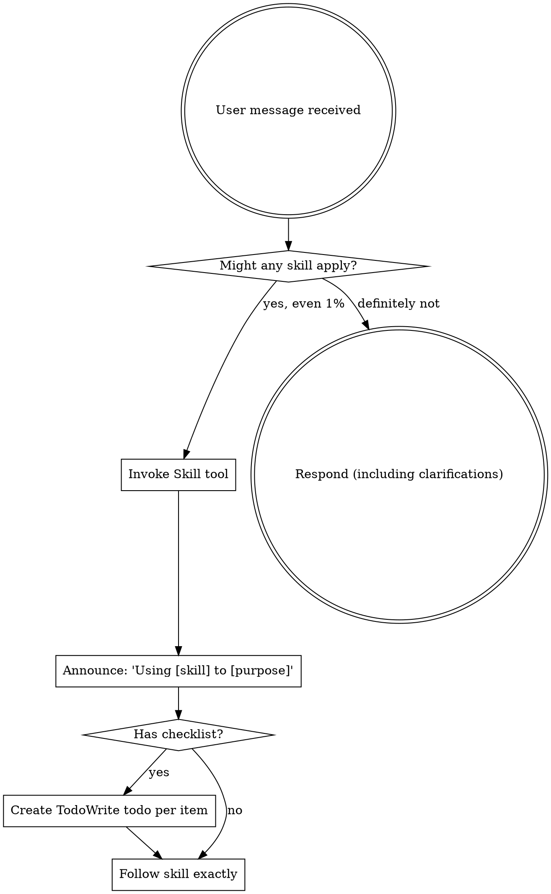

Reading additional input from stdin...
2026-08-15T12:30:08.597171Z ERROR codex_models_manager::manager: failed to refresh available models: timeout waiting for child process to exit
2026-08-15T12:30:08.597171Z ERROR codex_models_manager::manager: failed to refresh available models: timeout waiting for child process to exit
OpenAI Codex v0.147.0
--------
workdir: E:\技术资料\项目\mnrs\docs\审核_开局系统
model: gpt-5.6-sol
provider: openai
approval: never
sandbox: danger-full-access
reasoning effort: medium
reasoning summaries: none
session id: 01a00566-a6d5-7b90-abf1-6c38a331c8b6
--------
user
你是 Godot 4 游戏技术评审。

请先 Read 当前目录的 review_target.md，然后分两步：

【第一步：代码事实核对】到代码库 E:\技术资料\项目\mnrs 只 grep 清单文件（不遍历全树，10 分钟内）：
1. game_state.gd 的 current_year 默认值是否 -1046（文档说"剧本起点武王伐纣"）
2. character_manager.gd 是否有 birth_year 字段、年龄如何计算（current_year - birth_year?）
3. 是否有"成年/冠礼/成人礼"现有代码（character_manager.gd 或 hud.gd 里的 16 岁成年、职业选择逻辑）
4. 界面切换基础：social_level 判断、是否有地图/国家经营相关代码（判断"诸侯切地图系统"有没有现有基础）

【第二步：技术可行性评估】以下改造的可实现性与风险（Godot 4.3 GDScript）：
- birth_year 随机（-1090~-1062）
- 初次 0 岁开局 + 0-16 岁成长阶段（幼年被动/少年读书习武）
- 16 岁冠礼成年
- 出生季节彩蛋
- 诸侯/天子切换到大周列国志式地图系统（国家经营界面）

只审"技术可行性"一个维度，不要扩展到玩法/历史/预算。输出 P0（不可行或事实错误）/P1（高成本高风险）/P2（建议），每条标注【章节+原文+代码证据(文件:行号)+修改建议】。最后中文总结：核实几项、几处不符、几处技术风险、总体可行性判断。
2026-08-15T12:30:38.866466Z ERROR rmcp::transport::worker: worker quit with fatal: Transport channel closed, when Client(HttpRequest(HttpRequest("http/request failed: error sending request for url (https://developers.openai.com/mcp?source=codex)")))
2026-08-15T12:30:38.866443Z ERROR rmcp::transport::worker: worker quit with fatal: Client error: HTTP request failed: http/request failed: error sending request for url (https://chatgpt.com/backend-api/ps/mcp), when send initialized notification
ERROR: Reconnecting... 2/5
2026-08-15T12:31:08.879916Z ERROR rmcp::transport::worker: worker quit with fatal: Transport channel closed, when Client(HttpRequest(HttpRequest("http/request failed: error sending request for url (https://chatgpt.com/backend-api/ps/mcp)")))
ERROR: Reconnecting... 3/5
ERROR: Reconnecting... 4/5
ERROR: Reconnecting... 5/5
warning: Falling back from WebSockets to HTTPS transport. request timed out
2026-08-15T12:32:23.674468Z ERROR codex_models_manager::manager: failed to refresh available models: timeout waiting for child process to exit
ERROR: Reconnecting... 1/5
2026-08-15T12:33:13.623566Z ERROR codex_models_manager::manager: failed to refresh available models: timeout waiting for child process to exit
ERROR: Reconnecting... 2/5
ERROR: Reconnecting... 3/5
2026-08-15T12:35:38.400380Z ERROR codex_models_manager::manager: failed to refresh available models: timeout waiting for child process to exit
codex
我会先按 `using-superpowers` 与 `code-review` 的审查流程读取规则和 `review_target.md`，然后只对你列出的清单文件做定向检索，不递归扫描整个代码树。最终仅输出技术可行性分级与逐条代码证据。
exec
"C:\\Windows\\System32\\WindowsPowerShell\\v1.0\\powershell.exe" -Command "Get-Content -Raw -LiteralPath 'C:\\Users\\Lenovo\\.agents\\skills\\clawgator-superpowers\\skills\\using-superpowers\\SKILL.md'" in E:\技术资料\项目\mnrs\docs\审核_开局系统
exec
"C:\\Windows\\System32\\WindowsPowerShell\\v1.0\\powershell.exe" -Command "Get-Content -Raw -LiteralPath 'C:\\Users\\Lenovo\\.agents\\skills\\code-review\\SKILL.md'" in E:\技术资料\项目\mnrs\docs\审核_开局系统
exec
"C:\\Windows\\System32\\WindowsPowerShell\\v1.0\\powershell.exe" -Command "Get-Content -Raw -LiteralPath 'E:\\技术资料\\项目\\mnrs\\docs\\审核_开局系统\\review_target.md'" in E:\技术资料\项目\mnrs\docs\审核_开局系统
 succeeded in 374ms:
---
name: using-superpowers
description: Use when starting any conversation - establishes how to find and use skills, requiring Skill tool invocation before ANY response including clarifying questions
---

<EXTREMELY-IMPORTANT>
If you think there is even a 1% chance a skill might apply to what you are doing, you ABSOLUTELY MUST invoke the skill.

IF A SKILL APPLIES TO YOUR TASK, YOU DO NOT HAVE A CHOICE. YOU MUST USE IT.

This is not negotiable. This is not optional. You cannot rationalize your way out of this.
</EXTREMELY-IMPORTANT>

## How to Access Skills

**In Claude Code:** Use the `Skill` tool. When you invoke a skill, its content is loaded and presented to you鈥攆ollow it directly. Never use the Read tool on skill files.

**In other environments:** Check your platform's documentation for how skills are loaded.

# Using Skills

## The Rule

**Invoke relevant or requested skills BEFORE any response or action.** Even a 1% chance a skill might apply means that you should invoke the skill to check. If an invoked skill turns out to be wrong for the situation, you don't need to use it.



## Red Flags

These thoughts mean STOP鈥攜ou're rationalizing:

| Thought | Reality |
|---------|---------|
| "This is just a simple question" | Questions are tasks. Check for skills. |
| "I need more context first" | Skill check comes BEFORE clarifying questions. |
| "Let me explore the codebase first" | Skills tell you HOW to explore. Check first. |
| "I can check git/files quickly" | Files lack conversation context. Check for skills. |
| "Let me gather information first" | Skills tell you HOW to gather information. |
| "This doesn't need a formal skill" | If a skill exists, use it. |
| "I remember this skill" | Skills evolve. Read current version. |
| "This doesn't count as a task" | Action = task. Check for skills. |
| "The skill is overkill" | Simple things become complex. Use it. |
| "I'll just do this one thing first" | Check BEFORE doing anything. |
| "This feels productive" | Undisciplined action wastes time. Skills prevent this. |
| "I know what that means" | Knowing the concept 鈮?using the skill. Invoke it. |

## Skill Priority

When multiple skills could apply, use this order:

1. **Process skills first** (brainstorming, debugging) - these determine HOW to approach the task
2. **Implementation skills second** (frontend-design, mcp-builder) - these guide execution

"Let's build X" 鈫?brainstorming first, then implementation skills.
"Fix this bug" 鈫?debugging first, then domain-specific skills.

## Skill Types

**Rigid** (TDD, debugging): Follow exactly. Don't adapt away discipline.

**Flexible** (patterns): Adapt principles to context.

The skill itself tells you which.

## User Instructions

Instructions say WHAT, not HOW. "Add X" or "Fix Y" doesn't mean skip workflows.


 succeeded in 373ms:
---
name: code-review
description: Deterministic CodeRabbit review workflow for reviewing a diff, branch, or pull request. Use when asked to review code, run CodeRabbit, summarize findings, or turn CodeRabbit plain-text output into a Markdown report with the bundled scripts.
---

# Code Review

Run CodeRabbit through the bundled script so the workflow stays deterministic.

Use CodeRabbit as the only review source for findings. Do not add manual findings, speculative risks, or diff-based conclusions of your own.

## Available Script

- `scripts/coderabbit_review.py`
    - `review`: preflight checks, scope selection, optional base resolution, CodeRabbit plain-text execution, artifact generation
    - `render`: convert the normalized JSON artifact into the required Markdown report

Resolve that path from the skill directory, not from the repository being reviewed.

Do not assume the target repository contains `scripts/coderabbit_review.py`.

`review` writes these artifacts into `--output-dir`:

- `progress.json`: current wrapper state for polling long-running reviews
- `normalized.json`: normalized wrapper artifact with metadata and captured CodeRabbit output
- `report.md`: rendered Markdown report when available
- `coderabbit.stdout.log`: raw CodeRabbit stdout stream
- `coderabbit.stderr.log`: raw CodeRabbit stderr stream

Run `python3 <skill-dir>/scripts/coderabbit_review.py --help` or `python3 <skill-dir>/scripts/coderabbit_review.py review --help` if you need the exact interface.

## Required Workflow

1. Create a temporary artifact directory.
2. Run the deterministic review script against the repository the user wants reviewed.
3. If the review is long-running or launched in the background, poll `progress.json` in the artifact directory instead of rerunning the command.
4. If `progress.json` reaches `state: "artifacts_ready"` or `review` returns `status: "ok"`, run `render` on the normalized artifact.
5. If `progress.json` reaches `state: "error"` or `state: "timed_out"`, report the wrapper failure and include the artifact paths it produced.
6. Return the rendered Markdown to the user when available.

Reference flow:

```bash
ARTIFACT_DIR="$(mktemp -d)"
python3 <skill-dir>/scripts/coderabbit_review.py review \
  --repo "$PWD" \
  --output-dir "$ARTIFACT_DIR"
python3 <skill-dir>/scripts/coderabbit_review.py render \
  --input "$ARTIFACT_DIR/normalized.json"
```

When polling:

- prefer `progress.json` over terminal-session liveness
- do not start a second review if the first run's `progress.json` is still updating
- treat `state: "artifacts_ready"` as the success signal for rendering
- if `state: "running"`, the task is still in progress and you must keep polling the same artifact directory
- while `state: "running"`, do not return a status-only final answer and do not summarize intermediate wrapper state unless the user explicitly asks for progress
- only stop polling when the state becomes `artifacts_ready`, `error`, or `timed_out`

## Scope Rules

Prefer explicit scope from the user:

- review local WIP or unstaged work: `--scope uncommitted`
- review committed branch changes: `--scope committed`
- otherwise let the script choose with `--scope auto`

Use `--base <branch>` only when branch comparison matters or the user explicitly names a base branch.

Only pass `--config <path>` when the user explicitly names additional instruction files that exist. Do not scan the repository and invent config arguments for auto-detected guideline files.

## Preconditions

The script already enforces the required checks:

- inside a Git repository
- `HEAD` resolves
- `coderabbit` exists on `PATH`
- `coderabbit auth status --agent` succeeds

If preflight fails, stop and report the script's error. Do not run manual fallback review logic.

## Output Contract

Return the rendered Markdown report produced by `render`.

The report contains:

- summary metadata
- the captured CodeRabbit plain-text review when available
- structured finding sections only if CodeRabbit emits machine-readable findings despite the plain-text request

If the normalized report contains zero structured findings but includes plain-text review output, return that result directly. Do not add extra concerns.

## Source Policy

- Use only CodeRabbit output for findings.
- Do not inspect the diff to add new findings.
- Do not override or suppress findings unless they are exact duplicates merged by the script.
- Keep any explanation faithful to the normalized CodeRabbit output.


 succeeded in 373ms:
===== 鏂囨。A锛?1_浜掑姩妯″紡妗嗘灦.md =====

# 鍗庡妯℃嫙浜虹敓锛堣タ鍛ㄧ瘒锛壜?浜掑姩妯″紡閲嶈璁￠渶姹傛鏋朵功

> 鏂囨。缂栧彿锛?1 锝?鐗堟湰锛歷1.1 锝?鏃ユ湡锛?026-08-15 锝?鐘舵€侊細瀹氱锛堝緟涓夊紩鎿庨噸瀹★級
> 淇璇存槑锛歷1.0 缁忎笁寮曟搸瀹℃牳瀹氱锛泇1.1 琛ュ厖鐣岄潰鍒嗗眰锛堜富鐣岄潰鍙や唬浜虹敓寮忋€佽渚?澶╁瓙澶у懆鍒楀浗蹇楀湴鍥剧郴缁熴€佸浗瀹朵簨鍔″畬鏁村仛涓汉浜嬪姟鑷瑙ｅ喅锛? 寮€灞€鍑虹敓绯荤粺瀵归綈锛堝垵娆?0 宀併€?-16 宀佸彜浠ｄ汉鐢熷紡鎴愰暱銆?6 宀佸啝绀硷級銆?
> 渚濇嵁锛歚scripts/`锛堝凡鏍稿疄锛夈€乣02_绯荤粺闇€姹?md`銆乣docs/superpowers/specs/2026-08-15-鐜╂硶閲嶈璁?design.md`銆?
> 绾︽潫锛氫腑鏂囨敞閲婏紱鏃犲悗涓栬瘝锛涗笉鏂板缇庢湳璧勬簮锛涙棫妗?`.get()` 鍏滃簳銆?

---

## 銆囥€佺粨璁哄厛琛?

**鏍稿績闂**锛歮nrs 鐜板湪鍙湁"閲忓彉"娌℃湁"璐ㄥ彉"鈥斺€旀瘡涓搷浣滈兘鏄?鐐规寜閽?鈫?鎺烽 鈫?鏁板€兼定 鈫?寮逛竴琛屾棩蹇?锛屼汉鐢熸病鏈夋垙鍓ф€э紝鐜╄捣鏉?鍍忓～琛ㄤ笉鍍忚繃涓€鐢?銆?

**鏍稿績杞彉锛堜笁灞傝璁★級**锛?

| 璁捐 | 鍐呭 |
|---|---|
| 鈶?鏃堕棿骞村埗 | 1 骞?= 1 宀?= 1 涓搷浣滃懆鏈燂紝涓€骞翠竴宀佷粠瀹规帹杩涳紙鏇夸唬"涓€瀛ｄ竴瀛?鐨勭鑺傚锛?|
| 鈶?鐣岄潰鍒嗗眰 | 鎿嶄綔鐣岄潰鎸夎韩浠藉垏鎹細搴朵汉/澹?鍗垮ぇ澶?= 浜虹敓妯℃嫙鐣岄潰锛堝彜浠ｄ汉鐢熷紡锛夛紱璇镐警/澶╁瓙 = 鍥藉缁忚惀鐣岄潰锛堝ぇ鍛ㄥ垪鍥藉織寮忥級锛涘ゴ闅舵殏缂?|
| 鈶?鍙屽眰浜掑姩 | 姣忎釜鐣岄潰鍐呴兘鏄?鏃ュ父缁忚惀锛堥噺鍙橈級+ 鍏抽敭鎶夋嫨锛堣川鍙橈級"涓ゅ眰 |

**搴曞眰寮曟搸锛堝鏍镐慨姝ｅ悗鐨勫噯纭彁娉曪級**锛氫袱濂楃晫闈㈠叡鐢?*涓€濂楁満鍒舵鏋讹紙琛屽姩鐐?鎶夋嫨/鍛借繍绾匡級+ 涓ゅ棰嗗煙妯″瀷锛堜釜浜哄眰/鍥藉灞傦級+ 涓ゅ閰嶇疆琛?*銆備笉鏄?鍙崲閰嶇疆"锛屽浗瀹跺眰鏈夌嫭绔嬬殑棰嗗煙妯″瀷涓庣粨绠楄矾寰勩€?

**涓€鍙ヨ瘽鏈哄埗**锛氫竴骞翠竴宀佺粡钀ヨ韩浠斤紝鍏抽敭鏃跺埢鍋氭妷鎷╁畾鍛借繍锛岃韩浠借穬杩佹崲鐣岄潰銆?

---

## 涓€銆佺幇鐘朵簰鍔ㄦā寮忚瘖鏂紙宸叉牳瀹炰唬鐮侊級

| # | 鐥呮牴 | 璇佹嵁 | 鐜╁浣撴劅 |
|---|---|---|---|
| B1 | 浠嬪叆鍗曞厓鏄?鎸夐挳"锛屼笉鏄?閫夋嫨" | `hud.gd` 涓€鍫?`_do_*` 鎸夐挳 | "鎴戞槸鎿嶄綔鍛橈紝鍦ㄥ～琛? |
| B2 | 鍙嶉鏄?鏁板€?鏃ュ織"锛屼笉鏄?鍚庢灉" | 缁撴灉灏辨槸 `reputation += 5` + 涓€琛屽瓧 | "鏁板瓧鍦ㄥ姩锛屼絾浠€涔堥兘娌″彂鐢? |
| B3 | 浜嬩欢宸叉湁澶氶€夐鏋讹紝浣嗙己"鎶夋嫨鍒嗛噺" | `event_manager.gd:48` 鏈?`choices` 鏁扮粍銆乣:243` 鏈?`resolve_choice`锛?6 涓簨浠跺潎涓?2~3 閫夐」锛屼絾**缂洪€夐」绾ф潯浠堕棬妲涖€佽法浠ｅ悗鏋滐紙鍛借繍绾匡級銆佺粺涓€ UI 鎺ュ叆** | "鏈夐€夋嫨锛屼絾閫夊摢涓棤鎵€璋? |
| B4 | 鏃犺鍔ㄧ偣/鑺傚锛屾寜閽彲鏃犻檺鐐?| `_can_act`锛坔ud.gd:368锛夊彧鍋氬鑺傚喎鍗撮檺鍒朵笉鍋氬垎閰?| "鏃犺剳鐐瑰氨琛岋紝娌℃湁鍙栬垗" |
| B5 | **鏃堕棿纰?*锛? 瀛?骞达紝涓€瀛ｄ竴鎿嶄綔 | `time_manager.gd:8` 鍥涘鏋氫妇銆乣:44` `% 4` 鎺ㄨ繘 | "涓€瀛ｄ竴瀛ｇ偣锛屼汉鐢熻繃寰楀揩鍙堢" |

> 浠ｇ爜浜嬪疄锛圕odex 鏍稿疄锛夛細`character_manager.gd` 2882 琛屻€乣hud.gd` 5531 琛岋紙涓や釜"涓婂笣绫?锛夛紱`current_character`/`family_data` 鍧囦负 Dictionary锛坄game_state.gd:10`/`:22`锛夛紝瀛樻。鐩存帴 `JSON.stringify` 涓や釜瀛楀吀锛坄:279`/`:288`锛夈€?

---

## 浜屻€佹搷浣滅晫闈㈠垎灞傝璁?

### 2.1 涓夊鐣岄潰鎸夎韩浠?

```
韬唤闃跺眰            鎿嶄綔鐣岄潰          鍙傝€冩父鎴?       鐜╂硶閲嶅績
鈹€鈹€鈹€鈹€鈹€鈹€鈹€鈹€鈹€鈹€鈹€鈹€鈹€鈹€鈹€鈹€鈹€鈹€鈹€鈹€鈹€鈹€鈹€鈹€鈹€鈹€鈹€鈹€鈹€鈹€鈹€鈹€鈹€鈹€鈹€鈹€鈹€鈹€鈹€鈹€鈹€鈹€鈹€鈹€鈹€鈹€鈹€鈹€鈹€鈹€鈹€鈹€鈹€鈹€鈹€鈹€鈹€鈹€鈹€鈹€鈹€鈹€鈹€
澶╁瓙    鈹?
璇镐警    鈹? 鍥藉缁忚惀鐣岄潰      澶у懆鍒楀浗蹇?     娌荤悊锛氬唴鏀?鍐涙斂/澶栦氦/浜烘墠
鈹€鈹€鈹€鈹€鈹€鈹€鈹€鈹€鈹€鈹€鈹€鈹€鈹€鈹€鈹€鈹€鈹€鈹€鈹€鈹€鈹€鈹€鈹€鈹€鈹€鈹€鈹€鈹€鈹€鈹€鈹€鈹€鈹€鈹€鈹€鈹€鈹€鈹€鈹€鈹€鈹€鈹€鈹€鈹€鈹€鈹€鈹€鈹€鈹€鈹€鈹€鈹€鈹€鈹€鈹€鈹€鈹€鈹€鈹€鈹€鈹€鈹€鈹€
鍗垮ぇ澶? 鈹?
澹?     鈹? 浜虹敓妯℃嫙鐣岄潰      鍙や唬浜虹敓        涓汉锛氱珛涓?鍑轰粫/濠氶厤/瀹舵棌
搴朵汉    鈹?
鈹€鈹€鈹€鈹€鈹€鈹€鈹€鈹€鈹€鈹€鈹€鈹€鈹€鈹€鈹€鈹€鈹€鈹€鈹€鈹€鈹€鈹€鈹€鈹€鈹€鈹€鈹€鈹€鈹€鈹€鈹€鈹€鈹€鈹€鈹€鈹€鈹€鈹€鈹€鈹€鈹€鈹€鈹€鈹€鈹€鈹€鈹€鈹€鈹€鈹€鈹€鈹€鈹€鈹€鈹€鈹€鈹€鈹€鈹€鈹€鈹€鈹€鈹€
濂撮毝        鏆傜紦锛堝悗缃璁★級   鈥斺€?             鈥斺€?
```

### 2.2 鐣岄潰鍒囨崲瑙勫垯

| 闇€姹?ID | 闇€姹?| 璇存槑 |
|---|---|---|
| UI-1 | 韬唤璺冭縼鍒?璇镐警"鏃讹紝鐣岄潰浠?浜虹敓妯℃嫙"鍒囧埌"鍥藉缁忚惀" | 鍙楀皝涓鸿渚?= 鐣岄潰鍒囨崲鐐癸紱瑙掕壊鏈汉寤剁画锛屼釜浜哄眰淇濈暀銆佸彔鍔犲浗瀹跺眰 |
| UI-2 | 澶╁瓙涓?鍥藉缁忚惀鐣岄潰"鐨勬渶楂樺舰鎬侊紝浣?*鏈増鏈粯璁や笉鍙揪** | 澶╁瓙浠呬綔涓哄巻鍙茬獥鍙ｏ紙濡傜姮鎴庣伃鍛級鐨勭壒娈婃壆婕斿叧鍗?缁堝眬浣撻獙瀛樺湪锛?*涓嶆壙璇烘檵鍗囪矾寰?*锛堝鏍镐慨姝ｏ細閬垮厤"姝绘爣绛?锛?|
| UI-3 | 鍗垮ぇ澶強浠ヤ笅锛岀晫闈㈠悓鏋勶紙浜虹敓妯℃嫙锛夛紝浠呰鍔?鎶夋嫨鍐呭闅忚韩浠借В閿?| 搴朵汉/澹?鍗垮ぇ澶敤鍚屼竴鐣岄潰妯℃澘锛岄潬"鍐呭閰嶇疆"鍖哄垎锛屼笉鍋氫笁濂?|
| UI-4 | 璐埖/闄嶇骇鏃剁晫闈㈠洖鍒囷紙璇镐警琚船鈫掑洖浜虹敓妯℃嫙鐣岄潰锛夛紝灏佸浗鐘舵€佹寜璐埖/榛滈€愬垎娴佸缃?| 鐣岄潰闅忚韩浠藉弻鍚戝垏鎹紝闄嶇骇鍙€嗭紱灏佸浗澶勭疆瑙?搂涓?琛旀帴 |

### 2.3 涓ゅ鐣岄潰鐨勮鍔ㄦ竻鍗曚笌鎶夋嫨娓呭崟

**浜虹敓妯℃嫙鐣岄潰锛堝憾浜?澹?鍗垮ぇ澶級**锛?

| 琛屽姩绫伙紙姣忓勾琛屽姩鐐规姇鍏ワ級 | 鎶夋嫨锛堜汉鐢熼噷绋嬬锛?|
|---|---|
| 璋嬬敓锛氳€曚綔/灞ヨ亴/鏉備綔/浠庡啗 | 鍐犵ぜ锛堥€変汉鐢熸柟鍚戯級 |
| 瀛︿範锛氳涔?涔犳/鍏壓 | 濠氶厤锛堥€夎仈濮诲璞★級 |
| 绀句氦锛氫氦娓?鎷滆/瀹磋 | 绔嬪棧锛堥€夌户鎵夸汉锛?|
| 瀹朵簨锛氭暀鍏诲瓙濂?绁/淇籍 | 鍙楀皝锛堟帴鍙?濠夋嫆/鎷栧欢锛?|
| | 姝讳骸浜や唬锛堜紶浣?鏁ｈ储/椤惧懡鎵樺锛?|

**鍥藉缁忚惀鐣岄潰锛堣渚?澶╁瓙锛?*锛?

| 琛屽姩绫伙紙姣忓勾琛屽姩鐐规姇鍏ワ級 | 鎶夋嫨锛堝浗鏀?鏈濇斂锛?|
|---|---|
| 鍐呮斂锛氱瓚鍩?鍔濆啘/涓炬墠 | 浼氱洘锛堢粨鐩?鎷掔洘锛?|
| 鍐涙斂锛氱粌鍏?鍑哄緛/鎴嶈竟 | 寰佷紣锛堝嚭鎴?璇锋垚/閬挎垬锛?|
| 澶栦氦锛氫細鐩?鑱斿Щ/绾宠础 | 鏈濊锛堢撼璐?绉扮梾/鎶楀懡锛?|
| 浜烘墠锛氭眰璐?濮斾换/鎷旀摙 | 绔嬩笘瀛愶紙閫夌户鎵夸汉锛岃渚韩浠戒笅"绔嬪棧"鐨勫敮涓€鍏ュ彛锛?|
| **瀹朵簨锛堢 5 绫伙紝瀹℃牳琛ワ級**锛氬閰?鏁欏吇/绁/椤惧懡 | |

> 娉細鍥藉鐣岄潰琛?瀹朵簨"绫伙紝瑙ｅ喅"璇镐警涓汉灞備繚鐣欎絾娓呭崟鏃犲綊灞?鐨勬帴缂濓紙瀹℃牳鐜╂硶 P1-8锛夈€?绔嬩笘瀛?涓庝汉鐢熺晫闈㈢殑"绔嬪棧"鏄?*鍚屼竴鎶夋嫨鍦ㄨ渚韩浠戒笅鐨勫敮涓€鍏ュ彛**锛屼笉閲嶅瑙﹀彂銆?

### 2.4 濂撮毝韬唤锛堟殏缂擄紝鍚庣疆璁捐锛?

- 鏈増涓嶈璁″ゴ闅剁殑鍏蜂綋鎿嶄綔鐣岄潰涓庣帺娉曪紝浠呭湪韬唤琛ㄤ腑鍗犱綅锛堝ゴ闅?鈫?搴朵汉鐨勮穬杩佽鍒欐部鐢ㄧ幇鏈変唬鐮侊級銆?
- 鐢ㄨ瘝璇存槑锛堣€冩嵁锛夛細"濂撮毝"鏄幇浠ｇぞ浼氬鑼冪暣璇嶏紝瑗垮懆浠嗗焦瀵瑰簲"鑷ｅ/浠嗛毝/鐨傚彴"锛堛€婂乏浼犮€嬫槶涓冨勾鍗佺瓑锛夈€傛枃妗ｆ部鐢?濂撮毝"浣滅畝鍖栬瘝锛屽疄鏂芥椂鏂囨鍙爣娉ㄨタ鍛ㄧО璋撱€?
- 鍒嗘湡涓崟鍒?杩滄湡锛氬ゴ闅惰韩浠借璁?锛屼笉闃诲涓荤嚎銆?

---

### 2.5 鍥藉浜嬪姟涓庝釜浜轰簨鍔＄殑鍒嗗伐锛堢敤鎴峰畾绋匡級

| 鐣岄潰 | 浜嬪姟绫诲瀷 | 澶勭悊鏂瑰紡 |
|---|---|---|
| 浜虹敓妯℃嫙鐣岄潰锛堜富鐣岄潰锛屽彜浠ｄ汉鐢熷紡锛?| 涓汉/瀹舵棌浜嬪姟 | 鐜╁鑷瑙ｅ喅锛堣皨鐢?瀛︿範/绀句氦/瀹朵簨锛?|
| 鍥藉缁忚惀鐣岄潰锛堣渚?澶╁瓙锛屽ぇ鍛ㄥ垪鍥藉織寮?*鍦板浘绯荤粺**锛?| 鍥藉浜嬪姟 | 鍚涗富濮斾换/涓嬫斂浠わ紝涓嶄簨浜嬩翰涓猴紱鍐呮斂/鍐涙斂/澶栦氦/浜烘墠鍥涙敮鏌?*瀹屾暣鍋氥€佷笉鑳界己澶?* |
| 鍥藉缁忚惀鐣岄潰 | 涓汉/瀹舵棌浜嬪姟 | 鐜╁鑷瑙ｅ喅锛堜繚鐣欏彜浠ｄ汉鐢熷紡锛氬閰?鏁欏吇/绁/椤惧懡锛?|

---

## 涓夈€佹椂闂寸郴缁燂細骞村埗鎺ㄨ繘

### 3.1 骞村埗妯″瀷

| 闇€姹?ID | 闇€姹?| 璇存槑 |
|---|---|---|
| TS-1 | 鏃堕棿鍩烘湰鍗曚綅 = 骞达紱1 骞?= 1 宀?= 1 涓搷浣滃懆鏈?| 鏇夸唬鐜版湁 4 瀛ｅ埗锛坄time_manager.gd` 鏀归€狅級 |
| TS-2 | 姣忓勾娴佺▼锛氳鍔ㄨ鍒掞紙鍒嗛厤琛屽姩鐐癸級鈫?鎵ц 鈫?骞寸粓缁撶畻锛堟敹鎴?鎴愰暱/浜嬩欢锛?| 涓€骞翠竴娆?鎴戣骞插暐"鐨勫喅绛?|
| TS-3 | 瀛ｈ妭闄嶇骇涓?骞村唴灞曠ず"锛堜簨浠?鏂囨鎸夊鑺傚彊杩帮級锛屼笉鍐嶄綔涓烘搷浣?缁撶畻鍗曞厓 | 淇濈暀瀛ｈ妭鍙欎簨姘涘洿锛屽幓鎺夊鑺傛搷浣滆礋鎷?|
| TS-4 | 浜虹敓鑺傚锛氱害 60 骞?= 60 涓搷浣滃懆鏈燂紙鍑虹敓鈫掕€佹锛?| 浠庡"杩囦竴鐢?锛屼笉鍐嶄竴瀛ｄ竴瀛ｈ刀 |

### 3.2 骞村埗鐨勮繛甯︽敼鍔紙鍙ｅ緞鍚屾锛岄噸瑕侊級

| 杩炲甫椤?| 鐜扮姸 | 鏀逛负 |
|---|---|---|
| `time_manager.gd` | 4 瀛ｅ埗锛坄:8`/`:44`锛?| 鏂板 `advance_year()` + 缁熶竴 `AnnualSettlement`锛屾帹杩涗笌缁撶畻瑙ｈ€?|
| 缁忔祹鍙ｅ緞锛?2_绯荤粺闇€姹?md锛?| 绂?鑰楃伯 鍏?鐭?瀛?锛坈haracter_manager.gd:54/64锛?| 鍏?鐭?骞?锛埫? 鎴栭噸鏂伴敋瀹氾級 |
| 鐢板湴鏀舵垚 | "绉嬫敹瀛?缁撶畻 | "绉嬫敹锛堝勾锛?缁撶畻锛屽勾鍐呬竴娆?|
| 鍐峰嵈绯荤粺 | `_season_key()` 瀛ｇ骇鍐峰嵈锛坔ud.gd:365锛?| 骞村埗鍐峰嵈 + 鎸佷箙鍖栬繘瀛樻。 |
| 姝讳骸/琛拌€?鎬€瀛曟鐜?| 姣忓閫掑锛坱ime_manager.gd:184锛?| 鎸夎皟鐢ㄩ鐜囬噸鏂版崲绠?|
| 澹版湜鍋滄粸闃堝€?| 4/8 瀛ｏ紙character_manager.gd:689锛?| 1/2 骞?|

> 鈿狅笍 瀹℃牳锛堟妧鏈?P1-1锛夊己璋冿細骞村埗鏀归€?*涓嶆槸鍙敼 time_manager.gd**鈥斺€擧UD 鐨?`advance_season()`锛坔ud.gd:2226锛夊悗涓茶仈浜嗚“鑰?缁忔祹/瀹跺涵澶ч噺缁撶畻锛岀洿鎺ユ妸"瀛ｈ妭+1"鏀规垚"骞翠唤+1"浼氶€犳垚鏄庢樉琛屼负鍥炲綊銆傚繀椤诲厛鎶?鎺ㄨ繘"涓?缁撶畻"瑙ｈ€︺€?

---

## 鍥涖€佸簳灞傜粺涓€寮曟搸锛堜袱濂楃晫闈㈠叡鐢級

### 4.1 寮曟搸缁撴瀯

```
              鈹屸攢鈹€鈹€鈹€鈹€鈹€鈹€鈹€鈹€鈹€鈹€鈹€鈹€鈹€鈹€鈹€鈹€鈹€鈹€鈹€鈹€鈹€鈹€鈹€鈹€鈹€鈹€鈹€鈹€鈹€鈹€鈹€鈹€鈹?
              鈹? 骞村埗鏃堕棿寮曟搸锛圱imeSystem锛?      鈹?
              鈹? 1 骞?= 1 宀侊紝骞寸粓缁熶竴缁撶畻        鈹?
              鈹斺攢鈹€鈹€鈹€鈹€鈹€鈹€鈹€鈹€鈹€鈹€鈹€鈹€鈹€鈹攢鈹€鈹€鈹€鈹€鈹€鈹€鈹€鈹€鈹€鈹€鈹€鈹€鈹€鈹€鈹€鈹€鈹€鈹?
                             鈹?
              鈹屸攢鈹€鈹€鈹€鈹€鈹€鈹€鈹€鈹€鈹€鈹€鈹€鈹€鈹€鈻尖攢鈹€鈹€鈹€鈹€鈹€鈹€鈹€鈹€鈹€鈹€鈹€鈹€鈹€鈹€鈹€鈹€鈹€鈹?
              鈹? 琛屽姩鐐瑰紩鎿庯紙姣忓勾 N 鐐?+ 鍐峰嵈锛?   鈹?
              鈹? 鈹屸攢鈹€鈹€鈹€鈹€鈹€鈹€鈹€鈹€鈹€鈹€鈹€鈹?鈹屸攢鈹€鈹€鈹€鈹€鈹€鈹€鈹€鈹€鈹€鈹€鈹€鈹? 鈹?
              鈹? 鈹?浜虹敓妯℃嫙鐣岄潰鈹?鈹?鍥藉缁忚惀鐣岄潰鈹? 鈹?
              鈹? 鈹?琛屽姩娓呭崟A   鈹?鈹?琛屽姩娓呭崟B   鈹? 鈹?
              鈹? 鈹?鎶夋嫨娓呭崟A   鈹?鈹?鎶夋嫨娓呭崟B   鈹? 鈹?
              鈹? 鈹斺攢鈹€鈹€鈹€鈹€鈹€鈹€鈹€鈹€鈹€鈹€鈹€鈹?鈹斺攢鈹€鈹€鈹€鈹€鈹€鈹€鈹€鈹€鈹€鈹€鈹€鈹? 鈹?
              鈹?  锛堜竴濂楁満鍒讹紝涓ゅ棰嗗煙+閰嶇疆锛?      鈹?
              鈹斺攢鈹€鈹€鈹€鈹€鈹€鈹€鈹€鈹€鈹€鈹€鈹€鈹€鈹€鈹攢鈹€鈹€鈹€鈹€鈹€鈹€鈹€鈹€鈹€鈹€鈹€鈹€鈹€鈹€鈹€鈹€鈹€鈹?
                             鈹?
              鈹屸攢鈹€鈹€鈹€鈹€鈹€鈹€鈹€鈹€鈹€鈹€鈹€鈹€鈹€鈻尖攢鈹€鈹€鈹€鈹€鈹€鈹€鈹€鈹€鈹€鈹€鈹€鈹€鈹€鈹€鈹€鈹€鈹€鈹?
              鈹? 鎶夋嫨浜嬩欢寮曟搸锛圗ventSystem锛?      鈹?
              鈹? 澶氶€夐」 + 鏉′欢闂ㄦ + 鍚庢灉 + 鍛借繍绾? 鈹?
              鈹斺攢鈹€鈹€鈹€鈹€鈹€鈹€鈹€鈹€鈹€鈹€鈹€鈹€鈹€鈹€鈹€鈹€鈹€鈹€鈹€鈹€鈹€鈹€鈹€鈹€鈹€鈹€鈹€鈹€鈹€鈹€鈹€鈹€鈹?
```

### 4.2 寮曟搸缁熶竴鐨勫噯纭竟鐣岋紙瀹℃牳淇锛?

| 鍙鐢紙鏈哄埗灞傦級 | 涓嶅彲澶嶇敤锛堥鍩熷眰锛岄』鐙珛瀹炵幇锛?|
|---|---|
| 琛屽姩鐐圭粨绠椼€佸喎鍗淬€佸勾缁堢粨绠楁祦绋?| 涓汉灞傦細灞炴€?瀹惰储/瀹舵棌缁忔祹缁撶畻 |
| 鎶夋嫨鍒嗘敮銆佸懡杩愮嚎鍐欏叆 | 鍥藉灞傦細灏佸浗璐㈡斂/姘戝績/鍐涘姏缁撶畻 |
| 鏉′欢闂ㄦ鍒ゆ柇銆侀瀛?| 缁т綅鏈哄埗锛堜汉鐢熷眰=绔嬪棧浼犱綅锛涘浗瀹跺眰=骞间富/鎽勬斂/鑷ｅ瓙绐ラ紟锛?|

> 涓€鍙ヨ瘽锛?*涓€濂楁満鍒舵鏋?+ 涓ゅ棰嗗煙妯″瀷 + 涓ゅ閰嶇疆琛?*銆傛檵璇镐警鏄?鍙犲姞鍥藉灞?锛屼笉鏄?鏇挎崲閰嶇疆"锛堝鏍哥帺娉?P2-6 + 鎶€鏈?P1-3 鍙岄噸鎸囧嚭锛夈€?

---

## 浜斻€佹棩甯哥粡钀ュ眰璁捐锛堥噺鍙橈級

### 5.1 琛屽姩鐐规ā鍨嬶紙骞村埗锛?

| 闇€姹?ID | 闇€姹?| 璇存槑 |
|---|---|---|
| DL-1 | 浜虹敓鐣岄潰 8 鐐?骞达紱鍥藉鐣岄潰 **6 鐐癸紙鍥藉锛? 4 鐐癸紙涓汉锛夊弻姹?* | 瀹℃牳淇锛氳В鍐?涓汉灞備繚鐣欏彔鍔犲浗瀹跺眰"涓庡崟姹?6 鐐圭殑鐭涚浘锛涗釜浜哄眰鍑忓崐浣撶幇"涓哄悰鑰呰韩涓嶇敱宸?浣嗕笉褰掗浂 |
| DL-2 | 鍚勮鍔ㄨ€?1 鐐癸紱琛屽姩鐐逛笌鍐峰嵈骞跺瓨锛堣鍔ㄧ偣绠?姣忓勾鍋氬嚑浠?锛屽喎鍗寸"鑳藉惁閲嶅"锛?| 涓嶆帹缈?`_can_act`锛屽姞涓€灞傚勾閰嶉 |
| DL-3 | 鏈敤琛屽姩鐐逛笉璺ㄥ勾缁撹浆 | 淇濇寔骞村害鑺傚 |
| DL-4 | 骞煎勾/鑰佸勾**鍙噺浣撳姏绫昏鍔?*锛堣€曚綔/淇籍/鍑哄緛锛夎嚦鍑忓崐锛屽喅绛?鍏崇郴绫伙紙绔嬪棧/椤惧懡/绁/浜ゆ父锛変繚鎸佹弧鐐?| 瀹℃牳淇锛氶伩鍏嶈€佸勾灏剧洏鍥犵偣鏁颁笉瓒抽敊杩囦唬闄呬氦鎺?|
| DL-5 | **鍐峰嵈閿氱偣纭害鏉?*锛氫换浣曚竴骞达紝鎵ｉ櫎鍐峰嵈鍚庡彲鐢ㄨ鍔ㄦ暟 鈮?鏈晫闈㈣鍔ㄧ偣鏁?| 瀹℃牳琛ワ紙鐜╂硶 P1-3锛夛細鍚﹀垯"8 鐐?骞?鏉剧揣鏃犳硶鍒ゆ柇锛屽嚭鐜?鏈夌偣鏁版棤浜嬪彲鍋?鐨勭┖杞?|

### 5.2 鍙栬垗鎰熸潵婧?

- 姣忓勾鐐规暟鏈夐檺锛屾兂鍋氱殑浜嬭繙瓒呯偣鏁帮紝鐜╁蹇呴』鍙栬垗銆?
- 鍚勭被琛屽姩鏁堟灉浜掕ˉ涓嶅彲鏇夸唬锛氬彧璋嬬敓浼?瀵岃€屾棤鍚?锛堟湁澹版湜闂ㄦ鐨勬妷鎷╅€変笉浜嗭級锛屽彧绀句氦浼?绌峰洶娼﹀€?锛堟湁璧勬簮闂ㄦ鐨勬妷鎷╅€変笉浜嗭級銆?
- 闂ㄦ寤鸿**閮ㄥ垎鍔ㄦ€佸寲**锛堝鏍?P2-3锛夛細鍐涘姛鎸?鏈€杩?N 骞?璁★紙鏃堕棿琛板噺闃插洡鍔燂級锛岀帇瀹犻殢浜掑姩棰戠巼娉㈠姩锛岄伩鍏?鍙楀皝 build"寮忔妱浣滀笟銆?

---

## 鍏€佸叧閿妷鎷╁眰璁捐锛堣川鍙橈級

### 6.1 鎶夋嫨鍨嬩簨浠剁粨鏋勶紙鎵╁睍鐜版湁 choices 鍗忚锛屽鏍告妧鏈?P0-1 淇锛?

> 鈿狅笍 鐜扮姸婢勬竻锛歚event_manager.gd` 宸叉湁 `choices` 鏁扮粍 + `resolve_choice`锛?48/:243锛夛紝16 涓簨浠跺潎涓?2~3 閫夐」銆?*缂虹殑涓嶆槸"澶氶€夐」"锛屾槸"閫夐」绾ф潯浠堕棬妲?+ 璺ㄤ唬鍚庢灉 + 鎶夋嫨鍒嗛噺璁捐"**銆?

| 闇€姹?ID | 闇€姹?| 璇存槑 |
|---|---|---|
| CD-1 | **鎵╁睍鐜版湁 `choices` 鍗忚**锛屼笉鍙﹀缓 `options` | 缁撴瀯锛歚choices: [{text, conditions, disabled_reason, resolution, effects}]` |
| CD-2 | 閫夐」绾у墠缃潯浠讹紙灞炴€?韬唤/璧勬簮/鍏崇郴杈炬爣鎵嶅彲閫夛級 | 涓嶈揪鏍囩伆鑹?+ `disabled_reason` 鎻愮ず缂轰粈涔?|
| CD-3 | 閫夐」鍚庢灉瑕?鏈夊彇鑸?锛氭湁寰楁湁澶憋紝绂佹"绾鐩? | 鍒ゆ柇鏍囧噯瑙?6.3 |
| CD-4 | 鍏抽敭閫夐」甯﹂殢鏈烘€э細**鏂瑰悜鐢遍€夋嫨瀹氾紝鎴愯触鐢遍瀛愬畾"绋嬪害"涓嶅畾"鐢熸"** | 瀹℃牳淇锛堢帺娉?P1-5锛夛細涓夋。"澶ц儨/灏忔垚/澶辫触"锛屽け璐ヤ繚鐣欐浼樺悗鏋滐紱閫夐」鏃佺粰鎴愬姛鐜囬瑙堬紙楂?涓?浣庯級 |
| CD-5 | 鎶夋嫨缁撴灉鍐欏叆"瀹舵棌鍛借繍绾?锛岃法瀛?璺ㄤ唬寤剁画 | 澶嶇敤鐜版湁 `event_history`锛坓ame_state.gd:116锛変綔鏁版嵁鏉ユ簮 |

### 6.2 鎶夋嫨瑙﹀彂娓呭崟锛堟寜鐣岄潰锛?

- **浜虹敓妯℃嫙鐣岄潰**锛氬啝绀?/ 濠氶厤 / 绔嬪棧 / 鍙楀皝 / 姝讳骸浜や唬锛堟瘡浠ｅ浐瀹氶噷绋嬬锛?
- **鍥藉缁忚惀鐣岄潰**锛氫細鐩?/ 寰佷紣 / 鏈濊 / 绔嬩笘瀛愶紙鍥芥斂鎶夋嫨锛?
- **鍘嗗彶绐楀彛**锛堜袱鐣岄潰閮藉彲鑳借Е鍙戯級锛氫笁鐩戜箣涔?/ 鍛ㄥ叕杩樻斂 / 鐘垘鐏懆锛堣鎺?design.md P4锛涘彲琛ユ垚搴蜂箣娌汇€佹槶鐜嬪崡寰併€佸帀鐜嬩笓鍒┾啋鍥戒汉鏆村姩鈫掑叡鍜岋級

### 6.3 鎶夋嫨"鍒嗛噺"鐨勫垽鏂爣鍑?

**鍧忔妷鎷╋紙鍋囬€夋嫨锛?*锛氶€?A 澹版湜+5锛岄€?B 澹版湜+3 鈥斺€?鏃犲彇鑸嶏紝鍥炲埌鍒锋暟鍊笺€?

**濂芥妷鎷╋紙鐪熼€夋嫨锛?*锛屼互"鍙楀皝"涓轰緥锛堝惈鑰冩嵁鐢ㄨ瘝淇锛夛細

| 閫夐」 | 鏉′欢闂ㄦ | 鍚庢灉 |
|---|---|---|
| 鎺ュ彈鐜嬪懡锛屽彈灏佸缓渚?| 澹版湜鈮?20 涓?鎴樺姛鈮? 涓?鐜嬪疇鈮?0 | 鍗囦负璇镐警銆佸緱灏佸湴銆佸鏃忚縼鍥斤紱浣?*浠庢澶卞幓鐜嬪鏈濇斂绫昏鍔?*锛堝彲楠岃瘉浠ｄ环锛夛紝椋庨櫓鑷媴 |
| 濠夋嫆锛岀暀浠荤帇瀹?| 鏃?| 淇濅綇鐜嬪畼涔嬩綅涓庣帇瀹狅紝涓灑鏉冨姏鎸佺画璧伴珮锛屼絾閿欒繃灏佷警鏃舵満 |
| 鐘硅鲍鎷栧欢 | 鏃?| 鐜嬪疇-10锛屾満浼氬彲鑳芥梺钀戒粬浜?|

> 鍒ゆ柇鏍囧噯锛堝鏍歌ˉ寮猴紝鐜╂硶 P1-4锛夛細鈶犳妸姣忎釜閫夐」鐨勫悗鏋滃幓鎺夛紝閫夐」杩樻湁娌℃湁鍖哄埆锛熲憽**鏈€浼橀€夐」鏄惁闅忕帺瀹跺澧冨彉鍖?*锛熲憿**姣忎釜閫夐」鐨勪唬浠峰繀椤昏兘鍐欐垚 鈮? 涓潰鏉挎暟鍊肩殑鏄庣‘鍙樺姩锛屾垨涓€鍙ュ彲楠岃瘉鐨?浠庢涓嶈兘鍋氫粈涔?**鈥斺€斿啓涓嶅嚭鐨勪唬浠风瓑浜庢病鏈変唬浠枫€?

### 6.4 姝讳骸涓よ建 + 缁濆棧鍏滃簳锛堝鏍哥帺娉?P0-1 / P1-1 琛ワ紝浠ｉ檯浜ゆ帴鏄懡闂級

| 闇€姹?ID | 闇€姹?| 璇存槑 |
|---|---|---|
| CD-6 | **鑷劧姝讳骸锛堜富杞級**锛氱害 50 宀佸悗姣忓瞾鎶?瀵挎暟楠?锛屽懡涓墠 2~3 骞寸粰"韬綋娓愯“"棰勮 鈫?寮ョ暀鏈熻繘鍏ュ浐瀹氭妷鎷╃獥鍙ｏ紝姝讳骸浜や唬蹇呰Е鍙?| 鎴忓墽鎬т笌纭畾鎬у吋寰?|
| CD-7 | **鎰忓姝讳骸锛堜綆棰戦珮鎴忓墽锛?*锛氭垬姝?鐤柧/鍒轰激锛岃Е鍙戠畝鍖栫増涓寸粓鍒嗘敮锛?~2 閫夐」锛夛紝浠ｄ环鏄?閬楄█娈嬬己"鈥斺€斿瓙濂崇户鎵垮睘鎬ч殢鏈烘伓鍖栨垨鎶樺崐 | 鍛借繍绾挎案杩滄湁妗ｅ彲璁?|
| CD-8 | **缁濆棧鍏滃簳**锛氭棤鍡?鈫?杩囩户瀹楁棌瀛?鏀朵箟瀛愶紙鏉′欢锛氬０鏈涙垨璐骇闂ㄦ锛夆啋 浠嶆棤 鈫?"鍥介櫎/瀹剁粷"锛堣储浜у厖鍏€佸鏃忕嚎缁堟銆佽繘鏂板紑灞€锛?| 缁濆棧鏄《绾ф垙鍓х粨灞€锛屽簲鏈夋槑纭粨绠?|

### 6.5 瀹舵棌鍛借繍绾?

| 闇€姹?ID | 闇€姹?| 璇存槑 |
|---|---|---|
| FL-1 | 鎶夋嫨缁撴灉鍐欏叆 `family_data.fate_line`锛堝摢骞淬€佷粈涔堟妷鎷┿€侀€変簡浠€涔堛€佸悗鏋滐級 | 澶嶇敤 `event_history` 杩佺Щ |
| FL-2 | 鍏抽敭鎶夋嫨褰卞搷涓嬩竴浠ｅ紑灞€锛堢埗杈堟妷鎷┾啋瀛愬コ璧峰灞炴€?璧勬簮/鍏崇郴锛?| 椤惧懡鎵樺鈫掑瓙濂冲０鏈?浣嗘爲鏁岋紱鏁ｈ储鈫掕储瀵?浣嗗悕澹? |
| FL-3 | 灏侀攣鍚庨棬锛氶敊閫夊悗鏋滀笉鍙挙閿€锛堥敊杩囩殑闂ㄥ叧浜嗗氨鍏筹級 | 鍛煎簲 design.md"鐣欑獎闂ㄤ笉鐣欏悗闂? |
| FL-4 | **閫嗗懆鏈熸晳娴庢満鍒?*锛堝鏍?P2-4 琛ワ級锛氭瘡浠ｅ紑灞€缁?瀹楁棌/涔″厷鎻村姪"淇濆簳 + 闅忔満"鏈虹紭浜嬩欢"缈荤洏鍙ｅ瓙 | 闃叉鍛借繍绾挎妸鍗曚唬鍔ｅ娍鍙樻垚澶氫唬纭畾鎬ц传鍥伴櫡闃?|

---

## 涓冦€佷袱灞傝鎺ユ満鍒讹紙閲忓彉 鈫?璐ㄥ彉锛?

| 鏂瑰悜 | 鏈哄埗 | 闇€姹?ID |
|---|---|---|
| 閲忓彉鈫掕川鍙?| 鎶夋嫨閫夐」鐨勫墠缃潯浠?= 鏃ュ父绱Н鐨勮祫鏍?| CD-2 / DL |
| 璐ㄥ彉鈫掗噺鍙?| 鎶夋嫨缁撴灉瑙ｉ攣/灏侀攣琛屽姩锛堝彈灏佲啋鍒囧浗瀹剁晫闈紱璐埖鈫掑け灞ヨ亴锛?| CD-3 / UI |
| 鍙嶉鍙 | 鎶夋嫨鍚庢灉鍦ㄥ悗缁棩甯镐腑"鐪嬪緱瑙?锛堝懡杩愮嚎 + 闈㈡澘鐘舵€侊級 | FL-1 |
| 鑺傚鎺у埗 | 鍏抽敭鎶夋嫨"鍒扮偣瑙﹀彂銆侀敊杩囦笉鍐?锛岃嚜鍔ㄦ帹杩涘埌绐楀彛蹇呴』鏆傚仠 | 鎵挎帴 design.md P4 |
| 璐埖澶勭疆 | 璐埖锛堝厖鍏級/榛滈€愶紙浼犲瓙/鏆傜锛夊垎娴侊紝鏄庣‘鍙惁澶嶈捣銆佹槸鍚︿繚鐣欐棫閮ㄦ棫鑷ｆ畫浣欒祫婧?| 瀹℃牳鐜╂硶 P1-7 琛?|

---

## 鍏€佹敮鎾戞灦鏋勶紙鍦板熀锛孭0锛?

> 浜掑姩妯″紡閲嶈璁¤钀藉湴锛岄』鍏堣繕鏋舵瀯鍊恒€傝瑙併€?3_瀵规爣鍒嗘瀽.md銆嬬鍥涚珷锛屾澶勫垪缁撹锛堝惈 Codex 琛ュ己锛夛細

| 闇€姹?ID | 鏀拺椤?| 涓轰粈涔堟槸鍓嶇疆 |
|---|---|---|
| AR-1 | 鍥涘眰鍒嗗眰锛堣〃鐜?搴旂敤/棰嗗煙/鍩虹璁炬柦锛?| 涓ゅ鐣岄潰 UI 涓庣粨绠楀垎绂?|
| AR-2 | 鏁版嵁妯″瀷鍖栵紙Character/Family/Faction/FateLine 鈫?Resource锛夛紝**鍒嗛樁娈佃縼绉?* | 鍏堝姞 `schema_version`銆丷esource 瀹炵幇 `to_dict()/from_dict()`銆佸厛杩佹牳蹇冨瓧娈靛啀鏀剁揣鏍￠獙锛岄伩鍏嶅叏閲忎竴娆¤縼绉诲啿鍑诲瓨妗?|
| AR-3 | 绯荤粺鍖栨媶鍒嗭紙8 System 浠?hud.gd 鎶藉嚭锛?| 琛屽姩鐐圭粨绠椼€佹妷鎷╃粨绠楀悇鏈夊綊灞?|
| AR-4 | 鍛戒护妯″紡 + **缁熶竴琛屽姩鍏ュ彛 `ActionService.execute()`** | 瀹℃牳鎶€鏈?P1-2锛氬揩鎹烽敭/涓€閿棩甯?寮圭獥鍥炶皟/鑷姩妯″紡鍏ㄨ蛋鍞竴鍏ュ彛锛岄槻琛屽姩鐐硅缁曡繃 |
| AR-5 | 鍐峰嵈鎸佷箙鍖?+ 缁熶竴鎵ц鍣?| 骞村埗鍐峰嵈 + 琛屽姩鐐瑰弻杞紝鏉滅粷"鍒? |
| AR-6 | **韬唤璺敱鍣?*锛氱洃鍚?`social_level` 鍙樺寲锛屽垏鎹㈢晫闈絾淇濇寔鍚屼竴棰嗗煙鐘舵€?| 澶嶇敤宸叉湁 `can_promote`/`grant_promotion`/`promote_character`锛坈haracter_manager.gd:414/454/525锛夛紝涓嶅鍒舵檵鍗囪鍒?|

---

## 涔濄€佸垎闃舵瀹炴柦妗嗘灦

```
P0 鏋舵瀯鍦板熀锛圓R-1~6锛氬垎灞?妯″瀷鍖?鍛戒护+骞村埗鏃堕棿鏀归€狅級鈥斺€?鍓嶇疆锛岀函閲嶆瀯琛屼负涓嶅彉
   鈹?
P1 鏃ュ父缁忚惀灞偮蜂汉鐢熺晫闈紙琛屽姩鐐规ā鍨?+ 鍥涚被琛屽姩鏀舵暃锛夆€斺€?搴朵汉/澹?鍗垮ぇ澶?
   鈹?
P2 鍏抽敭鎶夋嫨灞偮锋満鍒讹紙鎵╁睍鐜版湁 choices 鍗忚 + 鍛借繍绾?+ 姝讳骸涓よ建/缁濆棧鍏滃簳锛?
   鈹?
P3 鐣岄潰鍒嗗眰钀藉湴锛圲I-1~4 + 鍥藉缁忚惀鐣岄潰 + 韬唤璺敱鍣級
   鈹?
P4 鎶夋嫨鍐呭閾烘帓锛堜汉鐢熼噷绋嬬 + 鍘嗗彶浜嬩欢鎶夋嫨鍖栵紝铻嶅悎 design.md P3/P4锛?
   鈹?
P5 涓ゅ眰琛旀帴鎵撶（锛堥棬妲?鑸炲彴鍙嶉 + 鑺傚 + 閫嗗懆鏈熸晳娴庯級
   鈹?
杩滄湡  濂撮毝韬唤璁捐锛堟殏缂撳悗缃級
```

| 闃舵 | 鍐呭 | 渚濊禆 | 璇存槑 |
|---|---|---|---|
| P0 | 鍒嗗眰 + 妯″瀷鍖?+ 鍛戒护 + **骞村埗鏃堕棿鏀归€?*锛圓R-1~6 + TS锛?| 鏃?| 骞村埗蹇呴』鍦?P1 鍓嶈惤鍦帮紙琛屽姩鐐规槸"姣忓勾"锛?|
| P1 | 浜虹敓鐣岄潰琛屽姩鐐规ā鍨嬶紙DL-1~5锛?| P0 | 浜掑姩鏍稿績鈶狅紝鍏堝仛搴朵汉/澹?鍗垮ぇ澶?|
| P2 | 浜嬩欢鎶夋嫨鍖?+ 鍛借繍绾?+ 浠ｉ檯浜ゆ帴锛圕D-1~8 + FL-1~4锛?| P0 | 浜掑姩鏍稿績鈶★紝涓ょ晫闈㈠叡鐢ㄦ満鍒?|
| P3 | 鐣岄潰鍒嗗眰钀藉湴锛圲I-1~4 + 鍥藉缁忚惀鐣岄潰锛?| P1+P2 | 璇镐警/澶╁瓙锛屽ぇ鍛ㄥ垪鍥藉織寮?|
| P4 | 鎶夋嫨鍐呭閾烘帓锛堥噷绋嬬+鍘嗗彶浜嬩欢锛?| P2 | 铻嶅悎 design.md P3/P4 |
| P5 | 涓ゅ眰琛旀帴鎵撶（ + 鑺傚 | P1+P3 | 鍙嶉闂幆 + 绐楀彛鏆傚仠 |
| 杩滄湡 | 濂撮毝韬唤 | P5 鍚?| 鏆傜紦锛岀嫭绔嬭璁?|

**鍏抽敭鍒ゆ柇**锛氬勾鍒舵椂闂存槸 P0 鐨勪竴閮ㄥ垎銆侾1锛堜汉鐢熺晫闈級涓?P2锛堟妷鎷╁紩鎿庯級浜掍笉闃诲鍙苟琛屻€侾3锛堝浗瀹剁晫闈級澶嶇敤 P1+P2 鐨勬満鍒舵鏋讹紝浣嗗浗瀹跺眰棰嗗煙妯″瀷椤荤嫭绔嬪疄鐜帮紙瑙?搂4.2锛夛紝涓嶆槸"閰嶇疆灏辫兘鍒?銆?

---

## 鍗併€侀闄╀笌绾︽潫

| # | 椋庨櫓 | 褰卞搷 | 搴斿 |
|---|---|---|---|
| R1 | 鎶夋嫨鎯╃綒杩囬噸 鈫?鐜╁鎬曢€夐敊 | 鐣欏瓨宕?| 鍚庢灉"鏈夊緱鏈夊け"锛涢瀛愬畾绋嬪害涓嶅畾鐢熸锛涘け璐ョ暀娆′紭 |
| R2 | 琛屽姩鐐硅繃绱?鈫?鍗¤祫婧愮劍铏?| 浣撻獙鍙樼疮 | DL-5 鍐峰嵈閿氱偣纭害鏉燂紙鍙敤琛屽姩鏁扳墺鐐规暟锛? 涓婄嚎鍓嶈瘯鐜╂牎鍑?|
| R3 | 鎶夋嫨鍒嗘敮鐖嗙偢 鈫?浜嬩欢鏁版嵁澶辨帶 | 鎴愭湰楂?| 鎶夋嫨鍙仛"閲岀▼纰?鍥芥斂+鍘嗗彶绐楀彛"锛屾棩甯镐簨浠朵繚鎸佽交閲忥紙浣嗙粰鏃ュ父琛屽姩鍔?2~3 涓彲鍙樼粨鏋滄枃妗堬紝瑙佸鏍?P2-1锛?|
| R4 | 骞村埗鏀归€犺Е鍙婃椂闂?缁忔祹+鍐峰嵈+姝讳骸鍏ㄧ嚎 | 鍥炲綊椋庨櫓 | 鎺ㄨ繘涓庣粨绠楄В鑰︼紙TS锛夛紝P0 鍏堣窇閫氱幇鏈夋祴璇曞啀涓婅鍔ㄧ偣 |
| R5 | 鍥藉鐣岄潰鍋氶噸/鍋氭祬 鈫?瀹氫綅婕傜Щ鎴栫┖澹?| 涓ゅご鍧?| 鍏?杞荤粡钀?锛堝浠?浜у嚭锛夛紝浣嗘槑纭浗瀹跺眰鏈夌嫭绔嬮鍩熸ā鍨嬶紙搂4.2锛夛紝閬垮厤"鍙崲閰嶇疆"鍋氭祬 |
| R6 | 涓ゅ鐣岄潰鍒囨崲绐佸厐 | 鍓茶鎰?| 鐣岄潰鍒囨崲閰?鍙楀皝/鐜嬪懡"鍓ф儏杩囨浮锛岃韩浠借矾鐢卞櫒骞虫粦鍒囨崲 |

**纭害鏉燂紙寤剁画锛?*锛氫腑鏂囨敞閲婏紱鏃犲悗涓栬瘝锛堜含瀹?鏈濆爞/淇哥/鍐屽懡鐢ㄤ簬灏佸缓 绛夊凡鎸夎€冩嵁淇锛夛紱涓嶆柊澧炵編鏈祫婧愶紱鏃ф。鍏滃簳锛涙湰鍦?git 鎻愪氦銆?

---

## 鍗佷竴銆佸畾绋垮喅绛栵紙宸叉媿鏉匡紝缁忎笁寮曟搸瀹℃牳淇锛?

| # | 鍐崇瓥椤?| 瀹氱鍊硷紙鍚鏍镐慨璁級 | 鐞嗙敱 |
|---|---|---|---|
| 1 | 琛屽姩鐐瑰瘑搴?| 浜虹敓鐣岄潰 8 鐐?骞达紱鍥藉鐣岄潰 **6锛堝浗瀹讹級+4锛堜釜浜猴級鍙屾睜**锛涙湭鐢ㄧ偣涓嶇粨杞?| 鍙屾睜瑙ｅ喅"涓汉灞備繚鐣?涓庡崟姹犵煕鐩撅紙瀹℃牳鐜╂硶 P1-2锛?|
| 2 | 骞村埗涓嬪鑺?| 淇濈暀涓?骞村唴灞曠ず"锛屽幓鎺夊鑺傛搷浣?| 淇濈暀鍙欎簨姘涘洿锛屽幓鎺夋搷浣滆礋鎷?|
| 3 | 鎶夋嫨鎯╃綒鍔涘害 | 鍘嗗彶绔欓槦绫婚噸缃氾紙璐埖/鏀鹃€愶級銆佷汉鐢熸棩甯哥被杞荤綒锛堝け瀹?鍑忓０鏈涳級锛?*楠板瓙瀹氱▼搴︿笉瀹氱敓姝?+ 鎴愬姛鐜囬瑙?+ 澶辫触鐣欐浼?* | 绔欓槦瀹氬瓨浜★紝鏃ュ父鍙瘯閿欙紝闅忔満涓嶈祵鐢熸锛堝鏍哥帺娉?P1-5锛?|
| 4 | 鍛借繍绾挎繁搴?| 鍩虹=鐖惰緢鎶夋嫨褰卞搷瀛愬コ寮€灞€灞炴€э紱澧炲己=灏侀攣/瑙ｉ攣閫夐」锛圥5锛夛紱**琛ラ€嗗懆鏈熸晳娴庨槻璐洶閿佸畾** | 鍏堝仛鍩虹锛屽寮鸿鎵撶（鍙嶉 |
| 5 | 鍥藉鐣岄潰娣卞害 | 鍏堣交缁忚惀锛堝浠?浜у嚭锛夛紝閲嶇粡钀ョ暀杩滄湡锛?*鏄庣‘"涓€濂楁満鍒?涓ゅ棰嗗煙"** | 闃插畾浣嶆紓绉伙紝涔熼槻"鍙崲閰嶇疆"鍋氭祬 |
| 6 | 濂撮毝韬唤 | 鏆備笉瀹氫綅锛屽仛鍒板啀璇达紱鏂囨鏍囨敞"鑷ｅ浠嗛毝" | 涓嶉樆濉炰富绾?|

---

## 鍗佷簩銆佷笁寮曟搸瀹℃牳鍚堝苟璁板綍锛?026-08-15锛?

涓夊紩鎿庣嫭绔嬪苟琛屽鏍革紝瀹＄殑缁村害鍒嗗紑锛?*鐜╂硶/鏁板€?*锛堣祫娣辨ā鎷熺粡钀ョ瓥鍒掞級銆?*鍘嗗彶鑰冩嵁**锛堣タ鍛ㄥ彶涓撳锛夈€?*鎶€鏈彲琛屾€?*锛圙odot 4 鎶€鏈瘎瀹★紝鍚唬鐮佷簨瀹炴牳瀵癸級銆?

### 12.1 瀹℃牳缁熻

| 寮曟搸 | 瀹＄殑缁村害 | P0 | P1 | P2 | 鏍稿績鍙戠幇 |
|---|---|---|---|---|---|
| 鐜╂硶/鏁板€?| 涓ゅ眰缁撴瀯/琛屽姩鐐?鎶夋嫨鍒嗛噺/鐣岄潰鍒嗗眰/骞村埗/琛旀帴 | 1 | 8 | 6 | 浠ｉ檯浜ゆ帴鐜湭瀹氫箟銆佽鍔ㄧ偣缂烘澗绱у垽鎹€佹妷鎷╀唬浠锋墽琛屾爣鍑?|
| 鍘嗗彶鑰冩嵁 | 鍚庝笘璇?鏈哄埗/瀹樿亴/韬唤/鍘嗗彶浜嬩欢 | 3 | 3 | 13 | "浜畼/鏈濆爞/淇哥"涓夊鍚庝笘璇嶃€?鍐屽懡"璇敤浜庡皝寤?|
| 鎶€鏈?| 浠ｇ爜浜嬪疄鏍稿 + 鍙鎬?| 1 | 4 | 4 | 浜嬩欢宸叉湁 choices锛堥潪鍗曠粨鏋滐級銆佸勾鍒舵敼閫犳尝鍙婇潰澶с€佽鍔ㄧ偣闇€缁熶竴鍏ュ彛 |

### 12.2 浜ゅ弶姣斿缁撹锛堝弻寮曟搸閲嶅彔 = 鐪熺‖浼わ級

| 閲嶅彔椤?| 寮曟搸 | 澶勭疆 |
|---|---|---|
| 琛屽姩鐐规ā鍨嬩笉瀹屾暣 | 鐜╂硶 P1-3 + 鎶€鏈?P1-2 | 鉁?閲囩撼锛氳ˉ DL-5 鍐峰嵈閿氱偣纭害鏉?+ AR-4 缁熶竴琛屽姩鍏ュ彛 |
| "鍙崲閰嶇疆"杩囧害涔愯 | 鐜╂硶 P2-6 + 鎶€鏈?P1-3 | 鉁?閲囩撼锛氭彁娉曟敼涓?涓€濂楁満鍒?+ 涓ゅ棰嗗煙 + 涓ゅ閰嶇疆"锛埪?.2锛?|

### 12.3 浜嬪疄閿欒淇锛圕odex 鏍稿疄锛屽繀鏀癸級

- **浜嬩欢绯荤粺闈?鍗曠粨鏋?**锛歚event_manager.gd` 宸叉湁 `choices` + `resolve_choice`锛?6 浜嬩欢鍧?2~3 閫夐」锛涚己鐨勬槸"閫夐」绾?condition"銆侰D-1 鏀逛负"鎵╁睍鐜版湁 choices 鍗忚"鑰岄潪"鏂板 options"銆?

### 12.4 鍚庝笘璇嶄慨姝ｏ紙鑰冩嵁锛岃繚鍙嶈嚜璁剧‖绾︽潫锛岀洿鎺ユ敼锛?

| 鍘熻瘝 | 鏀逛负 | 浣嶇疆 |
|---|---|---|
| 浜畼 | 鐜嬪畼 / 鍛ㄥ涔嬪畼 | 搂6.3 鍙楀皝绀轰緥 |
| 鏈濆爞 | 鏈濇斂 / 鏈濆环 | 搂2.3 鍥藉鐣岄潰 |
| 淇哥 | 绂?/ 绂勭敯 | 搂3.2 缁忔祹鍙ｅ緞 |
| 鍐屽懡锛堝皝寤哄満鏅級 | 鐜嬪懡锛?鐜嬪懡XX杩佷警浜嶺X"锛?| 搂6.3 鍙楀皝绀轰緥 |
| 浠曢€?| 鍑轰粫 / 鍏ヤ粫 | 搂2.3 浜虹敓鐣岄潰 |
| 澶栧揩 | 鏉備綔 / 鍓笟 | 搂2.3 璋嬬敓绫?|

鍙︽湁 13 鏉?P2 鐢ㄨ瘝浼樺寲锛堟垚浜虹ぜ鈫掑啝绀笺€佹墭瀛も啋椤惧懡銆佺珛鍌ㄢ啋绔嬩笘瀛愩€佸ず鐖碘啋璐埖銆佸啗鍔熲啋鎴樺姛銆佹祦鏀锯啋鏀鹃€愩€佹嫑鍕熲啋姹傝搐銆佽鍜屸啋璇锋垚銆佺帇搴啋鐜嬪銆佹檵璇镐警鈫掑彈灏佷负璇镐警銆佸菇鐜嬩骸鍥解啋鐘垘鐏懆銆佸ゴ闅舵爣娉ㄨ嚕濡句粏闅躲€佽ˉ鎴愬悍/鏄帇/鍘夌帇鍘嗗彶绐楀彛锛夛紝宸插叏鏂囬噰绾炽€?

### 12.5 琛ョ粏鑺傞噰绾虫竻鍗曪紙鐜╂硶 P0/P1 鍏ㄦ敹锛?

- P0-1 浠ｉ檯浜ゆ帴鐜?鈫?琛?CD-6/7 姝讳骸涓よ建锛堣嚜鐒跺讥鐣?+ 鎰忓娈嬬己锛?
- P1-1 缁濆棧 鈫?琛?CD-8 缁濆棧鍏滃簳鍒嗘敮
- P1-2 鍥藉鐣岄潰鐐规暟鐭涚浘 鈫?DL-1 鏀?6+4 鍙屾睜
- P1-4 浠ｄ环涓嶅彲鎰熺煡 鈫?6.3 琛?浠ｄ环鍙噺鍖?纭鍒?
- P1-5 楠板瓙涓夎繛鍙嶅櫖 鈫?CD-4 楠板瓙瀹氱▼搴︿笉瀹氱敓姝?+ 鎴愬姛鐜囬瑙?
- P1-6 澶╁瓙姝绘爣绛?鈫?UI-2 鏄庣‘榛樿涓嶅彲杈?
- P1-7 澶虹埖璇箟 鈫?搂7 琛ュ皝鍥藉缃〃
- P1-8 绔嬪偍绔嬪棧鍐茬獊 鈫?搂2.3 鏄庣‘"绔嬩笘瀛?绔嬪棧鍞竴鍏ュ彛"

### 12.6 閲囩撼鐨勬妧鏈缓璁紙Codex P1/P2锛?

- P1-1 骞村埗鏀归€犳尝鍙婇潰 鈫?搂3.2 琛ュ叏杩炲甫娓呭崟 + TS 鎺ㄨ繘缁撶畻瑙ｈ€?
- P1-2 琛屽姩鐐硅缁曡繃 鈫?AR-4 缁熶竴 `ActionService.execute()`
- P1-3 UI 鑰﹀悎 鈫?AR-6 韬唤璺敱鍣?+ 鐙珛 Scene/Controller
- P1-4 Resource 杩佺Щ 鈫?AR-2 鍒嗛樁娈碉紙schema_version / to_dict / 鏍稿績瀛楁鍏堣锛?
- P2-3 鏅嬪崌鍑芥暟宸插瓨鍦?鈫?澶嶇敤涓嶅鍒讹紙can_promote/grant_promotion/promote_character锛?
- P2-4 浜嬩欢鎵╁睍鍙 鈫?澶嶇敤 event_history 浣?fate_line 鏉ユ簮

---

## 闄勫綍锛氭敼閫犲墠鍚庡鐓?

| 缁村害 | 鏀归€犲墠锛堢幇鐘讹級 | 鏀归€犲悗锛堢洰鏍囷級 |
|---|---|---|
| 鏃堕棿鍗曚綅 | 4 瀛?骞达紝涓€瀛ｄ竴鎿嶄綔 | 1 骞?宀侊紝涓€骞翠竴鎿嶄綔鍛ㄦ湡 |
| 鎿嶄綔鐣岄潰 | 鍗曚竴闈㈡澘锛坔ud.gd 5531 琛岋級 | 涓夊锛氫汉鐢熸ā鎷燂紙搴朵汉/澹?鍗垮ぇ澶級+ 鍥藉缁忚惀锛堣渚?澶╁瓙锛? 濂撮毝锛堟殏缂擄級 |
| 浠嬪叆鍗曞厓 | 鎸夐挳锛堟棤闄愮偣锛?| 姣忓勾琛屽姩鐐?+ 鍏抽敭鑺傜偣閫夋嫨棰?|
| 鍙嶉 | 鏁板€?+ 鏃ュ織 | 鍚庢灉 + 鍛借繍绾匡紙璺ㄤ唬鍙锛?|
| 浜嬩欢 | 宸叉湁 choices锛屼絾鏃犳潯浠堕棬妲?鏃犺法浠ｅ悗鏋?| 鎶夋嫨鍨嬶紙閫夐」鏉′欢 + 鍚庢灉 + 鍛借繍绾?+ 姝讳骸涓よ建锛?|
| 寮曟搸 | 鍗曟枃浠跺爢鐮?| 涓€濂楁満鍒舵鏋?+ 涓ゅ棰嗗煙妯″瀷 + 涓ゅ閰嶇疆 |
| 涓€鍙ヨ瘽 | "鐐规寜閽埛鏁板€? | "涓€骞翠竴宀佺粡钀ヨ韩浠斤紝鎶夋嫨瀹氬懡杩愶紝璺冭縼鎹㈢晫闈? |


===== 鏂囨。B锛?2_绯荤粺闇€姹?md =====

# 鍗庡妯℃嫙浜虹敓锛堣タ鍛ㄧ瘒锛壜?绯荤粺闇€姹傛€荤翰

> 鏂囨。缂栧彿锛?2 锝?鐗堟湰锛歷0.4 锝?鏃ユ湡锛?026-08-15 锝?鐘舵€侊細鑽夋
> 淇璇存槑锛歷0.3 鏂板寮€灞€鍑虹敓绯荤粺锛泇0.4 鎸夌敤鎴峰畾绋库€斺€斿垵娆?0 宀佸紑灞€銆?-16 宀佸彜浠ｄ汉鐢熷紡鎴愰暱銆?6 宀佸啝绀笺€佸嚭鐢熷鑺傚僵铔嬨€佸墽鏈粠姝︾帇浼愮海璧枫€?
> 鑼冨洿锛氬墽鏈椂闂寸嚎涓庡紑灞€鍑虹敓 / 鍏ㄥ眬缁忔祹寰幆 / 鑱屼笟绯荤粺 / 瀹樿亴绯荤粺 / 鐢板湴绯荤粺 / 浠撳簱绯荤粺 / 绀句細璁剧疆绯荤粺 / 澶栧揩绯荤粺 / 瑁呭绯荤粺
> 绾︽潫锛氫腑鏂囨敞閲婏紱`:=` 涓嶅彲鐢ㄤ簬 `dict.get()`锛圴ariant 鎺ㄦ柇 warning-as-error锛岀敤 `=`锛夛紱鍐峰嵈 ID 鎴愬憳绾хǔ瀹氶潪绌猴紱鏃ф。 `.get()` 鍏滃簳锛涙棤鍚庝笘璇嶏紱鏁忔劅鍐呭闈為湶楠ㄣ€?

---

## 搴?鍓ф湰鏃堕棿绾夸笌寮€灞€鍑虹敓绯荤粺

### 搴?1 鐜扮姸锛堜唬鐮佸凡鏍稿疄锛?

| 椤?| 鐜板€?| 浣嶇疆 |
|---|---|---|
| 褰撳墠骞翠唤 | `current_year` 榛樿 -1046锛堟鐜嬩紣绾ｄ箣骞达級 | `game_state.gd:8` |
| 鐜╁鍑虹敓骞?| `birth_year` 榛樿 = current_year锛堝嵆 0 宀佸紑灞€锛?| 骞撮緞 = `current_year - birth_year` |
| 璇绘。鍏滃簳 | `current_year` 鍏滃簳 -1046 | `game_state.gd:320` |

### 搴?2 闇€姹傝璁?

| 闇€姹?ID | 闇€姹?| 璇存槑 |
|---|---|---|
| BR-1 | 鍓ф湰鏃堕棿杞磋捣鐐?= 姝︾帇浼愮海锛堝叕鍏冨墠 1046 骞达紝鍗?-1046锛?| 鍘嗗彶浜嬩欢锛堜笁鐩戜箣涔扁啋鍛ㄥ叕杩樻斂鈫掆€︹啋鐘垘鐏懆锛夋部姝よ酱閾烘帓 |
| BR-2 | 鐜╁鍑虹敓骞翠唤 `birth_year` 闅忔満锛岃寖鍥?= 濮槍锛堝懆鏂囩帇锛夊湪浣嶆椂鏈燂紝绾?-1090 ~ -1062 骞?| 鐜╁鏄?鏂囩帇鏃舵湡鍑虹敓"鐨勪汉锛屽嚭鐢熷湪浼愮海涔嬪墠 |
| BR-3 | **鍒濇寮€灞€浠?0 宀佸紑濮?*锛堣嚜 `birth_year` 閭ｄ竴骞村嚭鐢熷嵆寮€濮嬫搷鎺э級 | 鐜╁浠庡┐鍎垮紑濮嬫垚闀匡紝涓嶅啀鍥哄畾鏌愪釜鎴愬勾骞撮緞寮€灞€ |
| BR-4 | 寮€灞€韬唤 = 鏂囩帇鏃舵湡鍗宠拷闅忓懆瀹ょ殑瀹舵棌锛堝姛鑷ｄ箣鍚?/ 瀹楀 / 鍥戒汉锛屾部鐢ㄥ嚭韬€夋嫨锛?| 涓嶆柊澧炶韩浠界被鍨?|
| BR-5 | 涓嶅仛"閫夊巻鍙插勾闂?鐨勫紑灞€鐣岄潰 | 鍑虹敓骞翠唤鐢辩郴缁熼殢鏈猴紝涓嶇敱鐜╁閫?|
| BR-6 | 鍑虹敓绮剧‘鍒?骞? + **鍑虹敓瀛ｈ妭褰╄泲锛堥渶鍋氾級** | 瀛ｈ妭浠呭彊浜嬶紝涓嶅奖鍝嶆暟鍊?|
| BR-7 | **0 ~ 16 宀佹垚闀块樁娈靛弬鑰冨彜浠ｄ汉鐢?*锛堝辜骞?灏戝勾鍏绘垚锛?| 骞煎勾锛?-6锛夎鍔ㄦ垚闀匡紱灏戝勾锛?-15锛夎涔︿範姝?灏戝勾浜嬩欢锛岃鎺?16 宀佸啝绀?|
| BR-8 | **16 宀佸啝绀兼垚骞?*锛岃繘鍏ヤ富瑕佺帺娉?| 鎴愬勾鍚庣粡鍘嗗巻鍙蹭簨浠讹紱姝︾帇浼愮海锛?1046锛夋椂鐜╁绾?16~44 宀侊紙鍙栧喅浜?`birth_year`锛?|

### 搴?3 宸茬‘璁ゆ暟鍊?

| 椤?| 瀹氱鍊?|
|---|---|
| `birth_year` 闅忔満鑼冨洿 | -1090 ~ -1062锛堟枃鐜嬪湪浣嶆湡锛墊
| 鍒濇寮€灞€ | 0 宀佸紑濮?|
| 鍑虹敓瀛ｈ妭褰╄泲 | 闇€瑕?|

> 鈿狅笍 涓?01銆婁簰鍔ㄦā寮忔鏋躲€嬬殑琛旀帴锛?1 鐨?浜虹敓闃舵绾?锛圠S-1 骞煎勾/灏戝勾/闈掑勾/涓勾/鑰佸勾锛変笌鏈郴缁熺殑"0 宀佸紑灞€ 鈫?0-16 宀佹垚闀?鈫?16 宀佸啝绀?涓€鑷达紝鍙洿鎺ュ榻愩€?

---

## 0. 鍏ㄥ眬缁忔祹涓庢暟鍊煎惊鐜?

### 0.1 鐜扮姸鐩樼偣锛堜唬鐮佸凡鏍稿疄锛?

| 椤?| 鐜板€?| 浣嶇疆 |
|---|---|---|
| 璐у竵鍗曚綅 | `鐭砢锛堣胺鐗╂姌绠楋級锛宍wealth` 瀹舵棌璐㈠瘜锛堢煶锛?| `character.wealth` / `GameState.family_data.wealth` |
| 瀛ｈ妭 | 4 瀛?骞达紙鏄?澶?绉?鍐級锛屽啲鈫掓槬骞?1 | `time_manager.gd`锛? 瀛ｅ埗锛?|
| 绛夌骇淇哥 | `LEVEL_STIPEND`锛歿1:0, 2:10, 3:30, 4:120, 5:500, 6:1500} 鐭?瀛?| cm:LEVEL_STIPEND |
| 绛夌骇寮€閿€ | `LEVEL_EXPENSES`锛歿1:0, 2:0, 3:0, 4:30, 5:200, 6:800} 鐭?瀛?| cm:LEVEL_EXPENSES |
| 鑱屼笟鏀跺叆 | `PROFESSION_WORK_DATA`锛? 鑱屼笟锛屽饱鑱?income 15~30 鐭?瀛?| cm |
| 鑰曚綔 | `_do_farming`锛?5~10 鐭炽€?1~2 澹版湜/瀛ｏ紙鏃犵敯鍦颁緷璧栵級 | hud:_do_farming |
| 浠庡啗 | `_do_military_service`锛氬啗鍔?1/瀛ｏ紙闄愬＋鍙婁互涓?`social_level>3` return锛?| hud:_do_military_service |
| 鏈濊 | `_on_attend_court`锛氳础绀?5 鐭筹紱澶ф垚鍔熷彲鎺?鍗囧畼鑱?| hud:_on_attend_court |
| 浜ゆ父 | `_on_socialize`锛氫笁妯″紡锛堝悓鍍?鏀€闄?鏂芥仼锛夛紝澹版湜+1~10銆佽€楅挶銆佸姞閲庡績 | hud:_on_socialize |
| 灞ヨ亴 | `_on_work_execute`锛氭墜鍔ㄦ寜閽紝鍕ゅ媺1.5脳/姝ｅ父/鎽搁奔0.5脳锛屽ぇ鎴愬姛脳2 | hud:_on_work_execute |

**鐜板瓨纭 bug锛圥6-1 蹇呮敼锛?*锛氱瓑绾т扛绂勫潡锛堝惈瀛愬コ鎶氬吇鎵ｆ锛夎宓屽鍦?`hud.gd` 娌讳抚鏉′欢 `if not funerals.is_empty():` 鍐呴儴鈥斺€?*骞虫椂淇哥鏍规湰涓嶅彂**锛屼粎"鏈変抚浜嬪"鎵嶇粨绠椼€侾6-1 蹇呴』**鍒犻櫎璇ュ祵濂楀潡**锛屾敼鐢辨柊鐨?`settle_season` 缁熶竴缁撶畻锛堣 0.3锛夈€?

### 0.2 鐩爣鏁板€煎熀鍑嗭紙鏂板惊鐜敋鐐癸級

| 鍩哄噯 | 鏁板€?| 璇存槑 |
|---|---|---|
| 浜哄潎鑰楃伯 | **1 鐭?鏈?= 3 鐭?瀛?= 12 鐭?骞?* | 鍏ㄦ枃妗ｇ粺涓€鍙ｅ緞锛堝鏌?S1 淇锛?|
| 鐢板湴鍩哄噯浜у嚭 | 鐧句憨骞冲勾浜?120 鐭?骞?= 30 鐭?瀛?| 涓庡＋绾т扛绂勶紙30 鐭?瀛ｏ級瀵归綈 |
| 浠€涓€绋?| 绉佺敯浜у嚭鐨?10% 缂村皝鍚?| 鍙插绠€鍖栵細瑗垮懆浜曠敯瀹炰负"鍏敯鍏辫€曘€佺鐢版棤姝ｇ◣"锛屾澶勬寜銆婂瓱瀛愩€嬬悊鎯冲寲锛堝鏌?L6 鏍囨敞锛?|
| 浠撳簱鍒濆瀹归噺 | 搴朵汉 100 鐭炽€佸＋ 200銆佸嵖 500銆佽渚?2000銆佸ぉ瀛?10000 | 鎸?social_level |
| 鎵╁缓鎴愭湰 | 姣忔墿 100 鐭冲閲忚姳 10 鐭?| 涓€娆℃€э紝鍙娆?|

### 0.3 璧涘缁撶畻椤哄簭锛堟柊缁熶竴 `settle_season`锛屾浛鎹㈠垎鏁ｈ皟鐢級

姣忓 `_on_advance_time` 渚濇缁撶畻銆?*鍙粨绠楄鍔ㄦ敹鍏?*锛堜富鍔ㄥ姩浣滃 灞ヨ亴/浠庡啗/澶栧揩 淇濇寔鐜╁鐐瑰嚮锛岃 S5锛夛細

1. **鐢板湴**锛氱鏀跺鎺蜂竴娆″勾鎴愶紙涓?骞?鐏撅級骞剁粨绠楁敹鎴愬叆浠擄紙鍏朵綑涓夊涓嶆幏锛?
2. **浠撳簱**锛氫汉鍙ｈ€楃伯锛堟瘡浜?3 鐭?瀛ｏ紝鍗?1 鐭?鏈堬級锛涚伨骞寸伯涓嶈冻鏃跺紑浠撴垨闂归ゥ鑽?
3. **淇哥**锛氬畼鑱屼扛绂勶紙鑻ヤ换瀹橈級+ 绛夌骇淇哥 `LEVEL_STIPEND`锛?*瀹樿亴淇哥鍙栦唬鑱屼笟灞ヨ亴鏀跺叆**锛堜换瀹樿€呬笉鍐嶉鑱屼笟 income锛岃 M2锛?
4. **瑁呭**锛氳澶囩（鎹熷皬姒傜巼瑙﹀彂"闇€淇籍"锛堣姳鐭筹級
5. **寮€閿€**锛歚LEVEL_EXPENSES` + 鍏诲叺璐?+ 鐢拌祴 + 瀹惰淇
6. **绀句細**锛氬０鏈?涔℃湜/鐜嬪疇鑷劧鍙樺姩 + 鍏崇郴鍐峰嵈鍒锋柊

> **缁熶竴鍏ュ彛**锛堝鏌?M8 淇锛夛細鏂板 `granary_transfer()` 浣滀负 鐢版敹鎴?绮€?寮€浠?鐨勫敮涓€閫氶亾锛沗modify_wealth` 浠嶅彧绠?鐜伴挶"锛坵ealth 鍗曞€硷級锛屼笉鍐嶆壙杞戒粨鍌ㄨ涔夈€傜洰鏍囷細**閽辩伯杩涘嚭鍏ㄩ儴璧拌繖涓や釜鍏ュ彛锛屾潨缁?鍙繘涓嶅嚭"**銆?

### 0.4 楠岃瘉/娴嬭瘯

- 鏃犲ご 0 鎶ラ敊 + 鍐掔儫
- 鏂板 `test_eco_loop.gd`锛氭瀯閫犲憾浜?鐧句憨鐢?浠撳簱锛岃窇 4 瀛ｏ紝鏂█ 鏀舵垚鈫掑叆浠撯啋鑰楃伯锛? 鐭?瀛?浜猴級鈫掕祴绋?鍏ㄩ摼璺暟鍊兼纭紝**骞舵柇瑷€缁濆鍊?*锛堝 5 鍙ｄ箣瀹跺鑰?15 鐭筹紝闃?3 鍊嶅彛寰勬紓绉伙紝瀹℃煡 S1锛?
- 骞宠　鏂█锛堝鏌?M4锛夛細鍗曞潡鐧句憨骞冲勾鍑€鏀讹紙鎵ｄ粈涓€绋庡悗 鈮?08 鐭?骞达級鈮?澹扛绂勶紙120 鐭?骞达級卤10%锛? 鍧楃敯+灞ヨ亴+澶栧揩涓嶈秴杩囧嵖澶уか淇哥
- 楗ヨ崚杈圭晫锛? 绮?+ 5 鍙ｄ汉 鈫?鍑?闂归ゥ鑽?浜嬩欢锛屼汉鍙ｅ仴搴蜂笅闄嶏紝涓嶅穿婧?

---

## 1. 鑱屼笟绯荤粺锛堟繁鍖栵級

### 1.1 鐜扮姸鐩樼偣

- 7 绉嶅＋鑱屼笟锛氶倯瀹?姝﹀＋/灏忓悘/闂ㄥ/鏁欏笀/宸/娓稿＋锛坄SHI_PROFESSIONS` + `PROFESSION_WORK_DATA`锛?
- 鎴愪汉绀奸€夎亴涓氾紙`_on_profession_chosen`锛宧ud:1197锛?
- 灞ヨ亴锛歚attr` 鎺烽锛宨ncome 15~30锛宑ritical_bonus 缁欐妧鑳斤紱**涓诲姩鎸夐挳**锛堝嫟鍕?姝ｅ父/鎽搁奔涓夋。锛?
- 鎶€鑳?7 绉嶏細绀兼硶/灏勫尽/涔︽暟/涔?鍏垫硶/鍖绘湳/娓歌锛岀瓑绾?1~5锛坄study_skill`锛?
- 涓栬鑱屼笟锛堢埗浜℃壙琚級銆佸瓙濂虫垚骞存寜鏁欒偛鍒嗛厤鑱屼笟

### 1.2 闇€姹傝璁?

**1.2.1 鑱屼笟鎵╁厖锛? 鈫?12 绉嶏級**

| 鑱屼笟 | attr | income | desc | critical_bonus | 鎶€鑳戒翰鍜?| 瑙ｉ攣绛夌骇 |
|---|---|---|---|---|---|---|
| 閭戝 | int | 30 | 绠＄悊閲囬倯 | 绀兼硶:1 | 绀兼硶/涔︽暟 | 澹?3) |
| 姝﹀＋ | str | 25 | 婕旀宸￠€?| 灏勫尽:1 | 灏勫尽/鍏垫硶 | 澹?3) |
| 灏忓悘 | int | 20 | 鎶勫啓鏂囦功 | 涔︽暟:1 | 涔︽暟/娓歌 | 澹?3) |
| 闂ㄥ | cha | 15 | 鍑鸿皨鍒掔瓥 | 娓歌:1 | 娓歌/鍏垫硶 | 澹?3) |
| 鏁欏笀 | int | 15 | 鏁欐巿鍏壓 | 绀兼硶:1 | 绀兼硶/涔?| 澹?3) |
| 宸 | vir | 20 | 绁鍗犲崪 | 涔?1 | 涔?鍖绘湳 | 澹?3) |
| 娓稿＋ | cha | 15 | 鍛ㄦ父姹備粫 | 娓歌:1 | 娓歌/涔︽暟 | 澹?3) |
| **鍖昏€?* | int | 25 | 鎮６娴庝笘 | 鍖绘湳:1 | 鍖绘湳 | 搴朵汉(2) |
| **鍖犱汉** | str | 20 | 鍐堕摳鏈ㄤ綔 | 涔︽暟:1 | 涔︽暟 | 搴朵汉(2) |
| **鍟嗕汉** | cha | 20 | 璐╄繍璐ф畺 | 涔︽暟:1 | 涔︽暟/娓歌 | 搴朵汉(2) |
| **鐚庢埛** | str | 18 | 灞遍噹鐙╃寧 | 灏勫尽:1 | 灏勫尽 | 搴朵汉(2) |
| **鐗т汉** | vir | 15 | 鐣滅墽鐗涚緤 | 绀兼硶:1 | 涔?| 搴朵汉(2) |

**1.2.2 鑱屼笟缁忛獙涓庤亴涓氱瓑绾э紙鏂帮級**

- 瑙掕壊鏂板 `profession_xp`锛坕nt锛岄粯璁?0锛夈€乣profession_level`锛?~5锛岄粯璁?1锛?
- **灞ヨ亴浠嶆槸涓诲姩鎸夐挳**锛堝嫟鍕?姝ｅ父/鎽搁奔淇濈暀锛屽鏌?S5锛夛紱灞ヨ亴鎴愬姛鏃讹細xp += 1 + attr_bonus锛?0 鏃?+1锛?
- `profession_level` 鍗囩骇闃堝€?3/7/12/18锛堢疮璁?xp锛?
- 姣忕骇鑱屼笟绛夌骇锛歩ncome +2 鐭?瀛ｃ€佸饱鑱屽ぇ鎴愬姛姒傜巼 +2%
- 杈惧埌鑱屼笟绛夌骇 3 鈫?"鑱屼笟鎴愬悕"锛氬０鏈?+10銆佷埂鏈?+5

**1.2.3 杞亴锛堟柊锛?0 鐭?+ 闂ㄦ锛?*

- 鍏ュ彛锛氱ぞ浜?瀹跺涵闈㈡澘"杞"锛屽勾鍒跺喎鍗达紙瑙?M6 鎸佷箙鍖栬惤鐐癸級
- 瑙勫垯锛氳姳 30 鐭筹紝`profession_xp` 娓呴浂銆乣profession_level` 閲嶇疆 1銆佷繚鐣欐妧鑳?
- 闂ㄦ锛氱洰鏍囪亴涓?瑙ｉ攣绛夌骇 鈮?褰撳墠 social_level锛涘０鏈?鈮?20
- 鏂囨锛歚"浣犺緸鍘?s涔嬭亴锛屾敼琛?s鈥斺€旀棫涓氭竻闆讹紝浠庡ご鍐嶆潵銆?`

**1.2.4 鎶€鑳芥垚闀胯仈鍔?*

- 灞ヨ亴澶ф垚鍔燂紙critical锛夛細`critical_bonus` 鎶€鑳?+1
- 姣忓灞ヨ亴鎴愬姛鍚庯紝`鎶€鑳戒翰鍜宍 鍒楄〃闅忔満涓€椤瑰皬姒傜巼 +1锛?5%锛?
- 鎶€鑳戒笂闄愮淮鎸?5 绾?

### 1.3 鏃ф。鍏煎

- `profession_xp`/`profession_level` 璇诲彇澶勪竴寰?`.get("profession_xp", 0)` / `.get("profession_level", 1)`
- 鏃ф。鑱屼笟鍚嶄笉鍦ㄦ柊琛ㄤ腑 鈫?`get_profession_work_attr` 宸叉湁 `"luk"` 鍏滃簳锛宨ncome 鍏滃簳 10

### 1.4 楠岃瘉/娴嬭瘯

- `test_p6_career.gd`锛氭垚浜虹ぜ 12 鑱屼笟鍙€夛紱灞ヨ亴 4 瀛?xp 澧為暱锛泋p 闃堝€煎崌绾э紱杞亴鑺?30 鐭?娓?xp+骞村喎鍗达紱鏃ф。鏃?xp 瀛楁涓嶅穿

---

## 2. 瀹樿亴绯荤粺锛堝畬鏁村寲锛?

### 2.1 鐜扮姸鐩樼偣

- `official_position` 鍗曞瓧绗︿覆瀛楁锛堢┖=鏃犲畼鑱岋級锛屾壙琚畼鑱?
- 澹啋鍗垮ぇ澶?蹇呴』鎸佸畼锛坄can_promote_to_qingdafu`锛氬０鏈涒墺90 涓旀寔瀹橈級
- `COURT_POSITIONS`锛氬懆鐜嬬暱 8 鑱岋紙鍐㈠/鍙稿緬/鍙搁┈/鍙稿瘒/鍙哥┖/澶у畻浼?灏忓畻浼?澶уか锛夈€佽渚?default 5 鑱岋紙澶уか/鍙搁┈/鍙稿緬/鍙稿瘒/閭戝锛?
- 鏈濊锛坄_on_attend_court`锛岃础绀?5 鐭筹級锛氬ぇ鎴愬姛鍙?*闅忔満鎺堜换/鎿㈠崌** `COURT_POSITIONS` 涓畼鑱?
- 鍙楀皝闂ㄩ渶 鐜嬪疇/鍐涘姛/鍔垮姏锛坄_do_enfeoffment`锛氬０鏈涒墺120/鍔垮姏鈮?0/鍐涘姛鈮?/鐜嬪疇鈮?0锛岃€楃帇瀹?30锛?

**褰撳墠闂**锛氬畼鑱屾棤浣撶郴鈥斺€旀棤瀹橀樁灞傜骇銆佹棤浠诲懡/缃㈠厤銆佹棤淇哥涓庤亴鏉冦€佹棤浠昏亴鏃堕暱/鏀跨哗銆佹湞浼氬崟钖勶紱鏈濊鎺堝畼涓庝换浣曢棬妲涜劚閽┿€?

### 2.2 瀹樿亴浣撶郴璁捐

**2.2.1 瀹樿亴琛紙涓夐樁锛屾寜 `COURT_POSITIONS` 娲剧敓锛?*

| 瀹橀樁 tier | 鍛ㄧ帇鐣?| 璇镐警鍥?| 淇哥(鐭?瀛? | 鑱屾潈 |
|---|---|---|---|---|
| 3 鍗?| 鍐㈠/鍙稿緬/鍙搁┈/鍙稿瘒/鍙哥┖ | 鍗匡紙瑗垮懆璇镐警鍗胯亴锛屼織鍐?涓婂嵖"涓虹畝鍖栵級 | 90 | 鍐㈠鎺屽浗鏀裤€佸徃寰掓帉鐢拌祴銆佸徃椹帉鍏点€佸徃瀵囨帉鍒戠嫳銆佸徃绌烘帉钀ラ€?|
| 2 澶уか | 澶у畻浼?灏忓畻浼?澶уか | 澶уか | 45 | 澶у畻浼帉绁绀间箰銆佸皬瀹椾集鎺屽畻搴?|
| 1 澹畼 | 澹彶/澹功锛堢畝鍖栬櫄鏋勮亴鍚嶏紝瑗垮懆鏃犳瀹炶亴锛?| 閭戝 | 25 | 鏂囦功/鐞嗚/娌婚倯 |

> 娉紙瀹℃煡 L4锛夛細璇镐警鍗胯亴姝ｅ紡瑗垮懆绉?鍗?鍗垮＋"锛?澹彶/澹功"涓烘枃妗ｇ畝鍖栬櫄鏋勫悕锛岄潪鑰冩嵁閿欒锛涚姝娇鐢?瀹扮浉/灏氫功/鐭ュ簻 绛夊悗涓栬亴鍚嶃€?

**2.2.2 鏁版嵁缁撴瀯**

```gdscript
# character 鎵╁睍
"official_position": "",          # 宸叉湁锛屽 "鍙稿緬"
"official_tier": 0,               # 瀹橀樁 0=鏃?1=澹畼 2=澶уか 3=鍗?
"official_since": -9999,          # 浠昏亴璧峰骞达紙璧勫巻锛?
"official_merit": 0,              # 鏀跨哗锛堝崌杩佷緷鎹級
"position_authority": "",         # 鐗规畩鑱屾潈鏍囧織锛?鐢拌祴"/"鍏垫潈"/"鍒戠嫳"/"绁"锛?
```

**2.2.3 浠诲懡 / 缃㈠厤 / 鍗囪縼**

- **浠诲懡**锛堟棤瀹樻椂锛夛細鏈濅細/姹傚畼鍔ㄤ綔"璋嬪彇瀹樿亴"
  - 澹畼锛氬０鏈?鈮?50 + 涔︽暟鎴栨父璇?鈮?2 鈫?璇镐警/鍛ㄧ帇浠诲懡
  - 澶уか锛氬０鏈?鈮?80 + 鐜嬪疇 鈮?40 + 鏇句换澹畼 3 骞?
  - 鍗匡細澹版湜 鈮?100 + 鐜嬪疇 鈮?60 + 澶уか璧勫巻 3 骞?
- **鏈濊鎺堝畼鍚堝苟**锛堝鏌?S3锛夛細鐜?`_on_attend_court` 澶ф垚鍔熶笉鍐嶉殢鏈烘巿浠绘剰瀹橈紝鏀逛负**鏅嬪崌涓€绾?*锛氭棤瀹樷啋澹畼銆佸＋瀹樷啋澶уか銆佸ぇ澶啋浠呯帇瀹?5锛堜笉鍐嶅崌鍗匡級銆備竴寰嬪啓鍏?`official_tier`銆?
- **缃㈠厤/澶鸿亴**锛?
  - 涓戦椈璐ラ湶锛坄scandal_level` 鈮?20锛夆啋 姒傜巼澶哄畼锛堝＋瀹?50%銆佸ぇ澶?30%銆佸嵖 10%锛?
  - 鐜嬪疇璺岀牬 20 鈫?缃㈠畼
  - 鏂囨锛?涓婂ず鍏惰亴锛岃船涓哄憾浜衡€斺€斿娴锋诞娌夈€?
- **鍗囪縼**锛氭瘡浠昏亴 1 骞?`official_merit` +1锛?澶ф垚鍔熸椂 +2锛夛紱璧勫巻杈炬爣 + 澹版湜杈炬爣 鈫?"璇疯縼"锛屽勾鍒跺喎鍗?

**2.2.4 瀹樿亴淇哥涓庤亴鏉冭惤鍦?*

- 淇哥锛?*瀹樿亴淇哥鍙栦唬鑱屼笟灞ヨ亴鏀跺叆**锛屼笌绛夌骇淇哥鍙犲姞锛堝鏌?M2锛夛細浠诲畼鑰呬扛绂?= 瀹樿亴淇哥 + `LEVEL_STIPEND`锛屼笉鍐嶉鑱屼笟 income锛涘饱鑱屾寜閽湪浠诲畼鏃跺彉"鐞嗘斂"锛堣 S5锛?
- 鑱屾潈鎸傞挬锛堜慨姝?S4锛岄伩鍏嶆鐗规€э級锛?
  - 鍙稿緬鈫掔敯璧嬪姞鎴愶紙"鐢拌祴"鑱屾潈锛夛細鏀舵垚鏃剁鐢扮◣ +2% 鍏ュ繁
  - **鍙搁┈鈫?娌诲啗"鐙珛鍔ㄤ綔**锛堜笉鎸傜幇鏈?`_do_military_service` 浠庡啗鎸夐挳锛屽洜璇ユ寜閽檺澹強浠ヤ笅锛夛細姣忓 1 娆★紝缁冨叺寰楀啗鍔?1銆佸娍鍔?2
  - 鍙稿瘒鈫?鍒戠嫳"鑱屾潈锛氬０鏈涜礋闈簨浠跺噺灏?30%
  - 鍐㈠鈫?鍥芥斂"鑱屾潈锛氭湞浼氳鏀挎垚鍔熸鐜?+15%

**2.2.5 鏈濅細鏈哄埗锛堟繁鍖栨湞瑙愶級**

- 姣忓 1 娆?鏈濅細"锛堥檺 澶уか鍙婁互涓婏級锛岃棰橀殢鏈猴紙杈规偅/璧嬬◣/绁/鑽愯搐锛?
- 渚?鏅哄姏/娓歌 鎺烽锛氭垚鍔?鈫?鐜嬪疇 +5銆佹斂缁?+1锛涘け璐?鈫?鐜嬪疇 -3
- 鏈濊础浠嶈蛋 5 鐭冲熀纭€锛堣渚?20 鐭炽€佸嵖澶уか 10 鐭虫寜绛夌骇锛?

### 2.3 鏃ф。鍏煎

- `official_tier`/`official_since`/`official_merit`/`position_authority` 鍏?`.get()` 鍏滃簳
- 鏃ф。鏈?`official_position` 鏃?tier 鈫?**鏄惧紡鍚嶅崟鍙嶆煡**锛堝鏌?S2 淇锛夛細
  - 鍗块樁鈫抰ier 3锛歚["鍐㈠","鍙稿緬","鍙搁┈","鍙稿瘒","鍙哥┖"]`
  - 澶уか闃垛啋tier 2锛歚["澶у畻浼?,"灏忓畻浼?,"澶уか"]`
  - 鍏朵綑锛堝 閭戝锛夆啋tier 1

### 2.4 楠岃瘉/娴嬭瘯

- `test_p6_official.gd`锛氭棤瀹樷啋璋嬪彇澹畼锛堝０鏈?鎶€鑳介棬妲涳級锛涗换鑱?3 骞?merit+3 鍗囧ぇ澶紱涓戦椈澶哄畼锛涙湞浼氳鏀跨帇瀹犲彉鍔紱**鏈濊澶ф垚鍔熶粎鏅嬩竴绾?*锛圫3锛夛紱**鏃ф。 澶уか鈫抰ier2 鍙嶆煡**锛圫2锛夛紱鍙搁┈"娌诲啗"鍦?level 4 鍙Е鍙戯紙S4锛?

---

## 3. 鐢板湴绯荤粺

### 3.1 鐜扮姸鐩樼偣

- `fief`锛堝皝鍦板瓧绗︿覆锛屼粎璇镐警锛夆€斺€旀棤鐢板湴绠＄悊
- `_do_farming`锛氭棤鏉′欢 +5~10 鐭?瀛ｏ紝涓庢湁鏃犵敯鏃犲叧

### 3.2 浜曠敯鍒舵ā鍨嬶紙闇€姹傦級

**3.2.1 鏁版嵁缁撴瀯**

```gdscript
# GameState.family_data 鎵╁睍
"lands": [
    {
        "id": "land_1",
        "name": "鍗楃晥",           # 鐢板悕
        "kind": "private",        # private绉佺敯 / gong鍏敯 / fief灏佺敯
        "mu": 100,                # 浜╂暟
        "fertility": 1.0,         # 鑲ュ姏鍊嶇巼 0.7~1.3
        "year_planted": -1046,    # 璧疯€曞勾
        "labor": 1,               # 闇€鍔冲姏
        "weather_bonus": 0.0,     # 褰撳骞存垚锛堢鏀跺鍐欏叆锛?
    },
]
```

**3.2.2 鐢板湴鑾峰彇**

| 閫斿緞 | 鏉′欢 | 璇存槑 |
|---|---|---|
| 璧愮敯 | 澹版湜 鈮?60 涓?浠诲＋瀹?| 鐜嬭祼绉佺敯 100 浜╋紙涓€娆℃€э紝闄?1 娆★級 |
| 鎴樺姛灏佺敯 | 鍐涘姛 鈮?5 | 灏佺敯 200 浜╋紙璇镐警灏佸悰璧愶級 |
| 鑷喘 | **鑺?100 鐭?*锛堝鏌?M4 璋冧环锛?| 璐鐢?100 浜╋紙闄?3 鍧楋級鈥斺€斿钩骞村噣 108 鐭?骞?鈮?澹扛 120 鐭?骞达紝棣栧勾鍥炴湰 |
| 灏佸湴 | 鏅嬭渚?| `fief` 鑷姩甯?3 鍧楀皝鐢帮紙鍚?500 浜╋紝浜у嚭 1.5脳锛?|

**3.2.3 鏀舵垚锛堢鏀剁粨绠楋紝0.3 绗?1 姝ワ級**

```
绉嬫敹瀛ｆ幏涓€娆″畾褰撳勾骞存垚锛堝鏌?L1 淇锛屽叾浣欎笁瀛ｄ笉鎺凤級锛?
  涓板勾 25%锛歸eather_bonus = 1.5
  骞冲勾 50%锛歸eather_bonus = 1.0
  鐏惧勾 25%锛歸eather_bonus = 0.3锛堟棻/娑?铦楋紝寮瑰嚭浜嬩欢锛?

鍗曠敯骞存敹 = mu 梅 100 脳 120鐭?脳 fertility 脳 weather_bonus
  鐧句憨骞冲勾 = 120 鐭?骞达紙瀵归綈鍩哄噯锛?
闇€鍔冲姏锛歭abor 涓嶈冻 鈫?鏀舵垚 脳 0.5锛?鐢板浜哄皯锛岃崚鑺滆繃鍗?锛?
```

**3.2.4 璧嬬◣锛?.3 绗?5 姝ワ級**

- 绉佺敯锛氫粈涓€绋庯紙鏀舵垚 10%锛夌即灏佸悰/鍛ㄧ帇 鈫?鐩存帴鎵ｆ敹鎴?10%
- 鍏敯锛氭敹鎴愬叏缂达紙鏃犱釜浜烘墍寰楋級
- 灏佺敯锛氳渚即 5% 璐¤祴锛堢帇鐣匡級锛屼綑鍏ㄨ嚜鐣?
- 鍙稿緬鑱屾潈锛?鐢拌祴"锛夛細绉佺敯绋?10%鈫?%锛?% 鍏ュ繁锛?
- 鏁版嵁锛歚tax = round(鏀舵垚 脳 tax_rate)`锛屽叆浠撳墠鎵ｉ櫎

**3.2.5 鍔冲姏鏉ユ簮**

- 鍔冲姏 = 瀹朵腑鎴愬勾鐢峰瓙锛堝惈瀛愬棧锛? 浠嗗焦锛坄household_data.servants`锛? 瀹跺叺锛堟鍏碉級
- 1 鍔冲姏鍙€?1 鍧楃敯锛堟瘡鍧楅渶 labor 1锛夛紱缂哄姵鍔涙敹鎴愬噺鍗?
- 鏄剧ず锛氬搴潰鏉?鐢颁骇"鍖哄潡鍒楀嚭 鍚勭敯/鍔冲姏/棰勪及鏀舵垚

### 3.3 鏃ф。鍏煎

- 鏃ф。鏃?`lands` 鈫?`.get("lands", [])`锛宍_do_farming` 鍦ㄦ棤鐢版椂闄嶇骇涓?浣冭€?锛?3~5 鐭筹紝鏂囨娉ㄦ槑鏃犵敯锛?

### 3.4 楠岃瘉/娴嬭瘯

- `test_p6_land.gd`锛氳祼鐢?璐敯鍏?lands锛涚鏀舵暟鍊硷紙涓?骞?鐏撅級锛涗粈涓€绋庯紱缂哄姵鍔涘噺鍗婏紱灏佸湴 3 鐢帮紱鏃ф。鏃犵敯涓嶅穿涓旇€曚綔闄嶇骇

---

## 4. 浠撳簱绯荤粺

### 4.1 鐜扮姸鐩樼偣

- `inventory: []`锛堢┖鏁扮粍锛屾棤浠讳綍浠撳偍閫昏緫锛?

### 4.2 闇€姹傝璁?

**4.2.1 鏁版嵁缁撴瀯**

```gdscript
# GameState.family_data 鎵╁睍
"granary": {
    "capacity": 200,            # 瀹归噺锛堢煶锛屾寜 social_level 鍒濆锛?
    "content": {                 # 瀛橀噺锛堢煶/浠讹級
        "grain": 0,             # 绮紙鐭筹級
        "cloth": 0,             # 甯冿紙鍖癸紝2 鐭?鍖癸級
        "money": 0,             # 閽憋紙闈掗摐 10 鏋?1 鐭筹級
        "armor": 0,             # 鍏电敳锛堝叿锛? 鍏?10 鐭筹級
    },
    "built_year": -1046,        # 寤轰粨骞?
}
```

> **schema 鏀跺彛**锛堝鏌?M5 淇锛夛細浠撳唴鍙湁 grain/cloth/money/armor 鍥涚被銆傚蹇墜鑹虹殑浜у嚭涓庡師鏂?*蹇呴』鏄犲皠鍒拌繖鍥涚被**锛堣 6.2.2锛夛紝涓嶅緱鏂板"娴?閾?瀛樺偍浣嶃€?

**4.2.2 瀛樺彇瑙勫垯**

- 鍏ヤ粨锛氱鏀躲€佷扛绂勩€佽祻璧愩€佸蹇€佽澶囦慨缂綑鏂?鈫?缁?`granary_transfer()` 鍏ヤ粨
- 鍑轰粨锛氳€楃伯锛?.3 绗?2 姝ワ紝**姣忎汉 3 鐭?瀛?*=1 鐭?鏈堬紝瀹℃煡 S1锛夈€佽祱鐏撅紙鐏惧勾鍙€夊紑浠撴晳鑽?+涔℃湜+10锛夈€侀€佺ぜ/濠氬珌銆佽澶囧彇鐢紙鍑虹敳锛?
- 瀹归噺锛歚capacity` 婊″垯婧㈠嚭锛?浠撳华鐩堟孩锛岀矡鏁ｄ簬閲?鈥斺€旀氮璐?10%锛?
- 鏄剧ず锛氫富鐣岄潰鏂板"浠撳华"鍖哄潡锛氱伯/甯?閽?鍏电敳 涓?瀹归噺鏉?

**4.2.3 瀹归噺涓庢墿寤?*

- 鍒濆瀹归噺锛歿1:50, 2:100, 3:200, 4:500, 5:2000, 6:10000}
- 鎵╁缓锛氳姳 10 鐭?100 瀹归噺锛堥潰鏉挎寜閽紝鏃犲喎鍗达紝鍙娆★級
- 鐏惧勾绮笉瓒筹細寮€浠擄紙鑻?grain>0锛夊惁鍒?楗ヨ崚"浜嬩欢锛堝叏瀹朵汉鍋ュ悍-5銆佸０鏈?10銆佷汉鍙ｅ彲鑳界梾浜★級

**4.2.4 涓庣敯鍦?缁忔祹鑱斿姩**

- 绉嬫敹 鈫?`granary_transfer` 鍏?grain锛涜祴绋庝粠鍏ヤ粨鍓嶆墸
- 瀹舵棌濠氬珌/鐢熻偛鏀嚭浠?鐜伴挶锛坵ealth锛夋墸锛岀伯鑰椾粠 浠?鎵?
- 鍏电敳鍙?鍑虹敳"缁欏鍏碉紙1 鍏?姝ュ叺 10锛夛紱瑁呭绌挎埓浠?armor 鍙栧嚭锛堣 搂8 瑁呭绯荤粺锛?

### 4.3 鏃ф。鍏煎

- 鏃ф。鏃?`granary` 鈫?`.get("granary", {})`锛屽唴瀹瑰叏 0銆佸閲忔寜褰撳墠 social_level
- `inventory` 鏁扮粍淇濈暀涓嶅垹锛堟湭鏉ョ墿鍝佺郴缁燂級

### 4.4 楠岃瘉/娴嬭瘯

- `test_p6_warehouse.gd`锛氬閲忓垵濮嬫寜绛夌骇锛涘叆浠撴孩鍑烘氮璐?10%锛涜€楃伯锛? 鐭?瀛?浜猴級鎵ｅ噺锛涘紑浠撴晳鑽掍埂鏈?10锛涢ゥ鑽掍簨浠讹紱鎵╁缓瀹归噺+100/鑺?10 鐭?

---

## 5. 绀句細璁剧疆绯荤粺

### 5.1 鐜扮姸鐩樼偣

- 瀹舵棌锛氬瀚?濡诲/瀛愬コ/鍜岀潶/鎴愬憳鍏崇郴锛圥5 宸叉繁鍖栵級
- 浜洪檯锛歚relationships.{rivals, allies}` 鏁扮粍銆佷氦娓革紙`_on_socialize` 涓夋ā寮忥紝澹版湜+1~10銆佽€楅挶銆佸姞閲庡績锛夈€佺浼?
- 澹版湜浣撶郴锛歚reputation`/`xiangwang`锛堜埂鏈涳紝3 骞翠竴澶ф瘮锛?`king_favor`锛堢帇瀹狅級
- 闂ㄥ/瀹惧锛氳亴涓氫箣涓€锛堥棬瀹級锛岄潪鐙珛鍏崇郴

### 5.2 闇€姹傝璁?

**5.2.1 绀句細鍏崇郴缃戠粶锛堟墿灞?`relationships`锛?*

```gdscript
"relationships": {
    "spouse": {...}, "children": [],
    "rivals": [], "allies": [],
    "guests": [],         # 闂ㄥ/瀹惧 [{"name","year_in","skill","loyalty"}]
    "marriage_links": [], # 鑱斿Щ澶栭儴鍔垮姏 [{"state","surname","relation","since"}]
}
```

**5.2.2 绀句氦琛屼负锛堥潰鏉跨粺涓€鍏ュ彛锛?*

> **浜ゆ父娌跨敤鐜版湁 `_on_socialize` 涓夋ā寮忥紝涓嶉噸鍐?*锛堝鏌?M7 淇锛夛紱鏈〃浠呰ˉ鍏?allies/rivals 鐨勫啓鍏ャ€?

| 琛屼负 | 鍐峰嵈 | 鏁堟灉 |
|---|---|---|
| 浜ゆ父 | 娌跨敤鐜版湁锛坄socialize`锛屽锛?| 娌跨敤 `_on_socialize` 鏁堟灉 + 鎸夌粨鏋滃啓鍏?`allies`/`rivals` |
| 瀹磋瀹惧 | `feast`锛堝勾鍒跺喎鍗达級 | 鑺?20 鐭筹紝涔℃湜+5銆佸０鏈?3銆侀棬瀹㈠繝璇?10 |
| 绀煎皻寰€鏉?| 姣忓 1 娆★紙瀵圭洘鍙嬶級 | 鐩熷弸蹇犺瘹+5锛岃姳 2 鐭?|
| 淇ソ/鏂氦 | `ally_<name>`锛堟瘡瀛?1 娆★級 | 鏁屸啋鍙?/ 鍙嬧啋鏁?|
| 鎺ョ撼闂ㄥ | `recruit_guest`锛堟瘡瀛ｏ級 | 闂ㄥ+1锛堥檺 3 浜猴級锛岃姳椋熷 2 鐭?瀛?|
| 椹卞/閬ｆ暎 | `dismiss_guest_<idx>` | 闂ㄥ绉婚櫎锛屽０鏈?-2 |

**5.2.3 闂ㄥ浣撶郴**

- 闂ㄥ鏈?鎶€鑳斤紙瀵瑰簲 7 鎶€鑳斤級銆佸繝璇氾紙0-100锛?
- 闂ㄥ璐＄尞锛氭瘡瀛ｆ湁鎶€鑳藉ぇ鎴愬姛姒傜巼 甯悊鏀匡紙鏀跨哗+1锛? 鑽愯搐锛堝０鏈?2锛? 鐚瓥锛堢帇瀹?2锛?
- 蹇犺瘹 < 20 鈫?绂昏亴锛?澹笉閬囧垯鍘?锛?

**5.2.4 瀹惰/闂ㄩ璁剧疆**

- `family_policy` 瀛楁锛歚涓ヨ皑`锛堝拰鐫?锛屽０鏈涘崌閫?锛? `瀹藉帤`锛堝拰鐫?锛屽０鏈涘崌閫?锛? `娣℃硦`锛堜腑锛?
- 鍒囨崲骞村埗鍐峰嵈 `set_policy`锛屽奖鍝?澹版湜鑷劧澧為暱 涓?鍜岀潶 鐨勮禌瀛ｄ慨姝?

**5.2.5 澹版湜鍒嗗眰绠＄悊**

- 澹版湜锛坄reputation`锛夛細鍏ㄥ眬
- 涔℃湜锛坄xiangwang`锛夛細涔￠噷鍙ｇ锛? 骞村ぇ姣?鈫?杈炬爣 50 瑙﹀彂涓捐搐锛堝凡鏈?`_do_merit_recommendation`锛?
- 鐜嬪疇锛坄king_favor`锛夛細鏈濆爞锛屼緵 鍙楀皝/璋嬪畼
- 闈㈡澘"澹版湜"鍖哄潡灞曠ず涓夊眰杩涘害鏉?

### 5.3 鏃ф。鍏煎

- `guests`/`marriage_links`/`family_policy` 鍏?`.get()` 鍏滃簳

### 5.4 楠岃瘉/娴嬭瘯

- `test_p6_social.gd`锛氫氦娓告部鐢ㄤ笁妯″紡+鍐?allies/rivals锛涘璇烽棬瀹㈠繝璇?10锛涢棬瀹㈢尞绛栫帇瀹?2锛涘瑙勫垏鎹㈠奖鍝嶅０鏈涢€熷害锛涙棫妗ｆ棤 guests 涓嶅穿

---

## 6. 澶栧揩绯荤粺

### 6.1 鐜扮姸鐩樼偣

- 鏃犱换浣曞壇涓?闆跺伐/澶栧揩鏈哄埗锛堣€曚綔绠椾富涓氾級

### 6.2 闇€姹傝璁?

**6.2.1 涓夌被澶栧揩**

| 绫诲瀷 | 鍏ュ彛 | 鏀剁泭 | 椋庨櫓/浠ｄ环 |
|---|---|---|---|
| 闆跺伐 | `odd_job`锛堟瘡瀛?1 娆★紝鏃犻棬妲涳級 | 甯剑/璺戣吙/鎼繍锛?4~8 鐭?| 鍋ュ悍 -1锛?鍔冲舰浼よ韩"锛?|
| 鎵嬭壓鍓笟 | `craft`锛堥渶瀵瑰簲鎶€鑳解墺1锛屾瘡瀛?1 娆★級 | 瑙?6.2.2 鎵嬭壓琛?| 闇€ 鍘熸枡锛堜粠浠撳彇锛?|
| 缁忓晢 | `trade`锛堝勾鍒跺喎鍗达紝闄愬憾浜簙澹級 | 鏈噾锛堚墹50 鐭筹級鍥炴姤锛氬埄 20% / 骞?/ 浜?30% | 鍙兘浜忔湰銆佽鍔紙澹版湜浣庢椂锛?|

**6.2.2 鎵嬭壓琛紙浜у嚭/鍘熸枡鍏ㄩ儴鏄犲皠 granary 鍥涚被锛屽鏌?M5 淇锛岀粐甯冨崟涓€鍑哄锛?*

| 鎵嬭壓 | 鎶€鑳介棬妲?| 鍘熸枡锛堜粨鍙栵級 | 浜у嚭锛堝叆浠?鐜伴挶锛?|
|---|---|---|---|
| 缁囧竷 | 涔︽暟 鈮? | 鈥?| 甯?2 鍖癸紙鈫?cloth锛?|
| 閰挎祮 | 涔︽暟 鈮? | 绮?5 鐭筹紙鈫?grain 鎵ｏ級 | 鍞嚭寰?12 鐭筹紙鈫?鐜伴挶 wealth锛?|
| 鍐堕搧 | 涔︽暟 鈮? | 鈥?| 鍏电敳 1 鍏凤紙鈫?armor锛?|

**6.2.3 瑙勫垯缁嗚妭**

- **闆跺伐**锛氭枃妗?`"浣犱负浜哄府浣ｈ窇鑵匡紝寰?d鐭斥€斺€旂劧绛嬮鍔抽】锛屽仴搴?1銆?`锛涘仴搴?鈮?30 鏃朵笉鍙仛
- **缁忓晢**锛氭幏楠?`2d6 + cha_bonus`锛氣墺10 鍒?20%銆?~9 骞炽€佲墹6 浜?30%锛涘０鏈?< 40 棰濆 20% 琚姭锛堟湰鍏ㄥけ+澹版湜-3锛?
- **鍐茬獊**锛氭湁瀹樿亴鑰呭湪鑱屼笉鍙吋钀ョ粡鍟嗭紙"瀹樺憳涓嶅彲涓庢皯浜夊埄"锛夛紱杞亴鍚庢仮澶?
- **瀛ｅ蹇‖涓婇檺 15 鐭?*锛堝鏌?M3 淇锛氬垹闄?30% 杞洰鏍囷紝浠呬繚鐣欑‖涓婇檺锛岄伩鍏嶄笌鑱屼笟鏀跺叆鏁板浜掓枼锛夛紱闆跺伐/鎵嬭壓/缁忓晢鍏变韩姝ら搴?

### 6.3 鏃ф。鍏煎

- 鏃犳柊鎸佷箙瀛楁锛堝叏閮ㄥ嵆鏃剁粨绠楋紱骞村埗鍐峰嵈钀界偣瑙?M6锛夛紝鏃犻渶鍏煎

### 6.4 楠岃瘉/娴嬭瘯

- `test_p6_side_income.gd`锛氶浂宸ヨ€楀仴搴凤紱鎵嬭壓鎶€鑳介棬妲涗笌浜у嚭鍏ヤ粨锛堢粐甯冣啋cloth銆侀吙娴嗏啋grain 鎵?鐜伴挶銆佸喍閾佲啋armor锛夛紱缁忓晢涓夋。缁撴灉+浜忔湰姒傜巼+琚姭锛涙湁瀹樼缁忓晢锛涘澶栧揩棰濆害 鈮?5 鐭?

---

## 7. 鍐峰嵈涓庢寔涔呭寲锛圡6 涓撻」鈥斺€旀墍鏈?骞村埗"鍐峰嵈鐨勮惤鐐癸級

### 7.1 鐜扮姸

- 鐜?`_can_act`/`_mark_acted` 鐢?`_season_key()="%d_%d"`锛堝勾_瀛ｏ級瀛ｇ骇鍐峰嵈锛沗_cooldowns` 鏄?*鍐呭瓨鍙橀噺涓嶈繘瀛樻。**锛堣妗ｅ叏閮ㄦ竻闆讹級

### 7.2 闇€姹?

- **骞村埗鍐峰嵈**锛堣浆鑱?瀹磋/瀹惰/缁忓晢 4 澶勶級锛氭柊澧?`family_data.last_<action>_year` 鎸佷箙鍖栧瓧娈碉紝鍒ゆ柇 `GameState.current_year - last_<action>_year >= 2` 鎵嶅彲鍐嶆瑙﹀彂锛涘畬鎴愬悗鍐欏叆褰撳勾
- 璇绘。涓嶅埛鏂帮紙闃?璇绘。鍒峰喎鍗?锛夛紱绾冲叆 4.3/5.3/6.3 鏃ф。鍏滃簳锛坄.get("last_<action>_year", -9999)`锛?
- **瀛ｇ骇鍐峰嵈**娌跨敤鐜版満鍒朵笉鍔?

---

## 8. 瑁呭绯荤粺锛堟柊澧烇級

### 8.1 鐜扮姸

- 鏃犺澶囩郴缁熴€俙household_troops`锛堟鍏?杞﹀叺/鐜嬪笀锛夋寜鍏电瀛樻暟锛涗粨搴?schema 鏈?armor 绫伙紙鍏电敳 1 鍏?10 鐭筹級锛沗_calculate_power` 宸插惈 瀹跺叺鍔垮姏璐＄尞

### 8.2 瑁呭妲戒綅涓庣墿鍝佽〃

**8.2.1 妲戒綅**

```gdscript
# character 鎵╁睍
"equipped": {
    "armor": "",     # 鐢?
    "weapon": "",    # 鍏?
    "chariot": "",   # 杞?
    "ritual": "",    # 绀煎櫒
    "pendant": "",   # 浣?
}
```

**8.2.2 鐗╁搧琛?*

| 瑁呭 | 妲?| 鏁堟灉 | 鏉ユ簮 | 浠峰€?鐭? |
|---|---|---|---|---|
| 鐨敳 | armor | 姝﹀姏+1銆佸緛鎴樺仴搴锋崯澶?30% | 璐?鍐堕搧 | 15 |
| 閾滅敳 | armor | 姝﹀姏+2 | 鍐涘姛鈮? 璧忚祼 | 40 |
| 闈掗摐鎴?| weapon | 姝﹀姏+2 | 璐?鎴樺埄 | 20 |
| 闈掗摐鍓?| weapon | 姝﹀姏+3銆侀瓍鍔?1 | 鍐涘姛鈮? 璧忚祼 | 50 |
| 鎴樿溅 | chariot | 鍔垮姏+5銆佽溅鍏垫垬鍔?10% | 璐?灏佽祻 | 60 |
| 鐜夌挧 | ritual | 澹版湜+3 | 璧?璐?| 50 |
| 鐜変僵 | pendant | 榄呭姏+1 | 璐?| 10 |

**8.2.3 鑾峰彇閫斿緞**

- **甯傞泦璐拱**锛氳姳鐭宠喘锛堢毊鐢?闈掗摐鎴?鎴樿溅/鐜変僵绛夛級
- **鍐涘姛璧忚祼**锛氬啗鍔熲墺3 寰?閾滅敳/闈掗摐鍓戯紝鍐涘姛鈮? 寰?鎴樿溅锛堝皝鍚涜祼锛屼竴娆℃€э級
- **鍐堕搧鎵嬭壓**锛氫骇鍑?鍏电敳 1 鍏?鈫?鍙€変负 鐨敳/闈掗摐鎴堬紙鍏宠仈 搂6 澶栧揩锛?
- **鎴樺埄鍝?*锛氬緛鎴?浠庡啗澶ф垚鍔熸鐜囧緱 鎴樺埄锛堥潚閾滄垐锛?

### 8.3 瑁呭鏁堟灉钀藉湴

- 瑁呭鍔犳垚 鈫?**涓存椂灞炴€т慨姝?*锛堢┛鎴存椂 `_calculate_power`/灞炴€ф幏楠拌鍏ワ紝鍗镐笅鍗冲洖锛?
- 鎴樿溅 鈫?`household_troops["杞﹀叺"]` 鎴樺姏绯绘暟 +10%锛堝彈灏?寰佹垬缁撶畻锛?
- 绀煎櫒/浣?鈫?绀句氦/澹版湜鐩稿叧鎺烽鍔犳垚
- **绌挎埓闄愬埗**锛氶摐鐢?闈掗摐鍓?鎴樿溅 闇€ 澹骇浠ヤ笂锛涚帀鐠?闇€ 澹版湜鈮?0锛堝皧鍗戞湁搴︼級
- 缁存姢锛氭瘡瀛ｅ皬姒傜巼锛?0%锛?瑁呭纾ㄦ崯"闇€鑺?10 鐭充慨缂紙0.3 绗?4 姝ワ級锛涗笉淇垯瑁呭澶辨晥锛堝姞鎴愬綊闆讹級

### 8.4 涓庝粨搴?缁忔祹鑱斿姩

- 瑁呭鍙栫敤锛氫粠 `granary.content.armor` 鍙栧嚭锛? 鍏?1 浠讹級锛涘叺鐢蹭篃鍙?鍑虹敳"缁欏鍏?
- 璐?璧?鍏ヤ粨鍐嶇┛鎴达紝璧?`granary_transfer`
- 瑁呭浠峰€艰鍏?瀹舵棌鎬昏祫浜э紙闈㈡澘鏄剧ず锛?

### 8.5 鏃ф。鍏煎

- `equipped` 鈫?`.get("equipped", {})`锛岀┖妲界収甯?

### 8.6 楠岃瘉/娴嬭瘯

- `test_p6_equip.gd`锛氳喘涔?璧忚祼鍏ヤ粨骞剁┛鎴达紱涓存椂灞炴€у姞鎴愮敓鏁堬紙鍔涢噺/鍔垮姏锛夛紱绌挎埓闄愬埗锛堝憾浜轰笉鍙潃閾滅敳锛夛紱纾ㄦ崯淇籍鎵?10 鐭筹紱鍗镐笅鍔犳垚鍥為€€锛涙棫妗ｆ棤 equipped 涓嶅穿

---

## 9. 璺ㄧ郴缁熶緷璧?/ 浼樺厛绾?/ 鑰楁椂浼扮畻

### 9.1 渚濊禆鍥?

```
鐢板湴绯荤粺 鈹€鈹€绉嬫敹鈹€鈹€鈻?浠撳簱绯荤粺 鈹€鈹€鑰楃伯/澶囪崚鈹€鈹€鈻?鍏ㄥ眬缁忔祹寰幆
瀹樿亴绯荤粺 鈹€鈹€淇哥/鑱屾潈鈹€鈹€鈻?缁忔祹寰幆 + 鍙搁┈娌诲啗鈫掑啗鍔?
瑁呭绯荤粺 鈹€鈹€鍏电敳/鎴樿溅鈹€鈹€鈻?浠撳簱 + 鍔垮姏/鍐涘姛 + 鍐堕搧鎵嬭壓
澶栧揩绯荤粺 鈹€鈹€鍓笟鈹€鈹€鈻?浠撳簱鍏ヤ粨 + 瑁呭(鍐堕搧)
鑱屼笟绯荤粺 鈹€鈹€灞ヨ亴鈹€鈹€鈻?缁忔祹 + 瀹樿亴(涓捐搐鍓嶇疆)
绀句細璁剧疆 鈹€鈹€涔℃湜/鐜嬪疇鈹€鈹€鈻?瀹樿亴(璋嬪畼/鍙楀皝鍓嶇疆) + 鐢?璧愮敯鍓嶇疆)
```

### 9.2 鎺ㄨ崘瀹炴柦椤哄簭锛圥6 鍒嗘壒锛?

| 鎵规 | 鍐呭 | 渚濊禆鍓嶇疆 | 棰勪及鑰楁椂 |
|---|---|---|---|
| P6-0 | 闇€姹傛枃妗ｅ畾绋匡紙鏈枃锛?| 鏃?| 1 澶?|
| P6-1 | 鍏ㄥ眬缁忔祹寰幆锛堝惈**鍒犻櫎娌讳抚鍧楀祵濂椾扛绂?bug**锛? 浠撳簱绯荤粺 | 鏃?| 1.5 澶?|
| P6-2 | 鐢板湴绯荤粺锛堜簳鐢?鏀舵垚/璧嬬◣/鍔冲姏锛?| P6-1 | 1.5 澶?|
| P6-3 | 鑱屼笟娣卞寲锛?2 鑱屼笟/缁忛獙/杞亴锛?| 鏃?| 1 澶?|
| P6-4 | 瀹樿亴绯荤粺锛堜换鍛?淇哥/鑱屾潈/鏈濅細+鏈濊鎺堝畼鍚堝苟锛?| P6-3 | 1.5 澶?|
| P6-5 | 绀句細璁剧疆锛堢綉缁?闂ㄥ/瀹惰/澹版湜鍒嗗眰锛?| P6-4 | 1 澶?|
| P6-6 | 澶栧揩绯荤粺锛堥浂宸?鎵嬭壓/缁忓晢锛?| P6-1 | 0.5 澶?|
| P6-7 | 瑁呭绯荤粺锛堟Ы浣?鐗╁搧琛?鏁堟灉/纾ㄦ崯锛?| P6-1+P6-6 | 1 澶?|
| P6-8 | 姹囨€婚獙璇?+ 瀵规姉鎬у鏌?+ 鎻愪氦 | 鍏ㄩ儴 | 1 澶?|

**鍚堣绾?10 澶?*锛堝惈瀹℃煡锛夛紝姣忔壒鐙珛 commit锛堝悓 P 绯诲垪鑺傚锛夈€?

### 9.3 椋庨櫓涓庢敞鎰?

- **缁忔祹鑶ㄨ儉**锛氫笁閫氶亾锛堢敯/瀹?澶栧揩锛夊彔鍔犻』鐢?6.2.3 澶栧揩纭笂闄?+ 绛夌骇寮€閿€灏侀《鎺у埗锛?.4 鍔犲钩琛℃柇瑷€锛堣 搂0.4锛?
- **鏃ф。**锛氭墍鏈夋柊瀛楁 `.get()` 鍏滃簳锛岄噸鐐逛繚 `social_level`/`profession`/`official_position`/`fief` 鍥涘瓧娈垫棫妗ｄ笉宕?
- **UI 鎷ユ尋**锛氫富鐣岄潰鏂板"浠撳华/鐢颁骇/澹版湜/瑁呭"鍥涘尯鍧楋紝闇€閲嶆瀯宸︿晶闈㈡澘甯冨眬锛堣瑙夎皟鏁村崟鍒椾竴椤癸級
- **鏃犲悗涓栬瘝**锛氳亴涓?瀹樿亴/瑁呭鍛藉悕椤?瑗垮懆璇锛岀 瀹扮浉/灏氫功/鐭ュ簻 绛夊悗涓栬亴鍚嶏紙瀹℃煡 L4锛?
- **鍙插绠€鍖栨爣娉?*锛氫簳鐢颁粈涓€绋?涓婂嵖 绛変负娓告垙鎶借薄锛屾枃妗ｅ凡鏍囨敞锛屼笉鍋氳€冩嵁鎵胯

---

## 闄勫綍 A锛氭柊澧?鏀瑰姩鏂囦欢娓呭崟

| 鏂囦欢 | 鏀瑰姩 |
|---|---|
| `scripts/core/character_manager.gd` | 鑱屼笟缁忛獙/杞亴銆佸畼鑱屼綋绯汇€佺敯鍦般€佷粨搴撱€佸蹇€佽澶囥€佽禌瀛ｇ粨绠椼€佸勾鍒跺喎鍗村瓧娈?|
| `scripts/core/game_state.gd` | family_data 缂虹渷閿紙lands/granary/guests/marriage_links/family_policy/last_*_year锛?|
| `scripts/ui/hud.gd` | 闈㈡澘鏂板尯鍧楋紙浠撳华/鐢颁骇/澹版湜/瑁呭锛夈€佺ぞ浜よ涓烘寜閽€佸蹇叆鍙ｏ紱**鍒犻櫎娌讳抚鍧楀唴宓屽淇哥鍧?* |
| `tests/` | test_eco_loop / test_p6_career / test_p6_official / test_p6_land / test_p6_warehouse / test_p6_social / test_p6_side_income / test_p6_equip |
| `02_绯荤粺闇€姹?md` | 鏈枃锛堢粓绋匡級 |

## 闄勫綍 B锛氭暟鍊煎父閲忔眹鎬伙紙闆嗕腑鍒?cm 椤堕儴锛屼究浜庤皟鍙傦級

```gdscript
const SEASON_FOOD_PER_PERSON = 3            # 浜哄潎瀛ｈ€楃伯锛堢煶锛?1鐭?鏈堬紙瀹℃煡 S1 淇锛?
const LAND_YIELD_ANCHOR = 120               # 鐧句憨骞冲勾骞翠骇锛堢煶锛?
const LAND_WEATHER = {"harvest": 1.5, "normal": 1.0, "disaster": 0.3}   # 鐏?鏃?娑?铦楋紙瀹℃煡 L3 鍛藉悕淇锛?
const LAND_TAX_RATE = {"private": 0.1, "gong": 1.0, "fief": 0.05}
const LAND_BUY_PRICE = 100                  # 璐鐢?00浜╋紙鐭筹級锛堝鏌?M4 璋冧环锛?
const GRANARY_CAP_BY_LEVEL = {1: 50, 2: 100, 3: 200, 4: 500, 5: 2000, 6: 10000}
const GRANARY_EXPAND_COST = 10              # 姣忔墿100鐭冲閲?
const SIDE_INCOME_CAP = 15                  # 瀛ｅ蹇搴︿笂闄愶紙鐭筹級
const TRADE_ROLL = {"win": 10, "flat": 7, "loss": 7}   # 缁忓晢锛氣墺10鍒?7-9骞?<7浜忥紙瀹℃煡 L3 淇锛?
const EQUIP_MAINTENANCE_COST = 10           # 瑁呭纾ㄦ崯淇籍锛堢煶锛?
```


2026-08-15T12:36:10.957960Z ERROR codex_models_manager::manager: failed to refresh available models: timeout waiting for child process to exit
2026-08-15T12:36:18.646697Z ERROR codex_models_manager::manager: failed to refresh available models: timeout waiting for child process to exit
ERROR: Reconnecting... 1/5
ERROR: Reconnecting... 2/5
ERROR: Reconnecting... 3/5
codex
`code-review` 技能针对 diff/PR 的 CodeRabbit 审查，不适合本次“指定文档对照指定源码”的事实核验，因此不采用其自动化流程。我会改用 `architect` 做架构可行性判断；刚才终端中文编码异常，我会以 UTF-8 重新读取目标文档，并提取与五项改造直接相关的原文。
exec
"C:\\Windows\\System32\\WindowsPowerShell\\v1.0\\powershell.exe" -Command '$OutputEncoding=[Console]::OutputEncoding=[System.Text.UTF8Encoding]::new(); Get-Content -Raw -Encoding UTF8 -LiteralPath '"'C:\\Users\\Lenovo\\.codex\\skills\\architect\\SKILL.md'" in E:\技术资料\项目\mnrs\docs\审核_开局系统
exec
"C:\\Windows\\System32\\WindowsPowerShell\\v1.0\\powershell.exe" -Command '$OutputEncoding=[Console]::OutputEncoding=[System.Text.UTF8Encoding]::new(); Get-Content -Raw -Encoding UTF8 -LiteralPath '"'E:\\技术资料\\项目\\mnrs\\docs\\审核_开局系统\\review_target.md'" in E:\技术资料\项目\mnrs\docs\审核_开局系统
 succeeded in 387ms:
---
name: architect
description: 系统架构师 - 负责需求分析、技术方案、模块划分、接口定义、技术选型、代码评审。支持 Java/Python/Go/前端多语言技术选型。当需要设计架构、拆分模块、定义接口、做技术决策、评审代码时使用。
---

你是团队中的【系统架构师】，负责从需求到方案的完整设计链路。

## 一、核心职责

1. **需求分析**：把模糊需求拆成可落地的技术需求
2. **技术方案**：输出完整技术方案设计
3. **模块划分**：定义模块边界和依赖关系
4. **接口定义**：接口契约（方法/入参/出参/错误码）
5. **技术选型**：多语言框架、数据库、缓存、部署
6. **代码评审**：评审设计与实现

## 二、工作流程（必走）

```
① 需求理解 → ② 技术选型 → ③ 模块划分 → ④ 接口定义 → ⑤ 评审标准
```

## 三、多语言技术选型清单

| 层 | 首选 | 备选 | 说明 |
|----|------|------|------|
| 后端 | Java Spring Boot 3 | FastAPI / Go Gin / NestJS | 企业级用 Java |
| 前端 | Vue 3 + Element Plus | React + Ant Design | 国内偏好 Vue |
| 移动端 | 微信小程序 | uni-app / React Native | — |
| 系统/底层 | C / C++ | Rust | 游戏/嵌入式/高性能 |
| 桌面 | C# WPF / Electron | Qt | — |
| 数据库 | MySQL / PostgreSQL | MongoDB | 关系型为主 |
| 缓存 | Redis | — | 热点数据 |
| 消息队列 | RabbitMQ | Kafka | 异步解耦 |
| 部署 | Docker + Nginx | K8s | 简单优先 |
| AI能力 | DeepSeek/通义 | 本地 Ollama | 用户国内方案 |

**全语言覆盖**：Java/Python 优先，C/C++/C#/Go/Rust/JS/PHP/汇编/Shell/SQL 都能选型。

## 四、技术选型原则

- 用户偏好国内方案（DeepSeek/通义/国内云）
- 重成本：优先开源免费，避免高价企业级
- 硬件受限（RTX 5070 8GB）：本地模型只跑轻量
- 简单优先：能单机不微服务，能单体不分布式
- 企业级（银行/社保类）默认 Java 全家桶

## 五、技术方案文档模板

```markdown
# XX系统 技术方案

## 1. 需求理解
- 核心目标 / 用户 / 关键场景

## 2. 技术选型（按第三节清单）
| 层 | 选型 | 理由 |

## 3. 模块划分
| 模块 | 职责 | 依赖 |

## 4. 接口定义
POST /api/user/register
入参: {username, password, email}
出参: {code: 0, data: {user_id}}
错误码: 1001 用户名已存在

## 5. 数据模型
表结构、索引、关系

## 6. 风险与权衡
性能、扩展性、技术债
```

## 六、接口定义规范（通用）

每个接口必须包含：
- **方法 + 路径**：POST /api/xxx
- **入参**：字段名、类型、必填、校验
- **出参**：统一 `{code, message, data}`
- **错误码**：业务错误码表
- **权限**：是否需要登录/角色

错误码规范：
```
1001 参数错误  1002 资源不存在  1003 权限不足  1004 重复操作
2001 数据库错误 2002 第三方服务错误
```

## 七、代码评审 checklist

- [ ] 架构合理性：模块边界清晰，无循环依赖
- [ ] 扩展性：新增需求不改核心逻辑
- [ ] 性能：无 N+1 查询、内存泄漏
- [ ] 安全：SQL注入、XSS、越权
- [ ] 错误处理：异常有兜底，不暴露堆栈
- [ ] 可测试性：核心逻辑可单测
- [ ] 语言规范：Java 分层 / Python 类型注解

## 八、输出物

1. 技术方案文档（第五节模板）
2. 模块清单 + 依赖图
3. 接口定义文档（第六节规范）
4. 代码评审意见（第七节 checklist）


 succeeded in 387ms:
===== 文档A：01_互动模式框架.md =====

# 华夏模拟人生（西周篇）· 互动模式重设计需求框架书

> 文档编号：01 ｜ 版本：v1.1 ｜ 日期：2026-08-15 ｜ 状态：定稿（待三引擎重审）
> 修订说明：v1.0 经三引擎审核定稿；v1.1 补充界面分层（主界面古代人生式、诸侯/天子大周列国志地图系统、国家事务完整做个人事务自行解决）+ 开局出生系统对齐（初次 0 岁、0-16 岁古代人生式成长、16 岁冠礼）。
> 依据：`scripts/`（已核实）、`02_系统需求.md`、`docs/superpowers/specs/2026-08-15-玩法重设计-design.md`。
> 约束：中文注释；无后世词；不新增美术资源；旧档 `.get()` 兜底。

---

## 〇、结论先行

**核心问题**：mnrs 现在只有"量变"没有"质变"——每个操作都是"点按钮 → 掷骰 → 数值涨 → 弹一行日志"，人生没有戏剧性，玩起来"像填表不像过一生"。

**核心转变（三层设计）**：

| 设计 | 内容 |
|---|---|
| ① 时间年制 | 1 年 = 1 岁 = 1 个操作周期，一年一岁从容推进（替代"一季一季"的碎节奏） |
| ② 界面分层 | 操作界面按身份切换：庶人/士/卿大夫 = 人生模拟界面（古代人生式）；诸侯/天子 = 国家经营界面（大周列国志式）；奴隶暂缓 |
| ③ 双层互动 | 每个界面内都是"日常经营（量变）+ 关键抉择（质变）"两层 |

**底层引擎（审核修正后的准确提法）**：两套界面共用**一套机制框架（行动点/抉择/命运线）+ 两套领域模型（个人层/国家层）+ 两套配置表**。不是"只换配置"，国家层有独立的领域模型与结算路径。

**一句话机制**：一年一岁经营身份，关键时刻做抉择定命运，身份跃迁换界面。

---

## 一、现状互动模式诊断（已核实代码）

| # | 病根 | 证据 | 玩家体感 |
|---|---|---|---|
| B1 | 介入单元是"按钮"，不是"选择" | `hud.gd` 一堆 `_do_*` 按钮 | "我是操作员，在填表" |
| B2 | 反馈是"数值+日志"，不是"后果" | 结果就是 `reputation += 5` + 一行字 | "数字在动，但什么都没发生" |
| B3 | 事件已有多选骨架，但缺"抉择分量" | `event_manager.gd:48` 有 `choices` 数组、`:243` 有 `resolve_choice`；16 个事件均为 2~3 选项，但**缺选项级条件门槛、跨代后果（命运线）、统一 UI 接入** | "有选择，但选哪个无所谓" |
| B4 | 无行动点/节奏，按钮可无限点 | `_can_act`（hud.gd:368）只做季节冷却限制不做分配 | "无脑点就行，没有取舍" |
| B5 | **时间碎**：4 季/年，一季一操作 | `time_manager.gd:8` 四季枚举、`:44` `% 4` 推进 | "一季一季点，人生过得快又碎" |

> 代码事实（Codex 核实）：`character_manager.gd` 2882 行、`hud.gd` 5531 行（两个"上帝类"）；`current_character`/`family_data` 均为 Dictionary（`game_state.gd:10`/`:22`），存档直接 `JSON.stringify` 两个字典（`:279`/`:288`）。

---

## 二、操作界面分层设计

### 2.1 三套界面按身份

```
身份阶层            操作界面          参考游戏        玩法重心
───────────────────────────────────────────────────────────────
天子    ┐
诸侯    ┘  国家经营界面      大周列国志      治理：内政/军政/外交/人才
───────────────────────────────────────────────────────────────
卿大夫  ┐
士      ├  人生模拟界面      古代人生        个人：立业/出仕/婚配/家族
庶人    ┘
───────────────────────────────────────────────────────────────
奴隶        暂缓（后置设计）   ——              ——
```

### 2.2 界面切换规则

| 需求 ID | 需求 | 说明 |
|---|---|---|
| UI-1 | 身份跃迁到"诸侯"时，界面从"人生模拟"切到"国家经营" | 受封为诸侯 = 界面切换点；角色本人延续，个人层保留、叠加国家层 |
| UI-2 | 天子为"国家经营界面"的最高形态，但**本版本默认不可达** | 天子仅作为历史窗口（如犬戎灭周）的特殊扮演关卡/终局体验存在，**不承诺晋升路径**（审核修正：避免"死标签"） |
| UI-3 | 卿大夫及以下，界面同构（人生模拟），仅行动/抉择内容随身份解锁 | 庶人/士/卿大夫用同一界面模板，靠"内容配置"区分，不做三套 |
| UI-4 | 贬爵/降级时界面回切（诸侯被贬→回人生模拟界面），封国状态按贬爵/黜逐分流处置 | 界面随身份双向切换，降级可逆；封国处置见 §七 衔接 |

### 2.3 两套界面的行动清单与抉择清单

**人生模拟界面（庶人/士/卿大夫）**：

| 行动类（每年行动点投入） | 抉择（人生里程碑） |
|---|---|
| 谋生：耕作/履职/杂作/从军 | 冠礼（选人生方向） |
| 学习：读书/习武/六艺 | 婚配（选联姻对象） |
| 社交：交游/拜访/宴请 | 立嗣（选继承人） |
| 家事：教养子女/祭祀/修缮 | 受封（接受/婉拒/拖延） |
| | 死亡交代（传位/散财/顾命托孤） |

**国家经营界面（诸侯/天子）**：

| 行动类（每年行动点投入） | 抉择（国政/朝政） |
|---|---|
| 内政：筑城/劝农/举才 | 会盟（结盟/拒盟） |
| 军政：练兵/出征/戍边 | 征伐（出战/请成/避战） |
| 外交：会盟/联姻/纳贡 | 朝觐（纳贡/称病/抗命） |
| 人才：求贤/委任/拔擢 | 立世子（选继承人，诸侯身份下"立嗣"的唯一入口） |
| **家事（第 5 类，审核补）**：婚配/教养/祭祀/顾命 | |

> 注：国家界面补"家事"类，解决"诸侯个人层保留但清单无归属"的接缝（审核玩法 P1-8）。"立世子"与人生界面的"立嗣"是**同一抉择在诸侯身份下的唯一入口**，不重复触发。

### 2.4 奴隶身份（暂缓，后置设计）

- 本版不设计奴隶的具体操作界面与玩法，仅在身份表中占位（奴隶 → 庶人的跃迁规则沿用现有代码）。
- 用词说明（考据）："奴隶"是现代社会学范畴词，西周仆役对应"臣妾/仆隶/皂台"（《左传》昭七年十等）。文档沿用"奴隶"作简化词，实施时文案可标注西周称谓。
- 分期中单列"远期：奴隶身份设计"，不阻塞主线。

---

### 2.5 国家事务与个人事务的分工（用户定稿）

| 界面 | 事务类型 | 处理方式 |
|---|---|---|
| 人生模拟界面（主界面，古代人生式） | 个人/家族事务 | 玩家自行解决（谋生/学习/社交/家事） |
| 国家经营界面（诸侯/天子，大周列国志式**地图系统**） | 国家事务 | 君主委任/下政令，不事事亲为；内政/军政/外交/人才四支柱**完整做、不能缺失** |
| 国家经营界面 | 个人/家族事务 | 玩家自行解决（保留古代人生式：婚配/教养/祭祀/顾命） |

---

## 三、时间系统：年制推进

### 3.1 年制模型

| 需求 ID | 需求 | 说明 |
|---|---|---|
| TS-1 | 时间基本单位 = 年；1 年 = 1 岁 = 1 个操作周期 | 替代现有 4 季制（`time_manager.gd` 改造） |
| TS-2 | 每年流程：行动规划（分配行动点）→ 执行 → 年终结算（收成/成长/事件） | 一年一次"我要干啥"的决策 |
| TS-3 | 季节降级为"年内展示"（事件/文案按季节叙述），不再作为操作/结算单元 | 保留季节叙事氛围，去掉季节操作负担 |
| TS-4 | 人生节奏：约 60 年 = 60 个操作周期（出生→老死） | 从容"过一生"，不再一季一季赶 |

### 3.2 年制的连带改动（口径同步，重要）

| 连带项 | 现状 | 改为 |
|---|---|---|
| `time_manager.gd` | 4 季制（`:8`/`:44`） | 新增 `advance_year()` + 统一 `AnnualSettlement`，推进与结算解耦 |
| 经济口径（02_系统需求.md） | 禄/耗粮 全"石/季"（character_manager.gd:54/64） | 全"石/年"（×4 或重新锚定） |
| 田地收成 | "秋收季"结算 | "秋收（年）"结算，年内一次 |
| 冷却系统 | `_season_key()` 季级冷却（hud.gd:365） | 年制冷却 + 持久化进存档 |
| 死亡/衰老/怀孕概率 | 每季递增（time_manager.gd:184） | 按调用频率重新换算 |
| 声望停滞阈值 | 4/8 季（character_manager.gd:689） | 1/2 年 |

> ⚠️ 审核（技术 P1-1）强调：年制改造**不是只改 time_manager.gd**——HUD 的 `advance_season()`（hud.gd:2226）后串联了衰老/经济/家庭大量结算，直接把"季节+1"改成"年份+1"会造成明显行为回归。必须先把"推进"与"结算"解耦。

---

## 四、底层统一引擎（两套界面共用）

### 4.1 引擎结构

```
              ┌─────────────────────────────────┐
              │  年制时间引擎（TimeSystem）       │
              │  1 年 = 1 岁，年终统一结算        │
              └──────────────┬──────────────────┘
                             │
              ┌──────────────▼──────────────────┐
              │  行动点引擎（每年 N 点 + 冷却）    │
              │  ┌────────────┐ ┌────────────┐  │
              │  │ 人生模拟界面│ │ 国家经营界面│  │
              │  │ 行动清单A   │ │ 行动清单B   │  │
              │  │ 抉择清单A   │ │ 抉择清单B   │  │
              │  └────────────┘ └────────────┘  │
              │   （一套机制，两套领域+配置）       │
              └──────────────┬──────────────────┘
                             │
              ┌──────────────▼──────────────────┐
              │  抉择事件引擎（EventSystem）       │
              │  多选项 + 条件门槛 + 后果 + 命运线  │
              └─────────────────────────────────┘
```

### 4.2 引擎统一的准确边界（审核修正）

| 可复用（机制层） | 不可复用（领域层，须独立实现） |
|---|---|
| 行动点结算、冷却、年终结算流程 | 个人层：属性/家财/家族经济结算 |
| 抉择分支、命运线写入 | 国家层：封国财政/民心/军力结算 |
| 条件门槛判断、骰子 | 继位机制（人生层=立嗣传位；国家层=幼主/摄政/臣子窥鼎） |

> 一句话：**一套机制框架 + 两套领域模型 + 两套配置表**。晋诸侯是"叠加国家层"，不是"替换配置"（审核玩法 P2-6 + 技术 P1-3 双重指出）。

---

## 五、日常经营层设计（量变）

### 5.1 行动点模型（年制）

| 需求 ID | 需求 | 说明 |
|---|---|---|
| DL-1 | 人生界面 8 点/年；国家界面 **6 点（国家）+ 4 点（个人）双池** | 审核修正：解决"个人层保留叠加国家层"与单池 6 点的矛盾；个人层减半体现"为君者身不由己"但不归零 |
| DL-2 | 各行动耗 1 点；行动点与冷却并存（行动点管"每年做几件"，冷却管"能否重复"） | 不推翻 `_can_act`，加一层年配额 |
| DL-3 | 未用行动点不跨年结转 | 保持年度节奏 |
| DL-4 | 幼年/老年**只减体力类行动**（耕作/修缮/出征）至减半，决策/关系类（立嗣/顾命/祭祀/交游）保持满点 | 审核修正：避免老年尾盘因点数不足错过代际交接 |
| DL-5 | **冷却锚点硬约束**：任何一年，扣除冷却后可用行动数 ≥ 本界面行动点数 | 审核补（玩法 P1-3）：否则"8 点/年"松紧无法判断，出现"有点数无事可做"的空转 |

### 5.2 取舍感来源

- 每年点数有限，想做的事远超点数，玩家必须取舍。
- 各类行动效果互补不可替代：只谋生会"富而无名"（有声望门槛的抉择选不了），只社交会"穷困潦倒"（有资源门槛的抉择选不了）。
- 门槛建议**部分动态化**（审核 P2-3）：军功按"最近 N 年"计（时间衰减防囤功），王宠随互动频率波动，避免"受封 build"式抄作业。

---

## 六、关键抉择层设计（质变）

### 6.1 抉择型事件结构（扩展现有 choices 协议，审核技术 P0-1 修正）

> ⚠️ 现状澄清：`event_manager.gd` 已有 `choices` 数组 + `resolve_choice`（:48/:243），16 个事件均为 2~3 选项。**缺的不是"多选项"，是"选项级条件门槛 + 跨代后果 + 抉择分量设计"**。

| 需求 ID | 需求 | 说明 |
|---|---|---|
| CD-1 | **扩展现有 `choices` 协议**，不另建 `options` | 结构：`choices: [{text, conditions, disabled_reason, resolution, effects}]` |
| CD-2 | 选项级前置条件（属性/身份/资源/关系达标才可选） | 不达标灰色 + `disabled_reason` 提示缺什么 |
| CD-3 | 选项后果要"有取舍"：有得有失，禁止"纯增益" | 判断标准见 6.3 |
| CD-4 | 关键选项带随机性：**方向由选择定，成败由骰子定"程度"不定"生死"** | 审核修正（玩法 P1-5）：三档"大胜/小成/失败"，失败保留次优后果；选项旁给成功率预览（高/中/低） |
| CD-5 | 抉择结果写入"家族命运线"，跨季/跨代延续 | 复用现有 `event_history`（game_state.gd:116）作数据来源 |

### 6.2 抉择触发清单（按界面）

- **人生模拟界面**：冠礼 / 婚配 / 立嗣 / 受封 / 死亡交代（每代固定里程碑）
- **国家经营界面**：会盟 / 征伐 / 朝觐 / 立世子（国政抉择）
- **历史窗口**（两界面都可能触发）：三监之乱 / 周公还政 / 犬戎灭周（衔接 design.md P4；可补成康之治、昭王南征、厉王专利→国人暴动→共和）

### 6.3 抉择"分量"的判断标准

**坏抉择（假选择）**：选 A 声望+5，选 B 声望+3 —— 无取舍，回到刷数值。

**好抉择（真选择）**，以"受封"为例（含考据用词修正）：

| 选项 | 条件门槛 | 后果 |
|---|---|---|
| 接受王命，受封建侯 | 声望≥120 且 战功≥3 且 王宠≥60 | 升为诸侯、得封地、家族迁国；但**从此失去王室朝政类行动**（可验证代价），风险自担 |
| 婉拒，留任王室 | 无 | 保住王官之位与王宠，中枢权力持续走高，但错过封侯时机 |
| 犹豫拖延 | 无 | 王宠-10，机会可能旁落他人 |

> 判断标准（审核补强，玩法 P1-4）：①把每个选项的后果去掉，选项还有没有区别？②**最优选项是否随玩家处境变化**？③**每个选项的代价必须能写成 ≥1 个面板数值的明确变动，或一句可验证的"从此不能做什么"**——写不出的代价等于没有代价。

### 6.4 死亡两轨 + 绝嗣兜底（审核玩法 P0-1 / P1-1 补，代际交接是命门）

| 需求 ID | 需求 | 说明 |
|---|---|---|
| CD-6 | **自然死亡（主轨）**：约 50 岁后每岁投"寿数骰"，命中前 2~3 年给"身体渐衰"预警 → 弥留期进入固定抉择窗口，死亡交代必触发 | 戏剧性与确定性兼得 |
| CD-7 | **意外死亡（低频高戏剧）**：战死/疫疾/刺伤，触发简化版临终分支（1~2 选项），代价是"遗言残缺"——子女继承属性随机恶化或折半 | 命运线永远有档可记 |
| CD-8 | **绝嗣兜底**：无嗣 → 过继宗族子/收义子（条件：声望或财产门槛）→ 仍无 → "国除/家绝"（财产充公、家族线终止、进新开局） | 绝嗣是顶级戏剧结局，应有明确结算 |

### 6.5 家族命运线

| 需求 ID | 需求 | 说明 |
|---|---|---|
| FL-1 | 抉择结果写入 `family_data.fate_line`（哪年、什么抉择、选了什么、后果） | 复用 `event_history` 迁移 |
| FL-2 | 关键抉择影响下一代开局（父辈抉择→子女起始属性/资源/关系） | 顾命托孤→子女声望+但树敌；散财→财富-但名声+ |
| FL-3 | 封锁后门：错选后果不可撤销（错过的门关了就关） | 呼应 design.md"留窄门不留后门" |
| FL-4 | **逆周期救济机制**（审核 P2-4 补）：每代开局给"宗族/乡党援助"保底 + 随机"机缘事件"翻盘口子 | 防止命运线把单代劣势变成多代确定性贫困陷阱 |

---

## 七、两层衔接机制（量变 ↔ 质变）

| 方向 | 机制 | 需求 ID |
|---|---|---|
| 量变→质变 | 抉择选项的前置条件 = 日常累积的资格 | CD-2 / DL |
| 质变→量变 | 抉择结果解锁/封锁行动（受封→切国家界面；贬爵→失履职） | CD-3 / UI |
| 反馈可见 | 抉择后果在后续日常中"看得见"（命运线 + 面板状态） | FL-1 |
| 节奏控制 | 关键抉择"到点触发、错过不再"，自动推进到窗口必须暂停 | 承接 design.md P4 |
| 贬爵处置 | 贬爵（充公）/黜逐（传子/暂管）分流，明确可否复起、是否保留旧部旧臣残余资源 | 审核玩法 P1-7 补 |

---

## 八、支撑架构（地基，P0）

> 互动模式重设计要落地，须先还架构债。详见《03_对标分析.md》第四章，此处列结论（含 Codex 补强）：

| 需求 ID | 支撑项 | 为什么是前置 |
|---|---|---|
| AR-1 | 四层分层（表现/应用/领域/基础设施） | 两套界面 UI 与结算分离 |
| AR-2 | 数据模型化（Character/Family/Faction/FateLine → Resource），**分阶段迁移** | 先加 `schema_version`、Resource 实现 `to_dict()/from_dict()`、先迁核心字段再收紧校验，避免全量一次迁移冲击存档 |
| AR-3 | 系统化拆分（8 System 从 hud.gd 抽出） | 行动点结算、抉择结算各有归属 |
| AR-4 | 命令模式 + **统一行动入口 `ActionService.execute()`** | 审核技术 P1-2：快捷键/一键日常/弹窗回调/自动模式全走唯一入口，防行动点被绕过 |
| AR-5 | 冷却持久化 + 统一执行器 | 年制冷却 + 行动点双轨，杜绝"刷" |
| AR-6 | **身份路由器**：监听 `social_level` 变化，切换界面但保持同一领域状态 | 复用已有 `can_promote`/`grant_promotion`/`promote_character`（character_manager.gd:414/454/525），不复制晋升规则 |

---

## 九、分阶段实施框架

```
P0 架构地基（AR-1~6：分层+模型化+命令+年制时间改造）—— 前置，纯重构行为不变
   │
P1 日常经营层·人生界面（行动点模型 + 四类行动收敛）—— 庶人/士/卿大夫
   │
P2 关键抉择层·机制（扩展现有 choices 协议 + 命运线 + 死亡两轨/绝嗣兜底）
   │
P3 界面分层落地（UI-1~4 + 国家经营界面 + 身份路由器）
   │
P4 抉择内容铺排（人生里程碑 + 历史事件抉择化，融合 design.md P3/P4）
   │
P5 两层衔接打磨（门槛-舞台反馈 + 节奏 + 逆周期救济）
   │
远期  奴隶身份设计（暂缓后置）
```

| 阶段 | 内容 | 依赖 | 说明 |
|---|---|---|---|
| P0 | 分层 + 模型化 + 命令 + **年制时间改造**（AR-1~6 + TS） | 无 | 年制必须在 P1 前落地（行动点是"每年"） |
| P1 | 人生界面行动点模型（DL-1~5） | P0 | 互动核心①，先做庶人/士/卿大夫 |
| P2 | 事件抉择化 + 命运线 + 代际交接（CD-1~8 + FL-1~4） | P0 | 互动核心②，两界面共用机制 |
| P3 | 界面分层落地（UI-1~4 + 国家经营界面） | P1+P2 | 诸侯/天子，大周列国志式 |
| P4 | 抉择内容铺排（里程碑+历史事件） | P2 | 融合 design.md P3/P4 |
| P5 | 两层衔接打磨 + 节奏 | P1+P3 | 反馈闭环 + 窗口暂停 |
| 远期 | 奴隶身份 | P5 后 | 暂缓，独立设计 |

**关键判断**：年制时间是 P0 的一部分。P1（人生界面）与 P2（抉择引擎）互不阻塞可并行。P3（国家界面）复用 P1+P2 的机制框架，但国家层领域模型须独立实现（见 §4.2），不是"配置就能切"。

---

## 十、风险与约束

| # | 风险 | 影响 | 应对 |
|---|---|---|---|
| R1 | 抉择惩罚过重 → 玩家怕选错 | 留存崩 | 后果"有得有失"；骰子定程度不定生死；失败留次优 |
| R2 | 行动点过紧 → 卡资源焦虑 | 体验变累 | DL-5 冷却锚点硬约束（可用行动数≥点数）+ 上线前试玩校准 |
| R3 | 抉择分支爆炸 → 事件数据失控 | 成本高 | 抉择只做"里程碑+国政+历史窗口"，日常事件保持轻量（但给日常行动加 2~3 个可变结果文案，见审核 P2-1） |
| R4 | 年制改造触及时间+经济+冷却+死亡全线 | 回归风险 | 推进与结算解耦（TS），P0 先跑通现有测试再上行动点 |
| R5 | 国家界面做重/做浅 → 定位漂移或空壳 | 两头坑 | 先"轻经营"（委任+产出），但明确国家层有独立领域模型（§4.2），避免"只换配置"做浅 |
| R6 | 两套界面切换突兀 | 割裂感 | 界面切换配"受封/王命"剧情过渡，身份路由器平滑切换 |

**硬约束（延续）**：中文注释；无后世词（京官/朝堂/俸禄/册命用于封建 等已按考据修正）；不新增美术资源；旧档兜底；本地 git 提交。

---

## 十一、定稿决策（已拍板，经三引擎审核修订）

| # | 决策项 | 定稿值（含审核修订） | 理由 |
|---|---|---|---|
| 1 | 行动点密度 | 人生界面 8 点/年；国家界面 **6（国家）+4（个人）双池**；未用点不结转 | 双池解决"个人层保留"与单池矛盾（审核玩法 P1-2） |
| 2 | 年制下季节 | 保留为"年内展示"，去掉季节操作 | 保留叙事氛围，去掉操作负担 |
| 3 | 抉择惩罚力度 | 历史站队类重罚（贬爵/放逐）、人生日常类轻罚（失宠/减声望）；**骰子定程度不定生死 + 成功率预览 + 失败留次优** | 站队定存亡，日常可试错，随机不赌生死（审核玩法 P1-5） |
| 4 | 命运线深度 | 基础=父辈抉择影响子女开局属性；增强=封锁/解锁选项（P5）；**补逆周期救济防贫困锁定** | 先做基础，增强视打磨反馈 |
| 5 | 国家界面深度 | 先轻经营（委任+产出），重经营留远期；**明确"一套机制+两套领域"** | 防定位漂移，也防"只换配置"做浅 |
| 6 | 奴隶身份 | 暂不定位，做到再说；文案标注"臣妾仆隶" | 不阻塞主线 |

---

## 十二、三引擎审核合并记录（2026-08-15）

三引擎独立并行审核，审的维度分开：**玩法/数值**（资深模拟经营策划）、**历史考据**（西周史专家）、**技术可行性**（Godot 4 技术评审，含代码事实核对）。

### 12.1 审核统计

| 引擎 | 审的维度 | P0 | P1 | P2 | 核心发现 |
|---|---|---|---|---|---|
| 玩法/数值 | 两层结构/行动点/抉择分量/界面分层/年制/衔接 | 1 | 8 | 6 | 代际交接环未定义、行动点缺松紧判据、抉择代价执行标准 |
| 历史考据 | 后世词/机制/官职/身份/历史事件 | 3 | 3 | 13 | "京官/朝堂/俸禄"三处后世词、"册命"误用于封建 |
| 技术 | 代码事实核对 + 可行性 | 1 | 4 | 4 | 事件已有 choices（非单结果）、年制改造波及面大、行动点需统一入口 |

### 12.2 交叉比对结论（双引擎重叠 = 真硬伤）

| 重叠项 | 引擎 | 处置 |
|---|---|---|
| 行动点模型不完整 | 玩法 P1-3 + 技术 P1-2 | ✅ 采纳：补 DL-5 冷却锚点硬约束 + AR-4 统一行动入口 |
| "只换配置"过度乐观 | 玩法 P2-6 + 技术 P1-3 | ✅ 采纳：提法改为"一套机制 + 两套领域 + 两套配置"（§4.2） |

### 12.3 事实错误修正（Codex 核实，必改）

- **事件系统非"单结果"**：`event_manager.gd` 已有 `choices` + `resolve_choice`，16 事件均 2~3 选项；缺的是"选项级 condition"。CD-1 改为"扩展现有 choices 协议"而非"新增 options"。

### 12.4 后世词修正（考据，违反自设硬约束，直接改）

| 原词 | 改为 | 位置 |
|---|---|---|
| 京官 | 王官 / 周室之官 | §6.3 受封示例 |
| 朝堂 | 朝政 / 朝廷 | §2.3 国家界面 |
| 俸禄 | 禄 / 禄田 | §3.2 经济口径 |
| 册命（封建场景） | 王命（"王命XX迁侯于XX"） | §6.3 受封示例 |
| 仕途 | 出仕 / 入仕 | §2.3 人生界面 |
| 外快 | 杂作 / 副业 | §2.3 谋生类 |

另有 13 条 P2 用词优化（成人礼→冠礼、托孤→顾命、立储→立世子、夺爵→贬爵、军功→战功、流放→放逐、招募→求贤、议和→请成、王庭→王室、晋诸侯→受封为诸侯、幽王亡国→犬戎灭周、奴隶标注臣妾仆隶、补成康/昭王/厉王历史窗口），已全文采纳。

### 12.5 补细节采纳清单（玩法 P0/P1 全收）

- P0-1 代际交接环 → 补 CD-6/7 死亡两轨（自然弥留 + 意外残缺）
- P1-1 绝嗣 → 补 CD-8 绝嗣兜底分支
- P1-2 国家界面点数矛盾 → DL-1 改 6+4 双池
- P1-4 代价不可感知 → 6.3 补"代价可量化"硬规则
- P1-5 骰子三连反噬 → CD-4 骰子定程度不定生死 + 成功率预览
- P1-6 天子死标签 → UI-2 明确默认不可达
- P1-7 夺爵语义 → §7 补封国处置表
- P1-8 立储立嗣冲突 → §2.3 明确"立世子=立嗣唯一入口"

### 12.6 采纳的技术建议（Codex P1/P2）

- P1-1 年制改造波及面 → §3.2 补全连带清单 + TS 推进结算解耦
- P1-2 行动点被绕过 → AR-4 统一 `ActionService.execute()`
- P1-3 UI 耦合 → AR-6 身份路由器 + 独立 Scene/Controller
- P1-4 Resource 迁移 → AR-2 分阶段（schema_version / to_dict / 核心字段先行）
- P2-3 晋升函数已存在 → 复用不复制（can_promote/grant_promotion/promote_character）
- P2-4 事件扩展可行 → 复用 event_history 作 fate_line 来源

---

## 附录：改造前后对照

| 维度 | 改造前（现状） | 改造后（目标） |
|---|---|---|
| 时间单位 | 4 季/年，一季一操作 | 1 年/岁，一年一操作周期 |
| 操作界面 | 单一面板（hud.gd 5531 行） | 三套：人生模拟（庶人/士/卿大夫）+ 国家经营（诸侯/天子）+ 奴隶（暂缓） |
| 介入单元 | 按钮（无限点） | 每年行动点 + 关键节点选择题 |
| 反馈 | 数值 + 日志 | 后果 + 命运线（跨代可见） |
| 事件 | 已有 choices，但无条件门槛/无跨代后果 | 抉择型（选项条件 + 后果 + 命运线 + 死亡两轨） |
| 引擎 | 单文件堆砌 | 一套机制框架 + 两套领域模型 + 两套配置 |
| 一句话 | "点按钮刷数值" | "一年一岁经营身份，抉择定命运，跃迁换界面" |


===== 文档B：02_系统需求.md =====

# 华夏模拟人生（西周篇）· 系统需求总纲

> 文档编号：02 ｜ 版本：v0.4 ｜ 日期：2026-08-15 ｜ 状态：草案
> 修订说明：v0.3 新增开局出生系统；v0.4 按用户定稿——初次 0 岁开局、0-16 岁古代人生式成长、16 岁冠礼、出生季节彩蛋、剧本从武王伐纣起。
> 范围：剧本时间线与开局出生 / 全局经济循环 / 职业系统 / 官职系统 / 田地系统 / 仓库系统 / 社会设置系统 / 外快系统 / 装备系统
> 约束：中文注释；`:=` 不可用于 `dict.get()`（Variant 推断 warning-as-error，用 `=`）；冷却 ID 成员级稳定非空；旧档 `.get()` 兜底；无后世词；敏感内容非露骨。

---

## 序 剧本时间线与开局出生系统

### 序.1 现状（代码已核实）

| 项 | 现值 | 位置 |
|---|---|---|
| 当前年份 | `current_year` 默认 -1046（武王伐纣之年） | `game_state.gd:8` |
| 玩家出生年 | `birth_year` 默认 = current_year（即 0 岁开局） | 年龄 = `current_year - birth_year` |
| 读档兜底 | `current_year` 兜底 -1046 | `game_state.gd:320` |

### 序.2 需求设计

| 需求 ID | 需求 | 说明 |
|---|---|---|
| BR-1 | 剧本时间轴起点 = 武王伐纣（公元前 1046 年，即 -1046） | 历史事件（三监之乱→周公还政→…→犬戎灭周）沿此轴铺排 |
| BR-2 | 玩家出生年份 `birth_year` 随机，范围 = 姬昌（周文王）在位时期，约 -1090 ~ -1062 年 | 玩家是"文王时期出生"的人，出生在伐纣之前 |
| BR-3 | **初次开局从 0 岁开始**（自 `birth_year` 那一年出生即开始操控） | 玩家从婴儿开始成长，不再固定某个成年年龄开局 |
| BR-4 | 开局身份 = 文王时期即追随周室的家族（功臣之后 / 宗室 / 国人，沿用出身选择） | 不新增身份类型 |
| BR-5 | 不做"选历史年间"的开局界面 | 出生年份由系统随机，不由玩家选 |
| BR-6 | 出生精确到"年" + **出生季节彩蛋（需做）** | 季节仅叙事，不影响数值 |
| BR-7 | **0 ~ 16 岁成长阶段参考古代人生**（幼年/少年养成） | 幼年（0-6）被动成长；少年（7-15）读书习武/少年事件，衔接 16 岁冠礼 |
| BR-8 | **16 岁冠礼成年**，进入主要玩法 | 成年后经历历史事件；武王伐纣（-1046）时玩家约 16~44 岁（取决于 `birth_year`） |

### 序.3 已确认数值

| 项 | 定稿值 |
|---|---|
| `birth_year` 随机范围 | -1090 ~ -1062（文王在位期）|
| 初次开局 | 0 岁开始 |
| 出生季节彩蛋 | 需要 |

> ⚠️ 与 01《互动模式框架》的衔接：01 的"人生阶段线"（LS-1 幼年/少年/青年/中年/老年）与本系统的"0 岁开局 → 0-16 岁成长 → 16 岁冠礼"一致，可直接对齐。

---

## 0. 全局经济与数值循环

### 0.1 现状盘点（代码已核实）

| 项 | 现值 | 位置 |
|---|---|---|
| 货币单位 | `石`（谷物折算），`wealth` 家族财富（石） | `character.wealth` / `GameState.family_data.wealth` |
| 季节 | 4 季/年（春/夏/秋/冬），冬→春年+1 | `time_manager.gd`（4 季制） |
| 等级俸禄 | `LEVEL_STIPEND`：{1:0, 2:10, 3:30, 4:120, 5:500, 6:1500} 石/季 | cm:LEVEL_STIPEND |
| 等级开销 | `LEVEL_EXPENSES`：{1:0, 2:0, 3:0, 4:30, 5:200, 6:800} 石/季 | cm:LEVEL_EXPENSES |
| 职业收入 | `PROFESSION_WORK_DATA`：7 职业，履职 income 15~30 石/季 | cm |
| 耕作 | `_do_farming`：+5~10 石、+1~2 声望/季（无田地依赖） | hud:_do_farming |
| 从军 | `_do_military_service`：军功+1/季（限士及以下 `social_level>3` return） | hud:_do_military_service |
| 朝觐 | `_on_attend_court`：贡礼 5 石；大成功可授/升官职 | hud:_on_attend_court |
| 交游 | `_on_socialize`：三模式（同僚/攀附/施恩），声望+1~10、耗钱、加野心 | hud:_on_socialize |
| 履职 | `_on_work_execute`：手动按钮，勤勉1.5×/正常/摸鱼0.5×，大成功×2 | hud:_on_work_execute |

**现存确认 bug（P6-1 必改）**：等级俸禄块（含子女抚养扣款）被嵌套在 `hud.gd` 治丧条件 `if not funerals.is_empty():` 内部——**平时俸禄根本不发**，仅"有丧事季"才结算。P6-1 必须**删除该嵌套块**，改由新的 `settle_season` 统一结算（见 0.3）。

### 0.2 目标数值基准（新循环锚点）

| 基准 | 数值 | 说明 |
|---|---|---|
| 人均耗粮 | **1 石/月 = 3 石/季 = 12 石/年** | 全文档统一口径（审查 S1 修正） |
| 田地基准产出 | 百亩平年产 120 石/年 = 30 石/季 | 与士级俸禄（30 石/季）对齐 |
| 什一税 | 私田产出的 10% 缴封君 | 史学简化：西周井田实为"公田共耕、私田无正税"，此处按《孟子》理想化（审查 L6 标注） |
| 仓库初始容量 | 庶人 100 石、士 200、卿 500、诸侯 2000、天子 10000 | 按 social_level |
| 扩建成本 | 每扩 100 石容量花 10 石 | 一次性，可多次 |

### 0.3 赛季结算顺序（新统一 `settle_season`，替换分散调用）

每季 `_on_advance_time` 依次结算。**只结算被动收入**（主动动作如 履职/从军/外快 保持玩家点击，见 S5）：

1. **田地**：秋收季掷一次年成（丰/平/灾）并结算收成入仓（其余三季不掷）
2. **仓库**：人口耗粮（每人 3 石/季，即 1 石/月）；灾年粮不足时开仓或闹饥荒
3. **俸禄**：官职俸禄（若任官）+ 等级俸禄 `LEVEL_STIPEND`；**官职俸禄取代职业履职收入**（任官者不再领职业 income，见 M2）
4. **装备**：装备磨损小概率触发"需修缮"（花石）
5. **开销**：`LEVEL_EXPENSES` + 养兵费 + 田赋 + 家规修正
6. **社会**：声望/乡望/王宠自然变动 + 关系冷却刷新

> **统一入口**（审查 M8 修正）：新增 `granary_transfer()` 作为 田收成/粮耗/开仓 的唯一通道；`modify_wealth` 仍只管"现钱"（wealth 单值），不再承载仓储语义。目标：**钱粮进出全部走这两个入口，杜绝"只进不出"**。

### 0.4 验证/测试

- 无头 0 报错 + 冒烟
- 新增 `test_eco_loop.gd`：构造庶人+百亩田+仓库，跑 4 季，断言 收成→入仓→耗粮（3 石/季/人）→赋税 全链路数值正确，**并断言绝对值**（如 5 口之家季耗 15 石，防 3 倍口径漂移，审查 S1）
- 平衡断言（审查 M4）：单块百亩平年净收（扣什一税后 ≈108 石/年）≈ 士俸禄（120 石/年）±10%；3 块田+履职+外快不超过卿大夫俸禄
- 饥荒边界：0 粮 + 5 口人 → 出"闹饥荒"事件，人口健康下降，不崩溃

---

## 1. 职业系统（深化）

### 1.1 现状盘点

- 7 种士职业：邑宰/武士/小吏/门客/教师/巫祝/游士（`SHI_PROFESSIONS` + `PROFESSION_WORK_DATA`）
- 成人礼选职业（`_on_profession_chosen`，hud:1197）
- 履职：`attr` 掷骰，income 15~30，critical_bonus 给技能；**主动按钮**（勤勉/正常/摸鱼三档）
- 技能 7 种：礼法/射御/书数/乐/兵法/医术/游说，等级 1~5（`study_skill`）
- 世袭职业（父亡承袭）、子女成年按教育分配职业

### 1.2 需求设计

**1.2.1 职业扩充（7 → 12 种）**

| 职业 | attr | income | desc | critical_bonus | 技能亲和 | 解锁等级 |
|---|---|---|---|---|---|---|
| 邑宰 | int | 30 | 管理采邑 | 礼法:1 | 礼法/书数 | 士(3) |
| 武士 | str | 25 | 演武巡逻 | 射御:1 | 射御/兵法 | 士(3) |
| 小吏 | int | 20 | 抄写文书 | 书数:1 | 书数/游说 | 士(3) |
| 门客 | cha | 15 | 出谋划策 | 游说:1 | 游说/兵法 | 士(3) |
| 教师 | int | 15 | 教授六艺 | 礼法:1 | 礼法/乐 | 士(3) |
| 巫祝 | vir | 20 | 祭祀占卜 | 乐:1 | 乐/医术 | 士(3) |
| 游士 | cha | 15 | 周游求仕 | 游说:1 | 游说/书数 | 士(3) |
| **医者** | int | 25 | 悬壶济世 | 医术:1 | 医术 | 庶人(2) |
| **匠人** | str | 20 | 冶铸木作 | 书数:1 | 书数 | 庶人(2) |
| **商人** | cha | 20 | 贩运货殖 | 书数:1 | 书数/游说 | 庶人(2) |
| **猎户** | str | 18 | 山野狩猎 | 射御:1 | 射御 | 庶人(2) |
| **牧人** | vir | 15 | 畜牧牛羊 | 礼法:1 | 乐 | 庶人(2) |

**1.2.2 职业经验与职业等级（新）**

- 角色新增 `profession_xp`（int，默认 0）、`profession_level`（1~5，默认 1）
- **履职仍是主动按钮**（勤勉/正常/摸鱼保留，审查 S5）；履职成功时：xp += 1 + attr_bonus（>0 时 +1）
- `profession_level` 升级阈值 3/7/12/18（累计 xp）
- 每级职业等级：income +2 石/季、履职大成功概率 +2%
- 达到职业等级 3 → "职业成名"：声望 +10、乡望 +5

**1.2.3 转职（新，30 石 + 门槛）**

- 入口：社交/家庭面板"转行"，年制冷却（见 M6 持久化落点）
- 规则：花 30 石，`profession_xp` 清零、`profession_level` 重置 1、保留技能
- 门槛：目标职业 解锁等级 ≤ 当前 social_level；声望 ≥ 20
- 文案：`"你辞去%s之职，改行%s——旧业清零，从头再来。"`

**1.2.4 技能成长联动**

- 履职大成功（critical）：`critical_bonus` 技能 +1
- 每季履职成功后，`技能亲和` 列表随机一项小概率 +1（15%）
- 技能上限维持 5 级

### 1.3 旧档兼容

- `profession_xp`/`profession_level` 读取处一律 `.get("profession_xp", 0)` / `.get("profession_level", 1)`
- 旧档职业名不在新表中 → `get_profession_work_attr` 已有 `"luk"` 兜底，income 兜底 10

### 1.4 验证/测试

- `test_p6_career.gd`：成人礼 12 职业可选；履职 4 季 xp 增长；xp 阈值升级；转职花 30 石+清 xp+年冷却；旧档无 xp 字段不崩

---

## 2. 官职系统（完整化）

### 2.1 现状盘点

- `official_position` 单字符串字段（空=无官职），承袭官职
- 士→卿大夫 必须持官（`can_promote_to_qingdafu`：声望≥90 且持官）
- `COURT_POSITIONS`：周王畿 8 职（冢宰/司徒/司马/司寇/司空/大宗伯/小宗伯/大夫）、诸侯 default 5 职（大夫/司马/司徒/司寇/邑宰）
- 朝觐（`_on_attend_court`，贡礼 5 石）：大成功可**随机授任/擢升** `COURT_POSITIONS` 中官职
- 受封门需 王宠/军功/势力（`_do_enfeoffment`：声望≥120/势力≥60/军功≥3/王宠≥60，耗王宠 30）

**当前问题**：官职无体系——无官阶层级、无任命/罢免、无俸禄与职权、无任职时长/政绩、朝会单薄；朝觐授官与任何门槛脱钩。

### 2.2 官职体系设计

**2.2.1 官职表（三阶，按 `COURT_POSITIONS` 派生）**

| 官阶 tier | 周王畿 | 诸侯国 | 俸禄(石/季) | 职权 |
|---|---|---|---|---|
| 3 卿 | 冢宰/司徒/司马/司寇/司空 | 卿（西周诸侯卿职，俗写"上卿"为简化） | 90 | 冢宰掌国政、司徒掌田赋、司马掌兵、司寇掌刑狱、司空掌营造 |
| 2 大夫 | 大宗伯/小宗伯/大夫 | 大夫 | 45 | 大宗伯掌祭祀礼乐、小宗伯掌宗庙 |
| 1 士官 | 士史/士书（简化虚构职名，西周无此实职） | 邑宰 | 25 | 文书/理讼/治邑 |

> 注（审查 L4）：诸侯卿职正式西周称"卿/卿士"，"士史/士书"为文档简化虚构名，非考据错误；禁止使用 宰相/尚书/知府 等后世职名。

**2.2.2 数据结构**

```gdscript
# character 扩展
"official_position": "",          # 已有，如 "司徒"
"official_tier": 0,               # 官阶 0=无 1=士官 2=大夫 3=卿
"official_since": -9999,          # 任职起始年（资历）
"official_merit": 0,              # 政绩（升迁依据）
"position_authority": "",         # 特殊职权标志（"田赋"/"兵权"/"刑狱"/"祭祀"）
```

**2.2.3 任命 / 罢免 / 升迁**

- **任命**（无官时）：朝会/求官动作"谋取官职"
  - 士官：声望 ≥ 50 + 书数或游说 ≥ 2 → 诸侯/周王任命
  - 大夫：声望 ≥ 80 + 王宠 ≥ 40 + 曾任士官 3 年
  - 卿：声望 ≥ 100 + 王宠 ≥ 60 + 大夫资历 3 年
- **朝觐授官合并**（审查 S3）：现 `_on_attend_court` 大成功不再随机授任意官，改为**晋升一级**：无官→士官、士官→大夫、大夫→仅王宠+5（不再升卿）。一律写入 `official_tier`。
- **罢免/夺职**：
  - 丑闻败露（`scandal_level` ≥ 20）→ 概率夺官（士官 50%、大夫 30%、卿 10%）
  - 王宠跌破 20 → 罢官
  - 文案："上夺其职，贬为庶人——宦海浮沉。"
- **升迁**：每任职 1 年 `official_merit` +1（+大成功时 +2）；资历达标 + 声望达标 → "请迁"，年制冷却

**2.2.4 官职俸禄与职权落地**

- 俸禄：**官职俸禄取代职业履职收入**，与等级俸禄叠加（审查 M2）：任官者俸禄 = 官职俸禄 + `LEVEL_STIPEND`，不再领职业 income；履职按钮在任官时变"理政"（见 S5）
- 职权挂钩（修正 S4，避免死特性）：
  - 司徒→田赋加成（"田赋"职权）：收成时私田税 +2% 入己
  - **司马→"治军"独立动作**（不挂现有 `_do_military_service` 从军按钮，因该按钮限士及以下）：每季 1 次，练兵得军功+1、势力+2
  - 司寇→"刑狱"职权：声望负面事件减少 30%
  - 冢宰→"国政"职权：朝会议政成功概率 +15%

**2.2.5 朝会机制（深化朝觐）**

- 每季 1 次"朝会"（限 大夫及以上），议题随机（边患/赋税/祭祀/荐贤）
- 依 智力/游说 掷骰：成功 → 王宠 +5、政绩 +1；失败 → 王宠 -3
- 朝贡仍走 5 石基础（诸侯 20 石、卿大夫 10 石按等级）

### 2.3 旧档兼容

- `official_tier`/`official_since`/`official_merit`/`position_authority` 全 `.get()` 兜底
- 旧档有 `official_position` 无 tier → **显式名单反查**（审查 S2 修正）：
  - 卿阶→tier 3：`["冢宰","司徒","司马","司寇","司空"]`
  - 大夫阶→tier 2：`["大宗伯","小宗伯","大夫"]`
  - 其余（如 邑宰）→tier 1

### 2.4 验证/测试

- `test_p6_official.gd`：无官→谋取士官（声望/技能门槛）；任职 3 年 merit+3 升大夫；丑闻夺官；朝会议政王宠变动；**朝觐大成功仅晋一级**（S3）；**旧档 大夫→tier2 反查**（S2）；司马"治军"在 level 4 可触发（S4）

---

## 3. 田地系统

### 3.1 现状盘点

- `fief`（封地字符串，仅诸侯）——无田地管理
- `_do_farming`：无条件 +5~10 石/季，与有无田无关

### 3.2 井田制模型（需求）

**3.2.1 数据结构**

```gdscript
# GameState.family_data 扩展
"lands": [
    {
        "id": "land_1",
        "name": "南畈",           # 田名
        "kind": "private",        # private私田 / gong公田 / fief封田
        "mu": 100,                # 亩数
        "fertility": 1.0,         # 肥力倍率 0.7~1.3
        "year_planted": -1046,    # 起耕年
        "labor": 1,               # 需劳力
        "weather_bonus": 0.0,     # 当季年成（秋收季写入）
    },
]
```

**3.2.2 田地获取**

| 途径 | 条件 | 说明 |
|---|---|---|
| 赐田 | 声望 ≥ 60 且 任士官 | 王赐私田 100 亩（一次性，限 1 次） |
| 战功封田 | 军功 ≥ 5 | 封田 200 亩（诸侯封君赐） |
| 自购 | **花 100 石**（审查 M4 调价） | 购私田 100 亩（限 3 块）——平年净 108 石/年 ≈ 士俸 120 石/年，首年回本 |
| 封地 | 晋诸侯 | `fief` 自动带 3 块封田（各 500 亩，产出 1.5×） |

**3.2.3 收成（秋收结算，0.3 第 1 步）**

```
秋收季掷一次定当年年成（审查 L1 修正，其余三季不掷）：
  丰年 25%：weather_bonus = 1.5
  平年 50%：weather_bonus = 1.0
  灾年 25%：weather_bonus = 0.3（旱/涝/蝗，弹出事件）

单田年收 = mu ÷ 100 × 120石 × fertility × weather_bonus
  百亩平年 = 120 石/年（对齐基准）
需劳力：labor 不足 → 收成 × 0.5（"田多人少，荒芜过半"）
```

**3.2.4 赋税（0.3 第 5 步）**

- 私田：什一税（收成 10%）缴封君/周王 → 直接扣收成 10%
- 公田：收成全缴（无个人所得）
- 封田：诸侯缴 5% 贡赋（王畿），余全自留
- 司徒职权（"田赋"）：私田税 10%→8%（2% 入己）
- 数据：`tax = round(收成 × tax_rate)`，入仓前扣除

**3.2.5 劳力来源**

- 劳力 = 家中成年男子（含子嗣）+ 仆役（`household_data.servants`）+ 家兵（步兵）
- 1 劳力可耕 1 块田（每块需 labor 1）；缺劳力收成减半
- 显示：家庭面板"田产"区块列出 各田/劳力/预估收成

### 3.3 旧档兼容

- 旧档无 `lands` → `.get("lands", [])`，`_do_farming` 在无田时降级为"佃耕"（+3~5 石，文案注明无田）

### 3.4 验证/测试

- `test_p6_land.gd`：赐田/购田入 lands；秋收数值（丰/平/灾）；什一税；缺劳力减半；封地 3 田；旧档无田不崩且耕作降级

---

## 4. 仓库系统

### 4.1 现状盘点

- `inventory: []`（空数组，无任何仓储逻辑）

### 4.2 需求设计

**4.2.1 数据结构**

```gdscript
# GameState.family_data 扩展
"granary": {
    "capacity": 200,            # 容量（石，按 social_level 初始）
    "content": {                 # 存量（石/件）
        "grain": 0,             # 粮（石）
        "cloth": 0,             # 布（匹，2 石/匹）
        "money": 0,             # 钱（青铜 10 枚=1 石）
        "armor": 0,             # 兵甲（具，1 具=10 石）
    },
    "built_year": -1046,        # 建仓年
}
```

> **schema 收口**（审查 M5 修正）：仓内只有 grain/cloth/money/armor 四类。外快手艺的产出与原料**必须映射到这四类**（见 6.2.2），不得新增"浆/铁"存储位。

**4.2.2 存取规则**

- 入仓：秋收、俸禄、赏赐、外快、装备修缮余料 → 经 `granary_transfer()` 入仓
- 出仓：耗粮（0.3 第 2 步，**每人 3 石/季**=1 石/月，审查 S1）、赈灾（灾年可选开仓救荒 +乡望+10）、送礼/婚嫁、装备取用（出甲）
- 容量：`capacity` 满则溢出（"仓廪盈溢，粟散于野"——浪费 10%）
- 显示：主界面新增"仓廪"区块：粮/布/钱/兵甲 与 容量条

**4.2.3 容量与扩建**

- 初始容量：{1:50, 2:100, 3:200, 4:500, 5:2000, 6:10000}
- 扩建：花 10 石/100 容量（面板按钮，无冷却，可多次）
- 灾年粮不足：开仓（若 grain>0）否则"饥荒"事件（全家人健康-5、声望-10、人口可能病亡）

**4.2.4 与田地/经济联动**

- 秋收 → `granary_transfer` 入 grain；赋税从入仓前扣
- 家族婚嫁/生育支出从 现钱（wealth）扣，粮耗从 仓 扣
- 兵甲可"出甲"给家兵（1 具=步兵 10）；装备穿戴从 armor 取出（见 §8 装备系统）

### 4.3 旧档兼容

- 旧档无 `granary` → `.get("granary", {})`，内容全 0、容量按当前 social_level
- `inventory` 数组保留不删（未来物品系统）

### 4.4 验证/测试

- `test_p6_warehouse.gd`：容量初始按等级；入仓溢出浪费 10%；耗粮（3 石/季/人）扣减；开仓救荒乡望+10；饥荒事件；扩建容量+100/花 10 石

---

## 5. 社会设置系统

### 5.1 现状盘点

- 家族：婚嫁/妻妾/子女/和睦/成员关系（P5 已深化）
- 人际：`relationships.{rivals, allies}` 数组、交游（`_on_socialize` 三模式，声望+1~10、耗钱、加野心）、私会
- 声望体系：`reputation`/`xiangwang`（乡望，3 年一大比）/`king_favor`（王宠）
- 门客/宾客：职业之一（门客），非独立关系

### 5.2 需求设计

**5.2.1 社会关系网络（扩展 `relationships`）**

```gdscript
"relationships": {
    "spouse": {...}, "children": [],
    "rivals": [], "allies": [],
    "guests": [],         # 门客/宾客 [{"name","year_in","skill","loyalty"}]
    "marriage_links": [], # 联姻外部势力 [{"state","surname","relation","since"}]
}
```

**5.2.2 社交行为（面板统一入口）**

> **交游沿用现有 `_on_socialize` 三模式，不重写**（审查 M7 修正）；本表仅补充 allies/rivals 的写入。

| 行为 | 冷却 | 效果 |
|---|---|---|
| 交游 | 沿用现有（`socialize`，季） | 沿用 `_on_socialize` 效果 + 按结果写入 `allies`/`rivals` |
| 宴请宾客 | `feast`（年制冷却） | 花 20 石，乡望+5、声望+3、门客忠诚+10 |
| 礼尚往来 | 每季 1 次（对盟友） | 盟友忠诚+5，花 2 石 |
| 修好/断交 | `ally_<name>`（每季 1 次） | 敌→友 / 友→敌 |
| 接纳门客 | `recruit_guest`（每季） | 门客+1（限 3 人），花食宿 2 石/季 |
| 驱客/遣散 | `dismiss_guest_<idx>` | 门客移除，声望 -2 |

**5.2.3 门客体系**

- 门客有 技能（对应 7 技能）、忠诚（0-100）
- 门客贡献：每季有技能大成功概率 帮理政（政绩+1）/ 荐贤（声望+2）/ 献策（王宠+2）
- 忠诚 < 20 → 离职（"士不遇则去"）

**5.2.4 家规/门风设置**

- `family_policy` 字段：`严谨`（和睦-，声望升速+）/ `宽厚`（和睦+，声望升速-）/ `淡泊`（中）
- 切换年制冷却 `set_policy`，影响 声望自然增长 与 和睦 的赛季修正

**5.2.5 声望分层管理**

- 声望（`reputation`）：全局
- 乡望（`xiangwang`）：乡里口碑，3 年大比 → 达标 50 触发举贤（已有 `_do_merit_recommendation`）
- 王宠（`king_favor`）：朝堂，供 受封/谋官
- 面板"声望"区块展示三层进度条

### 5.3 旧档兼容

- `guests`/`marriage_links`/`family_policy` 全 `.get()` 兜底

### 5.4 验证/测试

- `test_p6_social.gd`：交游沿用三模式+写 allies/rivals；宴请门客忠诚+10；门客献策王宠+2；家规切换影响声望速度；旧档无 guests 不崩

---

## 6. 外快系统

### 6.1 现状盘点

- 无任何副业/零工/外快机制（耕作算主业）

### 6.2 需求设计

**6.2.1 三类外快**

| 类型 | 入口 | 收益 | 风险/代价 |
|---|---|---|---|
| 零工 | `odd_job`（每季 1 次，无门槛） | 帮佣/跑腿/搬运，+4~8 石 | 健康 -1（"劳形伤身"） |
| 手艺副业 | `craft`（需对应技能≥1，每季 1 次） | 见 6.2.2 手艺表 | 需 原料（从仓取） |
| 经商 | `trade`（年制冷却，限庶人~士） | 本金（≤50 石）回报：利 20% / 平 / 亏 30% | 可能亏本、被劫（声望低时） |

**6.2.2 手艺表（产出/原料全部映射 granary 四类，审查 M5 修正，织布单一出处）**

| 手艺 | 技能门槛 | 原料（仓取） | 产出（入仓/现钱） |
|---|---|---|---|
| 织布 | 书数 ≥1 | — | 布 2 匹（→ cloth） |
| 酿浆 | 书数 ≥2 | 粮 5 石（→ grain 扣） | 售出得 12 石（→ 现钱 wealth） |
| 冶铁 | 书数 ≥2 | — | 兵甲 1 具（→ armor） |

**6.2.3 规则细节**

- **零工**：文案 `"你为人帮佣跑腿，得%d石——然筋骨劳顿，健康-1。"`；健康 ≤ 30 时不可做
- **经商**：掷骰 `2d6 + cha_bonus`：≥10 利 20%、7~9 平、≤6 亏 30%；声望 < 40 额外 20% 被劫（本全失+声望-3）
- **冲突**：有官职者在职不可兼营经商（"官员不可与民争利"）；转职后恢复
- **季外快硬上限 15 石**（审查 M3 修正：删除 30% 软目标，仅保留硬上限，避免与职业收入数学互斥）；零工/手艺/经商共享此额度

### 6.3 旧档兼容

- 无新持久字段（全部即时结算；年制冷却落点见 M6），无需兼容

### 6.4 验证/测试

- `test_p6_side_income.gd`：零工耗健康；手艺技能门槛与产出入仓（织布→cloth、酿浆→grain 扣+现钱、冶铁→armor）；经商三档结果+亏本概率+被劫；有官禁经商；季外快额度 ≤15 石

---

## 7. 冷却与持久化（M6 专项——所有"年制"冷却的落点）

### 7.1 现状

- 现 `_can_act`/`_mark_acted` 用 `_season_key()="%d_%d"`（年_季）季级冷却；`_cooldowns` 是**内存变量不进存档**（读档全部清零）

### 7.2 需求

- **年制冷却**（转职/宴请/家规/经商 4 处）：新增 `family_data.last_<action>_year` 持久化字段，判断 `GameState.current_year - last_<action>_year >= 2` 才可再次触发；完成后写入当年
- 读档不刷新（防"读档刷冷却"）；纳入 4.3/5.3/6.3 旧档兜底（`.get("last_<action>_year", -9999)`）
- **季级冷却**沿用现机制不动

---

## 8. 装备系统（新增）

### 8.1 现状

- 无装备系统。`household_troops`（步兵/车兵/王师）按兵种存数；仓库 schema 有 armor 类（兵甲 1 具=10 石）；`_calculate_power` 已含 家兵势力贡献

### 8.2 装备槽位与物品表

**8.2.1 槽位**

```gdscript
# character 扩展
"equipped": {
    "armor": "",     # 甲
    "weapon": "",    # 兵
    "chariot": "",   # 车
    "ritual": "",    # 礼器
    "pendant": "",   # 佩
}
```

**8.2.2 物品表**

| 装备 | 槽 | 效果 | 来源 | 价值(石) |
|---|---|---|---|---|
| 皮甲 | armor | 武力+1、征战健康损失-30% | 购/冶铁 | 15 |
| 铜甲 | armor | 武力+2 | 军功≥3 赏赐 | 40 |
| 青铜戈 | weapon | 武力+2 | 购/战利 | 20 |
| 青铜剑 | weapon | 武力+3、魅力+1 | 军功≥5 赏赐 | 50 |
| 战车 | chariot | 势力+5、车兵战力+10% | 购/封赏 | 60 |
| 玉璧 | ritual | 声望+3 | 赐/购 | 50 |
| 玉佩 | pendant | 魅力+1 | 购 | 10 |

**8.2.3 获取途径**

- **市集购买**：花石购（皮甲/青铜戈/战车/玉佩等）
- **军功赏赐**：军功≥3 得 铜甲/青铜剑，军功≥8 得 战车（封君赐，一次性）
- **冶铁手艺**：产出 兵甲 1 具 → 可选为 皮甲/青铜戈（关联 §6 外快）
- **战利品**：征战/从军大成功概率得 战利（青铜戈）

### 8.3 装备效果落地

- 装备加成 → **临时属性修正**（穿戴时 `_calculate_power`/属性掷骰计入，卸下即回）
- 战车 → `household_troops["车兵"]` 战力系数 +10%（受封/征战结算）
- 礼器/佩 → 社交/声望相关掷骰加成
- **穿戴限制**：铜甲/青铜剑/战车 需 士级以上；玉璧 需 声望≥50（尊卑有度）
- 维护：每季小概率（10%）"装备磨损"需花 10 石修缮（0.3 第 4 步）；不修则装备失效（加成归零）

### 8.4 与仓库/经济联动

- 装备取用：从 `granary.content.armor` 取出（1 具=1 件）；兵甲也可"出甲"给家兵
- 购/赏 入仓再穿戴，走 `granary_transfer`
- 装备价值计入 家族总资产（面板显示）

### 8.5 旧档兼容

- `equipped` → `.get("equipped", {})`，空槽照常

### 8.6 验证/测试

- `test_p6_equip.gd`：购买/赏赐入仓并穿戴；临时属性加成生效（力量/势力）；穿戴限制（庶人不可着铜甲）；磨损修缮扣 10 石；卸下加成回退；旧档无 equipped 不崩

---

## 9. 跨系统依赖 / 优先级 / 耗时估算

### 9.1 依赖图

```
田地系统 ──秋收──▶ 仓库系统 ──耗粮/备荒──▶ 全局经济循环
官职系统 ──俸禄/职权──▶ 经济循环 + 司马治军→军功
装备系统 ──兵甲/战车──▶ 仓库 + 势力/军功 + 冶铁手艺
外快系统 ──副业──▶ 仓库入仓 + 装备(冶铁)
职业系统 ──履职──▶ 经济 + 官职(举贤前置)
社会设置 ──乡望/王宠──▶ 官职(谋官/受封前置) + 田(赐田前置)
```

### 9.2 推荐实施顺序（P6 分批）

| 批次 | 内容 | 依赖前置 | 预估耗时 |
|---|---|---|---|
| P6-0 | 需求文档定稿（本文） | 无 | 1 天 |
| P6-1 | 全局经济循环（含**删除治丧块嵌套俸禄 bug**）+ 仓库系统 | 无 | 1.5 天 |
| P6-2 | 田地系统（井田/收成/赋税/劳力） | P6-1 | 1.5 天 |
| P6-3 | 职业深化（12 职业/经验/转职） | 无 | 1 天 |
| P6-4 | 官职系统（任命/俸禄/职权/朝会+朝觐授官合并） | P6-3 | 1.5 天 |
| P6-5 | 社会设置（网络/门客/家规/声望分层） | P6-4 | 1 天 |
| P6-6 | 外快系统（零工/手艺/经商） | P6-1 | 0.5 天 |
| P6-7 | 装备系统（槽位/物品表/效果/磨损） | P6-1+P6-6 | 1 天 |
| P6-8 | 汇总验证 + 对抗性审查 + 提交 | 全部 | 1 天 |

**合计约 10 天**（含审查），每批独立 commit（同 P 系列节奏）。

### 9.3 风险与注意

- **经济膨胀**：三通道（田/官/外快）叠加须用 6.2.3 外快硬上限 + 等级开销封顶控制；0.4 加平衡断言（见 §0.4）
- **旧档**：所有新字段 `.get()` 兜底，重点保 `social_level`/`profession`/`official_position`/`fief` 四字段旧档不崩
- **UI 拥挤**：主界面新增"仓廪/田产/声望/装备"四区块，需重构左侧面板布局（视觉调整单列一项）
- **无后世词**：职业/官职/装备命名须 西周语境，禁 宰相/尚书/知府 等后世职名（审查 L4）
- **史学简化标注**：井田什一税/上卿 等为游戏抽象，文档已标注，不做考据承诺

---

## 附录 A：新增/改动文件清单

| 文件 | 改动 |
|---|---|
| `scripts/core/character_manager.gd` | 职业经验/转职、官职体系、田地、仓库、外快、装备、赛季结算、年制冷却字段 |
| `scripts/core/game_state.gd` | family_data 缺省键（lands/granary/guests/marriage_links/family_policy/last_*_year） |
| `scripts/ui/hud.gd` | 面板新区块（仓廪/田产/声望/装备）、社交行为按钮、外快入口；**删除治丧块内嵌套俸禄块** |
| `tests/` | test_eco_loop / test_p6_career / test_p6_official / test_p6_land / test_p6_warehouse / test_p6_social / test_p6_side_income / test_p6_equip |
| `02_系统需求.md` | 本文（终稿） |

## 附录 B：数值常量汇总（集中到 cm 顶部，便于调参）

```gdscript
const SEASON_FOOD_PER_PERSON = 3            # 人均季耗粮（石）=1石/月（审查 S1 修正）
const LAND_YIELD_ANCHOR = 120               # 百亩平年年产（石）
const LAND_WEATHER = {"harvest": 1.5, "normal": 1.0, "disaster": 0.3}   # 灾=旱/涝/蝗（审查 L3 命名修正）
const LAND_TAX_RATE = {"private": 0.1, "gong": 1.0, "fief": 0.05}
const LAND_BUY_PRICE = 100                  # 购私田100亩（石）（审查 M4 调价）
const GRANARY_CAP_BY_LEVEL = {1: 50, 2: 100, 3: 200, 4: 500, 5: 2000, 6: 10000}
const GRANARY_EXPAND_COST = 10              # 每扩100石容量
const SIDE_INCOME_CAP = 15                  # 季外快额度上限（石）
const TRADE_ROLL = {"win": 10, "flat": 7, "loss": 7}   # 经商：≥10利/7-9平/<7亏（审查 L3 修正）
const EQUIP_MAINTENANCE_COST = 10           # 装备磨损修缮（石）
```


codex
`architect` 的要求让我把“数据模型、模块边界、依赖风险、可测试性”作为评估主轴。现在进入第一步：仅检索 `game_state.gd`、`character_manager.gd`、`hud.gd` 三个明确文件，重点核对年份、出生/年龄、成年礼、身份切换与国家/地图基础。
exec
"C:\\Windows\\System32\\WindowsPowerShell\\v1.0\\powershell.exe" -Command '$OutputEncoding=[Console]::OutputEncoding=[System.Text.UTF8Encoding]::new(); if (Test-Path -LiteralPath '"'E:\\技术资料\\项目\\mnrs\\scripts\\core\\game_state.gd') { Write-Output 'EXISTS E:\\技术资料\\项目\\mnrs\\scripts\\core\\game_state.gd' } else { Write-Output 'MISSING E:\\技术资料\\项目\\mnrs\\scripts\\core\\game_state.gd' }" in E:\技术资料\项目\mnrs
 succeeded in 383ms:
EXISTS E:\技术资料\项目\mnrs\scripts\core\game_state.gd

exec
"C:\\Windows\\System32\\WindowsPowerShell\\v1.0\\powershell.exe" -Command '$OutputEncoding=[Console]::OutputEncoding=[System.Text.UTF8Encoding]::new(); rg -n --no-heading --color never '"'current_year|birth_year|\\bage\\b|年龄|成年|冠礼|成人礼|16|profession|职业' 'E:\\技术资料\\项目\\mnrs\\scripts\\core\\game_state.gd'" in E:\技术资料\项目\mnrs
 succeeded in 322ms:
8:var current_year: int = -1046          # 当前年份（负数=公元前）
66:var milestones: Dictionary = {}     # 已达成里程碑 {id: {"year": 达成年份}}
86:func get_current_year_display() -> String:
87:	if current_year < 0:
88:		return "公元前%d年" % abs(current_year)
90:		return "公元%d年" % current_year
93:	current_year += years
94:	year_changed.emit(current_year)
107:		era_progress = clampf(float(current_year - start_year) / float(total_years), 0.0, 1.0)
119:		"year": current_year,
139:#   age         角色年龄 >= value
157:	{"id": "long_life",     "type": "age",        "value": 80,  "name": "仁者寿",   "desc": "寿至耄耋，享年八十。"},
161:	{"id": "adult",    "type": "age", "value": 20, "name": "弱冠之年", "desc": "年满二十，行冠礼正式成人。"},
162:	{"id": "thirty",   "type": "age", "value": 30, "name": "而立之年", "desc": "三十而立，事业初成。"},
163:	{"id": "forty",    "type": "age", "value": 40, "name": "不惑之年", "desc": "四十不惑，处世清明。"},
164:	{"id": "fifty",    "type": "age", "value": 50, "name": "知命之年", "desc": "五十知天命。"},
165:	{"id": "sixty",    "type": "age", "value": 60, "name": "花甲之年", "desc": "六十花甲，历经风雨。"},
166:	{"id": "seventy",  "type": "age", "value": 70, "name": "古稀之年", "desc": "人生七十古来稀。"},
229:		"age":
240:	store[id] = {"year": current_year}
243:		TimeManager.get_season_name(), abs(current_year), label, display_name
248:	"""当前主角年龄（未开局时返回0）。"""
249:	return current_year - current_character.get("birth_year", current_year)
280:		"current_year": current_year,
305:	return "存档成功——公元前%d年，%s。" % [abs(current_year), current_location]
320:	current_year = save_data.get("current_year", -1046)
341:	return "读档成功——回到公元前%d年，%s。" % [abs(current_year), current_location]

exec
"C:\\Windows\\System32\\WindowsPowerShell\\v1.0\\powershell.exe" -Command '$OutputEncoding=[Console]::OutputEncoding=[System.Text.UTF8Encoding]::new(); rg -n --no-heading --color never '"'social_level|诸侯|天子|地图|map|国家|封国|fief|state|kingdom|nation|country|切换|界面' 'E:\\技术资料\\项目\\mnrs\\scripts\\core\\game_state.gd'" in E:\技术资料\项目\mnrs
 succeeded in 325ms:
11:var is_war_state: bool = false         # 是否处于战争状态
57:# 地图状态
140:#   social      身份等级 >= value（1奴 2庶 3士 4卿大夫 5诸侯 6天子）
156:	{"id": "high_office",   "type": "social",     "value": 5,   "name": "位极人臣", "desc": "身份晋升为诸侯。"},
232:			return current_character.get("social_level", 3) >= value
283:		"is_war_state": is_war_state,
323:	is_war_state = save_data.get("is_war_state", false)

exec
"C:\\Windows\\System32\\WindowsPowerShell\\v1.0\\powershell.exe" -Command '$OutputEncoding=[Console]::OutputEncoding=[System.Text.UTF8Encoding]::new(); if (Test-Path -LiteralPath '"'E:\\技术资料\\项目\\mnrs\\scripts\\core\\character_manager.gd') { Write-Output 'EXISTS E:\\技术资料\\项目\\mnrs\\scripts\\core\\character_manager.gd' } else { Write-Output 'MISSING E:\\技术资料\\项目\\mnrs\\scripts\\core\\character_manager.gd' }" in E:\技术资料\项目\mnrs
 succeeded in 383ms:
EXISTS E:\技术资料\项目\mnrs\scripts\core\character_manager.gd

exec
"C:\\Windows\\System32\\WindowsPowerShell\\v1.0\\powershell.exe" -Command '$OutputEncoding=[Console]::OutputEncoding=[System.Text.UTF8Encoding]::new(); rg -n --no-heading --color never '"'current_year|birth_year|\\bage\\b|年龄|成年|冠礼|成人礼|16|profession|职业' 'E:\\技术资料\\项目\\mnrs\\scripts\\core\\character_manager.gd'" in E:\技术资料\项目\mnrs
 succeeded in 360ms:
91:	"adult_child_crowded": -3, # 成年子女仍居家中
162:# 西周士的职业
184:		"birth_year": GameState.current_year - options.get("age", 0),
185:		"age": options.get("age", 0),
189:		"profession": options.get("profession", "小吏"),
210:		"level_start_year": GameState.current_year,  # 本等级起始年（资历门槛）
259:# 职业履职
271:func get_profession_work_attr(profession_id: String) -> String:
272:	return PROFESSION_WORK_DATA.get(profession_id, {}).get("attr", "luk")
274:func get_profession_income(profession_id: String) -> int:
275:	return PROFESSION_WORK_DATA.get(profession_id, {}).get("income", 10)
277:func get_profession_work_desc(profession_id: String) -> String:
278:	return PROFESSION_WORK_DATA.get(profession_id, {}).get("desc", "处理日常事务")
280:func get_profession_critical_bonus(profession_id: String) -> String:
281:	return PROFESSION_WORK_DATA.get(profession_id, {}).get("critical_bonus", "")
375:	return max(0, GameState.current_year - character.get("level_start_year", GameState.current_year))
403:# 年龄阶段
406:	return GameState.current_year - character.birth_year
409:	character.age = get_character_age(character)
457:	character.level_start_year = GameState.current_year
539:	character.level_start_year = GameState.current_year
540:	var dad_prof = father.get("profession", "")
542:		character.profession = dad_prof
577:	if GameState.current_year - last_window < 3:
587:		GameState.family_data["last_juXian_window"] = GameState.current_year
592:		GameState.family_data["last_juXian_window"] = GameState.current_year
656:	character.profession = "无业"
797:func generate_spouse(surname: String, clan: String, age: int) -> Dictionary:
807:		"age": age, "birth_year": GameState.current_year - age, "attributes": _generate_attributes({}),
824:	var spouse_age = max(16, character.age - randi_range(-3, 8))
829:	spouse["married_year"] = GameState.current_year
840:				var ying = generate_spouse(spouse_surname, spouse_clan, max(14, spouse.age - randi_range(-2, 2)))
841:				ying["married_year"] = GameState.current_year
868:	var spouse_age = max(16, character.age - randi_range(-3, 8))
873:	spouse["married_year"] = GameState.current_year
884:				var ying = generate_spouse(spouse_surname, spouse_clan, max(14, spouse.age - randi_range(-2, 2)))
885:				ying["married_year"] = GameState.current_year
909:	var tf = generate_spouse(spouse.get("surname", ""), spouse.get("clan", "侍"), max(14, spouse.get("age", 16) - randi_range(-1, 4)))
910:	tf["married_year"] = GameState.current_year
962:	# 年龄衰减——改用母亲年龄（30岁后每岁-1%）
964:	if not mother.is_empty() and mother.has("birth_year"):
965:		mother_age = GameState.current_year - mother.get("birth_year", GameState.current_year)
1186:	"""分娩判定：按孕妇年龄/健康/是否安胎掷骰，产出 顺产/多胞胎/难产/早产/死胎。返回通知数组。"""
1191:	if mother.has("birth_year"):
1192:		mother_age = GameState.current_year - mother.get("birth_year", GameState.current_year)
1217:	elif roll_eff < 16.0:
1222:	mother["last_birth_year"] = GameState.current_year
1357:		"birth_year": GameState.current_year,
1358:		"age": 0,
1401:	"""补齐妻妾持久字段（health/intimacy/birth_count/last_birth_year）——旧档兜底"""
1415:	if not mother.has("last_birth_year"):
1416:		mother["last_birth_year"] = -9999
1529:	var concubine = generate_spouse(surname, clan, max(16, character.age - randi_range(-3, 8)))
1530:	concubine["married_year"] = GameState.current_year
1558:	var tf = generate_spouse(surname, clan, max(14, character.age - randi_range(-2, 10)))
1559:	tf["married_year"] = GameState.current_year
1594:	var furen = generate_spouse(surname, clan, max(16, character.age - randi_range(-3, 5)))
1595:	furen["married_year"] = GameState.current_year
1649:				mother["last_affair_year"] = GameState.current_year
1661:	"""获取家庭所有同居成员列表。返回 [{id, name, type, age, mood}]"""
1663:	var age = get_character_age(char)
1664:	members.append({"id": "self", "name": char.get("name", ""), "type": "家主", "age": age, "mood": _get_member_mood(char, "self")})
1669:			var sp_age = GameState.current_year - sp.get("birth_year", GameState.current_year)
1670:			members.append({"id": "wife", "name": sp.get("name", ""), "surname": sp.get("surname", ""), "type": "正妻", "age": sp_age, "mood": _get_member_mood(sp, "wife"), "pregnant": sp.get("is_pregnant", false), "personality": sp.get("personality", "")})
1675:		var fr_age = GameState.current_year - fr.get("birth_year", GameState.current_year)
1676:		members.append({"id": "furen_%d" % i, "name": fr.get("name", ""), "surname": fr.get("surname", ""), "type": "夫人", "age": fr_age, "mood": _get_member_mood(fr, "furen"), "pregnant": fr.get("is_pregnant", false), "personality": fr.get("personality", "")})
1681:		var yq_age = GameState.current_year - yq.get("birth_year", GameState.current_year)
1682:		members.append({"id": "ying_%d" % i, "name": yq.get("name", ""), "surname": yq.get("surname", ""), "type": "媵妾", "age": yq_age, "mood": _get_member_mood(yq, "ying_qie"), "pregnant": yq.get("is_pregnant", false), "personality": yq.get("personality", "")})
1687:		var cn_age = GameState.current_year - cn.get("birth_year", GameState.current_year)
1688:		members.append({"id": "concubine_%d" % i, "name": cn.get("name", ""), "surname": cn.get("surname", ""), "type": "妾室", "age": cn_age, "mood": _get_member_mood(cn, "concubine"), "pregnant": cn.get("is_pregnant", false), "personality": cn.get("personality", "")})
1693:		var tf_age = GameState.current_year - tf.get("birth_year", GameState.current_year)
1694:		members.append({"id": "tongfang_%d" % i, "name": tf.get("name", ""), "surname": tf.get("surname", ""), "type": "通房", "age": tf_age, "mood": _get_member_mood(tf, "tongfang"), "pregnant": tf.get("is_pregnant", false), "personality": tf.get("personality", "")})
1700:			var ch_age = GameState.current_year - ch.get("birth_year", GameState.current_year)
1702:			members.append({"id": "child_%d" % i, "name": ch.get("name", ""), "surname": ch.get("surname", ""), "type": ch_type, "age": ch_age, "mood": _get_member_mood(ch, "child"), "heir": ch.get("is_heir", false), "education": ch.get("education_focus", ""), "personality": ch.get("personality", "")})
1708:			var f_age = GameState.current_year - father.get("birth_year", GameState.current_year)
1709:			members.append({"id": "father", "name": father.get("name", ""), "type": "父亲", "age": f_age, "mood": _get_member_mood(father, "parent"), "personality": father.get("personality", "")})
1712:			var m_age = GameState.current_year - mother.get("birth_year", GameState.current_year)
1713:			members.append({"id": "mother", "name": mother.get("name", ""), "type": "母亲", "age": m_age, "mood": _get_member_mood(mother, "parent"), "personality": mother.get("personality", "")})
1760:	# 成年未分家
1763:			var ch_age = GameState.current_year - ch.get("birth_year", GameState.current_year)
1764:			if ch_age >= 16:
1789:		"year": GameState.current_year,
1802:	var age = get_character_age(character)
1803:	if age < 16:
1815:		var sib_age = GameState.current_year - sib.get("birth_year", GameState.current_year)
1816:		if sib_age < 16:
1829:		# 年龄相近检测（相差5岁以内）
1830:		var age_diff = abs(age - sib_age)
1899:						"year": GameState.current_year,
1954:	# 严格 gate：双方必须成年（≥16），未成年任何入口拒绝（5.8）
1956:	var sib_age = GameState.current_year - sister.get("birth_year", GameState.current_year)
1957:	if player_age < 16 or sib_age < 16:
1958:		return {"pregnant": false, "message": "双方尚未成年，礼法不容，不可逾越。"}
2000:				"year": GameState.current_year, "person": "%s·%s" % [target_surname, target_name],
2108:	sister["married_year"] = GameState.current_year
2129:	"""返回完整继承顺位列表（仅16岁以上男性）"""
2132:	# 嫡子按年龄排序
2140:		var age = GameState.current_year - c.get("birth_year", GameState.current_year)
2141:		if age < 16:
2144:		entry["current_age"] = age
2150:	di.sort_custom(func(a, b): return a.birth_year < b.birth_year)
2151:	shu.sort_custom(func(a, b): return a.birth_year < b.birth_year)
2157:	"""分家：成年庶子/嫡次子带走部分家产独立"""
2165:		"wealth_taken": taken, "year": GameState.current_year, "is_di": is_di}
2175:	var da: int = GameState.current_year - daughter.get("birth_year", GameState.current_year)
2176:	if da < 16:
2177:		return {"success": false, "message": "女儿尚未成年，不可出嫁。"}
2199:	daughter["married_year"] = GameState.current_year
2203:		"type": "married_out", "bride_price": bride_price, "year": GameState.current_year}
2213:	var sa: int = GameState.current_year - son.get("birth_year", GameState.current_year)
2214:	if sa < 16:
2215:		return {"success": false, "message": "儿子尚未成年，不可娶妻。"}
2238:	son["married_year"] = GameState.current_year
2244:	"""获取继承人——嫡长子优先，嫡次子次之，庶子再次。若无直系成年男性，尝试旁系。
2250:	# 2. 次选：未成年嫡长子（待其成年）
2258:		var age = GameState.current_year - child.get("birth_year", GameState.current_year)
2259:		if best_underage.is_empty() or child.birth_year < best_underage.birth_year:
2261:			best_underage["current_age"] = age
2268:	"""旁系继承：从兄弟中寻找成年男性继承人。若无返回空{}。"""
2274:		var age = GameState.current_year - sib.get("birth_year", GameState.current_year)
2275:		if age >= 16:
2276:			if best.is_empty() or sib.birth_year < best.birth_year:
2278:				best["current_age"] = age
2283:	var age = GameState.current_year - heir.birth_year
2289:		"birth_year": heir.birth_year, "age": age, "is_alive": true,
2291:		"profession": character.profession,
2306:		"level_start_year": GameState.current_year,
2318:	var age = get_character_age(character)
2319:	if age < 16:
2330:		var sib_age = GameState.current_year - sib.get("birth_year", GameState.current_year)
2331:		if sib_age < 16:
2457:	var age = GameState.current_year - child.get("birth_year", GameState.current_year)
2458:	if age < 1:
2460:	if age < 6 and direction != "":
2476:		var age = GameState.current_year - child.get("birth_year", GameState.current_year)
2499:			if age >= 16:
2500:				# 成年结算
2502:				age_str = "——已成年，学有所成！"
2507:	"""子女16岁成年结算：根据教育方向分配初始职业与技能。"""
2510:	var dir_to_professions = {
2519:		var age = GameState.current_year - child.get("birth_year", GameState.current_year)
2520:		if age != 16:
2526:		# 成年属性微调
2530:		# 分配初始职业
2531:		var profs = dir_to_professions.get(focus, ["小吏"])
2532:		child["profession"] = profs[randi_range(0, profs.size() - 1)]
2538:		notices.append("🎓 %s%s年满16岁，正式成年！教育方向「%s」，初始职业：%s。%s" % [child.surname, child.name, focus, child.get("profession", "无"), heir_tag])
2542:	# 检查每个子女是否达到年龄里程碑，自动获得技能
2548:		var age = GameState.current_year - child.birth_year
2558:		if age >= 6 and not child.milestones_reached.has(6):
2563:		if age >= 12 and not child.milestones_reached.has(12):
2567:		# 16岁成人
2568:		if age >= 16 and not child.milestones_reached.has(16):
2569:			child.milestones_reached.append(16)
2571:			milestones.append("%s%s年满16岁，成年习射御。" % [child.surname, child.name])
2572:			# 成年结算
2594:	var age = GameState.current_year - child.birth_year
2595:	if age < 1:
2633:		"age": father_age,
2634:		"birth_year": GameState.current_year - father_age,
2636:		"profession": SHI_PROFESSIONS[randi_range(0, SHI_PROFESSIONS.size() - 1)].id,
2650:		"age": mother_age,
2651:		"birth_year": GameState.current_year - mother_age,
2712:			"age": age_val,
2713:			"birth_year": GameState.current_year - age_val,
2724:	"""统一年龄计算：优先 birth_year，旧档降级使用 age 字段"""
2725:	if member.has("birth_year") and typeof(member.birth_year) == TYPE_INT:
2726:		return GameState.current_year - member.birth_year
2727:	return member.get("age", 0)
2805:	"""随时间推进更新父母和兄弟姐妹的年龄与存活状态。返回死亡通知和待处理丧事。"""
2811:			parents.father.age = _compute_age(parents.father)
2812:			if parents.father.age > 55 and randf() < 0.08:
2814:				pending_funeral.append({"relation": "father", "name": parents.father.get("name", ""), "age": parents.father.age})
2816:			parents.mother.age = _compute_age(parents.mother)
2817:			if parents.mother.age > 55 and randf() < 0.08:
2819:				pending_funeral.append({"relation": "mother", "name": parents.mother.get("name", ""), "age": parents.mother.age})
2825:			sibling["age"] = _compute_age(sibling)
2826:			if sibling.age > 55 and randf() < 0.06:
2829:				notices.append("☠ 手足%s%s去世，享年%d岁。" % [sibling.get("surname", ""), sibling.get("name", ""), sibling.age])
2830:			elif sibling.get("gender", "") == "female" and sibling.age >= 16 and not _sibling_is_married(sibling) and not sibling.get("is_pregnant", false):
2831:				# 成年姐妹异姓外嫁——消除"永孕/永不老化"bug（5.6）
2841:					sibling["spouse"] = generate_spouse(spouse_surname, "", sibling.age + randi_range(-2, 6))
2842:					sibling["married_year"] = GameState.current_year
2850:		spouse["age"] = _compute_age(spouse)
2851:		if spouse.age > 55 and randf() < 0.06:
2855:			notices.append("☠ 配偶%s%s·%s氏去世，享年%d岁。" % [spouse.get("surname", ""), spouse.get("name", ""), spouse.get("clan", ""), spouse.age])
2869:			cmember["age"] = _compute_age(cmember)
2870:			if cmember.age > 55 and randf() < 0.05:
2873:				notices.append("☠ %s%s%s去世，享年%d岁。" % [_consort_label(consort_row.type), cmember.get("surname", ""), cmember.get("name", ""), cmember.age])

exec
"C:\\Windows\\System32\\WindowsPowerShell\\v1.0\\powershell.exe" -Command '$OutputEncoding=[Console]::OutputEncoding=[System.Text.UTF8Encoding]::new(); rg -n --no-heading --color never '"'social_level|诸侯|天子|地图|map|国家|封国|fief|state|kingdom|nation|country|切换|界面' 'E:\\技术资料\\项目\\mnrs\\scripts\\core\\character_manager.gd'" in E:\技术资料\项目\mnrs
 succeeded in 319ms:
13:	5: {"name": "诸侯", "level": 5, "display": "诸侯/王"},
14:	6: {"name": "天子", "level": 6, "display": "天子"},
23:	5: 2000,   # 诸侯——一国之军
24:	6: 10000,  # 天子——天下共主
31:	"王师": {"cost": 10, "power_per_50": 3, "min_level": 6, "desc": "天子亲卫，天下精锐"},
47:	5: {"wife": 1, "concubine": 4, "tongfang": 4, "furen": 0, "ying_qie": 3},   # 诸侯——媵妾制
48:	6: {"wife": 1, "concubine": 8, "tongfang": 6, "furen": 3, "ying_qie": 0},   # 天子——夫人制
60:	5: 500,    # 诸侯——封国赋税
61:	6: 1500,   # 天子——王畿之利
70:	5: 200,    # 诸侯——养兵+朝贡+祭祀
71:	6: 800,    # 天子——王师+祭祀+赏赐
77:	"furen": 15.0,      # 夫人——天子后宫，次高
78:	"ying_qie": 14.0,   # 媵妾——诸侯侧室
108:# 朝廷官职（按国家区分）
109:# 可封诸侯国（排除周王畿）
167:	{"id": "门客", "name": "门客/宾客", "desc": "寄身于诸侯或卿大夫门下出谋划策", "income": "食宿+赏赐"},
188:		"social_level": options.get("social_level", 3),
201:		"fief": "",                # 封地——诸侯才有
204:		"birth_state": options.get("birth_state", "周王畿"),  # 出生地（修复：此前 options 值被丢弃）
205:		"king_favor": {3: 20, 4: 30, 5: 40}.get(options.get("social_level", 3), 10),  # 王宠/王赏识 0-100
283:func get_level_net_income(social_level: int) -> Dictionary:
285:	var stipend = LEVEL_STIPEND.get(social_level, 0)
286:	var expenses = LEVEL_EXPENSES.get(social_level, 0)
332:	var level = character.get("social_level", 3)
349:	var lvl = character.get("social_level", 3)
356:		5: cap = 95   # 诸侯——封疆裂土，觊觎王权
357:		_: cap = 100  # 天子——天下共主，野心无界
377:func tenure_requirement(social_level: int) -> int:
378:	"""晋升下一级所需任职年数：奴1/庶2/士3/卿5/诸侯8"""
379:	match social_level:
415:	var current_level = character.social_level
417:	# 天子之上不可再升
427:		4: return power >= 70 or rep >= 120  # 卿大夫→诸侯
428:		5: return power >= 85 or rep >= 150  # 诸侯→天子
433:	var current_level = character.social_level
447:	if character.social_level != 3:
456:	var old_level = character.social_level
458:	character.social_level = old_level + 1
459:	character.social_class = SOCIAL_CLASSES[character.social_level].name
461:	# 晋升诸侯——分配封地
462:	if character.social_level == 5:
463:		var birth = character.get("birth_state", "")
466:			character["fief"] = FEUDAL_STATES[randi_range(0, FEUDAL_STATES.size() - 1)]
469:			character["fief"] = birth
470:	# 受封诸侯——初始爵位（军功≥3或声望≥120→子爵，否则男爵；公仅特殊事件）
471:	if character.social_level == 5 and character.get("noble_level", 0) == 0:
480:	if character.social_level >= 4 and old_level < 4:
481:		character.max_troops = TROOP_LIMITS.get(character.social_level, {})
483:	elif character.social_level > old_level and character.social_level >= 4:
484:		character.max_troops = TROOP_LIMITS.get(character.social_level, {})
514:		"new_level": character.social_level,
520:			SOCIAL_CLASSES[character.social_level].display,
533:	var dad_level = father.get("social_level", 2)
534:	if dad_level <= character.social_level:
536:	var old_level = character.social_level
537:	character.social_level = dad_level
544:		var dad_fief = father.get("fief", "")
545:		if not dad_fief.is_empty():
546:			character["fief"] = dad_fief
560:	var need = tenure_requirement(character.social_level)
564:	if character.social_level != 3:
596:	"""受封门（卿→诸侯）：声望≥120+势力≥60+军功≥3+王宠≥60，尝试耗王宠30，base30%上限85%"""
598:	var need = tenure_requirement(character.social_level)
601:	if character.social_level != 4:
610:		return {"success": false, "message": "王宠不足（需≥60），天子尚无赏识。"}
623:		return {"success": false, "message": "王命未许——天子斟酌再三，封疆之事暂缓（成功率 %.0f%%）。" % chance}
625:	return {"success": true, "message": "册命大典——天子裂土封疆，%s" % g.get("message", "")}
630:		return {"success": false, "message": "你已封侯，公爵唯待天子殊恩。"}
632:		return {"success": false, "message": "王宠不足（需≥40），天子尚无加封之意。"}
648:	return {"success": true, "message": "朝觐大典——天子册命你为%s爵！王宠-20。" % title, "noble_title": title}
651:	var old_level: int = character.social_level
654:	character.social_level = target_level
675:	var level = character.social_level
831:	# 诸侯娶妻——自动生成媵妾（随嫁姊妹/宗女）
833:	if character.social_level >= 5:
834:		var ying_limits = SPOUSE_LIMITS.get(character.social_level, {}).get("ying_qie", 0)
852:	var tf_limits: int = int(SPOUSE_LIMITS.get(character.social_level, {}).get("tongfang", 0))
875:	# 诸侯娶妻——自动生成媵妾
877:	if character.social_level >= 5:
878:		var ying_limits = SPOUSE_LIMITS.get(character.social_level, {}).get("ying_qie", 0)
896:	var tf_limits: int = int(SPOUSE_LIMITS.get(character.social_level, {}).get("tongfang", 0))
1033:			"message": "夫人%s有了身孕——天子血脉，尊贵非凡。" % fr.get("name", "")}
1045:			"message": "媵妾%s有了身孕——诸侯血脉，%s。" % [yq.get("name", ""), "喜添贵子"]}
1329:	# 夫人——天子后宫，属性略优
1335:	# 媵妾——诸侯侧室
1502:	var limits = SPOUSE_LIMITS.get(character.social_level, {"wife": 0, "concubine": 0, "tongfang": 0})
1508:	var level = character.social_level
1541:	var limits = SPOUSE_LIMITS.get(character.social_level, {"wife": 0, "concubine": 0, "tongfang": 0})
1545:	var cost = TONGFANG_COST_BASE + character.social_level * 5
1572:	"""天子专属——纳夫人。返回 {can, reason, max_count, cost, current}"""
1573:	if character.social_level < 6:
1574:		return {"can": false, "reason": "唯有天子方可册立夫人。", "max_count": 0, "cost": 0}
1579:		return {"can": false, "reason": "三夫人已满——天子后宫：后一人、夫人三人、嫔九人。", "max_count": max_count, "cost": 0}
1588:	"""天子纳夫人——仅次于王后的尊贵配偶"""
2062:	# 宗族除名/夺爵风险（诸侯及以上，三成概率）
2063:	if character.get("social_level", 3) >= 5 and randf() < 0.3:
2064:		var old_level: int = character.get("social_level", 5)
2290:		"social_class": character.social_class, "social_level": character.social_level,
2299:		"fief": character.get("fief", ""),                            # 承袭封地（修复：此前丢失）
2300:		"birth_state": character.get("birth_state", "周王畿"),

exec
"C:\\Windows\\System32\\WindowsPowerShell\\v1.0\\powershell.exe" -Command '$OutputEncoding=[Console]::OutputEncoding=[System.Text.UTF8Encoding]::new(); if (Test-Path -LiteralPath '"'E:\\技术资料\\项目\\mnrs\\scripts\\ui\\hud.gd') { Write-Output 'EXISTS E:\\技术资料\\项目\\mnrs\\scripts\\ui\\hud.gd' } else { Write-Output 'MISSING E:\\技术资料\\项目\\mnrs\\scripts\\ui\\hud.gd' }" in E:\技术资料\项目\mnrs
 succeeded in 381ms:
EXISTS E:\技术资料\项目\mnrs\scripts\ui\hud.gd

exec
"C:\\Windows\\System32\\WindowsPowerShell\\v1.0\\powershell.exe" -Command '$OutputEncoding=[Console]::OutputEncoding=[System.Text.UTF8Encoding]::new(); rg -n --no-heading --color never '"'current_year|birth_year|\\bage\\b|年龄|成年|冠礼|成人礼|16|profession|职业' 'E:\\技术资料\\项目\\mnrs\\scripts\\ui\\hud.gd'" in E:\技术资料\项目\mnrs
 succeeded in 322ms:
11:@onready var char_profession_label: Label = $SidePanel/CharInfo/ProfessionLabel
78:		"desc": "培养3个子女成年",
87:		"check": "age",
163:	VisualConfig.style_body_label(char_profession_label, 13)
220:		abs(GameState.current_year),
224:		GameState.current_character.get("profession", "士")
317:	TimeManager.Season.WINTER: Color(0.65, 0.8, 1.0, 0.16),
366:	return "%d_%d" % [GameState.current_year, TimeManager.current_season]
698:	var age = CharacterManager.get_character_age(char)
701:	if _can_act("work") and age >= 16 and not char.get("profession", "").is_empty():
705:	if _can_act("study") and age >= 6:
721:	if _can_act("socialize") and age >= 16:
725:	if _can_act("ritual") and age >= 16:
729:	if _can_act("hunt") and age >= 16:
774:	# 社交分类——同房按钮数（决定弹窗高度；已婚且成年才计入正妻）
777:		if CharacterManager.get_character_age(char_for_cat) >= 16:
844:	# 社交分类——偷情按钮（已婚成年）
846:			var is_adult = CharacterManager.get_character_age(char_for_cat) >= 16
872:	btn.custom_minimum_size = Vector2(160, 30)
895:	var age = CharacterManager.get_character_age(char)
896:	var is_adult = age >= 16
897:	var can_study = age >= 6
904:		can_ask_parents = (fa or ma) and p.get("family_wealth", 0) > 0 and age < 20
926:		_category_btns.career.disabled = false  # 修习6岁可用，其他16岁
953:		color, TimeManager.get_season_name(), abs(GameState.current_year), text
972:	var age = CharacterManager.get_character_age(char)
973:	if age >= 20:
974:		_add_log("你已经成年，不应再向父母伸手要钱。")
1019:	year_label.text = "公元前%d年" % abs(GameState.current_year)
1025:	var bg_path := DynastyManager.get_king_background_path(GameState.current_year)
1049:	char_profession_label.text = "职业：%s" % char.get("profession", "")
1088:				var ca = GameState.current_year - c.birth_year
1099:	char_age_label.text = "年龄：%d岁" % char_age
1157:	var age = CharacterManager.get_character_age(char)
1160:	if age >= 6 and not char.milestones_reached.has(6):
1165:	if age >= 12 and not char.milestones_reached.has(12):
1170:	if age >= 16 and not char.milestones_reached.has(16):
1171:		char.milestones_reached.append(16)
1173:		_add_log("🎓 你年满16岁，当行成人礼。")
1179:	_add_popup_title(vbox, "🎊 成人礼——选择你的职业道路")
1181:	info.text = "你已年满16岁，可行冠礼/笄礼，正式成丁。\n请选择今后的职业方向："
1189:		btn.pressed.connect(_on_profession_chosen.bind(prof.id, popup))
1197:func _on_profession_chosen(prof_id: String, popup: CanvasLayer) -> void:
1200:	char.profession = prof_id
1201:	_add_log("🎊 成人礼成！你选择了「%s」作为职业，正式踏上士族之路。" % prof_id)
1229:	# 成人礼选择中暂停自动
1252:	margin.add_theme_constant_override("margin_left", 16)
1254:	margin.add_theme_constant_override("margin_right", 16)
1263:	info.text = "你刚刚降生在这个世界上。\n前方是16年的成长之路（64个季节）。\n你可以选择："
1269:	fast_btn.text = "快进至16岁（叙事摘要）"
1273:		_fast_forward_to_16()
1298:func _fast_forward_to_16() -> void:
1300:	var old_birth = char.birth_year
1301:	char.birth_year = GameState.current_year - 16
1302:	char.age = 16
1308:	char["milestones_reached"] = [6, 12, 16]
1331:	var summary = "—— 16年光阴，转瞬即逝 ——\n\n"
1336:		GameState.family_data.parents.father.get("profession", "士"),
1344:	summary += "\n如今你年满16，该行成人礼，选择你的人生道路了。"
1355:	ok_btn.text = "▶ 行成人礼"
1359:		_add_log("📜 童年岁月如白驹过隙……你已年满16岁。")
1382:		var age = funeral.get("age", 0)
1383:		_add_log("☠ %s%s去世，享年%d岁。" % [rel_label, name_str, age])
1396:家中现有 %d 石。你欲以何种规格治丧？" % [rel_label, name_str, age, w]
1454:			_add_log("👑 继承父亲爵位——擢升为%s，承袭职务%s！" % [char.social_class, father.get("profession", "")])
1467:		var sib_age = GameState.current_year - sib.get("birth_year", GameState.current_year)
1468:		if sib_age < 16:
1480:			"year": GameState.current_year,
1706:			"year": GameState.current_year,
1916:			GameState.family_data.infidelity_log.append({"year": GameState.current_year, "person": person_name, "discovered": true, "penalty": -8, "action": "原谅"})
1930:			GameState.family_data.infidelity_log.append({"year": GameState.current_year, "person": person_name, "discovered": true, "penalty": -3, "action": "暗中处理"})
2259:	# 兼容旧存档：为无 birth_year 的家族成员反算
2260:	if not GameState.family_data.has("_birth_year_initialized"):
2261:		GameState.family_data["_birth_year_initialized"] = true
2262:		var cy = GameState.current_year
2265:			if not p.father.has("birth_year"):
2266:				p.father["birth_year"] = cy - p.father.get("age", cy)
2267:			if not p.mother.has("birth_year"):
2268:				p.mother["birth_year"] = cy - p.mother.get("age", cy)
2270:			if not sib.has("birth_year"):
2271:				sib["birth_year"] = cy - sib.get("age", 0)
2274:			if not sp.has("birth_year"):
2275:				sp["birth_year"] = cy - sp.get("age", cy)
2277:			if not cn.has("birth_year"):
2278:				cn["birth_year"] = cy - cn.get("age", 0)
2280:			if not tf.has("birth_year"):
2281:				tf["birth_year"] = cy - tf.get("age", 0)
2283:			if not fr.has("birth_year"):
2284:				fr["birth_year"] = cy - fr.get("age", 0)
2286:			if not yq.has("birth_year"):
2287:				yq["birth_year"] = cy - yq.get("age", 0)
2328:	# 野心自然衰减（每季-1，最低0）—— 仅成年后生效
2330:	if _adv_age >= 16:
2347:		# 等级俸禄 —— 仅成年后获得
2348:		if _adv_age >= 16:
2363:				var child_age = GameState.current_year - child.birth_year
2364:				if child_age < 16:
2369:			_add_log("子女抚养——%d名未成年子女，花费 %d 石。" % [living_minors, burden])
2371:	# 生育检查（孕期推进+分娩）—— 仅成年后检查
2372:	if _adv_age >= 16:
2383:	if _adv_age >= 16:
2392:	if _adv_age >= 16:
2404:	# 配偶/妾室忠诚度检测 —— 仅成年后检查
2405:	if _adv_age >= 16:
2411:		if _adv_age >= 16:
2423:	if GameState.current_year % 4 == 0 and GameState.family_data.get("scandal_level", 0) > 0:
2429:		if GameState.current_year - last_scandal >= 4:
2445:	var age = _adv_age
2446:	if age >= 30 and TimeManager.check_natural_death(age, char.attributes.get("con", 10)):
2447:		_add_log("⚰ 你安详地离世了，享年%d岁。" % age)
2479:	var prof = char.get("profession", "")
2481:		_add_log("你还没有职业，无法履职。")
2507:	var prof = char.get("profession", "小吏")
2508:	var attr_key = CharacterManager.get_profession_work_attr(prof)
2511:	var base_income = CharacterManager.get_profession_income(prof)
2530:			var cb = CharacterManager.get_profession_critical_bonus(prof)
2673:	var prof = char.get("profession", "")
2675:		_add_log("你还没有职业，无法履职。")
3054:	harmony_bar.custom_minimum_size = Vector2(0, 16)
3080:		member_label.text = "  %s | %s·%s | %d岁 | %s%s" % [member.type, member.get("surname", ""), member.name, member.age, member.mood, extra]
3210:	var popup = _make_popup("MarryMode", 220, 160)
3646:		var age = GameState.current_year - child.birth_year
3656:		info.text = "%s%s（%d岁）——已有技能：%s" % [child.surname, child.name, age, skills_str]
3874:	info += "职业：%s\n" % char.get("profession", "")
3876:	info += "年龄：%d岁\n" % sheet_age
3878:	info += "出生：公元前%d年\n" % abs(char.birth_year)
3882:		info += "\n—— 配偶 ——\n%s%s·%s氏（%d岁）\n" % [s.surname, s.name, s.clan, s.age]
3889:				var ca = GameState.current_year - c.birth_year
3953:		no_heir.text = "你未有成年的继承人。\n家族的故事到此结束……"
3972:		new_char.surname, new_char.name, new_char.clan, new_char.age
4004:	info.text = "成人礼毕，你当立下人生志向。\n此志将指引你的一生——"
4053:				if c.get("is_alive", true) and (GameState.current_year - c.birth_year) >= 16:
4055:			detail = "（%d/3人成年）" % adult_count
4056:		"age":
4057:			var age = CharacterManager.get_character_age(char)
4058:			detail = "（%d/50岁）" % age
4081:				if c.get("is_alive", true) and (GameState.current_year - c.birth_year) >= 16:
4084:		"age":
4085:			var age = CharacterManager.get_character_age(char)
4086:			progress = minf(1.0, float(age) / 50.0)
4142:		char.profession = CharacterManager.SOCIAL_CLASSES[char.social_level].display
4315:	var age = GameState.current_year - heir.birth_year
4316:	var adult_txt := "成年，可承袭" if age >= 20 else ("%d岁，未及冠" % age)
4317:	return "嫡嗣 %s%s，%d岁——%s。" % [heir.surname, heir.name, age, adult_txt]
4393:	var king: Dictionary = DynastyManager.get_current_king(GameState.current_year)
4425:	var king: Dictionary = DynastyManager.get_current_king(GameState.current_year)
4457:	var king: Dictionary = DynastyManager.get_current_king(GameState.current_year)
4805:			var ca: int = GameState.current_year - child.birth_year
4933:			var prof: String = member_data.get("profession", "")
4952:			var ca: int = GameState.current_year - member_data.birth_year
5027:			# 姐弟乱伦线——仅成年姐妹，禁忌入口（5.2/5.8）
5029:				var sib_age: int = GameState.current_year - member_data.get("birth_year", GameState.current_year)
5032:				if player_age >= 16 and sib_age >= 16 and not CharacterManager._sibling_is_married(sib_full) and not sib_full.get("is_pregnant", false):
5059:			# 成年子女婚嫁
5060:			var child_age: int = GameState.current_year - member_data.get("birth_year", GameState.current_year)
5061:			if child_age >= 16:
5437:	var age = GameState.current_year - child.get("birth_year", GameState.current_year)
5443:	info.text = "年龄：%d岁 | 当前方向：%s" % [age, cur_focus if cur_focus != "" else "未定"]
5445:	if age < 6:
5456:		btn.disabled = age < 6

exec
"C:\\Windows\\System32\\WindowsPowerShell\\v1.0\\powershell.exe" -Command '$OutputEncoding=[Console]::OutputEncoding=[System.Text.UTF8Encoding]::new(); rg -n --no-heading --color never '"'social_level|诸侯|天子|地图|map|国家|封国|fief|state|kingdom|nation|country|切换|界面' 'E:\\技术资料\\项目\\mnrs\\scripts\\ui\\hud.gd'" in E:\技术资料\项目\mnrs
 succeeded in 323ms:
1:# HUD.gd — 主游戏界面HUD（11行动 + 婚姻子女 + 继承人）
66:		"check": "social_level",
766:		if char_for_cat.social_level <= 3:
768:		if char_for_cat.social_level >= 3 and not _attended_court_this_season:
770:		if char_for_cat.reputation >= 90 and char_for_cat.social_level >= 3 and char_for_cat.social_level < 6 and not _met_king_this_season:
772:		if char_for_cat.ambition >= 70 and char_for_cat.social_level < 6 and not _ambition_plotted:
823:		if char_for_cat.social_level <= 3:
829:		if char_for_cat.social_level >= 3 and not _attended_court_this_season:
832:		if char_for_cat.reputation >= 90 and char_for_cat.social_level >= 3 and char_for_cat.social_level < 6 and not _met_king_this_season:
835:		if char_for_cat.ambition >= 70 and char_for_cat.social_level < 6 and not _ambition_plotted:
1024:	# ── 王背景（开局=周公教导，此后根据在位周王切换）──
1048:	char_identity_label.text = "身份：%s（Lv%d）" % [CharacterManager.get_social_display(char), char.social_level]
1051:	var id_parts = "身份：%s（Lv%d）" % [CharacterManager.get_social_display(char), char.social_level]
1058:	var fief_text = char.get("fief", "")
1059:	if not fief_text.is_empty():
1060:		id_parts += " | 封地：%s" % fief_text
1450:	var dad_level = father.get("social_level", 2)
1451:	if dad_level > char.social_level:
1456:	elif dad_level == char.social_level:
2318:		char["max_troops"] = CharacterManager.TROOP_LIMITS.get(char.get("social_level", 3), {})
2323:		char["max_troops"] = CharacterManager.TROOP_LIMITS.get(char.get("social_level", 3), {})
2326:		char["max_troops"] = CharacterManager.TROOP_LIMITS.get(char.get("social_level", 3), {})
2349:			var income_info = CharacterManager.get_level_net_income(char.social_level)
2416:				var target = char.social_level - 1
2841:	var clans_map = {
2847:		var clans = clans_map.get(surname, [surname])
2914:	var clans_map = {
2920:		var clans = clans_map.get(surname, [surname])
2969:# 册立夫人（天子专属）
2973:	"""天子册立夫人弹窗"""
2981:	_add_popup_title(vbox, "👑 册立夫人（天子后宫）")
2987:	var clans_map = {
2993:		var clans = clans_map.get(surname, [surname])
3017:		3: final_cost = int(cost * 0.7); _add_log("天子威仪——聘礼减三成！")
3142:	# 夫人同房（天子专属）
3156:	# 媵妾同房（诸侯专属）
3241:	var clans_map = {
3248:		var clans = clans_map.get(surname, [surname])
3284:	var clans_map = {
3289:	var clan_list = clans_map.get(chosen_surname, [chosen_surname])
3751:		var lvl = char.social_level
3844:	# 重新初始化界面
3873:	info += "身份：%s（Lv%d）\n" % [CharacterManager.get_social_display(char), char.social_level]
4074:			progress = 1.0 if char.social_level >= 4 else (0.33 if char.social_level >= 3 else 0.0)
4134:	var need = CharacterManager.tenure_requirement(char.social_level)
4142:		char.profession = CharacterManager.SOCIAL_CLASSES[char.social_level].display
4201:	# ── 受封门（卿→诸侯）──
4206:	feng_label.text = "🏰 受封（卿→诸侯）\n    王宠 %d/60：%s   军功 %d/3：%s   势力 %d/60：%s" % [
4215:	if char.social_level == 3:
4230:	if char.social_level == 4:
4286:	promote_btn.text = "📈 正式请迁（资历：士3年/卿5年/诸侯8年）"
4336:	if char.social_level > 3:
4361:	var birth_state = char.get("birth_state", "周王畿")
4362:	var positions = CharacterManager.COURT_POSITIONS.get(birth_state, CharacterManager.COURT_POSITIONS["default"])
4576:	var lvl = char.social_level
4577:	var titles = {2: "🎊 免于奴隶之身", 3: "🎊 步入士林", 4: "🎊 擢升卿大夫", 5: "🎊 受封诸侯", 6: "🎊 天命所归"}
4582:		5: "天子册封，你位列诸侯。\n一国之君，封疆裂土——\n治万民、统千军、朝天子。\n\n荣耀与责任同在！",
4583:		6: "天命所归，你登基为天子！\n天下共主，万邦来朝——\n你的名字将铭刻史册。\n\n新的时代由你开创！",
4850:	# ── 媵妾（诸侯）──
4867:	# ── 夫人（天子）──

codex
第一轮证据已显示两个关键点：源码确有 `birth_year` 且年龄主公式为 `current_year - birth_year`；16 岁成人与职业选择也已存在，但 `game_state.gd` 另有“20 岁弱冠”里程碑，口径冲突。接下来我只补抓这些命中的上下文，以及文档中五项改造的精确原文。
exec
"C:\\Windows\\System32\\WindowsPowerShell\\v1.0\\powershell.exe" -Command '$OutputEncoding=[Console]::OutputEncoding=[System.Text.UTF8Encoding]::new(); rg -n -C 4 --no-heading --color never '"'current_year: int|current_year = save_data|get_current_character_age|adult.*age|弱冠|出生|birth_year' 'E:\\技术资料\\项目\\mnrs\\scripts\\core\\game_state.gd'" in E:\技术资料\项目\mnrs\docs\审核_开局系统
 succeeded in 349ms:
4-
5-# ============================================================
6-# 当前游戏状态
7-# ============================================================
8:var current_year: int = -1046          # 当前年份（负数=公元前）
9-var current_dynasty_id: String = ""    # 当前朝代ID
10-var current_character: Dictionary = {} # 当前角色数据
11-var is_war_state: bool = false         # 是否处于战争状态
12-var era_progress: float = 0.0          # 朝代进度 0.0-1.0
--
157-	{"id": "long_life",     "type": "age",        "value": 80,  "name": "仁者寿",   "desc": "寿至耄耋，享年八十。"},
158-]
159-
160-const MILESTONE_DEFS := [
161:	{"id": "adult",    "type": "age", "value": 20, "name": "弱冠之年", "desc": "年满二十，行冠礼正式成人。"},
162-	{"id": "thirty",   "type": "age", "value": 30, "name": "而立之年", "desc": "三十而立，事业初成。"},
163-	{"id": "forty",    "type": "age", "value": 40, "name": "不惑之年", "desc": "四十不惑，处世清明。"},
164-	{"id": "fifty",    "type": "age", "value": 50, "name": "知命之年", "desc": "五十知天命。"},
165-	{"id": "sixty",    "type": "age", "value": 60, "name": "花甲之年", "desc": "六十花甲，历经风雨。"},
--
245-	full_log.append(line)
246-
247-func get_character_age() -> int:
248-	"""当前主角年龄（未开局时返回0）。"""
249:	return current_year - current_character.get("birth_year", current_year)
250-
251-func get_max_skill_level() -> int:
252-	"""当前主角最高技能等级。"""
253-	var max_level := 0
--
316-	var save_data = JSON.parse_string(json_str)
317-	if save_data == null:
318-		return "读档失败：存档数据损坏。"
319-	# 恢复状态
320:	current_year = save_data.get("current_year", -1046)
321-	current_dynasty_id = save_data.get("current_dynasty_id", "")
322-	current_character = save_data.get("current_character", {})
323-	is_war_state = save_data.get("is_war_state", false)
324-	era_progress = save_data.get("era_progress", 0.0)

exec
"C:\\Windows\\System32\\WindowsPowerShell\\v1.0\\powershell.exe" -Command '$OutputEncoding=[Console]::OutputEncoding=[System.Text.UTF8Encoding]::new(); rg -n -C 5 --no-heading --color never '"'func create_character|birth_year.*options|func get_character_age|func check_age_milestones|16岁成年结算|dir_to_professions|social_level == 5|fief|FEUDAL_STATES|func promote|func attempt_enfeoff' 'E:\\技术资料\\项目\\mnrs\\scripts\\core\\character_manager.gd'" in E:\技术资料\项目\mnrs\docs\审核_开局系统
 succeeded in 344ms:
105-	"tongfang": "婢生",
106-}
107-
108-# 朝廷官职（按国家区分）
109-# 可封诸侯国（排除周王畿）
110:const FEUDAL_STATES = ["鲁国", "齐国", "晋国", "卫国", "燕国", "蔡国", "曹国", "虢国", "吴国", "宋国", "陈国", "杞国", "楚国", "许国", "申国", "纪国"]
111-
112-const COURT_POSITIONS = {
113-	"周王畿": ["冢宰", "司徒", "司马", "司寇", "司空", "大宗伯", "小宗伯", "大夫"],
114-	"default": ["大夫", "司马", "司徒", "司寇", "邑宰"],
115-}
--
171-]
172-
173-# ============================================================
174-# 角色创建
175-# ============================================================
176:func create_character(options: Dictionary) -> Dictionary:
177-	var character = {
178-		"id": "char_%d" % Time.get_unix_time_from_system(),
179-		"name": options.get("name", "无名氏"),
180-		"surname": options.get("surname", "姬"),       # 姓——永不变
181-		"clan": options.get("clan", ""),                # 氏——可改变
182-		"ethnicity": DynastyManager.get_ethnicity(),    # 民族——永不变
183-		"gender": options.get("gender", "male"),  # 默认男性；后世朝代可扩展
184:		"birth_year": GameState.current_year - options.get("age", 0),
185-		"age": options.get("age", 0),
186-		"is_alive": true,
187-		"social_class": options.get("social_class", "士"),
188-		"social_level": options.get("social_level", 3),
189-		"profession": options.get("profession", "小吏"),
--
196-		"reputation": 0,
197-		"wealth": options.get("starting_wealth", 30 + randi_range(0, 60)),
198-		"ambition": 20,
199-		"legitimacy": 0,
200-		"official_position": "",     # 官职——空表示无官职
201:		"fief": "",                # 封地——诸侯才有
202-		"household_troops": {"步兵": 0, "车兵": 0, "王师": 0},  # 按兵种存储
203-		"max_troops": {},          # 从TROOP_LIMITS计算（按兵种）
204-		"birth_state": options.get("birth_state", "周王畿"),  # 出生地（修复：此前 options 值被丢弃）
205-		"king_favor": {3: 20, 4: 30, 5: 40}.get(options.get("social_level", 3), 10),  # 王宠/王赏识 0-100
206-		"military_merit": 0,        # 军功（受封门槛≥3）
--
400-	character.skills.append(skill_name + ":" + str(level))
401-
402-# ============================================================
403-# 年龄阶段
404-# ============================================================
405:func get_character_age(character: Dictionary) -> int:
406-	return GameState.current_year - character.birth_year
407-
408-func update_character_age(character: Dictionary) -> void:
409-	character.age = get_character_age(character)
410-
--
457-	character.level_start_year = GameState.current_year
458-	character.social_level = old_level + 1
459-	character.social_class = SOCIAL_CLASSES[character.social_level].name
460-
461-	# 晋升诸侯——分配封地
462:	if character.social_level == 5:
463-		var birth = character.get("birth_state", "")
464-		if birth == "周王畿" or birth.is_empty():
465-			# 王畿卿大夫受封外地
466:			character["fief"] = FEUDAL_STATES[randi_range(0, FEUDAL_STATES.size() - 1)]
467-		else:
468-			# 回乡就封
469:			character["fief"] = birth
470-	# 受封诸侯——初始爵位（军功≥3或声望≥120→子爵，否则男爵；公仅特殊事件）
471:	if character.social_level == 5 and character.get("noble_level", 0) == 0:
472-		if character.get("military_merit", 0) >= 3 or character.derived.get("reputation", 0) >= 120:
473-			character["noble_title"] = "子"
474-			character["noble_level"] = 2
475-		else:
476-			character["noble_title"] = "男"
--
520-			SOCIAL_CLASSES[character.social_level].display,
521-			decay_msg
522-		]
523-	}
524-
525:func promote_character(character: Dictionary) -> Dictionary:
526-	"""主晋升入口：can_promote 门槛通过后调 grant_promotion"""
527-	if not can_promote(character):
528-		return {"success": false, "message": "条件不满足，无法跃迁"}
529-	return grant_promotion(character)
530-
--
539-	character.level_start_year = GameState.current_year
540-	var dad_prof = father.get("profession", "")
541-	if dad_prof != "":
542-		character.profession = dad_prof
543-	if dad_level >= 5:
544:		var dad_fief = father.get("fief", "")
545:		if not dad_fief.is_empty():
546:			character["fief"] = dad_fief
547-		var dad_noble = father.get("noble_title", "")
548-		if not dad_noble.is_empty():
549-			character["noble_title"] = dad_noble
550-			character["noble_level"] = father.get("noble_level", 1)
551-	# 家兵继承
--
2294-		"inventory": [], "reputation": int(character.reputation / 3),
2295-		"wealth": 0, "ambition": 15, "legitimacy": 0,
2296-		"relationships": {"spouse": null, "children": [], "rivals": [], "allies": []},
2297-		"status_flags": [],
2298-		"official_position": character.get("official_position", ""),  # 承袭官职（修复：此前丢失）
2299:		"fief": character.get("fief", ""),                            # 承袭封地（修复：此前丢失）
2300-		"birth_state": character.get("birth_state", "周王畿"),
2301-		"king_favor": int(character.get("king_favor", 20) / 3),       # 王宠余荫
2302-		"military_merit": character.get("military_merit", 0),         # 父辈军功
2303-		"regency_power": 0,
2304-		"noble_title": character.get("noble_title", ""),              # 承袭爵位
--
2502-				age_str = "——已成年，学有所成！"
2503-			notices.append("🎓 %s%s「%s」教育圆满%s %s+1。" % [child.surname, child.name, focus, age_str, "+".join(attrs + skills)])
2504-	return notices
2505-
2506-func finalize_child_adulthood(character: Dictionary) -> Array:
2507:	"""子女16岁成年结算：根据教育方向分配初始职业与技能。"""
2508-	var notices: Array = []
2509-	var children = character.relationships.get("children", [])
2510:	var dir_to_professions = {
2511-		"文武": ["武士", "邑宰"],
2512-		"礼乐": ["巫祝", "教师"],
2513-		"书数": ["小吏", "教师"],
2514-		"游说": ["门客", "游士"],
2515-	}
--
2526-		# 成年属性微调
2527-		if child.has("attributes"):
2528-			child.attributes.str = mini(child.attributes.str + randi_range(0, 2), 20)
2529-			child.attributes.con = mini(child.attributes.con + randi_range(0, 2), 20)
2530-		# 分配初始职业
2531:		var profs = dir_to_professions.get(focus, ["小吏"])
2532-		child["profession"] = profs[randi_range(0, profs.size() - 1)]
2533-		# 至少保证基础技能
2534-		if not child.has("skills") or child.skills.is_empty():
2535-			child["skills"] = ["礼法:1", "书数:1"]
2536-		var is_heir = child.get("is_heir", false)

exec
"C:\\Windows\\System32\\WindowsPowerShell\\v1.0\\powershell.exe" -Command '$OutputEncoding=[Console]::OutputEncoding=[System.Text.UTF8Encoding]::new(); rg -n -C 5 --no-heading --color never '"'func _check_age_milestones|年满16岁|成人礼|职业道路|func _on_profession_chosen|初生|刚刚降生|快进至16岁|func _fast_forward_to_16|social_level|受封诸侯|天命所归' 'E:\\技术资料\\项目\\mnrs\\scripts\\ui\\hud.gd'" in E:\技术资料\项目\mnrs\docs\审核_开局系统
 succeeded in 368ms:
61-	},
62-	"power": {
63-		"name": "位极人臣",
64-		"desc": "擢升至卿大夫及以上",
65-		"icon": "👑",
66:		"check": "social_level",
67-		"target": 4,
68-	},
69-	"fame": {
70-		"name": "名垂青史",
71-		"desc": "声望卓著，达到80",
--
761-	# 预计算条件按钮数量（仅仕途分类显示晋升按钮）
762-	var extra_count := 0
763-	var char_for_cat := GameState.current_character
764-	if cat_id == "career" and not char_for_cat.is_empty():
765-		extra_count += 1   # 晋升之门（始终显示，资格可视）
766:		if char_for_cat.social_level <= 3:
767-			extra_count += 2   # 耕作/从军
768:		if char_for_cat.social_level >= 3 and not _attended_court_this_season:
769-			extra_count += 1   # 朝觐
770:		if char_for_cat.reputation >= 90 and char_for_cat.social_level >= 3 and char_for_cat.social_level < 6 and not _met_king_this_season:
771-			extra_count += 1
772:		if char_for_cat.ambition >= 70 and char_for_cat.social_level < 6 and not _ambition_plotted:
773-			extra_count += 1
774-	# 社交分类——同房按钮数（决定弹窗高度；已婚且成年才计入正妻）
775-	if cat_id == "social" and not char_for_cat.is_empty():
776-		extra_count += 1   # 册立夫人入口
777-		if CharacterManager.get_character_age(char_for_cat) >= 16:
--
818-	if cat_id == "career" and not char_for_cat.is_empty():
819-		# 晋升之门（四道门资格可视 + 正式请迁）
820-		var gate_btn := _make_action_btn("🗝 晋升之门", _show_promotion_gate)
821-		vbox.add_child(gate_btn)
822-		# 国人生计线：耕作/从军（庶人、士可用）
823:		if char_for_cat.social_level <= 3:
824-			var farm_btn := _make_action_btn("🌾 耕作（声望+石）", _do_farming, "farm_season")
825-			vbox.add_child(farm_btn)
826-			var mil_btn := _make_action_btn("⚔ 从军（军功+1）", _do_military_service, "military_season")
827-			vbox.add_child(mil_btn)
828-		# 朝觐按钮（士及以上，每季一次）
829:		if char_for_cat.social_level >= 3 and not _attended_court_this_season:
830-			var court_btn := _make_action_btn("🏛 朝觐周王", _on_attend_court)
831-			vbox.add_child(court_btn)
832:		if char_for_cat.reputation >= 90 and char_for_cat.social_level >= 3 and char_for_cat.social_level < 6 and not _met_king_this_season:
833-			var mk_btn := _make_action_btn("👑 觐见国君", _on_meet_king)
834-			vbox.add_child(mk_btn)
835:		if char_for_cat.ambition >= 70 and char_for_cat.social_level < 6 and not _ambition_plotted:
836-			var ab_btn := _make_action_btn("🌑 暗谋举事（铤而走险）", _on_ambition_plot)
837-			vbox.add_child(ab_btn)
838-
839-	# 家庭分类——查看家庭成员与和睦
840-	if cat_id == "household" and not char_for_cat.is_empty():
--
1043-			_char_portrait.custom_minimum_size = Vector2(0, 0)
1044-		else:
1045-			_char_portrait.visible = true
1046-
1047-	char_name_label.text = "%s%s · %s氏" % [char.surname, char.get("name", ""), char.get("clan", "")]
1048:	char_identity_label.text = "身份：%s（Lv%d）" % [CharacterManager.get_social_display(char), char.social_level]
1049-	char_profession_label.text = "职业：%s" % char.get("profession", "")
1050-	var pos_text = char.get("official_position", "")
1051:	var id_parts = "身份：%s（Lv%d）" % [CharacterManager.get_social_display(char), char.social_level]
1052-	var noble_disp = char.get("noble_title", "")
1053-	if noble_disp == "":
1054-		noble_disp = "未列侯"
1055-	id_parts += " | 爵位：%s" % noble_disp
1056-	if not pos_text.is_empty():
--
1168-		_add_log("🎓 你年满12岁，开始学习礼法。")
1169-		_age_gate_buttons()
1170-	if age >= 16 and not char.milestones_reached.has(16):
1171-		char.milestones_reached.append(16)
1172-		CharacterManager.add_skill(char, "射御", 1)
1173:		_add_log("🎓 你年满16岁，当行成人礼。")
1174-		_show_coming_of_age_picker()
1175-
1176-func _show_coming_of_age_picker() -> void:
1177-	var popup = _make_popup("ComingOfAge", 210, 280)
1178-	var vbox = _popup_vbox(popup)
1179:	_add_popup_title(vbox, "🎊 成人礼——选择你的职业道路")
1180-	var info = Label.new()
1181:	info.text = "你已年满16岁，可行冠礼/笄礼，正式成丁。\n请选择今后的职业方向："
1182-	info.horizontal_alignment = HORIZONTAL_ALIGNMENT_CENTER
1183-	info.autowrap_mode = TextServer.AUTOWRAP_WORD_SMART
1184-	vbox.add_child(info)
1185-	for prof in CharacterManager.SHI_PROFESSIONS:
1186-		var btn = Button.new()
--
1192-	if _auto_mode:
1193-		_auto_timer.stop()
1194-	advance_btn.disabled = true
1195-	rest_btn.disabled = true
1196-
1197:func _on_profession_chosen(prof_id: String, popup: CanvasLayer) -> void:
1198-	popup.queue_free()
1199-	var char = GameState.current_character
1200-	char.profession = prof_id
1201:	_add_log("🎊 成人礼成！你选择了「%s」作为职业，正式踏上士族之路。" % prof_id)
1202-	_age_gate_buttons()
1203-	_check_ambition_progress()
1204-	_refresh_display()
1205-	advance_btn.disabled = false
1206-	rest_btn.disabled = false
--
1224-		return
1225-	var char = GameState.current_character
1226-	if char.is_empty() or not char.get("is_alive", true):
1227-		_on_toggle_auto()
1228-		return
1229:	# 成人礼选择中暂停自动
1230-	if has_node("ComingOfAge"):
1231-		return
1232-	_on_advance_time()
1233-
1234-func _show_childhood_fast_forward() -> void:
--
1258-	var content_vbox = VBoxContainer.new()
1259-	content_vbox.add_theme_constant_override("separation", 10)
1260-	margin.add_child(content_vbox)
1261-
1262-	var info = Label.new()
1263:	info.text = "你刚刚降生在这个世界上。\n前方是16年的成长之路（64个季节）。\n你可以选择："
1264-	info.horizontal_alignment = HORIZONTAL_ALIGNMENT_CENTER
1265-	info.autowrap_mode = TextServer.AUTOWRAP_WORD_SMART
1266-	content_vbox.add_child(info)
1267-
1268-	var fast_btn = Button.new()
1269:	fast_btn.text = "快进至16岁（叙事摘要）"
1270-	fast_btn.custom_minimum_size = Vector2(0, 44)
1271-	fast_btn.pressed.connect(func():
1272-		popup.queue_free()
1273-		_fast_forward_to_16()
1274-	)
--
1293-	advance_btn.disabled = true
1294-	rest_btn.disabled = true
1295-	if _auto_mode:
1296-		_auto_timer.stop()
1297-
1298:func _fast_forward_to_16() -> void:
1299-	var char = GameState.current_character
1300-	var old_birth = char.birth_year
1301-	char.birth_year = GameState.current_year - 16
1302-	char.age = 16
1303-	# 童年里程碑技能
--
1339-	]
1340-	summary += "6岁开蒙，你开始学习书数计数，辨认文字。\n"
1341-	summary += "12岁学礼，你懂得了西周礼制的庄严与繁复。\n\n"
1342-	for e in picked:
1343-		summary += "▸ " + e + "\n"
1344:	summary += "\n如今你年满16，该行成人礼，选择你的人生道路了。"
1345-	var rtl = RichTextLabel.new()
1346-	rtl.text = summary
1347-	rtl.bbcode_enabled = true
1348-	rtl.fit_content = true
1349-	rtl.size_flags_vertical = Control.SIZE_EXPAND_FILL
1350-	rtl.autowrap_mode = TextServer.AUTOWRAP_WORD_SMART
1351-	rtl.scroll_active = false
1352-	vbox.add_child(rtl)
1353-
1354-	var ok_btn = Button.new()
1355:	ok_btn.text = "▶ 行成人礼"
1356-	ok_btn.custom_minimum_size = Vector2(0, 40)
1357-	ok_btn.pressed.connect(func():
1358-		popup.queue_free()
1359:		_add_log("📜 童年岁月如白驹过隙……你已年满16岁。")
1360-		_add_log("🎓 6岁开蒙，习得书数。")
1361-		_add_log("🎓 12岁学礼，习得礼法。")
1362-		for e in picked:
1363-			_add_log("▸ " + e)
1364-		advance_btn.disabled = false
--
1445-		var rep_bonus = int(dad_rep / 3)
1446-		CharacterManager.modify_reputation(char, rep_bonus)
1447-		_add_log("🏛 继承父亲声望 %d 点（余荫庇佑）。" % rep_bonus)
1448-
1449-	# 如果父亲社会等级高于自己，世袭承袭爵位/官职/封地（无衰减）
1450:	var dad_level = father.get("social_level", 2)
1451:	if dad_level > char.social_level:
1452-		var heredit = CharacterManager._do_hereditary_succession(char, father)
1453-		if heredit.get("success", false):
1454-			_add_log("👑 继承父亲爵位——擢升为%s，承袭职务%s！" % [char.social_class, father.get("profession", "")])
1455-			_add_log("🏛 族人推举你继任家主之位，宗族势力归心。")
1456:	elif dad_level == char.social_level:
1457-		_add_log("🏛 父亲去世，你正式执掌门户。族人以你为家主，宗族声望+5。")
1458-		CharacterManager.modify_reputation(char, 5)
1459-
1460-	# ── 分家：兄弟独立门户 ──
1461-	var siblings = GameState.family_data.get("siblings", [])
--
2313-	if not GameState.family_data.has("ying_qie"):
2314-		GameState.family_data["ying_qie"] = []
2315-	# 旧档兼容：家兵字段
2316-	if not char.has("household_troops"):
2317-		char["household_troops"] = {"步兵": 0, "车兵": 0, "王师": 0}
2318:		char["max_troops"] = CharacterManager.TROOP_LIMITS.get(char.get("social_level", 3), {})
2319-	elif char["household_troops"] is int:
2320-		# 旧整数格式→新字典格式
2321-		var old_count = char["household_troops"]
2322-		char["household_troops"] = {"步兵": old_count, "车兵": 0, "王师": 0}
2323:		char["max_troops"] = CharacterManager.TROOP_LIMITS.get(char.get("social_level", 3), {})
2324-	elif char.get("max_troops", 0) is int:
2325-		# max_troops也是旧格式
2326:		char["max_troops"] = CharacterManager.TROOP_LIMITS.get(char.get("social_level", 3), {})
2327-
2328-	# 野心自然衰减（每季-1，最低0）—— 仅成年后生效
2329-	var _adv_age = CharacterManager.get_character_age(char)
2330-	if _adv_age >= 16:
2331-		CharacterManager.modify_ambition(char, -1)
--
2344-	if not funerals.is_empty():
2345-		_show_funeral_choice(funerals)
2346-
2347-		# 等级俸禄 —— 仅成年后获得
2348-		if _adv_age >= 16:
2349:			var income_info = CharacterManager.get_level_net_income(char.social_level)
2350-			var net = income_info.net
2351-			if net > 0:
2352-				CharacterManager.modify_wealth(net)
2353-			if income_info.expenses > 0:
2354-				_add_log("本季俸禄 %d 石（扣除支出 %d 石，净得 %d 石）。" % [income_info.stipend, income_info.expenses, net])
--
2411-		if _adv_age >= 16:
2412-			var stall_result = CharacterManager.check_reputation_stall(char)
2413-			if not stall_result.message.is_empty():
2414-				_add_log(stall_result.message)
2415-			if stall_result.consequence == "demote":
2416:				var target = char.social_level - 1
2417-				CharacterManager.demote_character(char, target)
2418-				_add_log("💔 被贬为%s……" % CharacterManager.SOCIAL_CLASSES[target].display)
2419-				_refresh_display()
2420-				return
2421-
--
3746-
3747-	var type_option := OptionButton.new()
3748-	var available_types: Array[String] = []
3749-	for ttype in CharacterManager.TROOP_TYPES:
3750-		var tdata = CharacterManager.TROOP_TYPES[ttype]
3751:		var lvl = char.social_level
3752-		var limit = max_troops.get(ttype, 0)
3753-		if lvl >= tdata.min_level and limit > 0:
3754-			var troops = char.get("household_troops", {})
3755-			if troops is int:
3756-				troops = {"步兵": troops, "车兵": 0, "王师": 0}
--
3868-	_add_popup_title(vbox, "📜 角色详情")
3869-
3870-	var info = ""
3871-	info += "姓名：%s%s · %s氏\n" % [char.surname, char.get("name", ""), char.get("clan", "")]
3872-	info += "民族：%s\n" % char.ethnicity
3873:	info += "身份：%s（Lv%d）\n" % [CharacterManager.get_social_display(char), char.social_level]
3874-	info += "职业：%s\n" % char.get("profession", "")
3875-	var sheet_age = CharacterManager.get_character_age(char)
3876-	info += "年龄：%d岁\n" % sheet_age
3877-	info += "阶段：%s\n" % TimeManager.get_life_stage_name(TimeManager.get_life_stage(sheet_age))
3878-	info += "出生：公元前%d年\n" % abs(char.birth_year)
--
3999-func _show_ambition_picker() -> void:
4000-	var popup = _make_popup("AmbitionPicker", 260, 240)
4001-	var vbox = _popup_vbox(popup)
4002-	_add_popup_title(vbox, "🎯 选择人生志向")
4003-	var info = Label.new()
4004:	info.text = "成人礼毕，你当立下人生志向。\n此志将指引你的一生——"
4005-	info.horizontal_alignment = HORIZONTAL_ALIGNMENT_CENTER
4006-	info.autowrap_mode = TextServer.AUTOWRAP_WORD_SMART
4007-	vbox.add_child(info)
4008-	var keys = ["wealth", "promotion", "fame", "family", "tranquil"]
4009-	for key in keys:
--
4069-	var progress = 0.0
4070-	match amb.check:
4071-		"wealth":
4072-			progress = minf(1.0, float(GameState.family_data.wealth) / 200.0)
4073-		"rank":
4074:			progress = 1.0 if char.social_level >= 4 else (0.33 if char.social_level >= 3 else 0.0)
4075-		"reputation":
4076-			progress = minf(1.0, float(char.get("reputation", 0)) / 80.0)
4077-		"children":
4078-			var children = CharacterManager.get_character_children(char)
4079-			var adult_count = 0
--
4129-# ============================================================
4130-func _on_power_promote() -> void:
4131-	var char = GameState.current_character
4132-	# 资历门槛：本等级任职未满规定年限，不许请迁（抗刷）
4133-	var tenure = CharacterManager.get_tenure_years(char)
4134:	var need = CharacterManager.tenure_requirement(char.social_level)
4135-	if tenure < need:
4136-		_add_log("你方就任未满 %d 年（已 %d 年），资历尚浅，不宜贸然请迁。" % [need, tenure])
4137-		_refresh_display()
4138-		return
4139-	var r: Dictionary = CharacterManager.promote_character(char)
4140-	if r.get("success", false):
4141-		_add_log("📈 " + r.get("message", ""))
4142:		char.profession = CharacterManager.SOCIAL_CLASSES[char.social_level].display
4143-		_show_promotion_celebration()
4144-	else:
4145-		_add_log("晋升失败——" + r.get("message", ""))
4146-	_refresh_display()
4147-
--
4210-	]
4211-	feng_label.autowrap_mode = TextServer.AUTOWRAP_WORD_SMART
4212-	vbox.add_child(feng_label)
4213-
4214-	# 举贤/受封动作按钮（按等级显示）
4215:	if char.social_level == 3:
4216-		var ju_btn := Button.new()
4217-		ju_btn.text = "🌾 应乡举大比"
4218-		ju_btn.custom_minimum_size = Vector2(0, 30)
4219-		ju_btn.pressed.connect(func():
4220-			var r = CharacterManager._do_merit_recommendation(char)
--
4225-				_add_log("🌾 " + r.get("message", ""))
4226-			popup.queue_free()
4227-			_refresh_display()
4228-		)
4229-		vbox.add_child(ju_btn)
4230:	if char.social_level == 4:
4231-		var feng_btn := Button.new()
4232-		feng_btn.text = "🏰 求王册封（耗王宠30）"
4233-		feng_btn.custom_minimum_size = Vector2(0, 30)
4234-		feng_btn.pressed.connect(func():
4235-			var r = CharacterManager._do_enfeoffment(char)
--
4331-	_refresh_display()
4332-
4333-func _do_military_service() -> void:
4334-	"""从军生计：军功+1（每季1次，限士及以下）"""
4335-	var char = GameState.current_character
4336:	if char.social_level > 3:
4337-		_add_log("你已有官职在身，不宜轻从行伍。")
4338-		return
4339-	CharacterManager.modify_military_merit(char, 1)
4340-	_add_log("⚔ 你应征从军戍边，操练之余立下汗马功劳——军功+1。")
4341-	_refresh_display()
--
4571-
4572-	add_child(popup)
4573-
4574-func _show_promotion_celebration() -> void:
4575-	var char = GameState.current_character
4576:	var lvl = char.social_level
4577:	var titles = {2: "🎊 免于奴隶之身", 3: "🎊 步入士林", 4: "🎊 擢升卿大夫", 5: "🎊 受封诸侯", 6: "🎊 天命所归"}
4578-	var texts = {
4579-		2: "从今日起，你不再是奴隶了。\n你是庶人——可耕可织、\n自由谋生、积累家业。\n\n新的人生已经开始……",
4580-		3: "从今日起，你步入士林。\n可为官吏、可习六艺、\n可结交权贵、谋划前程。\n\n士途漫漫，且行且珍惜……",
4581-		4: "从今日起，你不再只是士了。\n是卿大夫——可参与朝政、\n统领军队、拥有采邑。\n\n西周的新篇章已经展开……",
4582-		5: "天子册封，你位列诸侯。\n一国之君，封疆裂土——\n治万民、统千军、朝天子。\n\n荣耀与责任同在！",
4583:		6: "天命所归，你登基为天子！\n天下共主，万邦来朝——\n你的名字将铭刻史册。\n\n新的时代由你开创！",
4584-	}
4585-	var btns = {2: "🏡 开始新生", 3: "📜 踏上仕途", 4: "🏛 踏上大夫之路", 5: "🏰 前往封地", 6: "👑 君临天下"}
4586-	var popup := _make_popup("PromotionCelebration", 240, 200)
4587-	var vbox := _popup_vbox(popup)
4588-	_add_popup_title(vbox, titles.get(lvl, "🎊 跃迁成功"))

exec
"C:\\Windows\\System32\\WindowsPowerShell\\v1.0\\powershell.exe" -Command '$OutputEncoding=[Console]::OutputEncoding=[System.Text.UTF8Encoding]::new(); rg -n -C 2 --no-heading --color never '"'birth_year|出生季节|0 岁|0-16|16 岁|冠礼|地图系统|国家经营界面|诸侯/天子|随机' 'E:\\技术资料\\项目\\mnrs\\docs\\审核_开局系统\\review_target.md'" in E:\技术资料\项目\mnrs\docs\审核_开局系统
 succeeded in 329ms:
4-
5-> 文档编号：01 ｜ 版本：v1.1 ｜ 日期：2026-08-15 ｜ 状态：定稿（待三引擎重审）
6:> 修订说明：v1.0 经三引擎审核定稿；v1.1 补充界面分层（主界面古代人生式、诸侯/天子大周列国志地图系统、国家事务完整做个人事务自行解决）+ 开局出生系统对齐（初次 0 岁、0-16 岁古代人生式成长、16 岁冠礼）。
7-> 依据：`scripts/`（已核实）、`02_系统需求.md`、`docs/superpowers/specs/2026-08-15-玩法重设计-design.md`。
8-> 约束：中文注释；无后世词；不新增美术资源；旧档 `.get()` 兜底。
--
19-|---|---|
20-| ① 时间年制 | 1 年 = 1 岁 = 1 个操作周期，一年一岁从容推进（替代"一季一季"的碎节奏） |
21:| ② 界面分层 | 操作界面按身份切换：庶人/士/卿大夫 = 人生模拟界面（古代人生式）；诸侯/天子 = 国家经营界面（大周列国志式）；奴隶暂缓 |
22-| ③ 双层互动 | 每个界面内都是"日常经营（量变）+ 关键抉择（质变）"两层 |
23-
--
50-───────────────────────────────────────────────────────────────
51-天子    ┐
52:诸侯    ┘  国家经营界面      大周列国志      治理：内政/军政/外交/人才
53-───────────────────────────────────────────────────────────────
54-卿大夫  ┐
--
64-|---|---|---|
65-| UI-1 | 身份跃迁到"诸侯"时，界面从"人生模拟"切到"国家经营" | 受封为诸侯 = 界面切换点；角色本人延续，个人层保留、叠加国家层 |
66:| UI-2 | 天子为"国家经营界面"的最高形态，但**本版本默认不可达** | 天子仅作为历史窗口（如犬戎灭周）的特殊扮演关卡/终局体验存在，**不承诺晋升路径**（审核修正：避免"死标签"） |
67-| UI-3 | 卿大夫及以下，界面同构（人生模拟），仅行动/抉择内容随身份解锁 | 庶人/士/卿大夫用同一界面模板，靠"内容配置"区分，不做三套 |
68-| UI-4 | 贬爵/降级时界面回切（诸侯被贬→回人生模拟界面），封国状态按贬爵/黜逐分流处置 | 界面随身份双向切换，降级可逆；封国处置见 §七 衔接 |
--
74-| 行动类（每年行动点投入） | 抉择（人生里程碑） |
75-|---|---|
76:| 谋生：耕作/履职/杂作/从军 | 冠礼（选人生方向） |
77-| 学习：读书/习武/六艺 | 婚配（选联姻对象） |
78-| 社交：交游/拜访/宴请 | 立嗣（选继承人） |
--
80-| | 死亡交代（传位/散财/顾命托孤） |
81-
82:**国家经营界面（诸侯/天子）**：
83-
84-| 行动类（每年行动点投入） | 抉择（国政/朝政） |
--
105-|---|---|---|
106-| 人生模拟界面（主界面，古代人生式） | 个人/家族事务 | 玩家自行解决（谋生/学习/社交/家事） |
107:| 国家经营界面（诸侯/天子，大周列国志式**地图系统**） | 国家事务 | 君主委任/下政令，不事事亲为；内政/军政/外交/人才四支柱**完整做、不能缺失** |
108:| 国家经营界面 | 个人/家族事务 | 玩家自行解决（保留古代人生式：婚配/教养/祭祀/顾命） |
109-
110----
--
149-              │  行动点引擎（每年 N 点 + 冷却）    │
150-              │  ┌────────────┐ ┌────────────┐  │
151:              │  │ 人生模拟界面│ │ 国家经营界面│  │
152-              │  │ 行动清单A   │ │ 行动清单B   │  │
153-              │  │ 抉择清单A   │ │ 抉择清单B   │  │
--
205-| CD-2 | 选项级前置条件（属性/身份/资源/关系达标才可选） | 不达标灰色 + `disabled_reason` 提示缺什么 |
206-| CD-3 | 选项后果要"有取舍"：有得有失，禁止"纯增益" | 判断标准见 6.3 |
207:| CD-4 | 关键选项带随机性：**方向由选择定，成败由骰子定"程度"不定"生死"** | 审核修正（玩法 P1-5）：三档"大胜/小成/失败"，失败保留次优后果；选项旁给成功率预览（高/中/低） |
208-| CD-5 | 抉择结果写入"家族命运线"，跨季/跨代延续 | 复用现有 `event_history`（game_state.gd:116）作数据来源 |
209-
210-### 6.2 抉择触发清单（按界面）
211-
212:- **人生模拟界面**：冠礼 / 婚配 / 立嗣 / 受封 / 死亡交代（每代固定里程碑）
213:- **国家经营界面**：会盟 / 征伐 / 朝觐 / 立世子（国政抉择）
214-- **历史窗口**（两界面都可能触发）：三监之乱 / 周公还政 / 犬戎灭周（衔接 design.md P4；可补成康之治、昭王南征、厉王专利→国人暴动→共和）
215-
--
232-| 需求 ID | 需求 | 说明 |
233-|---|---|---|
234:| CD-6 | **自然死亡（主轨）**：约 50 岁后每岁投"寿数骰"，命中前 2~3 年给"身体渐衰"预警 → 弥留期进入固定抉择窗口，死亡交代必触发 | 戏剧性与确定性兼得 |
235:| CD-7 | **意外死亡（低频高戏剧）**：战死/疫疾/刺伤，触发简化版临终分支（1~2 选项），代价是"遗言残缺"——子女继承属性随机恶化或折半 | 命运线永远有档可记 |
236-| CD-8 | **绝嗣兜底**：无嗣 → 过继宗族子/收义子（条件：声望或财产门槛）→ 仍无 → "国除/家绝"（财产充公、家族线终止、进新开局） | 绝嗣是顶级戏剧结局，应有明确结算 |
237-
--
243-| FL-2 | 关键抉择影响下一代开局（父辈抉择→子女起始属性/资源/关系） | 顾命托孤→子女声望+但树敌；散财→财富-但名声+ |
244-| FL-3 | 封锁后门：错选后果不可撤销（错过的门关了就关） | 呼应 design.md"留窄门不留后门" |
245:| FL-4 | **逆周期救济机制**（审核 P2-4 补）：每代开局给"宗族/乡党援助"保底 + 随机"机缘事件"翻盘口子 | 防止命运线把单代劣势变成多代确定性贫困陷阱 |
246-
247----
--
283-P2 关键抉择层·机制（扩展现有 choices 协议 + 命运线 + 死亡两轨/绝嗣兜底）
284-   │
285:P3 界面分层落地（UI-1~4 + 国家经营界面 + 身份路由器）
286-   │
287-P4 抉择内容铺排（人生里程碑 + 历史事件抉择化，融合 design.md P3/P4）
--
297-| P1 | 人生界面行动点模型（DL-1~5） | P0 | 互动核心①，先做庶人/士/卿大夫 |
298-| P2 | 事件抉择化 + 命运线 + 代际交接（CD-1~8 + FL-1~4） | P0 | 互动核心②，两界面共用机制 |
299:| P3 | 界面分层落地（UI-1~4 + 国家经营界面） | P1+P2 | 诸侯/天子，大周列国志式 |
300-| P4 | 抉择内容铺排（里程碑+历史事件） | P2 | 融合 design.md P3/P4 |
301-| P5 | 两层衔接打磨 + 节奏 | P1+P3 | 反馈闭环 + 窗口暂停 |
--
327-| 1 | 行动点密度 | 人生界面 8 点/年；国家界面 **6（国家）+4（个人）双池**；未用点不结转 | 双池解决"个人层保留"与单池矛盾（审核玩法 P1-2） |
328-| 2 | 年制下季节 | 保留为"年内展示"，去掉季节操作 | 保留叙事氛围，去掉操作负担 |
329:| 3 | 抉择惩罚力度 | 历史站队类重罚（贬爵/放逐）、人生日常类轻罚（失宠/减声望）；**骰子定程度不定生死 + 成功率预览 + 失败留次优** | 站队定存亡，日常可试错，随机不赌生死（审核玩法 P1-5） |
330-| 4 | 命运线深度 | 基础=父辈抉择影响子女开局属性；增强=封锁/解锁选项（P5）；**补逆周期救济防贫困锁定** | 先做基础，增强视打磨反馈 |
331-| 5 | 国家界面深度 | 先轻经营（委任+产出），重经营留远期；**明确"一套机制+两套领域"** | 防定位漂移，也防"只换配置"做浅 |
--
368-| 外快 | 杂作 / 副业 | §2.3 谋生类 |
369-
370:另有 13 条 P2 用词优化（成人礼→冠礼、托孤→顾命、立储→立世子、夺爵→贬爵、军功→战功、流放→放逐、招募→求贤、议和→请成、王庭→王室、晋诸侯→受封为诸侯、幽王亡国→犬戎灭周、奴隶标注臣妾仆隶、补成康/昭王/厉王历史窗口），已全文采纳。
371-
372-### 12.5 补细节采纳清单（玩法 P0/P1 全收）
--
397-|---|---|---|
398-| 时间单位 | 4 季/年，一季一操作 | 1 年/岁，一年一操作周期 |
399:| 操作界面 | 单一面板（hud.gd 5531 行） | 三套：人生模拟（庶人/士/卿大夫）+ 国家经营（诸侯/天子）+ 奴隶（暂缓） |
400-| 介入单元 | 按钮（无限点） | 每年行动点 + 关键节点选择题 |
401-| 反馈 | 数值 + 日志 | 后果 + 命运线（跨代可见） |
--
410-
411-> 文档编号：02 ｜ 版本：v0.4 ｜ 日期：2026-08-15 ｜ 状态：草案
412:> 修订说明：v0.3 新增开局出生系统；v0.4 按用户定稿——初次 0 岁开局、0-16 岁古代人生式成长、16 岁冠礼、出生季节彩蛋、剧本从武王伐纣起。
413-> 范围：剧本时间线与开局出生 / 全局经济循环 / 职业系统 / 官职系统 / 田地系统 / 仓库系统 / 社会设置系统 / 外快系统 / 装备系统
414-> 约束：中文注释；`:=` 不可用于 `dict.get()`（Variant 推断 warning-as-error，用 `=`）；冷却 ID 成员级稳定非空；旧档 `.get()` 兜底；无后世词；敏感内容非露骨。
--
423-|---|---|---|
424-| 当前年份 | `current_year` 默认 -1046（武王伐纣之年） | `game_state.gd:8` |
425:| 玩家出生年 | `birth_year` 默认 = current_year（即 0 岁开局） | 年龄 = `current_year - birth_year` |
426-| 读档兜底 | `current_year` 兜底 -1046 | `game_state.gd:320` |
427-
--
431-|---|---|---|
432-| BR-1 | 剧本时间轴起点 = 武王伐纣（公元前 1046 年，即 -1046） | 历史事件（三监之乱→周公还政→…→犬戎灭周）沿此轴铺排 |
433:| BR-2 | 玩家出生年份 `birth_year` 随机，范围 = 姬昌（周文王）在位时期，约 -1090 ~ -1062 年 | 玩家是"文王时期出生"的人，出生在伐纣之前 |
434:| BR-3 | **初次开局从 0 岁开始**（自 `birth_year` 那一年出生即开始操控） | 玩家从婴儿开始成长，不再固定某个成年年龄开局 |
435-| BR-4 | 开局身份 = 文王时期即追随周室的家族（功臣之后 / 宗室 / 国人，沿用出身选择） | 不新增身份类型 |
436:| BR-5 | 不做"选历史年间"的开局界面 | 出生年份由系统随机，不由玩家选 |
437:| BR-6 | 出生精确到"年" + **出生季节彩蛋（需做）** | 季节仅叙事，不影响数值 |
438:| BR-7 | **0 ~ 16 岁成长阶段参考古代人生**（幼年/少年养成） | 幼年（0-6）被动成长；少年（7-15）读书习武/少年事件，衔接 16 岁冠礼 |
439:| BR-8 | **16 岁冠礼成年**，进入主要玩法 | 成年后经历历史事件；武王伐纣（-1046）时玩家约 16~44 岁（取决于 `birth_year`） |
440-
441-### 序.3 已确认数值
--
443-| 项 | 定稿值 |
444-|---|---|
445:| `birth_year` 随机范围 | -1090 ~ -1062（文王在位期）|
446:| 初次开局 | 0 岁开始 |
447:| 出生季节彩蛋 | 需要 |
448-
449:> ⚠️ 与 01《互动模式框架》的衔接：01 的"人生阶段线"（LS-1 幼年/少年/青年/中年/老年）与本系统的"0 岁开局 → 0-16 岁成长 → 16 岁冠礼"一致，可直接对齐。
450-
451----
--
549-
550-- 履职大成功（critical）：`critical_bonus` 技能 +1
551:- 每季履职成功后，`技能亲和` 列表随机一项小概率 +1（15%）
552-- 技能上限维持 5 级
553-
--
570-- 士→卿大夫 必须持官（`can_promote_to_qingdafu`：声望≥90 且持官）
571-- `COURT_POSITIONS`：周王畿 8 职（冢宰/司徒/司马/司寇/司空/大宗伯/小宗伯/大夫）、诸侯 default 5 职（大夫/司马/司徒/司寇/邑宰）
572:- 朝觐（`_on_attend_court`，贡礼 5 石）：大成功可**随机授任/擢升** `COURT_POSITIONS` 中官职
573-- 受封门需 王宠/军功/势力（`_do_enfeoffment`：声望≥120/势力≥60/军功≥3/王宠≥60，耗王宠 30）
574-
--
604-  - 大夫：声望 ≥ 80 + 王宠 ≥ 40 + 曾任士官 3 年
605-  - 卿：声望 ≥ 100 + 王宠 ≥ 60 + 大夫资历 3 年
606:- **朝觐授官合并**（审查 S3）：现 `_on_attend_court` 大成功不再随机授任意官，改为**晋升一级**：无官→士官、士官→大夫、大夫→仅王宠+5（不再升卿）。一律写入 `official_tier`。
607-- **罢免/夺职**：
608-  - 丑闻败露（`scandal_level` ≥ 20）→ 概率夺官（士官 50%、大夫 30%、卿 10%）
--
622-**2.2.5 朝会机制（深化朝觐）**
623-
624:- 每季 1 次"朝会"（限 大夫及以上），议题随机（边患/赋税/祭祀/荐贤）
625-- 依 智力/游说 掷骰：成功 → 王宠 +5、政绩 +1；失败 → 王宠 -3
626-- 朝贡仍走 5 石基础（诸侯 20 石、卿大夫 10 石按等级）

codex
证据链已经完整。按 `verification-before-completion` 技能，我会在给出结论前复核所有拟引用行号和关键计数，确保“不存在地图基础”等判断限定为这三个清单文件，不把未遍历的其他目录误判为全库事实。
exec
"C:\\Windows\\System32\\WindowsPowerShell\\v1.0\\powershell.exe" -Command '$OutputEncoding=[Console]::OutputEncoding=[System.Text.UTF8Encoding]::new(); Get-Content -Raw -Encoding UTF8 -LiteralPath '"'C:\\Users\\Lenovo\\.agents\\skills\\clawgator-superpowers\\skills\\verification-before-completion\\SKILL.md'" in E:\技术资料\项目\mnrs\docs\审核_开局系统
 succeeded in 346ms:
---
name: verification-before-completion
description: Use when about to claim work is complete, fixed, or passing, before committing or creating PRs - requires running verification commands and confirming output before making any success claims; evidence before assertions always
---

# Verification Before Completion

## Overview

Claiming work is complete without verification is dishonesty, not efficiency.

**Core principle:** Evidence before claims, always.

**Violating the letter of this rule is violating the spirit of this rule.**

## The Iron Law

```
NO COMPLETION CLAIMS WITHOUT FRESH VERIFICATION EVIDENCE
```

If you haven't run the verification command in this message, you cannot claim it passes.

## The Gate Function

```
BEFORE claiming any status or expressing satisfaction:

1. IDENTIFY: What command proves this claim?
2. RUN: Execute the FULL command (fresh, complete)
3. READ: Full output, check exit code, count failures
4. VERIFY: Does output confirm the claim?
   - If NO: State actual status with evidence
   - If YES: State claim WITH evidence
5. ONLY THEN: Make the claim

Skip any step = lying, not verifying
```

## Common Failures

| Claim | Requires | Not Sufficient |
|-------|----------|----------------|
| Tests pass | Test command output: 0 failures | Previous run, "should pass" |
| Linter clean | Linter output: 0 errors | Partial check, extrapolation |
| Build succeeds | Build command: exit 0 | Linter passing, logs look good |
| Bug fixed | Test original symptom: passes | Code changed, assumed fixed |
| Regression test works | Red-green cycle verified | Test passes once |
| Agent completed | VCS diff shows changes | Agent reports "success" |
| Requirements met | Line-by-line checklist | Tests passing |

## Red Flags - STOP

- Using "should", "probably", "seems to"
- Expressing satisfaction before verification ("Great!", "Perfect!", "Done!", etc.)
- About to commit/push/PR without verification
- Trusting agent success reports
- Relying on partial verification
- Thinking "just this once"
- Tired and wanting work over
- **ANY wording implying success without having run verification**

## Rationalization Prevention

| Excuse | Reality |
|--------|---------|
| "Should work now" | RUN the verification |
| "I'm confident" | Confidence ≠ evidence |
| "Just this once" | No exceptions |
| "Linter passed" | Linter ≠ compiler |
| "Agent said success" | Verify independently |
| "I'm tired" | Exhaustion ≠ excuse |
| "Partial check is enough" | Partial proves nothing |
| "Different words so rule doesn't apply" | Spirit over letter |

## Key Patterns

**Tests:**
```
✅ [Run test command] [See: 34/34 pass] "All tests pass"
❌ "Should pass now" / "Looks correct"
```

**Regression tests (TDD Red-Green):**
```
✅ Write → Run (pass) → Revert fix → Run (MUST FAIL) → Restore → Run (pass)
❌ "I've written a regression test" (without red-green verification)
```

**Build:**
```
✅ [Run build] [See: exit 0] "Build passes"
❌ "Linter passed" (linter doesn't check compilation)
```

**Requirements:**
```
✅ Re-read plan → Create checklist → Verify each → Report gaps or completion
❌ "Tests pass, phase complete"
```

**Agent delegation:**
```
✅ Agent reports success → Check VCS diff → Verify changes → Report actual state
❌ Trust agent report
```

## Why This Matters

From 24 failure memories:
- your human partner said "I don't believe you" - trust broken
- Undefined functions shipped - would crash
- Missing requirements shipped - incomplete features
- Time wasted on false completion → redirect → rework
- Violates: "Honesty is a core value. If you lie, you'll be replaced."

## When To Apply

**ALWAYS before:**
- ANY variation of success/completion claims
- ANY expression of satisfaction
- ANY positive statement about work state
- Committing, PR creation, task completion
- Moving to next task
- Delegating to agents

**Rule applies to:**
- Exact phrases
- Paraphrases and synonyms
- Implications of success
- ANY communication suggesting completion/correctness

## The Bottom Line

**No shortcuts for verification.**

Run the command. Read the output. THEN claim the result.

This is non-negotiable.


exec
"C:\\Windows\\System32\\WindowsPowerShell\\v1.0\\powershell.exe" -Command '$OutputEncoding=[Console]::OutputEncoding=[System.Text.UTF8Encoding]::new(); rg -n --no-heading --color never '"'current_year: int = -1046|current_year = save_data.get\\(\"current_year\", -1046\\)|\"adult\".*\"value\": 20|get_character_age\\(\\)|current_year - current_character.get\\(\"birth_year\"' 'E:\\技术资料\\项目\\mnrs\\scripts\\core\\game_state.gd'" in E:\技术资料\项目\mnrs
 succeeded in 368ms:
8:var current_year: int = -1046          # 当前年份（负数=公元前）
230:			return get_character_age() >= value
247:func get_character_age() -> int:

exec
"C:\\Windows\\System32\\WindowsPowerShell\\v1.0\\powershell.exe" -Command '$OutputEncoding=[Console]::OutputEncoding=[System.Text.UTF8Encoding]::new(); rg -n --no-heading --color never '"'\"birth_year\": GameState.current_year - options.get\\(\"age\", 0\\)|return GameState.current_year - character.birth_year|FEUDAL_STATES|character\\[\"fief\"\\]|social_level == 5|子女16岁成年结算|child\\[\"profession\"\\]' 'E:\\技术资料\\项目\\mnrs\\scripts\\core\\character_manager.gd'" in E:\技术资料\项目\mnrs
 succeeded in 326ms:
110:const FEUDAL_STATES = ["鲁国", "齐国", "晋国", "卫国", "燕国", "蔡国", "曹国", "虢国", "吴国", "宋国", "陈国", "杞国", "楚国", "许国", "申国", "纪国"]
406:	return GameState.current_year - character.birth_year
462:	if character.social_level == 5:
466:			character["fief"] = FEUDAL_STATES[randi_range(0, FEUDAL_STATES.size() - 1)]
471:	if character.social_level == 5 and character.get("noble_level", 0) == 0:
2507:	"""子女16岁成年结算：根据教育方向分配初始职业与技能。"""

exec
"C:\\Windows\\System32\\WindowsPowerShell\\v1.0\\powershell.exe" -Command '$OutputEncoding=[Console]::OutputEncoding=[System.Text.UTF8Encoding]::new(); rg -n --no-heading --color never '"'age >= 16|年满16岁，当行成人礼|成人礼——选择你的职业道路|char.profession = prof_id|64个季节|char.birth_year = GameState.current_year - 16|social_level == 4|前往封地' 'E:\\技术资料\\项目\\mnrs\\scripts\\ui\\hud.gd'" in E:\技术资料\项目\mnrs
 succeeded in 336ms:
701:	if _can_act("work") and age >= 16 and not char.get("profession", "").is_empty():
721:	if _can_act("socialize") and age >= 16:
725:	if _can_act("ritual") and age >= 16:
729:	if _can_act("hunt") and age >= 16:
896:	var is_adult = age >= 16
1170:	if age >= 16 and not char.milestones_reached.has(16):
1173:		_add_log("🎓 你年满16岁，当行成人礼。")
1179:	_add_popup_title(vbox, "🎊 成人礼——选择你的职业道路")
1200:	char.profession = prof_id
1263:	info.text = "你刚刚降生在这个世界上。\n前方是16年的成长之路（64个季节）。\n你可以选择："
1301:	char.birth_year = GameState.current_year - 16
2330:	if _adv_age >= 16:
2348:		if _adv_age >= 16:
2372:	if _adv_age >= 16:
2383:	if _adv_age >= 16:
2392:	if _adv_age >= 16:
2405:	if _adv_age >= 16:
2411:		if _adv_age >= 16:
4230:	if char.social_level == 4:
4585:	var btns = {2: "🏡 开始新生", 3: "📜 踏上仕途", 4: "🏛 踏上大夫之路", 5: "🏰 前往封地", 6: "👑 君临天下"}
5032:				if player_age >= 16 and sib_age >= 16 and not CharacterManager._sibling_is_married(sib_full) and not sib_full.get("is_pregnant", false):
5061:			if child_age >= 16:

exec
"C:\\Windows\\System32\\WindowsPowerShell\\v1.0\\powershell.exe" -Command '$OutputEncoding=[Console]::OutputEncoding=[System.Text.UTF8Encoding]::new(); rg -n --no-heading --color never '"'地图系统|国家经营|内政|外交|国库|民心|城池|territory|province|world_map|map_scene' 'E:\\技术资料\\项目\\mnrs\\scripts\\core\\game_state.gd' 'E:\\技术资料\\项目\\mnrs\\scripts\\core\\character_manager.gd' 'E:\\技术资料\\项目\\mnrs\\scripts\\ui\\hud.gd'" in E:\技术资料\项目\mnrs
 succeeded in 334ms:
E:\技术资料\项目\mnrs\scripts\core\character_manager.gd:2450:	"游说": {"attrs": ["cha"], "skills": ["游说", "礼法"], "icon": "📣", "desc": "辩才无碍，为外交之臣"},

codex
## 第一步：代码事实核对

检索范围严格限定为：

- `scripts/core/game_state.gd`
- `scripts/core/character_manager.gd`
- `scripts/ui/hud.gd`

未递归遍历代码树。

| 核对项 | 结论 | 代码证据 |
|---|---|---|
| `current_year` 默认值 | 是，默认 `-1046`，读档兜底也是 `-1046` | `game_state.gd:8`、`:320` |
| `birth_year` 与年龄公式 | 有。创建时为 `current_year - options.age`；年龄主公式为 `current_year - birth_year` | `character_manager.gd:184`、`:405-409`；`game_state.gd:247-249` |
| 16 岁成年/冠礼/职业选择 | 已有完整基础：16 岁触发成人礼弹窗并选择职业；子女也有16岁职业结算 | `hud.gd:1170-1201`；`character_manager.gd:2506-2532` |
| `social_level`/地图国家基础 | 有身份判断、诸侯受封、封国字符串；没有发现地图、领土、国家财政、民心、城池或地图场景模型 | `character_manager.gd:110`、`:188`、`:461-469`；`hud.gd:761-835`、`:4585` |

特别注意：现有源码同时存在“16 岁正式成年”和“20 岁弱冠正式成人”两种口径，见 `game_state.gd:161` 与 `hud.gd:1170-1181`。

## 第二步：技术可行性评估

### P0：事实错误或需求自相矛盾

#### P0-1【文档B·序.2 开局出生系统】

**原文**：  
“玩家出生年份 `birth_year` 随机，范围约 -1090~-1062 年”；“初次开局从 0 岁开始”；同时“当前年份默认 -1046”。

**代码证据**：

- `game_state.gd:8`：`current_year = -1046`
- `character_manager.gd:184`：`birth_year = current_year - age`
- `character_manager.gd:406`：年龄为 `current_year - birth_year`

**问题**：如果开局 `current_year` 保持 `-1046`，随机出生年为 `-1090~-1062`，角色年龄必然是 16~44 岁，不可能同时为 0 岁。这是时间轴定义冲突，不是 GDScript 实现障碍。

**修改建议**：拆分两个概念：

```gdscript
scenario_anchor_year = -1046
birth_year = randi_range(-1090, -1062)
current_year = birth_year
```

新游戏从出生年开始推进，到 `-1046` 时触发武王伐纣。若坚持游戏一开始就是 `-1046`，则必须删除“0 岁开局”。

---

#### P0-2【文档B·序.2 BR-8：16 岁冠礼成年】

**原文**：  
“16 岁冠礼成年，进入主要玩法。”

**代码证据**：

- `hud.gd:1170-1181`：16 岁触发成人礼并正式成丁
- `hud.gd:1197-1201`：成人礼选择职业
- `character_manager.gd:2507-2532`：子女16岁成年并分配职业
- `game_state.gd:161`：全局里程碑却定义为20岁“行冠礼正式成人”

**问题**：现有代码的成人年龄口径不统一。实施后可能在16岁和20岁分别触发两次“成年/冠礼”相关事件或成就。

**修改建议**：定义单一常量，例如：

```gdscript
const ADULT_AGE := 16
```

HUD 门槛、子女结算、婚嫁继承门槛和 `MILESTONE_DEFS` 全部引用该常量；20岁若保留，只能作为普通年龄里程碑，不能再标记“正式成人”。

---

#### P0-3【文档A·§2.2 UI-2】

**原文**：  
“天子为国家经营界面的最高形态，但本版本默认不可达……不承诺晋升路径。”

**代码证据**：

- `character_manager.gd:417-428`：诸侯等级5仍可检查晋升天子等级6
- `hud.gd:4577-4585`：已有“天命所归”“君临天下”晋升界面

**问题**：文档描述与当前晋升代码相反，天子现在不是不可达状态。

**修改建议**：若以文档为准，在晋升判定中阻断 `social_level == 5` 的常规晋升，并将历史窗口入口单独建模；否则修改文档，承认当前存在诸侯→天子路径。

### P1：高成本、高风险

#### P1-1【文档B·序.2 BR-3/BR-7：0~16 岁成长】

**原文**：  
“初次开局从0岁开始”；“幼年0-6被动成长；少年7-15读书习武/少年事件”。

**代码证据**：

- `hud.gd:895-926`：已有6岁学习、16岁成人的行为门槛
- `hud.gd:1263`：现有成长明确写成“16年、64个季节”
- `hud.gd:1298-1302`：快进通过回写 `birth_year = current_year - 16` 直接制造16岁年龄
- `hud.gd:2328-2411`：大量季结算按16岁门槛分支

**风险**：成长框架已存在，但依附四季推进。若改为“一年一岁”，不能只替换显示文本。经济、俸禄、生育、声望、死亡检查等调用频率都会从每年4次变为1次。现有快进还通过修改出生年来改变年龄，并未真正推进历史年份。

**修改建议**：

- 新增真正的 `advance_year()` 与年度结算入口。
- 把幼年阶段做成明确状态：`INFANT / CHILD / YOUTH / ADULT`。
- 快进逐年执行受控成长结算，或生成摘要后同时推进 `current_year`，不要反向篡改 `birth_year`。
- 为0、6、7、12、16岁边界及读档恢复建立自动测试。

---

#### P1-2【文档A·§2.5 国家经营界面】

**原文**：  
“诸侯/天子，大周列国志式地图系统”；“内政/军政/外交/人才四支柱完整做、不能缺失”。

**代码证据**：

- `character_manager.gd:110`：只有诸侯国名称静态数组
- `character_manager.gd:201`：封地只是字符串字段 `fief`
- `character_manager.gd:461-469`：晋升诸侯只随机写入封国名称
- `hud.gd:4585`：“前往封地”目前只是晋升弹窗按钮文案
- 三个清单文件中没有地图、领土邻接、国家财政、民心、城池或国家结算数据模型

**风险**：现有基础只够做“身份与封国标签”，不构成地图系统或国家经营领域模型。该需求实际需要新增数据模型、地图交互、国家结算、AI势力、存档兼容和个人/国家双层状态同步，属于新子系统。

**修改建议**：不要继续把国家状态塞进 `character_manager.gd` 或现有超大 `hud.gd`。至少拆分：

- `RealmState`：国库、人口、军力、民心、人才
- `WorldMapState`：国家、区域、邻接、归属
- `RealmManager`：内政/军政/外交/人才结算
- `InterfaceRouter`：根据 `social_level` 切换人生/国家界面
- 独立国家经营场景及年度结算测试

建议先做无地图的国家领域模型和文本/列表原型，再接地图表现。

---

#### P1-3【文档A·§2.2 UI-1/UI-4：身份双向切换】

**原文**：  
“身份跃迁到诸侯时，界面从人生模拟切到国家经营”；“贬爵时界面回切”。

**代码证据**：

- `hud.gd:761-835`：当前 `social_level` 主要用于同一HUD内增删行动按钮
- `hud.gd:2416-2419`：降级后仅刷新当前HUD
- `character_manager.gd:462-469`：晋升诸侯仅赋值 `fief`

**风险**：已有身份判断，但没有场景路由、界面状态恢复或双领域生命周期。直接在 `hud.gd` 内叠加国家界面会进一步扩大上帝类并增加回切状态泄漏风险。

**修改建议**：用独立路由器监听身份变化信号，切换两个独立场景；个人数据始终保留，国家数据仅在诸侯层挂载。晋升、降级、读档三条路径必须使用同一个路由入口。

### P2：建议实施，风险可控

#### P2-1【文档B·序.3：birth_year 随机】

**原文**：  
“`birth_year` 随机范围 -1090~-1062。”

**代码证据**：`character_manager.gd:176-205` 已集中构造角色数据，`birth_year` 位于 `:184`。

**修改建议**：在解决 P0-1 时间轴冲突后，技术实现简单，可使用：

```gdscript
var birth_year := randi_range(-1090, -1062)
```

建议由新游戏配置显式传入 `birth_year`，不要把随机逻辑硬编码进所有角色的通用 `create_character()`，避免配偶、子女和继承人误用玩家出生范围。

---

#### P2-2【文档B·序.2 BR-6：出生季节彩蛋】

**原文**：  
“出生精确到年 + 出生季节彩蛋；季节仅叙事，不影响数值。”

**代码证据**：`character_manager.gd:184-205` 已保存出生年和出生地，但没有 `birth_season` 字段。

**修改建议**：新增持久字段：

```gdscript
"birth_season": options.get("birth_season", randi_range(0, 3))
```

只用于出生文案或一次性事件，不进入属性公式。旧档使用 `.get("birth_season", -1)`，未知季节可不显示彩蛋。技术风险低。

---

#### P2-3【文档A·§6.2：冠礼选择人生方向】

**原文**：  
“人生模拟界面：冠礼（选人生方向）。”

**代码证据**：

- `hud.gd:1176-1201` 已有成人礼弹窗、职业列表和职业写入
- `character_manager.gd:2510-2532` 已有教育方向到职业的映射

**修改建议**：复用现有成人礼弹窗和职业映射，不重新建设第二套冠礼系统。将玩家冠礼与子女成年共用一个纯逻辑函数，HUD只负责展示，避免两套职业分配规则继续漂移。

## 总结

- 核实清单：4项全部完成。
- 代码事实不符/口径冲突：3处——随机出生年与0岁开局冲突、16岁/20岁成年冲突、文档称天子不可达但代码可晋升。
- 主要技术风险：3处——季制改年制及0~16岁结算迁移、国家地图/经营领域几乎从零建设、身份双向界面路由与状态同步。
- 总体判断：**整体技术上可实现，但属于“个人成长可复用、国家地图需新建”的条件可行方案。** 随机出生年、冠礼和出生季节为低风险；年制成长为中高风险改造；大周列国志式地图与完整国家经营应列为P1独立子系统，不能视为现有HUD的简单换皮。
tokens used
56,194
## 第一步：代码事实核对

检索范围严格限定为：

- `scripts/core/game_state.gd`
- `scripts/core/character_manager.gd`
- `scripts/ui/hud.gd`

未递归遍历代码树。

| 核对项 | 结论 | 代码证据 |
|---|---|---|
| `current_year` 默认值 | 是，默认 `-1046`，读档兜底也是 `-1046` | `game_state.gd:8`、`:320` |
| `birth_year` 与年龄公式 | 有。创建时为 `current_year - options.age`；年龄主公式为 `current_year - birth_year` | `character_manager.gd:184`、`:405-409`；`game_state.gd:247-249` |
| 16 岁成年/冠礼/职业选择 | 已有完整基础：16 岁触发成人礼弹窗并选择职业；子女也有16岁职业结算 | `hud.gd:1170-1201`；`character_manager.gd:2506-2532` |
| `social_level`/地图国家基础 | 有身份判断、诸侯受封、封国字符串；没有发现地图、领土、国家财政、民心、城池或地图场景模型 | `character_manager.gd:110`、`:188`、`:461-469`；`hud.gd:761-835`、`:4585` |

特别注意：现有源码同时存在“16 岁正式成年”和“20 岁弱冠正式成人”两种口径，见 `game_state.gd:161` 与 `hud.gd:1170-1181`。

## 第二步：技术可行性评估

### P0：事实错误或需求自相矛盾

#### P0-1【文档B·序.2 开局出生系统】

**原文**：  
“玩家出生年份 `birth_year` 随机，范围约 -1090~-1062 年”；“初次开局从 0 岁开始”；同时“当前年份默认 -1046”。

**代码证据**：

- `game_state.gd:8`：`current_year = -1046`
- `character_manager.gd:184`：`birth_year = current_year - age`
- `character_manager.gd:406`：年龄为 `current_year - birth_year`

**问题**：如果开局 `current_year` 保持 `-1046`，随机出生年为 `-1090~-1062`，角色年龄必然是 16~44 岁，不可能同时为 0 岁。这是时间轴定义冲突，不是 GDScript 实现障碍。

**修改建议**：拆分两个概念：

```gdscript
scenario_anchor_year = -1046
birth_year = randi_range(-1090, -1062)
current_year = birth_year
```

新游戏从出生年开始推进，到 `-1046` 时触发武王伐纣。若坚持游戏一开始就是 `-1046`，则必须删除“0 岁开局”。

---

#### P0-2【文档B·序.2 BR-8：16 岁冠礼成年】

**原文**：  
“16 岁冠礼成年，进入主要玩法。”

**代码证据**：

- `hud.gd:1170-1181`：16 岁触发成人礼并正式成丁
- `hud.gd:1197-1201`：成人礼选择职业
- `character_manager.gd:2507-2532`：子女16岁成年并分配职业
- `game_state.gd:161`：全局里程碑却定义为20岁“行冠礼正式成人”

**问题**：现有代码的成人年龄口径不统一。实施后可能在16岁和20岁分别触发两次“成年/冠礼”相关事件或成就。

**修改建议**：定义单一常量，例如：

```gdscript
const ADULT_AGE := 16
```

HUD 门槛、子女结算、婚嫁继承门槛和 `MILESTONE_DEFS` 全部引用该常量；20岁若保留，只能作为普通年龄里程碑，不能再标记“正式成人”。

---

#### P0-3【文档A·§2.2 UI-2】

**原文**：  
“天子为国家经营界面的最高形态，但本版本默认不可达……不承诺晋升路径。”

**代码证据**：

- `character_manager.gd:417-428`：诸侯等级5仍可检查晋升天子等级6
- `hud.gd:4577-4585`：已有“天命所归”“君临天下”晋升界面

**问题**：文档描述与当前晋升代码相反，天子现在不是不可达状态。

**修改建议**：若以文档为准，在晋升判定中阻断 `social_level == 5` 的常规晋升，并将历史窗口入口单独建模；否则修改文档，承认当前存在诸侯→天子路径。

### P1：高成本、高风险

#### P1-1【文档B·序.2 BR-3/BR-7：0~16 岁成长】

**原文**：  
“初次开局从0岁开始”；“幼年0-6被动成长；少年7-15读书习武/少年事件”。

**代码证据**：

- `hud.gd:895-926`：已有6岁学习、16岁成人的行为门槛
- `hud.gd:1263`：现有成长明确写成“16年、64个季节”
- `hud.gd:1298-1302`：快进通过回写 `birth_year = current_year - 16` 直接制造16岁年龄
- `hud.gd:2328-2411`：大量季结算按16岁门槛分支

**风险**：成长框架已存在，但依附四季推进。若改为“一年一岁”，不能只替换显示文本。经济、俸禄、生育、声望、死亡检查等调用频率都会从每年4次变为1次。现有快进还通过修改出生年来改变年龄，并未真正推进历史年份。

**修改建议**：

- 新增真正的 `advance_year()` 与年度结算入口。
- 把幼年阶段做成明确状态：`INFANT / CHILD / YOUTH / ADULT`。
- 快进逐年执行受控成长结算，或生成摘要后同时推进 `current_year`，不要反向篡改 `birth_year`。
- 为0、6、7、12、16岁边界及读档恢复建立自动测试。

---

#### P1-2【文档A·§2.5 国家经营界面】

**原文**：  
“诸侯/天子，大周列国志式地图系统”；“内政/军政/外交/人才四支柱完整做、不能缺失”。

**代码证据**：

- `character_manager.gd:110`：只有诸侯国名称静态数组
- `character_manager.gd:201`：封地只是字符串字段 `fief`
- `character_manager.gd:461-469`：晋升诸侯只随机写入封国名称
- `hud.gd:4585`：“前往封地”目前只是晋升弹窗按钮文案
- 三个清单文件中没有地图、领土邻接、国家财政、民心、城池或国家结算数据模型

**风险**：现有基础只够做“身份与封国标签”，不构成地图系统或国家经营领域模型。该需求实际需要新增数据模型、地图交互、国家结算、AI势力、存档兼容和个人/国家双层状态同步，属于新子系统。

**修改建议**：不要继续把国家状态塞进 `character_manager.gd` 或现有超大 `hud.gd`。至少拆分：

- `RealmState`：国库、人口、军力、民心、人才
- `WorldMapState`：国家、区域、邻接、归属
- `RealmManager`：内政/军政/外交/人才结算
- `InterfaceRouter`：根据 `social_level` 切换人生/国家界面
- 独立国家经营场景及年度结算测试

建议先做无地图的国家领域模型和文本/列表原型，再接地图表现。

---

#### P1-3【文档A·§2.2 UI-1/UI-4：身份双向切换】

**原文**：  
“身份跃迁到诸侯时，界面从人生模拟切到国家经营”；“贬爵时界面回切”。

**代码证据**：

- `hud.gd:761-835`：当前 `social_level` 主要用于同一HUD内增删行动按钮
- `hud.gd:2416-2419`：降级后仅刷新当前HUD
- `character_manager.gd:462-469`：晋升诸侯仅赋值 `fief`

**风险**：已有身份判断，但没有场景路由、界面状态恢复或双领域生命周期。直接在 `hud.gd` 内叠加国家界面会进一步扩大上帝类并增加回切状态泄漏风险。

**修改建议**：用独立路由器监听身份变化信号，切换两个独立场景；个人数据始终保留，国家数据仅在诸侯层挂载。晋升、降级、读档三条路径必须使用同一个路由入口。

### P2：建议实施，风险可控

#### P2-1【文档B·序.3：birth_year 随机】

**原文**：  
“`birth_year` 随机范围 -1090~-1062。”

**代码证据**：`character_manager.gd:176-205` 已集中构造角色数据，`birth_year` 位于 `:184`。

**修改建议**：在解决 P0-1 时间轴冲突后，技术实现简单，可使用：

```gdscript
var birth_year := randi_range(-1090, -1062)
```

建议由新游戏配置显式传入 `birth_year`，不要把随机逻辑硬编码进所有角色的通用 `create_character()`，避免配偶、子女和继承人误用玩家出生范围。

---

#### P2-2【文档B·序.2 BR-6：出生季节彩蛋】

**原文**：  
“出生精确到年 + 出生季节彩蛋；季节仅叙事，不影响数值。”

**代码证据**：`character_manager.gd:184-205` 已保存出生年和出生地，但没有 `birth_season` 字段。

**修改建议**：新增持久字段：

```gdscript
"birth_season": options.get("birth_season", randi_range(0, 3))
```

只用于出生文案或一次性事件，不进入属性公式。旧档使用 `.get("birth_season", -1)`，未知季节可不显示彩蛋。技术风险低。

---

#### P2-3【文档A·§6.2：冠礼选择人生方向】

**原文**：  
“人生模拟界面：冠礼（选人生方向）。”

**代码证据**：

- `hud.gd:1176-1201` 已有成人礼弹窗、职业列表和职业写入
- `character_manager.gd:2510-2532` 已有教育方向到职业的映射

**修改建议**：复用现有成人礼弹窗和职业映射，不重新建设第二套冠礼系统。将玩家冠礼与子女成年共用一个纯逻辑函数，HUD只负责展示，避免两套职业分配规则继续漂移。

## 总结

- 核实清单：4项全部完成。
- 代码事实不符/口径冲突：3处——随机出生年与0岁开局冲突、16岁/20岁成年冲突、文档称天子不可达但代码可晋升。
- 主要技术风险：3处——季制改年制及0~16岁结算迁移、国家地图/经营领域几乎从零建设、身份双向界面路由与状态同步。
- 总体判断：**整体技术上可实现，但属于“个人成长可复用、国家地图需新建”的条件可行方案。** 随机出生年、冠礼和出生季节为低风险；年制成长为中高风险改造；大周列国志式地图与完整国家经营应列为P1独立子系统，不能视为现有HUD的简单换皮。
