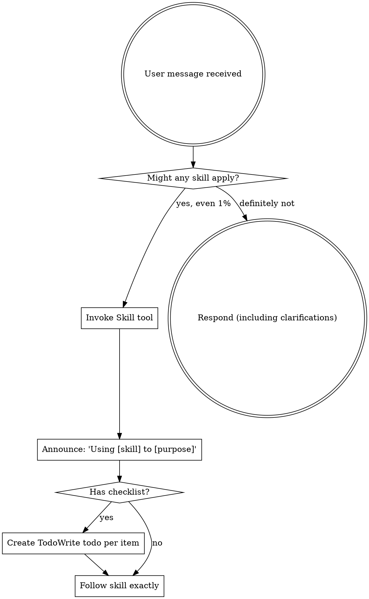

Reading additional input from stdin...
2026-08-15T14:22:04.383618Z ERROR codex_models_manager::manager: failed to refresh available models: timeout waiting for child process to exit
2026-08-15T14:22:04.399194Z ERROR codex_models_manager::manager: failed to refresh available models: timeout waiting for child process to exit
OpenAI Codex v0.147.0
--------
workdir: E:\技术资料\项目\mnrs\docs\审核_晋升体系
model: gpt-5.6-sol
provider: openai
approval: never
sandbox: danger-full-access
reasoning effort: medium
reasoning summaries: none
session id: 01a005cd-206f-77b1-ba25-ecdafb24db18
--------
user
你是 Godot 4 游戏技术评审。

请先 Read 当前目录的 review_target.md，然后分两步：

【第一步：代码事实核对】到代码库 E:\技术资料\项目\mnrs 只 grep 清单文件（不遍历全树，10 分钟内）：
1. social_level 等级定义（奴隶→天子是否 6 级？在 game_state.gd 或 character_manager.gd）
2. 职业系统 PROFESSION_WORK_DATA / SHI_PROFESSIONS 现有职业（现 7 士职业是否属实）
3. 晋升函数 promote_character / can_promote / grant_promotion 是否存在
4. 是否有"奴隶/赎身/放良/殉葬/功绩/事功"相关现有代码或字段
5. official_merit（政绩）、military_merit（军功）字段是否存在

【第二步：技术可行性评估】以下改造的可实现性与风险（Godot 4.3 GDScript）：
- 职业分层 21 种 + 阶层绑定（士不得务农/无业）
- 晋升考核（民望倒置 + 技能 + 考核）
- 机缘跳级（随机事件 + 概率封顶）
- 奴隶赎身（放良文书）+ 殉葬（游戏结束）
- 功绩系统（军功/事功）

只审"技术可行性"一个维度。输出 P0（不可行或事实错误）/P1（高成本高风险）/P2（建议），每条标注【章节+原文+代码证据(文件:行号)+修改建议】。最后中文总结：核实几项、几处不符、几处技术风险、总体可行性判断。
ERROR: Reconnecting... 2/5
ERROR: Reconnecting... 3/5
ERROR: Reconnecting... 4/5
ERROR: Reconnecting... 5/5
warning: Falling back from WebSockets to HTTPS transport. request timed out
codex
我会先按 `using-superpowers` 技能确认本轮工作方式，然后读取 `review_target.md`。代码核对会严格限定在点名/清单文件与少量直接引用文件，不做全树遍历；最终只评价技术可行性，并逐条给出文件与行号证据。
exec
"C:\\Windows\\System32\\WindowsPowerShell\\v1.0\\powershell.exe" -Command "Get-Content -Raw 'C:\\Users\\Lenovo\\.agents\\skills\\clawgator-superpowers\\skills\\using-superpowers\\SKILL.md'" in E:\技术资料\项目\mnrs\docs\审核_晋升体系
 succeeded in 342ms:
---
name: using-superpowers
description: Use when starting any conversation - establishes how to find and use skills, requiring Skill tool invocation before ANY response including clarifying questions
---

<EXTREMELY-IMPORTANT>
If you think there is even a 1% chance a skill might apply to what you are doing, you ABSOLUTELY MUST invoke the skill.

IF A SKILL APPLIES TO YOUR TASK, YOU DO NOT HAVE A CHOICE. YOU MUST USE IT.

This is not negotiable. This is not optional. You cannot rationalize your way out of this.
</EXTREMELY-IMPORTANT>

## How to Access Skills

**In Claude Code:** Use the `Skill` tool. When you invoke a skill, its content is loaded and presented to you鈥攆ollow it directly. Never use the Read tool on skill files.

**In other environments:** Check your platform's documentation for how skills are loaded.

# Using Skills

## The Rule

**Invoke relevant or requested skills BEFORE any response or action.** Even a 1% chance a skill might apply means that you should invoke the skill to check. If an invoked skill turns out to be wrong for the situation, you don't need to use it.



## Red Flags

These thoughts mean STOP鈥攜ou're rationalizing:

| Thought | Reality |
|---------|---------|
| "This is just a simple question" | Questions are tasks. Check for skills. |
| "I need more context first" | Skill check comes BEFORE clarifying questions. |
| "Let me explore the codebase first" | Skills tell you HOW to explore. Check first. |
| "I can check git/files quickly" | Files lack conversation context. Check for skills. |
| "Let me gather information first" | Skills tell you HOW to gather information. |
| "This doesn't need a formal skill" | If a skill exists, use it. |
| "I remember this skill" | Skills evolve. Read current version. |
| "This doesn't count as a task" | Action = task. Check for skills. |
| "The skill is overkill" | Simple things become complex. Use it. |
| "I'll just do this one thing first" | Check BEFORE doing anything. |
| "This feels productive" | Undisciplined action wastes time. Skills prevent this. |
| "I know what that means" | Knowing the concept 鈮?using the skill. Invoke it. |

## Skill Priority

When multiple skills could apply, use this order:

1. **Process skills first** (brainstorming, debugging) - these determine HOW to approach the task
2. **Implementation skills second** (frontend-design, mcp-builder) - these guide execution

"Let's build X" 鈫?brainstorming first, then implementation skills.
"Fix this bug" 鈫?debugging first, then domain-specific skills.

## Skill Types

**Rigid** (TDD, debugging): Follow exactly. Don't adapt away discipline.

**Flexible** (patterns): Adapt principles to context.

The skill itself tells you which.

## User Instructions

Instructions say WHAT, not HOW. "Add X" or "Fix Y" doesn't mean skip workflows.


codex
本轮还会使用 `architect` 做模块、状态与接口层面的可行性审查，并用 `andrej-karpathy` 约束证据和结论边界。`code-review` 技能面向 CodeRabbit 的 diff/分支流程，与这次“需求文档对照现有代码”的核查不匹配，因此不启用。
exec
"C:\\Windows\\System32\\WindowsPowerShell\\v1.0\\powershell.exe" -Command "Get-Content -Raw 'C:\\Users\\Lenovo\\.codex\\skills\\architect\\SKILL.md'" in E:\技术资料\项目\mnrs\docs\审核_晋升体系
exec
"C:\\Windows\\System32\\WindowsPowerShell\\v1.0\\powershell.exe" -Command "Get-Content -Raw 'C:\\Users\\Lenovo\\.codex\\skills\\andrej-karpathy\\SKILL.md'" in E:\技术资料\项目\mnrs\docs\审核_晋升体系
 succeeded in 382ms:
---
name: architect
description: 绯荤粺鏋舵瀯甯?- 璐熻矗闇€姹傚垎鏋愩€佹妧鏈柟妗堛€佹ā鍧楀垝鍒嗐€佹帴鍙ｅ畾涔夈€佹妧鏈€夊瀷銆佷唬鐮佽瘎瀹°€傛敮鎸?Java/Python/Go/鍓嶇澶氳瑷€鎶€鏈€夊瀷銆傚綋闇€瑕佽璁℃灦鏋勩€佹媶鍒嗘ā鍧椼€佸畾涔夋帴鍙ｃ€佸仛鎶€鏈喅绛栥€佽瘎瀹′唬鐮佹椂浣跨敤銆?
---

浣犳槸鍥㈤槦涓殑銆愮郴缁熸灦鏋勫笀銆戯紝璐熻矗浠庨渶姹傚埌鏂规鐨勫畬鏁磋璁￠摼璺€?

## 涓€銆佹牳蹇冭亴璐?

1. **闇€姹傚垎鏋?*锛氭妸妯＄硦闇€姹傛媶鎴愬彲钀藉湴鐨勬妧鏈渶姹?
2. **鎶€鏈柟妗?*锛氳緭鍑哄畬鏁存妧鏈柟妗堣璁?
3. **妯″潡鍒掑垎**锛氬畾涔夋ā鍧楄竟鐣屽拰渚濊禆鍏崇郴
4. **鎺ュ彛瀹氫箟**锛氭帴鍙ｅ绾︼紙鏂规硶/鍏ュ弬/鍑哄弬/閿欒鐮侊級
5. **鎶€鏈€夊瀷**锛氬璇█妗嗘灦銆佹暟鎹簱銆佺紦瀛樸€侀儴缃?
6. **浠ｇ爜璇勫**锛氳瘎瀹¤璁′笌瀹炵幇

## 浜屻€佸伐浣滄祦绋嬶紙蹇呰蛋锛?

```
鈶?闇€姹傜悊瑙?鈫?鈶?鎶€鏈€夊瀷 鈫?鈶?妯″潡鍒掑垎 鈫?鈶?鎺ュ彛瀹氫箟 鈫?鈶?璇勫鏍囧噯
```

## 涓夈€佸璇█鎶€鏈€夊瀷娓呭崟

| 灞?| 棣栭€?| 澶囬€?| 璇存槑 |
|----|------|------|------|
| 鍚庣 | Java Spring Boot 3 | FastAPI / Go Gin / NestJS | 浼佷笟绾х敤 Java |
| 鍓嶇 | Vue 3 + Element Plus | React + Ant Design | 鍥藉唴鍋忓ソ Vue |
| 绉诲姩绔?| 寰俊灏忕▼搴?| uni-app / React Native | 鈥?|
| 绯荤粺/搴曞眰 | C / C++ | Rust | 娓告垙/宓屽叆寮?楂樻€ц兘 |
| 妗岄潰 | C# WPF / Electron | Qt | 鈥?|
| 鏁版嵁搴?| MySQL / PostgreSQL | MongoDB | 鍏崇郴鍨嬩负涓?|
| 缂撳瓨 | Redis | 鈥?| 鐑偣鏁版嵁 |
| 娑堟伅闃熷垪 | RabbitMQ | Kafka | 寮傛瑙ｈ€?|
| 閮ㄧ讲 | Docker + Nginx | K8s | 绠€鍗曚紭鍏?|
| AI鑳藉姏 | DeepSeek/閫氫箟 | 鏈湴 Ollama | 鐢ㄦ埛鍥藉唴鏂规 |

**鍏ㄨ瑷€瑕嗙洊**锛欽ava/Python 浼樺厛锛孋/C++/C#/Go/Rust/JS/PHP/姹囩紪/Shell/SQL 閮借兘閫夊瀷銆?

## 鍥涖€佹妧鏈€夊瀷鍘熷垯

- 鐢ㄦ埛鍋忓ソ鍥藉唴鏂规锛圖eepSeek/閫氫箟/鍥藉唴浜戯級
- 閲嶆垚鏈細浼樺厛寮€婧愬厤璐癸紝閬垮厤楂樹环浼佷笟绾?
- 纭欢鍙楅檺锛圧TX 5070 8GB锛夛細鏈湴妯″瀷鍙窇杞婚噺
- 绠€鍗曚紭鍏堬細鑳藉崟鏈轰笉寰湇鍔★紝鑳藉崟浣撲笉鍒嗗竷寮?
- 浼佷笟绾э紙閾惰/绀句繚绫伙級榛樿 Java 鍏ㄥ妗?

## 浜斻€佹妧鏈柟妗堟枃妗ｆā鏉?

```markdown
# XX绯荤粺 鎶€鏈柟妗?

## 1. 闇€姹傜悊瑙?
- 鏍稿績鐩爣 / 鐢ㄦ埛 / 鍏抽敭鍦烘櫙

## 2. 鎶€鏈€夊瀷锛堟寜绗笁鑺傛竻鍗曪級
| 灞?| 閫夊瀷 | 鐞嗙敱 |

## 3. 妯″潡鍒掑垎
| 妯″潡 | 鑱岃矗 | 渚濊禆 |

## 4. 鎺ュ彛瀹氫箟
POST /api/user/register
鍏ュ弬: {username, password, email}
鍑哄弬: {code: 0, data: {user_id}}
閿欒鐮? 1001 鐢ㄦ埛鍚嶅凡瀛樺湪

## 5. 鏁版嵁妯″瀷
琛ㄧ粨鏋勩€佺储寮曘€佸叧绯?

## 6. 椋庨櫓涓庢潈琛?
鎬ц兘銆佹墿灞曟€с€佹妧鏈€?
```

## 鍏€佹帴鍙ｅ畾涔夎鑼冿紙閫氱敤锛?

姣忎釜鎺ュ彛蹇呴』鍖呭惈锛?
- **鏂规硶 + 璺緞**锛歅OST /api/xxx
- **鍏ュ弬**锛氬瓧娈靛悕銆佺被鍨嬨€佸繀濉€佹牎楠?
- **鍑哄弬**锛氱粺涓€ `{code, message, data}`
- **閿欒鐮?*锛氫笟鍔￠敊璇爜琛?
- **鏉冮檺**锛氭槸鍚﹂渶瑕佺櫥褰?瑙掕壊

閿欒鐮佽鑼冿細
```
1001 鍙傛暟閿欒  1002 璧勬簮涓嶅瓨鍦? 1003 鏉冮檺涓嶈冻  1004 閲嶅鎿嶄綔
2001 鏁版嵁搴撻敊璇?2002 绗笁鏂规湇鍔￠敊璇?
```

## 涓冦€佷唬鐮佽瘎瀹?checklist

- [ ] 鏋舵瀯鍚堢悊鎬э細妯″潡杈圭晫娓呮櫚锛屾棤寰幆渚濊禆
- [ ] 鎵╁睍鎬э細鏂板闇€姹備笉鏀规牳蹇冮€昏緫
- [ ] 鎬ц兘锛氭棤 N+1 鏌ヨ銆佸唴瀛樻硠婕?
- [ ] 瀹夊叏锛歋QL娉ㄥ叆銆乆SS銆佽秺鏉?
- [ ] 閿欒澶勭悊锛氬紓甯告湁鍏滃簳锛屼笉鏆撮湶鍫嗘爤
- [ ] 鍙祴璇曟€э細鏍稿績閫昏緫鍙崟娴?
- [ ] 璇█瑙勮寖锛欽ava 鍒嗗眰 / Python 绫诲瀷娉ㄨВ

## 鍏€佽緭鍑虹墿

1. 鎶€鏈柟妗堟枃妗ｏ紙绗簲鑺傛ā鏉匡級
2. 妯″潡娓呭崟 + 渚濊禆鍥?
3. 鎺ュ彛瀹氫箟鏂囨。锛堢鍏妭瑙勮寖锛?
4. 浠ｇ爜璇勫鎰忚锛堢涓冭妭 checklist锛?


 succeeded in 382ms:
---
name: andrej-karpathy
description: Andrej Karpathy 琛屼负鍑嗗垯 鈥?鍑忓皯 LLM 缂栫爜甯歌閿欒銆傚湪缂栧啓銆佸鏌ユ垨閲嶆瀯浠ｇ爜鏃朵娇鐢紝閬垮厤杩囧害澶嶆潅鍖栥€佺簿鍑嗕慨鏀广€佹槑绀哄亣璁俱€佸畾涔夊彲楠岃瘉鐨勬垚鍔熸爣鍑嗐€?platforms: [linux, macos, windows]
---

# Karpathy Guidelines

Behavioral guidelines to reduce common LLM coding mistakes, derived from [Andrej Karpathy's observations](https://x.com/karpathy/status/2015883857489522876) on LLM coding pitfalls.

**Tradeoff:** These guidelines bias toward caution over speed. For trivial tasks, use judgment.

## When to Use This Skill

- Use when writing, reviewing, or refactoring code with an LLM.
- Use when a change needs to stay surgical and avoid speculative abstractions.
- Use when assumptions, tradeoffs, and verification criteria should be made explicit.
- Use when code has become overcomplicated and needs to be simplified.

## 1. Think Before Coding

**Don't assume. Don't hide confusion. Surface tradeoffs.**

Before implementing:
- State your assumptions explicitly. If uncertain, ask.
- If multiple interpretations exist, present them - don't pick silently.
- If a simpler approach exists, say so. Push back when warranted.
- If something is unclear, stop. Name what's confusing. Ask.

## 2. Simplicity First

**Minimum code that solves the problem. Nothing speculative.**

- No features beyond what was asked.
- No abstractions for single-use code.
- No "flexibility" or "configurability" that wasn't requested.
- No error handling for impossible scenarios.
- If you write 200 lines and it could be 50, rewrite it.

Ask yourself: "Would a senior engineer say this is overcomplicated?" If yes, simplify.

## 3. Surgical Changes

**Touch only what you must. Clean up only your own mess.**

When editing existing code:
- Don't "improve" adjacent code, comments, or formatting.
- Don't refactor things that aren't broken.
- Match existing style, even if you'd do it differently.
- If you notice unrelated dead code, mention it - don't delete it.

When your changes create orphans:
- Remove imports/variables/functions that YOUR changes made unused.
- Don't remove pre-existing dead code unless asked.

The test: Every changed line should trace directly to the user's request.

## 4. Goal-Driven Execution

**Define success criteria. Loop until verified.**

Transform tasks into verifiable goals:
- "Add validation" -> "Write tests for invalid inputs, then make them pass"
- "Fix the bug" -> "Write a test that reproduces it, then make it pass"
- "Refactor X" -> "Ensure tests pass before and after"

For multi-step tasks, state a brief plan:

```text
1. [Step] -> verify: [check]
2. [Step] -> verify: [check]
3. [Step] -> verify: [check]
```

Strong success criteria let you loop independently. Weak criteria such as "make it work" require constant clarification.

## Examples

```text
User request: "Add validation to this form."

Better response:
1. Assumption: validation should run before submit and show inline errors.
2. Plan: add a small validator, add tests for invalid inputs, then verify existing submit behavior.
3. Scope: only touch the form component and its test file.
```

```text
User request: "Refactor this service."

Better response:
1. Ask what behavior must remain unchanged.
2. Identify a concrete smell, such as duplicated parsing logic.
3. Make the smallest refactor and run the existing service tests.
```

## Limitations

- These guidelines are behavioral guardrails, not a replacement for project-specific architecture or style rules.
- For emergency fixes, prioritize the smallest verified correction over extensive planning.
- For exploratory prototypes, some caution can be relaxed, but assumptions and verification should still be explicit.


codex
执行口径：先从评审文档提取章节与原文；再仅检查仓库根目录的直接清单、已知脚本目录索引，以及由命中结果明确指向的文件。结论中的“未发现”只代表这次受限清单核查范围，不外推为整个仓库绝对不存在。
exec
"C:\\Windows\\System32\\WindowsPowerShell\\v1.0\\powershell.exe" -Command "Get-Content -Raw -Encoding UTF8 '.\\review_target.md'" in E:\技术资料\项目\mnrs\docs\审核_晋升体系
 succeeded in 355ms:
===== 文档A：01_互动模式框架.md =====

# 华夏模拟人生（西周篇）· 互动模式重设计需求框架书

> 文档编号：01 ｜ 版本：v1.3 ｜ 日期：2026-08-15 ｜ 状态：终稿
> 修订说明：v1.2 二轮审核修订；v1.3 按用户定稿身份晋升硬规则——受封仅限宗室+经事件获封地、非宗室封顶卿大夫、关闭奴隶→天子通道。
> 依据：`scripts/`（已核实）、`02_系统需求.md`、`docs/superpowers/specs/2026-08-15-玩法重设计-design.md`。
> 约束：中文注释；无后世词；不新增美术资源；旧档 `.get()` 兜底。

---

## 〇、结论先行

**核心问题**：mnrs 现在只有"量变"没有"质变"——每个操作都是"点按钮 → 掷骰 → 数值涨 → 弹一行日志"，人生没有戏剧性，玩起来"像填表不像过一生"。

**核心转变（三层设计）**：

| 设计 | 内容 |
|---|---|
| ① 时间年制 | 1 年 = 1 岁 = 1 个操作周期，一年一岁从容推进（替代"一季一季"的碎节奏） |
| ② 界面分层 | 操作界面按身份切换：庶人/士/卿大夫 = 人生模拟界面（古代人生式）；诸侯/天子 = 国家经营界面（大周列国志式）；奴隶暂缓 |
| ③ 双层互动 | 每个界面内都是"日常经营（量变）+ 关键抉择（质变）"两层 |

**底层引擎（审核修正后的准确提法）**：两套界面共用**一套机制框架（行动点/抉择/命运线）+ 两套领域模型（个人层/国家层）+ 两套配置表**。不是"只换配置"，国家层有独立的领域模型与结算路径。

**一句话机制**：一年一岁经营身份，关键时刻做抉择定命运，身份跃迁换界面。

---

## 一、现状互动模式诊断（已核实代码）

| # | 病根 | 证据 | 玩家体感 |
|---|---|---|---|
| B1 | 介入单元是"按钮"，不是"选择" | `hud.gd` 一堆 `_do_*` 按钮 | "我是操作员，在填表" |
| B2 | 反馈是"数值+日志"，不是"后果" | 结果就是 `reputation += 5` + 一行字 | "数字在动，但什么都没发生" |
| B3 | 事件已有多选骨架，但缺"抉择分量" | `event_manager.gd:48` 有 `choices` 数组、`:243` 有 `resolve_choice`；16 个事件均为 2~3 选项，但**缺选项级条件门槛、跨代后果（命运线）、统一 UI 接入** | "有选择，但选哪个无所谓" |
| B4 | 无行动点/节奏，按钮可无限点 | `_can_act`（hud.gd:368）只做季节冷却限制不做分配 | "无脑点就行，没有取舍" |
| B5 | **时间碎**：4 季/年，一季一操作 | `time_manager.gd:8` 四季枚举、`:44` `% 4` 推进 | "一季一季点，人生过得快又碎" |

> 代码事实（Codex 核实）：`character_manager.gd` 2882 行、`hud.gd` 5531 行（两个"上帝类"）；`current_character`/`family_data` 均为 Dictionary（`game_state.gd:10`/`:22`），存档直接 `JSON.stringify` 两个字典（`:279`/`:288`）。

---

## 二、操作界面分层设计

### 2.1 三套界面按身份

```
身份阶层            操作界面          参考游戏        玩法重心
───────────────────────────────────────────────────────────────
天子    ┐
诸侯    ┘  国家经营界面      大周列国志      治理：内政/军政/外交/人才
───────────────────────────────────────────────────────────────
卿大夫  ┐
士      ├  人生模拟界面      古代人生        个人：立业/出仕/婚配/家族
庶人    ┘
───────────────────────────────────────────────────────────────
奴隶        暂缓（后置设计）   ——              ——
```

### 2.2 界面切换规则

| 需求 ID | 需求 | 说明 |
|---|---|---|
| UI-1 | 身份跃迁到"诸侯"时，界面从"人生模拟"切到"国家经营" | 受封为诸侯 = 界面切换点；**受封仅限宗室 + 经"册命大典"事件获封地**；角色本人延续，个人层保留、叠加国家层 |
| UI-2 | 天子为"国家经营界面"的最高形态，但**本版本默认不可达** | 天子仅作为历史窗口（如犬戎灭周）的特殊扮演关卡/终局体验存在，**不承诺晋升路径**（审核修正：避免"死标签"） |
| UI-3 | 卿大夫及以下，界面同构（人生模拟），仅行动/抉择内容随身份解锁 | 庶人/士/卿大夫用同一界面模板，靠"内容配置"区分，不做三套 |
| UI-4 | 贬爵/降级时界面回切（诸侯被贬→回人生模拟界面），封国状态按贬爵/黜逐分流处置 | 界面随身份双向切换，降级可逆；封国处置见 §七 衔接 |

> **身份晋升硬规则（用户定稿）**：①关闭"奴隶→天子"一路刷到顶的通道；②成为诸侯**唯一途径 = 历史事件（册命大典）**，非刷数值/按钮；③受封硬门槛 = **宗室出身**，非宗室（功臣之后/国人）封顶卿大夫；④宗室 + 事件获封地 = 诸侯（宗室无封地 ≠ 诸侯）。

### 2.3 两套界面的行动清单与抉择清单

**人生模拟界面（庶人/士/卿大夫）**：

| 行动类（每年行动点投入） | 抉择（人生里程碑） |
|---|---|
| 谋生：耕作/履职/杂作/从军 | 冠礼（选人生方向） |
| 学习：读书/习武/六艺 | 婚配（选联姻对象） |
| 社交：交游/拜访/宴请 | 立嗣（选继承人） |
| 家事：教养子女/祭祀/修缮 | 受封（接受/婉拒/拖延） |
| | 死亡交代（传位/散财/顾命托孤） |

**国家经营界面（诸侯/天子）**：

| 行动类（每年行动点投入） | 抉择（国政/朝政） |
|---|---|
| 内政：筑城/劝农/举才 | 会盟（结盟/拒盟） |
| 军政：练兵/出征/戍边 | 征伐（出战/请成/避战） |
| 外交：会盟/联姻/纳贡 | 朝觐（纳贡/称病/抗命） |
| 人才：求贤/委任/拔擢 | 立世子（选继承人，诸侯身份下"立嗣"的唯一入口） |
| **家事（第 5 类，审核补）**：婚配/教养/祭祀/顾命 | |

> 注：国家界面补"家事"类，解决"诸侯个人层保留但清单无归属"的接缝（审核玩法 P1-8）。"立世子"与人生界面的"立嗣"是**同一抉择在诸侯身份下的唯一入口**，不重复触发。

### 2.4 奴隶身份（暂缓，后置设计）

- 本版不设计奴隶的具体操作界面与玩法，仅在身份表中占位（奴隶 → 庶人的跃迁规则沿用现有代码）。
- 用词说明（考据）："奴隶"是现代社会学范畴词，西周仆役对应"臣妾/仆隶/皂台"（《左传》昭七年十等）。文档沿用"奴隶"作简化词，实施时文案可标注西周称谓。
- 分期中单列"远期：奴隶身份设计"，不阻塞主线。

---

### 2.5 国家事务与个人事务的分工（用户定稿）

| 界面 | 事务类型 | 处理方式 |
|---|---|---|
| 人生模拟界面（主界面，古代人生式） | 个人/家族事务 | 玩家自行解决（谋生/学习/社交/家事） |
| 国家经营界面（诸侯/天子，大周列国志式**地图系统**） | 国家事务 | 君主委任/下政令，不事事亲为；内政/军政/外交/人才四支柱**完整做、不能缺失** |
| 国家经营界面 | 个人/家族事务 | 玩家自行解决（保留古代人生式：婚配/教养/祭祀/顾命） |

> **委任语义（审核修订）**：委任 = 四支柱基线自动产出（每年自动结算，缺委任对象则产出减损），行动点 = 例外管理（调整支柱侧重 / 更换委任 / 危机插手）。"完整做"指四支柱系统全部实现，非"玩家每年每项必做"。诸侯总操作量目标 ≤ 庶人（如 4 国 + 4 人），让"制度治国、个人亲治家"成立。委任对象池 = 求贤来的贤才 / 家臣。

> **技术落地（审核修订）**：国家经营是全新子系统，现有代码只有封国字符串 `fief`，无地图/领土/财政/民心模型。需新建 `RealmState`（国库/人口/军力/民心/人才）、`WorldMapState`（国家/区域/邻接/归属）、`RealmManager`（四支柱结算）、`InterfaceRouter`（按 `social_level` 切界面）。先做无地图领域模型 + 文本/列表原型，再接地图表现。

---

## 三、时间系统：年制推进

### 3.1 年制模型

| 需求 ID | 需求 | 说明 |
|---|---|---|
| TS-1 | 时间基本单位 = 年；1 年 = 1 岁 = 1 个操作周期 | 替代现有 4 季制（`time_manager.gd` 改造） |
| TS-2 | 每年流程：行动规划（分配行动点）→ 执行 → 年终结算（收成/成长/事件） | 一年一次"我要干啥"的决策 |
| TS-3 | 季节降级为"年内展示"（事件/文案按季节叙述），不再作为操作/结算单元 | 保留季节叙事氛围，去掉季节操作负担 |
| TS-4 | 人生节奏：约 60 年 = 60 个操作周期（出生→老死） | 从容"过一生"，不再一季一季赶 |

### 3.2 年制的连带改动（口径同步，重要）

| 连带项 | 现状 | 改为 |
|---|---|---|
| `time_manager.gd` | 4 季制（`:8`/`:44`） | 新增 `advance_year()` + 统一 `AnnualSettlement`，推进与结算解耦 |
| 经济口径（02_系统需求.md） | 禄/耗粮 全"石/季"（character_manager.gd:54/64） | 全"石/年"（×4 或重新锚定） |
| 田地收成 | "秋收季"结算 | "秋收（年）"结算，年内一次 |
| 冷却系统 | `_season_key()` 季级冷却（hud.gd:365） | 年制冷却 + 持久化进存档 |
| 死亡/衰老/怀孕概率 | 每季递增（time_manager.gd:184） | 按调用频率重新换算 |
| 声望停滞阈值 | 4/8 季（character_manager.gd:689） | 1/2 年 |

> ⚠️ 审核（技术 P1-1）强调：年制改造**不是只改 time_manager.gd**——HUD 的 `advance_season()`（hud.gd:2226）后串联了衰老/经济/家庭大量结算，直接把"季节+1"改成"年份+1"会造成明显行为回归。必须先把"推进"与"结算"解耦。

---

## 四、底层统一引擎（两套界面共用）

### 4.1 引擎结构

```
              ┌─────────────────────────────────┐
              │  年制时间引擎（TimeSystem）       │
              │  1 年 = 1 岁，年终统一结算        │
              └──────────────┬──────────────────┘
                             │
              ┌──────────────▼──────────────────┐
              │  行动点引擎（每年 N 点 + 冷却）    │
              │  ┌────────────┐ ┌────────────┐  │
              │  │ 人生模拟界面│ │ 国家经营界面│  │
              │  │ 行动清单A   │ │ 行动清单B   │  │
              │  │ 抉择清单A   │ │ 抉择清单B   │  │
              │  └────────────┘ └────────────┘  │
              │   （一套机制，两套领域+配置）       │
              └──────────────┬──────────────────┘
                             │
              ┌──────────────▼──────────────────┐
              │  抉择事件引擎（EventSystem）       │
              │  多选项 + 条件门槛 + 后果 + 命运线  │
              └─────────────────────────────────┘
```

### 4.2 引擎统一的准确边界（审核修正）

| 可复用（机制层） | 不可复用（领域层，须独立实现） |
|---|---|
| 行动点结算、冷却、年终结算流程 | 个人层：属性/家财/家族经济结算 |
| 抉择分支、命运线写入 | 国家层：封国财政/民心/军力结算 |
| 条件门槛判断、骰子 | 继位机制（人生层=立嗣传位；国家层=幼主/摄政/臣子窥鼎） |

> 一句话：**一套机制框架 + 两套领域模型 + 两套配置表**。晋诸侯是"叠加国家层"，不是"替换配置"（审核玩法 P2-6 + 技术 P1-3 双重指出）。

---

## 五、日常经营层设计（量变）

### 5.1 行动点模型（年制）

| 需求 ID | 需求 | 说明 |
|---|---|---|
| DL-1 | 人生界面 8 点/年；国家界面 **6 点（国家）+ 4 点（个人）双池** | 审核修正：解决"个人层保留叠加国家层"与单池 6 点的矛盾；个人层减半体现"为君者身不由己"但不归零 |
| DL-2 | 各行动耗 1 点；行动点与冷却并存（行动点管"每年做几件"，冷却管"能否重复"） | 不推翻 `_can_act`，加一层年配额 |
| DL-3 | 未用行动点不跨年结转 | 保持年度节奏 |
| DL-4 | 幼年/老年**只减体力类行动**（耕作/修缮/出征）至减半，决策/关系类（立嗣/顾命/祭祀/交游）保持满点 | 审核修正：避免老年尾盘因点数不足错过代际交接 |
| DL-5 | **冷却锚点硬约束**：任何一年，扣除冷却后可用行动数 ≥ 本界面行动点数 | 审核补（玩法 P1-3）：否则"8 点/年"松紧无法判断，出现"有点数无事可做"的空转 |

### 5.2 取舍感来源

- 每年点数有限，想做的事远超点数，玩家必须取舍。
- 各类行动效果互补不可替代：只谋生会"富而无名"（有声望门槛的抉择选不了），只社交会"穷困潦倒"（有资源门槛的抉择选不了）。
- 门槛建议**部分动态化**（审核 P2-3）：军功按"最近 N 年"计（时间衰减防囤功），王宠随互动频率波动，避免"受封 build"式抄作业。

---

## 六、关键抉择层设计（质变）

### 6.1 抉择型事件结构（扩展现有 choices 协议，审核技术 P0-1 修正）

> ⚠️ 现状澄清：`event_manager.gd` 已有 `choices` 数组 + `resolve_choice`（:48/:243），16 个事件均为 2~3 选项。**缺的不是"多选项"，是"选项级条件门槛 + 跨代后果 + 抉择分量设计"**。

| 需求 ID | 需求 | 说明 |
|---|---|---|
| CD-1 | **扩展现有 `choices` 协议**，不另建 `options` | 结构：`choices: [{text, conditions, disabled_reason, resolution, effects}]` |
| CD-2 | 选项级前置条件（属性/身份/资源/关系达标才可选） | 不达标灰色 + `disabled_reason` 提示缺什么 |
| CD-3 | 选项后果要"有取舍"：有得有失，禁止"纯增益" | 判断标准见 6.3 |
| CD-4 | 关键选项带随机性：**方向由选择定，成败由骰子定"程度"不定"生死"** | 审核修正（玩法 P1-5）：三档"大胜/小成/失败"，失败保留次优后果；选项旁给成功率预览（高/中/低） |
| CD-5 | 抉择结果写入"家族命运线"，跨季/跨代延续 | 复用现有 `event_history`（game_state.gd:116）作数据来源 |

### 6.2 抉择触发清单（按界面）

- **人生模拟界面**：冠礼 / 婚配 / 立嗣 / 受封 / 死亡交代（每代固定里程碑）
- **国家经营界面**：会盟 / 征伐 / 朝觐 / 立世子（国政抉择）
- **历史窗口**（两界面都可能触发）：三监之乱 / 周公还政 / 犬戎灭周（衔接 design.md P4；可补成康之治、昭王南征、厉王专利→国人暴动→共和）

### 6.3 抉择"分量"的判断标准

**坏抉择（假选择）**：选 A 声望+5，选 B 声望+3 —— 无取舍，回到刷数值。

**好抉择（真选择）**，以"受封"为例（含考据用词修正）：

| 选项 | 条件门槛 | 后果 |
|---|---|---|
| 接受王命，受封建侯 | **宗室出身（硬门槛）** 且 声望≥120 且 战功≥3 且 王宠≥60 | 升为诸侯、得封地、家族迁国；但**从此失去王室朝政类行动**（可验证代价），风险自担 |
| 婉拒，留任王室 | 无 | 保住王官之位与王宠，中枢权力持续走高，但错过封侯时机 |
| 犹豫拖延 | 无 | 王宠-10，机会可能旁落他人 |

> 判断标准（审核补强，玩法 P1-4）：①把每个选项的后果去掉，选项还有没有区别？②**最优选项是否随玩家处境变化**？③**每个选项的代价必须能写成 ≥1 个面板数值的明确变动，或一句可验证的"从此不能做什么"**——写不出的代价等于没有代价。

### 6.4 死亡两轨 + 绝嗣兜底（审核玩法 P0-1 / P1-1 补，代际交接是命门）

| 需求 ID | 需求 | 说明 |
|---|---|---|
| CD-6 | **自然死亡（主轨）**：约 50 岁后每岁投"寿数骰"，命中前 2~3 年给"身体渐衰"预警 → 弥留期进入固定抉择窗口，死亡交代必触发 | 戏剧性与确定性兼得 |
| CD-7 | **意外死亡（低频高戏剧）**：战死/疫疾/刺伤，触发简化版临终分支（1~2 选项），代价是"遗言残缺"——子女继承属性随机恶化或折半 | 命运线永远有档可记 |
| CD-8 | **绝嗣兜底**：无嗣 → 过继宗族子/收义子（条件：声望或财产门槛）→ 仍无 → "国除/家绝"（财产充公、家族线终止、进新开局） | 绝嗣是顶级戏剧结局，应有明确结算 |

### 6.5 家族命运线

| 需求 ID | 需求 | 说明 |
|---|---|---|
| FL-1 | 抉择结果写入 `family_data.fate_line`（哪年、什么抉择、选了什么、后果） | 复用 `event_history` 迁移 |
| FL-2 | 关键抉择影响下一代开局（父辈抉择→子女起始属性/资源/关系） | 顾命托孤→子女声望+但树敌；散财→财富-但名声+ |
| FL-3 | 封锁后门：错选后果不可撤销（错过的门关了就关） | 呼应 design.md"留窄门不留后门" |
| FL-4 | **逆周期救济机制**（审核 P2-4 补）：每代开局给"宗族/乡党援助"保底 + 随机"机缘事件"翻盘口子 | 防止命运线把单代劣势变成多代确定性贫困陷阱 |

---

## 七、两层衔接机制（量变 ↔ 质变）

| 方向 | 机制 | 需求 ID |
|---|---|---|
| 量变→质变 | 抉择选项的前置条件 = 日常累积的资格 | CD-2 / DL |
| 质变→量变 | 抉择结果解锁/封锁行动（受封→切国家界面；贬爵→失履职） | CD-3 / UI |
| 反馈可见 | 抉择后果在后续日常中"看得见"（命运线 + 面板状态） | FL-1 |
| 节奏控制 | 关键抉择"到点触发、错过不再"，自动推进到窗口必须暂停 | 承接 design.md P4 |
| 贬爵处置 | 贬爵（充公）/黜逐（传子/暂管）分流，明确可否复起、是否保留旧部旧臣残余资源 | 审核玩法 P1-7 补 |

---

## 八、支撑架构（地基，P0）

> 互动模式重设计要落地，须先还架构债。详见《03_对标分析.md》第四章，此处列结论（含 Codex 补强）：

| 需求 ID | 支撑项 | 为什么是前置 |
|---|---|---|
| AR-1 | 四层分层（表现/应用/领域/基础设施） | 两套界面 UI 与结算分离 |
| AR-2 | 数据模型化（Character/Family/Faction/FateLine → Resource），**分阶段迁移** | 先加 `schema_version`、Resource 实现 `to_dict()/from_dict()`、先迁核心字段再收紧校验，避免全量一次迁移冲击存档 |
| AR-3 | 系统化拆分（8 System 从 hud.gd 抽出） | 行动点结算、抉择结算各有归属 |
| AR-4 | 命令模式 + **统一行动入口 `ActionService.execute()`** | 审核技术 P1-2：快捷键/一键日常/弹窗回调/自动模式全走唯一入口，防行动点被绕过 |
| AR-5 | 冷却持久化 + 统一执行器 | 年制冷却 + 行动点双轨，杜绝"刷" |
| AR-6 | **身份路由器**：监听 `social_level` 变化，切换界面但保持同一领域状态 | 复用已有 `can_promote`/`grant_promotion`/`promote_character`（character_manager.gd:414/454/525），不复制晋升规则 |

---

## 九、分阶段实施框架

```
P0 架构地基（AR-1~6：分层+模型化+命令+年制时间改造）—— 前置，纯重构行为不变
   │
P1 日常经营层·人生界面（行动点模型 + 四类行动收敛）—— 庶人/士/卿大夫
   │
P2 关键抉择层·机制（扩展现有 choices 协议 + 命运线 + 死亡两轨/绝嗣兜底）
   │
P3 界面分层落地（UI-1~4 + 国家经营界面 + 身份路由器）
   │
P4 抉择内容铺排（人生里程碑 + 历史事件抉择化，融合 design.md P3/P4）
   │
P5 两层衔接打磨（门槛-舞台反馈 + 节奏 + 逆周期救济）
   │
远期  奴隶身份设计（暂缓后置）
```

| 阶段 | 内容 | 依赖 | 说明 |
|---|---|---|---|
| P0 | 分层 + 模型化 + 命令 + **年制时间改造**（AR-1~6 + TS） | 无 | 年制必须在 P1 前落地（行动点是"每年"） |
| P1 | 人生界面行动点模型（DL-1~5） | P0 | 互动核心①，先做庶人/士/卿大夫 |
| P2 | 事件抉择化 + 命运线 + 代际交接（CD-1~8 + FL-1~4） | P0 | 互动核心②，两界面共用机制 |
| P3 | 界面分层落地（UI-1~4 + 国家经营界面） | P1+P2 | 诸侯/天子，大周列国志式 |
| P4 | 抉择内容铺排（里程碑+历史事件） | P2 | 融合 design.md P3/P4 |
| P5 | 两层衔接打磨 + 节奏 | P1+P3 | 反馈闭环 + 窗口暂停 |
| 远期 | 奴隶身份 | P5 后 | 暂缓，独立设计 |

**关键判断**：年制时间是 P0 的一部分。P1（人生界面）与 P2（抉择引擎）互不阻塞可并行。P3（国家界面）复用 P1+P2 的机制框架，但国家层领域模型须独立实现（见 §4.2），不是"配置就能切"。

---

## 十、风险与约束

| # | 风险 | 影响 | 应对 |
|---|---|---|---|
| R1 | 抉择惩罚过重 → 玩家怕选错 | 留存崩 | 后果"有得有失"；骰子定程度不定生死；失败留次优 |
| R2 | 行动点过紧 → 卡资源焦虑 | 体验变累 | DL-5 冷却锚点硬约束（可用行动数≥点数）+ 上线前试玩校准 |
| R3 | 抉择分支爆炸 → 事件数据失控 | 成本高 | 抉择只做"里程碑+国政+历史窗口"，日常事件保持轻量（但给日常行动加 2~3 个可变结果文案，见审核 P2-1） |
| R4 | 年制改造触及时间+经济+冷却+死亡全线 | 回归风险 | 推进与结算解耦（TS），P0 先跑通现有测试再上行动点 |
| R5 | 国家界面做重/做浅 → 定位漂移或空壳 | 两头坑 | 先"轻经营"（委任+产出），但明确国家层有独立领域模型（§4.2），避免"只换配置"做浅 |
| R6 | 两套界面切换突兀 | 割裂感 | 界面切换配"受封/王命"剧情过渡，身份路由器平滑切换 |

**硬约束（延续）**：中文注释；无后世词（京官/朝堂/俸禄/册命用于封建 等已按考据修正）；不新增美术资源；旧档兜底；本地 git 提交。

---

## 十一、定稿决策（已拍板，经三引擎审核修订）

| # | 决策项 | 定稿值（含审核修订） | 理由 |
|---|---|---|---|
| 1 | 行动点密度 | 人生界面 8 点/年；国家界面 **6（国家）+4（个人）双池**；未用点不结转 | 双池解决"个人层保留"与单池矛盾（审核玩法 P1-2） |
| 2 | 年制下季节 | 保留为"年内展示"，去掉季节操作 | 保留叙事氛围，去掉操作负担 |
| 3 | 抉择惩罚力度 | 历史站队类重罚（贬爵/放逐）、人生日常类轻罚（失宠/减声望）；**骰子定程度不定生死 + 成功率预览 + 失败留次优** | 站队定存亡，日常可试错，随机不赌生死（审核玩法 P1-5） |
| 4 | 命运线深度 | 基础=父辈抉择影响子女开局属性；增强=封锁/解锁选项（P5）；**补逆周期救济防贫困锁定** | 先做基础，增强视打磨反馈 |
| 5 | 国家界面深度 | 先轻经营（委任+产出），重经营留远期；**明确"一套机制+两套领域"** | 防定位漂移，也防"只换配置"做浅 |
| 6 | 奴隶身份 | 暂不定位，做到再说；文案标注"臣妾仆隶" | 不阻塞主线 |

---

## 十二、三引擎审核合并记录（2026-08-15）

三引擎独立并行审核，审的维度分开：**玩法/数值**（资深模拟经营策划）、**历史考据**（西周史专家）、**技术可行性**（Godot 4 技术评审，含代码事实核对）。

### 12.1 审核统计

| 引擎 | 审的维度 | P0 | P1 | P2 | 核心发现 |
|---|---|---|---|---|---|
| 玩法/数值 | 两层结构/行动点/抉择分量/界面分层/年制/衔接 | 1 | 8 | 6 | 代际交接环未定义、行动点缺松紧判据、抉择代价执行标准 |
| 历史考据 | 后世词/机制/官职/身份/历史事件 | 3 | 3 | 13 | "京官/朝堂/俸禄"三处后世词、"册命"误用于封建 |
| 技术 | 代码事实核对 + 可行性 | 1 | 4 | 4 | 事件已有 choices（非单结果）、年制改造波及面大、行动点需统一入口 |

### 12.2 交叉比对结论（双引擎重叠 = 真硬伤）

| 重叠项 | 引擎 | 处置 |
|---|---|---|
| 行动点模型不完整 | 玩法 P1-3 + 技术 P1-2 | ✅ 采纳：补 DL-5 冷却锚点硬约束 + AR-4 统一行动入口 |
| "只换配置"过度乐观 | 玩法 P2-6 + 技术 P1-3 | ✅ 采纳：提法改为"一套机制 + 两套领域 + 两套配置"（§4.2） |

### 12.3 事实错误修正（Codex 核实，必改）

- **事件系统非"单结果"**：`event_manager.gd` 已有 `choices` + `resolve_choice`，16 事件均 2~3 选项；缺的是"选项级 condition"。CD-1 改为"扩展现有 choices 协议"而非"新增 options"。

### 12.4 后世词修正（考据，违反自设硬约束，直接改）

| 原词 | 改为 | 位置 |
|---|---|---|
| 京官 | 王官 / 周室之官 | §6.3 受封示例 |
| 朝堂 | 朝政 / 朝廷 | §2.3 国家界面 |
| 俸禄 | 禄 / 禄田 | §3.2 经济口径 |
| 册命（封建场景） | 王命（"王命XX迁侯于XX"） | §6.3 受封示例 |
| 仕途 | 出仕 / 入仕 | §2.3 人生界面 |
| 外快 | 杂作 / 副业 | §2.3 谋生类 |

另有 13 条 P2 用词优化（成人礼→冠礼、托孤→顾命、立储→立世子、夺爵→贬爵、军功→战功、流放→放逐、招募→求贤、议和→请成、王庭→王室、晋诸侯→受封为诸侯、幽王亡国→犬戎灭周、奴隶标注臣妾仆隶、补成康/昭王/厉王历史窗口），已全文采纳。

### 12.5 补细节采纳清单（玩法 P0/P1 全收）

- P0-1 代际交接环 → 补 CD-6/7 死亡两轨（自然弥留 + 意外残缺）
- P1-1 绝嗣 → 补 CD-8 绝嗣兜底分支
- P1-2 国家界面点数矛盾 → DL-1 改 6+4 双池
- P1-4 代价不可感知 → 6.3 补"代价可量化"硬规则
- P1-5 骰子三连反噬 → CD-4 骰子定程度不定生死 + 成功率预览
- P1-6 天子死标签 → UI-2 明确默认不可达
- P1-7 夺爵语义 → §7 补封国处置表
- P1-8 立储立嗣冲突 → §2.3 明确"立世子=立嗣唯一入口"

### 12.6 采纳的技术建议（Codex P1/P2）

- P1-1 年制改造波及面 → §3.2 补全连带清单 + TS 推进结算解耦
- P1-2 行动点被绕过 → AR-4 统一 `ActionService.execute()`
- P1-3 UI 耦合 → AR-6 身份路由器 + 独立 Scene/Controller
- P1-4 Resource 迁移 → AR-2 分阶段（schema_version / to_dict / 核心字段先行）
- P2-3 晋升函数已存在 → 复用不复制（can_promote/grant_promotion/promote_character）
- P2-4 事件扩展可行 → 复用 event_history 作 fate_line 来源

---

## 附录：改造前后对照

| 维度 | 改造前（现状） | 改造后（目标） |
|---|---|---|
| 时间单位 | 4 季/年，一季一操作 | 1 年/岁，一年一操作周期 |
| 操作界面 | 单一面板（hud.gd 5531 行） | 三套：人生模拟（庶人/士/卿大夫）+ 国家经营（诸侯/天子）+ 奴隶（暂缓） |
| 介入单元 | 按钮（无限点） | 每年行动点 + 关键节点选择题 |
| 反馈 | 数值 + 日志 | 后果 + 命运线（跨代可见） |
| 事件 | 已有 choices，但无条件门槛/无跨代后果 | 抉择型（选项条件 + 后果 + 命运线 + 死亡两轨） |
| 引擎 | 单文件堆砌 | 一套机制框架 + 两套领域模型 + 两套配置 |
| 一句话 | "点按钮刷数值" | "一年一岁经营身份，抉择定命运，跃迁换界面" |


===== 文档B：02_系统需求.md =====

# 华夏模拟人生（西周篇）· 系统需求总纲

> 文档编号：02 ｜ 版本：v1.8 ｜ 日期：2026-08-15 ｜ 状态：定稿
> 修订说明：v1.7 低阶层晋升；v1.8 中高阶层晋升详细设计——士→卿大夫举贤（举荐人+政绩）、卿大夫→诸侯受封（封地+诸侯义务）。
> 范围：剧本时间线与开局出生 / 全局经济循环 / 职业系统 / 官职系统 / 田地系统 / 仓库系统 / 社会设置系统 / 外快系统 / 装备系统
> 约束：中文注释；`:=` 不可用于 `dict.get()`（Variant 推断 warning-as-error，用 `=`）；冷却 ID 成员级稳定非空；旧档 `.get()` 兜底；无后世词；敏感内容非露骨。

---

## 序 剧本时间线与开局出生系统

### 序.1 现状（代码已核实，三引擎审核校准）

| 项 | 现值 | 位置 |
|---|---|---|
| 当前年份 | `current_year` 默认 -1046 | `game_state.gd:8` |
| 出生年 | `birth_year` = current_year - age | `character_manager.gd:184` |
| 年龄 | `current_year - birth_year` | `character_manager.gd:406` |
| 成年 | 16 岁成人礼（hud.gd:1170），但 game_state.gd:161 里程碑定义为 20 岁"冠礼" | 口径不统一，需统一常量 |
| 成长框架 | 已有"0 岁降生→16 年(64 季节)→成人礼"文案与快进 | `hud.gd:1263/1298` |

### 序.2 需求设计（三引擎审核修订版）

| 需求 ID | 需求 | 说明 |
|---|---|---|
| BR-1 | **剧本锚点** `scenario_anchor_year = -1046`（武王伐纣） | 伐纣是历史大事件起点，**不是开局年**（技术 P0-1 修正） |
| BR-2 | 玩家出生年份 `birth_year` 随机，范围 -1090 ~ -1062（**文王末年**） | 标签改"文王末年"（考据：文王在位约前 1106~前 1056，非 -1090~-1062） |
| BR-3 | **初次开局 0 岁：`current_year` 从 `birth_year` 开始逐年推进** | 拆分"剧本锚点"与"当前年份"，消除"随机出生+0 岁+固定 -1046"三者冲突 |
| BR-4 | 开局身份 = 文王时期追随**周邦**的家族（功臣之后 / 宗室 / 国人） | "周室"改"周邦/西伯"（考据：文王时周为商之西伯，未称王） |
| BR-5 | 不做"选历史年间"开局界面 | 出生年份由系统随机，不由玩家选 |
| BR-6 | 出生精确到"年" + **出生季节彩蛋**（钩到巫祝/卜筮批命，写入命运线） | 玩法 P2-1：给彩蛋叙事钩子，避免 3 秒忘光 |
| BR-7 | **0~16 岁成长（参考古代人生）**：0-6 幼年=自动快进蒙太奇（出生彩蛋+出身 roll，30 秒）；7-9 少年启蒙=通识教育；**10-15 职业定向=从 10 岁起按出身分流**（士：读书→文职/习武→武职；庶人：学艺→百工商贾/基础营生，每岁 1 次主修选择）；16 冠礼读养成结果出职业 | 玩法 P0-1：避免首段空转；技术 P1-1：未成年不接行动点模型 |
| BR-8 | **16 岁冠礼成年**：统一 `ADULT_AGE = 16` 常量；标注"游戏化压缩（礼制二十而冠，《礼记·曲礼上》）" | 技术 P0-2 统一口径 + 考据 P1-2 考据标注；20 岁仅作普通里程碑 |
| BR-9 | 历史推进到 -1046 触发武王伐纣（此时玩家 16~44 岁）；伐纣前补文王时期轻量事件（演周易/招贤/渭水访贤/伯邑考） | 玩法 P1-1：消除"剧本空洞"，年龄方差明示为可复玩特色 |

### 序.3 已确认数值（含审核修订）

| 项 | 定稿值 |
|---|---|
| `birth_year` 随机范围 | -1090 ~ -1062（文王末年）|
| 剧本锚点 | -1046（武王伐纣）|
| 初次开局 | 0 岁（`current_year` 从 `birth_year` 起）|
| 成年 | 16 岁（`ADULT_AGE` 统一，游戏化压缩）|
| 出生季节彩蛋 | 需要（钩巫祝/卜筮批命）|

> ⚠️ 与 01《互动模式框架》的衔接：01 的"人生阶段线"（LS-1 幼年/少年/青年/中年/老年）与本系统的"0 岁开局 → 0-16 三段式成长 → 16 冠礼"一致；01 的 §6.2 冠礼里程碑需同步 ADULT_AGE=16 口径。

---

## 0. 全局经济与数值循环

### 0.1 现状盘点（代码已核实）

| 项 | 现值 | 位置 |
|---|---|---|
| 货币单位 | `石`（谷物折算），`wealth` 家族财富（石） | `character.wealth` / `GameState.family_data.wealth` |
| 季节 | 4 季/年（春/夏/秋/冬），冬→春年+1 | `time_manager.gd`（4 季制） |
| 等级俸禄 | `LEVEL_STIPEND`：{1:0, 2:10, 3:30, 4:120, 5:500, 6:1500} 石/季 | cm:LEVEL_STIPEND |
| 等级开销 | `LEVEL_EXPENSES`：{1:0, 2:0, 3:0, 4:30, 5:200, 6:800} 石/季 | cm:LEVEL_EXPENSES |
| 职业收入 | `PROFESSION_WORK_DATA`：7 职业，履职 income 15~30 石/季 | cm |
| 耕作 | `_do_farming`：+5~10 石、+1~2 声望/季（无田地依赖） | hud:_do_farming |
| 从军 | `_do_military_service`：军功+1/季（限士及以下 `social_level>3` return） | hud:_do_military_service |
| 朝觐 | `_on_attend_court`：贡礼 5 石；大成功可授/升官职 | hud:_on_attend_court |
| 交游 | `_on_socialize`：三模式（同僚/攀附/施恩），声望+1~10、耗钱、加野心 | hud:_on_socialize |
| 履职 | `_on_work_execute`：手动按钮，勤勉1.5×/正常/摸鱼0.5×，大成功×2 | hud:_on_work_execute |

**现存确认 bug（P6-1 必改）**：等级俸禄块（含子女抚养扣款）被嵌套在 `hud.gd` 治丧条件 `if not funerals.is_empty():` 内部——**平时俸禄根本不发**，仅"有丧事季"才结算。P6-1 必须**删除该嵌套块**，改由新的 `settle_season` 统一结算（见 0.3）。

### 0.2 目标数值基准（新循环锚点）

| 基准 | 数值 | 说明 |
|---|---|---|
| 人均耗粮 | **1 石/月 = 3 石/季 = 12 石/年** | 全文档统一口径（审查 S1 修正） |
| 田地基准产出 | 百亩平年产 120 石/年 = 30 石/季 | 与士级俸禄（30 石/季）对齐 |
| 什一税 | 私田产出的 10% 缴封君 | 史学简化：西周井田实为"公田共耕、私田无正税"，此处按《孟子》理想化（审查 L6 标注） |
| 仓库初始容量 | 庶人 100 石、士 200、卿 500、诸侯 2000、天子 10000 | 按 social_level |
| 扩建成本 | 每扩 100 石容量花 10 石 | 一次性，可多次 |

### 0.3 赛季结算顺序（新统一 `settle_season`，替换分散调用）

每季 `_on_advance_time` 依次结算。**只结算被动收入**（主动动作如 履职/从军/外快 保持玩家点击，见 S5）：

1. **田地**：秋收季掷一次年成（丰/平/灾）并结算收成入仓（其余三季不掷）
2. **仓库**：人口耗粮（每人 3 石/季，即 1 石/月）；灾年粮不足时开仓或闹饥荒
3. **俸禄**：官职俸禄（若任官）+ 等级俸禄 `LEVEL_STIPEND`；**官职俸禄取代职业履职收入**（任官者不再领职业 income，见 M2）
4. **装备**：装备磨损小概率触发"需修缮"（花石）
5. **开销**：`LEVEL_EXPENSES` + 养兵费 + 田赋 + 家规修正
6. **社会**：声望/乡望/王宠自然变动 + 关系冷却刷新

> **统一入口**（审查 M8 修正）：新增 `granary_transfer()` 作为 田收成/粮耗/开仓 的唯一通道；`modify_wealth` 仍只管"现钱"（wealth 单值），不再承载仓储语义。目标：**钱粮进出全部走这两个入口，杜绝"只进不出"**。

### 0.4 验证/测试

- 无头 0 报错 + 冒烟
- 新增 `test_eco_loop.gd`：构造庶人+百亩田+仓库，跑 4 季，断言 收成→入仓→耗粮（3 石/季/人）→赋税 全链路数值正确，**并断言绝对值**（如 5 口之家季耗 15 石，防 3 倍口径漂移，审查 S1）
- 平衡断言（审查 M4）：单块百亩平年净收（扣什一税后 ≈108 石/年）≈ 士俸禄（120 石/年）±10%；3 块田+履职+外快不超过卿大夫俸禄
- 饥荒边界：0 粮 + 5 口人 → 出"闹饥荒"事件，人口健康下降，不崩溃

---

## 1. 职业系统（深化）

### 1.1 现状盘点

- 7 种士职业：邑宰/武士/小吏/门客/教师/巫祝/游士（`SHI_PROFESSIONS` + `PROFESSION_WORK_DATA`）
- 成人礼选职业（`_on_profession_chosen`，hud:1197）
- 履职：`attr` 掷骰，income 15~30，critical_bonus 给技能；**主动按钮**（勤勉/正常/摸鱼三档）
- 技能 7 种：礼法/射御/书数/乐/兵法/医术/游说，等级 1~5（`study_skill`）
- 世袭职业（父亡承袭）、子女成年按教育分配职业

### 1.2 需求设计

**1.2.1 职业扩充（7 → 21 种：7 士 + 8 卿大夫 + 6 庶人）**

| 职业 | attr | income | desc | critical_bonus | 技能亲和 | 解锁等级 |
|---|---|---|---|---|---|---|
| 邑宰 | int | 30 | 管理采邑 | 礼法:1 | 礼法/书数 | 士(3) |
| 武士 | str | 25 | 演武巡逻 | 射御:1 | 射御/兵法 | 士(3) |
| 小吏 | int | 20 | 抄写文书 | 书数:1 | 书数/游说 | 士(3) |
| 门客 | cha | 15 | 出谋划策 | 游说:1 | 游说/兵法 | 士(3) |
| 教师 | int | 15 | 教授六艺 | 礼法:1 | 礼法/乐 | 士(3) |
| 巫祝 | vir | 20 | 祭祀占卜 | 乐:1 | 乐/医术 | 士(3) |
| 游士 | cha | 15 | 周游求仕 | 游说:1 | 游说/书数 | 士(3) |
| **冢宰** | int | 90 | 掌国政 | 礼法:1 | 礼法/书数 | 卿大夫(4) |
| **司徒** | int | 90 | 掌田赋 | 书数:1 | 书数 | 卿大夫(4) |
| **司马** | str | 90 | 掌兵 | 兵法:1 | 兵法/射御 | 卿大夫(4) |
| **司寇** | int | 90 | 掌刑狱 | 书数:1 | 书数/礼法 | 卿大夫(4) |
| **司空** | int | 90 | 掌营造 | 书数:1 | 书数 | 卿大夫(4) |
| **大宗伯** | vir | 45 | 掌祭祀礼乐 | 礼法:1 | 礼法/乐 | 卿大夫(4) |
| **小宗伯** | vir | 45 | 掌宗庙 | 礼法:1 | 礼法/乐 | 卿大夫(4) |
| **大夫** | int | 45 | 辅政 | 书数:1 | 书数/游说 | 卿大夫(4) |
| **医者** | int | 25 | 悬壶济世 | 医术:1 | 医术 | 庶人(2) |
| **匠人** | str | 20 | 冶铸木作 | 书数:1 | 书数 | 庶人(2) |
| **商人** | cha | 20 | 贩运货殖 | 书数:1 | 书数/游说 | 庶人(2) |
| **猎户** | str | 18 | 山野狩猎 | 射御:1 | 射御 | 庶人(2) |
| **牧人** | vir | 15 | 畜牧牛羊 | 礼法:1 | 乐 | 庶人(2) |
| **农民** | str | 12 | 耕作务农（基础营生） | 无 | 书数 | 庶人(2) |

> **职业分组（用户定稿，士/卿大夫分开设计）**：①**士职业**（7 种，士(3)）= 基层职事，10 岁定向、16 冠礼选；②**卿大夫职业**（8 种，卿大夫(4)）= 卿/大夫官职，**非冠礼选，而是士经举贤晋升后任**；③**庶人营生**（6 种，庶人(2)）= 谋生手段。士与卿大夫职业**互不相同**。卿大夫职业即官职（详见 §2 官职系统），收入 = 官职俸禄（卿 90 / 大夫 45 石/季），不再另计职业 income（M2）。

**1.2.2 职业经验与职业等级（新）**

- 角色新增 `profession_xp`（int，默认 0）、`profession_level`（1~5，默认 1）
- **履职仍是主动按钮**（勤勉/正常/摸鱼保留，审查 S5）；履职成功时：xp += 1 + attr_bonus（>0 时 +1）
- `profession_level` 升级阈值 3/7/12/18（累计 xp）
- 每级职业等级：income +2 石/季、履职大成功概率 +2%
- 达到职业等级 3 → "职业成名"：声望 +10、乡望 +5

**1.2.3 转职（新，30 石 + 门槛）**

- 入口：社交/家庭面板"转行"，年制冷却（见 M6 持久化落点）
- 规则：花 30 石，`profession_xp` 清零、`profession_level` 重置 1、保留技能
- 门槛：目标职业 解锁等级 ≤ 当前 social_level；声望 ≥ 20
- 文案：`"你辞去%s之职，改行%s——旧业清零，从头再来。"`

**1.2.4 技能成长联动**

- 履职大成功（critical）：`critical_bonus` 技能 +1
- 每季履职成功后，`技能亲和` 列表随机一项小概率 +1（15%）
- 技能上限维持 5 级

**1.2.5 无业状态与基础营生（新增）**

- **无业** = 未持有正式职业（士七职 + 医者/匠人/商人）时的状态，是**合法状态而非惩罚**
- **基础营生** = 农民 / 猎户 / 牧人 三类，是无业时的兜底谋生（西周庶人本业）
- 无业时：角色按出身/属性默认从事一项基础营生（可切换），income 12~18 石/季（低收入），**无 `profession_xp` 积累、无职业等级成长**
- 定位差异：基础营生 = 无业兜底（低收、无成长）；正式职业 = 有门槛、有收入、有成长（xp / 等级 / 大成功）
- 转正：无业者可随时经转职系统（1.2.3）转正式职业；正式职业被罢免/辞去后回到无业 → 自动从事基础营生
- **阶层绑定（士不可务农/无业）**：士（social_level=3）必须持正式职业，**不能从事基础营生、不能无业**；士若无业或务农 → **自动降级出士阶层**（降至庶人）。基础营生与无业状态仅限庶人及以下。文案："士失其业，降为庶人。"

**1.2.6 职业规划（10 岁定向，新增）**

- **10 岁起职业定向**（按出身分流，7-9 岁通识启蒙后进入）：
  - **士出身**（两路）：读书（书数/礼法）→ 文职（邑宰/小吏/教师/巫祝/游士）；习武（射御/兵法）→ 武职（武士）
  - **庶人出身**（两路）：学艺（书数）→ 百工/商贾（匠人/商人/医者）；或从事基础营生（农民/猎户/牧人）
- **10-15 岁主修决定 16 岁冠礼可选职业范围**：冠礼不再是无条件全职业选择，而是"读 10-15 岁养成的结果出职业"（少年养成反哺冠礼，衔接二轮审核 P2-2）
- 职业与技能门槛绑定：文职需书数/礼法达标，武职需射御/兵法达标，百工/商贾需书数达标（具体阈值进实施计划）
- **阶层-职业边界（士不得营生）**：匠人/商人/医者/农民/猎户/牧人 均为庶人营生，士出身不得从事（职业表"解锁等级"仅为最低门槛，士虽等级够但阶层不允许）；士只走文/武职两路，若从事庶人营生或务农 → 降级出士阶层（见 1.2.5）
- **卿大夫职业非定向所得**：卿大夫职业（冢宰/司徒/司马等 8 种）不是 10 岁定向、也不是冠礼选的，而是士经举贤晋升为卿大夫后所任官职（衔接 §2 官职系统）；10 岁定向只覆盖士职业与庶人营生

### 1.3 旧档兼容

- `profession_xp`/`profession_level` 读取处一律 `.get("profession_xp", 0)` / `.get("profession_level", 1)`
- 旧档职业名不在新表中 → `get_profession_work_attr` 已有 `"luk"` 兜底，income 兜底 10

### 1.4 验证/测试

- `test_p6_career.gd`：成人礼 13 职业可选；履职 4 季 xp 增长；xp 阈值升级；转职花 30 石+清 xp+年冷却；旧档无 xp 字段不崩

---

## 2. 官职系统（完整化）

### 2.1 现状盘点

- `official_position` 单字符串字段（空=无官职），承袭官职
- 士→卿大夫 必须持官（`can_promote_to_qingdafu`：声望≥90 且持官）
- `COURT_POSITIONS`：周王畿 8 职（冢宰/司徒/司马/司寇/司空/大宗伯/小宗伯/大夫）、诸侯 default 5 职（大夫/司马/司徒/司寇/邑宰）
- 朝觐（`_on_attend_court`，贡礼 5 石）：大成功可**随机授任/擢升** `COURT_POSITIONS` 中官职
- 受封门需 王宠/军功/势力（`_do_enfeoffment`：声望≥120/势力≥60/军功≥3/王宠≥60，耗王宠 30）

**当前问题**：官职无体系——无官阶层级、无任命/罢免、无俸禄与职权、无任职时长/政绩、朝会单薄；朝觐授官与任何门槛脱钩。

### 2.2 官职体系设计

**2.2.1 官职表（三阶，按 `COURT_POSITIONS` 派生）**

| 官阶 tier | 周王畿 | 诸侯国 | 俸禄(石/季) | 职权 |
|---|---|---|---|---|
| 3 卿 | 冢宰/司徒/司马/司寇/司空 | 卿（西周诸侯卿职，俗写"上卿"为简化） | 90 | 冢宰掌国政、司徒掌田赋、司马掌兵、司寇掌刑狱、司空掌营造 |
| 2 大夫 | 大宗伯/小宗伯/大夫 | 大夫 | 45 | 大宗伯掌祭祀礼乐、小宗伯掌宗庙 |
| 1 士官 | 士史/士书（简化虚构职名，西周无此实职） | 邑宰 | 25 | 文书/理讼/治邑 |

> 注（审查 L4）：诸侯卿职正式西周称"卿/卿士"，"士史/士书"为文档简化虚构名，非考据错误；禁止使用 宰相/尚书/知府 等后世职名。

**2.2.2 数据结构**

```gdscript
# character 扩展
"official_position": "",          # 已有，如 "司徒"
"official_tier": 0,               # 官阶 0=无 1=士官 2=大夫 3=卿
"official_since": -9999,          # 任职起始年（资历）
"official_merit": 0,              # 政绩（升迁依据）
"position_authority": "",         # 特殊职权标志（"田赋"/"兵权"/"刑狱"/"祭祀"）
```

**2.2.3 任命 / 罢免 / 升迁**

- **任命**（无官时）：朝会/求官动作"谋取官职"
  - 士官：声望 ≥ 50 + 书数或游说 ≥ 2 → 诸侯/周王任命
  - 大夫：声望 ≥ 80 + 王宠 ≥ 40 + 曾任士官 3 年
  - 卿：声望 ≥ 100 + 王宠 ≥ 60 + 大夫资历 3 年
- **朝觐授官合并**（审查 S3）：现 `_on_attend_court` 大成功不再随机授任意官，改为**晋升一级**：无官→士官、士官→大夫、大夫→仅王宠+5（不再升卿）。一律写入 `official_tier`。
- **罢免/夺职**：
  - 丑闻败露（`scandal_level` ≥ 20）→ 概率夺官（士官 50%、大夫 30%、卿 10%）
  - 王宠跌破 20 → 罢官
  - 文案："上夺其职，贬为庶人——宦海浮沉。"
- **升迁**：每任职 1 年 `official_merit` +1（+大成功时 +2）；资历达标 + 声望达标 → "请迁"，年制冷却

**2.2.4 官职俸禄与职权落地**

- 俸禄：**官职俸禄取代职业履职收入**，与等级俸禄叠加（审查 M2）：任官者俸禄 = 官职俸禄 + `LEVEL_STIPEND`，不再领职业 income；履职按钮在任官时变"理政"（见 S5）
- 职权挂钩（修正 S4，避免死特性）：
  - 司徒→田赋加成（"田赋"职权）：收成时私田税 +2% 入己
  - **司马→"治军"独立动作**（不挂现有 `_do_military_service` 从军按钮，因该按钮限士及以下）：每季 1 次，练兵得军功+1、势力+2
  - 司寇→"刑狱"职权：声望负面事件减少 30%
  - 冢宰→"国政"职权：朝会议政成功概率 +15%

**2.2.5 朝会机制（深化朝觐）**

- 每季 1 次"朝会"（限 大夫及以上），议题随机（边患/赋税/祭祀/荐贤）
- 依 智力/游说 掷骰：成功 → 王宠 +5、政绩 +1；失败 → 王宠 -3
- 朝贡仍走 5 石基础（诸侯 20 石、卿大夫 10 石按等级）

### 2.3 旧档兼容

- `official_tier`/`official_since`/`official_merit`/`position_authority` 全 `.get()` 兜底
- 旧档有 `official_position` 无 tier → **显式名单反查**（审查 S2 修正）：
  - 卿阶→tier 3：`["冢宰","司徒","司马","司寇","司空"]`
  - 大夫阶→tier 2：`["大宗伯","小宗伯","大夫"]`
  - 其余（如 邑宰）→tier 1

### 2.4 验证/测试

- `test_p6_official.gd`：无官→谋取士官（声望/技能门槛）；任职 3 年 merit+3 升大夫；丑闻夺官；朝会议政王宠变动；**朝觐大成功仅晋一级**（S3）；**旧档 大夫→tier2 反查**（S2）；司马"治军"在 level 4 可触发（S4）

---

## 3. 田地系统

### 3.1 现状盘点

- `fief`（封地字符串，仅诸侯）——无田地管理
- `_do_farming`：无条件 +5~10 石/季，与有无田无关

### 3.2 井田制模型（需求）

**3.2.1 数据结构**

```gdscript
# GameState.family_data 扩展
"lands": [
    {
        "id": "land_1",
        "name": "南畈",           # 田名
        "kind": "private",        # private私田 / gong公田 / fief封田
        "mu": 100,                # 亩数
        "fertility": 1.0,         # 肥力倍率 0.7~1.3
        "year_planted": -1046,    # 起耕年
        "labor": 1,               # 需劳力
        "weather_bonus": 0.0,     # 当季年成（秋收季写入）
    },
]
```

**3.2.2 田地获取**

| 途径 | 条件 | 说明 |
|---|---|---|
| 赐田 | 声望 ≥ 60 且 任士官 | 王赐私田 100 亩（一次性，限 1 次） |
| 战功封田 | 军功 ≥ 5 | 封田 200 亩（诸侯封君赐） |
| 自购 | **花 100 石**（审查 M4 调价） | 购私田 100 亩（限 3 块）——平年净 108 石/年 ≈ 士俸 120 石/年，首年回本 |
| 封地 | 晋诸侯 | `fief` 自动带 3 块封田（各 500 亩，产出 1.5×） |

**3.2.3 收成（秋收结算，0.3 第 1 步）**

```
秋收季掷一次定当年年成（审查 L1 修正，其余三季不掷）：
  丰年 25%：weather_bonus = 1.5
  平年 50%：weather_bonus = 1.0
  灾年 25%：weather_bonus = 0.3（旱/涝/蝗，弹出事件）

单田年收 = mu ÷ 100 × 120石 × fertility × weather_bonus
  百亩平年 = 120 石/年（对齐基准）
需劳力：labor 不足 → 收成 × 0.5（"田多人少，荒芜过半"）
```

**3.2.4 赋税（0.3 第 5 步）**

- 私田：什一税（收成 10%）缴封君/周王 → 直接扣收成 10%
- 公田：收成全缴（无个人所得）
- 封田：诸侯缴 5% 贡赋（王畿），余全自留
- 司徒职权（"田赋"）：私田税 10%→8%（2% 入己）
- 数据：`tax = round(收成 × tax_rate)`，入仓前扣除

**3.2.5 劳力来源**

- 劳力 = 家中成年男子（含子嗣）+ 仆役（`household_data.servants`）+ 家兵（步兵）
- 1 劳力可耕 1 块田（每块需 labor 1）；缺劳力收成减半
- 显示：家庭面板"田产"区块列出 各田/劳力/预估收成

### 3.3 旧档兼容

- 旧档无 `lands` → `.get("lands", [])`，`_do_farming` 在无田时降级为"佃耕"（+3~5 石，文案注明无田）

### 3.4 验证/测试

- `test_p6_land.gd`：赐田/购田入 lands；秋收数值（丰/平/灾）；什一税；缺劳力减半；封地 3 田；旧档无田不崩且耕作降级

---

## 4. 仓库系统

### 4.1 现状盘点

- `inventory: []`（空数组，无任何仓储逻辑）

### 4.2 需求设计

**4.2.1 数据结构**

```gdscript
# GameState.family_data 扩展
"granary": {
    "capacity": 200,            # 容量（石，按 social_level 初始）
    "content": {                 # 存量（石/件）
        "grain": 0,             # 粮（石）
        "cloth": 0,             # 布（匹，2 石/匹）
        "money": 0,             # 钱（青铜 10 枚=1 石）
        "armor": 0,             # 兵甲（具，1 具=10 石）
    },
    "built_year": -1046,        # 建仓年
}
```

> **schema 收口**（审查 M5 修正）：仓内只有 grain/cloth/money/armor 四类。外快手艺的产出与原料**必须映射到这四类**（见 6.2.2），不得新增"浆/铁"存储位。

**4.2.2 存取规则**

- 入仓：秋收、俸禄、赏赐、外快、装备修缮余料 → 经 `granary_transfer()` 入仓
- 出仓：耗粮（0.3 第 2 步，**每人 3 石/季**=1 石/月，审查 S1）、赈灾（灾年可选开仓救荒 +乡望+10）、送礼/婚嫁、装备取用（出甲）
- 容量：`capacity` 满则溢出（"仓廪盈溢，粟散于野"——浪费 10%）
- 显示：主界面新增"仓廪"区块：粮/布/钱/兵甲 与 容量条

**4.2.3 容量与扩建**

- 初始容量：{1:50, 2:100, 3:200, 4:500, 5:2000, 6:10000}
- 扩建：花 10 石/100 容量（面板按钮，无冷却，可多次）
- 灾年粮不足：开仓（若 grain>0）否则"饥荒"事件（全家人健康-5、声望-10、人口可能病亡）

**4.2.4 与田地/经济联动**

- 秋收 → `granary_transfer` 入 grain；赋税从入仓前扣
- 家族婚嫁/生育支出从 现钱（wealth）扣，粮耗从 仓 扣
- 兵甲可"出甲"给家兵（1 具=步兵 10）；装备穿戴从 armor 取出（见 §8 装备系统）

### 4.3 旧档兼容

- 旧档无 `granary` → `.get("granary", {})`，内容全 0、容量按当前 social_level
- `inventory` 数组保留不删（未来物品系统）

### 4.4 验证/测试

- `test_p6_warehouse.gd`：容量初始按等级；入仓溢出浪费 10%；耗粮（3 石/季/人）扣减；开仓救荒乡望+10；饥荒事件；扩建容量+100/花 10 石

---

## 5. 社会设置系统

### 5.1 现状盘点

- 家族：婚嫁/妻妾/子女/和睦/成员关系（P5 已深化）
- 人际：`relationships.{rivals, allies}` 数组、交游（`_on_socialize` 三模式，声望+1~10、耗钱、加野心）、私会
- 声望体系：`reputation`/`xiangwang`（乡望，3 年一大比）/`king_favor`（王宠）
- 门客/宾客：职业之一（门客），非独立关系

### 5.2 需求设计

**5.2.1 社会关系网络（扩展 `relationships`）**

```gdscript
"relationships": {
    "spouse": {...}, "children": [],
    "rivals": [], "allies": [],
    "guests": [],         # 门客/宾客 [{"name","year_in","skill","loyalty"}]
    "marriage_links": [], # 联姻外部势力 [{"state","surname","relation","since"}]
}
```

**5.2.2 社交行为（面板统一入口）**

> **交游沿用现有 `_on_socialize` 三模式，不重写**（审查 M7 修正）；本表仅补充 allies/rivals 的写入。

| 行为 | 冷却 | 效果 |
|---|---|---|
| 交游 | 沿用现有（`socialize`，季） | 沿用 `_on_socialize` 效果 + 按结果写入 `allies`/`rivals` |
| 宴请宾客 | `feast`（年制冷却） | 花 20 石，乡望+5、声望+3、门客忠诚+10 |
| 礼尚往来 | 每季 1 次（对盟友） | 盟友忠诚+5，花 2 石 |
| 修好/断交 | `ally_<name>`（每季 1 次） | 敌→友 / 友→敌 |
| 接纳门客 | `recruit_guest`（每季） | 门客+1（限 3 人），花食宿 2 石/季 |
| 驱客/遣散 | `dismiss_guest_<idx>` | 门客移除，声望 -2 |

**5.2.3 门客体系**

- 门客有 技能（对应 7 技能）、忠诚（0-100）
- 门客贡献：每季有技能大成功概率 帮理政（政绩+1）/ 荐贤（声望+2）/ 献策（王宠+2）
- 忠诚 < 20 → 离职（"士不遇则去"）

**5.2.4 家规/门风设置**

- `family_policy` 字段：`严谨`（和睦-，声望升速+）/ `宽厚`（和睦+，声望升速-）/ `淡泊`（中）
- 切换年制冷却 `set_policy`，影响 声望自然增长 与 和睦 的赛季修正

**5.2.5 声望分层管理**

- 声望（`reputation`）：全局
- 乡望（`xiangwang`）：乡里口碑，3 年大比 → 达标 50 触发举贤（已有 `_do_merit_recommendation`）
- 王宠（`king_favor`）：朝堂，供 受封/谋官
- 面板"声望"区块展示三层进度条

**5.2.6 晋升考核制度（民望倒置 + 特殊技能 + 考核，新增）**

| 晋升 | 民望门槛（倒置）| 特殊技能 | 考核环节 |
|---|---|---|---|
| 庶人→士 | 民望≥100（最高）| 书数/礼法/射御/兵法 任一 ≥2 | 大比兴贤（三年大比，乡大夫举荐，考德行道艺）|
| 士→卿大夫 | 民望≥60（中）| 书数/礼法 ≥3 | 举贤（诸侯/周王考察政绩）|
| 卿大夫→诸侯 | 不设民望门槛 | 战功≥3 + 势力≥60 | 册命大典（事件，宗室硬门槛）|

- **民望倒置**：越低等级晋升越看重民望——庶人无名分，全靠民望翻身（门槛最高 100）；士以上已有贵族身份，民望不再是关键（士→卿大夫 60）；受封诸侯甚至不看民望、看宗室+事件。
- **考核制度**：晋升不是"民望+技能达标就自动升"，必须经考核环节掷骰+抉择；考核失败保留民望/技能积累但错过本次窗口（大比兴贤三年一次、举贤一年一次）。
- **民望口径**：民望 = 乡里民间口碑（复用 `xiangwang`），是庶人晋升的关键指标；与声望（`reputation` 全局）/王宠（`king_favor` 朝堂）三层并存。

**5.2.7 机缘跳级（特殊例外，不可刷，新增）**

| 跳级 | 结果 | 特殊条件 |
|---|---|---|
| 奴隶/庶人 → 大夫（卿大夫）| 破格提拔，不涉及封地 | 名望极高（≥150）+ 被周王知晓（王宠≥80）+ 机缘 |
| 奴隶/庶人 → 诸侯 | 破格受封（周王赐姓列入宗室 + 赐封地）| 同上 + 周王破格赐姓纳入宗室 |

- **不可刷（核心）**：机缘是**随机事件**（低概率、有封顶，如最高 1%/年），不是"名望达标即触发"；名望高只解锁触发可能性，刷名望**无法保证触发**；触发后仍经考核掷骰，非必成。
- **与常规晋升并行**：常规走大比兴贤/举贤/册命（可经营、可预期）；机缘跳级是独立低概率彩蛋（只可遇、不可求），两者互不替代。
- **兼容性**：奴隶→诸侯需"周王赐姓列入宗室"，故不违背"受封仅限宗室"；跳级上限为诸侯，仍守"关闭奴隶→天子通道"。

**5.2.8 低阶层晋升（奴隶/平民，详细设计，新增）**

**① 奴隶 → 平民（赎身，需证明）**

| 途径 | 条件 | 说明 |
|---|---|---|
| 赎身 | 财富 ≥ 50 石，一次性付给主人 | 攒钱赎身，最常规 |
| 立功赎身 | 军功/事功达标 + 主人认可 | 战争立功、救主等 |
| 主人放良 | 主人病故前放良 / 仁慈事件 | 特殊事件，不可控 |

- 赎身后获"**放良文书**"（一张证明），入档为凭；**无放良文书，奴隶不能成平民**（即使有钱/有功）。

**② 奴隶殉葬（游戏结束）**

- 触发：主人（贵族）去世时，奴隶概率被要求殉葬（概率随主人身份/奴隶地位）。
- 结果：奴隶死亡 → 若无可继承的自由身后代则**游戏结束**（game over）。
- 规避：尽快赎身脱离奴隶身份；或主人生前立功/得宠降低殉葬概率。
- 设计意图：奴隶身份是"高风险"，形成"尽快赎身"的紧迫感。

**③ 平民（庶人）→ 士（功绩 + 破格）**

| 路径 | 条件 |
|---|---|
| 常规（大比兴贤）| 功绩（军功/事功 ≥1）+ 民望 ≥100 + 技能 ≥2 + 大比兴贤考核 |
| 破格（被赏识）| 被周王/诸侯知晓赏识 → 破格升士，跳过部分条件（不可刷） |

- **功绩** = 军功（从军立功）+ 事功（参与公共事务的功劳），体现"有功于国/乡才能升士"；仅民望高、无功劳者，不得经常规升士。
- 破格路径：名望高 + 被周王/诸侯知晓 → 机缘触发破格升士（机制同 5.2.7 机缘跳级，不可刷）。

**5.2.9 中高阶层晋升（士→卿大夫→诸侯，详细设计，新增）**

**① 士 → 卿大夫（举贤，需举荐人 + 政绩）**

| 环节 | 设计 |
|---|---|
| 举荐人 | 乡大夫（地方）/ 诸侯（本国）/ 周王（王畿），须有举荐人提名 |
| 政绩 | 士任职期间政绩（`official_merit`）达标，无政绩不得举贤 |
| 门槛 | 民望 ≥60 + 书数/礼法 ≥3 + 政绩达标 + 举荐人提名（对齐 5.2.6）|
| 考核 | 大比兴贤（三年大比）或诸侯/周王举荐考察 |
| 失败 | 错过窗口（三年/一年一次），政绩保留可再考 |

**② 卿大夫 → 诸侯（受封，宗室 + 封地 + 义务）**

| 环节 | 设计 |
|---|---|
| 硬门槛 | 宗室出身（对齐 §2.2 UI 规则）|
| 条件 | 战功 ≥3 + 势力 ≥60 + 周王赏识（王宠达标，对齐 5.2.6）|
| 封地 | 受封获封地（按功绩/出身定封地大小与位置）|
| 诸侯义务 | 朝觐（定期朝见天子）、纳贡（缴纳贡赋）、征伐从征（王命出征）|
| 考核 | 册命大典（事件抉择，唯一途径，非刷数值）|

### 5.3 旧档兼容

- `guests`/`marriage_links`/`family_policy` 全 `.get()` 兜底

### 5.4 验证/测试

- `test_p6_social.gd`：交游沿用三模式+写 allies/rivals；宴请门客忠诚+10；门客献策王宠+2；家规切换影响声望速度；旧档无 guests 不崩

---

## 6. 外快系统

### 6.1 现状盘点

- 无任何副业/零工/外快机制（耕作算主业）

### 6.2 需求设计

**6.2.1 三类外快**

| 类型 | 入口 | 收益 | 风险/代价 |
|---|---|---|---|
| 零工 | `odd_job`（每季 1 次，无门槛） | 帮佣/跑腿/搬运，+4~8 石 | 健康 -1（"劳形伤身"） |
| 手艺副业 | `craft`（需对应技能≥1，每季 1 次） | 见 6.2.2 手艺表 | 需 原料（从仓取） |
| 经商 | `trade`（年制冷却，限庶人~士） | 本金（≤50 石）回报：利 20% / 平 / 亏 30% | 可能亏本、被劫（声望低时） |

**6.2.2 手艺表（产出/原料全部映射 granary 四类，审查 M5 修正，织布单一出处）**

| 手艺 | 技能门槛 | 原料（仓取） | 产出（入仓/现钱） |
|---|---|---|---|
| 织布 | 书数 ≥1 | — | 布 2 匹（→ cloth） |
| 酿浆 | 书数 ≥2 | 粮 5 石（→ grain 扣） | 售出得 12 石（→ 现钱 wealth） |
| 冶铁 | 书数 ≥2 | — | 兵甲 1 具（→ armor） |

**6.2.3 规则细节**

- **零工**：文案 `"你为人帮佣跑腿，得%d石——然筋骨劳顿，健康-1。"`；健康 ≤ 30 时不可做
- **经商**：掷骰 `2d6 + cha_bonus`：≥10 利 20%、7~9 平、≤6 亏 30%；声望 < 40 额外 20% 被劫（本全失+声望-3）
- **冲突**：有官职者在职不可兼营经商（"官员不可与民争利"）；转职后恢复
- **季外快硬上限 15 石**（审查 M3 修正：删除 30% 软目标，仅保留硬上限，避免与职业收入数学互斥）；零工/手艺/经商共享此额度

### 6.3 旧档兼容

- 无新持久字段（全部即时结算；年制冷却落点见 M6），无需兼容

### 6.4 验证/测试

- `test_p6_side_income.gd`：零工耗健康；手艺技能门槛与产出入仓（织布→cloth、酿浆→grain 扣+现钱、冶铁→armor）；经商三档结果+亏本概率+被劫；有官禁经商；季外快额度 ≤15 石

---

## 7. 冷却与持久化（M6 专项——所有"年制"冷却的落点）

### 7.1 现状

- 现 `_can_act`/`_mark_acted` 用 `_season_key()="%d_%d"`（年_季）季级冷却；`_cooldowns` 是**内存变量不进存档**（读档全部清零）

### 7.2 需求

- **年制冷却**（转职/宴请/家规/经商 4 处）：新增 `family_data.last_<action>_year` 持久化字段，判断 `GameState.current_year - last_<action>_year >= 2` 才可再次触发；完成后写入当年
- 读档不刷新（防"读档刷冷却"）；纳入 4.3/5.3/6.3 旧档兜底（`.get("last_<action>_year", -9999)`）
- **季级冷却**沿用现机制不动

---

## 8. 装备系统（新增）

### 8.1 现状

- 无装备系统。`household_troops`（步兵/车兵/王师）按兵种存数；仓库 schema 有 armor 类（兵甲 1 具=10 石）；`_calculate_power` 已含 家兵势力贡献

### 8.2 装备槽位与物品表

**8.2.1 槽位**

```gdscript
# character 扩展
"equipped": {
    "armor": "",     # 甲
    "weapon": "",    # 兵
    "chariot": "",   # 车
    "ritual": "",    # 礼器
    "pendant": "",   # 佩
}
```

**8.2.2 物品表**

| 装备 | 槽 | 效果 | 来源 | 价值(石) |
|---|---|---|---|---|
| 皮甲 | armor | 武力+1、征战健康损失-30% | 购/冶铁 | 15 |
| 铜甲 | armor | 武力+2 | 军功≥3 赏赐 | 40 |
| 青铜戈 | weapon | 武力+2 | 购/战利 | 20 |
| 青铜剑 | weapon | 武力+3、魅力+1 | 军功≥5 赏赐 | 50 |
| 战车 | chariot | 势力+5、车兵战力+10% | 购/封赏 | 60 |
| 玉璧 | ritual | 声望+3 | 赐/购 | 50 |
| 玉佩 | pendant | 魅力+1 | 购 | 10 |

**8.2.3 获取途径**

- **市集购买**：花石购（皮甲/青铜戈/战车/玉佩等）
- **军功赏赐**：军功≥3 得 铜甲/青铜剑，军功≥8 得 战车（封君赐，一次性）
- **冶铁手艺**：产出 兵甲 1 具 → 可选为 皮甲/青铜戈（关联 §6 外快）
- **战利品**：征战/从军大成功概率得 战利（青铜戈）

### 8.3 装备效果落地

- 装备加成 → **临时属性修正**（穿戴时 `_calculate_power`/属性掷骰计入，卸下即回）
- 战车 → `household_troops["车兵"]` 战力系数 +10%（受封/征战结算）
- 礼器/佩 → 社交/声望相关掷骰加成
- **穿戴限制**：铜甲/青铜剑/战车 需 士级以上；玉璧 需 声望≥50（尊卑有度）
- 维护：每季小概率（10%）"装备磨损"需花 10 石修缮（0.3 第 4 步）；不修则装备失效（加成归零）

### 8.4 与仓库/经济联动

- 装备取用：从 `granary.content.armor` 取出（1 具=1 件）；兵甲也可"出甲"给家兵
- 购/赏 入仓再穿戴，走 `granary_transfer`
- 装备价值计入 家族总资产（面板显示）

### 8.5 旧档兼容

- `equipped` → `.get("equipped", {})`，空槽照常

### 8.6 验证/测试

- `test_p6_equip.gd`：购买/赏赐入仓并穿戴；临时属性加成生效（力量/势力）；穿戴限制（庶人不可着铜甲）；磨损修缮扣 10 石；卸下加成回退；旧档无 equipped 不崩

---

## 9. 跨系统依赖 / 优先级 / 耗时估算

### 9.1 依赖图

```
田地系统 ──秋收──▶ 仓库系统 ──耗粮/备荒──▶ 全局经济循环
官职系统 ──俸禄/职权──▶ 经济循环 + 司马治军→军功
装备系统 ──兵甲/战车──▶ 仓库 + 势力/军功 + 冶铁手艺
外快系统 ──副业──▶ 仓库入仓 + 装备(冶铁)
职业系统 ──履职──▶ 经济 + 官职(举贤前置)
社会设置 ──乡望/王宠──▶ 官职(谋官/受封前置) + 田(赐田前置)
```

### 9.2 推荐实施顺序（P6 分批）

| 批次 | 内容 | 依赖前置 | 预估耗时 |
|---|---|---|---|
| P6-0 | 需求文档定稿（本文） | 无 | 1 天 |
| P6-1 | 全局经济循环（含**删除治丧块嵌套俸禄 bug**）+ 仓库系统 | 无 | 1.5 天 |
| P6-2 | 田地系统（井田/收成/赋税/劳力） | P6-1 | 1.5 天 |
| P6-3 | 职业深化（12 职业/经验/转职） | 无 | 1 天 |
| P6-4 | 官职系统（任命/俸禄/职权/朝会+朝觐授官合并） | P6-3 | 1.5 天 |
| P6-5 | 社会设置（网络/门客/家规/声望分层） | P6-4 | 1 天 |
| P6-6 | 外快系统（零工/手艺/经商） | P6-1 | 0.5 天 |
| P6-7 | 装备系统（槽位/物品表/效果/磨损） | P6-1+P6-6 | 1 天 |
| P6-8 | 汇总验证 + 对抗性审查 + 提交 | 全部 | 1 天 |

**合计约 10 天**（含审查），每批独立 commit（同 P 系列节奏）。

### 9.3 风险与注意

- **经济膨胀**：三通道（田/官/外快）叠加须用 6.2.3 外快硬上限 + 等级开销封顶控制；0.4 加平衡断言（见 §0.4）
- **旧档**：所有新字段 `.get()` 兜底，重点保 `social_level`/`profession`/`official_position`/`fief` 四字段旧档不崩
- **UI 拥挤**：主界面新增"仓廪/田产/声望/装备"四区块，需重构左侧面板布局（视觉调整单列一项）
- **无后世词**：职业/官职/装备命名须 西周语境，禁 宰相/尚书/知府 等后世职名（审查 L4）
- **史学简化标注**：井田什一税/上卿 等为游戏抽象，文档已标注，不做考据承诺

---

## 附录 A：新增/改动文件清单

| 文件 | 改动 |
|---|---|
| `scripts/core/character_manager.gd` | 职业经验/转职、官职体系、田地、仓库、外快、装备、赛季结算、年制冷却字段 |
| `scripts/core/game_state.gd` | family_data 缺省键（lands/granary/guests/marriage_links/family_policy/last_*_year） |
| `scripts/ui/hud.gd` | 面板新区块（仓廪/田产/声望/装备）、社交行为按钮、外快入口；**删除治丧块内嵌套俸禄块** |
| `tests/` | test_eco_loop / test_p6_career / test_p6_official / test_p6_land / test_p6_warehouse / test_p6_social / test_p6_side_income / test_p6_equip |
| `02_系统需求.md` | 本文（终稿） |

## 附录 B：数值常量汇总（集中到 cm 顶部，便于调参）

```gdscript
const SEASON_FOOD_PER_PERSON = 3            # 人均季耗粮（石）=1石/月（审查 S1 修正）
const LAND_YIELD_ANCHOR = 120               # 百亩平年年产（石）
const LAND_WEATHER = {"harvest": 1.5, "normal": 1.0, "disaster": 0.3}   # 灾=旱/涝/蝗（审查 L3 命名修正）
const LAND_TAX_RATE = {"private": 0.1, "gong": 1.0, "fief": 0.05}
const LAND_BUY_PRICE = 100                  # 购私田100亩（石）（审查 M4 调价）
const GRANARY_CAP_BY_LEVEL = {1: 50, 2: 100, 3: 200, 4: 500, 5: 2000, 6: 10000}
const GRANARY_EXPAND_COST = 10              # 每扩100石容量
const SIDE_INCOME_CAP = 15                  # 季外快额度上限（石）
const TRADE_ROLL = {"win": 10, "flat": 7, "loss": 7}   # 经商：≥10利/7-9平/<7亏（审查 L3 修正）
const EQUIP_MAINTENANCE_COST = 10           # 装备磨损修缮（石）
```

---

## 附录 C：开局出生系统三引擎审核记录（2026-08-15 二轮）

| 引擎 | P0 | P1 | P2 | 核心发现 |
|---|---|---|---|---|
| 玩法/数值 | 1 | 3 | 4 | 0-16 岁空转风险、伐纣时间窗空洞、委任 vs 行动点节奏冲突 |
| 历史考据 | 0 | 2 | 4 | 16 岁冠礼需标注游戏化压缩、文王在位年代标注不实 |
| 技术 | 3 | 3 | 3 | 时间轴冲突（0 岁 vs 随机出生 vs -1046）、16/20 岁成年口径冲突、天子不可达 vs 代码可晋升、国家地图从零 |

**已采纳修订（并入正文）**：
- 剧本锚点 `scenario_anchor_year` 与 `current_year` 拆分（`current_year` 从 `birth_year` 起推进，-1046 仅作伐纣触发锚点）
- 0-16 三段式成长（幼年快进蒙太奇 + 少年独立轻养成 + 冠礼读结果出职业）
- `ADULT_AGE = 16` 统一常量 + 冠礼标注"游戏化压缩（礼制二十而冠）"
- `birth_year` 标签改"文王末年"、周室→周邦、周正建子历法注释
- 出生季节彩蛋钩到巫祝/卜筮批命
- 少年养成反哺冠礼职业选择（读书→职业方向因果链）

**待用户定夺**：
1. 天子可达性：代码 `character_manager.gd:417-428` 现允许诸侯→天子晋升，文档定"默认不可达"——需定夺是阻断晋升还是改文档。
2. 出生范围：保留 -1090~-1062（已定稿），可选收窄 -1080~-1062（伐纣时 20~36 岁，消除老年接入）。

---


exec
"C:\\Windows\\System32\\WindowsPowerShell\\v1.0\\powershell.exe" -Command '$repo = '"'E:\\技术资料\\项目\\mnrs'; Get-ChildItem -LiteralPath "'$repo -File | Select-Object Name,Length; Get-ChildItem -LiteralPath (Join-Path $repo '"'scripts\\core') -File | Select-Object Name,Length; Get-ChildItem -LiteralPath (Join-Path "'$repo '"'scripts\\ui') -File | Select-Object Name,Length" in E:\技术资料\项目\mnrs\docs\审核_晋升体系
 succeeded in 400ms:

Name                           Length
----                           ------
.gitignore                        248
batch_generate.py               21181
comfyui_setup.sh                 3498
fix_popup.py                     6027
Godot_v4.3-stable_win64.exe 132918392
icon.svg                          231
icon.svg.import                   843
project.godot                    1205
_patch_marry2.py                10722
_patch_parents_marry.py          2296
_phase1_cm.py                    6486
character_manager.gd           137899
dice_system.gd                   6064
dynasty_manager.gd               8639
event_manager.gd                15828
game_state.gd                   15356
time_manager.gd                  7733
visual_config.gd                15824
character_create_ui.gd          22393
event_dialog.gd                  9403
hud.gd                         225296
main_menu_ui.gd                  1259
toast.gd                         1074


codex
已把核查清单固定为 4 个直接相关文件：`scripts/core/game_state.gd`、`scripts/core/character_manager.gd`、`scripts/core/event_manager.gd`、`scripts/ui/hud.gd`。前两者覆盖身份/职业/晋升/字段，后两者仅用于确认事件与 UI 是否已有相关入口；不会递归搜索其他目录。
exec
"C:\\Windows\\System32\\WindowsPowerShell\\v1.0\\powershell.exe" -Command '$files = @('"'E:\\技术资料\\项目\\mnrs\\scripts\\core\\game_state.gd','E:\\技术资料\\项目\\mnrs\\scripts\\core\\character_manager.gd','E:\\技术资料\\项目\\mnrs\\scripts\\core\\event_manager.gd','E:\\技术资料\\项目\\mnrs\\scripts\\ui\\hud.gd'); rg -n --no-heading -e 'social_level|SOCIAL|奴隶|庶人|平民|士|卿大夫|诸侯|天子|PROFESSION_WORK_DATA|SHI_PROFESSIONS|promote_character|can_promote|grant_promotion|赎身|放良|殉葬|功绩|事功|军功|政绩|official_merit|military_merit' -- "'$files' in E:\技术资料\项目\mnrs\docs\审核_晋升体系
 succeeded in 486ms:
E:\技术资料\项目\mnrs\scripts\core\event_manager.gd:217:		"min_military_merit":
E:\技术资料\项目\mnrs\scripts\core\event_manager.gd:218:			return char.get("military_merit", 0) >= cond.get("value", 0)
E:\技术资料\项目\mnrs\scripts\core\event_manager.gd:227:		"social_level":
E:\技术资料\项目\mnrs\scripts\core\event_manager.gd:228:			return char.social_level >= cond.get("value", 0)
E:\技术资料\项目\mnrs\scripts\core\event_manager.gd:392:						"military_merit":
E:\技术资料\项目\mnrs\scripts\core\event_manager.gd:393:							CharacterManager.modify_military_merit(char, value)
E:\技术资料\项目\mnrs\scripts\core\event_manager.gd:399:							CharacterManager.grant_promotion(char)
E:\技术资料\项目\mnrs\scripts\core\event_manager.gd:402:						"social_level":
E:\技术资料\项目\mnrs\scripts\core\event_manager.gd:403:							char.social_level = clampi(value, 1, 6)
E:\技术资料\项目\mnrs\scripts\core\event_manager.gd:404:							char.social_class = CharacterManager.SOCIAL_CLASSES[char.social_level].name
E:\技术资料\项目\mnrs\scripts\core\character_manager.gd:8:const SOCIAL_CLASSES = {
E:\技术资料\项目\mnrs\scripts\core\character_manager.gd:9:	1: {"name": "奴隶", "level": 1, "display": "奴隶/贱民"},
E:\技术资料\项目\mnrs\scripts\core\character_manager.gd:10:	2: {"name": "庶人", "level": 2, "display": "庶民/布衣"},
E:\技术资料\项目\mnrs\scripts\core\character_manager.gd:11:	3: {"name": "士", "level": 3, "display": "士/官吏"},
E:\技术资料\项目\mnrs\scripts\core\character_manager.gd:12:	4: {"name": "卿大夫", "level": 4, "display": "卿大夫/将军"},
E:\技术资料\项目\mnrs\scripts\core\character_manager.gd:13:	5: {"name": "诸侯", "level": 5, "display": "诸侯/王"},
E:\技术资料\项目\mnrs\scripts\core\character_manager.gd:14:	6: {"name": "天子", "level": 6, "display": "天子"},
E:\技术资料\项目\mnrs\scripts\core\character_manager.gd:19:	1: 0,      # 奴隶——无兵权
E:\技术资料\项目\mnrs\scripts\core\character_manager.gd:20:	2: 0,      # 庶人——无兵权
E:\技术资料\项目\mnrs\scripts\core\character_manager.gd:21:	3: 0,      # 士——无采邑，不养私兵
E:\技术资料\项目\mnrs\scripts\core\character_manager.gd:22:	4: 200,    # 卿大夫——有采邑，可养私兵
E:\技术资料\项目\mnrs\scripts\core\character_manager.gd:23:	5: 2000,   # 诸侯——一国之军
E:\技术资料\项目\mnrs\scripts\core\character_manager.gd:24:	6: 10000,  # 天子——天下共主
E:\技术资料\项目\mnrs\scripts\core\character_manager.gd:30:	"车兵": {"cost": 5, "power_per_50": 2, "min_level": 5, "desc": "乘战车作战的甲士，冲击力强"},
E:\技术资料\项目\mnrs\scripts\core\character_manager.gd:31:	"王师": {"cost": 10, "power_per_50": 3, "min_level": 6, "desc": "天子亲卫，天下精锐"},
E:\技术资料\项目\mnrs\scripts\core\character_manager.gd:46:	4: {"wife": 1, "concubine": 2, "tongfang": 2, "furen": 0, "ying_qie": 0},   # 卿大夫
E:\技术资料\项目\mnrs\scripts\core\character_manager.gd:47:	5: {"wife": 1, "concubine": 4, "tongfang": 4, "furen": 0, "ying_qie": 3},   # 诸侯——媵妾制
E:\技术资料\项目\mnrs\scripts\core\character_manager.gd:48:	6: {"wife": 1, "concubine": 8, "tongfang": 6, "furen": 3, "ying_qie": 0},   # 天子——夫人制
E:\技术资料\项目\mnrs\scripts\core\character_manager.gd:56:	1: 0,      # 奴隶——无俸禄
E:\技术资料\项目\mnrs\scripts\core\character_manager.gd:57:	2: 10,     # 庶人——耕作自足
E:\技术资料\项目\mnrs\scripts\core\character_manager.gd:58:	3: 30,     # 士——低级官吏常俸
E:\技术资料\项目\mnrs\scripts\core\character_manager.gd:59:	4: 120,    # 卿大夫——采邑税入
E:\技术资料\项目\mnrs\scripts\core\character_manager.gd:60:	5: 500,    # 诸侯——封国赋税
E:\技术资料\项目\mnrs\scripts\core\character_manager.gd:61:	6: 1500,   # 天子——王畿之利
E:\技术资料\项目\mnrs\scripts\core\character_manager.gd:66:	1: 0,      # 奴隶——无
E:\技术资料\项目\mnrs\scripts\core\character_manager.gd:67:	2: 0,      # 庶人——无
E:\技术资料\项目\mnrs\scripts\core\character_manager.gd:68:	3: 0,      # 士——无额外义务
E:\技术资料\项目\mnrs\scripts\core\character_manager.gd:69:	4: 30,     # 卿大夫——养私兵+家臣
E:\技术资料\项目\mnrs\scripts\core\character_manager.gd:70:	5: 200,    # 诸侯——养兵+朝贡+祭祀
E:\技术资料\项目\mnrs\scripts\core\character_manager.gd:71:	6: 800,    # 天子——王师+祭祀+赏赐
E:\技术资料\项目\mnrs\scripts\core\character_manager.gd:77:	"furen": 15.0,      # 夫人——天子后宫，次高
E:\技术资料\项目\mnrs\scripts\core\character_manager.gd:78:	"ying_qie": 14.0,   # 媵妾——诸侯侧室
E:\技术资料\项目\mnrs\scripts\core\character_manager.gd:109:# 可封诸侯国（排除周王畿）
E:\技术资料\项目\mnrs\scripts\core\character_manager.gd:162:# 西周士的职业
E:\技术资料\项目\mnrs\scripts\core\character_manager.gd:163:const SHI_PROFESSIONS = [
E:\技术资料\项目\mnrs\scripts\core\character_manager.gd:164:	{"id": "邑宰", "name": "邑宰/家臣", "desc": "为卿大夫管理采邑，有稳定俸禄", "income": "俸禄（谷物/采邑）"},
E:\技术资料\项目\mnrs\scripts\core\character_manager.gd:165:	{"id": "武士", "name": "武士/甲士", "desc": "乘战车作战的贵族战士", "income": "军饷+战利品"},
E:\技术资料\项目\mnrs\scripts\core\character_manager.gd:167:	{"id": "门客", "name": "门客/宾客", "desc": "寄身于诸侯或卿大夫门下出谋划策", "income": "食宿+赏赐"},
E:\技术资料\项目\mnrs\scripts\core\character_manager.gd:170:	{"id": "游士", "name": "游士", "desc": "周游列国寻求出仕机会的学者", "income": "不固定（推荐+赏赐）"},
E:\技术资料\项目\mnrs\scripts\core\character_manager.gd:187:		"social_class": options.get("social_class", "士"),
E:\技术资料\项目\mnrs\scripts\core\character_manager.gd:188:		"social_level": options.get("social_level", 3),
E:\技术资料\项目\mnrs\scripts\core\character_manager.gd:201:		"fief": "",                # 封地——诸侯才有
E:\技术资料\项目\mnrs\scripts\core\character_manager.gd:205:		"king_favor": {3: 20, 4: 30, 5: 40}.get(options.get("social_level", 3), 10),  # 王宠/王赏识 0-100
E:\技术资料\项目\mnrs\scripts\core\character_manager.gd:206:		"military_merit": 0,        # 军功（受封门槛≥3）
E:\技术资料\项目\mnrs\scripts\core\character_manager.gd:261:const PROFESSION_WORK_DATA = {
E:\技术资料\项目\mnrs\scripts\core\character_manager.gd:263:	"武士": {"attr": "str", "income": 25, "desc": "在演武场训练，巡逻边境，磨砺武艺", "critical_bonus": "skill_射御:1"},
E:\技术资料\项目\mnrs\scripts\core\character_manager.gd:265:	"门客": {"attr": "cha", "income": 15, "desc": "为卿大夫出谋划策，陪侍左右", "critical_bonus": "skill_游说:1"},
E:\技术资料\项目\mnrs\scripts\core\character_manager.gd:268:	"游士": {"attr": "cha", "income": 15, "desc": "周游列国，拜会权贵，寻求出仕机会", "critical_bonus": "skill_游说:1"},
E:\技术资料\项目\mnrs\scripts\core\character_manager.gd:272:	return PROFESSION_WORK_DATA.get(profession_id, {}).get("attr", "luk")
E:\技术资料\项目\mnrs\scripts\core\character_manager.gd:275:	return PROFESSION_WORK_DATA.get(profession_id, {}).get("income", 10)
E:\技术资料\项目\mnrs\scripts\core\character_manager.gd:278:	return PROFESSION_WORK_DATA.get(profession_id, {}).get("desc", "处理日常事务")
E:\技术资料\项目\mnrs\scripts\core\character_manager.gd:281:	return PROFESSION_WORK_DATA.get(profession_id, {}).get("critical_bonus", "")
E:\技术资料\项目\mnrs\scripts\core\character_manager.gd:283:func get_level_net_income(social_level: int) -> Dictionary:
E:\技术资料\项目\mnrs\scripts\core\character_manager.gd:285:	var stipend = LEVEL_STIPEND.get(social_level, 0)
E:\技术资料\项目\mnrs\scripts\core\character_manager.gd:286:	var expenses = LEVEL_EXPENSES.get(social_level, 0)
E:\技术资料\项目\mnrs\scripts\core\character_manager.gd:332:	var level = character.get("social_level", 3)
E:\技术资料\项目\mnrs\scripts\core\character_manager.gd:333:	return SOCIAL_CLASSES.get(level, {}).get("display", "士")
E:\技术资料\项目\mnrs\scripts\core\character_manager.gd:349:	var lvl = character.get("social_level", 3)
E:\技术资料\项目\mnrs\scripts\core\character_manager.gd:352:		1: cap = 30   # 奴隶——求生存，无意宏图
E:\技术资料\项目\mnrs\scripts\core\character_manager.gd:353:		2: cap = 50   # 庶人——安于温饱
E:\技术资料\项目\mnrs\scripts\core\character_manager.gd:354:		3: cap = 70   # 士——胸怀志向，但有限度
E:\技术资料\项目\mnrs\scripts\core\character_manager.gd:355:		4: cap = 85   # 卿大夫——权柄在握，野心膨胀
E:\技术资料\项目\mnrs\scripts\core\character_manager.gd:356:		5: cap = 95   # 诸侯——封疆裂土，觊觎王权
E:\技术资料\项目\mnrs\scripts\core\character_manager.gd:357:		_: cap = 100  # 天子——天下共主，野心无界
E:\技术资料\项目\mnrs\scripts\core\character_manager.gd:365:func modify_military_merit(character: Dictionary, delta: int) -> void:
E:\技术资料\项目\mnrs\scripts\core\character_manager.gd:366:	"""修改军功（不可为负）"""
E:\技术资料\项目\mnrs\scripts\core\character_manager.gd:367:	character["military_merit"] = max(0, character.get("military_merit", 0) + delta)
E:\技术资料\项目\mnrs\scripts\core\character_manager.gd:377:func tenure_requirement(social_level: int) -> int:
E:\技术资料\项目\mnrs\scripts\core\character_manager.gd:378:	"""晋升下一级所需任职年数：奴1/庶2/士3/卿5/诸侯8"""
E:\技术资料\项目\mnrs\scripts\core\character_manager.gd:379:	match social_level:
E:\技术资料\项目\mnrs\scripts\core\character_manager.gd:414:func can_promote(character: Dictionary) -> bool:
E:\技术资料\项目\mnrs\scripts\core\character_manager.gd:415:	var current_level = character.social_level
E:\技术资料\项目\mnrs\scripts\core\character_manager.gd:417:	# 天子之上不可再升
E:\技术资料\项目\mnrs\scripts\core\character_manager.gd:424:		1: return rep >= 40              # 奴隶→庶人：仅声望
E:\技术资料\项目\mnrs\scripts\core\character_manager.gd:425:		2: return rep >= 70              # 庶人→士：仅声望
E:\技术资料\项目\mnrs\scripts\core\character_manager.gd:426:		3: return rep >= 90              # 士→卿大夫：仅声望（还需官职）
E:\技术资料\项目\mnrs\scripts\core\character_manager.gd:427:		4: return power >= 70 or rep >= 120  # 卿大夫→诸侯
E:\技术资料\项目\mnrs\scripts\core\character_manager.gd:428:		5: return power >= 85 or rep >= 150  # 诸侯→天子
E:\技术资料\项目\mnrs\scripts\core\character_manager.gd:431:func can_promote_by_reputation(character: Dictionary) -> bool:
E:\技术资料\项目\mnrs\scripts\core\character_manager.gd:433:	var current_level = character.social_level
E:\技术资料\项目\mnrs\scripts\core\character_manager.gd:445:func can_promote_to_qingdafu(character: Dictionary) -> bool:
E:\技术资料\项目\mnrs\scripts\core\character_manager.gd:446:	"""士→卿大夫：除了声望，还必须持有官职"""
E:\技术资料\项目\mnrs\scripts\core\character_manager.gd:447:	if character.social_level != 3:
E:\技术资料\项目\mnrs\scripts\core\character_manager.gd:454:func grant_promotion(character: Dictionary) -> Dictionary:
E:\技术资料\项目\mnrs\scripts\core\character_manager.gd:455:	"""直接晋升一级（无 can_promote 门槛）。四道门统一调用。保留封地/家兵/衰减/停滞重置/level_start_year。"""
E:\技术资料\项目\mnrs\scripts\core\character_manager.gd:456:	var old_level = character.social_level
E:\技术资料\项目\mnrs\scripts\core\character_manager.gd:458:	character.social_level = old_level + 1
E:\技术资料\项目\mnrs\scripts\core\character_manager.gd:459:	character.social_class = SOCIAL_CLASSES[character.social_level].name
E:\技术资料\项目\mnrs\scripts\core\character_manager.gd:461:	# 晋升诸侯——分配封地
E:\技术资料\项目\mnrs\scripts\core\character_manager.gd:462:	if character.social_level == 5:
E:\技术资料\项目\mnrs\scripts\core\character_manager.gd:465:			# 王畿卿大夫受封外地
E:\技术资料\项目\mnrs\scripts\core\character_manager.gd:470:	# 受封诸侯——初始爵位（军功≥3或声望≥120→子爵，否则男爵；公仅特殊事件）
E:\技术资料\项目\mnrs\scripts\core\character_manager.gd:471:	if character.social_level == 5 and character.get("noble_level", 0) == 0:
E:\技术资料\项目\mnrs\scripts\core\character_manager.gd:472:		if character.get("military_merit", 0) >= 3 or character.derived.get("reputation", 0) >= 120:
E:\技术资料\项目\mnrs\scripts\core\character_manager.gd:480:	if character.social_level >= 4 and old_level < 4:
E:\技术资料\项目\mnrs\scripts\core\character_manager.gd:481:		character.max_troops = TROOP_LIMITS.get(character.social_level, {})
E:\技术资料\项目\mnrs\scripts\core\character_manager.gd:483:	elif character.social_level > old_level and character.social_level >= 4:
E:\技术资料\项目\mnrs\scripts\core\character_manager.gd:484:		character.max_troops = TROOP_LIMITS.get(character.social_level, {})
E:\技术资料\项目\mnrs\scripts\core\character_manager.gd:514:		"new_level": character.social_level,
E:\技术资料\项目\mnrs\scripts\core\character_manager.gd:519:			SOCIAL_CLASSES[old_level].display,
E:\技术资料\项目\mnrs\scripts\core\character_manager.gd:520:			SOCIAL_CLASSES[character.social_level].display,
E:\技术资料\项目\mnrs\scripts\core\character_manager.gd:525:func promote_character(character: Dictionary) -> Dictionary:
E:\技术资料\项目\mnrs\scripts\core\character_manager.gd:526:	"""主晋升入口：can_promote 门槛通过后调 grant_promotion"""
E:\技术资料\项目\mnrs\scripts\core\character_manager.gd:527:	if not can_promote(character):
E:\技术资料\项目\mnrs\scripts\core\character_manager.gd:529:	return grant_promotion(character)
E:\技术资料\项目\mnrs\scripts\core\character_manager.gd:533:	var dad_level = father.get("social_level", 2)
E:\技术资料\项目\mnrs\scripts\core\character_manager.gd:534:	if dad_level <= character.social_level:
E:\技术资料\项目\mnrs\scripts\core\character_manager.gd:536:	var old_level = character.social_level
E:\技术资料\项目\mnrs\scripts\core\character_manager.gd:537:	character.social_level = dad_level
E:\技术资料\项目\mnrs\scripts\core\character_manager.gd:538:	character.social_class = SOCIAL_CLASSES[dad_level].name
E:\技术资料\项目\mnrs\scripts\core\character_manager.gd:558:	"""举贤门（士→卿大夫）：声望≥60+技能≥3+三年大比窗口，失败累计乡望4-6次必成"""
E:\技术资料\项目\mnrs\scripts\core\character_manager.gd:560:	var need = tenure_requirement(character.social_level)
E:\技术资料\项目\mnrs\scripts\core\character_manager.gd:563:	# 身份门：唯士可应乡举
E:\技术资料\项目\mnrs\scripts\core\character_manager.gd:564:	if character.social_level != 3:
E:\技术资料\项目\mnrs\scripts\core\character_manager.gd:565:		return {"success": false, "message": "唯士人可应乡举大比。"}
E:\技术资料\项目\mnrs\scripts\core\character_manager.gd:588:		var g = grant_promotion(character)
E:\技术资料\项目\mnrs\scripts\core\character_manager.gd:596:	"""受封门（卿→诸侯）：声望≥120+势力≥60+军功≥3+王宠≥60，尝试耗王宠30，base30%上限85%"""
E:\技术资料\项目\mnrs\scripts\core\character_manager.gd:598:	var need = tenure_requirement(character.social_level)
E:\技术资料\项目\mnrs\scripts\core\character_manager.gd:601:	if character.social_level != 4:
E:\技术资料\项目\mnrs\scripts\core\character_manager.gd:602:		return {"success": false, "message": "唯卿大夫可受封列侯。"}
E:\技术资料\项目\mnrs\scripts\core\character_manager.gd:607:	if character.get("military_merit", 0) < 3:
E:\技术资料\项目\mnrs\scripts\core\character_manager.gd:608:		return {"success": false, "message": "军功不足（需≥3），未立勋劳不可裂土。"}
E:\技术资料\项目\mnrs\scripts\core\character_manager.gd:610:		return {"success": false, "message": "王宠不足（需≥60），天子尚无赏识。"}
E:\技术资料\项目\mnrs\scripts\core\character_manager.gd:616:	var mm = character.get("military_merit", 0)
E:\技术资料\项目\mnrs\scripts\core\character_manager.gd:619:	chance += max(0.0, (mm - 3) * 5.0)         # 每超1军功+5%
E:\技术资料\项目\mnrs\scripts\core\character_manager.gd:623:		return {"success": false, "message": "王命未许——天子斟酌再三，封疆之事暂缓（成功率 %.0f%%）。" % chance}
E:\技术资料\项目\mnrs\scripts\core\character_manager.gd:624:	var g = grant_promotion(character)
E:\技术资料\项目\mnrs\scripts\core\character_manager.gd:625:	return {"success": true, "message": "册命大典——天子裂土封疆，%s" % g.get("message", "")}
E:\技术资料\项目\mnrs\scripts\core\character_manager.gd:630:		return {"success": false, "message": "你已封侯，公爵唯待天子殊恩。"}
E:\技术资料\项目\mnrs\scripts\core\character_manager.gd:632:		return {"success": false, "message": "王宠不足（需≥40），天子尚无加封之意。"}
E:\技术资料\项目\mnrs\scripts\core\character_manager.gd:648:	return {"success": true, "message": "朝觐大典——天子册命你为%s爵！王宠-20。" % title, "noble_title": title}
E:\技术资料\项目\mnrs\scripts\core\character_manager.gd:651:	var old_level: int = character.social_level
E:\技术资料\项目\mnrs\scripts\core\character_manager.gd:654:	character.social_level = target_level
E:\技术资料\项目\mnrs\scripts\core\character_manager.gd:655:	character.social_class = SOCIAL_CLASSES[target_level].name
E:\技术资料\项目\mnrs\scripts\core\character_manager.gd:657:	# 贬为庶人或以下→家兵解散
E:\技术资料\项目\mnrs\scripts\core\character_manager.gd:667:			SOCIAL_CLASSES[old_level].display,
E:\技术资料\项目\mnrs\scripts\core\character_manager.gd:668:			SOCIAL_CLASSES[target_level].display
E:\技术资料\项目\mnrs\scripts\core\character_manager.gd:674:	"""检测声望停滞状况。卿大夫及以上生效。返回 {stalled, seasons, consequence, message}"""
E:\技术资料\项目\mnrs\scripts\core\character_manager.gd:675:	var level = character.social_level
E:\技术资料\项目\mnrs\scripts\core\character_manager.gd:716:		return {"success": false, "message": "你尚无养兵之权——至少需位列卿大夫。"}
E:\技术资料\项目\mnrs\scripts\core\character_manager.gd:831:	# 诸侯娶妻——自动生成媵妾（随嫁姊妹/宗女）
E:\技术资料\项目\mnrs\scripts\core\character_manager.gd:833:	if character.social_level >= 5:
E:\技术资料\项目\mnrs\scripts\core\character_manager.gd:834:		var ying_limits = SPOUSE_LIMITS.get(character.social_level, {}).get("ying_qie", 0)
E:\技术资料\项目\mnrs\scripts\core\character_manager.gd:852:	var tf_limits: int = int(SPOUSE_LIMITS.get(character.social_level, {}).get("tongfang", 0))
E:\技术资料\项目\mnrs\scripts\core\character_manager.gd:875:	# 诸侯娶妻——自动生成媵妾
E:\技术资料\项目\mnrs\scripts\core\character_manager.gd:877:	if character.social_level >= 5:
E:\技术资料\项目\mnrs\scripts\core\character_manager.gd:878:		var ying_limits = SPOUSE_LIMITS.get(character.social_level, {}).get("ying_qie", 0)
E:\技术资料\项目\mnrs\scripts\core\character_manager.gd:896:	var tf_limits: int = int(SPOUSE_LIMITS.get(character.social_level, {}).get("tongfang", 0))
E:\技术资料\项目\mnrs\scripts\core\character_manager.gd:1033:			"message": "夫人%s有了身孕——天子血脉，尊贵非凡。" % fr.get("name", "")}
E:\技术资料\项目\mnrs\scripts\core\character_manager.gd:1045:			"message": "媵妾%s有了身孕——诸侯血脉，%s。" % [yq.get("name", ""), "喜添贵子"]}
E:\技术资料\项目\mnrs\scripts\core\character_manager.gd:1329:	# 夫人——天子后宫，属性略优
E:\技术资料\项目\mnrs\scripts\core\character_manager.gd:1335:	# 媵妾——诸侯侧室
E:\技术资料\项目\mnrs\scripts\core\character_manager.gd:1502:	var limits = SPOUSE_LIMITS.get(character.social_level, {"wife": 0, "concubine": 0, "tongfang": 0})
E:\技术资料\项目\mnrs\scripts\core\character_manager.gd:1508:	var level = character.social_level
E:\技术资料\项目\mnrs\scripts\core\character_manager.gd:1541:	var limits = SPOUSE_LIMITS.get(character.social_level, {"wife": 0, "concubine": 0, "tongfang": 0})
E:\技术资料\项目\mnrs\scripts\core\character_manager.gd:1545:	var cost = TONGFANG_COST_BASE + character.social_level * 5
E:\技术资料\项目\mnrs\scripts\core\character_manager.gd:1572:	"""天子专属——纳夫人。返回 {can, reason, max_count, cost, current}"""
E:\技术资料\项目\mnrs\scripts\core\character_manager.gd:1573:	if character.social_level < 6:
E:\技术资料\项目\mnrs\scripts\core\character_manager.gd:1574:		return {"can": false, "reason": "唯有天子方可册立夫人。", "max_count": 0, "cost": 0}
E:\技术资料\项目\mnrs\scripts\core\character_manager.gd:1579:		return {"can": false, "reason": "三夫人已满——天子后宫：后一人、夫人三人、嫔九人。", "max_count": max_count, "cost": 0}
E:\技术资料\项目\mnrs\scripts\core\character_manager.gd:1588:	"""天子纳夫人——仅次于王后的尊贵配偶"""
E:\技术资料\项目\mnrs\scripts\core\character_manager.gd:2062:	# 宗族除名/夺爵风险（诸侯及以上，三成概率）
E:\技术资料\项目\mnrs\scripts\core\character_manager.gd:2063:	if character.get("social_level", 3) >= 5 and randf() < 0.3:
E:\技术资料\项目\mnrs\scripts\core\character_manager.gd:2064:		var old_level: int = character.get("social_level", 5)
E:\技术资料\项目\mnrs\scripts\core\character_manager.gd:2066:		notices.append("🏛 宗族震怒，夺你封爵——你被降为%s，继承权亦被剥夺！" % SOCIAL_CLASSES[max(2, old_level - 1)].display)
E:\技术资料\项目\mnrs\scripts\core\character_manager.gd:2290:		"social_class": character.social_class, "social_level": character.social_level,
E:\技术资料\项目\mnrs\scripts\core\character_manager.gd:2302:		"military_merit": character.get("military_merit", 0),         # 父辈军功
E:\技术资料\项目\mnrs\scripts\core\character_manager.gd:2448:	"礼乐": {"attrs": ["vir", "cha"], "skills": ["礼法", "乐"], "icon": "🎺", "desc": "通礼习乐，为庙堂之士"},
E:\技术资料\项目\mnrs\scripts\core\character_manager.gd:2511:		"文武": ["武士", "邑宰"],
E:\技术资料\项目\mnrs\scripts\core\character_manager.gd:2514:		"游说": ["门客", "游士"],
E:\技术资料\项目\mnrs\scripts\core\character_manager.gd:2636:		"profession": SHI_PROFESSIONS[randi_range(0, SHI_PROFESSIONS.size() - 1)].id,
E:\技术资料\项目\mnrs\scripts\core\game_state.gd:140:#   social      身份等级 >= value（1奴 2庶 3士 4卿大夫 5诸侯 6天子）
E:\技术资料\项目\mnrs\scripts\core\game_state.gd:156:	{"id": "high_office",   "type": "social",     "value": 5,   "name": "位极人臣", "desc": "身份晋升为诸侯。"},
E:\技术资料\项目\mnrs\scripts\core\game_state.gd:232:			return current_character.get("social_level", 3) >= value
E:\技术资料\项目\mnrs\scripts\ui\hud.gd:64:		"desc": "擢升至卿大夫及以上",
E:\技术资料\项目\mnrs\scripts\ui\hud.gd:66:		"check": "social_level",
E:\技术资料\项目\mnrs\scripts\ui\hud.gd:224:		GameState.current_character.get("profession", "士")
E:\技术资料\项目\mnrs\scripts\ui\hud.gd:766:		if char_for_cat.social_level <= 3:
E:\技术资料\项目\mnrs\scripts\ui\hud.gd:768:		if char_for_cat.social_level >= 3 and not _attended_court_this_season:
E:\技术资料\项目\mnrs\scripts\ui\hud.gd:770:		if char_for_cat.reputation >= 90 and char_for_cat.social_level >= 3 and char_for_cat.social_level < 6 and not _met_king_this_season:
E:\技术资料\项目\mnrs\scripts\ui\hud.gd:772:		if char_for_cat.ambition >= 70 and char_for_cat.social_level < 6 and not _ambition_plotted:
E:\技术资料\项目\mnrs\scripts\ui\hud.gd:822:		# 国人生计线：耕作/从军（庶人、士可用）
E:\技术资料\项目\mnrs\scripts\ui\hud.gd:823:		if char_for_cat.social_level <= 3:
E:\技术资料\项目\mnrs\scripts\ui\hud.gd:826:			var mil_btn := _make_action_btn("⚔ 从军（军功+1）", _do_military_service, "military_season")
E:\技术资料\项目\mnrs\scripts\ui\hud.gd:828:		# 朝觐按钮（士及以上，每季一次）
E:\技术资料\项目\mnrs\scripts\ui\hud.gd:829:		if char_for_cat.social_level >= 3 and not _attended_court_this_season:
E:\技术资料\项目\mnrs\scripts\ui\hud.gd:832:		if char_for_cat.reputation >= 90 and char_for_cat.social_level >= 3 and char_for_cat.social_level < 6 and not _met_king_this_season:
E:\技术资料\项目\mnrs\scripts\ui\hud.gd:835:		if char_for_cat.ambition >= 70 and char_for_cat.social_level < 6 and not _ambition_plotted:
E:\技术资料\项目\mnrs\scripts\ui\hud.gd:1048:	char_identity_label.text = "身份：%s（Lv%d）" % [CharacterManager.get_social_display(char), char.social_level]
E:\技术资料\项目\mnrs\scripts\ui\hud.gd:1051:	var id_parts = "身份：%s（Lv%d）" % [CharacterManager.get_social_display(char), char.social_level]
E:\技术资料\项目\mnrs\scripts\ui\hud.gd:1185:	for prof in CharacterManager.SHI_PROFESSIONS:
E:\技术资料\项目\mnrs\scripts\ui\hud.gd:1201:	_add_log("🎊 成人礼成！你选择了「%s」作为职业，正式踏上士族之路。" % prof_id)
E:\技术资料\项目\mnrs\scripts\ui\hud.gd:1336:		GameState.family_data.parents.father.get("profession", "士"),
E:\技术资料\项目\mnrs\scripts\ui\hud.gd:1450:	var dad_level = father.get("social_level", 2)
E:\技术资料\项目\mnrs\scripts\ui\hud.gd:1451:	if dad_level > char.social_level:
E:\技术资料\项目\mnrs\scripts\ui\hud.gd:1456:	elif dad_level == char.social_level:
E:\技术资料\项目\mnrs\scripts\ui\hud.gd:1574:		var npc_descs = ["邻家少妇", "采桑女", "贵族女子", "公卿家眷", "边邑戍卒之妻", "巫祝之女", "外乡旅人", "宫中侍女", "落魄士人"]
E:\技术资料\项目\mnrs\scripts\ui\hud.gd:2318:		char["max_troops"] = CharacterManager.TROOP_LIMITS.get(char.get("social_level", 3), {})
E:\技术资料\项目\mnrs\scripts\ui\hud.gd:2323:		char["max_troops"] = CharacterManager.TROOP_LIMITS.get(char.get("social_level", 3), {})
E:\技术资料\项目\mnrs\scripts\ui\hud.gd:2326:		char["max_troops"] = CharacterManager.TROOP_LIMITS.get(char.get("social_level", 3), {})
E:\技术资料\项目\mnrs\scripts\ui\hud.gd:2349:			var income_info = CharacterManager.get_level_net_income(char.social_level)
E:\技术资料\项目\mnrs\scripts\ui\hud.gd:2410:		# 声望停滞检测（卿大夫及以上）
E:\技术资料\项目\mnrs\scripts\ui\hud.gd:2416:				var target = char.social_level - 1
E:\技术资料\项目\mnrs\scripts\ui\hud.gd:2418:				_add_log("💔 被贬为%s……" % CharacterManager.SOCIAL_CLASSES[target].display)
E:\技术资料\项目\mnrs\scripts\ui\hud.gd:2969:# 册立夫人（天子专属）
E:\技术资料\项目\mnrs\scripts\ui\hud.gd:2973:	"""天子册立夫人弹窗"""
E:\技术资料\项目\mnrs\scripts\ui\hud.gd:2981:	_add_popup_title(vbox, "👑 册立夫人（天子后宫）")
E:\技术资料\项目\mnrs\scripts\ui\hud.gd:3017:		3: final_cost = int(cost * 0.7); _add_log("天子威仪——聘礼减三成！")
E:\技术资料\项目\mnrs\scripts\ui\hud.gd:3142:	# 夫人同房（天子专属）
E:\技术资料\项目\mnrs\scripts\ui\hud.gd:3156:	# 媵妾同房（诸侯专属）
E:\技术资料\项目\mnrs\scripts\ui\hud.gd:3751:		var lvl = char.social_level
E:\技术资料\项目\mnrs\scripts\ui\hud.gd:3873:	info += "身份：%s（Lv%d）\n" % [CharacterManager.get_social_display(char), char.social_level]
E:\技术资料\项目\mnrs\scripts\ui\hud.gd:3936:	label.text = "你走完了作为西周士族的一生。\n享年%d岁，声望%d。" % [CharacterManager.get_character_age(char), char.reputation]
E:\技术资料\项目\mnrs\scripts\ui\hud.gd:4074:			progress = 1.0 if char.social_level >= 4 else (0.33 if char.social_level >= 3 else 0.0)
E:\技术资料\项目\mnrs\scripts\ui\hud.gd:4134:	var need = CharacterManager.tenure_requirement(char.social_level)
E:\技术资料\项目\mnrs\scripts\ui\hud.gd:4139:	var r: Dictionary = CharacterManager.promote_character(char)
E:\技术资料\项目\mnrs\scripts\ui\hud.gd:4142:		char.profession = CharacterManager.SOCIAL_CLASSES[char.social_level].display
E:\技术资料\项目\mnrs\scripts\ui\hud.gd:4184:	# ── 举贤门（士→卿大夫）──
E:\技术资料\项目\mnrs\scripts\ui\hud.gd:4193:	ju_label.text = "🌾 举贤（士→卿大夫）\n    声望≥60：%s   最高技能≥3：%s\n    乡望：%d/50（三年一大比）" % [
E:\技术资料\项目\mnrs\scripts\ui\hud.gd:4201:	# ── 受封门（卿→诸侯）──
E:\技术资料\项目\mnrs\scripts\ui\hud.gd:4203:	var mm = char.get("military_merit", 0)
E:\技术资料\项目\mnrs\scripts\ui\hud.gd:4206:	feng_label.text = "🏰 受封（卿→诸侯）\n    王宠 %d/60：%s   军功 %d/3：%s   势力 %d/60：%s" % [
E:\技术资料\项目\mnrs\scripts\ui\hud.gd:4215:	if char.social_level == 3:
E:\技术资料\项目\mnrs\scripts\ui\hud.gd:4230:	if char.social_level == 4:
E:\技术资料\项目\mnrs\scripts\ui\hud.gd:4286:	promote_btn.text = "📈 正式请迁（资历：士3年/卿5年/诸侯8年）"
E:\技术资料\项目\mnrs\scripts\ui\hud.gd:4334:	"""从军生计：军功+1（每季1次，限士及以下）"""
E:\技术资料\项目\mnrs\scripts\ui\hud.gd:4336:	if char.social_level > 3:
E:\技术资料\项目\mnrs\scripts\ui\hud.gd:4339:	CharacterManager.modify_military_merit(char, 1)
E:\技术资料\项目\mnrs\scripts\ui\hud.gd:4340:	_add_log("⚔ 你应征从军戍边，操练之余立下汗马功劳——军功+1。")
E:\技术资料\项目\mnrs\scripts\ui\hud.gd:4383:			_add_log("朝觐议事——与诸卿大夫共商国是，声望+2。")
E:\技术资料\项目\mnrs\scripts\ui\hud.gd:4447:			_add_log("💀 大祸临头！%s龙颜大怒，以不敬之罪将你贬为庶人！声誉-30。" % king.get("name", "周王"))
E:\技术资料\项目\mnrs\scripts\ui\hud.gd:4508:			_add_log("💀 阴谋败露！你的暗谋被人告发……念在你过往功劳，免去死罪，贬为庶人！声誉-20，野心归零。")
E:\技术资料\项目\mnrs\scripts\ui\hud.gd:4522:	_add_popup_title(vbox, "📉 贬为庶人")
E:\技术资料\项目\mnrs\scripts\ui\hud.gd:4524:	label.text = "你失去了士的身份与特权。\n从今往后，需以庶人之身，\n从头再来……\n\n或许有朝一日，还能重返士林。"
E:\技术资料\项目\mnrs\scripts\ui\hud.gd:4576:	var lvl = char.social_level
E:\技术资料\项目\mnrs\scripts\ui\hud.gd:4577:	var titles = {2: "🎊 免于奴隶之身", 3: "🎊 步入士林", 4: "🎊 擢升卿大夫", 5: "🎊 受封诸侯", 6: "🎊 天命所归"}
E:\技术资料\项目\mnrs\scripts\ui\hud.gd:4579:		2: "从今日起，你不再是奴隶了。\n你是庶人——可耕可织、\n自由谋生、积累家业。\n\n新的人生已经开始……",
E:\技术资料\项目\mnrs\scripts\ui\hud.gd:4580:		3: "从今日起，你步入士林。\n可为官吏、可习六艺、\n可结交权贵、谋划前程。\n\n士途漫漫，且行且珍惜……",
E:\技术资料\项目\mnrs\scripts\ui\hud.gd:4581:		4: "从今日起，你不再只是士了。\n是卿大夫——可参与朝政、\n统领军队、拥有采邑。\n\n西周的新篇章已经展开……",
E:\技术资料\项目\mnrs\scripts\ui\hud.gd:4582:		5: "天子册封，你位列诸侯。\n一国之君，封疆裂土——\n治万民、统千军、朝天子。\n\n荣耀与责任同在！",
E:\技术资料\项目\mnrs\scripts\ui\hud.gd:4583:		6: "天命所归，你登基为天子！\n天下共主，万邦来朝——\n你的名字将铭刻史册。\n\n新的时代由你开创！",
E:\技术资料\项目\mnrs\scripts\ui\hud.gd:4850:	# ── 媵妾（诸侯）──
E:\技术资料\项目\mnrs\scripts\ui\hud.gd:4867:	# ── 夫人（天子）──

exec
"C:\\Windows\\System32\\WindowsPowerShell\\v1.0\\powershell.exe" -Command '$doc='"'E:\\技术资料\\项目\\mnrs\\docs\\审核_晋升体系\\review_target.md'; rg -n --no-heading -e '"'^===== 文档'"' -e '"'^## 3'"\\. 职业系统' -e '"'^'"\\*\\*3\\.2\\.1' -e '"'^'"\\| 奴隶层' -e '"'^'"\\| 士层' -e '"'^'"\\| 卿大夫层' -e '"'^'"\\| 诸侯层' -e '"'^'"\\| 天子层' -e '"'^'"\\*\\*5\\.2\\.6' -e '"'^'"\\*\\*5\\.2\\.7' -e '"'^'"\\*\\*5\\.2\\.8' -e '"'^'"\\*\\*5\\.2\\.9' -e '士不得务农/无业|民望倒置|最高 1%/年|放良文书|殉葬|军功/事功|official_merit|military_merit' -- "'$doc' in E:\技术资料\项目\mnrs\docs\审核_晋升体系
 succeeded in 488ms:
1:===== 文档A：01_互动模式框架.md =====
413:===== 文档B：02_系统需求.md =====
637:"official_merit": 0,              # 政绩（升迁依据）
652:- **升迁**：每任职 1 年 `official_merit` +1（+大成功时 +2）；资历达标 + 声望达标 → "请迁"，年制冷却
671:- `official_tier`/`official_since`/`official_merit`/`position_authority` 全 `.get()` 兜底
692:**3.2.1 数据结构**
865:**5.2.6 晋升考核制度（民望倒置 + 特殊技能 + 考核，新增）**
873:- **民望倒置**：越低等级晋升越看重民望——庶人无名分，全靠民望翻身（门槛最高 100）；士以上已有贵族身份，民望不再是关键（士→卿大夫 60）；受封诸侯甚至不看民望、看宗室+事件。
877:**5.2.7 机缘跳级（特殊例外，不可刷，新增）**
884:- **不可刷（核心）**：机缘是**随机事件**（低概率、有封顶，如最高 1%/年），不是"名望达标即触发"；名望高只解锁触发可能性，刷名望**无法保证触发**；触发后仍经考核掷骰，非必成。
888:**5.2.8 低阶层晋升（奴隶/平民，详细设计，新增）**
895:| 立功赎身 | 军功/事功达标 + 主人认可 | 战争立功、救主等 |
898:- 赎身后获"**放良文书**"（一张证明），入档为凭；**无放良文书，奴隶不能成平民**（即使有钱/有功）。
900:**② 奴隶殉葬（游戏结束）**
902:- 触发：主人（贵族）去世时，奴隶概率被要求殉葬（概率随主人身份/奴隶地位）。
904:- 规避：尽快赎身脱离奴隶身份；或主人生前立功/得宠降低殉葬概率。
911:| 常规（大比兴贤）| 功绩（军功/事功 ≥1）+ 民望 ≥100 + 技能 ≥2 + 大比兴贤考核 |
917:**5.2.9 中高阶层晋升（士→卿大夫→诸侯，详细设计，新增）**
924:| 政绩 | 士任职期间政绩（`official_merit`）达标，无政绩不得举贤 |

exec
"C:\\Windows\\System32\\WindowsPowerShell\\v1.0\\powershell.exe" -Command '$p='"'E:\\技术资料\\项目\\mnrs\\docs\\审核_晋升体系\\review_target.md'; "'$lines=Get-Content -Encoding UTF8 $p; foreach($range in @(@(680,760),@(850,935))){ for($i=$range[0]; $i -le $range[1]; $i++){ '"'{0}:{1}' -f "'$i,$lines[$i-1] } }' in E:\技术资料\项目\mnrs\docs\审核_晋升体系
 succeeded in 359ms:
680:
681:---
682:
683:## 3. 田地系统
684:
685:### 3.1 现状盘点
686:
687:- `fief`（封地字符串，仅诸侯）——无田地管理
688:- `_do_farming`：无条件 +5~10 石/季，与有无田无关
689:
690:### 3.2 井田制模型（需求）
691:
692:**3.2.1 数据结构**
693:
694:```gdscript
695:# GameState.family_data 扩展
696:"lands": [
697:    {
698:        "id": "land_1",
699:        "name": "南畈",           # 田名
700:        "kind": "private",        # private私田 / gong公田 / fief封田
701:        "mu": 100,                # 亩数
702:        "fertility": 1.0,         # 肥力倍率 0.7~1.3
703:        "year_planted": -1046,    # 起耕年
704:        "labor": 1,               # 需劳力
705:        "weather_bonus": 0.0,     # 当季年成（秋收季写入）
706:    },
707:]
708:```
709:
710:**3.2.2 田地获取**
711:
712:| 途径 | 条件 | 说明 |
713:|---|---|---|
714:| 赐田 | 声望 ≥ 60 且 任士官 | 王赐私田 100 亩（一次性，限 1 次） |
715:| 战功封田 | 军功 ≥ 5 | 封田 200 亩（诸侯封君赐） |
716:| 自购 | **花 100 石**（审查 M4 调价） | 购私田 100 亩（限 3 块）——平年净 108 石/年 ≈ 士俸 120 石/年，首年回本 |
717:| 封地 | 晋诸侯 | `fief` 自动带 3 块封田（各 500 亩，产出 1.5×） |
718:
719:**3.2.3 收成（秋收结算，0.3 第 1 步）**
720:
721:```
722:秋收季掷一次定当年年成（审查 L1 修正，其余三季不掷）：
723:  丰年 25%：weather_bonus = 1.5
724:  平年 50%：weather_bonus = 1.0
725:  灾年 25%：weather_bonus = 0.3（旱/涝/蝗，弹出事件）
726:
727:单田年收 = mu ÷ 100 × 120石 × fertility × weather_bonus
728:  百亩平年 = 120 石/年（对齐基准）
729:需劳力：labor 不足 → 收成 × 0.5（"田多人少，荒芜过半"）
730:```
731:
732:**3.2.4 赋税（0.3 第 5 步）**
733:
734:- 私田：什一税（收成 10%）缴封君/周王 → 直接扣收成 10%
735:- 公田：收成全缴（无个人所得）
736:- 封田：诸侯缴 5% 贡赋（王畿），余全自留
737:- 司徒职权（"田赋"）：私田税 10%→8%（2% 入己）
738:- 数据：`tax = round(收成 × tax_rate)`，入仓前扣除
739:
740:**3.2.5 劳力来源**
741:
742:- 劳力 = 家中成年男子（含子嗣）+ 仆役（`household_data.servants`）+ 家兵（步兵）
743:- 1 劳力可耕 1 块田（每块需 labor 1）；缺劳力收成减半
744:- 显示：家庭面板"田产"区块列出 各田/劳力/预估收成
745:
746:### 3.3 旧档兼容
747:
748:- 旧档无 `lands` → `.get("lands", [])`，`_do_farming` 在无田时降级为"佃耕"（+3~5 石，文案注明无田）
749:
750:### 3.4 验证/测试
751:
752:- `test_p6_land.gd`：赐田/购田入 lands；秋收数值（丰/平/灾）；什一税；缺劳力减半；封地 3 田；旧档无田不崩且耕作降级
753:
754:---
755:
756:## 4. 仓库系统
757:
758:### 4.1 现状盘点
759:
760:- `inventory: []`（空数组，无任何仓储逻辑）
850:- 门客贡献：每季有技能大成功概率 帮理政（政绩+1）/ 荐贤（声望+2）/ 献策（王宠+2）
851:- 忠诚 < 20 → 离职（"士不遇则去"）
852:
853:**5.2.4 家规/门风设置**
854:
855:- `family_policy` 字段：`严谨`（和睦-，声望升速+）/ `宽厚`（和睦+，声望升速-）/ `淡泊`（中）
856:- 切换年制冷却 `set_policy`，影响 声望自然增长 与 和睦 的赛季修正
857:
858:**5.2.5 声望分层管理**
859:
860:- 声望（`reputation`）：全局
861:- 乡望（`xiangwang`）：乡里口碑，3 年大比 → 达标 50 触发举贤（已有 `_do_merit_recommendation`）
862:- 王宠（`king_favor`）：朝堂，供 受封/谋官
863:- 面板"声望"区块展示三层进度条
864:
865:**5.2.6 晋升考核制度（民望倒置 + 特殊技能 + 考核，新增）**
866:
867:| 晋升 | 民望门槛（倒置）| 特殊技能 | 考核环节 |
868:|---|---|---|---|
869:| 庶人→士 | 民望≥100（最高）| 书数/礼法/射御/兵法 任一 ≥2 | 大比兴贤（三年大比，乡大夫举荐，考德行道艺）|
870:| 士→卿大夫 | 民望≥60（中）| 书数/礼法 ≥3 | 举贤（诸侯/周王考察政绩）|
871:| 卿大夫→诸侯 | 不设民望门槛 | 战功≥3 + 势力≥60 | 册命大典（事件，宗室硬门槛）|
872:
873:- **民望倒置**：越低等级晋升越看重民望——庶人无名分，全靠民望翻身（门槛最高 100）；士以上已有贵族身份，民望不再是关键（士→卿大夫 60）；受封诸侯甚至不看民望、看宗室+事件。
874:- **考核制度**：晋升不是"民望+技能达标就自动升"，必须经考核环节掷骰+抉择；考核失败保留民望/技能积累但错过本次窗口（大比兴贤三年一次、举贤一年一次）。
875:- **民望口径**：民望 = 乡里民间口碑（复用 `xiangwang`），是庶人晋升的关键指标；与声望（`reputation` 全局）/王宠（`king_favor` 朝堂）三层并存。
876:
877:**5.2.7 机缘跳级（特殊例外，不可刷，新增）**
878:
879:| 跳级 | 结果 | 特殊条件 |
880:|---|---|---|
881:| 奴隶/庶人 → 大夫（卿大夫）| 破格提拔，不涉及封地 | 名望极高（≥150）+ 被周王知晓（王宠≥80）+ 机缘 |
882:| 奴隶/庶人 → 诸侯 | 破格受封（周王赐姓列入宗室 + 赐封地）| 同上 + 周王破格赐姓纳入宗室 |
883:
884:- **不可刷（核心）**：机缘是**随机事件**（低概率、有封顶，如最高 1%/年），不是"名望达标即触发"；名望高只解锁触发可能性，刷名望**无法保证触发**；触发后仍经考核掷骰，非必成。
885:- **与常规晋升并行**：常规走大比兴贤/举贤/册命（可经营、可预期）；机缘跳级是独立低概率彩蛋（只可遇、不可求），两者互不替代。
886:- **兼容性**：奴隶→诸侯需"周王赐姓列入宗室"，故不违背"受封仅限宗室"；跳级上限为诸侯，仍守"关闭奴隶→天子通道"。
887:
888:**5.2.8 低阶层晋升（奴隶/平民，详细设计，新增）**
889:
890:**① 奴隶 → 平民（赎身，需证明）**
891:
892:| 途径 | 条件 | 说明 |
893:|---|---|---|
894:| 赎身 | 财富 ≥ 50 石，一次性付给主人 | 攒钱赎身，最常规 |
895:| 立功赎身 | 军功/事功达标 + 主人认可 | 战争立功、救主等 |
896:| 主人放良 | 主人病故前放良 / 仁慈事件 | 特殊事件，不可控 |
897:
898:- 赎身后获"**放良文书**"（一张证明），入档为凭；**无放良文书，奴隶不能成平民**（即使有钱/有功）。
899:
900:**② 奴隶殉葬（游戏结束）**
901:
902:- 触发：主人（贵族）去世时，奴隶概率被要求殉葬（概率随主人身份/奴隶地位）。
903:- 结果：奴隶死亡 → 若无可继承的自由身后代则**游戏结束**（game over）。
904:- 规避：尽快赎身脱离奴隶身份；或主人生前立功/得宠降低殉葬概率。
905:- 设计意图：奴隶身份是"高风险"，形成"尽快赎身"的紧迫感。
906:
907:**③ 平民（庶人）→ 士（功绩 + 破格）**
908:
909:| 路径 | 条件 |
910:|---|---|
911:| 常规（大比兴贤）| 功绩（军功/事功 ≥1）+ 民望 ≥100 + 技能 ≥2 + 大比兴贤考核 |
912:| 破格（被赏识）| 被周王/诸侯知晓赏识 → 破格升士，跳过部分条件（不可刷） |
913:
914:- **功绩** = 军功（从军立功）+ 事功（参与公共事务的功劳），体现"有功于国/乡才能升士"；仅民望高、无功劳者，不得经常规升士。
915:- 破格路径：名望高 + 被周王/诸侯知晓 → 机缘触发破格升士（机制同 5.2.7 机缘跳级，不可刷）。
916:
917:**5.2.9 中高阶层晋升（士→卿大夫→诸侯，详细设计，新增）**
918:
919:**① 士 → 卿大夫（举贤，需举荐人 + 政绩）**
920:
921:| 环节 | 设计 |
922:|---|---|
923:| 举荐人 | 乡大夫（地方）/ 诸侯（本国）/ 周王（王畿），须有举荐人提名 |
924:| 政绩 | 士任职期间政绩（`official_merit`）达标，无政绩不得举贤 |
925:| 门槛 | 民望 ≥60 + 书数/礼法 ≥3 + 政绩达标 + 举荐人提名（对齐 5.2.6）|
926:| 考核 | 大比兴贤（三年大比）或诸侯/周王举荐考察 |
927:| 失败 | 错过窗口（三年/一年一次），政绩保留可再考 |
928:
929:**② 卿大夫 → 诸侯（受封，宗室 + 封地 + 义务）**
930:
931:| 环节 | 设计 |
932:|---|---|
933:| 硬门槛 | 宗室出身（对齐 §2.2 UI 规则）|
934:| 条件 | 战功 ≥3 + 势力 ≥60 + 周王赏识（王宠达标，对齐 5.2.6）|
935:| 封地 | 受封获封地（按功绩/出身定封地大小与位置）|

exec
"C:\\Windows\\System32\\WindowsPowerShell\\v1.0\\powershell.exe" -Command '$p='"'E:\\技术资料\\项目\\mnrs\\docs\\审核_晋升体系\\review_target.md'; "'$lines=Get-Content -Encoding UTF8 $p; for($i=560; $i -le 680; $i++){ '"'{0}:{1}' -f "'$i,$lines[$i-1] }' in E:\技术资料\项目\mnrs\docs\审核_晋升体系
 succeeded in 361ms:
560:- 每级职业等级：income +2 石/季、履职大成功概率 +2%
561:- 达到职业等级 3 → "职业成名"：声望 +10、乡望 +5
562:
563:**1.2.3 转职（新，30 石 + 门槛）**
564:
565:- 入口：社交/家庭面板"转行"，年制冷却（见 M6 持久化落点）
566:- 规则：花 30 石，`profession_xp` 清零、`profession_level` 重置 1、保留技能
567:- 门槛：目标职业 解锁等级 ≤ 当前 social_level；声望 ≥ 20
568:- 文案：`"你辞去%s之职，改行%s——旧业清零，从头再来。"`
569:
570:**1.2.4 技能成长联动**
571:
572:- 履职大成功（critical）：`critical_bonus` 技能 +1
573:- 每季履职成功后，`技能亲和` 列表随机一项小概率 +1（15%）
574:- 技能上限维持 5 级
575:
576:**1.2.5 无业状态与基础营生（新增）**
577:
578:- **无业** = 未持有正式职业（士七职 + 医者/匠人/商人）时的状态，是**合法状态而非惩罚**
579:- **基础营生** = 农民 / 猎户 / 牧人 三类，是无业时的兜底谋生（西周庶人本业）
580:- 无业时：角色按出身/属性默认从事一项基础营生（可切换），income 12~18 石/季（低收入），**无 `profession_xp` 积累、无职业等级成长**
581:- 定位差异：基础营生 = 无业兜底（低收、无成长）；正式职业 = 有门槛、有收入、有成长（xp / 等级 / 大成功）
582:- 转正：无业者可随时经转职系统（1.2.3）转正式职业；正式职业被罢免/辞去后回到无业 → 自动从事基础营生
583:- **阶层绑定（士不可务农/无业）**：士（social_level=3）必须持正式职业，**不能从事基础营生、不能无业**；士若无业或务农 → **自动降级出士阶层**（降至庶人）。基础营生与无业状态仅限庶人及以下。文案："士失其业，降为庶人。"
584:
585:**1.2.6 职业规划（10 岁定向，新增）**
586:
587:- **10 岁起职业定向**（按出身分流，7-9 岁通识启蒙后进入）：
588:  - **士出身**（两路）：读书（书数/礼法）→ 文职（邑宰/小吏/教师/巫祝/游士）；习武（射御/兵法）→ 武职（武士）
589:  - **庶人出身**（两路）：学艺（书数）→ 百工/商贾（匠人/商人/医者）；或从事基础营生（农民/猎户/牧人）
590:- **10-15 岁主修决定 16 岁冠礼可选职业范围**：冠礼不再是无条件全职业选择，而是"读 10-15 岁养成的结果出职业"（少年养成反哺冠礼，衔接二轮审核 P2-2）
591:- 职业与技能门槛绑定：文职需书数/礼法达标，武职需射御/兵法达标，百工/商贾需书数达标（具体阈值进实施计划）
592:- **阶层-职业边界（士不得营生）**：匠人/商人/医者/农民/猎户/牧人 均为庶人营生，士出身不得从事（职业表"解锁等级"仅为最低门槛，士虽等级够但阶层不允许）；士只走文/武职两路，若从事庶人营生或务农 → 降级出士阶层（见 1.2.5）
593:- **卿大夫职业非定向所得**：卿大夫职业（冢宰/司徒/司马等 8 种）不是 10 岁定向、也不是冠礼选的，而是士经举贤晋升为卿大夫后所任官职（衔接 §2 官职系统）；10 岁定向只覆盖士职业与庶人营生
594:
595:### 1.3 旧档兼容
596:
597:- `profession_xp`/`profession_level` 读取处一律 `.get("profession_xp", 0)` / `.get("profession_level", 1)`
598:- 旧档职业名不在新表中 → `get_profession_work_attr` 已有 `"luk"` 兜底，income 兜底 10
599:
600:### 1.4 验证/测试
601:
602:- `test_p6_career.gd`：成人礼 13 职业可选；履职 4 季 xp 增长；xp 阈值升级；转职花 30 石+清 xp+年冷却；旧档无 xp 字段不崩
603:
604:---
605:
606:## 2. 官职系统（完整化）
607:
608:### 2.1 现状盘点
609:
610:- `official_position` 单字符串字段（空=无官职），承袭官职
611:- 士→卿大夫 必须持官（`can_promote_to_qingdafu`：声望≥90 且持官）
612:- `COURT_POSITIONS`：周王畿 8 职（冢宰/司徒/司马/司寇/司空/大宗伯/小宗伯/大夫）、诸侯 default 5 职（大夫/司马/司徒/司寇/邑宰）
613:- 朝觐（`_on_attend_court`，贡礼 5 石）：大成功可**随机授任/擢升** `COURT_POSITIONS` 中官职
614:- 受封门需 王宠/军功/势力（`_do_enfeoffment`：声望≥120/势力≥60/军功≥3/王宠≥60，耗王宠 30）
615:
616:**当前问题**：官职无体系——无官阶层级、无任命/罢免、无俸禄与职权、无任职时长/政绩、朝会单薄；朝觐授官与任何门槛脱钩。
617:
618:### 2.2 官职体系设计
619:
620:**2.2.1 官职表（三阶，按 `COURT_POSITIONS` 派生）**
621:
622:| 官阶 tier | 周王畿 | 诸侯国 | 俸禄(石/季) | 职权 |
623:|---|---|---|---|---|
624:| 3 卿 | 冢宰/司徒/司马/司寇/司空 | 卿（西周诸侯卿职，俗写"上卿"为简化） | 90 | 冢宰掌国政、司徒掌田赋、司马掌兵、司寇掌刑狱、司空掌营造 |
625:| 2 大夫 | 大宗伯/小宗伯/大夫 | 大夫 | 45 | 大宗伯掌祭祀礼乐、小宗伯掌宗庙 |
626:| 1 士官 | 士史/士书（简化虚构职名，西周无此实职） | 邑宰 | 25 | 文书/理讼/治邑 |
627:
628:> 注（审查 L4）：诸侯卿职正式西周称"卿/卿士"，"士史/士书"为文档简化虚构名，非考据错误；禁止使用 宰相/尚书/知府 等后世职名。
629:
630:**2.2.2 数据结构**
631:
632:```gdscript
633:# character 扩展
634:"official_position": "",          # 已有，如 "司徒"
635:"official_tier": 0,               # 官阶 0=无 1=士官 2=大夫 3=卿
636:"official_since": -9999,          # 任职起始年（资历）
637:"official_merit": 0,              # 政绩（升迁依据）
638:"position_authority": "",         # 特殊职权标志（"田赋"/"兵权"/"刑狱"/"祭祀"）
639:```
640:
641:**2.2.3 任命 / 罢免 / 升迁**
642:
643:- **任命**（无官时）：朝会/求官动作"谋取官职"
644:  - 士官：声望 ≥ 50 + 书数或游说 ≥ 2 → 诸侯/周王任命
645:  - 大夫：声望 ≥ 80 + 王宠 ≥ 40 + 曾任士官 3 年
646:  - 卿：声望 ≥ 100 + 王宠 ≥ 60 + 大夫资历 3 年
647:- **朝觐授官合并**（审查 S3）：现 `_on_attend_court` 大成功不再随机授任意官，改为**晋升一级**：无官→士官、士官→大夫、大夫→仅王宠+5（不再升卿）。一律写入 `official_tier`。
648:- **罢免/夺职**：
649:  - 丑闻败露（`scandal_level` ≥ 20）→ 概率夺官（士官 50%、大夫 30%、卿 10%）
650:  - 王宠跌破 20 → 罢官
651:  - 文案："上夺其职，贬为庶人——宦海浮沉。"
652:- **升迁**：每任职 1 年 `official_merit` +1（+大成功时 +2）；资历达标 + 声望达标 → "请迁"，年制冷却
653:
654:**2.2.4 官职俸禄与职权落地**
655:
656:- 俸禄：**官职俸禄取代职业履职收入**，与等级俸禄叠加（审查 M2）：任官者俸禄 = 官职俸禄 + `LEVEL_STIPEND`，不再领职业 income；履职按钮在任官时变"理政"（见 S5）
657:- 职权挂钩（修正 S4，避免死特性）：
658:  - 司徒→田赋加成（"田赋"职权）：收成时私田税 +2% 入己
659:  - **司马→"治军"独立动作**（不挂现有 `_do_military_service` 从军按钮，因该按钮限士及以下）：每季 1 次，练兵得军功+1、势力+2
660:  - 司寇→"刑狱"职权：声望负面事件减少 30%
661:  - 冢宰→"国政"职权：朝会议政成功概率 +15%
662:
663:**2.2.5 朝会机制（深化朝觐）**
664:
665:- 每季 1 次"朝会"（限 大夫及以上），议题随机（边患/赋税/祭祀/荐贤）
666:- 依 智力/游说 掷骰：成功 → 王宠 +5、政绩 +1；失败 → 王宠 -3
667:- 朝贡仍走 5 石基础（诸侯 20 石、卿大夫 10 石按等级）
668:
669:### 2.3 旧档兼容
670:
671:- `official_tier`/`official_since`/`official_merit`/`position_authority` 全 `.get()` 兜底
672:- 旧档有 `official_position` 无 tier → **显式名单反查**（审查 S2 修正）：
673:  - 卿阶→tier 3：`["冢宰","司徒","司马","司寇","司空"]`
674:  - 大夫阶→tier 2：`["大宗伯","小宗伯","大夫"]`
675:  - 其余（如 邑宰）→tier 1
676:
677:### 2.4 验证/测试
678:
679:- `test_p6_official.gd`：无官→谋取士官（声望/技能门槛）；任职 3 年 merit+3 升大夫；丑闻夺官；朝会议政王宠变动；**朝觐大成功仅晋一级**（S3）；**旧档 大夫→tier2 反查**（S2）；司马"治军"在 level 4 可触发（S4）
680:

exec
"C:\\Windows\\System32\\WindowsPowerShell\\v1.0\\powershell.exe" -Command '$p='"'E:\\技术资料\\项目\\mnrs\\docs\\审核_晋升体系\\review_target.md'; "'$lines=Get-Content -Encoding UTF8 $p; for($i=500; $i -le 560; $i++){ '"'{0}:{1}' -f "'$i,$lines[$i-1] }' in E:\技术资料\项目\mnrs\docs\审核_晋升体系
 succeeded in 352ms:
500:4. **装备**：装备磨损小概率触发"需修缮"（花石）
501:5. **开销**：`LEVEL_EXPENSES` + 养兵费 + 田赋 + 家规修正
502:6. **社会**：声望/乡望/王宠自然变动 + 关系冷却刷新
503:
504:> **统一入口**（审查 M8 修正）：新增 `granary_transfer()` 作为 田收成/粮耗/开仓 的唯一通道；`modify_wealth` 仍只管"现钱"（wealth 单值），不再承载仓储语义。目标：**钱粮进出全部走这两个入口，杜绝"只进不出"**。
505:
506:### 0.4 验证/测试
507:
508:- 无头 0 报错 + 冒烟
509:- 新增 `test_eco_loop.gd`：构造庶人+百亩田+仓库，跑 4 季，断言 收成→入仓→耗粮（3 石/季/人）→赋税 全链路数值正确，**并断言绝对值**（如 5 口之家季耗 15 石，防 3 倍口径漂移，审查 S1）
510:- 平衡断言（审查 M4）：单块百亩平年净收（扣什一税后 ≈108 石/年）≈ 士俸禄（120 石/年）±10%；3 块田+履职+外快不超过卿大夫俸禄
511:- 饥荒边界：0 粮 + 5 口人 → 出"闹饥荒"事件，人口健康下降，不崩溃
512:
513:---
514:
515:## 1. 职业系统（深化）
516:
517:### 1.1 现状盘点
518:
519:- 7 种士职业：邑宰/武士/小吏/门客/教师/巫祝/游士（`SHI_PROFESSIONS` + `PROFESSION_WORK_DATA`）
520:- 成人礼选职业（`_on_profession_chosen`，hud:1197）
521:- 履职：`attr` 掷骰，income 15~30，critical_bonus 给技能；**主动按钮**（勤勉/正常/摸鱼三档）
522:- 技能 7 种：礼法/射御/书数/乐/兵法/医术/游说，等级 1~5（`study_skill`）
523:- 世袭职业（父亡承袭）、子女成年按教育分配职业
524:
525:### 1.2 需求设计
526:
527:**1.2.1 职业扩充（7 → 21 种：7 士 + 8 卿大夫 + 6 庶人）**
528:
529:| 职业 | attr | income | desc | critical_bonus | 技能亲和 | 解锁等级 |
530:|---|---|---|---|---|---|---|
531:| 邑宰 | int | 30 | 管理采邑 | 礼法:1 | 礼法/书数 | 士(3) |
532:| 武士 | str | 25 | 演武巡逻 | 射御:1 | 射御/兵法 | 士(3) |
533:| 小吏 | int | 20 | 抄写文书 | 书数:1 | 书数/游说 | 士(3) |
534:| 门客 | cha | 15 | 出谋划策 | 游说:1 | 游说/兵法 | 士(3) |
535:| 教师 | int | 15 | 教授六艺 | 礼法:1 | 礼法/乐 | 士(3) |
536:| 巫祝 | vir | 20 | 祭祀占卜 | 乐:1 | 乐/医术 | 士(3) |
537:| 游士 | cha | 15 | 周游求仕 | 游说:1 | 游说/书数 | 士(3) |
538:| **冢宰** | int | 90 | 掌国政 | 礼法:1 | 礼法/书数 | 卿大夫(4) |
539:| **司徒** | int | 90 | 掌田赋 | 书数:1 | 书数 | 卿大夫(4) |
540:| **司马** | str | 90 | 掌兵 | 兵法:1 | 兵法/射御 | 卿大夫(4) |
541:| **司寇** | int | 90 | 掌刑狱 | 书数:1 | 书数/礼法 | 卿大夫(4) |
542:| **司空** | int | 90 | 掌营造 | 书数:1 | 书数 | 卿大夫(4) |
543:| **大宗伯** | vir | 45 | 掌祭祀礼乐 | 礼法:1 | 礼法/乐 | 卿大夫(4) |
544:| **小宗伯** | vir | 45 | 掌宗庙 | 礼法:1 | 礼法/乐 | 卿大夫(4) |
545:| **大夫** | int | 45 | 辅政 | 书数:1 | 书数/游说 | 卿大夫(4) |
546:| **医者** | int | 25 | 悬壶济世 | 医术:1 | 医术 | 庶人(2) |
547:| **匠人** | str | 20 | 冶铸木作 | 书数:1 | 书数 | 庶人(2) |
548:| **商人** | cha | 20 | 贩运货殖 | 书数:1 | 书数/游说 | 庶人(2) |
549:| **猎户** | str | 18 | 山野狩猎 | 射御:1 | 射御 | 庶人(2) |
550:| **牧人** | vir | 15 | 畜牧牛羊 | 礼法:1 | 乐 | 庶人(2) |
551:| **农民** | str | 12 | 耕作务农（基础营生） | 无 | 书数 | 庶人(2) |
552:
553:> **职业分组（用户定稿，士/卿大夫分开设计）**：①**士职业**（7 种，士(3)）= 基层职事，10 岁定向、16 冠礼选；②**卿大夫职业**（8 种，卿大夫(4)）= 卿/大夫官职，**非冠礼选，而是士经举贤晋升后任**；③**庶人营生**（6 种，庶人(2)）= 谋生手段。士与卿大夫职业**互不相同**。卿大夫职业即官职（详见 §2 官职系统），收入 = 官职俸禄（卿 90 / 大夫 45 石/季），不再另计职业 income（M2）。
554:
555:**1.2.2 职业经验与职业等级（新）**
556:
557:- 角色新增 `profession_xp`（int，默认 0）、`profession_level`（1~5，默认 1）
558:- **履职仍是主动按钮**（勤勉/正常/摸鱼保留，审查 S5）；履职成功时：xp += 1 + attr_bonus（>0 时 +1）
559:- `profession_level` 升级阈值 3/7/12/18（累计 xp）
560:- 每级职业等级：income +2 石/季、履职大成功概率 +2%

exec
"C:\\Windows\\System32\\WindowsPowerShell\\v1.0\\powershell.exe" -Command '$files = @('"'E:\\技术资料\\项目\\mnrs\\scripts\\core\\game_state.gd','E:\\技术资料\\项目\\mnrs\\scripts\\core\\character_manager.gd','E:\\技术资料\\项目\\mnrs\\scripts\\core\\event_manager.gd','E:\\技术资料\\项目\\mnrs\\scripts\\ui\\hud.gd'); rg -n --no-heading -e 'owner|master|主人|servant|仆役|household_data|game_over|game over|死亡|death|died|is_dead' -- "'$files' in E:\技术资料\项目\mnrs\docs\审核_晋升体系
 succeeded in 495ms:
E:\技术资料\项目\mnrs\scripts\core\game_state.gd:39:var household_data: Dictionary = {
E:\技术资料\项目\mnrs\scripts\core\game_state.gd:42:	"servants": [],           # 仆从
E:\技术资料\项目\mnrs\scripts\core\game_state.gd:74:signal game_over(reason: String)
E:\技术资料\项目\mnrs\scripts\core\game_state.gd:83:func is_game_over() -> bool:
E:\技术资料\项目\mnrs\scripts\core\game_state.gd:289:		"household_data": household_data,
E:\技术资料\项目\mnrs\scripts\core\game_state.gd:329:	household_data = save_data.get("household_data", {"harmony": 60, "wealth": 0, "servants": [], "member_relations": {}, "events": []})
E:\技术资料\项目\mnrs\scripts\ui\hud.gd:311:# P3 动画：季节转场 / 立绘呼吸 / 死亡转场
E:\技术资料\项目\mnrs\scripts\ui\hud.gd:350:func _play_death_transition(then: Callable) -> void:
E:\技术资料\项目\mnrs\scripts\ui\hud.gd:351:	# 死亡戏剧化转场：深红→全黑（复用 TWEEN_DEATH 常量）
E:\技术资料\项目\mnrs\scripts\ui\hud.gd:413:	if get_viewport().gui_get_focus_owner() is LineEdit:
E:\技术资料\项目\mnrs\scripts\ui\hud.gd:949:		"danger": "#c41e3a",   # 朱砂 — 危险/死亡
E:\技术资料\项目\mnrs\scripts\ui\hud.gd:1514:func _check_debt_game_over() -> void:
E:\技术资料\项目\mnrs\scripts\ui\hud.gd:1704:		GameState.household_data["harmony"] = max(0, GameState.household_data.get("harmony", 50) - 10)
E:\技术资料\项目\mnrs\scripts\ui\hud.gd:2291:	var relations = GameState.household_data.get("member_relations", {})
E:\技术资料\项目\mnrs\scripts\ui\hud.gd:2298:	if GameState.household_data.get("member_relations", {}) == {}:
E:\技术资料\项目\mnrs\scripts\ui\hud.gd:2299:		GameState.household_data["member_relations"] = {}
E:\技术资料\项目\mnrs\scripts\ui\hud.gd:2303:	GameState.household_data["harmony"] = new_harmony
E:\技术资料\项目\mnrs\scripts\ui\hud.gd:2305:	if GameState.household_data.get("wealth", 0) == 0:
E:\技术资料\项目\mnrs\scripts\ui\hud.gd:2306:		GameState.household_data["wealth"] = GameState.family_data.get("wealth", 0)
E:\技术资料\项目\mnrs\scripts\ui\hud.gd:2334:	_check_debt_game_over()
E:\技术资料\项目\mnrs\scripts\ui\hud.gd:2444:	# 死亡检查
E:\技术资料\项目\mnrs\scripts\ui\hud.gd:2446:	if age >= 30 and TimeManager.check_natural_death(age, char.attributes.get("con", 10)):
E:\技术资料\项目\mnrs\scripts\ui\hud.gd:2452:		# P3-3 死亡戏剧化转场：深红渐黑后弹结算菜单
E:\技术资料\项目\mnrs\scripts\ui\hud.gd:2453:		_play_death_transition(func(): _show_death_menu())
E:\技术资料\项目\mnrs\scripts\ui\hud.gd:2577:		{"text": "👨‍🏫 拜师（花20石，学习效果+1）", "mode": "master"},
E:\技术资料\项目\mnrs\scripts\ui\hud.gd:2597:	if mode == "master":
E:\技术资料\项目\mnrs\scripts\ui\hud.gd:2697:	if mode == "master":
E:\技术资料\项目\mnrs\scripts\ui\hud.gd:3042:	var hh_data = GameState.household_data
E:\技术资料\项目\mnrs\scripts\ui\hud.gd:3086:	var events = GameState.household_data.get("events", [])
E:\技术资料\项目\mnrs\scripts\ui\hud.gd:3925:# 死亡与继承人
E:\技术资料\项目\mnrs\scripts\ui\hud.gd:3927:func _show_death_menu() -> void:
E:\技术资料\项目\mnrs\scripts\ui\hud.gd:4517:			_show_treason_death()
E:\技术资料\项目\mnrs\scripts\ui\hud.gd:4534:func _show_treason_death() -> void:
E:\技术资料\项目\mnrs\scripts\core\character_manager.gd:94:	"death_penalty": -10,      # 家人去世
E:\技术资料\项目\mnrs\scripts\core\character_manager.gd:1179:		GameState.household_data["harmony"] = max(0, GameState.household_data.get("harmony", 60) - 10)
E:\技术资料\项目\mnrs\scripts\core\character_manager.gd:1231:			GameState.household_data["harmony"] = max(0, GameState.household_data.get("harmony", 60) - 5)
E:\技术资料\项目\mnrs\scripts\core\character_manager.gd:1236:			var died = randf() < 0.3
E:\技术资料\项目\mnrs\scripts\core\character_manager.gd:1237:			if died:
E:\技术资料\项目\mnrs\scripts\core\character_manager.gd:1244:			GameState.household_data["harmony"] = max(0, GameState.household_data.get("harmony", 60) - 5)
E:\技术资料\项目\mnrs\scripts\core\character_manager.gd:1299:	if GameState.household_data.get("wealth", 0) < 10:
E:\技术资料\项目\mnrs\scripts\core\character_manager.gd:1301:	GameState.household_data["wealth"] = GameState.household_data.get("wealth", 0) - 10
E:\技术资料\项目\mnrs\scripts\core\character_manager.gd:1739:	var harmony = GameState.household_data.get("harmony", 60)
E:\技术资料\项目\mnrs\scripts\core\character_manager.gd:1776:	if GameState.household_data.get("wealth", 0) < 0:
E:\技术资料\项目\mnrs\scripts\core\character_manager.gd:1786:	if not GameState.household_data.has("events"):
E:\技术资料\项目\mnrs\scripts\core\character_manager.gd:1787:		GameState.household_data["events"] = []
E:\技术资料\项目\mnrs\scripts\core\character_manager.gd:1788:	GameState.household_data.events.append({
E:\技术资料\项目\mnrs\scripts\core\character_manager.gd:1793:	if GameState.household_data.events.size() > 20:
E:\技术资料\项目\mnrs\scripts\core\character_manager.gd:1794:		GameState.household_data.events.pop_front()
E:\技术资料\项目\mnrs\scripts\core\character_manager.gd:2036:	if GameState.household_data.get("harmony", 60) < 40:
E:\技术资料\项目\mnrs\scripts\core\character_manager.gd:2365:					{"type": "bro_death", "weight": 5, "title": "意外身亡", "desc": "兄弟在外打猎时遭遇意外，不幸身亡。", "affection_change": 0, "reputation": 0, "wealth": 0},
E:\技术资料\项目\mnrs\scripts\core\character_manager.gd:2386:	var result = {"message": "", "reputation_change": 0, "wealth_change": 0, "sibling_died": false}
E:\技术资料\项目\mnrs\scripts\core\character_manager.gd:2423:		"bro_death":
E:\技术资料\项目\mnrs\scripts\core\character_manager.gd:2427:			result.sibling_died = true
E:\技术资料\项目\mnrs\scripts\core\character_manager.gd:2429:			add_household_event("brother_death", "兄弟" + event.get("sibling_name", "") + "意外身亡")
E:\技术资料\项目\mnrs\scripts\core\character_manager.gd:2744:	var relations = GameState.household_data.get("member_relations", {})
E:\技术资料\项目\mnrs\scripts\core\character_manager.gd:2752:	var relations = GameState.household_data.get("member_relations", {})
E:\技术资料\项目\mnrs\scripts\core\character_manager.gd:2761:	GameState.household_data["member_relations"] = relations
E:\技术资料\项目\mnrs\scripts\core\character_manager.gd:2766:	var relations = GameState.household_data.get("member_relations", {})
E:\技术资料\项目\mnrs\scripts\core\character_manager.gd:2768:	GameState.household_data["member_relations"] = relations
E:\技术资料\项目\mnrs\scripts\core\character_manager.gd:2783:	var relations = GameState.household_data.get("member_relations", {})
E:\技术资料\项目\mnrs\scripts\core\character_manager.gd:2796:		GameState.household_data["member_relations"] = relations
E:\技术资料\项目\mnrs\scripts\core\character_manager.gd:2805:	"""随时间推进更新父母和兄弟姐妹的年龄与存活状态。返回死亡通知和待处理丧事。"""

exec
"C:\\Windows\\System32\\WindowsPowerShell\\v1.0\\powershell.exe" -Command '$targets=@(@('"'E:\\技术资料\\项目\\mnrs\\scripts\\core\\character_manager.gd',1,16),@('E:\\技术资料\\项目\\mnrs\\scripts\\core\\character_manager.gd',155,172),@('E:\\技术资料\\项目\\mnrs\\scripts\\core\\character_manager.gd',180,210),@('E:\\技术资料\\项目\\mnrs\\scripts\\core\\character_manager.gd',257,270),@('E:\\技术资料\\项目\\mnrs\\scripts\\core\\character_manager.gd',365,370),@('E:\\技术资料\\项目\\mnrs\\scripts\\core\\character_manager.gd',414,529),@('E:\\技术资料\\项目\\mnrs\\scripts\\core\\character_manager.gd',550,626),@('E:\\技术资料\\项目\\mnrs\\scripts\\core\\event_manager.gd',190,245),@('E:\\技术资料\\项目\\mnrs\\scripts\\core\\event_manager.gd',380,407)); foreach("'$t in $targets){$p=$t[0];$a=[int]$t[1];$b=[int]$t[2]; "--- $p [$a-$b] ---"; $lines=Get-Content -Encoding UTF8 $p; for($i=$a;$i -le $b;$i++){ '"'{0}:{1}' -f "'$i,$lines[$i-1] }}' in E:\技术资料\项目\mnrs\docs\审核_晋升体系
 succeeded in 455ms:
--- E:\技术资料\项目\mnrs\scripts\core\character_manager.gd [1-16] ---
1:# CharacterManager.gd — 角色管理器（Autoload）
2:# 角色创建、属性管理、身份跃迁、技能系统
3:extends Node
4:
5:# ============================================================
6:# 常量定义
7:# ============================================================
8:const SOCIAL_CLASSES = {
9:	1: {"name": "奴隶", "level": 1, "display": "奴隶/贱民"},
10:	2: {"name": "庶人", "level": 2, "display": "庶民/布衣"},
11:	3: {"name": "士", "level": 3, "display": "士/官吏"},
12:	4: {"name": "卿大夫", "level": 4, "display": "卿大夫/将军"},
13:	5: {"name": "诸侯", "level": 5, "display": "诸侯/王"},
14:	6: {"name": "天子", "level": 6, "display": "天子"},
15:}
16:
--- E:\技术资料\项目\mnrs\scripts\core\character_manager.gd [155-172] ---
155:	"率直": {"fidelity": 0.4, "loyalty_bias": 3, "swing": 1.1, "mood": "心直口快", "desc": "心直口快，喜怒形于色"},
156:	"阴郁": {"fidelity": -0.2, "loyalty_bias": -6, "swing": 1.4, "mood": "郁郁寡欢", "desc": "沉默寡言，心思深重"},
157:}
158:
159:# 西周八大姓
160:const EIGHT_SURNAMES = ["姬", "姜", "姒", "妫", "嬴", "姞", "妘", "姚"]
161:
162:# 西周士的职业
163:const SHI_PROFESSIONS = [
164:	{"id": "邑宰", "name": "邑宰/家臣", "desc": "为卿大夫管理采邑，有稳定俸禄", "income": "俸禄（谷物/采邑）"},
165:	{"id": "武士", "name": "武士/甲士", "desc": "乘战车作战的贵族战士", "income": "军饷+战利品"},
166:	{"id": "小吏", "name": "小吏", "desc": "在官府中担任文书、书记等职", "income": "官俸"},
167:	{"id": "门客", "name": "门客/宾客", "desc": "寄身于诸侯或卿大夫门下出谋划策", "income": "食宿+赏赐"},
168:	{"id": "教师", "name": "教师", "desc": "教授六艺（礼乐射御书数）", "income": "束脩（学生馈赠）"},
169:	{"id": "巫祝", "name": "巫/祝/卜", "desc": "主持祭祀、占卜吉凶", "income": "祭祀赏赐"},
170:	{"id": "游士", "name": "游士", "desc": "周游列国寻求出仕机会的学者", "income": "不固定（推荐+赏赐）"},
171:]
172:
--- E:\技术资料\项目\mnrs\scripts\core\character_manager.gd [180-210] ---
180:		"surname": options.get("surname", "姬"),       # 姓——永不变
181:		"clan": options.get("clan", ""),                # 氏——可改变
182:		"ethnicity": DynastyManager.get_ethnicity(),    # 民族——永不变
183:		"gender": options.get("gender", "male"),  # 默认男性；后世朝代可扩展
184:		"birth_year": GameState.current_year - options.get("age", 0),
185:		"age": options.get("age", 0),
186:		"is_alive": true,
187:		"social_class": options.get("social_class", "士"),
188:		"social_level": options.get("social_level", 3),
189:		"profession": options.get("profession", "小吏"),
190:		"attributes": _generate_attributes(options.get("attr_bonus", {})),
191:		"derived": {},
192:		"skills": options.get("skills", ["礼法:1", "书数:1"]),
193:		"inventory": [],
194:		"relationships": {"spouse": null, "children": [], "rivals": [], "allies": []},
195:		"status_flags": [],
196:		"reputation": 0,
197:		"wealth": options.get("starting_wealth", 30 + randi_range(0, 60)),
198:		"ambition": 20,
199:		"legitimacy": 0,
200:		"official_position": "",     # 官职——空表示无官职
201:		"fief": "",                # 封地——诸侯才有
202:		"household_troops": {"步兵": 0, "车兵": 0, "王师": 0},  # 按兵种存储
203:		"max_troops": {},          # 从TROOP_LIMITS计算（按兵种）
204:		"birth_state": options.get("birth_state", "周王畿"),  # 出生地（修复：此前 options 值被丢弃）
205:		"king_favor": {3: 20, 4: 30, 5: 40}.get(options.get("social_level", 3), 10),  # 王宠/王赏识 0-100
206:		"military_merit": 0,        # 军功（受封门槛≥3）
207:		"regency_power": 0,         # 实权/政治权重 0-100（世卿操控国政）
208:		"noble_title": "",          # 爵位（子/男/伯/侯/公）
209:		"noble_level": 0,           # 爵位等级 0-5
210:		"level_start_year": GameState.current_year,  # 本等级起始年（资历门槛）
--- E:\技术资料\项目\mnrs\scripts\core\character_manager.gd [257-270] ---
257:
258:# ============================================================
259:# 职业履职
260:# ============================================================
261:const PROFESSION_WORK_DATA = {
262:	"邑宰": {"attr": "int", "income": 30, "desc": "管理采邑事务，征收赋税，调解纠纷", "critical_bonus": "skill_礼法:1"},
263:	"武士": {"attr": "str", "income": 25, "desc": "在演武场训练，巡逻边境，磨砺武艺", "critical_bonus": "skill_射御:1"},
264:	"小吏": {"attr": "int", "income": 20, "desc": "在官府中抄写文书，整理档案，处理杂务", "critical_bonus": "skill_书数:1"},
265:	"门客": {"attr": "cha", "income": 15, "desc": "为卿大夫出谋划策，陪侍左右", "critical_bonus": "skill_游说:1"},
266:	"教师": {"attr": "int", "income": 15, "desc": "教授学子六艺，批改功课", "critical_bonus": "skill_礼法:1"},
267:	"巫祝": {"attr": "vir", "income": 20, "desc": "主持祭祀仪式，占卜吉凶，解读天象", "critical_bonus": "skill_乐:1"},
268:	"游士": {"attr": "cha", "income": 15, "desc": "周游列国，拜会权贵，寻求出仕机会", "critical_bonus": "skill_游说:1"},
269:}
270:
--- E:\技术资料\项目\mnrs\scripts\core\character_manager.gd [365-370] ---
365:func modify_military_merit(character: Dictionary, delta: int) -> void:
366:	"""修改军功（不可为负）"""
367:	character["military_merit"] = max(0, character.get("military_merit", 0) + delta)
368:
369:func modify_regency_power(character: Dictionary, delta: int) -> void:
370:	"""修改实权/政治权重 0-100（世卿操控国政）"""
--- E:\技术资料\项目\mnrs\scripts\core\character_manager.gd [414-529] ---
414:func can_promote(character: Dictionary) -> bool:
415:	var current_level = character.social_level
416:
417:	# 天子之上不可再升
418:	if current_level >= 6:
419:		return false
420:
421:	var rep = character.derived.get("reputation", 0)
422:	var power = character.derived.power
423:	match current_level:
424:		1: return rep >= 40              # 奴隶→庶人：仅声望
425:		2: return rep >= 70              # 庶人→士：仅声望
426:		3: return rep >= 90              # 士→卿大夫：仅声望（还需官职）
427:		4: return power >= 70 or rep >= 120  # 卿大夫→诸侯
428:		5: return power >= 85 or rep >= 150  # 诸侯→天子
429:	return false
430:
431:func can_promote_by_reputation(character: Dictionary) -> bool:
432:	"""仅通过声望检查是否可以晋升"""
433:	var current_level = character.social_level
434:	if current_level >= 6:
435:		return false
436:	var rep = character.derived.get("reputation", 0)
437:	match current_level:
438:		1: return rep >= 40
439:		2: return rep >= 70
440:		3: return rep >= 90
441:		4: return rep >= 120
442:		5: return rep >= 150
443:	return false
444:
445:func can_promote_to_qingdafu(character: Dictionary) -> bool:
446:	"""士→卿大夫：除了声望，还必须持有官职"""
447:	if character.social_level != 3:
448:		return false
449:	if character.derived.get("reputation", 0) < 90:
450:		return false
451:	var pos = character.get("official_position", "")
452:	return not pos.is_empty()
453:
454:func grant_promotion(character: Dictionary) -> Dictionary:
455:	"""直接晋升一级（无 can_promote 门槛）。四道门统一调用。保留封地/家兵/衰减/停滞重置/level_start_year。"""
456:	var old_level = character.social_level
457:	character.level_start_year = GameState.current_year
458:	character.social_level = old_level + 1
459:	character.social_class = SOCIAL_CLASSES[character.social_level].name
460:
461:	# 晋升诸侯——分配封地
462:	if character.social_level == 5:
463:		var birth = character.get("birth_state", "")
464:		if birth == "周王畿" or birth.is_empty():
465:			# 王畿卿大夫受封外地
466:			character["fief"] = FEUDAL_STATES[randi_range(0, FEUDAL_STATES.size() - 1)]
467:		else:
468:			# 回乡就封
469:			character["fief"] = birth
470:	# 受封诸侯——初始爵位（军功≥3或声望≥120→子爵，否则男爵；公仅特殊事件）
471:	if character.social_level == 5 and character.get("noble_level", 0) == 0:
472:		if character.get("military_merit", 0) >= 3 or character.derived.get("reputation", 0) >= 120:
473:			character["noble_title"] = "子"
474:			character["noble_level"] = 2
475:		else:
476:			character["noble_title"] = "男"
477:			character["noble_level"] = 1
478:
479:	# 晋升——授予初始家兵/更新上限
480:	if character.social_level >= 4 and old_level < 4:
481:		character.max_troops = TROOP_LIMITS.get(character.social_level, {})
482:		character.household_troops = {"步兵": 30 + randi_range(0, 40), "车兵": 0, "王师": 0}
483:	elif character.social_level > old_level and character.social_level >= 4:
484:		character.max_troops = TROOP_LIMITS.get(character.social_level, {})
485:		# 确保新兵种键存在
486:		var troops = character.get("household_troops", {})
487:		if troops is int:
488:			troops = {"步兵": troops, "车兵": 0, "王师": 0}
489:		for key in character.max_troops:
490:			if not troops.has(key):
491:				troops[key] = 0
492:		character.household_troops = troops
493:
494:	# 晋升后衰减：百分比（新环境中你只是"小人物"）
495:	var ambition_pct := randf_range(0.20, 0.40)   # 减当前野心的20%-40%
496:	var rep_pct := randf_range(0.15, 0.30)        # 减当前声望的15%-30%
497:	var ambition_loss := int(ceil(character.ambition * ambition_pct))
498:	var rep_loss := int(ceil(character.reputation * rep_pct))
499:	character.ambition = max(0, character.ambition - ambition_loss)
500:	character.reputation = max(0, character.reputation - rep_loss)
501:	character.derived.ambition = character.ambition
502:	character.derived.reputation = character.reputation
503:	# 重新计算势力值（声望变了）
504:	character.derived.power = _calculate_power(character)
505:
506:	var decay_msg := "\n（晋升衰减：野心-%.0f%%，声望-%.0f%%）" % [ambition_pct * 100, rep_pct * 100]
507:
508:	# 重置声望停滞跟踪（新等级，新起点）
509:	GameState.reputation_stall_seasons = 0
510:	GameState.last_stall_check_rep = character.derived.get("reputation", 0)
511:	return {
512:		"success": true,
513:		"old_level": old_level,
514:		"new_level": character.social_level,
515:		"new_class": character.social_class,
516:		"ambition_loss": ambition_loss,
517:		"rep_loss": rep_loss,
518:		"message": "从%s跃升至%s！%s" % [
519:			SOCIAL_CLASSES[old_level].display,
520:			SOCIAL_CLASSES[character.social_level].display,
521:			decay_msg
522:		]
523:	}
524:
525:func promote_character(character: Dictionary) -> Dictionary:
526:	"""主晋升入口：can_promote 门槛通过后调 grant_promotion"""
527:	if not can_promote(character):
528:		return {"success": false, "message": "条件不满足，无法跃迁"}
529:	return grant_promotion(character)
--- E:\技术资料\项目\mnrs\scripts\core\character_manager.gd [550-626] ---
550:			character["noble_level"] = father.get("noble_level", 1)
551:	# 家兵继承
552:	if dad_level >= 4:
553:		character.max_troops = TROOP_LIMITS.get(dad_level, {})
554:		character.household_troops = {"步兵": 30 + randi_range(0, 40), "车兵": 0, "王师": 0}
555:	return {"success": true, "old_level": old_level, "new_level": dad_level, "new_class": character.social_class}
556:
557:func _do_merit_recommendation(character: Dictionary) -> Dictionary:
558:	"""举贤门（士→卿大夫）：声望≥60+技能≥3+三年大比窗口，失败累计乡望4-6次必成"""
559:	# 资历门
560:	var need = tenure_requirement(character.social_level)
561:	if get_tenure_years(character) < need:
562:		return {"success": false, "message": "资历尚浅（需任职 %d 年），乡大夫尚不荐你。" % need}
563:	# 身份门：唯士可应乡举
564:	if character.social_level != 3:
565:		return {"success": false, "message": "唯士人可应乡举大比。"}
566:	if character.derived.get("reputation", 0) < 60:
567:		return {"success": false, "message": "声望不足（需≥60），乡里无人举荐。"}
568:	var max_skill := 0
569:	for sk in character.get("skills", []):
570:		var parts: PackedStringArray = String(sk).split(":")
571:		if parts.size() == 2:
572:			max_skill = maxi(max_skill, int(parts[1]))
573:	if max_skill < 3:
574:		return {"success": false, "message": "才艺不精（最高技能需≥3），难入乡大夫法眼。"}
575:	# 大比窗口：每三年一期（用 last_juXian_window 记）
576:	var last_window = GameState.family_data.get("last_juXian_window", -999)
577:	if GameState.current_year - last_window < 3:
578:		return {"success": false, "message": "今年非大比之年——乡大夫每三年一大比，来年再试。"}
579:	# 乡望累计≥50 必成；掷骰决定成败
580:	var xiangwang = GameState.family_data.get("xiangwang", 0)
581:	var bonus = DiceSystem.attr_to_bonus(character.attributes.get("cha", 10))
582:	var roll: Dictionary = DiceSystem.roll_dice("2d6", bonus + int(xiangwang / 10), 0)
583:	if xiangwang >= 50:
584:		roll = {"tier": 0, "final_value": 12}
585:	if roll.get("tier", 9) <= 1:
586:		GameState.family_data["xiangwang"] = 0
587:		GameState.family_data["last_juXian_window"] = GameState.current_year
588:		var g = grant_promotion(character)
589:		return {"success": true, "message": "乡大夫大比奏捷——荐于朝堂，%s" % g.get("message", "")}
590:	else:
591:		GameState.family_data["xiangwang"] = xiangwang + 10
592:		GameState.family_data["last_juXian_window"] = GameState.current_year
593:		return {"success": false, "message": "大比落第——乡望累积 %d/50，三年后再试。" % (xiangwang + 10)}
594:
595:func _do_enfeoffment(character: Dictionary) -> Dictionary:
596:	"""受封门（卿→诸侯）：声望≥120+势力≥60+军功≥3+王宠≥60，尝试耗王宠30，base30%上限85%"""
597:	# 资历门
598:	var need = tenure_requirement(character.social_level)
599:	if get_tenure_years(character) < need:
600:		return {"success": false, "message": "资历尚浅（需任职 %d 年），不宜请封。" % need}
601:	if character.social_level != 4:
602:		return {"success": false, "message": "唯卿大夫可受封列侯。"}
603:	if character.derived.get("reputation", 0) < 120:
604:		return {"success": false, "message": "声望不足（需≥120），裂土之封恐遭物议。"}
605:	if character.derived.get("power", 0) < 60:
606:		return {"success": false, "message": "势力不足（需≥60），无兵无地难领一国之政。"}
607:	if character.get("military_merit", 0) < 3:
608:		return {"success": false, "message": "军功不足（需≥3），未立勋劳不可裂土。"}
609:	if character.get("king_favor", 20) < 60:
610:		return {"success": false, "message": "王宠不足（需≥60），天子尚无赏识。"}
611:	# 尝试消耗王宠30
612:	modify_king_favor(character, -30)
613:	# 成功率：base 30% + 修正，上限85%
614:	var chance := 30.0
615:	var rep = character.derived.get("reputation", 0)
616:	var mm = character.get("military_merit", 0)
617:	var kf = character.get("king_favor", 20)
618:	chance += max(0.0, (rep - 120) / 4.0)     # 每超4点声望+1%
619:	chance += max(0.0, (mm - 3) * 5.0)         # 每超1军功+5%
620:	chance += max(0.0, (kf - 60) * 0.3)        # 每超1王宠+0.3%
621:	chance = min(chance, 85.0)
622:	if randf() * 100.0 > chance:
623:		return {"success": false, "message": "王命未许——天子斟酌再三，封疆之事暂缓（成功率 %.0f%%）。" % chance}
624:	var g = grant_promotion(character)
625:	return {"success": true, "message": "册命大典——天子裂土封疆，%s" % g.get("message", "")}
626:
--- E:\技术资料\项目\mnrs\scripts\core\event_manager.gd [190-245] ---
190:
191:# ============================================================
192:# 前置条件检查
193:# ============================================================
194:func _check_single_condition(cond: Dictionary) -> bool:
195:	"""单条前置条件判断（事件前置 + 条件式结局共用；未知类型静默放行）"""
196:	var char = GameState.current_character
197:	match cond.get("type", ""):
198:		"min_attribute":
199:			return char.get("attributes", {}).get(cond.get("attr", ""), 0) >= cond.get("value", 0)
200:		"min_reputation":
201:			return char.reputation >= cond.get("value", 0)
202:		"social_class":
203:			return char.social_class == cond.get("value", "")
204:		"min_age":
205:			return CharacterManager.get_character_age(char) >= cond.get("value", 0)
206:		"min_year":
207:			return GameState.current_year >= cond.get("value", 0)
208:		"max_year":
209:			return GameState.current_year <= cond.get("value", 0)
210:		"year_range":
211:			var rg = cond.get("value", [])
212:			return rg.size() == 2 and GameState.current_year >= rg[0] and GameState.current_year <= rg[1]
213:		"min_power":
214:			return char.derived.get("power", 0) >= cond.get("value", 0)
215:		"min_king_favor":
216:			return char.get("king_favor", 0) >= cond.get("value", 0)
217:		"min_military_merit":
218:			return char.get("military_merit", 0) >= cond.get("value", 0)
219:		"min_skill":
220:			var sk_val := 0
221:			for sk in char.get("skills", []):
222:				if String(sk).begins_with(cond.get("skill", "") + ":"):
223:					sk_val = maxi(sk_val, int(String(sk).split(":")[1]))
224:			return sk_val >= cond.get("value", 0)
225:		"has_official_position":
226:			return not char.get("official_position", "").is_empty()
227:		"social_level":
228:			return char.social_level >= cond.get("value", 0)
229:	return true
230:
231:func _check_prerequisites(event: Dictionary) -> bool:
232:	var prereqs = event.get("prerequisites", [])
233:	if prereqs.is_empty():
234:		return true
235:	for prereq in prereqs:
236:		if not _check_single_condition(prereq):
237:			return false
238:	return true
239:
240:# ============================================================
241:# 骰子解析事件选择
242:# ============================================================
243:func resolve_choice(choice_index: int) -> Dictionary:
244:	if _current_event.is_empty():
245:		return {"error": "没有活跃的事件"}
--- E:\技术资料\项目\mnrs\scripts\core\event_manager.gd [380-407] ---
380:							CharacterManager.modify_reputation(char, value)
381:						"wealth":
382:							CharacterManager.modify_wealth(value)
383:						"health":
384:							CharacterManager.modify_health(char, value)
385:						"ambition":
386:							CharacterManager.modify_ambition(char, value)
387:						"con", "int", "str", "cha", "vir", "luk":
388:							# 六维属性成长——事件 JSON 可驱动天资增减（此前会 push_warning 静默失败）
389:							CharacterManager.modify_attribute(char, attr, value)
390:						"king_favor":
391:							CharacterManager.modify_king_favor(char, value)
392:						"military_merit":
393:							CharacterManager.modify_military_merit(char, value)
394:						"regency_power":
395:							CharacterManager.modify_regency_power(char, value)
396:						"noble":
397:							CharacterManager.advance_noble_title(char)
398:						"promote":
399:							CharacterManager.grant_promotion(char)
400:						"demote":
401:							CharacterManager.demote_character(char, maxi(1, value))
402:						"social_level":
403:							char.social_level = clampi(value, 1, 6)
404:							char.social_class = CharacterManager.SOCIAL_CLASSES[char.social_level].name
405:						_:
406:							push_warning("未知效果属性: %s" % attr)
407:

exec
"C:\\Windows\\System32\\WindowsPowerShell\\v1.0\\powershell.exe" -Command '$targets=@(@('"'E:\\技术资料\\项目\\mnrs\\scripts\\core\\game_state.gd',1,90),@('E:\\技术资料\\项目\\mnrs\\scripts\\core\\game_state.gd',270,335),@('E:\\技术资料\\项目\\mnrs\\scripts\\ui\\hud.gd',3925,3975),@('E:\\技术资料\\项目\\mnrs\\scripts\\ui\\hud.gd',4128,4145)); foreach("'$t in $targets){$p=$t[0];$a=[int]$t[1];$b=[int]$t[2]; "--- $p [$a-$b] ---"; $lines=Get-Content -Encoding UTF8 $p; for($i=$a;$i -le $b;$i++){ '"'{0}:{1}' -f "'$i,$lines[$i-1] }}' in E:\技术资料\项目\mnrs\docs\审核_晋升体系
 succeeded in 398ms:
--- E:\技术资料\项目\mnrs\scripts\core\game_state.gd [1-90] ---
1:# GameState.gd — 全局游戏状态管理（Autoload 单例）
2:# 所有 Manager 通过此单例通信
3:extends Node
4:
5:# ============================================================
6:# 当前游戏状态
7:# ============================================================
8:var current_year: int = -1046          # 当前年份（负数=公元前）
9:var current_dynasty_id: String = ""    # 当前朝代ID
10:var current_character: Dictionary = {} # 当前角色数据
11:var is_war_state: bool = false         # 是否处于战争状态
12:var era_progress: float = 0.0          # 朝代进度 0.0-1.0
13:var game_started: bool = false         # 游戏是否已开始
14:
15:# 声望停滞跟踪
16:var reputation_stall_seasons: int = 0   # 声望连续未增长的季数
17:var last_stall_check_rep: int = 0       # 上次检测时的声望值
18:
19:# ============================================================
20:# 家族数据
21:# ============================================================
22:var family_data: Dictionary = {
23:	"surname": "",           # 姓
24:	"clan": "",              # 氏
25:	"generation_count": 1,   # 当前代数
26:	"reputation": 0,         # 家族声望
27:	"wealth": 0,             # 家族财富（石）
28:	"heirlooms": [],         # 传家宝
29:	"family_tree": {},       # 家族树
30:	"siblings": [],          # 兄弟姐妹
31:	"concubines": [],        # 妾室列表
32:	"branch_families": [],   # 分家支系
33:	"infidelity_log": [],   # 出轨记录
34:	"incest_log": [],        # 乱伦记录
35:	"scandal_level": 0       # 丑闻等级 0-5
36:}
37:
38:# 家庭数据（日常起居层级——同居成员、和睦、家务）
39:var household_data: Dictionary = {
40:	"harmony": 60,            # 家庭和睦度 0-100
41:	"wealth": 0,              # 家庭私财（石）
42:	"servants": [],           # 仆从
43:	"member_relations": {},   # 成员间关系 {id: {other_id: opinion}}
44:	"events": [],             # 家庭事件日志
45:}
46:
47:# ============================================================
48:# 事件历史
49:# ============================================================
50:var event_history: Array = []         # 已触发事件记录
51:var completed_timeline_events: Array = []  # 已完成的时间线事件
52:var full_log: Array = []              # 完整史册（UI 只显示最近200行，此处全量保存；上限见 LOG_FULL_MAX_LINES）
53:var tutorial_done: bool = false       # 新手引导是否已完成（持久化，避免每局重复）
54:var last_births: Array = []           # 本季分娩结果（含难产/死胎/多胞胎），hud 消费弹窗后清空
55:
56:# ============================================================
57:# 地图状态
58:# ============================================================
59:var current_location: String = "镐京"  # 当前位置
60:var explored_locations: Array = ["镐京"]  # 已探索地点
61:
62:# ============================================================
63:# 成就 & 里程碑
64:# ============================================================
65:var achievements: Dictionary = {}   # 已解锁成就 {id: {"year": 解锁年份}}
66:var milestones: Dictionary = {}     # 已达成里程碑 {id: {"year": 达成年份}}
67:
68:# ============================================================
69:# 信号定义
70:# ============================================================
71:signal year_changed(new_year: int)
72:signal character_updated(character: Dictionary)
73:signal event_triggered(event_data: Dictionary)
74:signal game_over(reason: String)
75:signal location_changed(new_location: String)
76:signal achievement_unlocked(achievement_id: String, achievement_name: String)
77:signal milestone_reached(milestone_id: String, milestone_name: String)
78:
79:# ============================================================
80:# 公共方法
81:# ============================================================
82:
83:func is_game_over() -> bool:
84:	return not current_character.get("is_alive", true)
85:
86:func get_current_year_display() -> String:
87:	if current_year < 0:
88:		return "公元前%d年" % abs(current_year)
89:	else:
90:		return "公元%d年" % current_year
--- E:\技术资料\项目\mnrs\scripts\core\game_state.gd [270-335] ---
270:	return milestones.keys()
271:
272:# ============================================================
273:# 存档/读档
274:# ============================================================
275:const SAVE_PATH := "user://savegame.json"
276:
277:func save_game() -> String:
278:	"""保存游戏，返回结果消息"""
279:	var save_data := {
280:		"current_year": current_year,
281:		"current_dynasty_id": current_dynasty_id,
282:		"current_character": current_character,
283:		"is_war_state": is_war_state,
284:		"era_progress": era_progress,
285:		"game_started": game_started,
286:		"reputation_stall_seasons": reputation_stall_seasons,
287:		"last_stall_check_rep": last_stall_check_rep,
288:		"family_data": family_data,
289:		"household_data": household_data,
290:		"event_history": event_history,
291:		"completed_timeline_events": completed_timeline_events,
292:		"current_location": current_location,
293:		"explored_locations": explored_locations,
294:		"full_log": full_log,
295:		"tutorial_done": tutorial_done,
296:		"achievements": achievements,
297:		"milestones": milestones,
298:	}
299:	var json_str := JSON.stringify(save_data, "\t")
300:	var file := FileAccess.open(SAVE_PATH, FileAccess.WRITE)
301:	if file == null:
302:		return "存档失败：无法写入文件。"
303:	file.store_string(json_str)
304:	file.close()
305:	return "存档成功——公元前%d年，%s。" % [abs(current_year), current_location]
306:
307:func load_game() -> String:
308:	"""读取存档，返回结果消息"""
309:	if not FileAccess.file_exists(SAVE_PATH):
310:		return "无存档记录。"
311:	var file := FileAccess.open(SAVE_PATH, FileAccess.READ)
312:	if file == null:
313:		return "读档失败：无法读取文件。"
314:	var json_str := file.get_as_text()
315:	file.close()
316:	var save_data = JSON.parse_string(json_str)
317:	if save_data == null:
318:		return "读档失败：存档数据损坏。"
319:	# 恢复状态
320:	current_year = save_data.get("current_year", -1046)
321:	current_dynasty_id = save_data.get("current_dynasty_id", "")
322:	current_character = save_data.get("current_character", {})
323:	is_war_state = save_data.get("is_war_state", false)
324:	era_progress = save_data.get("era_progress", 0.0)
325:	game_started = save_data.get("game_started", true)
326:	reputation_stall_seasons = save_data.get("reputation_stall_seasons", 0)
327:	last_stall_check_rep = save_data.get("last_stall_check_rep", current_character.derived.get("reputation", 0))
328:	family_data = save_data.get("family_data", {})
329:	household_data = save_data.get("household_data", {"harmony": 60, "wealth": 0, "servants": [], "member_relations": {}, "events": []})
330:	event_history = save_data.get("event_history", [])
331:	completed_timeline_events = save_data.get("completed_timeline_events", [])
332:	current_location = save_data.get("current_location", "镐京")
333:	explored_locations = save_data.get("explored_locations", ["镐京"])
334:	full_log = save_data.get("full_log", [])
335:	tutorial_done = save_data.get("tutorial_done", false)
--- E:\技术资料\项目\mnrs\scripts\ui\hud.gd [3925-3975] ---
3925:# 死亡与继承人
3926:# ============================================================
3927:func _show_death_menu() -> void:
3928:	disable_all_buttons()
3929:	var char = GameState.current_character
3930:	var heir = CharacterManager.get_heir(char)
3931:
3932:	var popup = _make_popup("DeathMenu", 200, 200)
3933:	var vbox = _popup_vbox(popup)
3934:	_add_popup_title(vbox, "⚰ 人生落幕")
3935:	var label = Label.new()
3936:	label.text = "你走完了作为西周士族的一生。\n享年%d岁，声望%d。" % [CharacterManager.get_character_age(char), char.reputation]
3937:	label.horizontal_alignment = HORIZONTAL_ALIGNMENT_CENTER
3938:	label.autowrap_mode = TextServer.AUTOWRAP_WORD_SMART
3939:	vbox.add_child(label)
3940:
3941:	if not heir.is_empty():
3942:		var heir_age = heir.get("current_age", 0)
3943:		var heir_btn = Button.new()
3944:		heir_btn.text = "👤 继承者：%s%s（%d岁）——继续家族传奇" % [heir.surname, heir.name, heir_age]
3945:		heir_btn.custom_minimum_size = Vector2(0, 44)
3946:		heir_btn.pressed.connect(func():
3947:			popup.queue_free()
3948:			_start_as_heir(char, heir)
3949:		)
3950:		vbox.add_child(heir_btn)
3951:	else:
3952:		var no_heir = Label.new()
3953:		no_heir.text = "你未有成年的继承人。\n家族的故事到此结束……"
3954:		no_heir.horizontal_alignment = HORIZONTAL_ALIGNMENT_CENTER
3955:		vbox.add_child(no_heir)
3956:
3957:	var quit_btn = Button.new()
3958:	quit_btn.text = "🏠 返回主菜单"
3959:	quit_btn.custom_minimum_size = Vector2(0, 36)
3960:	quit_btn.pressed.connect(func(): popup.queue_free(); get_tree().change_scene_to_file("res://scenes/main_menu.tscn"))
3961:	vbox.add_child(quit_btn)
3962:
3963:	add_child(popup)
3964:
3965:func _start_as_heir(old_char: Dictionary, heir: Dictionary) -> void:
3966:	var new_char = CharacterManager.create_heir_character(old_char, heir)
3967:	GameState.current_character = new_char
3968:	GameState.family_data.wealth = int(GameState.family_data.wealth / 2)
3969:	_cooldowns.clear()
3970:
3971:	_add_log("新一代接过了家族的旗帜——%s%s·%s氏，时年%d岁。" % [
3972:		new_char.surname, new_char.name, new_char.clan, new_char.age
3973:	])
3974:	_add_log("继承了家族财富 %d 石和声望 %d。" % [GameState.family_data.wealth, new_char.reputation])
3975:	refresh_all(new_char)
--- E:\技术资料\项目\mnrs\scripts\ui\hud.gd [4128-4145] ---
4128:# 晋升系统
4129:# ============================================================
4130:func _on_power_promote() -> void:
4131:	var char = GameState.current_character
4132:	# 资历门槛：本等级任职未满规定年限，不许请迁（抗刷）
4133:	var tenure = CharacterManager.get_tenure_years(char)
4134:	var need = CharacterManager.tenure_requirement(char.social_level)
4135:	if tenure < need:
4136:		_add_log("你方就任未满 %d 年（已 %d 年），资历尚浅，不宜贸然请迁。" % [need, tenure])
4137:		_refresh_display()
4138:		return
4139:	var r: Dictionary = CharacterManager.promote_character(char)
4140:	if r.get("success", false):
4141:		_add_log("📈 " + r.get("message", ""))
4142:		char.profession = CharacterManager.SOCIAL_CLASSES[char.social_level].display
4143:		_show_promotion_celebration()
4144:	else:
4145:		_add_log("晋升失败——" + r.get("message", ""))

exec
"C:\\Windows\\System32\\WindowsPowerShell\\v1.0\\powershell.exe" -Command '$p='"'E:\\技术资料\\项目\\mnrs\\docs\\审核_晋升体系\\review_target.md'; "'$lines=Get-Content -Encoding UTF8 $p; for($i=390; $i -le 412; $i++){ '"'{0}:{1}' -f "'$i,$lines[$i-1] }; $files=@('"'E:\\技术资料\\项目\\mnrs\\scripts\\core\\game_state.gd','E:\\技术资料\\项目\\mnrs\\scripts\\core\\character_manager.gd','E:\\技术资料\\项目\\mnrs\\scripts\\core\\event_manager.gd','E:\\技术资料\\项目\\mnrs\\scripts\\ui\\hud.gd'); '--- exact-negative-checks ---'; foreach("'$pat in @('"'official_merit','事功','赎身','放良','殉葬')){ "'$hits=rg -n --no-heading -F -- $pat $files; if($LASTEXITCODE -eq 1){"$pat : 0 hits"}else{$hits} }' in E:\技术资料\项目\mnrs\docs\审核_晋升体系
 succeeded in 494ms:
390:
391:- P1-1 年制改造波及面 → §3.2 补全连带清单 + TS 推进结算解耦
392:- P1-2 行动点被绕过 → AR-4 统一 `ActionService.execute()`
393:- P1-3 UI 耦合 → AR-6 身份路由器 + 独立 Scene/Controller
394:- P1-4 Resource 迁移 → AR-2 分阶段（schema_version / to_dict / 核心字段先行）
395:- P2-3 晋升函数已存在 → 复用不复制（can_promote/grant_promotion/promote_character）
396:- P2-4 事件扩展可行 → 复用 event_history 作 fate_line 来源
397:
398:---
399:
400:## 附录：改造前后对照
401:
402:| 维度 | 改造前（现状） | 改造后（目标） |
403:|---|---|---|
404:| 时间单位 | 4 季/年，一季一操作 | 1 年/岁，一年一操作周期 |
405:| 操作界面 | 单一面板（hud.gd 5531 行） | 三套：人生模拟（庶人/士/卿大夫）+ 国家经营（诸侯/天子）+ 奴隶（暂缓） |
406:| 介入单元 | 按钮（无限点） | 每年行动点 + 关键节点选择题 |
407:| 反馈 | 数值 + 日志 | 后果 + 命运线（跨代可见） |
408:| 事件 | 已有 choices，但无条件门槛/无跨代后果 | 抉择型（选项条件 + 后果 + 命运线 + 死亡两轨） |
409:| 引擎 | 单文件堆砌 | 一套机制框架 + 两套领域模型 + 两套配置 |
410:| 一句话 | "点按钮刷数值" | "一年一岁经营身份，抉择定命运，跃迁换界面" |
411:
412:
--- exact-negative-checks ---
official_merit : 0 hits
事功 : 0 hits
赎身 : 0 hits
放良 : 0 hits
殉葬 : 0 hits

exec
"C:\\Windows\\System32\\WindowsPowerShell\\v1.0\\powershell.exe" -Command '$files=@('"'E:\\技术资料\\项目\\mnrs\\scripts\\core\\character_manager.gd','E:\\技术资料\\项目\\mnrs\\scripts\\ui\\hud.gd'); rg -n --no-heading -F '_do_merit_recommendation' -- "'$files; $p='"'E:\\技术资料\\项目\\mnrs\\scripts\\ui\\hud.gd'; "'$lines=Get-Content -Encoding UTF8 $p; for($i=4180;$i -le 4238;$i++){ '"'{0}:{1}' -f "'$i,$lines[$i-1] }' in E:\技术资料\项目\mnrs\docs\审核_晋升体系
 succeeded in 426ms:
E:\技术资料\项目\mnrs\scripts\core\character_manager.gd:557:func _do_merit_recommendation(character: Dictionary) -> Dictionary:
E:\技术资料\项目\mnrs\scripts\ui\hud.gd:4220:			var r = CharacterManager._do_merit_recommendation(char)
4180:	heir_label.text = "🏛 世袭\n    " + _gate_heir_text(char)
4181:	heir_label.autowrap_mode = TextServer.AUTOWRAP_WORD_SMART
4182:	vbox.add_child(heir_label)
4183:
4184:	# ── 举贤门（士→卿大夫）──
4185:	var rep = char.derived.get("reputation", 0)
4186:	var max_skill := 0
4187:	for sk in char.get("skills", []):
4188:		var parts: PackedStringArray = String(sk).split(":")
4189:		if parts.size() == 2:
4190:			max_skill = maxi(max_skill, int(parts[1]))
4191:	var xiangwang = GameState.family_data.get("xiangwang", 0)
4192:	var ju_label := Label.new()
4193:	ju_label.text = "🌾 举贤（士→卿大夫）\n    声望≥60：%s   最高技能≥3：%s\n    乡望：%d/50（三年一大比）" % [
4194:		"✓" if rep >= 60 else "✗",
4195:		"✓" if max_skill >= 3 else "✗",
4196:		xiangwang
4197:	]
4198:	ju_label.autowrap_mode = TextServer.AUTOWRAP_WORD_SMART
4199:	vbox.add_child(ju_label)
4200:
4201:	# ── 受封门（卿→诸侯）──
4202:	var kf = char.get("king_favor", 20)
4203:	var mm = char.get("military_merit", 0)
4204:	var pw = char.derived.get("power", 0)
4205:	var feng_label := Label.new()
4206:	feng_label.text = "🏰 受封（卿→诸侯）\n    王宠 %d/60：%s   军功 %d/3：%s   势力 %d/60：%s" % [
4207:		kf, "✓" if kf >= 60 else "✗",
4208:		mm, "✓" if mm >= 3 else "✗",
4209:		pw, "✓" if pw >= 60 else "✗"
4210:	]
4211:	feng_label.autowrap_mode = TextServer.AUTOWRAP_WORD_SMART
4212:	vbox.add_child(feng_label)
4213:
4214:	# 举贤/受封动作按钮（按等级显示）
4215:	if char.social_level == 3:
4216:		var ju_btn := Button.new()
4217:		ju_btn.text = "🌾 应乡举大比"
4218:		ju_btn.custom_minimum_size = Vector2(0, 30)
4219:		ju_btn.pressed.connect(func():
4220:			var r = CharacterManager._do_merit_recommendation(char)
4221:			if r.get("success", false):
4222:				_add_log("📜 " + r.get("message", ""))
4223:				_show_promotion_celebration()
4224:			else:
4225:				_add_log("🌾 " + r.get("message", ""))
4226:			popup.queue_free()
4227:			_refresh_display()
4228:		)
4229:		vbox.add_child(ju_btn)
4230:	if char.social_level == 4:
4231:		var feng_btn := Button.new()
4232:		feng_btn.text = "🏰 求王册封（耗王宠30）"
4233:		feng_btn.custom_minimum_size = Vector2(0, 30)
4234:		feng_btn.pressed.connect(func():
4235:			var r = CharacterManager._do_enfeoffment(char)
4236:			if r.get("success", false):
4237:				_add_log("🏰 " + r.get("message", ""))
4238:				_show_promotion_celebration()

codex
事实核对已完成：6 级与 7 个士职业均属实，3 个晋升函数均存在；军功字段存在，政绩字段不存在；赎身/放良/殉葬/事功在限定文件中均为 0 命中。另发现两处关键口径不符：现代码仍允许诸侯升天子；乡望 50 是“考核必成条件”，不是自动触发举贤。接下来做最终证据校验与风险归类。
exec
"C:\\Windows\\System32\\WindowsPowerShell\\v1.0\\powershell.exe" -Command "Get-Content -Raw 'C:\\Users\\Lenovo\\.agents\\skills\\clawgator-superpowers\\skills\\verification-before-completion\\SKILL.md'" in E:\技术资料\项目\mnrs\docs\审核_晋升体系
 succeeded in 342ms:
---
name: verification-before-completion
description: Use when about to claim work is complete, fixed, or passing, before committing or creating PRs - requires running verification commands and confirming output before making any success claims; evidence before assertions always
---

# Verification Before Completion

## Overview

Claiming work is complete without verification is dishonesty, not efficiency.

**Core principle:** Evidence before claims, always.

**Violating the letter of this rule is violating the spirit of this rule.**

## The Iron Law

```
NO COMPLETION CLAIMS WITHOUT FRESH VERIFICATION EVIDENCE
```

If you haven't run the verification command in this message, you cannot claim it passes.

## The Gate Function

```
BEFORE claiming any status or expressing satisfaction:

1. IDENTIFY: What command proves this claim?
2. RUN: Execute the FULL command (fresh, complete)
3. READ: Full output, check exit code, count failures
4. VERIFY: Does output confirm the claim?
   - If NO: State actual status with evidence
   - If YES: State claim WITH evidence
5. ONLY THEN: Make the claim

Skip any step = lying, not verifying
```

## Common Failures

| Claim | Requires | Not Sufficient |
|-------|----------|----------------|
| Tests pass | Test command output: 0 failures | Previous run, "should pass" |
| Linter clean | Linter output: 0 errors | Partial check, extrapolation |
| Build succeeds | Build command: exit 0 | Linter passing, logs look good |
| Bug fixed | Test original symptom: passes | Code changed, assumed fixed |
| Regression test works | Red-green cycle verified | Test passes once |
| Agent completed | VCS diff shows changes | Agent reports "success" |
| Requirements met | Line-by-line checklist | Tests passing |

## Red Flags - STOP

- Using "should", "probably", "seems to"
- Expressing satisfaction before verification ("Great!", "Perfect!", "Done!", etc.)
- About to commit/push/PR without verification
- Trusting agent success reports
- Relying on partial verification
- Thinking "just this once"
- Tired and wanting work over
- **ANY wording implying success without having run verification**

## Rationalization Prevention

| Excuse | Reality |
|--------|---------|
| "Should work now" | RUN the verification |
| "I'm confident" | Confidence 鈮?evidence |
| "Just this once" | No exceptions |
| "Linter passed" | Linter 鈮?compiler |
| "Agent said success" | Verify independently |
| "I'm tired" | Exhaustion 鈮?excuse |
| "Partial check is enough" | Partial proves nothing |
| "Different words so rule doesn't apply" | Spirit over letter |

## Key Patterns

**Tests:**
```
鉁?[Run test command] [See: 34/34 pass] "All tests pass"
鉂?"Should pass now" / "Looks correct"
```

**Regression tests (TDD Red-Green):**
```
鉁?Write 鈫?Run (pass) 鈫?Revert fix 鈫?Run (MUST FAIL) 鈫?Restore 鈫?Run (pass)
鉂?"I've written a regression test" (without red-green verification)
```

**Build:**
```
鉁?[Run build] [See: exit 0] "Build passes"
鉂?"Linter passed" (linter doesn't check compilation)
```

**Requirements:**
```
鉁?Re-read plan 鈫?Create checklist 鈫?Verify each 鈫?Report gaps or completion
鉂?"Tests pass, phase complete"
```

**Agent delegation:**
```
鉁?Agent reports success 鈫?Check VCS diff 鈫?Verify changes 鈫?Report actual state
鉂?Trust agent report
```

## Why This Matters

From 24 failure memories:
- your human partner said "I don't believe you" - trust broken
- Undefined functions shipped - would crash
- Missing requirements shipped - incomplete features
- Time wasted on false completion 鈫?redirect 鈫?rework
- Violates: "Honesty is a core value. If you lie, you'll be replaced."

## When To Apply

**ALWAYS before:**
- ANY variation of success/completion claims
- ANY expression of satisfaction
- ANY positive statement about work state
- Committing, PR creation, task completion
- Moving to next task
- Delegating to agents

**Rule applies to:**
- Exact phrases
- Paraphrases and synonyms
- Implications of success
- ANY communication suggesting completion/correctness

## The Bottom Line

**No shortcuts for verification.**

Run the command. Read the output. THEN claim the result.

This is non-negotiable.


codex
`verification-before-completion` 要求结论前用一条可复现命令重新核对所有事实。我现在会对同一份 4 文件清单做最终断言：等级数、职业条目数、函数存在性、关键词命中数与两个冲突点；不会扩大搜索范围。
exec
"C:\\Windows\\System32\\WindowsPowerShell\\v1.0\\powershell.exe" -Command '$cm='"'E:\\技术资料\\项目\\mnrs\\scripts\\core\\character_manager.gd'; "'$em='"'E:\\技术资料\\项目\\mnrs\\scripts\\core\\event_manager.gd'; "'$gs='"'E:\\技术资料\\项目\\mnrs\\scripts\\core\\game_state.gd'; "'$hud='"'E:\\技术资料\\项目\\mnrs\\scripts\\ui\\hud.gd'; "'$files=@($gs,$cm,$em,$hud); $c=Get-Content -Encoding UTF8 $cm; function Count-DictEntries($start,$end){ (($c[($start-1)..($end-1)] | Select-String '"'"'^'"\\s*\"["'^'"\\\"]+\"\\s*:').Count) }; "'$levels=(($c[8..14] | Select-String '"'"'^'"\\s*[1-6]:').Count); "'$shi=(($c[162..170] | Select-String '"'"'^'"\\s*\\{\"id\":').Count); "'$work=Count-DictEntries 261 269; $funcs=@('"'promote_character','can_promote','grant_promotion') | ForEach-Object { [pscustomobject]@{name="'$_;count=(rg -n "''^func $($_)'"\\(\" -- "'$cm | Measure-Object).Count} }; $neg=@('"'official_merit','事功','赎身','放良','殉葬') | ForEach-Object { [pscustomobject]@{term="'$_;count=(rg -n -F -- $_ $files | Measure-Object).Count} }; $mil=(rg -n -F -- '"'\"military_merit\": 0' "'$cm | Measure-Object).Count; $toEmperor=(rg -n -F -- '"'5: return power >= 85 or rep >= 150' "'$cm | Measure-Object).Count; $directLevel=(rg -n -F -- '"'char.social_level = clampi(value, 1, 6)' "'$em | Measure-Object).Count; [pscustomobject]@{social_levels=$levels;shi_professions=$shi;work_data_entries=$work;military_merit_initializer=$mil;to_emperor_path=$toEmperor;direct_social_level_effect=$directLevel}; $funcs; $neg' in E:\技术资料\项目\mnrs\docs\审核_晋升体系
 succeeded in 627ms:


social_levels              : 6
shi_professions            : 7
work_data_entries          : 7
military_merit_initializer : 0
to_emperor_path            : 1
direct_social_level_effect : 1

name  : promote_character
count : 1

name  : can_promote
count : 1

name  : grant_promotion
count : 1

term  : official_merit
count : 0

term  : 事功
count : 0

term  : 赎身
count : 0

term  : 放良
count : 0

term  : 殉葬
count : 0


exec
"C:\\Windows\\System32\\WindowsPowerShell\\v1.0\\powershell.exe" -Command '$cm='"'E:\\技术资料\\项目\\mnrs\\scripts\\core\\character_manager.gd'; "'$m=Select-String -Path $cm -Pattern '"'\"military_merit\"\\s*:\\s*0' -Encoding UTF8; [pscustomobject]@{military_merit_initializer_count="'$m.Count; evidence=($m | ForEach-Object {"$($_.Path):$($_.LineNumber):$($_.Line.Trim())"})}' in E:\技术资料\项目\mnrs\docs\审核_晋升体系
 succeeded in 364ms:

military_merit_initializer_count evidence                                                                              
-------------------------------- --------                                                                              
                               1 E:\技术资料\项目\mnrs\scripts\core\character_manager.gd:206:"military_merit": 0,        #...


exec
"C:\\Windows\\System32\\WindowsPowerShell\\v1.0\\powershell.exe" -Command "rg -n --no-heading -F '身份阶层            操作界面' 'E:\\技术资料\\项目\\mnrs\\docs\\审核_晋升体系\\review_target.md'; rg -n --no-heading -F '奴隶 → 庶人的跃迁规则沿用现有代码' 'E:\\技术资料\\项目\\mnrs\\docs\\审核_晋升体系\\review_target.md'; rg -n --no-heading -F '晋升函数已存在' 'E:\\技术资料\\项目\\mnrs\\docs\\审核_晋升体系\\review_target.md'" in E:\技术资料\项目\mnrs\docs\审核_晋升体系
 succeeded in 340ms:
49:身份阶层            操作界面          参考游戏        玩法重心
98:- 本版不设计奴隶的具体操作界面与玩法，仅在身份表中占位（奴隶 → 庶人的跃迁规则沿用现有代码）。
395:- P2-3 晋升函数已存在 → 复用不复制（can_promote/grant_promotion/promote_character）

codex
核查范围严格限定为：

- `scripts/core/game_state.gd`
- `scripts/core/character_manager.gd`
- `scripts/core/event_manager.gd`
- `scripts/ui/hud.gd`

未递归遍历代码树。“不存在”仅指上述清单文件 0 命中。

## 第一步：代码事实核对

### P2-F1：身份确为 6 级

【章节】文档 A §2.1 身份阶层  
【原文】“奴隶、庶人、士、卿大夫、诸侯、天子”  
【代码证据】[character_manager.gd:8](E:/技术资料/项目/mnrs/scripts/core/character_manager.gd:8) 至 14 定义 Lv1～Lv6，顺序完全一致。  
【修改建议】等级表本身无需重做；后续应新增“可达性规则”，不要把“表中存在天子”与“允许常规晋升为天子”混为一谈。

### P2-F2：现有 7 个士职业属实

【章节】文档 B §1.1  
【原文】“7 种士职业：邑宰/武士/小吏/门客/教师/巫祝/游士”  
【代码证据】`SHI_PROFESSIONS` 正好 7 项：[character_manager.gd:162](E:/技术资料/项目/mnrs/scripts/core/character_manager.gd:162)；`PROFESSION_WORK_DATA` 也正好对应这 7 项：[character_manager.gd:261](E:/技术资料/项目/mnrs/scripts/core/character_manager.gd:261)。  
【修改建议】21 职业扩展时合并成一张职业注册表，避免当前“展示表+履职表”双份数据漂移。

### P2-F3：3 个晋升函数均存在

【章节】文档 A 技术审查结论  
【原文】“晋升函数已存在 → 复用不复制（can_promote/grant_promotion/promote_character）”  
【代码证据】

- `can_promote`：[character_manager.gd:414](E:/技术资料/项目/mnrs/scripts/core/character_manager.gd:414)
- `grant_promotion`：[character_manager.gd:454](E:/技术资料/项目/mnrs/scripts/core/character_manager.gd:454)
- `promote_character`：[character_manager.gd:525](E:/技术资料/项目/mnrs/scripts/core/character_manager.gd:525)

【修改建议】可以复用晋升后的公共副作用，但不能直接把 `grant_promotion` 当安全入口；它明确“不做门槛检查”。

### P2-F4：只有“奴隶身份+通用升级”，没有赎身等专属系统

【章节】文档 A §2.4、文档 B §5.2.8  
【原文】“奴隶 → 庶人的跃迁规则沿用现有代码”“放良文书”“奴隶殉葬”  
【代码证据】奴隶身份存在于 [character_manager.gd:9](E:/技术资料/项目/mnrs/scripts/core/character_manager.gd:9)；现有奴隶→庶人仅检查声望≥40：[character_manager.gd:424](E:/技术资料/项目/mnrs/scripts/core/character_manager.gd:424)。限定文件中“赎身、放良、殉葬、事功”均为 0 命中。  
【修改建议】文档 B 的内容属于全新子系统；实施后必须删除或收紧 Lv1 的纯声望晋升后门。

### P2-F5：军功存在；政绩、事功不存在

【章节】文档 B §2.2.2、§5.2.8～5.2.9  
【原文】“`official_merit` 政绩”“功绩=军功+事功”  
【代码证据】`military_merit` 已初始化：[character_manager.gd:206](E:/技术资料/项目/mnrs/scripts/core/character_manager.gd:206)，并有修改函数 [character_manager.gd:365](E:/技术资料/项目/mnrs/scripts/core/character_manager.gd:365)；事件也能写军功：[event_manager.gd:392](E:/技术资料/项目/mnrs/scripts/core/event_manager.gd:392)。`official_merit`、`事功` 在清单文件中均为 0 命中；当前角色结构只有 `official_position`：[character_manager.gd:200](E:/技术资料/项目/mnrs/scripts/core/character_manager.gd:200)。  
【修改建议】明确新增 `official_merit` 与 `civil_merit`/`service_merit`，不要拿政绩代替事功。

### P0-F1：当前代码没有关闭“诸侯→天子”

【章节】文档 B §5.2.7  
【原文】“跳级上限为诸侯，仍守‘关闭奴隶→天子通道’”  
【代码证据】`can_promote` 仍允许 Lv5 在势力≥85或声望≥150时升天子：[character_manager.gd:428](E:/技术资料/项目/mnrs/scripts/core/character_manager.gd:428)；事件效果还能直接写任意 Lv1～6：[event_manager.gd:402](E:/技术资料/项目/mnrs/scripts/core/event_manager.gd:402)。  
【修改建议】普通模式删除 Lv5→6 分支；事件直写等级改为受控的 `transition_to_level(target, reason)`，天子仅允许明确的历史关卡上下文。

### P0-F2：“乡望 50 触发举贤”不符合现代码

【章节】文档 B §5.2.5  
【原文】“乡望……达标 50 触发举贤（已有 `_do_merit_recommendation`）”  
【代码证据】举贤由玩家按钮调用：[hud.gd:4215](E:/技术资料/项目/mnrs/scripts/ui/hud.gd:4215)；`xiangwang >= 50` 只是令本次骰子必成：[character_manager.gd:579](E:/技术资料/项目/mnrs/scripts/core/character_manager.gd:579)，并非自动触发。现有资格门槛仍是声望≥60和“任意最高技能≥3”：[character_manager.gd:566](E:/技术资料/项目/mnrs/scripts/core/character_manager.gd:566)。  
【修改建议】二选一：把原文改成“乡望50使考核必成”；或新增年终自动触发器。建议前者，改动更小、玩家控制更清楚。

## 第二步：技术可行性评估

### P1-1：21 职业可实现，但阶层绑定存在多入口一致性风险

【章节】文档 B §1.2.1、§1.2.5  
【原文】“7→21 种”“士不得务农/无业；违反则自动降为庶人”  
【代码证据】职业数据当前拆成两表：[character_manager.gd:163](E:/技术资料/项目/mnrs/scripts/core/character_manager.gd:163)、[character_manager.gd:261](E:/技术资料/项目/mnrs/scripts/core/character_manager.gd:261)；HUD 当前明确允许士耕作/从军：[hud.gd:822](E:/技术资料/项目/mnrs/scripts/ui/hud.gd:822)；普通晋升后还会把 `profession` 直接写成身份显示名：[hud.gd:4142](E:/技术资料/项目/mnrs/scripts/ui/hud.gd:4142)。  
【修改建议】建立单一 `PROFESSION_DATA`，包含 `category/allowed_levels/skills/income`；所有冠礼、转职、继承、晋升、读档都调用同一校验器。自动降级只在明确的“辞职/转职结算”发生，避免加载旧档或临时空值时误降级。

### P1-2：晋升考核已有约一半骨架，但必须统一晋升入口

【章节】文档 B §5.2.6、§5.2.9  
【原文】“民望倒置+特殊技能+考核”“无政绩不得举贤”  
【代码证据】现有举贤已有资历、声望、技能、三年窗口和骰子：[character_manager.gd:557](E:/技术资料/项目/mnrs/scripts/core/character_manager.gd:557)；但它检查任意最高技能，而非书数/礼法：[character_manager.gd:568](E:/技术资料/项目/mnrs/scripts/core/character_manager.gd:568)。同时普通晋升、举贤、受封、事件晋升并存，事件可无门槛调用 `grant_promotion`：[event_manager.gd:398](E:/技术资料/项目/mnrs/scripts/core/event_manager.gd:398)。  
【修改建议】新增唯一入口，例如 `PromotionService.try_promote(character, route, context)`；资格、窗口、骰子、扣资源在入口内完成，`grant_promotion` 降为内部提交函数。补庶人→士、士→卿、卿→诸侯三条独立测试。

### P1-3：机缘跳级可实现，但不能复用“升一级”函数硬跳

【章节】文档 B §5.2.7  
【原文】“最高1%/年”“奴隶/庶人→卿大夫或诸侯”  
【代码证据】事件条件已支持身份、王宠、军功、技能：[event_manager.gd:194](E:/技术资料/项目/mnrs/scripts/core/event_manager.gd:194)；但 `grant_promotion` 固定执行 `old_level + 1`：[character_manager.gd:456](E:/技术资料/项目/mnrs/scripts/core/character_manager.gd:456)，且晋诸侯时还附带封地、爵位、家兵等副作用。  
【修改建议】实现一次性、事务化的 `transition_to_level(target_level, reason)`，按目标等级执行且只执行一次副作用。存档中记录 `opportunity_roll_year`，掷骰前先写入当年，防读档重复刷1%概率；概率集中配置并强制 `min(calculated, 0.01)`。

### P1-4：奴隶赎身和殉葬不是单一事件，缺少“主人”领域模型

【章节】文档 B §5.2.8  
【原文】“付给主人”“主人认可/主人病故”“无放良文书不能成平民”“主人去世时殉葬”  
【代码证据】当前只有玩家家庭拥有的 `servants` 数组：[game_state.gd:39](E:/技术资料/项目/mnrs/scripts/core/game_state.gd:39)，没有奴隶玩家对应的 `owner/master` 字段。已有死亡与继承 UI 可复用：[hud.gd:3927](E:/技术资料/项目/mnrs/scripts/ui/hud.gd:3927)，游戏结束判断也已有：[game_state.gd:83](E:/技术资料/项目/mnrs/scripts/core/game_state.gd:83)。  
【修改建议】先定义 `bondage_state={owner_id,status,release_document,owner_favor}` 及主人死亡事件源，再做赎身/放良/殉葬。放良必须是“扣款+状态变化+文书生成”的原子事务；继承时明确子女自由身份，不能直接复用现有“有继承人即可继续”。

### P2-1：功绩系统技术成本可控，建议采用分类账而非总分

【章节】文档 B §5.2.8～5.2.9  
【原文】“功绩=军功+事功”“政绩 `official_merit`”  
【代码证据】军功已有初始化、增减函数和事件效果；政绩与事功尚无字段，见 [character_manager.gd:206](E:/技术资料/项目/mnrs/scripts/core/character_manager.gd:206)、[event_manager.gd:392](E:/技术资料/项目/mnrs/scripts/core/event_manager.gd:392)。存档直接序列化角色 Dictionary，因此新增简单字段可自然保存：[game_state.gd:279](E:/技术资料/项目/mnrs/scripts/core/game_state.gd:279)。  
【修改建议】保留三个独立值：`military_merit`、`official_merit`、`service_merit`；晋升时再计算功绩资格，不持久化容易失真的 `total_merit`。旧档统一 `.get(..., 0)`。

## 总结

- 指定的 5 类代码事实已全部核实。
- 发现 2 处明确不符：代码仍可晋天子；乡望50并非自动触发举贤。
- 发现 4 处 P1 高成本/高风险点：职业入口一致性、晋升多入口绕过、跳级副作用事务、奴隶主人模型。
- `official_merit` 和事功尚未实现；`military_merit` 已完整具备字段、修改函数及事件写入通道。
- 总体判断：**技术上可行，没有 Godot 4.3/GDScript 层面的不可实现项；但不能只扩配置表。应先统一晋升入口和身份迁移事务，再做职业绑定、机缘及奴隶系统，否则会留下绕过门槛、重复副作用和旧档误降级问题。**
tokens used
113,031
核查范围严格限定为：

- `scripts/core/game_state.gd`
- `scripts/core/character_manager.gd`
- `scripts/core/event_manager.gd`
- `scripts/ui/hud.gd`

未递归遍历代码树。“不存在”仅指上述清单文件 0 命中。

## 第一步：代码事实核对

### P2-F1：身份确为 6 级

【章节】文档 A §2.1 身份阶层  
【原文】“奴隶、庶人、士、卿大夫、诸侯、天子”  
【代码证据】[character_manager.gd:8](E:/技术资料/项目/mnrs/scripts/core/character_manager.gd:8) 至 14 定义 Lv1～Lv6，顺序完全一致。  
【修改建议】等级表本身无需重做；后续应新增“可达性规则”，不要把“表中存在天子”与“允许常规晋升为天子”混为一谈。

### P2-F2：现有 7 个士职业属实

【章节】文档 B §1.1  
【原文】“7 种士职业：邑宰/武士/小吏/门客/教师/巫祝/游士”  
【代码证据】`SHI_PROFESSIONS` 正好 7 项：[character_manager.gd:162](E:/技术资料/项目/mnrs/scripts/core/character_manager.gd:162)；`PROFESSION_WORK_DATA` 也正好对应这 7 项：[character_manager.gd:261](E:/技术资料/项目/mnrs/scripts/core/character_manager.gd:261)。  
【修改建议】21 职业扩展时合并成一张职业注册表，避免当前“展示表+履职表”双份数据漂移。

### P2-F3：3 个晋升函数均存在

【章节】文档 A 技术审查结论  
【原文】“晋升函数已存在 → 复用不复制（can_promote/grant_promotion/promote_character）”  
【代码证据】

- `can_promote`：[character_manager.gd:414](E:/技术资料/项目/mnrs/scripts/core/character_manager.gd:414)
- `grant_promotion`：[character_manager.gd:454](E:/技术资料/项目/mnrs/scripts/core/character_manager.gd:454)
- `promote_character`：[character_manager.gd:525](E:/技术资料/项目/mnrs/scripts/core/character_manager.gd:525)

【修改建议】可以复用晋升后的公共副作用，但不能直接把 `grant_promotion` 当安全入口；它明确“不做门槛检查”。

### P2-F4：只有“奴隶身份+通用升级”，没有赎身等专属系统

【章节】文档 A §2.4、文档 B §5.2.8  
【原文】“奴隶 → 庶人的跃迁规则沿用现有代码”“放良文书”“奴隶殉葬”  
【代码证据】奴隶身份存在于 [character_manager.gd:9](E:/技术资料/项目/mnrs/scripts/core/character_manager.gd:9)；现有奴隶→庶人仅检查声望≥40：[character_manager.gd:424](E:/技术资料/项目/mnrs/scripts/core/character_manager.gd:424)。限定文件中“赎身、放良、殉葬、事功”均为 0 命中。  
【修改建议】文档 B 的内容属于全新子系统；实施后必须删除或收紧 Lv1 的纯声望晋升后门。

### P2-F5：军功存在；政绩、事功不存在

【章节】文档 B §2.2.2、§5.2.8～5.2.9  
【原文】“`official_merit` 政绩”“功绩=军功+事功”  
【代码证据】`military_merit` 已初始化：[character_manager.gd:206](E:/技术资料/项目/mnrs/scripts/core/character_manager.gd:206)，并有修改函数 [character_manager.gd:365](E:/技术资料/项目/mnrs/scripts/core/character_manager.gd:365)；事件也能写军功：[event_manager.gd:392](E:/技术资料/项目/mnrs/scripts/core/event_manager.gd:392)。`official_merit`、`事功` 在清单文件中均为 0 命中；当前角色结构只有 `official_position`：[character_manager.gd:200](E:/技术资料/项目/mnrs/scripts/core/character_manager.gd:200)。  
【修改建议】明确新增 `official_merit` 与 `civil_merit`/`service_merit`，不要拿政绩代替事功。

### P0-F1：当前代码没有关闭“诸侯→天子”

【章节】文档 B §5.2.7  
【原文】“跳级上限为诸侯，仍守‘关闭奴隶→天子通道’”  
【代码证据】`can_promote` 仍允许 Lv5 在势力≥85或声望≥150时升天子：[character_manager.gd:428](E:/技术资料/项目/mnrs/scripts/core/character_manager.gd:428)；事件效果还能直接写任意 Lv1～6：[event_manager.gd:402](E:/技术资料/项目/mnrs/scripts/core/event_manager.gd:402)。  
【修改建议】普通模式删除 Lv5→6 分支；事件直写等级改为受控的 `transition_to_level(target, reason)`，天子仅允许明确的历史关卡上下文。

### P0-F2：“乡望 50 触发举贤”不符合现代码

【章节】文档 B §5.2.5  
【原文】“乡望……达标 50 触发举贤（已有 `_do_merit_recommendation`）”  
【代码证据】举贤由玩家按钮调用：[hud.gd:4215](E:/技术资料/项目/mnrs/scripts/ui/hud.gd:4215)；`xiangwang >= 50` 只是令本次骰子必成：[character_manager.gd:579](E:/技术资料/项目/mnrs/scripts/core/character_manager.gd:579)，并非自动触发。现有资格门槛仍是声望≥60和“任意最高技能≥3”：[character_manager.gd:566](E:/技术资料/项目/mnrs/scripts/core/character_manager.gd:566)。  
【修改建议】二选一：把原文改成“乡望50使考核必成”；或新增年终自动触发器。建议前者，改动更小、玩家控制更清楚。

## 第二步：技术可行性评估

### P1-1：21 职业可实现，但阶层绑定存在多入口一致性风险

【章节】文档 B §1.2.1、§1.2.5  
【原文】“7→21 种”“士不得务农/无业；违反则自动降为庶人”  
【代码证据】职业数据当前拆成两表：[character_manager.gd:163](E:/技术资料/项目/mnrs/scripts/core/character_manager.gd:163)、[character_manager.gd:261](E:/技术资料/项目/mnrs/scripts/core/character_manager.gd:261)；HUD 当前明确允许士耕作/从军：[hud.gd:822](E:/技术资料/项目/mnrs/scripts/ui/hud.gd:822)；普通晋升后还会把 `profession` 直接写成身份显示名：[hud.gd:4142](E:/技术资料/项目/mnrs/scripts/ui/hud.gd:4142)。  
【修改建议】建立单一 `PROFESSION_DATA`，包含 `category/allowed_levels/skills/income`；所有冠礼、转职、继承、晋升、读档都调用同一校验器。自动降级只在明确的“辞职/转职结算”发生，避免加载旧档或临时空值时误降级。

### P1-2：晋升考核已有约一半骨架，但必须统一晋升入口

【章节】文档 B §5.2.6、§5.2.9  
【原文】“民望倒置+特殊技能+考核”“无政绩不得举贤”  
【代码证据】现有举贤已有资历、声望、技能、三年窗口和骰子：[character_manager.gd:557](E:/技术资料/项目/mnrs/scripts/core/character_manager.gd:557)；但它检查任意最高技能，而非书数/礼法：[character_manager.gd:568](E:/技术资料/项目/mnrs/scripts/core/character_manager.gd:568)。同时普通晋升、举贤、受封、事件晋升并存，事件可无门槛调用 `grant_promotion`：[event_manager.gd:398](E:/技术资料/项目/mnrs/scripts/core/event_manager.gd:398)。  
【修改建议】新增唯一入口，例如 `PromotionService.try_promote(character, route, context)`；资格、窗口、骰子、扣资源在入口内完成，`grant_promotion` 降为内部提交函数。补庶人→士、士→卿、卿→诸侯三条独立测试。

### P1-3：机缘跳级可实现，但不能复用“升一级”函数硬跳

【章节】文档 B §5.2.7  
【原文】“最高1%/年”“奴隶/庶人→卿大夫或诸侯”  
【代码证据】事件条件已支持身份、王宠、军功、技能：[event_manager.gd:194](E:/技术资料/项目/mnrs/scripts/core/event_manager.gd:194)；但 `grant_promotion` 固定执行 `old_level + 1`：[character_manager.gd:456](E:/技术资料/项目/mnrs/scripts/core/character_manager.gd:456)，且晋诸侯时还附带封地、爵位、家兵等副作用。  
【修改建议】实现一次性、事务化的 `transition_to_level(target_level, reason)`，按目标等级执行且只执行一次副作用。存档中记录 `opportunity_roll_year`，掷骰前先写入当年，防读档重复刷1%概率；概率集中配置并强制 `min(calculated, 0.01)`。

### P1-4：奴隶赎身和殉葬不是单一事件，缺少“主人”领域模型

【章节】文档 B §5.2.8  
【原文】“付给主人”“主人认可/主人病故”“无放良文书不能成平民”“主人去世时殉葬”  
【代码证据】当前只有玩家家庭拥有的 `servants` 数组：[game_state.gd:39](E:/技术资料/项目/mnrs/scripts/core/game_state.gd:39)，没有奴隶玩家对应的 `owner/master` 字段。已有死亡与继承 UI 可复用：[hud.gd:3927](E:/技术资料/项目/mnrs/scripts/ui/hud.gd:3927)，游戏结束判断也已有：[game_state.gd:83](E:/技术资料/项目/mnrs/scripts/core/game_state.gd:83)。  
【修改建议】先定义 `bondage_state={owner_id,status,release_document,owner_favor}` 及主人死亡事件源，再做赎身/放良/殉葬。放良必须是“扣款+状态变化+文书生成”的原子事务；继承时明确子女自由身份，不能直接复用现有“有继承人即可继续”。

### P2-1：功绩系统技术成本可控，建议采用分类账而非总分

【章节】文档 B §5.2.8～5.2.9  
【原文】“功绩=军功+事功”“政绩 `official_merit`”  
【代码证据】军功已有初始化、增减函数和事件效果；政绩与事功尚无字段，见 [character_manager.gd:206](E:/技术资料/项目/mnrs/scripts/core/character_manager.gd:206)、[event_manager.gd:392](E:/技术资料/项目/mnrs/scripts/core/event_manager.gd:392)。存档直接序列化角色 Dictionary，因此新增简单字段可自然保存：[game_state.gd:279](E:/技术资料/项目/mnrs/scripts/core/game_state.gd:279)。  
【修改建议】保留三个独立值：`military_merit`、`official_merit`、`service_merit`；晋升时再计算功绩资格，不持久化容易失真的 `total_merit`。旧档统一 `.get(..., 0)`。

## 总结

- 指定的 5 类代码事实已全部核实。
- 发现 2 处明确不符：代码仍可晋天子；乡望50并非自动触发举贤。
- 发现 4 处 P1 高成本/高风险点：职业入口一致性、晋升多入口绕过、跳级副作用事务、奴隶主人模型。
- `official_merit` 和事功尚未实现；`military_merit` 已完整具备字段、修改函数及事件写入通道。
- 总体判断：**技术上可行，没有 Godot 4.3/GDScript 层面的不可实现项；但不能只扩配置表。应先统一晋升入口和身份迁移事务，再做职业绑定、机缘及奴隶系统，否则会留下绕过门槛、重复副作用和旧档误降级问题。**
